# 工程仓订单模块

<cite>
**本文档引用的文件**
- [order.ts](file://packages/types/src/order.ts)
- [order.ts](file://packages/constants/src/order.ts)
- [order.ts](file://packages/api/src/order.ts)
- [order.ts](file://packages/api/src/mock/order.ts)
- [index.vue](file://apps/mp/src/pages/order/index.vue)
- [detail.vue](file://apps/mp/src/pages/order/detail.vue)
- [create.vue](file://apps/mp/src/pages/order/create.vue)
- [index.vue](file://apps/pc/src/views/order/list/index.vue)
- [index.vue](file://apps/pc/src/views/order/detail/index.vue)
- [index.vue](file://apps/pc/src/views/order/purchase/index.vue)
- [index.vue](file://apps/pc/src/views/order/sale/index.vue)
- [create.vue](file://apps/pc/src/views/warehouse/order/purchase/create.vue)
- [detail.vue](file://apps/pc/src/views/warehouse/order/sale/detail.vue)
</cite>

## 目录
1. [简介](#简介)
2. [项目结构](#项目结构)
3. [核心组件](#核心组件)
4. [架构概览](#架构概览)
5. [详细组件分析](#详细组件分析)
6. [依赖关系分析](#依赖关系分析)
7. [性能考虑](#性能考虑)
8. [故障排除指南](#故障排除指南)
9. [结论](#结论)

## 简介

工程仓订单模块是整个工程供应链管理系统的核心业务模块，负责管理工程项目的采购订单和销售订单全流程。该模块实现了完整的订单生命周期管理，包括订单创建、订单管理、状态流转、查询筛选、修改撤回等功能。

本模块支持多种订单类型（采购订单、销售订单、调拨订单、退货订单），提供灵活的状态管理机制，支持多角色协作（平台、供应商、工程仓、财务等），并通过统一的数据模型确保订单数据的一致性和完整性。

## 项目结构

工程仓订单模块采用前后端分离的架构设计，包含移动端小程序和PC端管理后台两个主要界面：

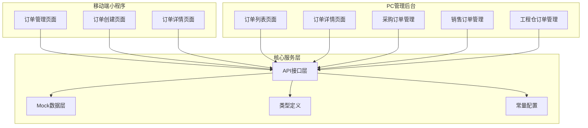
```mermaid
graph TB
subgraph "移动端小程序"
MP_Order[订单管理页面]
MP_Create[订单创建页面]
MP_Detail[订单详情页面]
end
subgraph "PC管理后台"
PC_List[订单列表页面]
PC_Detail[订单详情页面]
PC_Purchase[采购订单管理]
PC_Sale[销售订单管理]
PC_Warehouse[工程仓订单管理]
end
subgraph "核心服务层"
API[API接口层]
Mock[Mock数据层]
Types[类型定义]
Constants[常量配置]
end
MP_Order --> API
MP_Create --> API
MP_Detail --> API
PC_List --> API
PC_Detail --> API
PC_Purchase --> API
PC_Sale --> API
PC_Warehouse --> API
API --> Mock
API --> Types
API --> Constants
```

**图表来源**
- [index.vue:1-800](file://apps/mp/src/pages/order/index.vue#L1-L800)
- [index.vue:1-197](file://apps/pc/src/views/order/list/index.vue#L1-L197)
- [order.ts:1-156](file://packages/api/src/order.ts#L1-L156)

**章节来源**
- [index.vue:1-800](file://apps/mp/src/pages/order/index.vue#L1-L800)
- [index.vue:1-197](file://apps/pc/src/views/order/list/index.vue#L1-L197)
- [order.ts:1-156](file://packages/api/src/order.ts#L1-L156)

## 核心组件

### 数据模型设计

订单模块采用统一的数据模型设计，确保不同界面间的数据一致性：

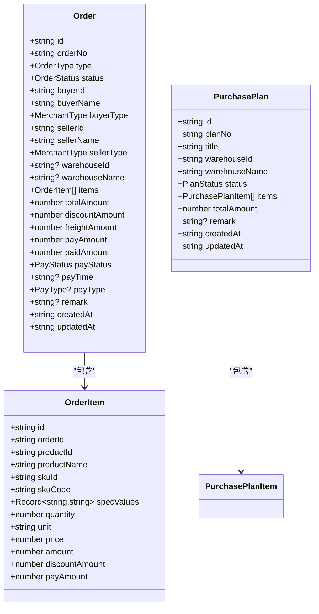
```mermaid
classDiagram
class Order {
+string id
+string orderNo
+OrderType type
+OrderStatus status
+string buyerId
+string buyerName
+MerchantType buyerType
+string sellerId
+string sellerName
+MerchantType sellerType
+string? warehouseId
+string? warehouseName
+OrderItem[] items
+number totalAmount
+number discountAmount
+number freightAmount
+number payAmount
+number paidAmount
+PayStatus payStatus
+string? payTime
+PayType? payType
+string? remark
+string createdAt
+string updatedAt
}
class OrderItem {
+string id
+string orderId
+string productId
+string productName
+string skuId
+string skuCode
+Record~string,string~ specValues
+number quantity
+string unit
+number price
+number amount
+number discountAmount
+number payAmount
}
class PurchasePlan {
+string id
+string planNo
+string title
+string warehouseId
+string warehouseName
+PlanStatus status
+PurchasePlanItem[] items
+number totalAmount
+string? remark
+string createdAt
+string updatedAt
}
Order --> OrderItem : "包含"
PurchasePlan --> PurchasePlanItem : "包含"
```

**图表来源**
- [order.ts:3-124](file://packages/types/src/order.ts#L3-L124)

### 订单状态管理

订单模块实现了完整的状态机设计，支持多种业务场景：

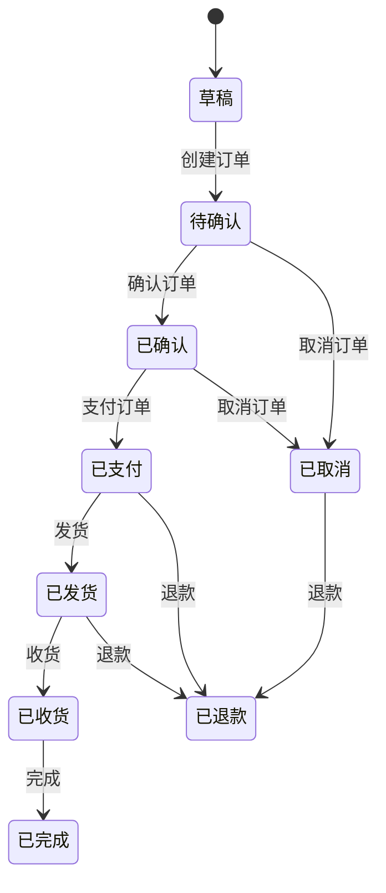
```mermaid
stateDiagram-v2
[*] --> 草稿
草稿 --> 待确认 : 创建订单
待确认 --> 已确认 : 确认订单
待确认 --> 已取消 : 取消订单
已确认 --> 已支付 : 支付订单
已确认 --> 已取消 : 取消订单
已支付 --> 已发货 : 发货
已发货 --> 已收货 : 收货
已收货 --> 已完成 : 完成
已支付 --> 已退款 : 退款
已发货 --> 已退款 : 退款
已取消 --> 已退款 : 退款
```

**图表来源**
- [order.ts:53-63](file://packages/types/src/order.ts#L53-L63)
- [order.ts:10-32](file://packages/constants/src/order.ts#L10-L32)

**章节来源**
- [order.ts:1-124](file://packages/types/src/order.ts#L1-L124)
- [order.ts:1-57](file://packages/constants/src/order.ts#L1-L57)

## 架构概览

### 整体架构设计

工程仓订单模块采用分层架构设计，确保各层职责清晰、耦合度低：

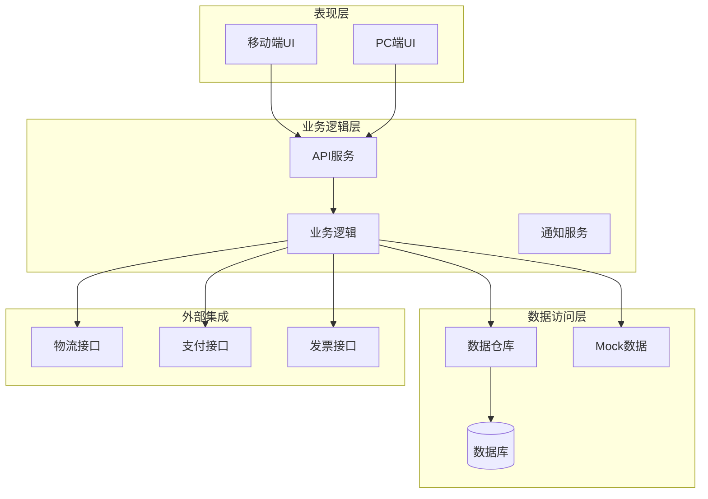
```mermaid
graph TB
subgraph "表现层"
UI_Mobile[移动端UI]
UI_PC[PC端UI]
end
subgraph "业务逻辑层"
Service_API[API服务]
Service_Business[业务逻辑]
Service_Notification[通知服务]
end
subgraph "数据访问层"
Data_Repository[数据仓库]
Data_Mock[Mock数据]
Data_DB[(数据库)]
end
subgraph "外部集成"
External_Logistics[物流接口]
External_Payment[支付接口]
External_Invoice[发票接口]
end
UI_Mobile --> Service_API
UI_PC --> Service_API
Service_API --> Service_Business
Service_Business --> Data_Repository
Service_Business --> Data_Mock
Data_Repository --> Data_DB
Service_Business --> External_Logistics
Service_Business --> External_Payment
Service_Business --> External_Invoice
```

**图表来源**
- [order.ts:1-156](file://packages/api/src/order.ts#L1-L156)
- [index.vue:1-800](file://apps/pc/src/views/order/detail/index.vue#L1-L800)

### 接口设计模式

API层采用统一的接口设计模式，提供标准化的订单操作接口：

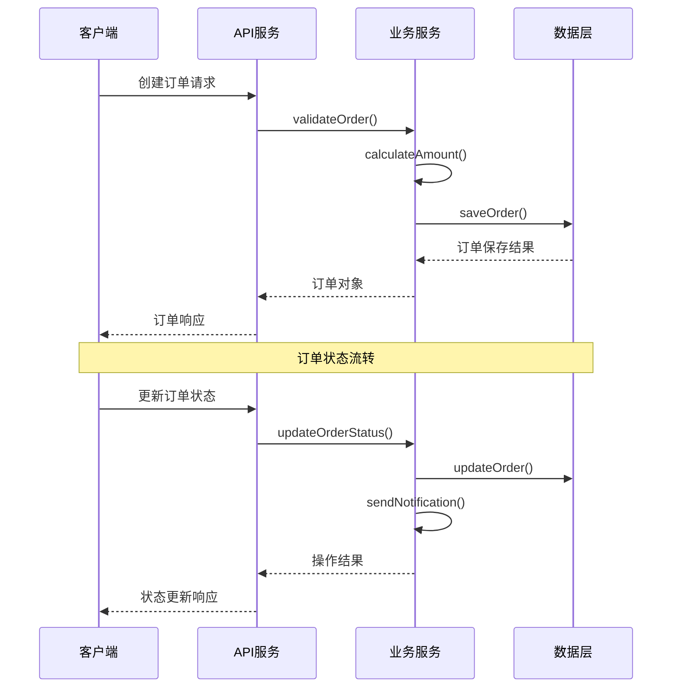
```mermaid
sequenceDiagram
participant Client as 客户端
participant API as API服务
participant Service as 业务服务
participant Data as 数据层
Client->>API : 创建订单请求
API->>Service : validateOrder()
Service->>Service : calculateAmount()
Service->>Data : saveOrder()
Data-->>Service : 订单保存结果
Service-->>API : 订单对象
API-->>Client : 订单响应
Note over Client,Data : 订单状态流转
Client->>API : 更新订单状态
API->>Service : updateOrderStatus()
Service->>Data : updateOrder()
Service->>Service : sendNotification()
Service-->>API : 操作结果
API-->>Client : 状态更新响应
```

**图表来源**
- [order.ts:30-97](file://packages/api/src/order.ts#L30-L97)

**章节来源**
- [order.ts:1-156](file://packages/api/src/order.ts#L1-L156)

## 详细组件分析

### 订单管理界面

#### 移动端订单管理

移动端提供了完整的订单管理体验，支持订单的创建、查询、详情查看和状态操作：

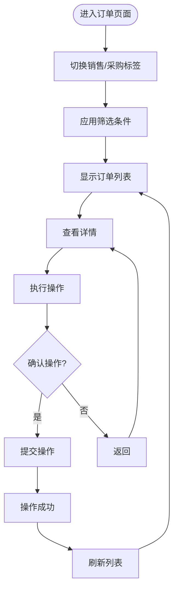
```mermaid
flowchart TD
Start([进入订单页面]) --> Tab[切换销售/采购标签]
Tab --> Filter[应用筛选条件]
Filter --> List[显示订单列表]
List --> Detail[查看详情]
Detail --> Action[执行操作]
Action --> Confirm{确认操作?}
Confirm --> |是| Submit[提交操作]
Confirm --> |否| Back[返回]
Submit --> Success[操作成功]
Success --> Refresh[刷新列表]
Back --> Detail
Refresh --> List
```

**图表来源**
- [index.vue:365-399](file://apps/mp/src/pages/order/index.vue#L365-L399)

#### PC端订单管理

PC端提供了更丰富的订单管理功能，包括批量操作、高级筛选和统计分析：

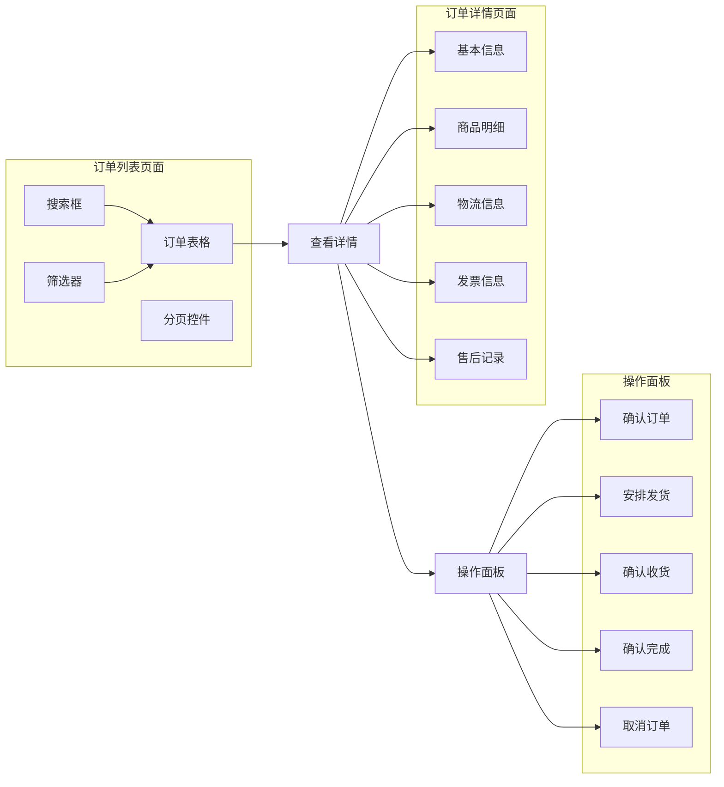
```mermaid
graph LR
subgraph "订单列表页面"
Search[搜索框]
Filter[筛选器]
Table[订单表格]
Pagination[分页控件]
end
subgraph "订单详情页面"
Info[基本信息]
Products[商品明细]
Logistics[物流信息]
Invoice[发票信息]
AfterSale[售后记录]
end
subgraph "操作面板"
Confirm[确认订单]
Ship[安排发货]
Receive[确认收货]
Complete[确认完成]
Cancel[取消订单]
end
Search --> Table
Filter --> Table
Table --> Detail[查看详情]
Detail --> Info
Detail --> Products
Detail --> Logistics
Detail --> Invoice
Detail --> AfterSale
Detail --> Action[操作面板]
Action --> Confirm
Action --> Ship
Action --> Receive
Action --> Complete
Action --> Cancel
```

**图表来源**
- [index.vue:31-80](file://apps/pc/src/views/order/list/index.vue#L31-L80)
- [index.vue:1-800](file://apps/pc/src/views/order/detail/index.vue#L1-L800)

**章节来源**
- [index.vue:1-800](file://apps/mp/src/pages/order/index.vue#L1-L800)
- [index.vue:1-197](file://apps/pc/src/views/order/list/index.vue#L1-L197)
- [index.vue:1-800](file://apps/pc/src/views/order/detail/index.vue#L1-L800)

### 订单创建流程

#### 采购订单创建

工程仓采购订单创建流程支持多步骤操作，确保订单信息的准确性：

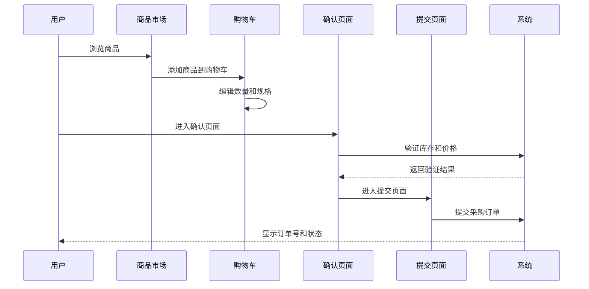
```mermaid
sequenceDiagram
participant User as 用户
participant Market as 商品市场
participant Cart as 购物车
participant Confirm as 确认页面
participant Submit as 提交页面
participant System as 系统
User->>Market : 浏览商品
Market->>Cart : 添加商品到购物车
Cart->>Cart : 编辑数量和规格
User->>Confirm : 进入确认页面
Confirm->>System : 验证库存和价格
System-->>Confirm : 返回验证结果
Confirm->>Submit : 进入提交页面
Submit->>System : 提交采购订单
System-->>User : 显示订单号和状态
```

**图表来源**
- [create.vue:17-190](file://apps/pc/src/views/warehouse/order/purchase/create.vue#L17-L190)

#### 销售订单创建

销售订单创建流程针对工程仓的销售特点进行了优化：

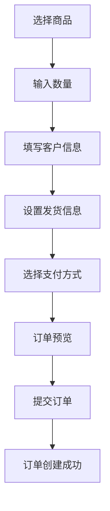
```mermaid
flowchart TD
ProductSelection[选择商品] --> QuantityInput[输入数量]
QuantityInput --> CustomerInfo[填写客户信息]
CustomerInfo --> DeliveryInfo[设置发货信息]
DeliveryInfo --> PaymentInfo[选择支付方式]
PaymentInfo --> Review[订单预览]
Review --> Submit[提交订单]
Submit --> Success[订单创建成功]
```

**图表来源**
- [create.vue:211-322](file://apps/pc/src/views/warehouse/order/purchase/create.vue#L211-L322)

**章节来源**
- [create.vue:1-468](file://apps/pc/src/views/warehouse/order/purchase/create.vue#L1-L468)

### 订单状态流转

#### 采购订单状态流转

采购订单从创建到完成的完整状态流转过程：

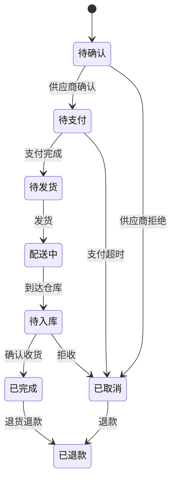
```mermaid
stateDiagram-v2
[*] --> 待确认
待确认 --> 待支付 : 供应商确认
待确认 --> 已取消 : 供应商拒绝
待支付 --> 待发货 : 支付完成
待支付 --> 已取消 : 支付超时
待发货 --> 配送中 : 发货
配送中 --> 待入库 : 到达仓库
待入库 --> 已完成 : 确认收货
待入库 --> 已取消 : 拒收
已完成 --> 已退款 : 退货退款
已取消 --> 已退款 : 退款
```

**图表来源**
- [index.vue:128-141](file://apps/pc/src/views/order/purchase/index.vue#L128-L141)

#### 销售订单状态流转

销售订单从下单到完成的完整状态流转过程：

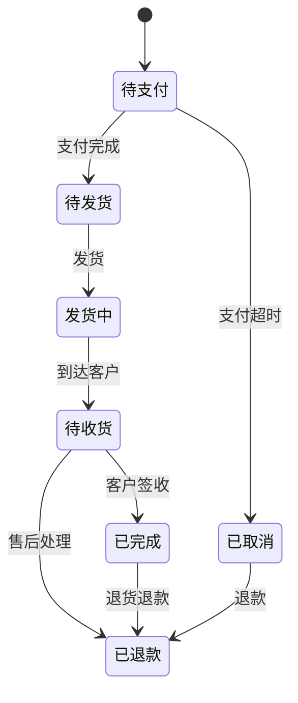
```mermaid
stateDiagram-v2
[*] --> 待支付
待支付 --> 待发货 : 支付完成
待支付 --> 已取消 : 支付超时
待发货 --> 发货中 : 发货
发货中 --> 待收货 : 到达客户
待收货 --> 已完成 : 客户签收
待收货 --> 已退款 : 售后处理
已完成 --> 已退款 : 退货退款
已取消 --> 已退款 : 退款
```

**图表来源**
- [index.vue:197-209](file://apps/pc/src/views/order/sale/index.vue#L197-L209)

**章节来源**
- [index.vue:1-402](file://apps/pc/src/views/order/purchase/index.vue#L1-L402)
- [index.vue:1-547](file://apps/pc/src/views/order/sale/index.vue#L1-L547)

### 订单查询筛选

#### 多维度查询功能

订单模块提供了丰富的查询筛选功能，支持多维度的数据检索：

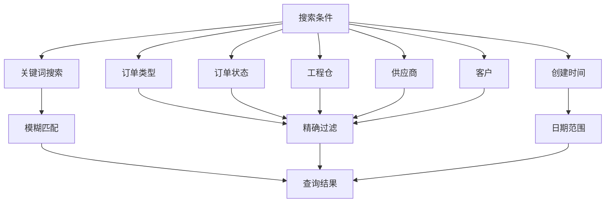
```mermaid
graph TD
Search[搜索条件] --> Keyword[关键词搜索]
Search --> Type[订单类型]
Search --> Status[订单状态]
Search --> Date[创建时间]
Search --> Warehouse[工程仓]
Search --> Supplier[供应商]
Search --> Customer[客户]
Keyword --> Match[模糊匹配]
Type --> Filter[精确过滤]
Status --> Filter
Date --> Range[日期范围]
Warehouse --> Filter
Supplier --> Filter
Customer --> Filter
Match --> Result[查询结果]
Filter --> Result
Range --> Result
```

**图表来源**
- [index.vue:6-23](file://apps/pc/src/views/order/list/index.vue#L6-L23)

#### 实时筛选机制

移动端实现了高效的实时筛选机制，提供流畅的用户体验：

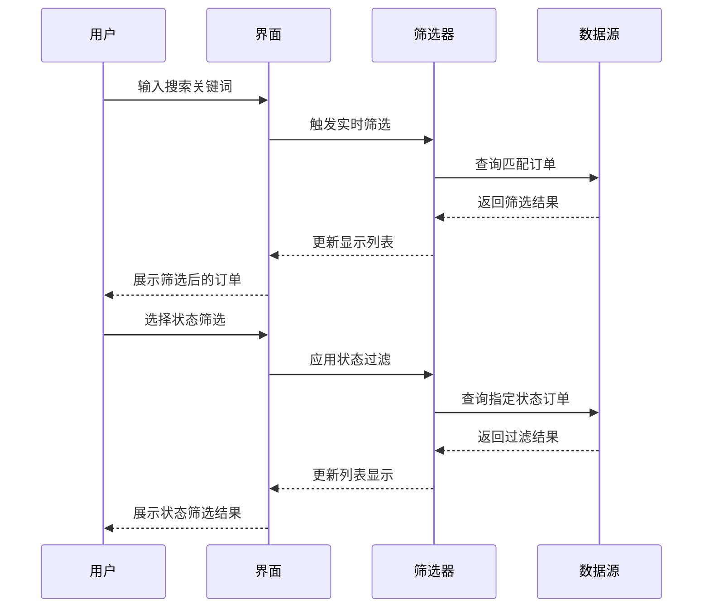
```mermaid
sequenceDiagram
participant User as 用户
participant UI as 界面
participant Filter as 筛选器
participant Data as 数据源
User->>UI : 输入搜索关键词
UI->>Filter : 触发实时筛选
Filter->>Data : 查询匹配订单
Data-->>Filter : 返回筛选结果
Filter-->>UI : 更新显示列表
UI-->>User : 展示筛选后的订单
User->>UI : 选择状态筛选
UI->>Filter : 应用状态过滤
Filter->>Data : 查询指定状态订单
Data-->>Filter : 返回过滤结果
Filter-->>UI : 更新列表显示
UI-->>User : 展示状态筛选结果
```

**图表来源**
- [index.vue:365-399](file://apps/mp/src/pages/order/index.vue#L365-L399)

**章节来源**
- [index.vue:1-197](file://apps/pc/src/views/order/list/index.vue#L1-L197)
- [index.vue:1-800](file://apps/mp/src/pages/order/index.vue#L1-L800)

### 订单修改撤回

#### 订单修改机制

订单模块支持在特定状态下对订单进行修改操作：

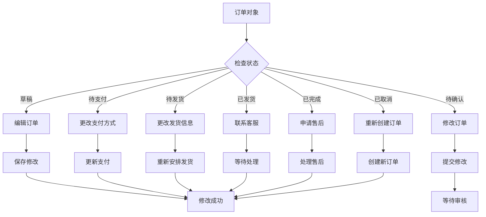
```mermaid
flowchart TD
Order[订单对象] --> CheckStatus{检查状态}
CheckStatus --> |草稿| Edit[编辑订单]
CheckStatus --> |待确认| Modify[修改订单]
CheckStatus --> |待支付| ChangePayment[更改支付方式]
CheckStatus --> |待发货| ChangeDelivery[更改发货信息]
CheckStatus --> |已发货| ContactService[联系客服]
CheckStatus --> |已完成| AfterSale[申请售后]
CheckStatus --> |已取消| Recreate[重新创建订单]
Edit --> Save[保存修改]
Modify --> Submit[提交修改]
ChangePayment --> Update[更新支付]
ChangeDelivery --> Reschedule[重新安排发货]
ContactService --> Wait[等待处理]
AfterSale --> Process[处理售后]
Recreate --> NewOrder[创建新订单]
Save --> Success[修改成功]
Submit --> Pending[等待审核]
Update --> Success
Reschedule --> Success
Wait --> Success
Process --> Success
NewOrder --> Success
```

**图表来源**
- [detail.vue:17-35](file://apps/pc/src/views/order/detail/index.vue#L17-L35)

#### 订单撤回流程

订单撤回需要满足特定的业务条件和权限要求：

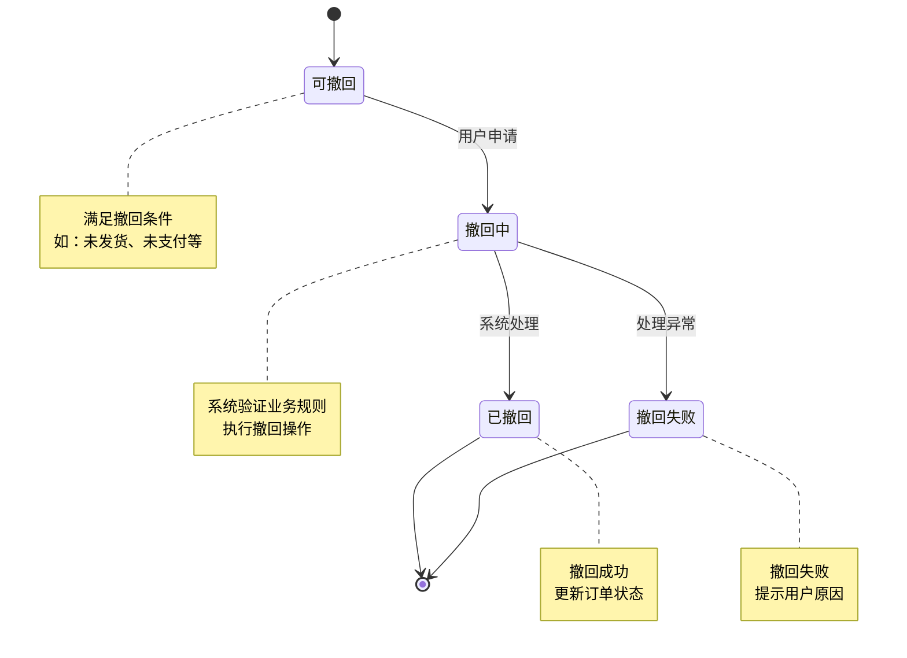
```mermaid
stateDiagram-v2
[*] --> 可撤回
可撤回 --> 撤回中 : 用户申请
撤回中 --> 已撤回 : 系统处理
撤回中 --> 撤回失败 : 处理异常
已撤回 --> [*]
撤回失败 --> [*]
note right of 可撤回 : 满足撤回条件<br/>如：未发货、未支付等
note right of 撤回中 : 系统验证业务规则<br/>执行撤回操作
note right of 已撤回 : 撤回成功<br/>更新订单状态
note right of 撤回失败 : 撤回失败<br/>提示用户原因
```

**图表来源**
- [detail.vue:32-35](file://apps/pc/src/views/order/detail/index.vue#L32-L35)

**章节来源**
- [detail.vue:1-800](file://apps/pc/src/views/order/detail/index.vue#L1-L800)

### 订单统计分析

#### 多维度统计功能

订单模块提供了丰富的统计分析功能，支持多维度的数据分析：

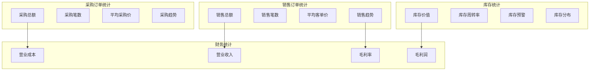
```mermaid
graph TB
subgraph "销售订单统计"
SalesTotal[销售总额]
SalesCount[销售笔数]
SalesAvg[平均客单价]
SalesTrend[销售趋势]
end
subgraph "采购订单统计"
PurchaseTotal[采购总额]
PurchaseCount[采购笔数]
PurchaseAvg[平均采购价]
PurchaseTrend[采购趋势]
end
subgraph "库存统计"
StockValue[库存价值]
StockAge[库存周转率]
StockAlert[库存预警]
StockLocation[库存分布]
end
subgraph "财务统计"
Revenue[营业收入]
Cost[营业成本]
Profit[毛利润]
ProfitMargin[毛利率]
end
SalesTotal --> Revenue
PurchaseTotal --> Cost
StockValue --> Profit
SalesTrend --> ProfitMargin
```

**图表来源**
- [index.vue:258-368](file://apps/pc/src/views/order/sale/index.vue#L258-L368)

#### 实时数据展示

通过可视化图表展示关键指标，帮助用户快速了解业务状况：

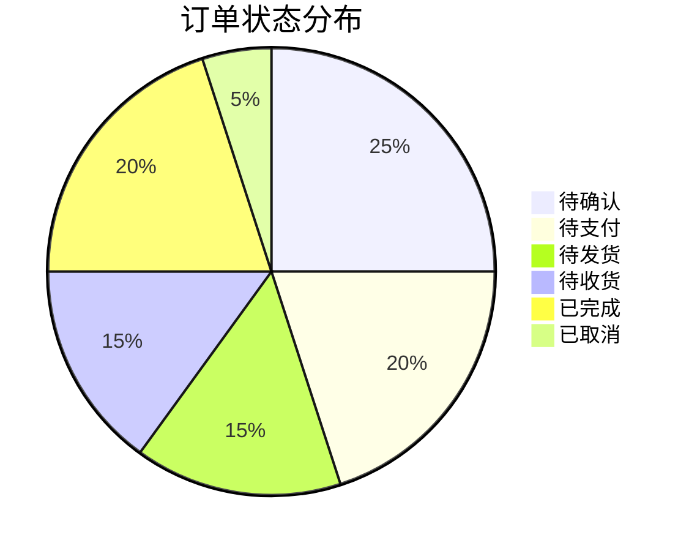
```mermaid
pie title 订单状态分布
"待确认" : 25
"待支付" : 20
"待发货" : 15
"待收货" : 15
"已完成" : 20
"已取消" : 5
```

**图表来源**
- [index.vue:260-270](file://apps/pc/src/views/order/purchase/index.vue#L260-L270)

**章节来源**
- [index.vue:1-547](file://apps/pc/src/views/order/sale/index.vue#L1-L547)
- [index.vue:1-402](file://apps/pc/src/views/order/purchase/index.vue#L1-L402)

## 依赖关系分析

### 组件耦合度分析

工程仓订单模块的组件设计遵循高内聚、低耦合的原则：

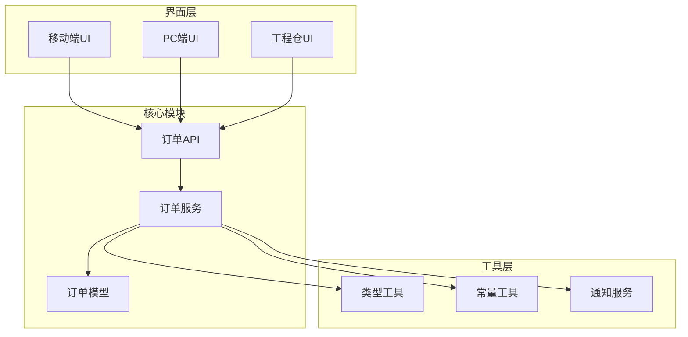
```mermaid
graph TB
subgraph "核心模块"
OrderModel[订单模型]
OrderService[订单服务]
OrderAPI[订单API]
end
subgraph "界面层"
MobileUI[移动端UI]
PCUI[PC端UI]
WarehouseUI[工程仓UI]
end
subgraph "工具层"
TypeUtils[类型工具]
ConstantUtils[常量工具]
Notification[通知服务]
end
MobileUI --> OrderAPI
PCUI --> OrderAPI
WarehouseUI --> OrderAPI
OrderAPI --> OrderService
OrderService --> OrderModel
OrderService --> TypeUtils
OrderService --> ConstantUtils
OrderService --> Notification
```

**图表来源**
- [order.ts:1-124](file://packages/types/src/order.ts#L1-L124)
- [order.ts:1-57](file://packages/constants/src/order.ts#L1-L57)

### 外部依赖集成

订单模块集成了多个外部服务，提供完整的业务功能：

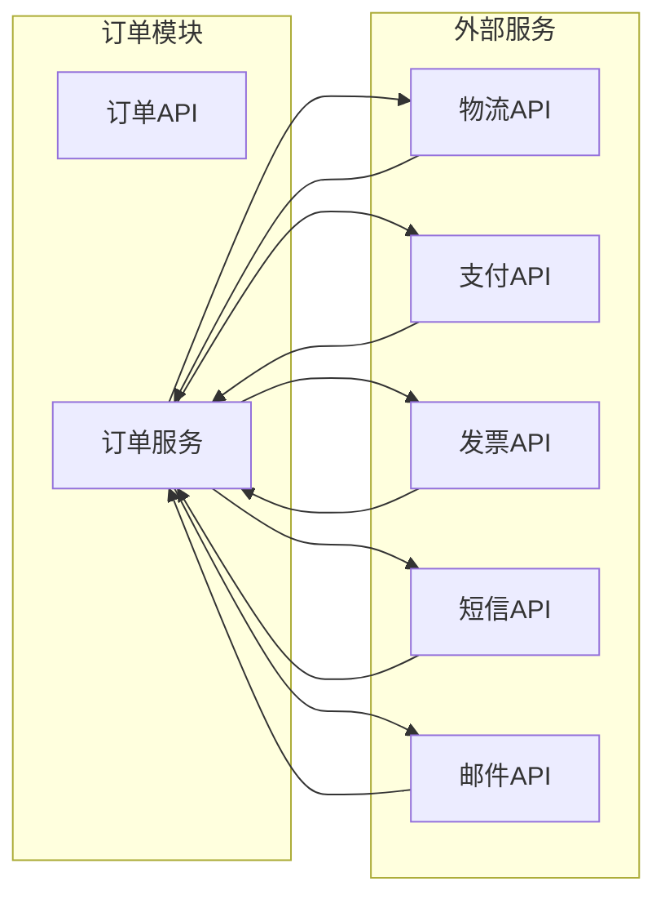
```mermaid
graph LR
subgraph "订单模块"
OrderAPI[订单API]
OrderService[订单服务]
end
subgraph "外部服务"
LogisticsAPI[物流API]
PaymentAPI[支付API]
InvoiceAPI[发票API]
SMSAPI[短信API]
EmailAPI[邮件API]
end
OrderService --> LogisticsAPI
OrderService --> PaymentAPI
OrderService --> InvoiceAPI
OrderService --> SMSAPI
OrderService --> EmailAPI
LogisticsAPI --> OrderService
PaymentAPI --> OrderService
InvoiceAPI --> OrderService
SMSAPI --> OrderService
EmailAPI --> OrderService
```

**图表来源**
- [order.ts:1-156](file://packages/api/src/order.ts#L1-L156)

**章节来源**
- [order.ts:1-156](file://packages/api/src/order.ts#L1-L156)
- [order.ts:1-124](file://packages/types/src/order.ts#L1-L124)

## 性能考虑

### 数据加载优化

订单模块采用了多种性能优化策略：

1. **分页加载**：大列表数据采用分页加载，减少一次性数据传输量
2. **缓存机制**：常用数据采用本地缓存，提升页面响应速度
3. **懒加载**：详情页面采用懒加载，只在需要时加载详细数据
4. **虚拟滚动**：长列表采用虚拟滚动技术，提升渲染性能

### 状态管理优化

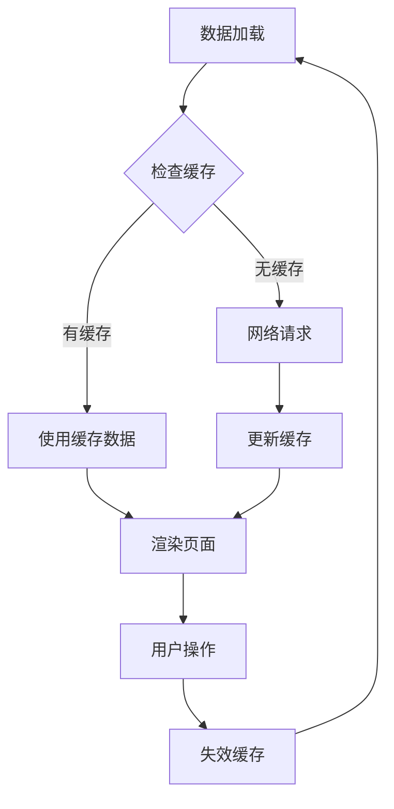
```mermaid
flowchart TD
DataLoad[数据加载] --> CacheCheck{检查缓存}
CacheCheck --> |有缓存| UseCache[使用缓存数据]
CacheCheck --> |无缓存| NetworkLoad[网络请求]
NetworkLoad --> UpdateCache[更新缓存]
UseCache --> Render[渲染页面]
UpdateCache --> Render
Render --> UserAction[用户操作]
UserAction --> InvalidateCache[失效缓存]
InvalidateCache --> DataLoad
```

### 并发控制

订单模块实现了合理的并发控制机制：

- **请求去重**：相同请求在执行期间会被去重
- **并发限制**：限制同时进行的请求数量
- **错误重试**：网络异常时自动重试
- **超时处理**：设置合理的请求超时时间

## 故障排除指南

### 常见问题诊断

#### 订单状态异常

当遇到订单状态异常时，可以按照以下步骤进行排查：

1. **检查网络连接**：确认网络连接正常
2. **验证权限**：确认当前用户具有相应操作权限
3. **查看日志**：检查系统日志中的错误信息
4. **重试操作**：尝试重新执行操作

#### 数据同步问题

```mermaid
flowchart TD
SyncIssue[数据同步问题] --> CheckNetwork{检查网络}
CheckNetwork --> |正常| CheckServer{检查服务器}
CheckNetwork --> |异常| FixNetwork[修复网络]
CheckServer --> |正常| CheckCache{检查缓存}
CheckServer --> |异常| FixServer[修复服务器]
CheckCache --> ClearCache[清理缓存]
ClearCache --> RetrySync[重试同步]
FixNetwork --> RetrySync
FixServer --> RetrySync
RetrySync --> SyncOK[同步成功]
```

#### 性能问题排查

- **监控页面加载时间**：使用浏览器开发者工具监控页面加载性能
- **检查API响应时间**：监控各个API接口的响应时间
- **分析内存使用**：检查是否存在内存泄漏
- **优化图片资源**：压缩和懒加载图片资源

**章节来源**
- [order.ts:14-28](file://packages/api/src/order.ts#L14-L28)

### 异常处理流程

订单模块实现了完善的异常处理机制：

```mermaid
sequenceDiagram
participant User as 用户
participant UI as 界面
participant Service as 服务层
participant API as API层
participant Error as 错误处理
User->>UI : 触发操作
UI->>Service : 调用业务方法
Service->>API : 发起API请求
API->>Error : 检查请求有效性
Error->>API : 验证参数
API->>API : 执行业务逻辑
API-->>Service : 返回结果或错误
Service->>Error : 处理异常情况
Error-->>UI : 显示错误信息
UI-->>User : 提示用户操作结果
```

## 结论

工程仓订单模块通过精心设计的架构和完善的业务逻辑，为工程供应链管理提供了强大的订单管理能力。模块具有以下特点：

1. **完整的业务覆盖**：涵盖采购订单和销售订单的全生命周期管理
2. **灵活的状态管理**：支持复杂的业务状态流转和权限控制
3. **优秀的用户体验**：提供直观易用的界面和流畅的操作体验
4. **强大的扩展性**：模块化设计便于功能扩展和维护
5. **完善的异常处理**：提供健壮的错误处理和恢复机制

通过本文档的详细说明，开发者可以更好地理解和使用工程仓订单模块，为后续的功能扩展和维护工作奠定坚实基础。建议在实际开发中重点关注数据一致性、性能优化和用户体验三个方面，持续改进系统的稳定性和可用性。