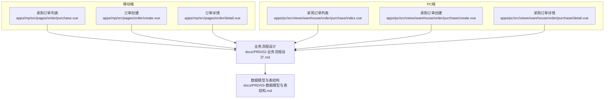
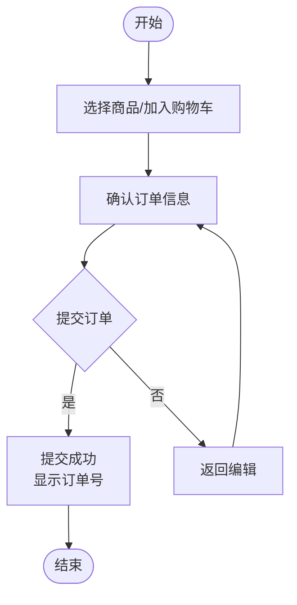
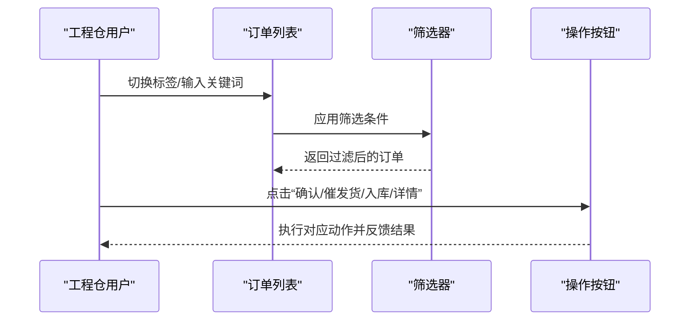
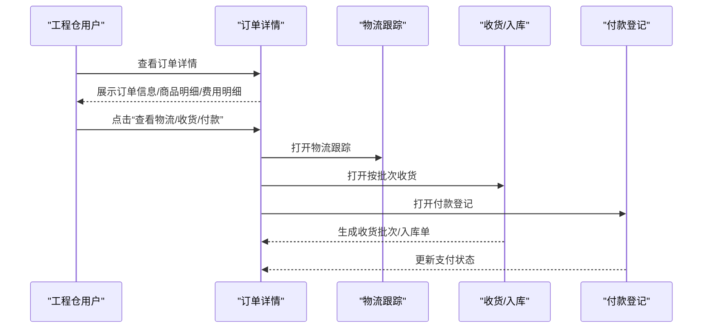
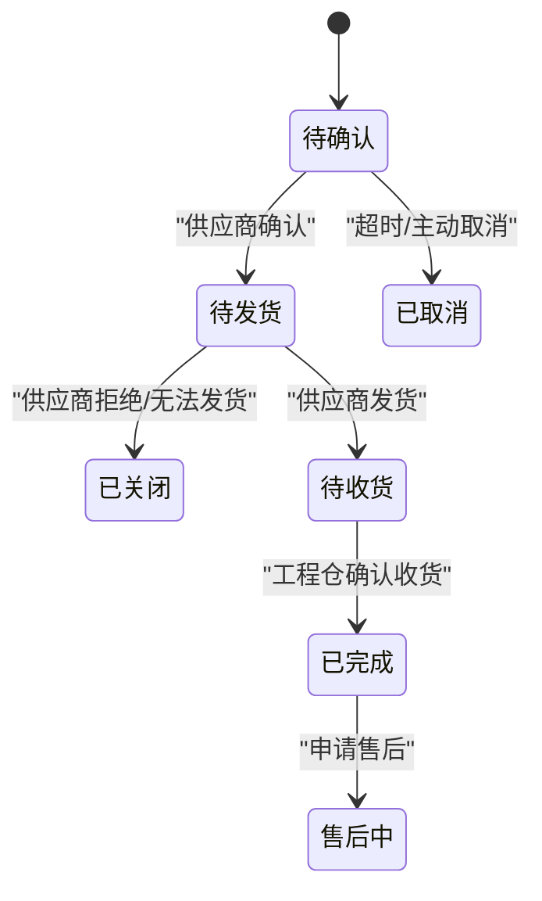
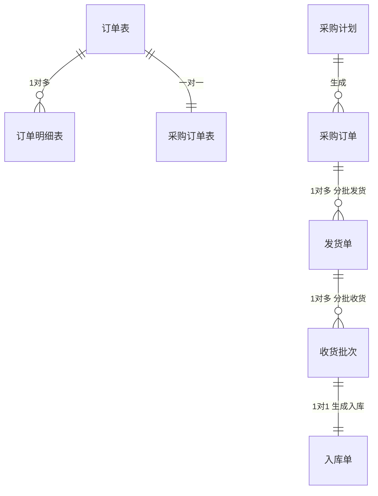
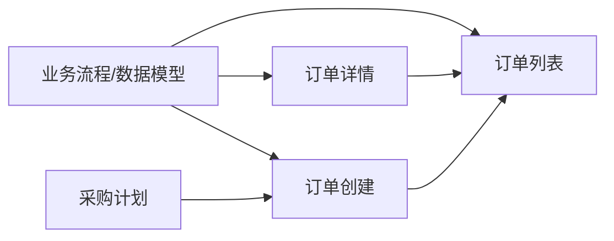

# 工程仓采购订单管理

<cite>
**本文引用的文件**
- [apps/mp/src/pages/order/purchase.vue](file://apps/mp/src/pages/order/purchase.vue)
- [apps/mp/src/pages/order/create.vue](file://apps/mp/src/pages/order/create.vue)
- [apps/mp/src/pages/order/detail.vue](file://apps/mp/src/pages/order/detail.vue)
- [apps/pc/src/views/warehouse/order/purchase/index.vue](file://apps/pc/src/views/warehouse/order/purchase/index.vue)
- [apps/pc/src/views/warehouse/order/purchase/create.vue](file://apps/pc/src/views/warehouse/order/purchase/create.vue)
- [apps/pc/src/views/warehouse/order/purchase/detail.vue](file://apps/pc/src/views/warehouse/order/purchase/detail.vue)
- [docs/PRD/02-业务流程设计.md](file://docs/PRD/02-业务流程设计.md)
- [docs/PRD/03-数据模型与表结构.md](file://docs/PRD/03-数据模型与表结构.md)
- [apps/mp/src/pages/index/index.vue](file://apps/mp/src/pages/index/index.vue)
- [apps/pc/src/views/warehouse/plan/index.vue](file://apps/pc/src/views/warehouse/plan/index.vue)
</cite>

## 目录
1. [简介](#简介)
2. [项目结构](#项目结构)
3. [核心组件](#核心组件)
4. [架构总览](#架构总览)
5. [详细组件分析](#详细组件分析)
6. [依赖分析](#依赖分析)
7. [性能考虑](#性能考虑)
8. [故障排查指南](#故障排查指南)
9. [结论](#结论)
10. [附录](#附录)

## 简介
本文件面向工程仓采购订单管理，系统性阐述从商品选择、购物车管理、订单确认到提交成功的完整业务流程；覆盖订单列表查询筛选、状态跟踪与操作；以及订单详情查看（订单信息、商品明细、费用明细、状态流转）等关键能力。文档还包含状态机设计、数据模型、通知机制等核心概念，并提供操作指南、常见问题处理与最佳实践，帮助工程仓用户高效完成采购作业。

## 项目结构
工程仓采购订单相关页面分布在移动端与PC端两套界面中：
- 移动端（小程序）：订单列表、订单创建、订单详情
- PC端（工程仓后台）：订单列表、订单创建、订单详情、计划到订单的联动



图表来源
- [apps/mp/src/pages/order/purchase.vue:1-598](file://apps/mp/src/pages/order/purchase.vue#L1-L598)
- [apps/mp/src/pages/order/create.vue:1-680](file://apps/mp/src/pages/order/create.vue#L1-L680)
- [apps/mp/src/pages/order/detail.vue:1-567](file://apps/mp/src/pages/order/detail.vue#L1-L567)
- [apps/pc/src/views/warehouse/order/purchase/index.vue:1-815](file://apps/pc/src/views/warehouse/order/purchase/index.vue#L1-L815)
- [apps/pc/src/views/warehouse/order/purchase/create.vue:1-468](file://apps/pc/src/views/warehouse/order/purchase/create.vue#L1-L468)
- [apps/pc/src/views/warehouse/order/purchase/detail.vue:1-1497](file://apps/pc/src/views/warehouse/order/purchase/detail.vue#L1-L1497)
- [docs/PRD/02-业务流程设计.md:423-454](file://docs/PRD/02-业务流程设计.md#L423-L454)
- [docs/PRD/03-数据模型与表结构.md:407-455](file://docs/PRD/03-数据模型与表结构.md#L407-L455)

章节来源
- [apps/mp/src/pages/order/purchase.vue:1-598](file://apps/mp/src/pages/order/purchase.vue#L1-L598)
- [apps/pc/src/views/warehouse/order/purchase/index.vue:1-815](file://apps/pc/src/views/warehouse/order/purchase/index.vue#L1-L815)

## 核心组件
- 采购订单列表（移动端/PC端）：支持按状态筛选、关键词搜索、订单操作（确认、催发货、入库、查看详情）
- 采购订单创建（移动端/PC端）：商品选择、购物车管理、订单确认、提交成功
- 采购订单详情（移动端/PC端）：订单信息、商品明细、费用明细、状态流转、物流跟踪、收货/入库、付款登记
- 业务流程与数据模型：支撑状态机、分批发货/收货/支付、批次管理与追溯
- 通知机制：首页待办与通知入口，引导跳转到相应订单状态页面

章节来源
- [apps/mp/src/pages/order/purchase.vue:1-598](file://apps/mp/src/pages/order/purchase.vue#L1-L598)
- [apps/mp/src/pages/order/create.vue:1-680](file://apps/mp/src/pages/order/create.vue#L1-L680)
- [apps/mp/src/pages/order/detail.vue:1-567](file://apps/mp/src/pages/order/detail.vue#L1-L567)
- [apps/pc/src/views/warehouse/order/purchase/index.vue:1-815](file://apps/pc/src/views/warehouse/order/purchase/index.vue#L1-L815)
- [apps/pc/src/views/warehouse/order/purchase/create.vue:1-468](file://apps/pc/src/views/warehouse/order/purchase/create.vue#L1-L468)
- [apps/pc/src/views/warehouse/order/purchase/detail.vue:1-1497](file://apps/pc/src/views/warehouse/order/purchase/detail.vue#L1-L1497)
- [apps/mp/src/pages/index/index.vue:290-337](file://apps/mp/src/pages/index/index.vue#L290-L337)

## 架构总览
工程仓采购订单管理采用“前端页面 + PRD流程/模型”的双层设计：
- 前端页面负责用户交互与状态展示（列表、创建、详情）
- PRD文档提供业务流程与数据模型支撑，确保前后端对齐

```mermaid
sequenceDiagram
participant User as "工程仓用户"
participant List as "采购订单列表"
participant Detail as "订单详情"
participant Create as "订单创建"
participant PRD as "业务流程/数据模型"
User->>List : 查看订单列表
List->>PRD : 依据状态机渲染状态标签
User->>List : 点击“确认/催发货/入库/详情”
List->>Detail : 跳转详情页
Detail->>PRD : 展示状态流转与费用明细
User->>Create : 新建采购订单
Create->>PRD : 商品选择/购物车/确认/提交
PRD-->>Create : 返回订单号与状态
Create-->>User : 提交成功提示
```

图表来源
- [apps/mp/src/pages/order/purchase.vue:1-598](file://apps/mp/src/pages/order/purchase.vue#L1-L598)
- [apps/pc/src/views/warehouse/order/purchase/index.vue:1-815](file://apps/pc/src/views/warehouse/order/purchase/index.vue#L1-L815)
- [apps/pc/src/views/warehouse/order/purchase/create.vue:1-468](file://apps/pc/src/views/warehouse/order/purchase/create.vue#L1-L468)
- [docs/PRD/02-业务流程设计.md:423-454](file://docs/PRD/02-业务流程设计.md#L423-L454)

## 详细组件分析

### 采购订单创建流程（商品选择、购物车管理、订单确认、提交成功）
- 商品选择与购物车
  - 移动端：支持按供应商分组、按类别筛选、输入数量、加入购物车
  - PC端：支持商品市场浏览、分类筛选、数量输入、加入购物车
- 订单确认
  - 移动端：选择收货地址、供应商分组、订单备注、合计金额
  - PC端：选择仓库、期望交货日期、收货地址、联系人、订单备注、费用明细
- 提交成功
  - 移动端：提交后跳转订单列表
  - PC端：提交后进入“提交成功”步骤页，显示订单号并可继续采购



图表来源
- [apps/mp/src/pages/order/create.vue:1-680](file://apps/mp/src/pages/order/create.vue#L1-L680)
- [apps/pc/src/views/warehouse/order/purchase/create.vue:1-468](file://apps/pc/src/views/warehouse/order/purchase/create.vue#L1-L468)

章节来源
- [apps/mp/src/pages/order/create.vue:1-680](file://apps/mp/src/pages/order/create.vue#L1-L680)
- [apps/pc/src/views/warehouse/order/purchase/create.vue:1-468](file://apps/pc/src/views/warehouse/order/purchase/create.vue#L1-L468)

### 采购订单列表管理（查询筛选、状态跟踪、操作）
- 移动端列表
  - 支持“全部/待确认/待发货/待入库/已完成”标签切换
  - 支持关键词搜索（订单号/供应商/商品名称）
  - 每条订单显示供应商、商品缩略图、金额、状态标签、操作按钮（确认/催发货/入库/详情）
- PC端列表
  - 支持“全部/待确认/待发货/待收货/已完成/已取消”标签切换
  - 支持多维筛选（订单编号、供应商、来源、支付状态）
  - 表格展示订单来源、供应商、商品信息、金额、实付金额、支付状态、订单状态、操作（详情/取消/支付/收货）



图表来源
- [apps/mp/src/pages/order/purchase.vue:1-598](file://apps/mp/src/pages/order/purchase.vue#L1-L598)
- [apps/pc/src/views/warehouse/order/purchase/index.vue:1-815](file://apps/pc/src/views/warehouse/order/purchase/index.vue#L1-L815)

章节来源
- [apps/mp/src/pages/order/purchase.vue:1-598](file://apps/mp/src/pages/order/purchase.vue#L1-L598)
- [apps/pc/src/views/warehouse/order/purchase/index.vue:1-815](file://apps/pc/src/views/warehouse/order/purchase/index.vue#L1-L815)

### 采购订单详情查看（订单信息、商品明细、费用明细、状态流转）
- 订单信息：订单编号、下单时间、支付/发货/收货时间、状态标签
- 商品明细：商品名称、规格、单价、数量、小计
- 费用明细：商品金额、运费、优惠、订单总额
- 状态流转：根据状态显示不同操作（确认/取消/支付/收货/查看物流）
- 物流信息：物流公司、物流单号、物流轨迹
- 收货/入库：按发货批次收货、生成收货批次与入库单
- 付款登记：支持分批支付，上传凭证，查看付款记录



图表来源
- [apps/mp/src/pages/order/detail.vue:1-567](file://apps/mp/src/pages/order/detail.vue#L1-L567)
- [apps/pc/src/views/warehouse/order/purchase/detail.vue:1-1497](file://apps/pc/src/views/warehouse/order/purchase/detail.vue#L1-L1497)

章节来源
- [apps/mp/src/pages/order/detail.vue:1-567](file://apps/mp/src/pages/order/detail.vue#L1-L567)
- [apps/pc/src/views/warehouse/order/purchase/detail.vue:1-1497](file://apps/pc/src/views/warehouse/order/purchase/detail.vue#L1-L1497)

### 采购订单状态机设计
- 状态集合（工程仓视角）：待确认、待发货、待收货、已完成、已取消、已关闭、售后中
- 关键流转
  - 待确认 → 待发货：供应商确认订单
  - 待发货 → 已关闭：供应商拒绝/无法发货
  - 待发货 → 待收货：供应商发货
  - 待收货 → 已完成：工程仓确认收货
  - 已完成 → 售后中：申请售后
- 支付与发货解耦：支持分批支付与分批发货，状态独立演进



图表来源
- [docs/PRD/02-业务流程设计.md:423-454](file://docs/PRD/02-业务流程设计.md#L423-L454)

章节来源
- [docs/PRD/02-业务流程设计.md:423-454](file://docs/PRD/02-业务流程设计.md#L423-L454)

### 采购订单数据模型
- 订单表（order）：包含订单号、买方/卖方/项目、订单类型、金额、状态、支付状态、收货状态、联系方式、备注、时间戳等
- 订单明细表（order_item）：订单与SKU的明细映射，含单价、数量、金额、状态
- 采购订单表（purchase_order）：扩展字段如仓库、预计交货日期、供应商备注
- 与计划到订单的关联：采购计划生成采购订单，支持分批发货/收货/支付



图表来源
- [docs/PRD/03-数据模型与表结构.md:407-455](file://docs/PRD/03-数据模型与表结构.md#L407-L455)
- [apps/pc/src/views/warehouse/plan/index.vue:282-312](file://apps/pc/src/views/warehouse/plan/index.vue#L282-L312)

章节来源
- [docs/PRD/03-数据模型与表结构.md:407-455](file://docs/PRD/03-数据模型与表结构.md#L407-L455)
- [apps/pc/src/views/warehouse/plan/index.vue:282-312](file://apps/pc/src/views/warehouse/plan/index.vue#L282-L312)

### 采购订单通知机制
- 首页待办与通知入口：根据不同类型（订单、库存、财务）跳转到相应页面
- 通知类型与跳转：
  - 订单：待发货提醒 → 销售订单待发货；采购订单状态 → 采购订单列表
  - 库存：库存预警 → 库存预警页面；否则 → 库存页面
  - 财务：开票提醒 → 发票页面；否则 → 资金托管页面
- 作用：提升用户对关键任务的可见性与响应效率

章节来源
- [apps/mp/src/pages/index/index.vue:290-337](file://apps/mp/src/pages/index/index.vue#L290-L337)

## 依赖分析
- 页面与PRD的耦合
  - 列表与详情页面严格遵循PRD中的状态机与流程，确保用户理解一致
- 页面间依赖
  - 列表页作为入口，详情页承载状态流转与操作
  - 创建页与详情页共享状态机与数据模型
- 外部依赖
  - 与计划模块的集成：计划生成订单，支持分批发货/收货/支付
  - 与物流/财务模块的集成：物流跟踪、付款登记、凭证上传



图表来源
- [docs/PRD/02-业务流程设计.md:423-454](file://docs/PRD/02-业务流程设计.md#L423-L454)
- [docs/PRD/03-数据模型与表结构.md:407-455](file://docs/PRD/03-数据模型与表结构.md#L407-L455)
- [apps/pc/src/views/warehouse/plan/index.vue:282-312](file://apps/pc/src/views/warehouse/plan/index.vue#L282-L312)

章节来源
- [apps/pc/src/views/warehouse/order/purchase/index.vue:1-815](file://apps/pc/src/views/warehouse/order/purchase/index.vue#L1-L815)
- [apps/pc/src/views/warehouse/order/purchase/create.vue:1-468](file://apps/pc/src/views/warehouse/order/purchase/create.vue#L1-L468)
- [apps/pc/src/views/warehouse/order/purchase/detail.vue:1-1497](file://apps/pc/src/views/warehouse/order/purchase/detail.vue#L1-L1497)

## 性能考虑
- 列表渲染优化
  - 使用虚拟滚动/分页减少DOM压力（PC端已内置分页）
  - 状态标签颜色与文案预计算，避免重复计算
- 数据加载
  - 列表与详情按需加载，避免一次性拉取过多数据
- 交互反馈
  - 提交/支付/收货等关键操作使用加载提示与成功提示，减少无效重试

## 故障排查指南
- 订单状态异常
  - 确认供应商是否已确认/发货；若长时间未更新，可通过“催发货”提醒
  - 若供应商拒绝/无法发货，订单应进入“已关闭”，需重新下单或调整计划
- 支付问题
  - 分批支付需确保每笔金额与凭证正确上传；若支付状态异常，检查凭证与金额匹配
- 收货问题
  - 分批发货/收货需核对发货单与收货单；若存在差异，可在收货环节补充货损信息
- 通知未到达
  - 检查首页待办与通知入口是否被屏蔽；确认跳转路径是否正确

章节来源
- [apps/mp/src/pages/order/purchase.vue:1-598](file://apps/mp/src/pages/order/purchase.vue#L1-L598)
- [apps/pc/src/views/warehouse/order/purchase/index.vue:1-815](file://apps/pc/src/views/warehouse/order/purchase/index.vue#L1-L815)
- [apps/pc/src/views/warehouse/order/purchase/detail.vue:1-1497](file://apps/pc/src/views/warehouse/order/purchase/detail.vue#L1-L1497)

## 结论
工程仓采购订单管理以清晰的状态机与完善的PRD模型为基础，结合移动端与PC端的协同界面，实现了从商品选择到订单完成的全链路闭环。通过分批发货/收货/支付、批次管理与追溯、通知机制等能力，显著提升了工程仓的采购作业效率与可视化水平。建议在实际落地中持续关注状态一致性、数据完整性与用户体验优化。

## 附录

### 操作指南（移动端）
- 创建订单
  - 进入“商品市场”，选择商品并加入购物车
  - 填写收货地址与订单备注，确认金额
  - 提交订单，等待供应商确认
- 订单管理
  - 在“采购订单”列表查看状态
  - “待确认”可进行“确认”；“待发货”可“催发货”；“待入库”可“入库”
  - 点击“详情”查看物流、费用与状态流转

章节来源
- [apps/mp/src/pages/order/create.vue:1-680](file://apps/mp/src/pages/order/create.vue#L1-L680)
- [apps/mp/src/pages/order/purchase.vue:1-598](file://apps/mp/src/pages/order/purchase.vue#L1-L598)
- [apps/mp/src/pages/order/detail.vue:1-567](file://apps/mp/src/pages/order/detail.vue#L1-L567)

### 操作指南（PC端）
- 创建订单
  - 选择供应商与商品，设置数量与预计交货日期
  - 填写收货地址、联系人与备注，确认费用明细
  - 提交订单，进入“提交成功”步骤页
- 订单管理
  - 列表支持多维筛选与标签切换
  - 支持“取消/支付/收货”等操作
  - 详情页支持物流跟踪、按批次收货、付款登记与批次追溯

章节来源
- [apps/pc/src/views/warehouse/order/purchase/create.vue:1-468](file://apps/pc/src/views/warehouse/order/purchase/create.vue#L1-L468)
- [apps/pc/src/views/warehouse/order/purchase/index.vue:1-815](file://apps/pc/src/views/warehouse/order/purchase/index.vue#L1-L815)
- [apps/pc/src/views/warehouse/order/purchase/detail.vue:1-1497](file://apps/pc/src/views/warehouse/order/purchase/detail.vue#L1-L1497)

### 最佳实践
- 供应商确认优先：确保供应商及时确认订单，避免长时间“待确认”
- 分批发货/收货：充分利用分批发货与收货能力，降低风险与成本
- 分批支付：根据合同约定进行分批支付，减少资金占用
- 批次管理与追溯：完善批次信息，便于后续追溯与审计
- 通知与待办：关注首页通知，及时处理待办事项