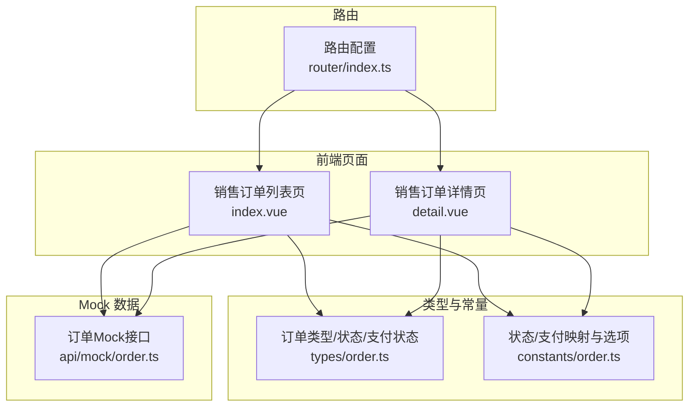
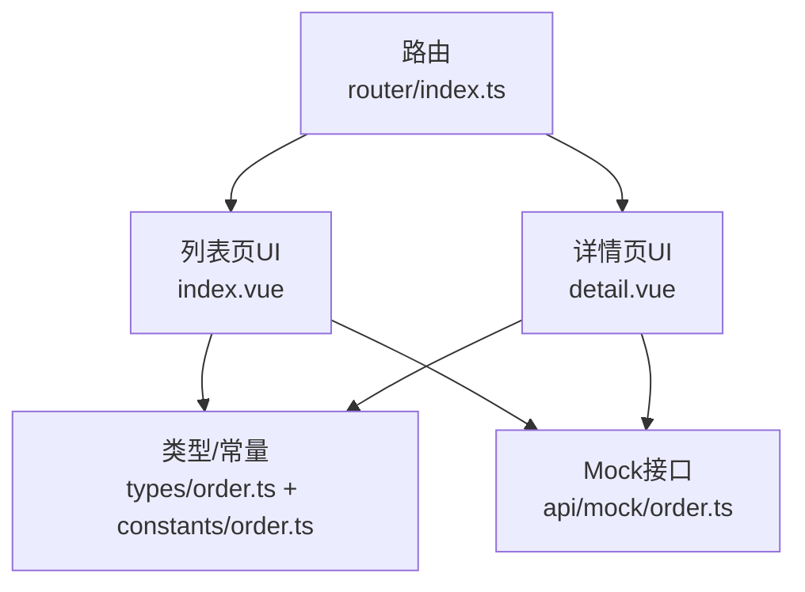
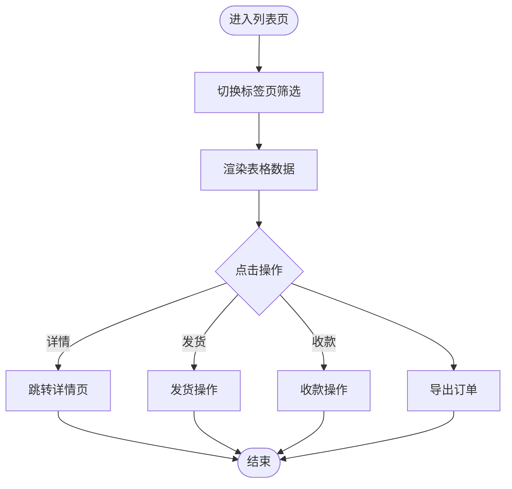
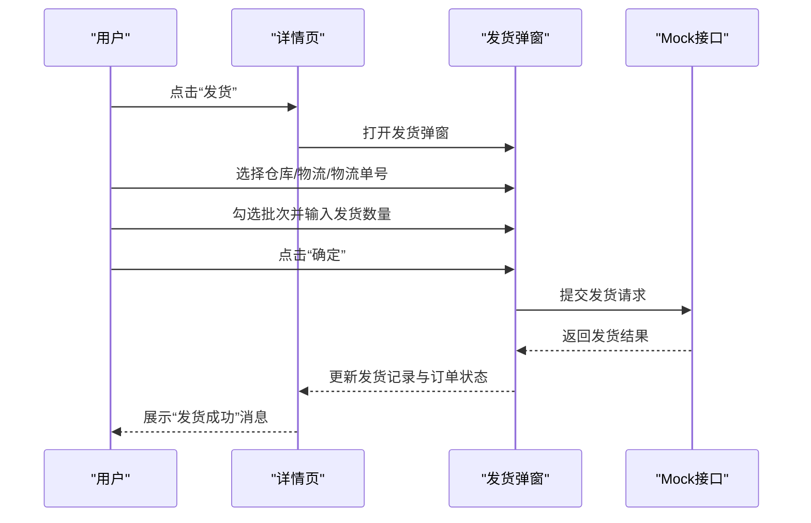
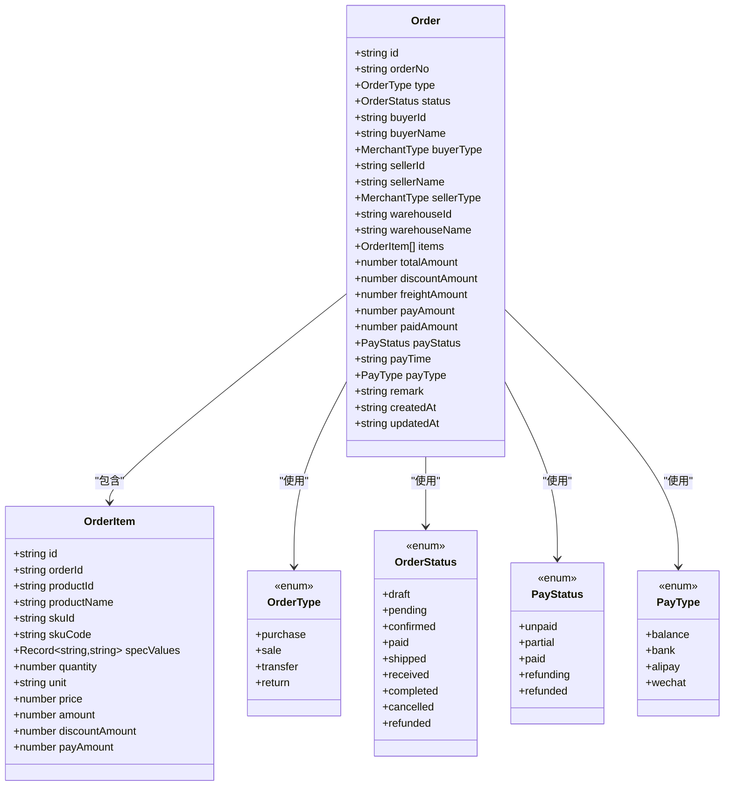
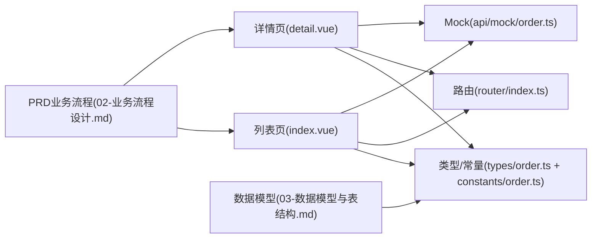
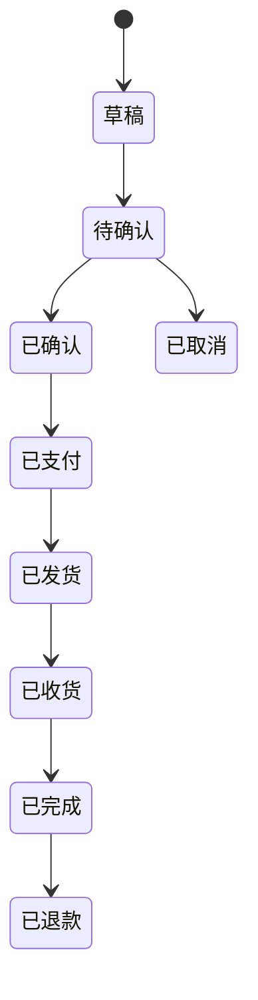

# 工程仓销售订单管理

<cite>
**本文引用的文件**
- [apps/pc/src/views/warehouse/order/sale/index.vue](file://apps/pc/src/views/warehouse/order/sale/index.vue)
- [apps/pc/src/views/warehouse/order/sale/detail.vue](file://apps/pc/src/views/warehouse/order/sale/detail.vue)
- [apps/pc/src/router/index.ts](file://apps/pc/src/router/index.ts)
- [packages/types/src/order.ts](file://packages/types/src/order.ts)
- [packages/constants/src/order.ts](file://packages/constants/src/order.ts)
- [packages/api/src/mock/order.ts](file://packages/api/src/mock/order.ts)
- [docs/PRD/02-业务流程设计.md](file://docs/PRD/02-业务流程设计.md)
- [docs/PRD/03-数据模型与表结构.md](file://docs/PRD/03-数据模型与表结构.md)
</cite>

## 目录
1. [引言](#引言)
2. [项目结构](#项目结构)
3. [核心组件](#核心组件)
4. [架构总览](#架构总览)
5. [详细组件分析](#详细组件分析)
6. [依赖分析](#依赖分析)
7. [性能考虑](#性能考虑)
8. [故障排查指南](#故障排查指南)
9. [结论](#结论)
10. [附录](#附录)

## 引言
本文件面向工程仓销售订单管理，系统性阐述销售订单的完整业务流程，包括销售订单列表管理（订单查询筛选、订单状态跟踪、订单操作）、销售订单详情查看（订单信息、商品明细、费用明细、订单状态流转），并深入解析销售订单的状态机设计、数据模型与状态映射、通知机制等核心概念。同时提供操作指南、状态变更处理与异常情况处理方案，帮助开发者与运营人员高效理解与维护系统。

## 项目结构
工程仓销售订单管理主要由前端页面与类型/常量定义组成：
- 列表页：展示销售订单列表、状态筛选、导出与基础操作入口
- 详情页：展示订单详情、客户与收货信息、物流信息、商品明细、发货记录、订单进度与发货操作
- 路由：定义销售订单列表与详情的路由入口
- 类型与常量：统一定义订单类型、状态、支付状态、支付方式等枚举与映射
- Mock 数据：提供订单列表、详情与状态变更的模拟接口

**图表来源**
- [apps/pc/src/views/warehouse/order/sale/index.vue](file://apps/pc/src/views/warehouse/order/sale/index.vue)
- [apps/pc/src/views/warehouse/order/sale/detail.vue](file://apps/pc/src/views/warehouse/order/sale/detail.vue)
- [apps/pc/src/router/index.ts](file://apps/pc/src/router/index.ts)
- [packages/types/src/order.ts](file://packages/types/src/order.ts)
- [packages/constants/src/order.ts](file://packages/constants/src/order.ts)
- [packages/api/src/mock/order.ts](file://packages/api/src/mock/order.ts)

**章节来源**
- [apps/pc/src/views/warehouse/order/sale/index.vue](file://apps/pc/src/views/warehouse/order/sale/index.vue)
- [apps/pc/src/views/warehouse/order/sale/detail.vue](file://apps/pc/src/views/warehouse/order/sale/detail.vue)
- [apps/pc/src/router/index.ts](file://apps/pc/src/router/index.ts)

## 核心组件
- 销售订单列表页：提供订单筛选（全部/待发货/发货中/已完成/已取消）、分页、导出、状态标签与操作入口（发货、收款）
- 销售订单详情页：展示订单信息、客户与收货信息、物流信息、商品明细、费用明细、发货记录、订单进度；支持发货与确认完成操作
- 路由：定义销售订单列表与详情的路由入口
- 类型与常量：统一定义订单类型、状态、支付状态、支付方式等枚举与映射
- Mock 数据：提供订单列表、详情与状态变更的模拟接口

**章节来源**
- [apps/pc/src/views/warehouse/order/sale/index.vue](file://apps/pc/src/views/warehouse/order/sale/index.vue)
- [apps/pc/src/views/warehouse/order/sale/detail.vue](file://apps/pc/src/views/warehouse/order/sale/detail.vue)
- [apps/pc/src/router/index.ts](file://apps/pc/src/router/index.ts)
- [packages/types/src/order.ts](file://packages/types/src/order.ts)
- [packages/constants/src/order.ts](file://packages/constants/src/order.ts)
- [packages/api/src/mock/order.ts](file://packages/api/src/mock/order.ts)

## 架构总览
销售订单管理采用“页面-类型/常量-Mock”的前端架构：
- 页面负责渲染与交互（列表筛选、详情查看、发货与完成）
- 类型/常量提供统一的数据模型与状态映射
- Mock 数据提供本地开发与演示所需的数据与接口

**图表来源**
- [apps/pc/src/views/warehouse/order/sale/index.vue](file://apps/pc/src/views/warehouse/order/sale/index.vue)
- [apps/pc/src/views/warehouse/order/sale/detail.vue](file://apps/pc/src/views/warehouse/order/sale/detail.vue)
- [apps/pc/src/router/index.ts](file://apps/pc/src/router/index.ts)
- [packages/types/src/order.ts](file://packages/types/src/order.ts)
- [packages/constants/src/order.ts](file://packages/constants/src/order.ts)
- [packages/api/src/mock/order.ts](file://packages/api/src/mock/order.ts)

## 详细组件分析

### 销售订单列表页（index.vue）
- 功能要点
  - 标签页筛选：全部/待发货/发货中/已完成/已取消
  - 表格列：订单编号、施工方、商品数量、订单金额、出库状态、收款状态、订单状态、创建时间、操作（详情、发货、收款）
  - 导出：导出当前筛选结果的销售订单
- 交互逻辑
  - 点击“详情”跳转到订单详情页
  - “发货”仅在订单状态为“待发货”时显示
  - “收款”仅在收款状态为“未收款”时显示
- 状态呈现
  - 使用颜色区分不同状态（出库状态、收款状态、订单状态）

**图表来源**
- [apps/pc/src/views/warehouse/order/sale/index.vue](file://apps/pc/src/views/warehouse/order/sale/index.vue)

**章节来源**
- [apps/pc/src/views/warehouse/order/sale/index.vue](file://apps/pc/src/views/warehouse/order/sale/index.vue)

### 销售订单详情页（detail.vue）
- 功能要点
  - 订单信息：订单编号、订单状态、创建时间、支付状态
  - 客户信息：施工方、联系人、联系电话
  - 收货信息：收货地址、收货人、联系电话
  - 物流信息：物流公司、物流单号、发货时间、发货仓库（发货后展示）
  - 商品明细：商品编码、名称、规格、单价、数量、已发货数量、待发货数量、单位、小计、出库状态
  - 费用明细：商品金额、运费、订单总额
  - 发货记录：发货单号、发货时间、物流公司、物流单号、发货数量、发货状态、操作（详情）
  - 订单进度：按时间倒序展示日志
  - 发货弹窗：支持精细化发货，按商品批次选择发货数量
  - 确认完成：发货完成后支持“确认完成”
- 交互逻辑
  - 发货：打开发货弹窗，选择仓库、物流公司、物流单号，按商品批次勾选并输入发货数量，提交后更新订单状态与发货记录
  - 确认完成：将订单状态更新为“已完成”

**图表来源**
- [apps/pc/src/views/warehouse/order/sale/detail.vue](file://apps/pc/src/views/warehouse/order/sale/detail.vue)
- [packages/api/src/mock/order.ts](file://packages/api/src/mock/order.ts)

**章节来源**
- [apps/pc/src/views/warehouse/order/sale/detail.vue](file://apps/pc/src/views/warehouse/order/sale/detail.vue)
- [packages/api/src/mock/order.ts](file://packages/api/src/mock/order.ts)

### 路由配置
- 销售订单列表路由：/warehouse/order/sale
- 销售订单详情路由：/warehouse/order/sale/detail/:id

**章节来源**
- [apps/pc/src/router/index.ts](file://apps/pc/src/router/index.ts)

### 类型与常量（订单模型与状态映射）
- 订单类型：采购订单、销售订单、调拨订单、退货订单
- 订单状态：草稿、待确认、已确认、已支付、已发货、已收货、已完成、已取消、已退款
- 支付状态：未支付、部分支付、已支付、退款中、已退款
- 支付方式：余额支付、银行转账、支付宝、微信支付
- 状态映射：提供状态标签与颜色映射，用于界面展示

**图表来源**
- [packages/types/src/order.ts](file://packages/types/src/order.ts)

**章节来源**
- [packages/types/src/order.ts](file://packages/types/src/order.ts)
- [packages/constants/src/order.ts](file://packages/constants/src/order.ts)

### Mock 数据（订单列表、详情与状态变更）
- 订单列表：支持关键词、状态、买方、卖方过滤，分页返回
- 订单详情：根据订单ID返回详情
- 状态变更：支持更新订单状态与取消订单

**章节来源**
- [packages/api/src/mock/order.ts](file://packages/api/src/mock/order.ts)

## 依赖分析
- 页面依赖类型/常量：列表与详情页均依赖订单类型、状态、支付状态等枚举与映射
- 页面依赖路由：通过路由进入列表与详情页
- 页面依赖Mock接口：列表与详情页通过Mock接口获取数据与执行状态变更
- PRD与数据模型：PRD文档与数据模型文档为业务与数据层提供依据

**图表来源**
- [apps/pc/src/views/warehouse/order/sale/index.vue](file://apps/pc/src/views/warehouse/order/sale/index.vue)
- [apps/pc/src/views/warehouse/order/sale/detail.vue](file://apps/pc/src/views/warehouse/order/sale/detail.vue)
- [apps/pc/src/router/index.ts](file://apps/pc/src/router/index.ts)
- [packages/types/src/order.ts](file://packages/types/src/order.ts)
- [packages/constants/src/order.ts](file://packages/constants/src/order.ts)
- [packages/api/src/mock/order.ts](file://packages/api/src/mock/order.ts)
- [docs/PRD/02-业务流程设计.md](file://docs/PRD/02-业务流程设计.md)
- [docs/PRD/03-数据模型与表结构.md](file://docs/PRD/03-数据模型与表结构.md)

**章节来源**
- [apps/pc/src/views/warehouse/order/sale/index.vue](file://apps/pc/src/views/warehouse/order/sale/index.vue)
- [apps/pc/src/views/warehouse/order/sale/detail.vue](file://apps/pc/src/views/warehouse/order/sale/detail.vue)
- [apps/pc/src/router/index.ts](file://apps/pc/src/router/index.ts)
- [packages/types/src/order.ts](file://packages/types/src/order.ts)
- [packages/constants/src/order.ts](file://packages/constants/src/order.ts)
- [packages/api/src/mock/order.ts](file://packages/api/src/mock/order.ts)
- [docs/PRD/02-业务流程设计.md](file://docs/PRD/02-业务流程设计.md)
- [docs/PRD/03-数据模型与表结构.md](file://docs/PRD/03-数据模型与表结构.md)

## 性能考虑
- 列表分页：通过分页参数控制每次加载的数据量，避免一次性渲染过多数据
- 状态映射：使用预定义映射减少重复计算，提升渲染效率
- 发货弹窗：按需展开商品批次面板，减少DOM节点数量
- Mock接口：本地开发阶段使用Mock接口，避免真实网络请求带来的延迟

## 故障排查指南
- 发货失败
  - 现象：点击“确定”后提示发货失败
  - 排查：检查仓库、物流公司、物流单号是否填写；检查批次选择与发货数量是否满足要求；查看控制台错误信息
  - 处理：完善必填信息后重试
- 状态不一致
  - 现象：订单状态与发货记录不一致
  - 排查：确认发货后是否正确更新订单状态与发货记录；检查Mock接口状态更新逻辑
  - 处理：重新触发发货或手动刷新页面
- 导出无数据
  - 现象：导出按钮提示暂无数据可导出
  - 排查：确认当前筛选条件下是否存在订单
  - 处理：调整筛选条件或添加测试数据

**章节来源**
- [apps/pc/src/views/warehouse/order/sale/detail.vue](file://apps/pc/src/views/warehouse/order/sale/detail.vue)
- [packages/api/src/mock/order.ts](file://packages/api/src/mock/order.ts)

## 结论
工程仓销售订单管理以清晰的页面职责、统一的类型/常量与Mock接口为基础，实现了从订单列表到详情的完整业务闭环。通过明确的状态机与状态映射，系统能够直观地反映订单的流转过程，并为后续对接真实后端提供良好基础。建议在后续迭代中逐步替换Mock接口为真实后端服务，并完善异常处理与通知机制。

## 附录

### 销售订单状态机设计
- 状态流转（基于PRD与类型定义）
  - 草稿 → 待确认 → 已确认 → 已支付 → 已发货 → 已收货 → 已完成
  - 草稿 → 待确认 → 已取消
  - 已完成 → 已退款（售后）
- 状态映射
  - 订单状态：草稿、待确认、已确认、已支付、已发货、已收货、已完成、已取消、已退款
  - 支付状态：未支付、部分支付、已支付、退款中、已退款

**图表来源**
- [packages/types/src/order.ts](file://packages/types/src/order.ts)
- [packages/constants/src/order.ts](file://packages/constants/src/order.ts)
- [docs/PRD/02-业务流程设计.md](file://docs/PRD/02-业务流程设计.md)

### 销售订单数据模型
- 订单（Order）
  - 关键字段：订单号、类型、状态、买方/卖方信息、仓库信息、商品明细、金额与支付状态、备注、创建/更新时间
- 订单明细（OrderItem）
  - 关键字段：商品信息、规格、数量、单价、金额、折扣与应付金额
- 销售订单扩展（sale_order）
  - 关键字段：仓库ID、施工方ID、发货时间、物流公司、物流单号

**章节来源**
- [packages/types/src/order.ts](file://packages/types/src/order.ts)
- [docs/PRD/03-数据模型与表结构.md](file://docs/PRD/03-数据模型与表结构.md)

### 销售订单通知机制
- 订单进度日志：详情页展示订单进度时间轴，记录关键事件
- 发货通知：发货成功后更新订单日志，展示物流信息
- 支付通知：支付状态变更时更新订单状态与日志

**章节来源**
- [apps/pc/src/views/warehouse/order/sale/detail.vue](file://apps/pc/src/views/warehouse/order/sale/detail.vue)

### 操作指南
- 列表页
  - 使用标签页筛选订单状态
  - 点击“详情”查看订单详情
  - 在“待发货”状态下点击“发货”，在“未收款”状态下点击“收款”
  - 使用“导出”按钮导出当前筛选结果
- 详情页
  - 点击“发货”打开发货弹窗，选择仓库、物流公司、物流单号，按商品批次勾选并输入发货数量，提交后等待发货完成
  - 发货完成后点击“确认完成”将订单状态更新为“已完成”

**章节来源**
- [apps/pc/src/views/warehouse/order/sale/index.vue](file://apps/pc/src/views/warehouse/order/sale/index.vue)
- [apps/pc/src/views/warehouse/order/sale/detail.vue](file://apps/pc/src/views/warehouse/order/sale/detail.vue)