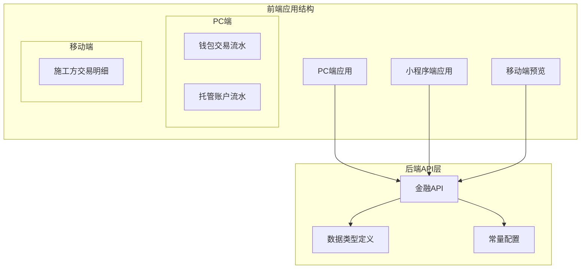
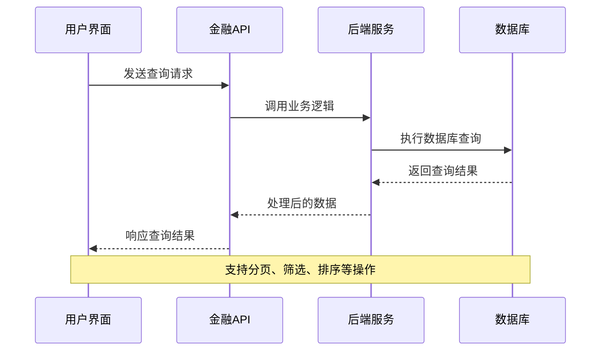
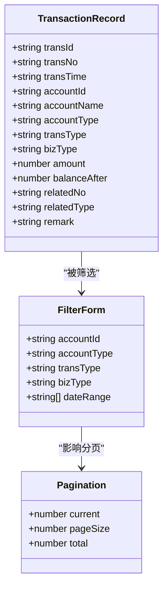
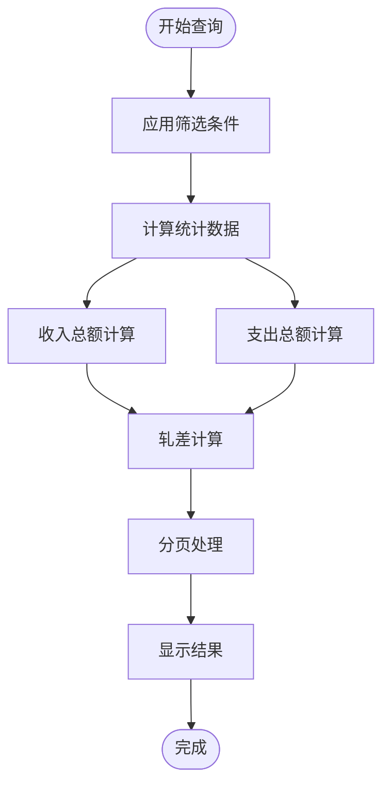
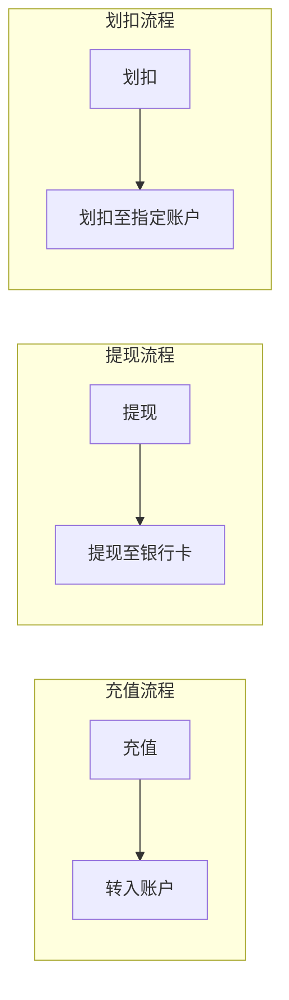
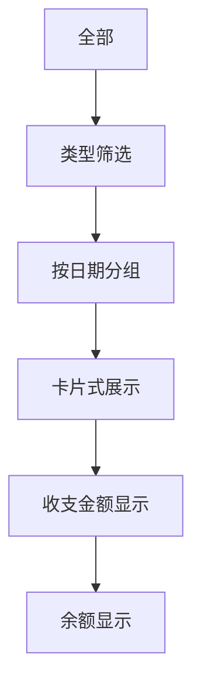
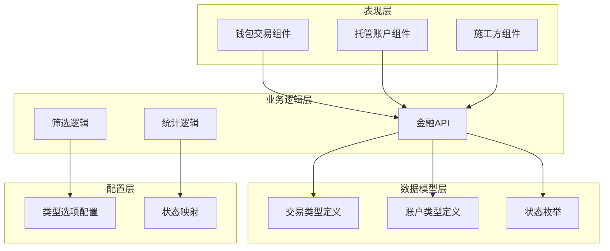

# 交易流水查询

<cite>
**本文档引用的文件**
- [apps/pc/src/views/finance/wallet/transactions.vue](file://apps/pc/src/views/finance/wallet/transactions.vue)
- [apps/pc/src/views/warehouse/finance/custody/transaction.vue](file://apps/pc/src/views/warehouse/finance/custody/transaction.vue)
- [apps/pc/src/views/mp-preview/pages/construction/transaction.vue](file://apps/pc/src/views/mp-preview/pages/construction/transaction.vue)
- [packages/api/src/finance.ts](file://packages/api/src/finance.ts)
- [packages/types/src/finance.ts](file://packages/types/src/finance.ts)
- [packages/constants/src/finance.ts](file://packages/constants/src/finance.ts)
</cite>

## 目录
1. [简介](#简介)
2. [项目结构](#项目结构)
3. [核心组件](#核心组件)
4. [架构概览](#架构概览)
5. [详细组件分析](#详细组件分析)
6. [依赖关系分析](#依赖关系分析)
7. [性能考虑](#性能考虑)
8. [故障排除指南](#故障排除指南)
9. [结论](#结论)
10. [附录](#附录)

## 简介

交易流水查询功能是工程仓管理系统中的核心财务管理模块，为用户提供全面的交易记录查询、筛选、统计和分析能力。该功能支持多维度的数据查询，包括账户类型、交易类型、业务类型、时间范围等多个筛选条件，并提供实时的统计数据展示。

本功能主要服务于以下用户群体：
- 工程仓管理员：监控资金流动和交易状况
- 供应商：跟踪订单支付和收款情况
- 平台运营人员：进行财务审计和统计分析
- 项目经理：查看项目资金使用情况

## 项目结构

交易流水查询功能在项目中采用多端适配的设计模式，针对不同的用户界面提供了相应的实现：

**图表来源**
- [apps/pc/src/views/finance/wallet/transactions.vue:1-434](file://apps/pc/src/views/finance/wallet/transactions.vue#L1-L434)
- [apps/pc/src/views/warehouse/finance/custody/transaction.vue:1-253](file://apps/pc/src/views/warehouse/finance/custody/transaction.vue#L1-L253)
- [apps/pc/src/views/mp-preview/pages/construction/transaction.vue:1-243](file://apps/pc/src/views/mp-preview/pages/construction/transaction.vue#L1-L243)

**章节来源**
- [apps/pc/src/views/finance/wallet/transactions.vue:1-434](file://apps/pc/src/views/finance/wallet/transactions.vue#L1-L434)
- [apps/pc/src/views/warehouse/finance/custody/transaction.vue:1-253](file://apps/pc/src/views/warehouse/finance/custody/transaction.vue#L1-L253)
- [apps/pc/src/views/mp-preview/pages/construction/transaction.vue:1-243](file://apps/pc/src/views/mp-preview/pages/construction/transaction.vue#L1-L243)

## 核心组件

交易流水查询功能由三个主要组件构成，分别服务于不同的用户场景：

### 1. 钱包交易流水组件
- **功能定位**：PC端通用交易流水查询
- **核心特性**：支持账户筛选、类型分类、日期范围查询
- **数据展示**：完整的交易记录表格，包含收支统计

### 2. 托管账户流水组件  
- **功能定位**：工程仓专用资金托管流水
- **核心特性**：支持充值、提现、划扣三种交易类型
- **数据展示**：详细的流水记录，包含资金流向信息

### 3. 施工方交易明细组件
- **功能定位**：移动端施工方资金明细查看
- **核心特性**：按日分组的时间线式展示
- **数据展示**：简洁的卡片式布局，突出收支金额

**章节来源**
- [apps/pc/src/views/finance/wallet/transactions.vue:1-434](file://apps/pc/src/views/finance/wallet/transactions.vue#L1-L434)
- [apps/pc/src/views/warehouse/finance/custody/transaction.vue:1-253](file://apps/pc/src/views/warehouse/finance/custody/transaction.vue#L1-L253)
- [apps/pc/src/views/mp-preview/pages/construction/transaction.vue:1-243](file://apps/pc/src/views/mp-preview/pages/construction/transaction.vue#L1-L243)

## 架构概览

交易流水查询功能采用前后端分离的架构设计，通过API接口实现数据交互：

**图表来源**
- [packages/api/src/finance.ts:20-22](file://packages/api/src/finance.ts#L20-L22)
- [packages/types/src/finance.ts:21-34](file://packages/types/src/finance.ts#L21-L34)

## 详细组件分析

### 钱包交易流水组件分析

#### 数据结构设计

钱包交易流水组件采用响应式数据结构，支持动态筛选和分页显示：

**图表来源**
- [apps/pc/src/views/finance/wallet/transactions.vue:160-311](file://apps/pc/src/views/finance/wallet/transactions.vue#L160-L311)
- [apps/pc/src/views/finance/wallet/transactions.vue:142-148](file://apps/pc/src/views/finance/wallet/transactions.vue#L142-L148)

#### 查询条件设置

组件支持多维度的查询筛选：

| 筛选条件 | 可选值 | 功能描述 |
|---------|--------|----------|
| 账户ID | 动态账户列表 | 精确匹配特定账户 |
| 账户类型 | 平台账户/工程仓/供应商 | 按账户性质筛选 |
| 交易类型 | 收入/支出 | 区分资金流入流出 |
| 业务类型 | 订单交易/退款/服务费/提现/充值 | 按业务场景分类 |
| 时间范围 | 日期区间选择器 | 支持自定义时间段 |

#### 排序和统计功能

组件提供实时的统计分析功能：

**图表来源**
- [apps/pc/src/views/finance/wallet/transactions.vue:337-347](file://apps/pc/src/views/finance/wallet/transactions.vue#L337-L347)
- [apps/pc/src/views/finance/wallet/transactions.vue:332-335](file://apps/pc/src/views/finance/wallet/transactions.vue#L332-L335)

**章节来源**
- [apps/pc/src/views/finance/wallet/transactions.vue:1-434](file://apps/pc/src/views/finance/wallet/transactions.vue#L1-L434)

### 托管账户流水组件分析

#### 交易类型分类

托管账户流水专门处理工程仓的资金托管业务：

| 交易类型 | 英文标识 | 描述 |
|---------|----------|------|
| 充值 | recharge | 资金转入账户 |
| 提现 | withdraw | 资金转出到银行卡 |
| 划扣 | deduct | 资金从账户扣除 |

#### 资金流向展示

组件采用清晰的资金流向标识：

**图表来源**
- [apps/pc/src/views/warehouse/finance/custody/transaction.vue:83-98](file://apps/pc/src/views/warehouse/finance/custody/transaction.vue#L83-L98)

#### 状态管理

所有交易记录都包含状态信息，便于用户了解交易执行情况：

| 状态 | 颜色标识 | 描述 |
|------|----------|------|
| 成功 | 绿色 | 交易已完成 |
| 处理中 | 橙色 | 交易正在处理 |
| 失败 | 红色 | 交易失败 |

**章节来源**
- [apps/pc/src/views/warehouse/finance/custody/transaction.vue:1-253](file://apps/pc/src/views/warehouse/finance/custody/transaction.vue#L1-L253)

### 施工方交易明细组件分析

#### 移动端优化设计

组件专为移动端设计，采用时间线式的布局：

**图表来源**
- [apps/pc/src/views/mp-preview/pages/construction/transaction.vue:67-83](file://apps/pc/src/views/mp-preview/pages/construction/transaction.vue#L67-L83)

#### 数据展示格式

移动端采用简洁的卡片布局，突出关键信息：

- **图标标识**：使用不同颜色的圆形图标区分收入和支出
- **标题描述**：简明的业务类型和订单号
- **时间信息**：精确到分钟的时间戳
- **金额显示**：使用加减符号明确收支方向
- **余额信息**：显示交易后的账户余额

**章节来源**
- [apps/pc/src/views/mp-preview/pages/construction/transaction.vue:1-243](file://apps/pc/src/views/mp-preview/pages/construction/transaction.vue#L1-L243)

## 依赖关系分析

交易流水查询功能的依赖关系体现了清晰的分层架构：

**图表来源**
- [packages/api/src/finance.ts:1-55](file://packages/api/src/finance.ts#L1-L55)
- [packages/types/src/finance.ts:21-51](file://packages/types/src/finance.ts#L21-L51)
- [packages/constants/src/finance.ts:3-24](file://packages/constants/src/finance.ts#L3-L24)

**章节来源**
- [packages/api/src/finance.ts:1-55](file://packages/api/src/finance.ts#L1-L55)
- [packages/types/src/finance.ts:1-95](file://packages/types/src/finance.ts#L1-L95)
- [packages/constants/src/finance.ts:1-25](file://packages/constants/src/finance.ts#L1-L25)

## 性能考虑

### 数据加载优化

1. **分页机制**：所有组件都实现了分页功能，避免一次性加载大量数据
2. **虚拟滚动**：对于大量数据的场景，可考虑实现虚拟滚动提升性能
3. **缓存策略**：近期查询结果可进行本地缓存，减少重复请求

### 渲染性能优化

1. **计算属性**：使用Vue计算属性进行数据过滤和统计，提高响应速度
2. **懒加载**：图片和复杂组件采用懒加载策略
3. **防抖处理**：搜索框输入采用防抖，避免频繁请求

### 内存管理

1. **组件卸载清理**：确保组件销毁时清理定时器和事件监听
2. **大数据集处理**：对超大数据集进行分批处理
3. **内存泄漏防护**：避免闭包引用导致的内存泄漏

## 故障排除指南

### 常见问题及解决方案

#### 1. 数据加载失败
**症状**：页面显示空白或加载错误
**可能原因**：
- API接口不可用
- 网络连接异常
- 权限不足

**解决步骤**：
1. 检查网络连接状态
2. 验证API接口可用性
3. 确认用户权限
4. 查看浏览器控制台错误信息

#### 2. 筛选功能异常
**症状**：筛选条件无法正确应用
**可能原因**：
- 数据格式不匹配
- 筛选逻辑错误
- 组件状态同步问题

**解决步骤**：
1. 验证筛选参数格式
2. 检查数据转换逻辑
3. 确认组件状态更新
4. 查看控制台JavaScript错误

#### 3. 性能问题
**症状**：页面响应缓慢或卡顿
**可能原因**：
- 数据量过大
- 渲染逻辑复杂
- 内存泄漏

**解决步骤**：
1. 实施分页或虚拟滚动
2. 优化渲染逻辑
3. 检查内存使用情况
4. 实施数据缓存策略

**章节来源**
- [apps/pc/src/views/finance/wallet/transactions.vue:382-395](file://apps/pc/src/views/finance/wallet/transactions.vue#L382-L395)
- [apps/pc/src/views/warehouse/finance/custody/transaction.vue:193-206](file://apps/pc/src/views/warehouse/finance/custody/transaction.vue#L193-L206)

## 结论

交易流水查询功能通过精心设计的多端适配架构，为不同用户群体提供了全面的交易数据管理能力。该功能具有以下优势：

1. **多维度筛选**：支持账户、类型、时间等多条件组合查询
2. **实时统计**：提供交易笔数、收入、支出等关键指标
3. **灵活展示**：针对不同场景提供最适合的数据显示方式
4. **性能优化**：采用分页和计算属性等技术保证良好用户体验

未来可以考虑的功能增强包括：
- 导出功能的完善实现
- 更高级的统计分析工具
- 实时数据更新机制
- 更丰富的筛选条件

## 附录

### 数据模型参考

#### 交易记录字段说明

| 字段名 | 类型 | 描述 | 必填 |
|-------|------|------|------|
| id | string | 交易记录ID | 是 |
| transactionNo | string | 交易流水号 | 是 |
| merchantId | string | 商户ID | 是 |
| merchantName | string | 商户名称 | 否 |
| type | TransactionType | 交易类型 | 是 |
| amount | number | 交易金额（分） | 是 |
| balance | number | 交易后余额（分） | 是 |
| status | TransactionStatus | 交易状态 | 是 |
| orderId | string | 订单ID | 否 |
| orderNo | string | 订单编号 | 否 |
| remark | string | 备注说明 | 否 |
| createdAt | string | 创建时间 | 是 |

#### API接口规范

| 接口名称 | 方法 | 路径 | 功能描述 |
|---------|------|------|----------|
| 获取账户列表 | GET | /finance/account/list | 获取账户列表 |
| 获取交易记录 | GET | /finance/transaction/list | 获取交易记录列表 |
| 账户充值 | POST | /finance/account/recharge | 账户充值操作 |
| 账户提现 | POST | /finance/account/withdraw | 账户提现操作 |

**章节来源**
- [packages/types/src/finance.ts:21-51](file://packages/types/src/finance.ts#L21-L51)
- [packages/api/src/finance.ts:4-22](file://packages/api/src/finance.ts#L4-L22)