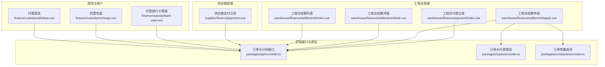
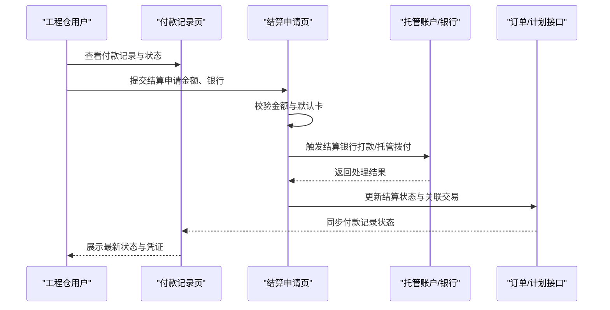
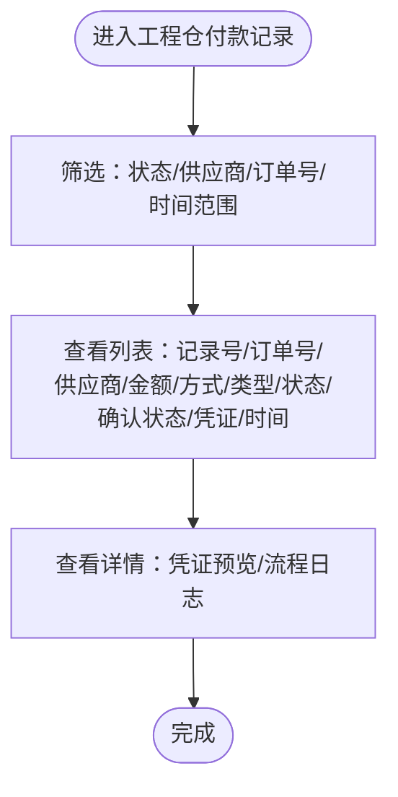
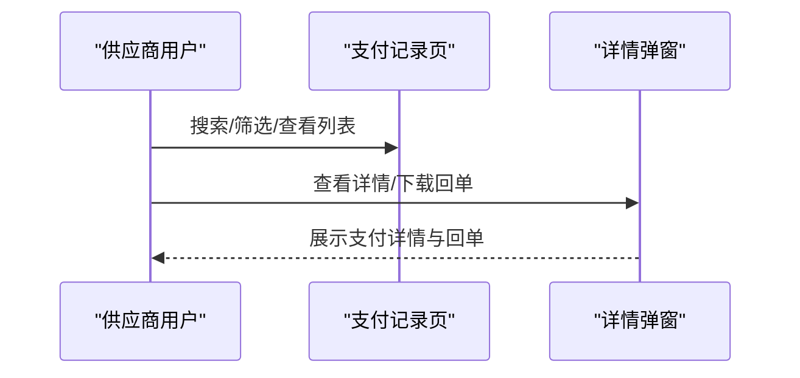
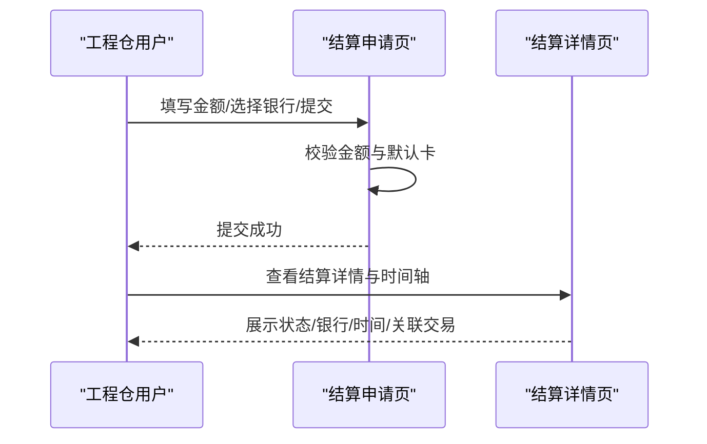
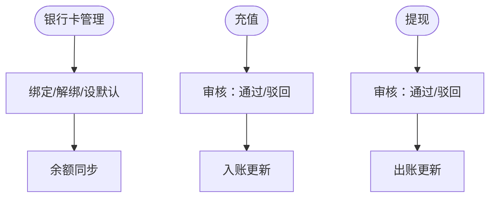
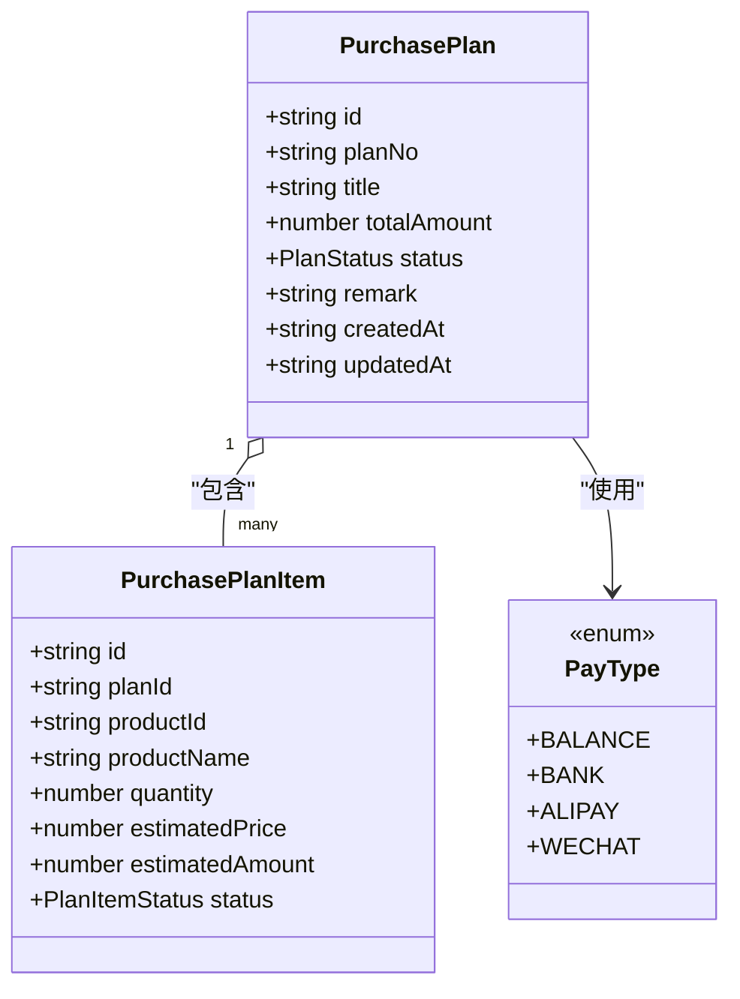
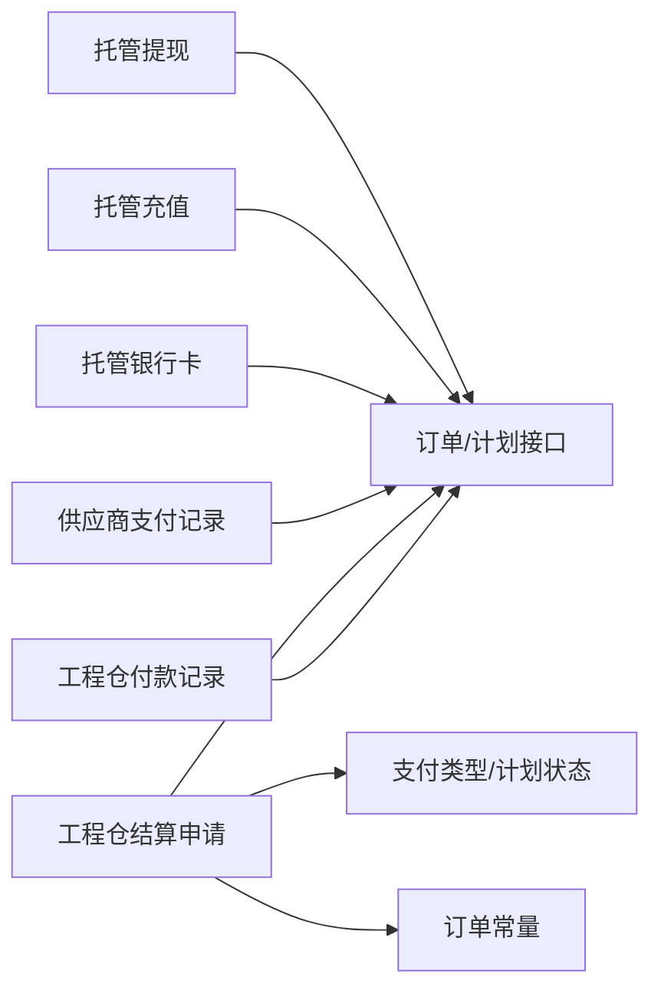

# 付款管理

<cite>
**本文引用的文件**
- [apps/pc/src/views/warehouse/finance/payment/index.vue](file://apps/pc/src/views/warehouse/finance/payment/index.vue)
- [apps/pc/src/views/supplier/finance/payment.vue](file://apps/pc/src/views/supplier/finance/payment.vue)
- [apps/pc/src/views/warehouse/finance/settlement/apply.vue](file://apps/pc/src/views/warehouse/finance/settlement/apply.vue)
- [apps/pc/src/views/warehouse/finance/settlement/detail.vue](file://apps/pc/src/views/warehouse/finance/settlement/detail.vue)
- [apps/pc/src/views/warehouse/finance/settlement/index.vue](file://apps/pc/src/views/warehouse/finance/settlement/index.vue)
- [apps/pc/src/views/finance/custody/bank-card.vue](file://apps/pc/src/views/finance/custody/bank-card.vue)
- [apps/pc/src/views/finance/custody/recharge.vue](file://apps/pc/src/views/finance/custody/recharge.vue)
- [apps/pc/src/views/finance/custody/withdraw.vue](file://apps/pc/src/views/finance/custody/withdraw.vue)
- [packages/api/src/order.ts](file://packages/api/src/order.ts)
- [packages/types/src/order.ts](file://packages/types/src/order.ts)
- [packages/constants/src/order.ts](file://packages/constants/src/order.ts)
</cite>

## 目录
1. [简介](#简介)
2. [项目结构](#项目结构)
3. [核心组件](#核心组件)
4. [架构总览](#架构总览)
5. [详细组件分析](#详细组件分析)
6. [依赖关系分析](#依赖关系分析)
7. [性能考量](#性能考量)
8. [故障排查指南](#故障排查指南)
9. [结论](#结论)
10. [附录](#附录)

## 简介
本文件面向工程仓付款管理功能，覆盖从“付款申请—审批—执行—查询”的完整闭环流程，重点说明付款方式选择、付款计划制定、付款状态跟踪、异常处理与风险控制。文档同时提供操作指南与最佳实践，帮助非技术读者快速理解与使用。

## 项目结构
围绕付款管理的关键页面与模块如下：
- 工程仓侧付款记录与状态跟踪：apps/pc/src/views/warehouse/finance/payment/index.vue
- 供应商侧支付记录与详情：apps/pc/src/views/supplier/finance/payment.vue
- 结算申请与审核流程：apps/pc/src/views/warehouse/finance/settlement/*
- 托管账户与银行管理：apps/pc/src/views/finance/custody/*
- 订单与付款相关接口与类型定义：packages/api/src/order.ts、packages/types/src/order.ts、packages/constants/src/order.ts

图表来源
- [apps/pc/src/views/warehouse/finance/payment/index.vue:1-416](file://apps/pc/src/views/warehouse/finance/payment/index.vue#L1-L416)
- [apps/pc/src/views/supplier/finance/payment.vue:1-348](file://apps/pc/src/views/supplier/finance/payment.vue#L1-L348)
- [apps/pc/src/views/warehouse/finance/settlement/apply.vue:1-246](file://apps/pc/src/views/warehouse/finance/settlement/apply.vue#L1-L246)
- [apps/pc/src/views/warehouse/finance/settlement/detail.vue:1-166](file://apps/pc/src/views/warehouse/finance/settlement/detail.vue#L1-L166)
- [apps/pc/src/views/warehouse/finance/settlement/index.vue:151-205](file://apps/pc/src/views/warehouse/finance/settlement/index.vue#L151-L205)
- [apps/pc/src/views/finance/custody/bank-card.vue:1-212](file://apps/pc/src/views/finance/custody/bank-card.vue#L1-L212)
- [apps/pc/src/views/finance/custody/recharge.vue:1-325](file://apps/pc/src/views/finance/custody/recharge.vue#L1-L325)
- [apps/pc/src/views/finance/custody/withdraw.vue:1-332](file://apps/pc/src/views/finance/custody/withdraw.vue#L1-L332)
- [packages/api/src/order.ts:90-155](file://packages/api/src/order.ts#L90-L155)
- [packages/types/src/order.ts:73-123](file://packages/types/src/order.ts#L73-L123)
- [packages/constants/src/order.ts:1-20](file://packages/constants/src/order.ts#L1-L20)

章节来源
- [apps/pc/src/views/warehouse/finance/payment/index.vue:1-416](file://apps/pc/src/views/warehouse/finance/payment/index.vue#L1-L416)
- [apps/pc/src/views/supplier/finance/payment.vue:1-348](file://apps/pc/src/views/supplier/finance/payment.vue#L1-L348)
- [apps/pc/src/views/warehouse/finance/settlement/apply.vue:1-246](file://apps/pc/src/views/warehouse/finance/settlement/apply.vue#L1-L246)
- [apps/pc/src/views/warehouse/finance/settlement/detail.vue:1-166](file://apps/pc/src/views/warehouse/finance/settlement/detail.vue#L1-L166)
- [apps/pc/src/views/warehouse/finance/settlement/index.vue:151-205](file://apps/pc/src/views/warehouse/finance/settlement/index.vue#L151-L205)
- [apps/pc/src/views/finance/custody/bank-card.vue:1-212](file://apps/pc/src/views/finance/custody/bank-card.vue#L1-L212)
- [apps/pc/src/views/finance/custody/recharge.vue:1-325](file://apps/pc/src/views/finance/custody/recharge.vue#L1-L325)
- [apps/pc/src/views/finance/custody/withdraw.vue:1-332](file://apps/pc/src/views/finance/custody/withdraw.vue#L1-L332)
- [packages/api/src/order.ts:90-155](file://packages/api/src/order.ts#L90-L155)
- [packages/types/src/order.ts:73-123](file://packages/types/src/order.ts#L73-L123)
- [packages/constants/src/order.ts:1-20](file://packages/constants/src/order.ts#L1-L20)

## 核心组件
- 工程仓付款记录页：提供统计、筛选、分页、详情查看、凭证预览与导出能力；支持“线下转账”场景下的供应商确认与流程日志展示。
- 供应商支付记录页：提供支付方式、状态、流水号、订单号、时间范围等多维检索；支持详情弹窗与回单下载。
- 结算申请页：三步式流程（确认结算信息—选择结算银行—提交），校验最小金额、默认卡、金额上限等。
- 结算详情页：展示结算单状态、银行信息、到账时间、处理时间轴与关联交易流水。
- 托管账户与银行管理：银行卡绑定/解绑/设默认、充值/提现审核与状态跟踪。
- 订单与计划接口：提供采购计划的创建、提交、审批、执行与完成等能力，支撑付款计划制定与执行。

章节来源
- [apps/pc/src/views/warehouse/finance/payment/index.vue:1-416](file://apps/pc/src/views/warehouse/finance/payment/index.vue#L1-L416)
- [apps/pc/src/views/supplier/finance/payment.vue:1-348](file://apps/pc/src/views/supplier/finance/payment.vue#L1-L348)
- [apps/pc/src/views/warehouse/finance/settlement/apply.vue:1-246](file://apps/pc/src/views/warehouse/finance/settlement/apply.vue#L1-L246)
- [apps/pc/src/views/warehouse/finance/settlement/detail.vue:1-166](file://apps/pc/src/views/warehouse/finance/settlement/detail.vue#L1-L166)
- [apps/pc/src/views/finance/custody/bank-card.vue:1-212](file://apps/pc/src/views/finance/custody/bank-card.vue#L1-L212)
- [apps/pc/src/views/finance/custody/recharge.vue:1-325](file://apps/pc/src/views/finance/custody/recharge.vue#L1-L325)
- [apps/pc/src/views/finance/custody/withdraw.vue:1-332](file://apps/pc/src/views/finance/custody/withdraw.vue#L1-L332)
- [packages/api/src/order.ts:90-155](file://packages/api/src/order.ts#L90-L155)

## 架构总览
付款管理在工程仓侧以“线下转账+托管账户”双通道运行：
- 线下转账：工程仓发起付款记录，上传凭证，供应商确认，形成“支付成功/待确认/处理中/失败”等状态。
- 托管账户：通过托管充值/提现与银行卡管理，实现资金归集与拨付，配合结算申请完成跨账期资金结算。

图表来源
- [apps/pc/src/views/warehouse/finance/payment/index.vue:1-416](file://apps/pc/src/views/warehouse/finance/payment/index.vue#L1-L416)
- [apps/pc/src/views/warehouse/finance/settlement/apply.vue:1-246](file://apps/pc/src/views/warehouse/finance/settlement/apply.vue#L1-L246)
- [apps/pc/src/views/finance/custody/recharge.vue:1-325](file://apps/pc/src/views/finance/custody/recharge.vue#L1-L325)
- [apps/pc/src/views/finance/custody/withdraw.vue:1-332](file://apps/pc/src/views/finance/custody/withdraw.vue#L1-L332)
- [packages/api/src/order.ts:90-155](file://packages/api/src/order.ts#L90-L155)

## 详细组件分析

### 工程仓付款记录页（线下转账）
- 功能要点
  - 统计：本月支付金额/笔数、今日支付金额/笔数。
  - 过滤：按支付状态、供应商、订单号、支付时间范围筛选。
  - 列表字段：支付记录号、订单号、供应商、支付金额、支付方式（线下转账）、支付类型（全额/部分）、状态、供应商确认状态、凭证上传、操作（详情）。
  - 详情弹窗：展示支付记录号、订单号、供应商、金额、方式、类型、状态、确认状态、时间、操作人、备注；若存在凭证则展示预览；流程日志以时间轴呈现。
- 业务逻辑
  - 支付方式固定为“线下转账”，状态包含“成功/处理中/失败”，供应商确认状态用于区分“已确认/待确认”。
  - 支付类型区分“全额/部分”，便于多笔支付场景的追踪。
- 风险控制
  - 强制上传凭证，未上传时提示“待上传凭证”。
  - 供应商确认作为关键风控节点，未确认前不视为完成。

图表来源
- [apps/pc/src/views/warehouse/finance/payment/index.vue:1-416](file://apps/pc/src/views/warehouse/finance/payment/index.vue#L1-L416)

章节来源
- [apps/pc/src/views/warehouse/finance/payment/index.vue:1-416](file://apps/pc/src/views/warehouse/finance/payment/index.vue#L1-L416)

### 供应商支付记录页
- 功能要点
  - 统计：待支付订单、本月支付笔数、本月支付金额、累计手续费。
  - 过滤：按支付状态（待支付/成功/失败/已退款）、支付方式（对公转账/微信/支付宝/余额）、流水号、订单号、时间范围。
  - 列表字段：流水号、关联订单、支付方式、状态、金额、手续费、实际到账、付款方、支付/到账时间、操作（详情/回单下载）。
  - 详情弹窗：展示流水号、订单号、支付方式、状态、金额、手续费、实际到账、付款方/账户、支付/到账时间、备注，并支持回单下载。
- 业务逻辑
  - 支付方式映射与颜色标识，状态映射与颜色标识，便于快速识别。
  - 回单下载用于合规存档与对账。

图表来源
- [apps/pc/src/views/supplier/finance/payment.vue:1-348](file://apps/pc/src/views/supplier/finance/payment.vue#L1-L348)

章节来源
- [apps/pc/src/views/supplier/finance/payment.vue:1-348](file://apps/pc/src/views/supplier/finance/payment.vue#L1-L348)

### 结算申请与结算详情
- 结算申请（三步流程）
  - 第一步：确认结算信息，显示账户余额、冻结金额、可结算金额、最小结算金额，输入结算金额并校验。
  - 第二步：选择结算银行（默认卡优先），支持添加银行卡。
  - 第三步：确认结算信息（金额、银行、预计到账时间、说明），提交后跳转至列表。
- 结算详情
  - 展示结算单号、状态（已到账/处理中/待审核/已失败）、金额、申请时间、银行信息、到账时间、说明。
  - 时间轴展示处理过程：已创建、待审核、处理中、已到账。
  - 关联交易：展示与结算相关的收入/支出流水。

图表来源
- [apps/pc/src/views/warehouse/finance/settlement/apply.vue:1-246](file://apps/pc/src/views/warehouse/finance/settlement/apply.vue#L1-L246)
- [apps/pc/src/views/warehouse/finance/settlement/detail.vue:1-166](file://apps/pc/src/views/warehouse/finance/settlement/detail.vue#L1-L166)

章节来源
- [apps/pc/src/views/warehouse/finance/settlement/apply.vue:1-246](file://apps/pc/src/views/warehouse/finance/settlement/apply.vue#L1-L246)
- [apps/pc/src/views/warehouse/finance/settlement/detail.vue:1-166](file://apps/pc/src/views/warehouse/finance/settlement/detail.vue#L1-L166)

### 托管账户与银行管理
- 银行卡管理
  - 支持搜索商户、筛选绑定状态与卡类型、绑定/解绑/设默认卡、失败原因展示。
  - 与托管账户余额同步、交易明细、充值/提现记录联动。
- 充值与提现
  - 充值：支持银行转账/在线支付，状态含“待审核/处理中/成功/失败”，支持审核通过/驳回。
  - 提现：支持手续费与到账金额计算，状态含“待审核/处理中/成功/失败”，支持审核通过/驳回。

图表来源
- [apps/pc/src/views/finance/custody/bank-card.vue:1-212](file://apps/pc/src/views/finance/custody/bank-card.vue#L1-L212)
- [apps/pc/src/views/finance/custody/recharge.vue:1-325](file://apps/pc/src/views/finance/custody/recharge.vue#L1-L325)
- [apps/pc/src/views/finance/custody/withdraw.vue:1-332](file://apps/pc/src/views/finance/custody/withdraw.vue#L1-L332)

章节来源
- [apps/pc/src/views/finance/custody/bank-card.vue:1-212](file://apps/pc/src/views/finance/custody/bank-card.vue#L1-L212)
- [apps/pc/src/views/finance/custody/recharge.vue:1-325](file://apps/pc/src/views/finance/custody/recharge.vue#L1-L325)
- [apps/pc/src/views/finance/custody/withdraw.vue:1-332](file://apps/pc/src/views/finance/custody/withdraw.vue#L1-L332)

### 订单与付款计划接口
- 采购计划
  - 列表/详情/创建/更新/删除/提交/审批等接口，支撑“付款计划制定—审批—执行”的闭环。
  - 类型定义包含计划状态（草稿/已提交/已批准/执行中/已完成/已取消）与条目状态（待执行/执行中/已完成）。
- 订单支付类型
  - 支持余额、银行、支付宝、微信等支付方式枚举，用于支付记录与结算申请的数据一致性。

图表来源
- [packages/types/src/order.ts:73-123](file://packages/types/src/order.ts#L73-L123)
- [packages/api/src/order.ts:90-155](file://packages/api/src/order.ts#L90-L155)

章节来源
- [packages/api/src/order.ts:90-155](file://packages/api/src/order.ts#L90-L155)
- [packages/types/src/order.ts:73-123](file://packages/types/src/order.ts#L73-L123)
- [packages/constants/src/order.ts:1-20](file://packages/constants/src/order.ts#L1-L20)

## 依赖关系分析
- 页面与接口
  - 付款记录页与结算申请页均依赖订单/计划接口进行数据拉取与状态更新。
  - 托管充值/提现页依赖账户与银行接口，实现资金归集与拨付。
- 类型与常量
  - 结算申请页使用支付类型与订单状态常量，确保前后端一致。
- 耦合与内聚
  - 页面职责清晰：记录页负责查询与展示，申请页负责流程推进，账户页负责资金管理。
  - 低耦合体现在各页面通过统一接口层交互，避免直接依赖具体实现细节。

图表来源
- [apps/pc/src/views/warehouse/finance/payment/index.vue:1-416](file://apps/pc/src/views/warehouse/finance/payment/index.vue#L1-L416)
- [apps/pc/src/views/warehouse/finance/settlement/apply.vue:1-246](file://apps/pc/src/views/warehouse/finance/settlement/apply.vue#L1-L246)
- [apps/pc/src/views/supplier/finance/payment.vue:1-348](file://apps/pc/src/views/supplier/finance/payment.vue#L1-L348)
- [apps/pc/src/views/finance/custody/bank-card.vue:1-212](file://apps/pc/src/views/finance/custody/bank-card.vue#L1-L212)
- [apps/pc/src/views/finance/custody/recharge.vue:1-325](file://apps/pc/src/views/finance/custody/recharge.vue#L1-L325)
- [apps/pc/src/views/finance/custody/withdraw.vue:1-332](file://apps/pc/src/views/finance/custody/withdraw.vue#L1-L332)
- [packages/api/src/order.ts:90-155](file://packages/api/src/order.ts#L90-L155)
- [packages/types/src/order.ts:73-123](file://packages/types/src/order.ts#L73-L123)
- [packages/constants/src/order.ts:1-20](file://packages/constants/src/order.ts#L1-L20)

章节来源
- [packages/api/src/order.ts:90-155](file://packages/api/src/order.ts#L90-L155)
- [packages/types/src/order.ts:73-123](file://packages/types/src/order.ts#L73-L123)
- [packages/constants/src/order.ts:1-20](file://packages/constants/src/order.ts#L1-L20)

## 性能考量
- 列表分页与筛选：采用分页参数与本地过滤策略，减少一次性渲染压力。
- 状态与颜色映射：通过映射表快速渲染，避免重复计算。
- 图片预览：凭证图片懒加载或缩略图展示，降低首屏渲染开销。
- 接口调用：批量查询与缓存策略建议结合业务场景优化，避免频繁请求。

## 故障排查指南
- 供应商未确认收款
  - 现象：工程仓侧显示“待确认”。
  - 处理：联系供应商确认收款并上传凭证，系统自动更新为“已确认/支付成功”。
- 凭证缺失
  - 现象：工程仓侧显示“待上传凭证”。
  - 处理：上传银行转账凭证后刷新页面，状态更新。
- 提现/充值审核失败
  - 现象：状态停留在“待审核/处理中”。
  - 处理：检查驳回原因与补充资料，重新提交或修改后再次审核。
- 结算申请金额校验失败
  - 现象：无法进入下一步。
  - 处理：确保金额≥最小金额且≤可结算金额，选择默认结算银行。
- 银行卡绑定异常
  - 现象：绑定状态为失败或不可设默认。
  - 处理：重新绑卡或更换卡，确认卡类型与状态。

章节来源
- [apps/pc/src/views/warehouse/finance/payment/index.vue:287-315](file://apps/pc/src/views/warehouse/finance/payment/index.vue#L287-L315)
- [apps/pc/src/views/finance/custody/withdraw.vue:288-295](file://apps/pc/src/views/finance/custody/withdraw.vue#L288-L295)
- [apps/pc/src/views/finance/custody/recharge.vue:286-293](file://apps/pc/src/views/finance/custody/recharge.vue#L286-L293)
- [apps/pc/src/views/warehouse/finance/settlement/apply.vue:126-140](file://apps/pc/src/views/warehouse/finance/settlement/apply.vue#L126-L140)
- [apps/pc/src/views/finance/custody/bank-card.vue:188-206](file://apps/pc/src/views/finance/custody/bank-card.vue#L188-L206)

## 结论
工程仓付款管理以“线下转账+托管账户”双通道协同，结合结算申请与状态跟踪，形成从计划到执行再到对账的闭环。通过严格的凭证与确认机制、清晰的流程日志与状态映射，有效提升资金流转透明度与风险可控性。建议在实际运营中持续完善计划审批与执行节奏，强化异常处理与审计留痕。

## 附录
- 操作指南（概述）
  - 工程仓侧：在“付款记录”中查看状态与凭证，必要时上传凭证并等待供应商确认；如需跨账期拨付，走“结算申请”流程。
  - 供应商侧：在“支付记录”中查看流水与状态，及时上传回单并关注到账时间。
  - 财务侧：通过“托管充值/提现/银行卡管理”维护资金池，确保结算与拨付顺畅。
- 风险控制清单
  - 必须上传凭证，未上传不得视为完成。
  - 供应商确认为关键节点，未确认不得入账。
  - 结算金额必须符合最小/最大限制，银行信息必须准确。
  - 定期核对托管账户余额与交易明细，及时处理异常。