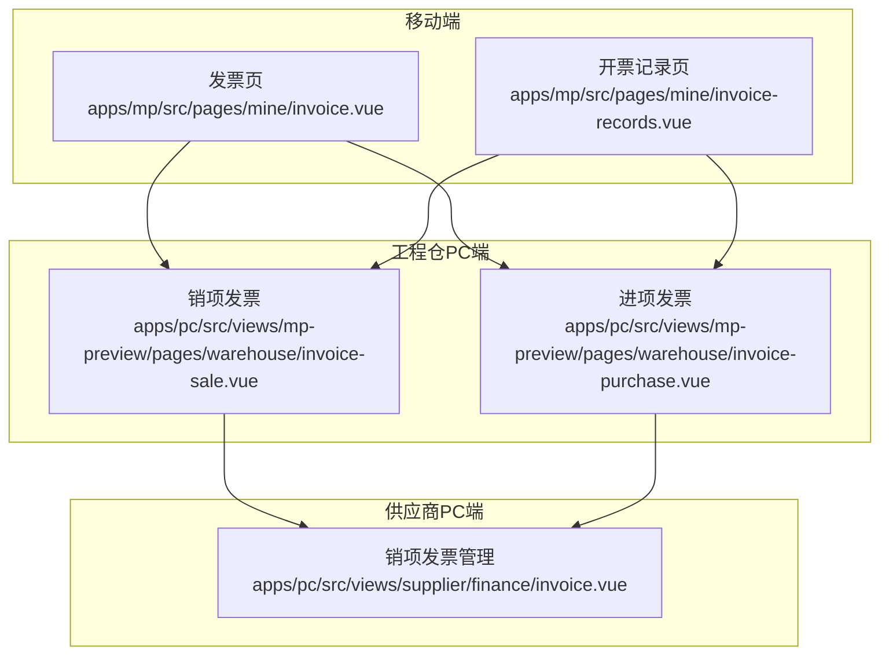
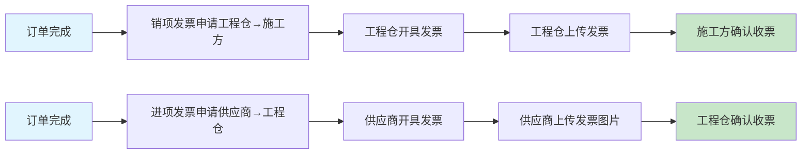
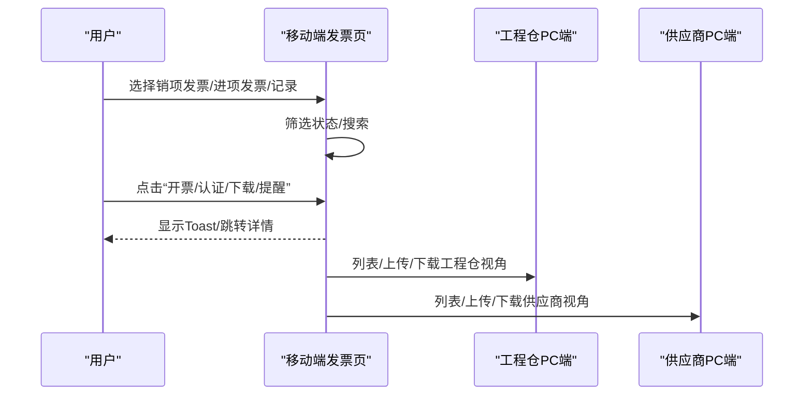
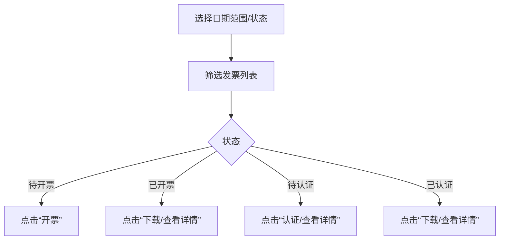
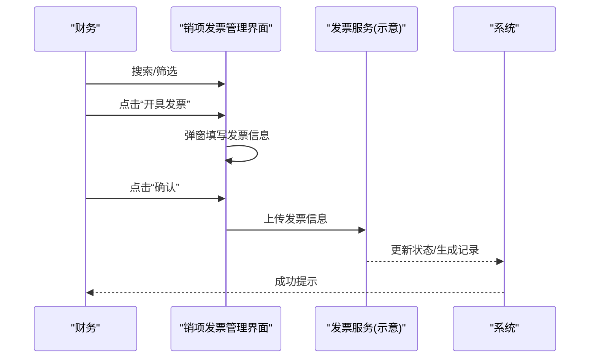
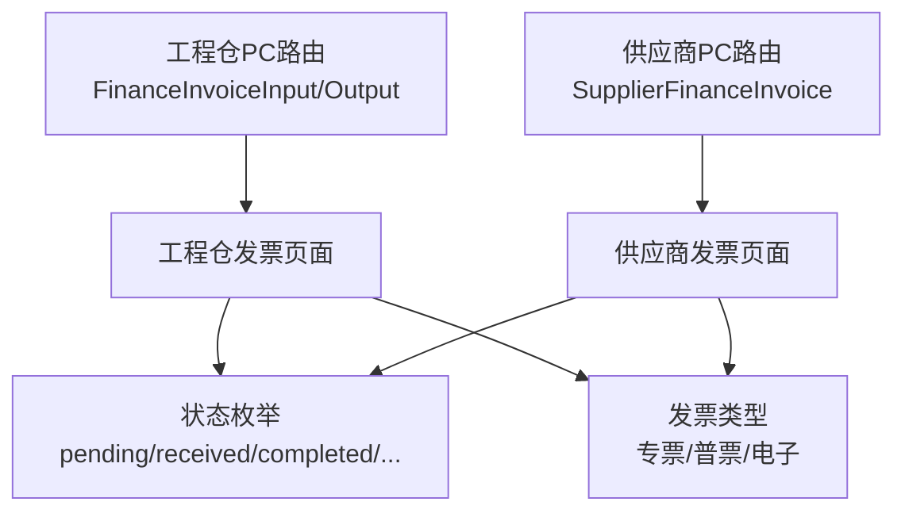

# 发票管理

<cite>
**本文引用的文件**
- [apps/mp/src/pages/mine/invoice.vue](file://apps/mp/src/pages/mine/invoice.vue)
- [apps/mp/src/pages/mine/invoice-records.vue](file://apps/mp/src/pages/mine/invoice-records.vue)
- [apps/pc/src/views/mp-preview/pages/warehouse/invoice-purchase.vue](file://apps/pc/src/views/mp-preview/pages/warehouse/invoice-purchase.vue)
- [apps/pc/src/views/mp-preview/pages/warehouse/invoice-sale.vue](file://apps/pc/src/views/mp-preview/pages/warehouse/invoice-sale.vue)
- [apps/pc/src/views/supplier/finance/invoice.vue](file://apps/pc/src/views/supplier/finance/invoice.vue)
- [apps/pc/dist/prd-docs/02-业务流程设计.md](file://apps/pc/dist/prd-docs/02-业务流程设计.md)
- [apps/pc/dist/prd-docs/12-财务中心功能设计.md](file://apps/pc/dist/prd-docs/12-财务中心功能设计.md)
- [apps/pc/dist/prd-docs/04-领域模型设计.md](file://apps/pc/dist/prd-docs/04-领域模型设计.md)
- [apps/pc/src/router/index.ts](file://apps/pc/src/router/index.ts)
</cite>

## 目录
1. [简介](#简介)
2. [项目结构](#项目结构)
3. [核心组件](#核心组件)
4. [架构总览](#架构总览)
5. [详细组件分析](#详细组件分析)
6. [依赖分析](#依赖分析)
7. [性能考虑](#性能考虑)
8. [故障排查指南](#故障排查指南)
9. [结论](#结论)
10. [附录](#附录)

## 简介
本文件围绕工程仓发票管理功能，系统化梳理“进项发票”和“销项发票”的完整业务闭环，涵盖发票录入、审核、验证、入账、查询、统计等关键环节，并结合PRD文档给出税务合规要点、发票真伪验证与数据导入导出的实践建议。文档既面向一线开发者，也兼顾非技术读者的理解成本，采用分层递进的方式呈现。

## 项目结构
工程仓发票管理在移动端与PC端均有体现：
- 移动端（小程序）：提供“销项发票/进项发票/开票记录”三栏式导航，支持按状态筛选、操作入口（开票、认证、下载、提醒等）。
- PC端（工程仓侧）：提供“销项发票/进项发票”列表页，支持日期范围、状态筛选、上传、下载、查看详情等操作。
- 供应商端（PC）：提供“销项发票管理”，支持搜索、状态切换、开具发票、下载、红冲等。

图表来源
- [apps/mp/src/pages/mine/invoice.vue:1-607](file://apps/mp/src/pages/mine/invoice.vue#L1-L607)
- [apps/mp/src/pages/mine/invoice-records.vue:1-383](file://apps/mp/src/pages/mine/invoice-records.vue#L1-L383)
- [apps/pc/src/views/mp-preview/pages/warehouse/invoice-sale.vue:1-399](file://apps/pc/src/views/mp-preview/pages/warehouse/invoice-sale.vue#L1-L399)
- [apps/pc/src/views/mp-preview/pages/warehouse/invoice-purchase.vue:1-399](file://apps/pc/src/views/mp-preview/pages/warehouse/invoice-purchase.vue#L1-L399)
- [apps/pc/src/views/supplier/finance/invoice.vue:1-333](file://apps/pc/src/views/supplier/finance/invoice.vue#L1-L333)

章节来源
- [apps/mp/src/pages/mine/invoice.vue:1-607](file://apps/mp/src/pages/mine/invoice.vue#L1-L607)
- [apps/mp/src/pages/mine/invoice-records.vue:1-383](file://apps/mp/src/pages/mine/invoice-records.vue#L1-L383)
- [apps/pc/src/views/mp-preview/pages/warehouse/invoice-sale.vue:1-399](file://apps/pc/src/views/mp-preview/pages/warehouse/invoice-sale.vue#L1-L399)
- [apps/pc/src/views/mp-preview/pages/warehouse/invoice-purchase.vue:1-399](file://apps/pc/src/views/mp-preview/pages/warehouse/invoice-purchase.vue#L1-L399)
- [apps/pc/src/views/supplier/finance/invoice.vue:1-333](file://apps/pc/src/views/supplier/finance/invoice.vue#L1-L333)

## 核心组件
- 移动端发票页（销项/进项/记录）
  - 支持按状态筛选（待开票/开票中/已开票/待收票/已收票/已认证等）
  - 提供“开票/认证/下载/提醒/查看进度/查看发票”等动作
  - 记录页支持按月/类型筛选与关键词搜索
- 工程仓PC端
  - 销项发票：支持“开票/作废/下载/查看详情”
  - 进项发票：支持“认证/下载/查看详情”
- 供应商PC端
  - 销项发票管理：支持搜索、状态切换、开具发票、下载、红冲

章节来源
- [apps/mp/src/pages/mine/invoice.vue:28-300](file://apps/mp/src/pages/mine/invoice.vue#L28-L300)
- [apps/mp/src/pages/mine/invoice-records.vue:1-184](file://apps/mp/src/pages/mine/invoice-records.vue#L1-L184)
- [apps/pc/src/views/mp-preview/pages/warehouse/invoice-sale.vue:1-188](file://apps/pc/src/views/mp-preview/pages/warehouse/invoice-sale.vue#L1-L188)
- [apps/pc/src/views/mp-preview/pages/warehouse/invoice-purchase.vue:1-188](file://apps/pc/src/views/mp-preview/pages/warehouse/invoice-purchase.vue#L1-L188)
- [apps/pc/src/views/supplier/finance/invoice.vue:1-333](file://apps/pc/src/views/supplier/finance/invoice.vue#L1-L333)

## 架构总览
工程仓发票管理遵循“凭证驱动、线下闭环”的设计原则，发票以文件上传方式管理，不强制与订单强绑定，便于对账时手工匹配。系统通过前端页面承载业务操作，后端提供发票上传、认证等能力支撑。

图表来源
- [apps/pc/dist/prd-docs/02-业务流程设计.md:285-305](file://apps/pc/dist/prd-docs/02-业务流程设计.md#L285-L305)

章节来源
- [apps/pc/dist/prd-docs/12-财务中心功能设计.md:24-116](file://apps/pc/dist/prd-docs/12-财务中心功能设计.md#L24-L116)
- [apps/pc/dist/prd-docs/02-业务流程设计.md:285-305](file://apps/pc/dist/prd-docs/02-业务流程设计.md#L285-L305)

## 详细组件分析

### 移动端发票页（销项/进项/记录）
- 销项发票
  - 状态：全部/待开票/开票中/已开票
  - 动作：开票、查看进度、查看发票、下载
- 进项发票
  - 状态：全部/待收票/已收票/已认证
  - 动作：提醒开票、认证、查看发票
- 开票记录
  - 支持按月/类型筛选与关键词搜索
  - 展示发票号码、关联订单、金额、日期、状态

图表来源
- [apps/mp/src/pages/mine/invoice.vue:28-300](file://apps/mp/src/pages/mine/invoice.vue#L28-L300)
- [apps/mp/src/pages/mine/invoice-records.vue:1-184](file://apps/mp/src/pages/mine/invoice-records.vue#L1-L184)
- [apps/pc/src/views/mp-preview/pages/warehouse/invoice-sale.vue:1-188](file://apps/pc/src/views/mp-preview/pages/warehouse/invoice-sale.vue#L1-L188)
- [apps/pc/src/views/mp-preview/pages/warehouse/invoice-purchase.vue:1-188](file://apps/pc/src/views/mp-preview/pages/warehouse/invoice-purchase.vue#L1-L188)
- [apps/pc/src/views/supplier/finance/invoice.vue:1-333](file://apps/pc/src/views/supplier/finance/invoice.vue#L1-L333)

章节来源
- [apps/mp/src/pages/mine/invoice.vue:28-300](file://apps/mp/src/pages/mine/invoice.vue#L28-L300)
- [apps/mp/src/pages/mine/invoice-records.vue:1-184](file://apps/mp/src/pages/mine/invoice-records.vue#L1-L184)

### 工程仓PC端（销项/进项）
- 销项发票
  - 支持“待开票/已开票/已作废”状态切换
  - 支持“开票/作废/下载/查看详情”
- 进项发票
  - 支持“待认证/已认证/认证失败”状态切换
  - 支持“认证/下载/查看详情”

图表来源
- [apps/pc/src/views/mp-preview/pages/warehouse/invoice-sale.vue:105-188](file://apps/pc/src/views/mp-preview/pages/warehouse/invoice-sale.vue#L105-L188)
- [apps/pc/src/views/mp-preview/pages/warehouse/invoice-purchase.vue:105-188](file://apps/pc/src/views/mp-preview/pages/warehouse/invoice-purchase.vue#L105-L188)

章节来源
- [apps/pc/src/views/mp-preview/pages/warehouse/invoice-sale.vue:1-188](file://apps/pc/src/views/mp-preview/pages/warehouse/invoice-sale.vue#L1-L188)
- [apps/pc/src/views/mp-preview/pages/warehouse/invoice-purchase.vue:1-188](file://apps/pc/src/views/mp-preview/pages/warehouse/invoice-purchase.vue#L1-L188)

### 供应商PC端（销项发票管理）
- 支持按状态（待开票/已开票/已红冲）、发票类型、订单号、日期范围搜索
- 支持“开具发票/详情/下载/红冲”等操作
- 开票时可选择发票类型、填写发票号码/代码、开票日期、税率，并上传附件

图表来源
- [apps/pc/src/views/supplier/finance/invoice.vue:174-333](file://apps/pc/src/views/supplier/finance/invoice.vue#L174-L333)
- [apps/pc/dist/prd-docs/04-领域模型设计.md:236-237](file://apps/pc/dist/prd-docs/04-领域模型设计.md#L236-L237)

章节来源
- [apps/pc/src/views/supplier/finance/invoice.vue:1-333](file://apps/pc/src/views/supplier/finance/invoice.vue#L1-L333)
- [apps/pc/dist/prd-docs/04-领域模型设计.md:236-237](file://apps/pc/dist/prd-docs/04-领域模型设计.md#L236-L237)

## 依赖分析
- 路由与页面映射
  - 工程仓PC端：发票管理（进项/销项）路由
  - 供应商PC端：发票管理（销项发票）路由
- 数据与状态
  - 发票状态：pending/processing/completed/received/verified/paid/red等
  - 发票类型：增值税专用发票、增值税普通发票、电子普通发票等
- 业务依赖
  - 销项发票：通常与销售订单关联，支持“开具发票/下载/红冲”
  - 进项发票：通常与采购订单关联，支持“认证/下载/查看详情”

图表来源
- [apps/pc/src/router/index.ts:318-332](file://apps/pc/src/router/index.ts#L318-L332)
- [apps/pc/src/router/index.ts:489-497](file://apps/pc/src/router/index.ts#L489-L497)
- [apps/pc/src/router/index.ts:753-761](file://apps/pc/src/router/index.ts#L753-L761)

章节来源
- [apps/pc/src/router/index.ts:318-332](file://apps/pc/src/router/index.ts#L318-L332)
- [apps/pc/src/router/index.ts:489-497](file://apps/pc/src/router/index.ts#L489-L497)
- [apps/pc/src/router/index.ts:753-761](file://apps/pc/src/router/index.ts#L753-L761)

## 性能考虑
- 列表渲染
  - 使用虚拟滚动/分页策略，避免一次性渲染大量发票记录
- 搜索与筛选
  - 前端轻量筛选（状态/类型/日期）与后端分页配合
- 上传与下载
  - 控制文件大小上限，提供上传进度反馈
- 状态更新
  - 采用局部刷新与乐观更新，减少不必要的全量刷新

## 故障排查指南
- 常见问题
  - 发票状态不同步：检查前端状态映射与后端状态机一致性
  - 上传失败：检查文件类型/大小限制与网络状况
  - 认证失败：确认发票信息与订单信息一致
- 建议
  - 在前端统一收敛状态文案与颜色映射
  - 对上传/下载等异步操作提供明确的错误提示与重试机制

## 结论
工程仓发票管理以“凭证驱动、线下闭环”为核心，通过移动端与PC端协同，覆盖销项与进项发票的全生命周期。结合PRD规范，建议在实际落地中强化税务合规与数据治理，确保发票信息与订单、流水的可追溯性与一致性。

## 附录

### 税务合规与真伪验证
- 合规要点
  - 发票类型与税率需符合国家税务规定
  - 发票信息与合同/订单保持一致
  - 严禁虚开发票与重复入账
- 真伪验证
  - 建议集成税务查验平台接口进行真伪校验
  - 上传发票图片/PDF，系统保留原始凭证
- 导入导出
  - 支持Excel/CSV导入发票基础信息
  - 支持按筛选条件导出发票明细与统计报表

章节来源
- [apps/pc/dist/prd-docs/12-财务中心功能设计.md:103-116](file://apps/pc/dist/prd-docs/12-财务中心功能设计.md#L103-L116)