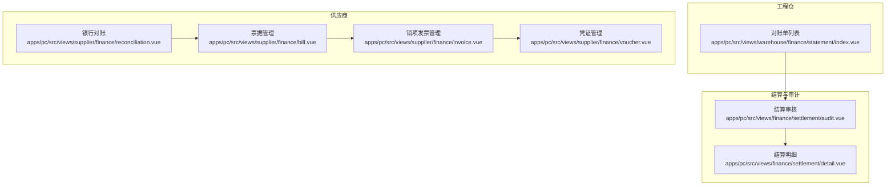
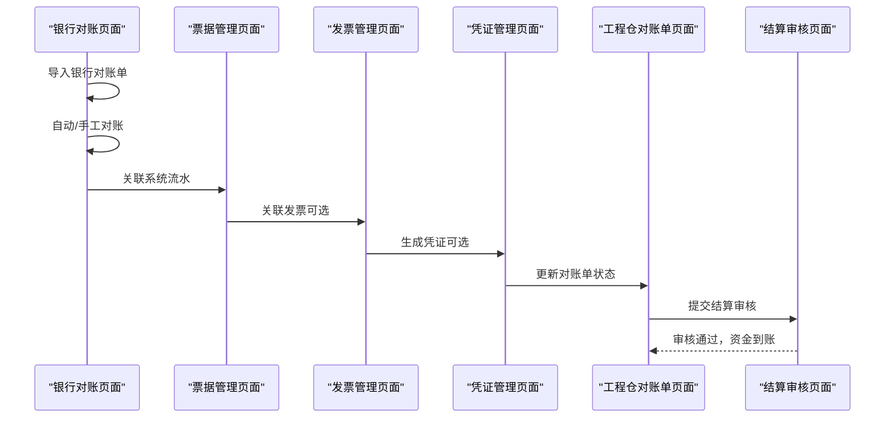
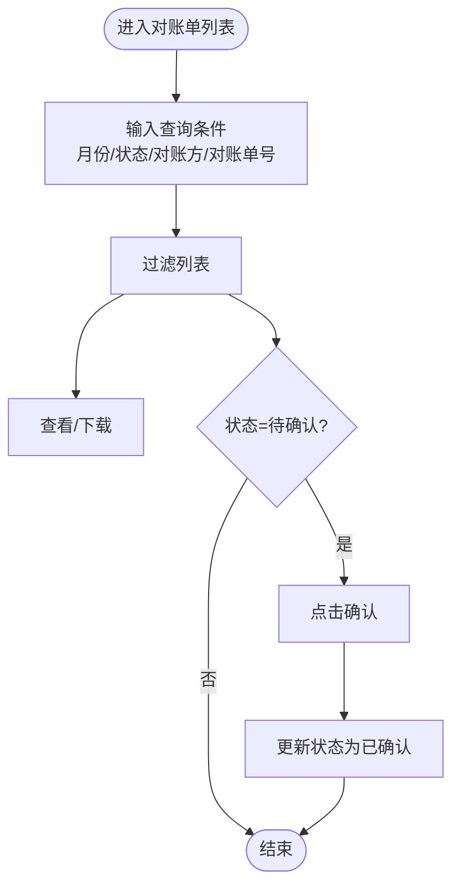
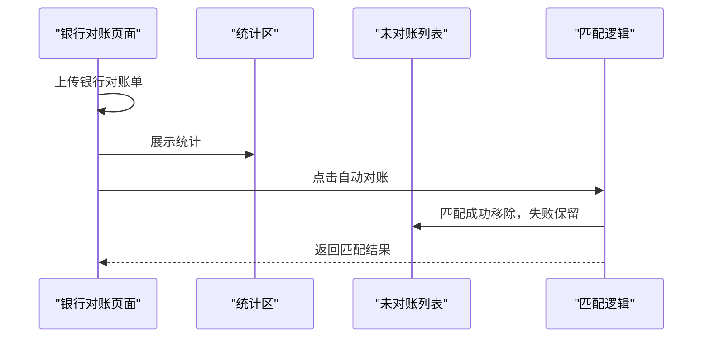
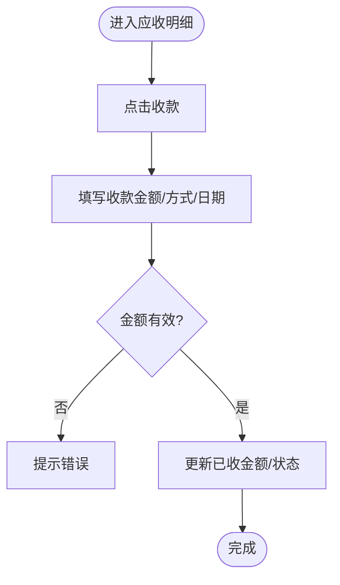
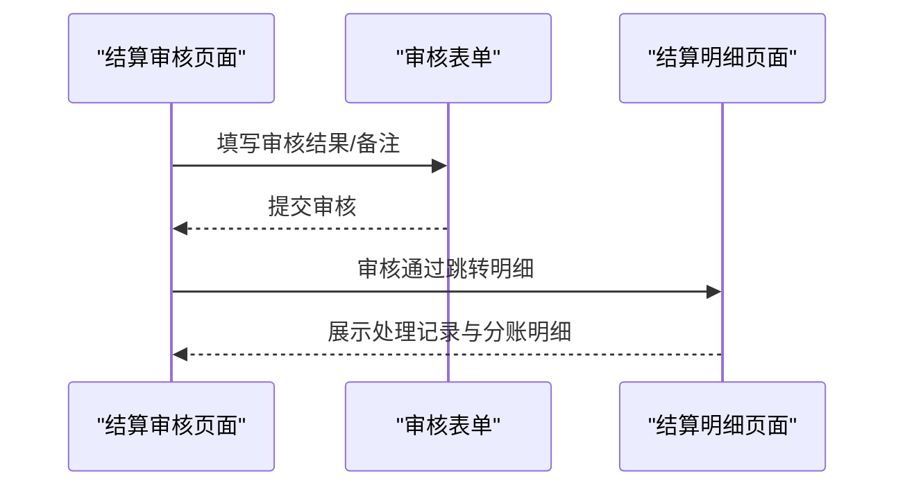
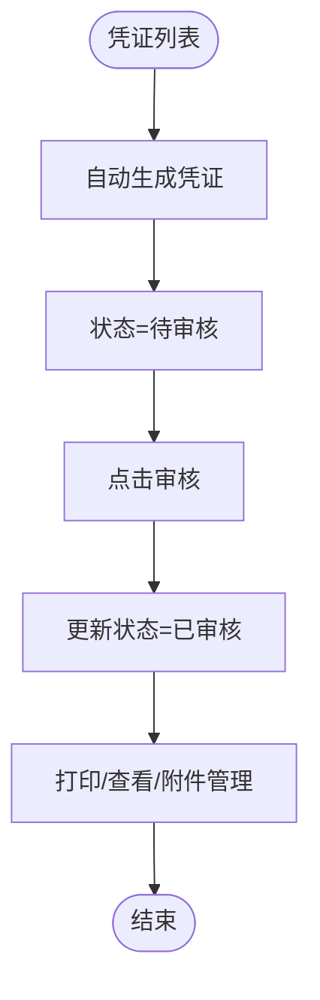
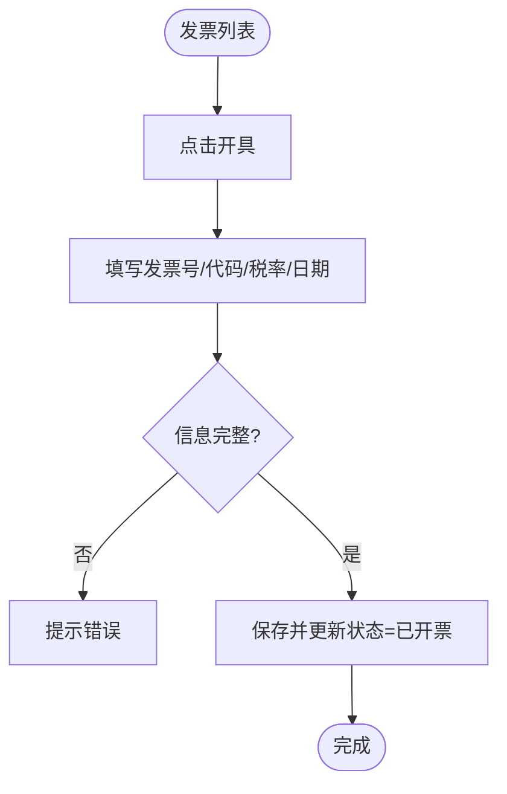

# 对账单管理

<cite>
**本文引用的文件**
- [apps/pc/src/views/warehouse/finance/statement/index.vue](file://apps/pc/src/views/warehouse/finance/statement/index.vue)
- [apps/pc/src/views/supplier/finance/reconciliation.vue](file://apps/pc/src/views/supplier/finance/reconciliation.vue)
- [apps/pc/src/views/supplier/finance/bill.vue](file://apps/pc/src/views/supplier/finance/bill.vue)
- [apps/pc/src/views/finance/settlement/audit.vue](file://apps/pc/src/views/finance/settlement/audit.vue)
- [apps/pc/src/views/finance/settlement/detail.vue](file://apps/pc/src/views/finance/settlement/detail.vue)
- [apps/pc/src/views/supplier/finance/invoice.vue](file://apps/pc/src/views/supplier/finance/invoice.vue)
- [apps/pc/src/views/supplier/finance/voucher.vue](file://apps/pc/src/views/supplier/finance/voucher.vue)
- [docs/01_PRD/工程仓端/12-财务中心功能设计.md](file://docs/01_PRD/工程仓端/12-财务中心功能设计.md)
- [apps/pc/public/prd-docs/12-财务中心功能设计.md](file://apps/pc/public/prd-docs/12-财务中心功能设计.md)
</cite>

## 目录
1. [简介](#简介)
2. [项目结构](#项目结构)
3. [核心组件](#核心组件)
4. [架构总览](#架构总览)
5. [详细组件分析](#详细组件分析)
6. [依赖关系分析](#依赖关系分析)
7. [性能考虑](#性能考虑)
8. [故障排查指南](#故障排查指南)
9. [结论](#结论)
10. [附录](#附录)

## 简介
本文件围绕工程仓对账单管理功能，系统化梳理从“对账单生成、核对、确认、查询”到“差异处理与结果分析”的全流程，并结合前端页面实现与PRD业务规则，给出操作指南与效率提升建议。对账单管理涉及工程仓侧的对账单列表与确认、供应商侧的银行对账与票据管理，以及结算审核与凭证管理等环节。

## 项目结构
对账单管理相关页面主要分布在PC端工程仓与供应商财务模块：
- 工程仓财务：对账单列表与确认
- 供应商财务：银行对账、票据管理、凭证管理
- 结算与审计：结算审核与明细展示
- 发票管理：销项发票的开具与红冲

图表来源
- [apps/pc/src/views/warehouse/finance/statement/index.vue:1-179](file://apps/pc/src/views/warehouse/finance/statement/index.vue#L1-L179)
- [apps/pc/src/views/supplier/finance/reconciliation.vue:1-354](file://apps/pc/src/views/supplier/finance/reconciliation.vue#L1-L354)
- [apps/pc/src/views/supplier/finance/bill.vue:1-371](file://apps/pc/src/views/supplier/finance/bill.vue#L1-L371)
- [apps/pc/src/views/finance/settlement/audit.vue:1-168](file://apps/pc/src/views/finance/settlement/audit.vue#L1-L168)
- [apps/pc/src/views/finance/settlement/detail.vue:1-159](file://apps/pc/src/views/finance/settlement/detail.vue#L1-L159)
- [apps/pc/src/views/supplier/finance/invoice.vue:1-333](file://apps/pc/src/views/supplier/finance/invoice.vue#L1-L333)
- [apps/pc/src/views/supplier/finance/voucher.vue:1-395](file://apps/pc/src/views/supplier/finance/voucher.vue#L1-L395)

章节来源
- [apps/pc/src/views/warehouse/finance/statement/index.vue:1-179](file://apps/pc/src/views/warehouse/finance/statement/index.vue#L1-L179)
- [apps/pc/src/views/supplier/finance/reconciliation.vue:1-354](file://apps/pc/src/views/supplier/finance/reconciliation.vue#L1-L354)
- [apps/pc/src/views/supplier/finance/bill.vue:1-371](file://apps/pc/src/views/supplier/finance/bill.vue#L1-L371)
- [apps/pc/src/views/finance/settlement/audit.vue:1-168](file://apps/pc/src/views/finance/settlement/audit.vue#L1-L168)
- [apps/pc/src/views/finance/settlement/detail.vue:1-159](file://apps/pc/src/views/finance/settlement/detail.vue#L1-L159)
- [apps/pc/src/views/supplier/finance/invoice.vue:1-333](file://apps/pc/src/views/supplier/finance/invoice.vue#L1-L333)
- [apps/pc/src/views/supplier/finance/voucher.vue:1-395](file://apps/pc/src/views/supplier/finance/voucher.vue#L1-L395)

## 核心组件
- 工程仓对账单管理（列表、查询、导出、生成、确认）
- 供应商银行对账（导入、自动/手工对账、差异调节）
- 票据管理（应收/应付、收款登记、账龄分析）
- 结算审核与明细（结算申请、审核、到账追踪）
- 凭证管理（凭证生成、审核、打印、附件）
- 发票管理（销项发票开具、红冲）

章节来源
- [apps/pc/src/views/warehouse/finance/statement/index.vue:1-179](file://apps/pc/src/views/warehouse/finance/statement/index.vue#L1-L179)
- [apps/pc/src/views/supplier/finance/reconciliation.vue:1-354](file://apps/pc/src/views/supplier/finance/reconciliation.vue#L1-L354)
- [apps/pc/src/views/supplier/finance/bill.vue:1-371](file://apps/pc/src/views/supplier/finance/bill.vue#L1-L371)
- [apps/pc/src/views/finance/settlement/audit.vue:1-168](file://apps/pc/src/views/finance/settlement/audit.vue#L1-L168)
- [apps/pc/src/views/finance/settlement/detail.vue:1-159](file://apps/pc/src/views/finance/settlement/detail.vue#L1-L159)
- [apps/pc/src/views/supplier/finance/invoice.vue:1-333](file://apps/pc/src/views/supplier/finance/invoice.vue#L1-L333)
- [apps/pc/src/views/supplier/finance/voucher.vue:1-395](file://apps/pc/src/views/supplier/finance/voucher.vue#L1-L395)

## 架构总览
对账单管理贯穿“数据采集—对账—确认—结算—凭证归档”的闭环：
- 数据采集：银行流水导入、支付流水、发票数据
- 对账：系统生成对账单 → 财务核对 → 自动/手工匹配 → 差异调节
- 确认：工程仓对账单状态更新为“已确认”
- 结算：结算审核通过后资金到账，生成结算明细
- 凭证：根据流水与发票生成记账凭证，完成账务归档

图表来源
- [apps/pc/src/views/supplier/finance/reconciliation.vue:1-354](file://apps/pc/src/views/supplier/finance/reconciliation.vue#L1-L354)
- [apps/pc/src/views/supplier/finance/bill.vue:1-371](file://apps/pc/src/views/supplier/finance/bill.vue#L1-L371)
- [apps/pc/src/views/supplier/finance/invoice.vue:1-333](file://apps/pc/src/views/supplier/finance/invoice.vue#L1-L333)
- [apps/pc/src/views/supplier/finance/voucher.vue:1-395](file://apps/pc/src/views/supplier/finance/voucher.vue#L1-L395)
- [apps/pc/src/views/warehouse/finance/statement/index.vue:1-179](file://apps/pc/src/views/warehouse/finance/statement/index.vue#L1-L179)
- [apps/pc/src/views/finance/settlement/audit.vue:1-168](file://apps/pc/src/views/finance/settlement/audit.vue#L1-L168)

## 详细组件分析

### 工程仓对账单管理（生成、核对、确认、查询）
- 功能点
  - 查询：按对账月份、状态筛选；支持对账单号、对账方模糊查询
  - 列表：展示对账单号、对账月份、对账方、采购/销售/应付金额、状态、创建时间
  - 操作：查看、下载、导出、生成、确认
- 流程图（查询与确认）

图表来源
- [apps/pc/src/views/warehouse/finance/statement/index.vue:79-148](file://apps/pc/src/views/warehouse/finance/statement/index.vue#L79-L148)

章节来源
- [apps/pc/src/views/warehouse/finance/statement/index.vue:1-179](file://apps/pc/src/views/warehouse/finance/statement/index.vue#L1-L179)

### 供应商银行对账（导入、自动/手工对账、差异调节）
- 功能点
  - 统计：已对账笔数/金额、未对账笔数/金额、差异金额
  - 导入：Excel/CSV银行流水
  - 自动对账：按金额、时间窗口、账户名称模糊匹配
  - 手工对账：选择系统流水进行匹配
  - 差异调节：调节表展示银行余额与系统余额差异项
- 顺序图（自动对账）

图表来源
- [apps/pc/src/views/supplier/finance/reconciliation.vue:260-270](file://apps/pc/src/views/supplier/finance/reconciliation.vue#L260-L270)

章节来源
- [apps/pc/src/views/supplier/finance/reconciliation.vue:1-354](file://apps/pc/src/views/supplier/finance/reconciliation.vue#L1-L354)

### 票据管理（应收/应付、收款登记、账龄分析）
- 功能点
  - 应收：账龄颜色标识、状态标签、收款登记、催收提醒
  - 应付：到期日期、状态、付款登记
  - 统计：应收账款、应付账款、30天以上账龄、坏账预警
- 流程图（收款登记）

图表来源
- [apps/pc/src/views/supplier/finance/bill.vue:310-332](file://apps/pc/src/views/supplier/finance/bill.vue#L310-L332)

章节来源
- [apps/pc/src/views/supplier/finance/bill.vue:1-371](file://apps/pc/src/views/supplier/finance/bill.vue#L1-L371)

### 结算审核与明细（结算申请、审核、到账追踪）
- 功能点
  - 审核：结算申请信息、账户信息、近期交易记录、审核结果与备注
  - 明细：结算单号、状态、银行账号、到账时间、处理记录时间轴、关联分账记录
- 顺序图（结算审核）

图表来源
- [apps/pc/src/views/finance/settlement/audit.vue:98-129](file://apps/pc/src/views/finance/settlement/audit.vue#L98-L129)
- [apps/pc/src/views/finance/settlement/detail.vue:36-61](file://apps/pc/src/views/finance/settlement/detail.vue#L36-L61)

章节来源
- [apps/pc/src/views/finance/settlement/audit.vue:1-168](file://apps/pc/src/views/finance/settlement/audit.vue#L1-L168)
- [apps/pc/src/views/finance/settlement/detail.vue:1-159](file://apps/pc/src/views/finance/settlement/detail.vue#L1-L159)

### 凭证管理（生成、审核、打印、附件）
- 功能点
  - 统计：待生成凭证、本月凭证数、已审核凭证、附件总数
  - 自动生成：根据流水与发票自动生成凭证
  - 审核：审核通过后状态更新
  - 查看/打印/上传附件/删除
- 流程图（凭证审核）

图表来源
- [apps/pc/src/views/supplier/finance/voucher.vue:293-316](file://apps/pc/src/views/supplier/finance/voucher.vue#L293-L316)

章节来源
- [apps/pc/src/views/supplier/finance/voucher.vue:1-395](file://apps/pc/src/views/supplier/finance/voucher.vue#L1-L395)

### 发票管理（销项发票开具、红冲）
- 功能点
  - 统计：待开发票、本月开票数/金额、累计开票金额
  - 搜索：按状态、类型、订单号、日期范围
  - 操作：开具、下载、红冲、查看详情
- 流程图（发票开具）

图表来源
- [apps/pc/src/views/supplier/finance/invoice.vue:288-309](file://apps/pc/src/views/supplier/finance/invoice.vue#L288-L309)

章节来源
- [apps/pc/src/views/supplier/finance/invoice.vue:1-333](file://apps/pc/src/views/supplier/finance/invoice.vue#L1-L333)

## 依赖关系分析
- 业务依赖
  - 银行对账 → 票据管理（系统流水与发票关联）
  - 票据管理 → 发票管理（发票开具与红冲）
  - 发票管理 → 凭证管理（生成记账凭证）
  - 凭证管理 → 工程仓对账单（对账单状态更新）
  - 工程仓对账单 → 结算审核（提交结算）
- 数据依赖
  - 支付流水、发票数据、订单金额构成对账基础
  - 差异调节表用于平衡银行余额与系统余额

图表来源
- [apps/pc/src/views/supplier/finance/reconciliation.vue:1-354](file://apps/pc/src/views/supplier/finance/reconciliation.vue#L1-L354)
- [apps/pc/src/views/supplier/finance/bill.vue:1-371](file://apps/pc/src/views/supplier/finance/bill.vue#L1-L371)
- [apps/pc/src/views/supplier/finance/invoice.vue:1-333](file://apps/pc/src/views/supplier/finance/invoice.vue#L1-L333)
- [apps/pc/src/views/supplier/finance/voucher.vue:1-395](file://apps/pc/src/views/supplier/finance/voucher.vue#L1-L395)
- [apps/pc/src/views/warehouse/finance/statement/index.vue:1-179](file://apps/pc/src/views/warehouse/finance/statement/index.vue#L1-L179)
- [apps/pc/src/views/finance/settlement/audit.vue:1-168](file://apps/pc/src/views/finance/settlement/audit.vue#L1-L168)

章节来源
- [apps/pc/src/views/supplier/finance/reconciliation.vue:1-354](file://apps/pc/src/views/supplier/finance/reconciliation.vue#L1-L354)
- [apps/pc/src/views/supplier/finance/bill.vue:1-371](file://apps/pc/src/views/supplier/finance/bill.vue#L1-L371)
- [apps/pc/src/views/supplier/finance/invoice.vue:1-333](file://apps/pc/src/views/supplier/finance/invoice.vue#L1-L333)
- [apps/pc/src/views/supplier/finance/voucher.vue:1-395](file://apps/pc/src/views/supplier/finance/voucher.vue#L1-L395)
- [apps/pc/src/views/warehouse/finance/statement/index.vue:1-179](file://apps/pc/src/views/warehouse/finance/statement/index.vue#L1-L179)
- [apps/pc/src/views/finance/settlement/audit.vue:1-168](file://apps/pc/src/views/finance/settlement/audit.vue#L1-L168)

## 性能考虑
- 列表分页与虚拟滚动：对账单、银行流水、票据、凭证列表建议使用分页或虚拟滚动，避免一次性渲染大量数据导致卡顿
- 搜索与过滤：前端本地过滤适合小数据集；大数据建议后端分页与服务端过滤
- 图片与附件：凭证附件数量较多时，采用懒加载与缩略图策略
- 自动对账批处理：批量匹配时采用异步处理与进度反馈，避免阻塞UI线程
- 缓存策略：对常用统计数据（如差异金额、账龄分布）进行缓存，减少重复计算

## 故障排查指南
- 银行对账无法导入
  - 检查文件格式是否为Excel/CSV，字段是否符合模板要求
  - 确认上传接口与权限配置
- 自动对账匹配率低
  - 核对匹配规则（金额、时间窗口、账户名称模糊度）
  - 手工对账时注意差异金额标注与后续调节
- 票据状态异常
  - 收款登记后未更新状态，检查金额校验与状态更新逻辑
  - 账龄颜色与状态映射函数是否正确
- 结算审核失败
  - 需要填写驳回原因时未填写，检查必填校验
  - 审核通过后跳转明细，确认路由与数据加载
- 凭证审核与打印
  - 待审核状态下才允许审核，检查状态判断
  - 打印前确保凭证内容渲染完成

章节来源
- [apps/pc/src/views/supplier/finance/reconciliation.vue:260-322](file://apps/pc/src/views/supplier/finance/reconciliation.vue#L260-L322)
- [apps/pc/src/views/supplier/finance/bill.vue:310-344](file://apps/pc/src/views/supplier/finance/bill.vue#L310-L344)
- [apps/pc/src/views/finance/settlement/audit.vue:115-129](file://apps/pc/src/views/finance/settlement/audit.vue#L115-L129)
- [apps/pc/src/views/supplier/finance/voucher.vue:301-334](file://apps/pc/src/views/supplier/finance/voucher.vue#L301-L334)

## 结论
工程仓对账单管理通过“银行对账—票据管理—发票与凭证—结算审核—对账单确认”的闭环，实现了线下资金流与系统账务的高效对齐。建议在保证合规的前提下，持续优化自动对账匹配率、完善差异调节机制，并通过凭证自动化生成与结算流程优化进一步提升财务效率。

## 附录

### 业务规则与模板参考
- 对账周期：支持月度/季度/自定义
- 数据来源：支付流水 + 发票数据 + 订单金额
- 对账方式：系统生成对账单 → 财务手工核对 → 标记“已对账”
- 差异处理：核对发现差异 → 手工备注 + 线下沟通
- 线下闭环：系统内支付为标记操作，实际资金走线下银行转账

章节来源
- [docs/01_PRD/工程仓端/12-财务中心功能设计.md:110-115](file://docs/01_PRD/工程仓端/12-财务中心功能设计.md#L110-L115)
- [apps/pc/public/prd-docs/12-财务中心功能设计.md:110-115](file://apps/pc/public/prd-docs/12-财务中心功能设计.md#L110-L115)