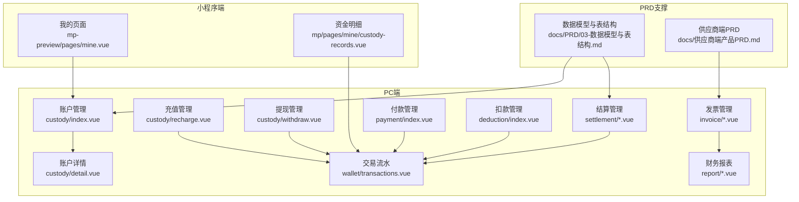
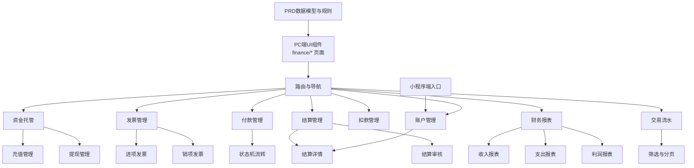
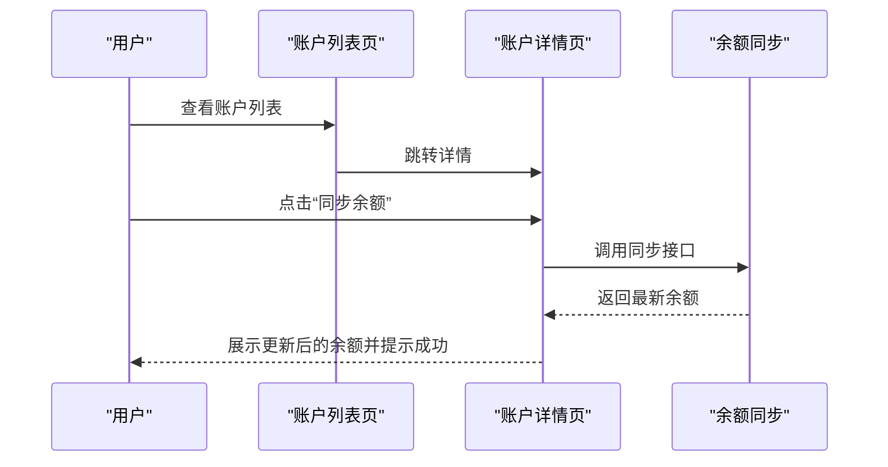
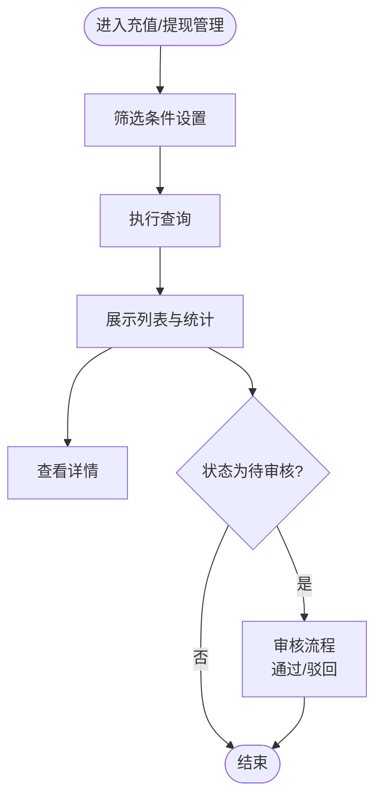
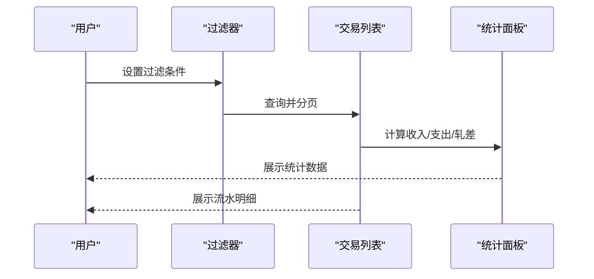
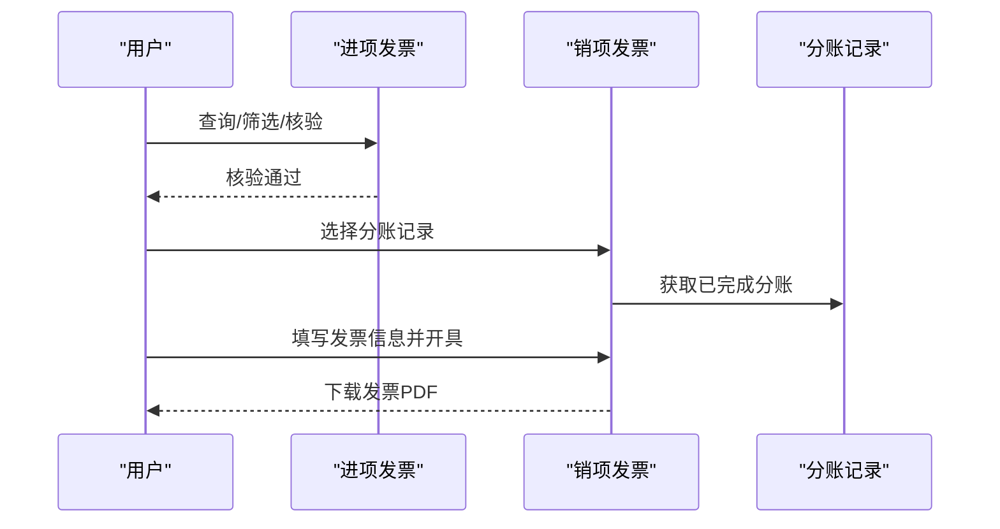
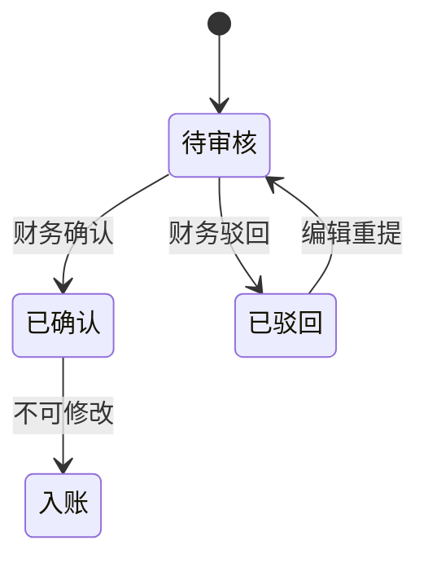
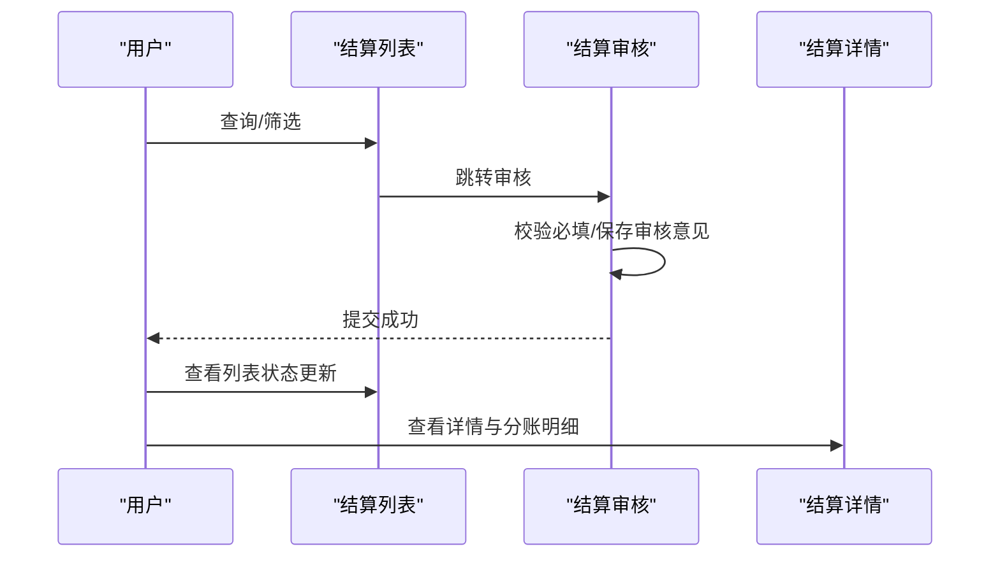
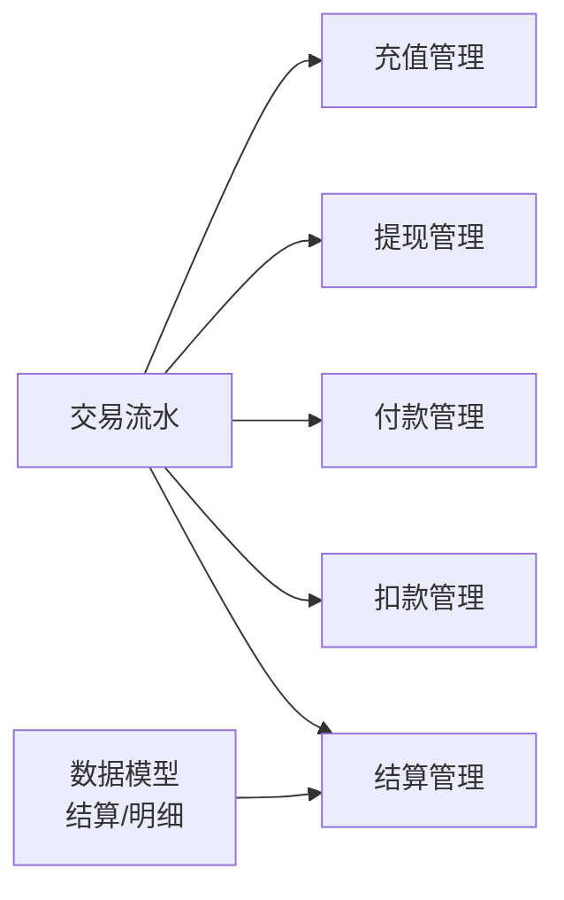

# 工程仓财务模块

<cite>
**本文档引用的文件**
- [apps/pc/src/views/finance/custody/index.vue](file://apps/pc/src/views/finance/custody/index.vue)
- [apps/pc/src/views/finance/custody/detail.vue](file://apps/pc/src/views/finance/custody/detail.vue)
- [apps/pc/src/views/finance/custody/recharge.vue](file://apps/pc/src/views/finance/custody/recharge.vue)
- [apps/pc/src/views/finance/custody/withdraw.vue](file://apps/pc/src/views/finance/custody/withdraw.vue)
- [apps/pc/src/views/finance/invoice/input.vue](file://apps/pc/src/views/finance/invoice/input.vue)
- [apps/pc/src/views/finance/invoice/output.vue](file://apps/pc/src/views/finance/invoice/output.vue)
- [apps/pc/src/views/finance/payment/index.vue](file://apps/pc/src/views/finance/payment/index.vue)
- [apps/pc/src/views/finance/deduction/index.vue](file://apps/pc/src/views/finance/deduction/index.vue)
- [apps/pc/src/views/finance/settlement/index.vue](file://apps/pc/src/views/finance/settlement/index.vue)
- [apps/pc/src/views/finance/settlement/audit.vue](file://apps/pc/src/views/finance/settlement/audit.vue)
- [apps/pc/src/views/finance/settlement/detail.vue](file://apps/pc/src/views/finance/settlement/detail.vue)
- [apps/pc/src/views/finance/wallet/transactions.vue](file://apps/pc/src/views/finance/wallet/transactions.vue)
- [apps/pc/src/views/finance/report/income.vue](file://apps/pc/src/views/finance/report/income.vue)
- [apps/pc/src/views/finance/report/expense.vue](file://apps/pc/src/views/finance/report/expense.vue)
- [apps/pc/src/views/finance/report/profit.vue](file://apps/pc/src/views/finance/report/profit.vue)
- [apps/pc/src/views/mp-preview/pages/mine.vue](file://apps/pc/src/views/mp-preview/pages/mine.vue)
- [apps/mp/src/pages/mine/custody-records.vue](file://apps/mp/src/pages/mine/custody-records.vue)
- [docs/PRD/03-数据模型与表结构.md](file://docs/PRD/03-数据模型与表结构.md)
- [docs/供应商端产品PRD.md](file://docs/供应商端产品PRD.md)
</cite>

## 目录
1. [简介](#简介)
2. [项目结构](#项目结构)
3. [核心组件](#核心组件)
4. [架构总览](#架构总览)
5. [详细组件分析](#详细组件分析)
6. [依赖关系分析](#依赖关系分析)
7. [性能考虑](#性能考虑)
8. [故障排除指南](#故障排除指南)
9. [结论](#结论)
10. [附录](#附录)

## 简介
本文件面向工程仓财务模块，系统性梳理账户管理、收支明细、资金托管、交易流水、发票管理、付款管理、结算管理、对账与报表等核心功能。文档以代码实现为依据，结合PRD中的业务规则，给出架构视图、数据流、权限控制、风险控制与最佳实践，帮助开发者与运营人员快速理解并高效使用工程仓财务体系。

## 项目结构
工程仓财务模块位于PC端与小程序端的多个页面中，采用按功能域划分的组织方式：
- PC端财务模块：账户、资金托管、发票、付款、扣款、结算、报表、交易流水等页面
- 小程序端财务入口：资金托管账户卡片与交易明细入口
- PRD文档：提供业务规则、流程与数据模型支撑

图表来源
- [apps/pc/src/views/finance/custody/index.vue:1-120](file://apps/pc/src/views/finance/custody/index.vue#L1-L120)
- [apps/pc/src/views/finance/custody/detail.vue:1-120](file://apps/pc/src/views/finance/custody/detail.vue#L1-L120)
- [apps/pc/src/views/finance/custody/recharge.vue:1-120](file://apps/pc/src/views/finance/custody/recharge.vue#L1-L120)
- [apps/pc/src/views/finance/custody/withdraw.vue:1-120](file://apps/pc/src/views/finance/custody/withdraw.vue#L1-L120)
- [apps/pc/src/views/finance/invoice/input.vue:1-120](file://apps/pc/src/views/finance/invoice/input.vue#L1-L120)
- [apps/pc/src/views/finance/invoice/output.vue:1-120](file://apps/pc/src/views/finance/invoice/output.vue#L1-L120)
- [apps/pc/src/views/finance/payment/index.vue:1-120](file://apps/pc/src/views/finance/payment/index.vue#L1-L120)
- [apps/pc/src/views/finance/deduction/index.vue:1-120](file://apps/pc/src/views/finance/deduction/index.vue#L1-L120)
- [apps/pc/src/views/finance/settlement/index.vue:1-120](file://apps/pc/src/views/finance/settlement/index.vue#L1-L120)
- [apps/pc/src/views/finance/settlement/audit.vue:1-120](file://apps/pc/src/views/finance/settlement/audit.vue#L1-L120)
- [apps/pc/src/views/finance/settlement/detail.vue:1-120](file://apps/pc/src/views/finance/settlement/detail.vue#L1-L120)
- [apps/pc/src/views/finance/wallet/transactions.vue:1-120](file://apps/pc/src/views/finance/wallet/transactions.vue#L1-L120)
- [apps/pc/src/views/finance/report/income.vue:1-120](file://apps/pc/src/views/finance/report/income.vue#L1-L120)
- [apps/pc/src/views/finance/report/expense.vue:1-120](file://apps/pc/src/views/finance/report/expense.vue#L1-L120)
- [apps/pc/src/views/finance/report/profit.vue:1-120](file://apps/pc/src/views/finance/report/profit.vue#L1-L120)
- [apps/pc/src/views/mp-preview/pages/mine.vue:1-120](file://apps/pc/src/views/mp-preview/pages/mine.vue#L1-L120)
- [apps/mp/src/pages/mine/custody-records.vue:1-120](file://apps/mp/src/pages/mine/custody-records.vue#L1-L120)
- [docs/PRD/03-数据模型与表结构.md:771-794](file://docs/PRD/03-数据模型与表结构.md#L771-L794)
- [docs/供应商端产品PRD.md:445-481](file://docs/供应商端产品PRD.md#L445-L481)

章节来源
- [apps/pc/src/views/finance/custody/index.vue:1-120](file://apps/pc/src/views/finance/custody/index.vue#L1-L120)
- [apps/pc/src/views/finance/custody/detail.vue:1-120](file://apps/pc/src/views/finance/custody/detail.vue#L1-L120)
- [apps/pc/src/views/finance/custody/recharge.vue:1-120](file://apps/pc/src/views/finance/custody/recharge.vue#L1-L120)
- [apps/pc/src/views/finance/custody/withdraw.vue:1-120](file://apps/pc/src/views/finance/custody/withdraw.vue#L1-L120)
- [apps/pc/src/views/finance/invoice/input.vue:1-120](file://apps/pc/src/views/finance/invoice/input.vue#L1-L120)
- [apps/pc/src/views/finance/invoice/output.vue:1-120](file://apps/pc/src/views/finance/invoice/output.vue#L1-L120)
- [apps/pc/src/views/finance/payment/index.vue:1-120](file://apps/pc/src/views/finance/payment/index.vue#L1-L120)
- [apps/pc/src/views/finance/deduction/index.vue:1-120](file://apps/pc/src/views/finance/deduction/index.vue#L1-L120)
- [apps/pc/src/views/finance/settlement/index.vue:1-120](file://apps/pc/src/views/finance/settlement/index.vue#L1-L120)
- [apps/pc/src/views/finance/settlement/audit.vue:1-120](file://apps/pc/src/views/finance/settlement/audit.vue#L1-L120)
- [apps/pc/src/views/finance/settlement/detail.vue:1-120](file://apps/pc/src/views/finance/settlement/detail.vue#L1-L120)
- [apps/pc/src/views/finance/wallet/transactions.vue:1-120](file://apps/pc/src/views/finance/wallet/transactions.vue#L1-L120)
- [apps/pc/src/views/finance/report/income.vue:1-120](file://apps/pc/src/views/finance/report/income.vue#L1-L120)
- [apps/pc/src/views/finance/report/expense.vue:1-120](file://apps/pc/src/views/finance/report/expense.vue#L1-L120)
- [apps/pc/src/views/finance/report/profit.vue:1-120](file://apps/pc/src/views/finance/report/profit.vue#L1-L120)
- [apps/pc/src/views/mp-preview/pages/mine.vue:1-120](file://apps/pc/src/views/mp-preview/pages/mine.vue#L1-L120)
- [apps/mp/src/pages/mine/custody-records.vue:1-120](file://apps/mp/src/pages/mine/custody-records.vue#L1-L120)
- [docs/PRD/03-数据模型与表结构.md:771-794](file://docs/PRD/03-数据模型与表结构.md#L771-L794)
- [docs/供应商端产品PRD.md:445-481](file://docs/供应商端产品PRD.md#L445-L481)

## 核心组件
- 账户管理：托管账户总览、账户详情、余额同步、状态管理
- 资金托管：充值、提现、账户冻结、余额充值、资金划转
- 收支明细：订单交易、退款、服务费、提现、充值等业务类型的流水
- 发票管理：进项发票（平台收票）、销项发票（平台开票）
- 付款管理：线下支付登记、凭证上传、状态流转
- 扣款管理：罚款、违约金、其他应扣款项
- 结算管理：结算申请、审核、到账、明细与历史
- 报表统计：收入、支出、利润、趋势与构成分析
- 对账与差异调节：银行流水导入、三重匹配规则、差异调节

章节来源
- [apps/pc/src/views/finance/custody/index.vue:60-120](file://apps/pc/src/views/finance/custody/index.vue#L60-L120)
- [apps/pc/src/views/finance/custody/detail.vue:18-120](file://apps/pc/src/views/finance/custody/detail.vue#L18-L120)
- [apps/pc/src/views/finance/custody/recharge.vue:1-120](file://apps/pc/src/views/finance/custody/recharge.vue#L1-L120)
- [apps/pc/src/views/finance/custody/withdraw.vue:1-120](file://apps/pc/src/views/finance/custody/withdraw.vue#L1-L120)
- [apps/pc/src/views/finance/invoice/input.vue:1-120](file://apps/pc/src/views/finance/invoice/input.vue#L1-L120)
- [apps/pc/src/views/finance/invoice/output.vue:1-120](file://apps/pc/src/views/finance/invoice/output.vue#L1-L120)
- [apps/pc/src/views/finance/payment/index.vue:1-120](file://apps/pc/src/views/finance/payment/index.vue#L1-L120)
- [apps/pc/src/views/finance/deduction/index.vue:1-120](file://apps/pc/src/views/finance/deduction/index.vue#L1-L120)
- [apps/pc/src/views/finance/settlement/index.vue:1-120](file://apps/pc/src/views/finance/settlement/index.vue#L1-L120)
- [apps/pc/src/views/finance/settlement/audit.vue:1-120](file://apps/pc/src/views/finance/settlement/audit.vue#L1-L120)
- [apps/pc/src/views/finance/settlement/detail.vue:1-120](file://apps/pc/src/views/finance/settlement/detail.vue#L1-L120)
- [apps/pc/src/views/finance/wallet/transactions.vue:1-120](file://apps/pc/src/views/finance/wallet/transactions.vue#L1-L120)
- [apps/pc/src/views/finance/report/income.vue:1-120](file://apps/pc/src/views/finance/report/income.vue#L1-L120)
- [apps/pc/src/views/finance/report/expense.vue:1-120](file://apps/pc/src/views/finance/report/expense.vue#L1-L120)
- [apps/pc/src/views/finance/report/profit.vue:1-120](file://apps/pc/src/views/finance/report/profit.vue#L1-L120)

## 架构总览
工程仓财务模块采用前后端分离的前端SPA架构，PC端通过Vue组件化实现各功能域页面；数据通过本地模拟或API接口驱动；权限控制基于角色与状态机；报表与对账通过可视化图表与筛选器呈现。

图表来源
- [apps/pc/src/views/finance/custody/index.vue:1-120](file://apps/pc/src/views/finance/custody/index.vue#L1-L120)
- [apps/pc/src/views/finance/custody/detail.vue:1-120](file://apps/pc/src/views/finance/custody/detail.vue#L1-L120)
- [apps/pc/src/views/finance/custody/recharge.vue:1-120](file://apps/pc/src/views/finance/custody/recharge.vue#L1-L120)
- [apps/pc/src/views/finance/custody/withdraw.vue:1-120](file://apps/pc/src/views/finance/custody/withdraw.vue#L1-L120)
- [apps/pc/src/views/finance/invoice/input.vue:1-120](file://apps/pc/src/views/finance/invoice/input.vue#L1-L120)
- [apps/pc/src/views/finance/invoice/output.vue:1-120](file://apps/pc/src/views/finance/invoice/output.vue#L1-L120)
- [apps/pc/src/views/finance/payment/index.vue:1-120](file://apps/pc/src/views/finance/payment/index.vue#L1-L120)
- [apps/pc/src/views/finance/deduction/index.vue:1-120](file://apps/pc/src/views/finance/deduction/index.vue#L1-L120)
- [apps/pc/src/views/finance/settlement/index.vue:1-120](file://apps/pc/src/views/finance/settlement/index.vue#L1-L120)
- [apps/pc/src/views/finance/settlement/audit.vue:1-120](file://apps/pc/src/views/finance/settlement/audit.vue#L1-L120)
- [apps/pc/src/views/finance/settlement/detail.vue:1-120](file://apps/pc/src/views/finance/settlement/detail.vue#L1-L120)
- [apps/pc/src/views/finance/wallet/transactions.vue:1-120](file://apps/pc/src/views/finance/wallet/transactions.vue#L1-L120)
- [apps/pc/src/views/finance/report/income.vue:1-120](file://apps/pc/src/views/finance/report/income.vue#L1-L120)
- [apps/pc/src/views/finance/report/expense.vue:1-120](file://apps/pc/src/views/finance/report/expense.vue#L1-L120)
- [apps/pc/src/views/finance/report/profit.vue:1-120](file://apps/pc/src/views/finance/report/profit.vue#L1-L120)
- [apps/pc/src/views/mp-preview/pages/mine.vue:1-120](file://apps/pc/src/views/mp-preview/pages/mine.vue#L1-L120)
- [docs/PRD/03-数据模型与表结构.md:771-794](file://docs/PRD/03-数据模型与表结构.md#L771-L794)

## 详细组件分析

### 账户管理
- 功能要点
  - 账户总览：账户状态、可用余额、冻结余额、总余额、最后同步时间
  - 账户详情：账户余额、冻结金额、可用余额、账户信息、操作（同步余额、跳转明细）
  - 余额同步：触发后刷新余额并提示成功
- 数据与状态
  - 账户状态映射、余额格式化、标签颜色
  - 分页参数与页面变更回调
- 权限与交互
  - 详情页支持返回列表
  - 同步余额具备错误兜底提示

图表来源
- [apps/pc/src/views/finance/custody/index.vue:60-120](file://apps/pc/src/views/finance/custody/index.vue#L60-L120)
- [apps/pc/src/views/finance/custody/detail.vue:329-351](file://apps/pc/src/views/finance/custody/detail.vue#L329-L351)

章节来源
- [apps/pc/src/views/finance/custody/index.vue:60-120](file://apps/pc/src/views/finance/custody/index.vue#L60-L120)
- [apps/pc/src/views/finance/custody/detail.vue:18-120](file://apps/pc/src/views/finance/custody/detail.vue#L18-L120)

### 资金托管（充值/提现/冻结）
- 充值管理
  - 统计：今日充值、本月充值、待审核笔数、充值成功率
  - 筛选：充值单号、商户类型、商户名称、充值方式、状态、时间范围
  - 列表：充值金额、到账账户、申请时间、到账时间、状态、操作（详情、审核）
  - 审核：通过/驳回，填写驳回原因
- 提现管理
  - 统计：今日提现、本月提现、待审核笔数、处理中笔数
  - 筛选：提现单号、商户类型、商户名称、提现银行、状态、时间范围
  - 列表：提现金额、手续费、到账金额、提现银行、状态、操作（详情、审核）
  - 审核：通过/驳回，填写驳回原因
- 冻结与余额
  - 账户详情页展示冻结金额与可用余额
  - 充值/提现流程完成后余额更新

图表来源
- [apps/pc/src/views/finance/custody/recharge.vue:220-293](file://apps/pc/src/views/finance/custody/recharge.vue#L220-L293)
- [apps/pc/src/views/finance/custody/withdraw.vue:226-295](file://apps/pc/src/views/finance/custody/withdraw.vue#L226-L295)

章节来源
- [apps/pc/src/views/finance/custody/recharge.vue:1-120](file://apps/pc/src/views/finance/custody/recharge.vue#L1-L120)
- [apps/pc/src/views/finance/custody/withdraw.vue:1-120](file://apps/pc/src/views/finance/custody/withdraw.vue#L1-L120)
- [apps/pc/src/views/finance/custody/detail.vue:18-120](file://apps/pc/src/views/finance/custody/detail.vue#L18-L120)

### 交易流水查询
- 功能要点
  - 过滤：账户、账户类型、收支类型、业务类型、时间范围
  - 统计：交易笔数、总收入、总支出、轧差
  - 列表：流水号、交易时间、账户名称、账户类型、收支类型、业务类型、交易金额、账户余额、关联单据、备注
- 数据与复杂度
  - 支持本地计算与分页，避免全量请求
  - 金额与余额千分位格式化，颜色区分收支

图表来源
- [apps/pc/src/views/finance/wallet/transactions.vue:313-399](file://apps/pc/src/views/finance/wallet/transactions.vue#L313-L399)

章节来源
- [apps/pc/src/views/finance/wallet/transactions.vue:1-120](file://apps/pc/src/views/finance/wallet/transactions.vue#L1-L120)

### 发票管理（进项/销项）
- 进项发票（平台收票）
  - 统计：本月进项金额、进项税额、待核验发票、发票总数
  - 筛选：发票号码、开票方、发票类型、核验状态
  - 列表：金额（不含税）、税额、价税合计、开票日期、状态、操作（查看、核验）
  - 核验：核验通过后入账
- 销项发票（平台开票）
  - 统计：待开票金额、本月开票金额、本月开票税额、本月开票数
  - 标签：全部/待开票/已开具/已作废
  - 筛选：发票号码、收票方、来源、开票日期
  - 流程：选择分账记录→填写发票信息→开具→下载PDF
  - 差异调节：支持对账差异调节（PRD中描述）

图表来源
- [apps/pc/src/views/finance/invoice/input.vue:201-248](file://apps/pc/src/views/finance/invoice/input.vue#L201-L248)
- [apps/pc/src/views/finance/invoice/output.vue:366-454](file://apps/pc/src/views/finance/invoice/output.vue#L366-L454)
- [docs/供应商端产品PRD.md:445-481](file://docs/供应商端产品PRD.md#L445-L481)

章节来源
- [apps/pc/src/views/finance/invoice/input.vue:1-120](file://apps/pc/src/views/finance/invoice/input.vue#L1-L120)
- [apps/pc/src/views/finance/invoice/output.vue:1-120](file://apps/pc/src/views/finance/invoice/output.vue#L1-L120)
- [docs/供应商端产品PRD.md:445-481](file://docs/供应商端产品PRD.md#L445-L481)

### 付款管理
- 功能要点
  - 支付类型：工程仓→施工方、施工方→工程仓
  - 支付状态：待审核、已确认、已驳回
  - 列表：支付单号、关联订单、付款方、收款方、支付金额、支付方式、支付状态、支付时间、确认时间、操作人、操作（查看凭证）
  - 凭证：支持查看银行回单截图
- 权限与状态机
  - 状态流转：登记支付 → 待审核 → 财务确认 → 已确认 → 入账
  - 驳回后可重新编辑并回到待审核

图表来源
- [apps/pc/src/views/finance/payment/index.vue:203-232](file://apps/pc/src/views/finance/payment/index.vue#L203-L232)

章节来源
- [apps/pc/src/views/finance/payment/index.vue:1-120](file://apps/pc/src/views/finance/payment/index.vue#L1-L120)

### 扣款管理
- 功能要点
  - 应扣类型：罚款、违约金、其他
  - 列表：应扣编号、关联订单、供应商、应扣类型、应扣金额、扣款状态、应扣原因、创建时间
  - 筛选：关键词、供应商、状态、时间范围
- 业务价值
  - 保障合同履约，维护平台生态

章节来源
- [apps/pc/src/views/finance/deduction/index.vue:1-120](file://apps/pc/src/views/finance/deduction/index.vue#L1-L120)

### 结算管理
- 结算列表
  - 统计：待审核结算、待审核金额、本月已结算、本月结算笔数
  - 筛选：结算单号、商户名称、结算状态、申请时间
  - 列表：结算金额、结算银行、申请时间、结算状态、到账时间、操作（详情、审核）
- 结算审核
  - 申请信息、账户信息、近期交易记录、审核结果（通过/驳回）、备注
- 结算详情
  - 处理记录（时间轴）、关联分账记录（分账单号、关联订单、交易金额、分账金额、分账时间）

图表来源
- [apps/pc/src/views/finance/settlement/index.vue:177-228](file://apps/pc/src/views/finance/settlement/index.vue#L177-L228)
- [apps/pc/src/views/finance/settlement/audit.vue:115-129](file://apps/pc/src/views/finance/settlement/audit.vue#L115-L129)
- [apps/pc/src/views/finance/settlement/detail.vue:34-85](file://apps/pc/src/views/finance/settlement/detail.vue#L34-L85)

章节来源
- [apps/pc/src/views/finance/settlement/index.vue:1-120](file://apps/pc/src/views/finance/settlement/index.vue#L1-L120)
- [apps/pc/src/views/finance/settlement/audit.vue:1-120](file://apps/pc/src/views/finance/settlement/audit.vue#L1-L120)
- [apps/pc/src/views/finance/settlement/detail.vue:1-120](file://apps/pc/src/views/finance/settlement/detail.vue#L1-L120)

### 报表统计
- 收入报表：收入趋势、收入构成、收入明细
- 支出报表：支出趋势、支出构成、支出明细
- 利润报表：收支对比趋势、利润来源分析、关键指标、利润明细
- 统一的时间范围切换（今日/本周/本月/本年）与导出能力

章节来源
- [apps/pc/src/views/finance/report/income.vue:1-120](file://apps/pc/src/views/finance/report/income.vue#L1-L120)
- [apps/pc/src/views/finance/report/expense.vue:1-120](file://apps/pc/src/views/finance/report/expense.vue#L1-L120)
- [apps/pc/src/views/finance/report/profit.vue:1-120](file://apps/pc/src/views/finance/report/profit.vue#L1-L120)

### 对账与差异调节
- 银行对账三步骤：导入→匹配→处理
- 匹配规则：金额完全匹配、交易时间±3天、对方账户名称模糊匹配
- 差异调节：企业已收/银行未收、企业已付/银行未付、银行已收/企业未收、银行已付/企业未付

章节来源
- [docs/供应商端产品PRD.md:445-481](file://docs/供应商端产品PRD.md#L445-L481)

## 依赖关系分析
- 组件内聚与耦合
  - 各功能域页面相对独立，通过路由与状态机连接
  - 交易流水作为跨域数据枢纽，被充值、提现、付款、扣款、结算等模块引用
- 外部依赖
  - UI库：Arco Design（表格、标签、统计、模态框等）
  - 图表：柱状图、饼图、进度条等可视化组件
- 数据模型支撑
  - 结算表与结算明细表明细字段映射至前端展示与筛选

图表来源
- [apps/pc/src/views/finance/wallet/transactions.vue:1-120](file://apps/pc/src/views/finance/wallet/transactions.vue#L1-L120)
- [apps/pc/src/views/finance/custody/recharge.vue:1-120](file://apps/pc/src/views/finance/custody/recharge.vue#L1-L120)
- [apps/pc/src/views/finance/custody/withdraw.vue:1-120](file://apps/pc/src/views/finance/custody/withdraw.vue#L1-L120)
- [apps/pc/src/views/finance/payment/index.vue:1-120](file://apps/pc/src/views/finance/payment/index.vue#L1-L120)
- [apps/pc/src/views/finance/deduction/index.vue:1-120](file://apps/pc/src/views/finance/deduction/index.vue#L1-L120)
- [apps/pc/src/views/finance/settlement/index.vue:1-120](file://apps/pc/src/views/finance/settlement/index.vue#L1-L120)
- [docs/PRD/03-数据模型与表结构.md:771-794](file://docs/PRD/03-数据模型与表结构.md#L771-L794)

章节来源
- [apps/pc/src/views/finance/wallet/transactions.vue:1-120](file://apps/pc/src/views/finance/wallet/transactions.vue#L1-L120)
- [docs/PRD/03-数据模型与表结构.md:771-794](file://docs/PRD/03-数据模型与表结构.md#L771-L794)

## 性能考虑
- 列表分页与虚拟滚动：前端分页减少网络压力，必要时可引入虚拟滚动优化长列表
- 本地计算与缓存：交易流水与报表采用本地计算，避免频繁请求；对高频筛选结果可做缓存
- 图表渲染：柱状图/饼图按需渲染，避免重复计算；时间范围切换时复用已有数据
- 状态机与权限：前端严格控制按钮可见性与可操作性，减少无效请求

## 故障排除指南
- 余额同步失败
  - 现象：点击“同步余额”后提示失败
  - 排查：检查网络状态、接口连通性、错误消息
  - 处理：重试同步或联系技术支持
- 充值/提现审核异常
  - 现象：审核通过后状态未更新或提示失败
  - 排查：确认驳回原因是否必填、网络请求是否成功
  - 处理：完善必填项后重新提交
- 发票开具失败
  - 现象：填写发票信息后无法提交
  - 排查：发票号码是否为空、分账记录是否可合并
  - 处理：补齐必填信息或调整分账组合
- 交易流水为空
  - 现象：筛选后无数据
  - 排查：时间范围是否合理、过滤条件是否过严
  - 处理：放宽筛选条件或重置查询

章节来源
- [apps/pc/src/views/finance/custody/detail.vue:339-347](file://apps/pc/src/views/finance/custody/detail.vue#L339-L347)
- [apps/pc/src/views/finance/custody/recharge.vue:286-293](file://apps/pc/src/views/finance/custody/recharge.vue#L286-L293)
- [apps/pc/src/views/finance/custody/withdraw.vue:288-295](file://apps/pc/src/views/finance/custody/withdraw.vue#L288-L295)
- [apps/pc/src/views/finance/invoice/output.vue:446-454](file://apps/pc/src/views/finance/invoice/output.vue#L446-L454)
- [apps/pc/src/views/finance/wallet/transactions.vue:382-399](file://apps/pc/src/views/finance/wallet/transactions.vue#L382-L399)

## 结论
工程仓财务模块以清晰的功能域划分与完善的前端实现，覆盖了账户、资金、发票、付款、扣款、结算、报表与对账等关键环节。通过状态机与权限控制确保流程合规，通过可视化与筛选提升运营效率。建议在后续迭代中强化后端接口对接、异常监控与审计日志，持续优化用户体验与数据准确性。

## 附录
- 小程序端入口
  - 资金托管账户卡片与“查看明细”跳转
  - 资金明细列表（采购付款、销售收款、服务费、退款解冻等）

章节来源
- [apps/pc/src/views/mp-preview/pages/mine.vue:38-64](file://apps/pc/src/views/mp-preview/pages/mine.vue#L38-L64)
- [apps/mp/src/pages/mine/custody-records.vue:148-182](file://apps/mp/src/pages/mine/custody-records.vue#L148-L182)