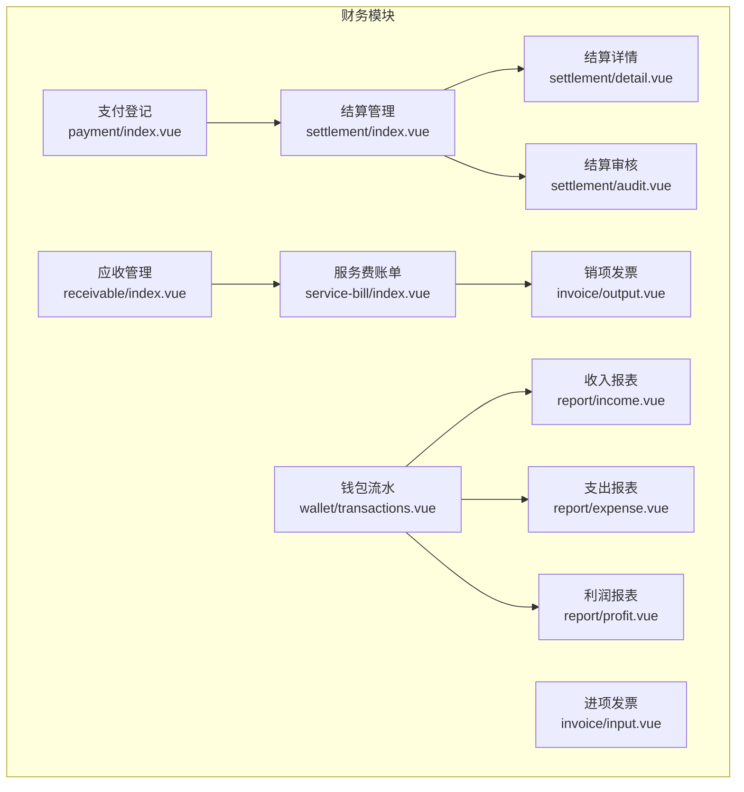
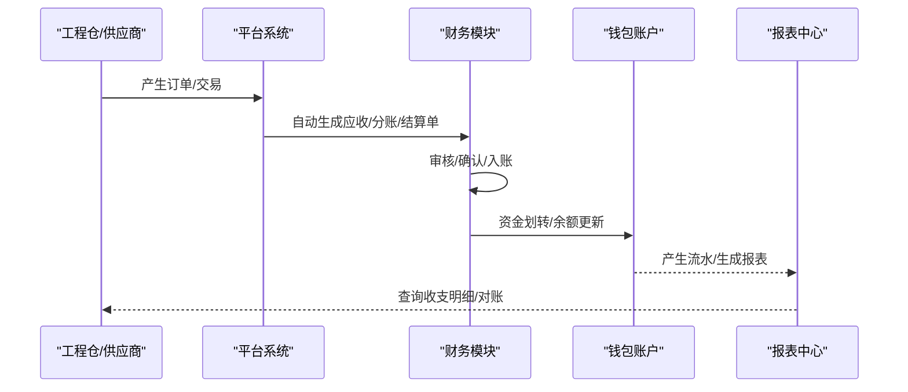
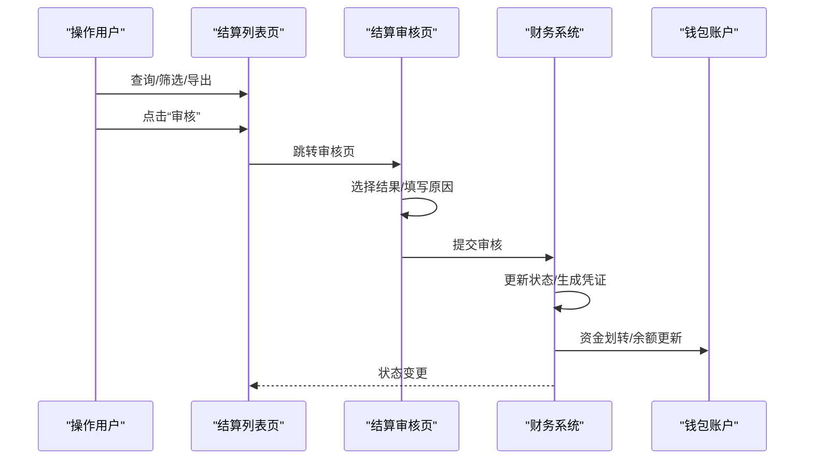
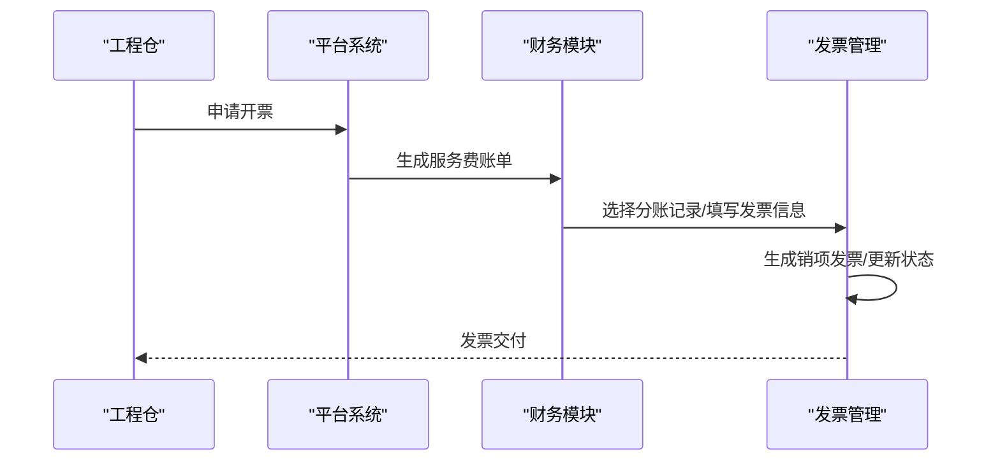
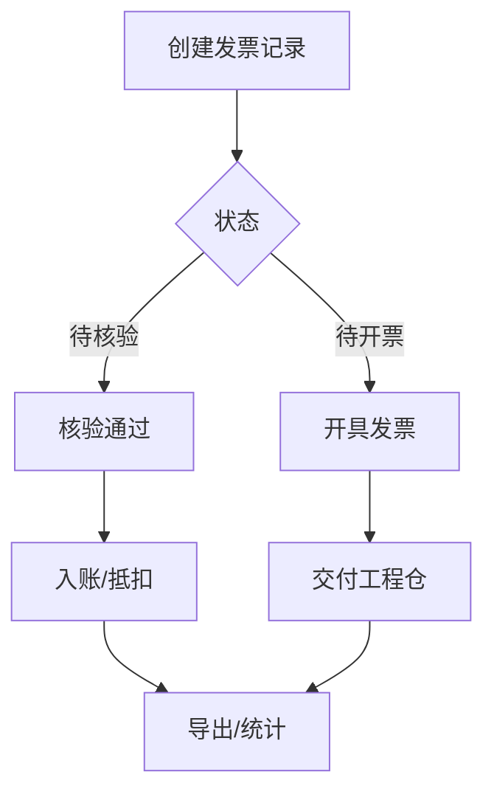
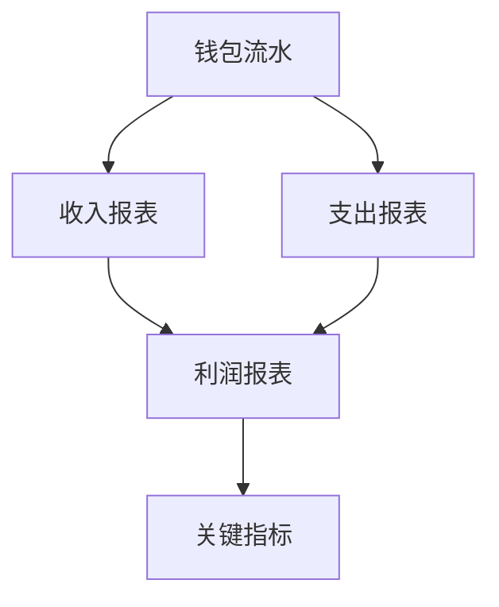
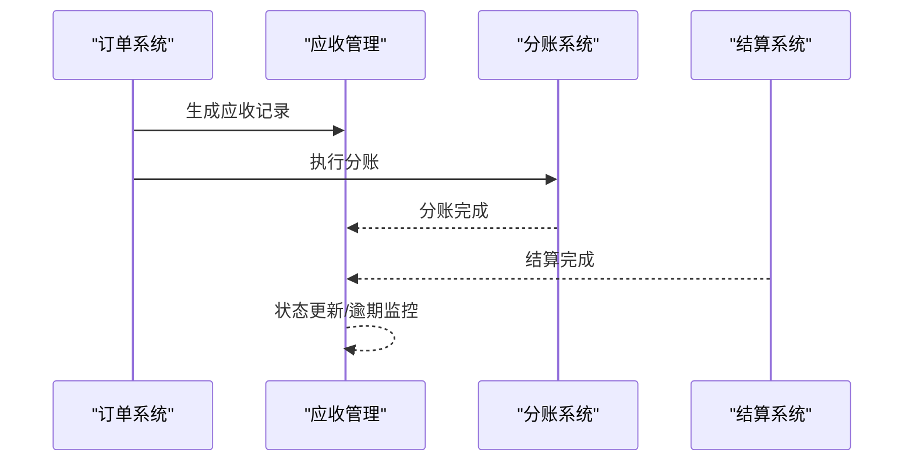
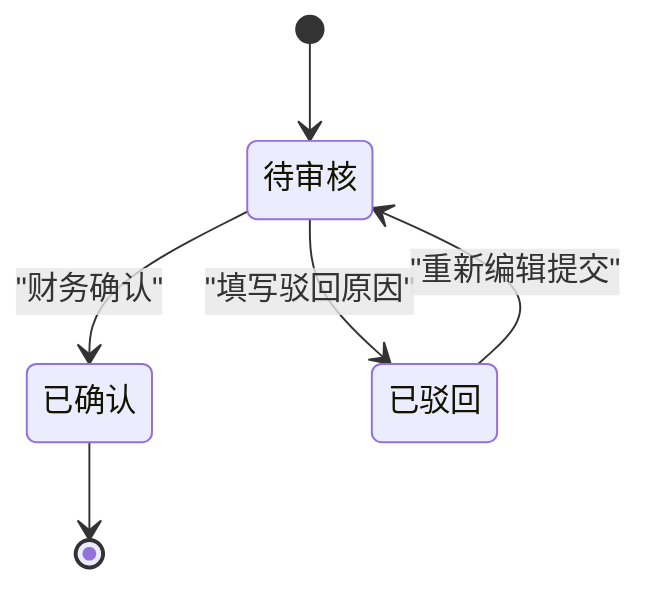
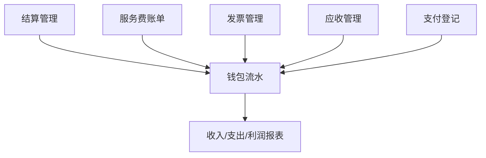

# 收支明细管理

<cite>
**本文引用的文件**
- [apps/pc/src/views/finance/settlement/index.vue](file://apps/pc/src/views/finance/settlement/index.vue)
- [apps/pc/src/views/finance/settlement/detail.vue](file://apps/pc/src/views/finance/settlement/detail.vue)
- [apps/pc/src/views/finance/settlement/audit.vue](file://apps/pc/src/views/finance/settlement/audit.vue)
- [apps/pc/src/views/finance/service-bill/index.vue](file://apps/pc/src/views/finance/service-bill/index.vue)
- [apps/pc/src/views/finance/invoice/input.vue](file://apps/pc/src/views/finance/invoice/input.vue)
- [apps/pc/src/views/finance/invoice/output.vue](file://apps/pc/src/views/finance/invoice/output.vue)
- [apps/pc/src/views/finance/wallet/transactions.vue](file://apps/pc/src/views/finance/wallet/transactions.vue)
- [apps/pc/src/views/finance/report/income.vue](file://apps/pc/src/views/finance/report/income.vue)
- [apps/pc/src/views/finance/report/expense.vue](file://apps/pc/src/views/finance/report/expense.vue)
- [apps/pc/src/views/finance/report/profit.vue](file://apps/pc/src/views/finance/report/profit.vue)
- [apps/pc/src/views/finance/receivable/index.vue](file://apps/pc/src/views/finance/receivable/index.vue)
- [apps/pc/src/views/finance/payment/index.vue](file://apps/pc/src/views/finance/payment/index.vue)
</cite>

## 目录
1. [简介](#简介)
2. [项目结构](#项目结构)
3. [核心组件](#核心组件)
4. [架构总览](#架构总览)
5. [详细组件分析](#详细组件分析)
6. [依赖关系分析](#依赖关系分析)
7. [性能考虑](#性能考虑)
8. [故障排查指南](#故障排查指南)
9. [结论](#结论)
10. [附录](#附录)

## 简介
本文件面向工程仓收支明细管理功能，系统性梳理采购单据、销售单据、服务费单据等各类收支凭证的管理流程，覆盖单据创建、审核、入账、查询、统计等完整业务闭环。文档同时提供不同类型的收支单据操作指南，包括单据模板、审批流程、财务入账规则等，帮助非技术读者快速理解并高效使用。

## 项目结构
工程仓财务相关页面集中在 PC 端前端应用中，围绕“结算”“服务费账单”“发票管理”“钱包流水”“收支报表”“应收管理”“支付登记”等模块构建，形成完整的收支明细管理体系。

图表来源
- [apps/pc/src/views/finance/settlement/index.vue:1-263](file://apps/pc/src/views/finance/settlement/index.vue#L1-L263)
- [apps/pc/src/views/finance/settlement/detail.vue:1-159](file://apps/pc/src/views/finance/settlement/detail.vue#L1-L159)
- [apps/pc/src/views/finance/settlement/audit.vue:95-167](file://apps/pc/src/views/finance/settlement/audit.vue#L95-L167)
- [apps/pc/src/views/finance/service-bill/index.vue:1-287](file://apps/pc/src/views/finance/service-bill/index.vue#L1-L287)
- [apps/pc/src/views/finance/invoice/input.vue:1-292](file://apps/pc/src/views/finance/invoice/input.vue#L1-L292)
- [apps/pc/src/views/finance/invoice/output.vue:1-663](file://apps/pc/src/views/finance/invoice/output.vue#L1-L663)
- [apps/pc/src/views/finance/wallet/transactions.vue:160-210](file://apps/pc/src/views/finance/wallet/transactions.vue#L160-L210)
- [apps/pc/src/views/finance/report/income.vue:1-379](file://apps/pc/src/views/finance/report/income.vue#L1-L379)
- [apps/pc/src/views/finance/report/expense.vue:1-378](file://apps/pc/src/views/finance/report/expense.vue#L1-L378)
- [apps/pc/src/views/finance/report/profit.vue:1-529](file://apps/pc/src/views/finance/report/profit.vue#L1-L529)
- [apps/pc/src/views/finance/receivable/index.vue:1-490](file://apps/pc/src/views/finance/receivable/index.vue#L1-L490)
- [apps/pc/src/views/finance/payment/index.vue:1-426](file://apps/pc/src/views/finance/payment/index.vue#L1-L426)

章节来源
- [apps/pc/src/views/finance/settlement/index.vue:1-263](file://apps/pc/src/views/finance/settlement/index.vue#L1-L263)
- [apps/pc/src/views/finance/service-bill/index.vue:1-287](file://apps/pc/src/views/finance/service-bill/index.vue#L1-L287)
- [apps/pc/src/views/finance/invoice/output.vue:1-663](file://apps/pc/src/views/finance/invoice/output.vue#L1-L663)
- [apps/pc/src/views/finance/wallet/transactions.vue:160-210](file://apps/pc/src/views/finance/wallet/transactions.vue#L160-L210)
- [apps/pc/src/views/finance/report/income.vue:1-379](file://apps/pc/src/views/finance/report/income.vue#L1-L379)
- [apps/pc/src/views/finance/report/expense.vue:1-378](file://apps/pc/src/views/finance/report/expense.vue#L1-L378)
- [apps/pc/src/views/finance/report/profit.vue:1-529](file://apps/pc/src/views/finance/report/profit.vue#L1-L529)
- [apps/pc/src/views/finance/receivable/index.vue:1-490](file://apps/pc/src/views/finance/receivable/index.vue#L1-L490)
- [apps/pc/src/views/finance/payment/index.vue:1-426](file://apps/pc/src/views/finance/payment/index.vue#L1-L426)

## 核心组件
- 结算管理：提供结算单列表、筛选、导出、详情、审核入口，支撑工程仓/供应商的结算流程。
- 服务费账单：面向平台向工程仓收取的服务费，支持账单查询、开票状态管理、发票开具。
- 发票管理：包含进项发票（平台收票）与销项发票（平台开票）两大子模块，覆盖核验、开具、下载、状态管理。
- 钱包流水：集中展示平台、工程仓、供应商三方的资金流水，支持按业务类型、账户类型、币种等维度查询。
- 报表体系：收入、支出、利润三类报表，提供趋势、构成、关键指标等可视化分析。
- 应收管理：记录平台服务费应收，串联订单、分账、结算，支持逾期监控。
- 支付登记：支持线下支付登记、凭证上传、状态流转与查询。

章节来源
- [apps/pc/src/views/finance/settlement/index.vue:1-263](file://apps/pc/src/views/finance/settlement/index.vue#L1-L263)
- [apps/pc/src/views/finance/service-bill/index.vue:1-287](file://apps/pc/src/views/finance/service-bill/index.vue#L1-L287)
- [apps/pc/src/views/finance/invoice/input.vue:1-292](file://apps/pc/src/views/finance/invoice/input.vue#L1-L292)
- [apps/pc/src/views/finance/invoice/output.vue:1-663](file://apps/pc/src/views/finance/invoice/output.vue#L1-L663)
- [apps/pc/src/views/finance/wallet/transactions.vue:160-210](file://apps/pc/src/views/finance/wallet/transactions.vue#L160-L210)
- [apps/pc/src/views/finance/report/income.vue:1-379](file://apps/pc/src/views/finance/report/income.vue#L1-L379)
- [apps/pc/src/views/finance/report/expense.vue:1-378](file://apps/pc/src/views/finance/report/expense.vue#L1-L378)
- [apps/pc/src/views/finance/report/profit.vue:1-529](file://apps/pc/src/views/finance/report/profit.vue#L1-L529)
- [apps/pc/src/views/finance/receivable/index.vue:1-490](file://apps/pc/src/views/finance/receivable/index.vue#L1-L490)
- [apps/pc/src/views/finance/payment/index.vue:1-426](file://apps/pc/src/views/finance/payment/index.vue#L1-L426)

## 架构总览
工程仓收支明细管理以“单据—凭证—流水—报表”的主线贯穿，形成“订单驱动—分账—结算—入账—对账—报表”的闭环。

图表来源
- [apps/pc/src/views/finance/settlement/index.vue:1-263](file://apps/pc/src/views/finance/settlement/index.vue#L1-L263)
- [apps/pc/src/views/finance/service-bill/index.vue:1-287](file://apps/pc/src/views/finance/service-bill/index.vue#L1-L287)
- [apps/pc/src/views/finance/wallet/transactions.vue:160-210](file://apps/pc/src/views/finance/wallet/transactions.vue#L160-L210)
- [apps/pc/src/views/finance/report/income.vue:1-379](file://apps/pc/src/views/finance/report/income.vue#L1-L379)
- [apps/pc/src/views/finance/report/expense.vue:1-378](file://apps/pc/src/views/finance/report/expense.vue#L1-L378)
- [apps/pc/src/views/finance/report/profit.vue:1-529](file://apps/pc/src/views/finance/report/profit.vue#L1-L529)

## 详细组件分析

### 结算管理（采购/销售/服务费）
- 功能要点
  - 列表：支持按结算单号、商户、状态、时间筛选；展示金额、银行信息、到账时间等。
  - 审核：支持通过/驳回，填写原因，提交后进入处理流程。
  - 详情：展示处理时间轴、关联分账记录、到账状态。
- 业务流程
  - 工程仓/供应商提交结算 → 平台审核 → 处理中 → 到账完成。
- 模板与规则
  - 结算单模板字段：结算单号、商户名称、结算金额、结算银行、银行账号、申请时间、状态。
  - 审批流程：待审核 → 已通过/已驳回 → 处理中 → 已到账。
  - 入账规则：到账后更新账户余额，生成流水记录。

图表来源
- [apps/pc/src/views/finance/settlement/index.vue:1-263](file://apps/pc/src/views/finance/settlement/index.vue#L1-L263)
- [apps/pc/src/views/finance/settlement/audit.vue:95-167](file://apps/pc/src/views/finance/settlement/audit.vue#L95-L167)
- [apps/pc/src/views/finance/settlement/detail.vue:1-159](file://apps/pc/src/views/finance/settlement/detail.vue#L1-L159)

章节来源
- [apps/pc/src/views/finance/settlement/index.vue:1-263](file://apps/pc/src/views/finance/settlement/index.vue#L1-L263)
- [apps/pc/src/views/finance/settlement/audit.vue:95-167](file://apps/pc/src/views/finance/settlement/audit.vue#L95-L167)
- [apps/pc/src/views/finance/settlement/detail.vue:1-159](file://apps/pc/src/views/finance/settlement/detail.vue#L1-L159)

### 服务费账单（平台向工程仓收取）
- 功能要点
  - 账单列表：按账单编号、工程仓、开票状态、时间筛选；展示订单金额、服务费率、服务费金额、发票状态。
  - 开票：支持从账单发起开票，选择分账记录合并开票，填写发票类型与发票号。
- 业务流程
  - 订单完成后生成应收 → 生成服务费账单 → 工程仓申请/平台手动开票 → 发票状态更新。
- 模板与规则
  - 账单模板字段：账单编号、工程仓、关联订单、订单金额、服务费率、服务费金额、开票状态、发票号码、账单时间。
  - 开票规则：支持多笔分账合并开票，相同工程仓可合并；开票后生成销项发票记录。

图表来源
- [apps/pc/src/views/finance/service-bill/index.vue:1-287](file://apps/pc/src/views/finance/service-bill/index.vue#L1-L287)
- [apps/pc/src/views/finance/invoice/output.vue:1-663](file://apps/pc/src/views/finance/invoice/output.vue#L1-L663)

章节来源
- [apps/pc/src/views/finance/service-bill/index.vue:1-287](file://apps/pc/src/views/finance/service-bill/index.vue#L1-L287)
- [apps/pc/src/views/finance/invoice/output.vue:1-663](file://apps/pc/src/views/finance/invoice/output.vue#L1-L663)

### 发票管理（进项/销项）
- 进项发票（平台收票）
  - 功能：查询、筛选、核验、导出；展示发票类型、金额、税额、价税合计、核验状态。
  - 规则：待核验 → 已核验入账 → 税务抵扣。
- 销项发票（平台开票）
  - 功能：按状态/来源/收票方筛选；支持开具、下载、查看详情。
  - 规则：待开票 → 已开具 → 交付工程仓；支持多笔分账合并开票。
- 模板与规则
  - 发票模板字段：发票号码、来源、收票方/开票方、金额/税额/价税合计、状态、申请/开票时间。
  - 核验/开票校验：必填字段校验、状态互斥、金额一致性。

图表来源
- [apps/pc/src/views/finance/invoice/input.vue:1-292](file://apps/pc/src/views/finance/invoice/input.vue#L1-L292)
- [apps/pc/src/views/finance/invoice/output.vue:1-663](file://apps/pc/src/views/finance/invoice/output.vue#L1-L663)

章节来源
- [apps/pc/src/views/finance/invoice/input.vue:1-292](file://apps/pc/src/views/finance/invoice/input.vue#L1-L292)
- [apps/pc/src/views/finance/invoice/output.vue:1-663](file://apps/pc/src/views/finance/invoice/output.vue#L1-L663)

### 钱包流水（收支明细）
- 功能要点
  - 展示交易流水：交易号、时间、账户类型（平台/工程仓/供应商）、业务类型（订单/服务）、金额、余额、关联单据、摘要。
  - 支持按账户、业务类型、时间、摘要关键词检索。
- 业务价值
  - 作为对账依据，支撑与银行流水的自动/手工对账。

图表来源
- [apps/pc/src/views/finance/wallet/transactions.vue:160-210](file://apps/pc/src/views/finance/wallet/transactions.vue#L160-L210)

章节来源
- [apps/pc/src/views/finance/wallet/transactions.vue:160-210](file://apps/pc/src/views/finance/wallet/transactions.vue#L160-L210)

### 报表体系（收入/支出/利润）
- 收入报表：展示收入趋势、构成、明细，支持时间范围切换与导出。
- 支出报表：展示支出趋势、构成、明细，支持时间范围切换与导出。
- 利润报表：对比收入/支出/利润趋势，提供关键指标（毛利率、净利率、资金周转率等）。
- 模板与规则
  - 报表模板字段：日期、来源/类型、商户/收款方、关联单据、金额、状态、说明。
  - 统计口径：按业务类型、账户类型、时间维度聚合。

图表来源
- [apps/pc/src/views/finance/report/income.vue:1-379](file://apps/pc/src/views/finance/report/income.vue#L1-L379)
- [apps/pc/src/views/finance/report/expense.vue:1-378](file://apps/pc/src/views/finance/report/expense.vue#L1-L378)
- [apps/pc/src/views/finance/report/profit.vue:1-529](file://apps/pc/src/views/finance/report/profit.vue#L1-L529)

章节来源
- [apps/pc/src/views/finance/report/income.vue:1-379](file://apps/pc/src/views/finance/report/income.vue#L1-L379)
- [apps/pc/src/views/finance/report/expense.vue:1-378](file://apps/pc/src/views/finance/report/expense.vue#L1-L378)
- [apps/pc/src/views/finance/report/profit.vue:1-529](file://apps/pc/src/views/finance/report/profit.vue#L1-L529)

### 应收管理（服务费）
- 功能要点
  - 应收列表：按状态（待收/已收/已作废/已逾期）、商户类型、时间筛选；展示应收编号、关联订单、交易金额、工程仓收入、平台应收、分账状态。
  - 明细：展示商品分账比例明细与资金流向说明。
- 业务流程
  - 订单创建 → 生成应收 → 分账完成 → 结算完成 → 应收状态更新。
- 模板与规则
  - 应收模板字段：应收编号、关联订单、交易金额、工程仓收入、平台应收、分账状态、产生时间。
  - 逾期监控：自动标记逾期，降低坏账风险。

图表来源
- [apps/pc/src/views/finance/receivable/index.vue:1-490](file://apps/pc/src/views/finance/receivable/index.vue#L1-L490)

章节来源
- [apps/pc/src/views/finance/receivable/index.vue:1-490](file://apps/pc/src/views/finance/receivable/index.vue#L1-L490)

### 支付登记（线下支付）
- 功能要点
  - 支付列表：按支付单号/订单号/工程仓、支付类型、时间筛选；展示付款方、收款方、金额、支付方式、状态、时间、操作人。
  - 凭证管理：支持查看/下载转账凭证。
- 业务流程
  - 登记支付 → 待审核 → 财务确认 → 已确认 → 入账。
- 模板与规则
  - 支付登记模板字段：支付类型、关联订单、付款方、收款方、支付金额、支付方式、支付时间、凭证、备注。
  - 状态机：待审核/已确认/已驳回；已确认不可修改。

图表来源
- [apps/pc/src/views/finance/payment/index.vue:1-426](file://apps/pc/src/views/finance/payment/index.vue#L1-L426)

章节来源
- [apps/pc/src/views/finance/payment/index.vue:1-426](file://apps/pc/src/views/finance/payment/index.vue#L1-L426)

## 依赖关系分析
- 数据流耦合
  - 结算管理依赖分账记录与账户余额；服务费账单依赖结算与发票；发票管理依赖结算与账户；钱包流水依赖所有交易事件。
- 视图层依赖
  - 结算详情页依赖结算列表页；服务费账单详情依赖账单列表；发票详情依赖发票列表。
- 外部集成
  - 银行流水对接：钱包流水用于与银行流水进行自动/手工对账。
  - 报表依赖：三类报表均依赖钱包流水与结算/发票数据。

图表来源
- [apps/pc/src/views/finance/settlement/index.vue:1-263](file://apps/pc/src/views/finance/settlement/index.vue#L1-L263)
- [apps/pc/src/views/finance/service-bill/index.vue:1-287](file://apps/pc/src/views/finance/service-bill/index.vue#L1-L287)
- [apps/pc/src/views/finance/invoice/output.vue:1-663](file://apps/pc/src/views/finance/invoice/output.vue#L1-L663)
- [apps/pc/src/views/finance/wallet/transactions.vue:160-210](file://apps/pc/src/views/finance/wallet/transactions.vue#L160-L210)
- [apps/pc/src/views/finance/report/income.vue:1-379](file://apps/pc/src/views/finance/report/income.vue#L1-L379)
- [apps/pc/src/views/finance/report/expense.vue:1-378](file://apps/pc/src/views/finance/report/expense.vue#L1-L378)
- [apps/pc/src/views/finance/report/profit.vue:1-529](file://apps/pc/src/views/finance/report/profit.vue#L1-L529)
- [apps/pc/src/views/finance/receivable/index.vue:1-490](file://apps/pc/src/views/finance/receivable/index.vue#L1-L490)
- [apps/pc/src/views/finance/payment/index.vue:1-426](file://apps/pc/src/views/finance/payment/index.vue#L1-L426)

## 性能考虑
- 列表分页与虚拟滚动：对大体量流水与报表采用分页与虚拟滚动，减少 DOM 压力。
- 搜索与筛选：前端缓存过滤结果，避免重复计算；时间范围与关键字组合查询需限制并发。
- 图表渲染：趋势/构成图采用懒加载与阈值渲染，避免大数据量时卡顿。
- 状态机与幂等：审核/入账等关键操作需保证幂等与回滚能力，防止重复入账。

## 故障排查指南
- 发票核验/开票失败
  - 现象：核验/开票按钮不可用或提示错误。
  - 排查：检查必填字段（发票号、金额、税额）、状态是否正确、网络请求是否成功。
- 结算审核被驳回
  - 现象：审核提交后状态变为“已驳回”。
  - 排查：确认驳回原因是否填写、资料是否齐全；重新编辑后可再次提交。
- 钱包流水缺失
  - 现象：报表与流水不一致。
  - 排查：核对入账时间、账户余额、银行流水匹配情况；检查是否存在未入账的线下支付。
- 报表为空或异常
  - 现象：导出/展示异常。
  - 排查：检查时间范围、筛选条件、数据权限；刷新页面或清理缓存后重试。

章节来源
- [apps/pc/src/views/finance/invoice/input.vue:244-246](file://apps/pc/src/views/finance/invoice/input.vue#L244-L246)
- [apps/pc/src/views/finance/invoice/output.vue:444-452](file://apps/pc/src/views/finance/invoice/output.vue#L444-L452)
- [apps/pc/src/views/finance/settlement/audit.vue:115-129](file://apps/pc/src/views/finance/settlement/audit.vue#L115-L129)
- [apps/pc/src/views/finance/wallet/transactions.vue:160-210](file://apps/pc/src/views/finance/wallet/transactions.vue#L160-L210)
- [apps/pc/src/views/finance/report/income.vue:201-208](file://apps/pc/src/views/finance/report/income.vue#L201-L208)

## 结论
工程仓收支明细管理以结算、服务费账单、发票为核心，配合钱包流水与报表体系，实现了从订单到入账、从对账到分析的全链路闭环。通过清晰的单据模板、严格的审批流程与财务入账规则，确保了业务合规与数据准确。建议在实际使用中结合权限矩阵与审计日志，持续优化流程与用户体验。

## 附录
- 操作指引速查
  - 创建/审核/入账：结算管理 → 审核 → 到账 → 入账
  - 开具发票：服务费账单 → 选择分账 → 填写发票信息 → 开具
  - 核验发票：进项发票 → 选择发票 → 核验
  - 查看流水：钱包流水 → 按账户/业务类型筛选
  - 对账：导出流水 → 匹配银行流水 → 差异调节
  - 报表分析：收入/支出/利润报表 → 时间范围/维度切换