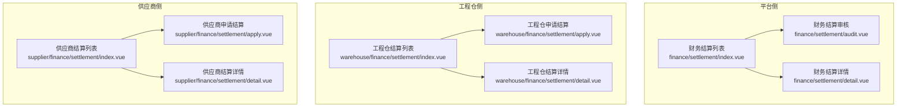
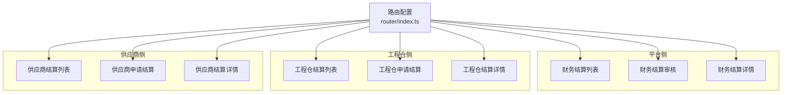
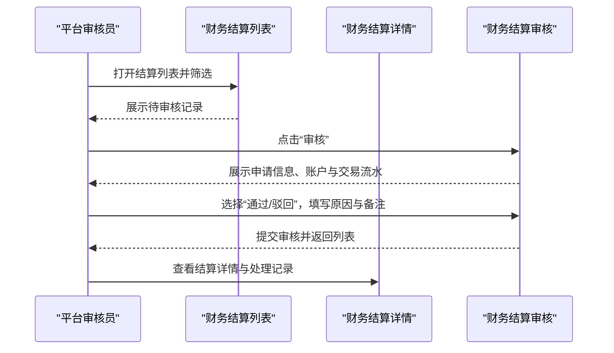
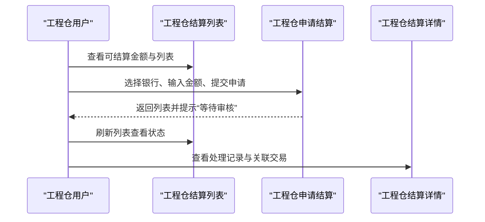
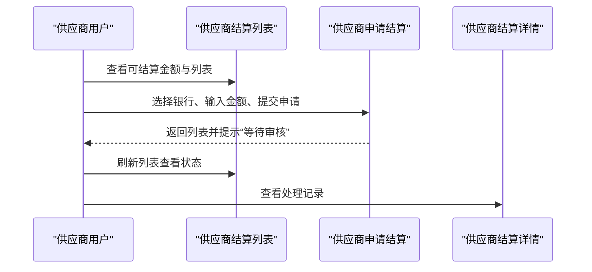
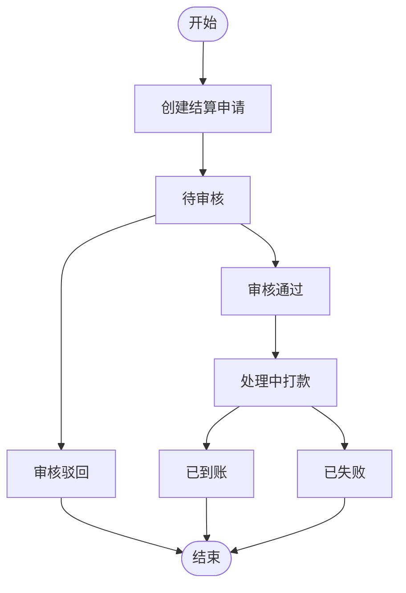

# 结算管理

<cite>
**本文引用的文件**
- [apps/pc/src/views/finance/settlement/index.vue](file://apps/pc/src/views/finance/settlement/index.vue)
- [apps/pc/src/views/finance/settlement/detail.vue](file://apps/pc/src/views/finance/settlement/detail.vue)
- [apps/pc/src/views/finance/settlement/audit.vue](file://apps/pc/src/views/finance/settlement/audit.vue)
- [apps/pc/src/views/warehouse/finance/settlement/index.vue](file://apps/pc/src/views/warehouse/finance/settlement/index.vue)
- [apps/pc/src/views/warehouse/finance/settlement/apply.vue](file://apps/pc/src/views/warehouse/finance/settlement/apply.vue)
- [apps/pc/src/views/warehouse/finance/settlement/detail.vue](file://apps/pc/src/views/warehouse/finance/settlement/detail.vue)
- [apps/pc/src/views/supplier/finance/settlement/index.vue](file://apps/pc/src/views/supplier/finance/settlement/index.vue)
- [apps/pc/src/views/supplier/finance/settlement/apply.vue](file://apps/pc/src/views/supplier/finance/settlement/apply.vue)
- [apps/pc/src/views/supplier/finance/settlement/detail.vue](file://apps/pc/src/views/supplier/finance/settlement/detail.vue)
- [apps/pc/src/router/index.ts](file://apps/pc/src/router/index.ts)
- [packages/api/src/mock/supplier.ts](file://packages/api/src/mock/supplier.ts)
</cite>

## 目录
1. [简介](#简介)
2. [项目结构](#项目结构)
3. [核心组件](#核心组件)
4. [架构总览](#架构总览)
5. [详细组件分析](#详细组件分析)
6. [依赖分析](#依赖分析)
7. [性能考虑](#性能考虑)
8. [故障排查指南](#故障排查指南)
9. [结论](#结论)
10. [附录](#附录)

## 简介
本文件面向工程仓结算管理功能，系统化梳理从“申请—审核—执行—查询”的完整业务闭环，覆盖结算周期设定、结算金额计算、状态跟踪与异常处理等关键环节，并提供操作指南与优化建议。当前代码库中的结算页面已实现前端交互与状态可视化，结合后端接口与数据模型可进一步完善真实业务落地。

## 项目结构
结算管理涉及三大角色入口：
- 平台侧财务中心：提供结算列表、详情、审核能力
- 工程仓侧：提供可结算金额统计、申请结算、列表与详情
- 供应商侧：提供可结算金额统计、申请结算、列表与详情

图表来源
- [apps/pc/src/views/finance/settlement/index.vue:1-263](file://apps/pc/src/views/finance/settlement/index.vue#L1-L263)
- [apps/pc/src/views/finance/settlement/audit.vue:1-168](file://apps/pc/src/views/finance/settlement/audit.vue#L1-L168)
- [apps/pc/src/views/finance/settlement/detail.vue:1-159](file://apps/pc/src/views/finance/settlement/detail.vue#L1-L159)
- [apps/pc/src/views/warehouse/finance/settlement/index.vue:1-248](file://apps/pc/src/views/warehouse/finance/settlement/index.vue#L1-L248)
- [apps/pc/src/views/warehouse/finance/settlement/apply.vue:1-246](file://apps/pc/src/views/warehouse/finance/settlement/apply.vue#L1-L246)
- [apps/pc/src/views/warehouse/finance/settlement/detail.vue:1-166](file://apps/pc/src/views/warehouse/finance/settlement/detail.vue#L1-L166)
- [apps/pc/src/views/supplier/finance/settlement/index.vue:1-193](file://apps/pc/src/views/supplier/finance/settlement/index.vue#L1-L193)
- [apps/pc/src/views/supplier/finance/settlement/apply.vue:1-139](file://apps/pc/src/views/supplier/finance/settlement/apply.vue#L1-L139)
- [apps/pc/src/views/supplier/finance/settlement/detail.vue:1-121](file://apps/pc/src/views/supplier/finance/settlement/detail.vue#L1-L121)

章节来源
- [apps/pc/src/views/finance/settlement/index.vue:1-263](file://apps/pc/src/views/finance/settlement/index.vue#L1-L263)
- [apps/pc/src/views/warehouse/finance/settlement/index.vue:1-248](file://apps/pc/src/views/warehouse/finance/settlement/index.vue#L1-L248)
- [apps/pc/src/views/supplier/finance/settlement/index.vue:1-193](file://apps/pc/src/views/supplier/finance/settlement/index.vue#L1-L193)

## 核心组件
- 财务结算列表：支持按结算单号、商户、状态、申请时间筛选；展示金额、银行、状态、到账时间；支持导出与跳转详情/审核。
- 财务结算审核：展示申请信息、账户余额与可用余额、近期交易流水；支持通过/驳回，填写驳回原因与备注。
- 财务结算详情：展示基本信息、处理记录（时间轴）、关联分账或交易记录。
- 工程仓结算：展示可结算金额、结算中金额、本月已结算；支持申请结算、列表查询、导出、详情。
- 供应商结算：展示可结算金额、结算中金额、本月已结算；支持申请结算、列表查询、详情。

章节来源
- [apps/pc/src/views/finance/settlement/index.vue:1-263](file://apps/pc/src/views/finance/settlement/index.vue#L1-L263)
- [apps/pc/src/views/finance/settlement/audit.vue:1-168](file://apps/pc/src/views/finance/settlement/audit.vue#L1-L168)
- [apps/pc/src/views/finance/settlement/detail.vue:1-159](file://apps/pc/src/views/finance/settlement/detail.vue#L1-L159)
- [apps/pc/src/views/warehouse/finance/settlement/index.vue:1-248](file://apps/pc/src/views/warehouse/finance/settlement/index.vue#L1-L248)
- [apps/pc/src/views/warehouse/finance/settlement/apply.vue:1-246](file://apps/pc/src/views/warehouse/finance/settlement/apply.vue#L1-L246)
- [apps/pc/src/views/warehouse/finance/settlement/detail.vue:1-166](file://apps/pc/src/views/warehouse/finance/settlement/detail.vue#L1-L166)
- [apps/pc/src/views/supplier/finance/settlement/index.vue:1-193](file://apps/pc/src/views/supplier/finance/settlement/index.vue#L1-L193)
- [apps/pc/src/views/supplier/finance/settlement/apply.vue:1-139](file://apps/pc/src/views/supplier/finance/settlement/apply.vue#L1-L139)
- [apps/pc/src/views/supplier/finance/settlement/detail.vue:1-121](file://apps/pc/src/views/supplier/finance/settlement/detail.vue#L1-L121)

## 架构总览
结算管理采用“前端页面+路由+状态展示”的结构化组织，平台侧负责统一审核与对账，工程仓与供应商侧负责发起申请与核对流水。

图表来源
- [apps/pc/src/router/index.ts:1-826](file://apps/pc/src/router/index.ts#L1-L826)
- [apps/pc/src/views/finance/settlement/index.vue:1-263](file://apps/pc/src/views/finance/settlement/index.vue#L1-L263)
- [apps/pc/src/views/finance/settlement/audit.vue:1-168](file://apps/pc/src/views/finance/settlement/audit.vue#L1-L168)
- [apps/pc/src/views/finance/settlement/detail.vue:1-159](file://apps/pc/src/views/finance/settlement/detail.vue#L1-L159)
- [apps/pc/src/views/warehouse/finance/settlement/index.vue:1-248](file://apps/pc/src/views/warehouse/finance/settlement/index.vue#L1-L248)
- [apps/pc/src/views/warehouse/finance/settlement/apply.vue:1-246](file://apps/pc/src/views/warehouse/finance/settlement/apply.vue#L1-L246)
- [apps/pc/src/views/warehouse/finance/settlement/detail.vue:1-166](file://apps/pc/src/views/warehouse/finance/settlement/detail.vue#L1-L166)
- [apps/pc/src/views/supplier/finance/settlement/index.vue:1-193](file://apps/pc/src/views/supplier/finance/settlement/index.vue#L1-L193)
- [apps/pc/src/views/supplier/finance/settlement/apply.vue:1-139](file://apps/pc/src/views/supplier/finance/settlement/apply.vue#L1-L139)
- [apps/pc/src/views/supplier/finance/settlement/detail.vue:1-121](file://apps/pc/src/views/supplier/finance/settlement/detail.vue#L1-L121)

## 详细组件分析

### 平台侧结算流程（申请—审核—执行—查询）

图表来源
- [apps/pc/src/views/finance/settlement/index.vue:1-263](file://apps/pc/src/views/finance/settlement/index.vue#L1-L263)
- [apps/pc/src/views/finance/settlement/audit.vue:1-168](file://apps/pc/src/views/finance/settlement/audit.vue#L1-L168)
- [apps/pc/src/views/finance/settlement/detail.vue:1-159](file://apps/pc/src/views/finance/settlement/detail.vue#L1-L159)

章节来源
- [apps/pc/src/views/finance/settlement/index.vue:1-263](file://apps/pc/src/views/finance/settlement/index.vue#L1-L263)
- [apps/pc/src/views/finance/settlement/audit.vue:1-168](file://apps/pc/src/views/finance/settlement/audit.vue#L1-L168)
- [apps/pc/src/views/finance/settlement/detail.vue:1-159](file://apps/pc/src/views/finance/settlement/detail.vue#L1-L159)

### 工程仓侧结算流程（申请—处理—查询）

图表来源
- [apps/pc/src/views/warehouse/finance/settlement/index.vue:1-248](file://apps/pc/src/views/warehouse/finance/settlement/index.vue#L1-L248)
- [apps/pc/src/views/warehouse/finance/settlement/apply.vue:1-246](file://apps/pc/src/views/warehouse/finance/settlement/apply.vue#L1-L246)
- [apps/pc/src/views/warehouse/finance/settlement/detail.vue:1-166](file://apps/pc/src/views/warehouse/finance/settlement/detail.vue#L1-L166)

章节来源
- [apps/pc/src/views/warehouse/finance/settlement/index.vue:1-248](file://apps/pc/src/views/warehouse/finance/settlement/index.vue#L1-L248)
- [apps/pc/src/views/warehouse/finance/settlement/apply.vue:1-246](file://apps/pc/src/views/warehouse/finance/settlement/apply.vue#L1-L246)
- [apps/pc/src/views/warehouse/finance/settlement/detail.vue:1-166](file://apps/pc/src/views/warehouse/finance/settlement/detail.vue#L1-L166)

### 供应商侧结算流程（申请—处理—查询）

图表来源
- [apps/pc/src/views/supplier/finance/settlement/index.vue:1-193](file://apps/pc/src/views/supplier/finance/settlement/index.vue#L1-L193)
- [apps/pc/src/views/supplier/finance/settlement/apply.vue:1-139](file://apps/pc/src/views/supplier/finance/settlement/apply.vue#L1-L139)
- [apps/pc/src/views/supplier/finance/settlement/detail.vue:1-121](file://apps/pc/src/views/supplier/finance/settlement/detail.vue#L1-L121)

章节来源
- [apps/pc/src/views/supplier/finance/settlement/index.vue:1-193](file://apps/pc/src/views/supplier/finance/settlement/index.vue#L1-L193)
- [apps/pc/src/views/supplier/finance/settlement/apply.vue:1-139](file://apps/pc/src/views/supplier/finance/settlement/apply.vue#L1-L139)
- [apps/pc/src/views/supplier/finance/settlement/detail.vue:1-121](file://apps/pc/src/views/supplier/finance/settlement/detail.vue#L1-L121)

### 结算状态与流程图

图表来源
- [apps/pc/src/views/finance/settlement/index.vue:1-263](file://apps/pc/src/views/finance/settlement/index.vue#L1-L263)
- [apps/pc/src/views/warehouse/finance/settlement/index.vue:1-248](file://apps/pc/src/views/warehouse/finance/settlement/index.vue#L1-L248)
- [apps/pc/src/views/supplier/finance/settlement/index.vue:1-193](file://apps/pc/src/views/supplier/finance/settlement/index.vue#L1-L193)

## 依赖分析
- 路由依赖：各结算页面均在路由中注册，平台侧位于主布局，工程仓与供应商侧分别位于对应布局下，便于权限与导航区分。
- 页面间依赖：列表页负责筛选与跳转，详情页负责状态与记录展示，审核页负责审批动作；工程仓与供应商侧的申请页负责金额与银行选择。
- 数据依赖：mock 中包含供应商结算样例数据，可用于前端联调与演示。

章节来源
- [apps/pc/src/router/index.ts:1-826](file://apps/pc/src/router/index.ts#L1-L826)
- [packages/api/src/mock/supplier.ts:479-485](file://packages/api/src/mock/supplier.ts#L479-L485)

## 性能考虑
- 列表分页与筛选：当前页面使用本地数组与简单过滤，建议在真实后端接入时启用服务端分页与条件索引，避免大数据量前端渲染压力。
- 表单校验：申请页已内置基础校验（金额范围、必选项），建议在提交前进行更严格的格式与业务规则校验，减少无效请求。
- 图标与样式：页面使用图标与样式组件，建议按需引入，避免不必要的资源加载。

## 故障排查指南
- 审核提交失败：检查必填项（通过/驳回选择、驳回原因），确保网络稳定与加载状态合理显示。
- 申请金额异常：确认可结算金额、最小金额限制与银行选择，避免超出范围或空值导致提交失败。
- 列表为空或导出失败：检查筛选条件与数据源，确保有数据后再导出。
- 状态不更新：刷新页面或等待后台异步状态推进，关注“处理中/已失败”等状态提示。

章节来源
- [apps/pc/src/views/finance/settlement/audit.vue:115-129](file://apps/pc/src/views/finance/settlement/audit.vue#L115-L129)
- [apps/pc/src/views/warehouse/finance/settlement/apply.vue:126-140](file://apps/pc/src/views/warehouse/finance/settlement/apply.vue#L126-L140)
- [apps/pc/src/views/supplier/finance/settlement/apply.vue:74-92](file://apps/pc/src/views/supplier/finance/settlement/apply.vue#L74-L92)
- [apps/pc/src/views/finance/settlement/index.vue:230-236](file://apps/pc/src/views/finance/settlement/index.vue#L230-L236)

## 结论
当前工程仓结算管理功能以页面形式完整呈现了“申请—审核—执行—查询”的全流程，具备良好的用户体验与状态可视化。建议后续补齐后端接口、完善结算周期与金额计算逻辑、增强异常处理与日志追踪，并在真实环境中进行性能与安全加固。

## 附录

### 操作指南（通用步骤）
- 平台侧
  - 登录平台财务中心，进入结算列表，筛选条件后查看待审核记录。
  - 进入详情页查看处理记录与关联分账/交易。
  - 进入审核页，核对账户与交易流水，选择通过或驳回并填写原因与备注。
- 工程仓侧
  - 在结算列表查看可结算金额与状态，点击“申请结算”。
  - 选择结算银行，输入金额并提交，等待审核。
  - 在详情页查看处理记录与关联交易。
- 供应商侧
  - 在结算列表查看可结算金额与状态，点击“申请结算”。
  - 选择结算银行，输入金额并提交，等待审核。
  - 在详情页查看处理记录。

章节来源
- [apps/pc/src/views/finance/settlement/index.vue:1-263](file://apps/pc/src/views/finance/settlement/index.vue#L1-L263)
- [apps/pc/src/views/finance/settlement/audit.vue:1-168](file://apps/pc/src/views/finance/settlement/audit.vue#L1-L168)
- [apps/pc/src/views/finance/settlement/detail.vue:1-159](file://apps/pc/src/views/finance/settlement/detail.vue#L1-L159)
- [apps/pc/src/views/warehouse/finance/settlement/index.vue:1-248](file://apps/pc/src/views/warehouse/finance/settlement/index.vue#L1-L248)
- [apps/pc/src/views/warehouse/finance/settlement/apply.vue:1-246](file://apps/pc/src/views/warehouse/finance/settlement/apply.vue#L1-L246)
- [apps/pc/src/views/warehouse/finance/settlement/detail.vue:1-166](file://apps/pc/src/views/warehouse/finance/settlement/detail.vue#L1-L166)
- [apps/pc/src/views/supplier/finance/settlement/index.vue:1-193](file://apps/pc/src/views/supplier/finance/settlement/index.vue#L1-L193)
- [apps/pc/src/views/supplier/finance/settlement/apply.vue:1-139](file://apps/pc/src/views/supplier/finance/settlement/apply.vue#L1-L139)
- [apps/pc/src/views/supplier/finance/settlement/detail.vue:1-121](file://apps/pc/src/views/supplier/finance/settlement/detail.vue#L1-L121)