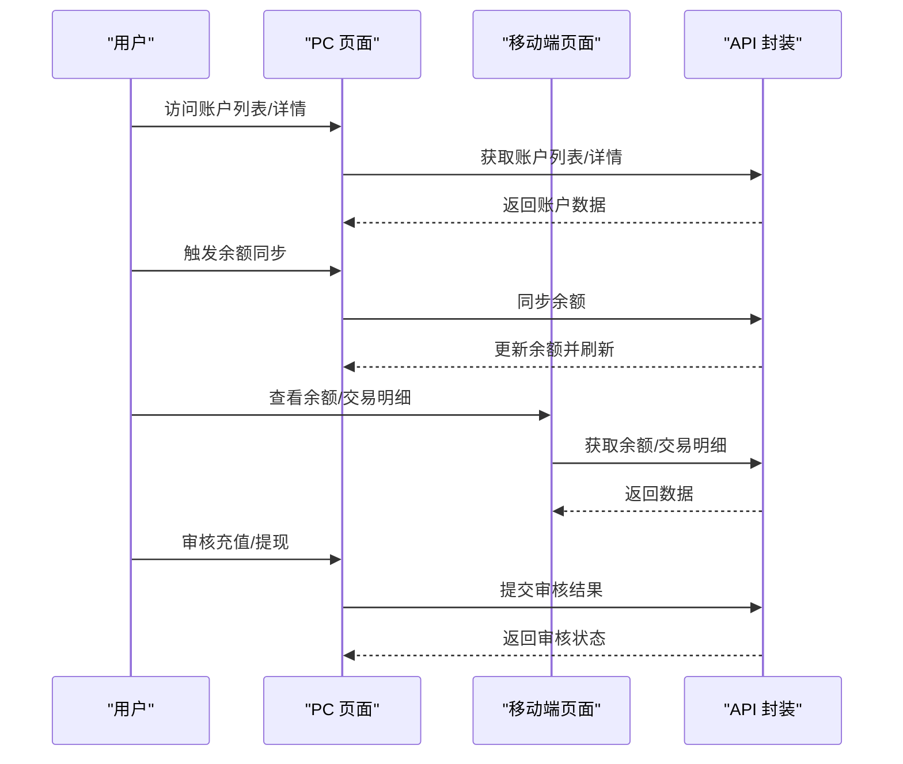
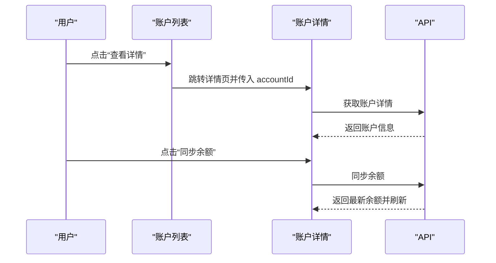
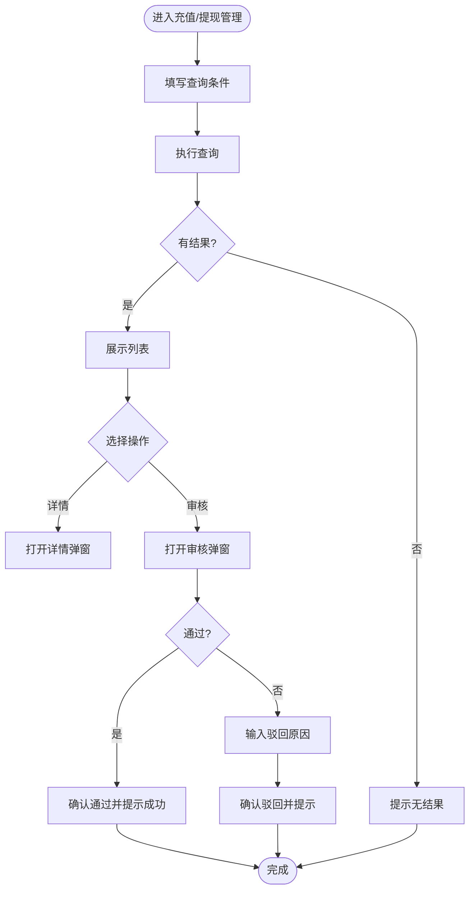
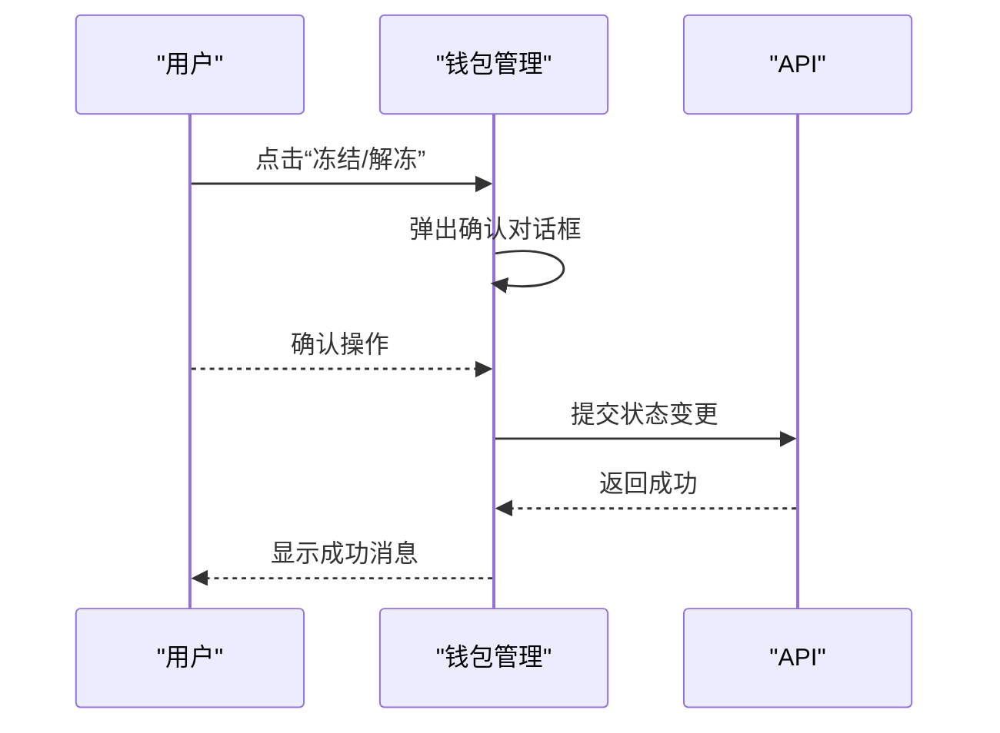
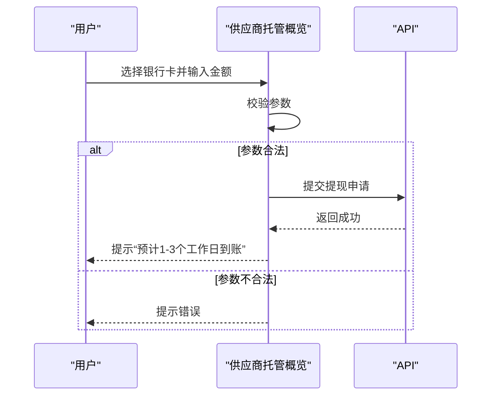
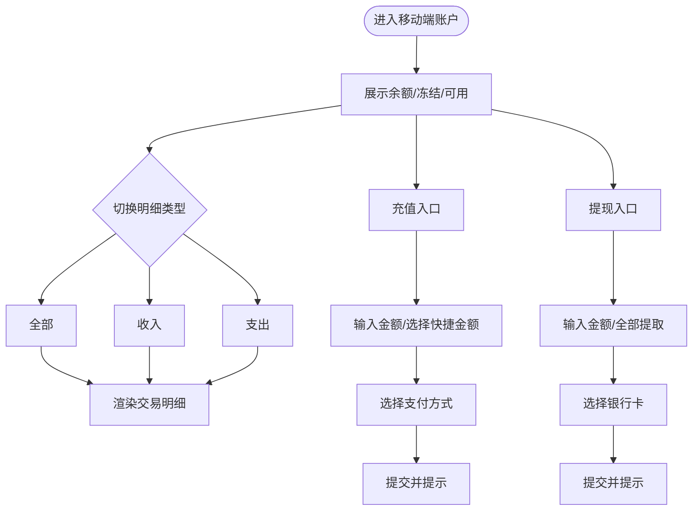
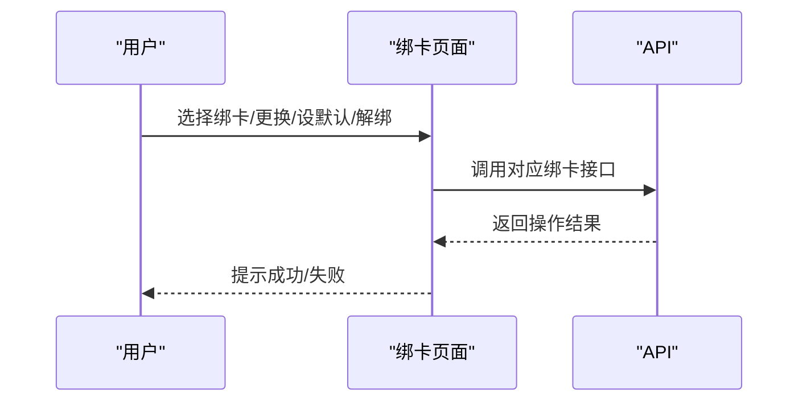
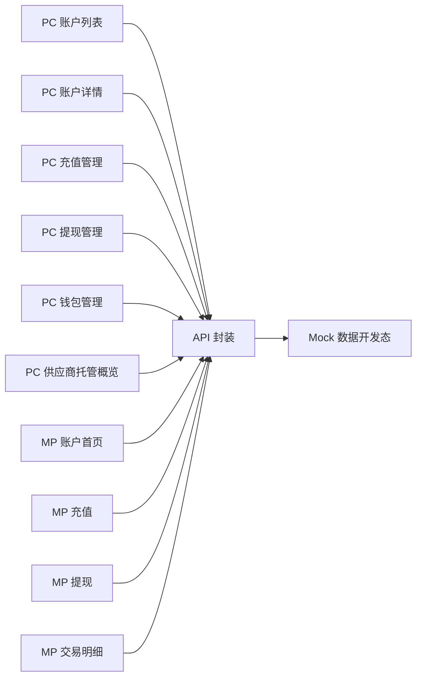

# 账户管理

<cite>
**本文引用的文件**
- [apps/pc/src/views/finance/custody/index.vue](file://apps/pc/src/views/finance/custody/index.vue)
- [apps/pc/src/views/finance/custody/detail.vue](file://apps/pc/src/views/finance/custody/detail.vue)
- [apps/pc/src/views/finance/custody/recharge.vue](file://apps/pc/src/views/finance/custody/recharge.vue)
- [apps/pc/src/views/finance/custody/withdraw.vue](file://apps/pc/src/views/finance/custody/withdraw.vue)
- [apps/pc/src/views/finance/wallet/index.vue](file://apps/pc/src/views/finance/wallet/index.vue)
- [apps/pc/src/views/supplier/finance/custody/overview.vue](file://apps/pc/src/views/supplier/finance/custody/overview.vue)
- [apps/mp/src/pages/mine/account.vue](file://apps/mp/src/pages/mine/account.vue)
- [apps/mp/src/pages/mine/custody.vue](file://apps/mp/src/pages/mine/custody.vue)
- [apps/mp/src/pages/mine/custody-recharge.vue](file://apps/mp/src/pages/mine/custody-recharge.vue)
- [apps/mp/src/pages/mine/custody-withdraw.vue](file://apps/mp/src/pages/mine/custody-withdraw.vue)
- [apps/mp/src/pages/mine/custody-records.vue](file://apps/mp/src/pages/mine/custody-records.vue)
- [packages/api/src/custody.ts](file://packages/api/src/custody.ts)
</cite>

## 目录
1. [简介](#简介)
2. [项目结构](#项目结构)
3. [核心组件](#核心组件)
4. [架构总览](#架构总览)
5. [详细组件分析](#详细组件分析)
6. [依赖关系分析](#依赖关系分析)
7. [性能考量](#性能考量)
8. [故障排查指南](#故障排查指南)
9. [结论](#结论)
10. [附录](#附录)

## 简介
本文件面向工程仓账户管理功能，系统化梳理从 PC 端到移动端的账户管理能力，覆盖以下主题：
- 基本信息管理：账户列表、账户详情、账户状态与余额展示
- 余额查询与同步：余额展示、余额同步触发
- 账户状态监控：账户状态标签、状态变更（冻结/解冻）
- 账户开立流程：申请开立、重新开立、开立记录
- 账户信息维护：绑卡管理（新增/更换/设默认/解绑）
- 余额变动记录：交易流水、充值记录、提现记录
- 异常处理：错误提示、状态颜色映射、风控提示
- 操作指南与最佳实践：安全控制、风险防范

## 项目结构
工程仓账户管理在前端采用多端统一的页面组织方式：
- PC 端：集中于 finance/custody 与 finance/wallet 下，提供账户管理、交易流水、充值/提现审核等能力
- 移动端：集中在 mp/pages/mine 下，提供账户余额、交易明细、充值/提现、绑卡等能力
- API 层：封装托管账户、开立记录、绑卡等接口调用

```mermaid
graph TB
subgraph "PC 端"
PC_Index["PC 账户列表<br/>apps/pc/src/views/finance/custody/index.vue"]
PC_Detail["PC 账户详情<br/>apps/pc/src/views/finance/custody/detail.vue"]
PC_Recharge["PC 充值管理<br/>apps/pc/src/views/finance/custody/recharge.vue"]
PC_Withdraw["PC 提现管理<br/>apps/pc/src/views/finance/custody/withdraw.vue"]
PC_Wallet["PC 钱包管理<br/>apps/pc/src/views/finance/wallet/index.vue"]
PC_Supplier["PC 供应商托管概览<br/>apps/pc/src/views/supplier/finance/custody/overview.vue"]
end
subgraph "移动端"
MP_Account["MP 子账号管理<br/>apps/mp/src/pages/mine/account.vue"]
MP_Custody["MP 托管账户首页<br/>apps/mp/src/pages/mine/custody.vue"]
MP_Recharge["MP 充值<br/>apps/mp/src/pages/mine/custody-recharge.vue"]
MP_Withdraw["MP 提现<br/>apps/mp/src/pages/mine/custody-withdraw.vue"]
MP_Records["MP 交易明细<br/>apps/mp/src/pages/mine/custody-records.vue"]
end
API["API 封装<br/>packages/api/src/custody.ts"]
PC_Index --> API
PC_Detail --> API
PC_Recharge --> API
PC_Withdraw --> API
PC_Wallet --> API
PC_Supplier --> API
MP_Account --> API
MP_Custody --> API
MP_Recharge --> API
MP_Withdraw --> API
MP_Records --> API
```

图表来源
- [apps/pc/src/views/finance/custody/index.vue:1-222](file://apps/pc/src/views/finance/custody/index.vue#L1-L222)
- [apps/pc/src/views/finance/custody/detail.vue:1-511](file://apps/pc/src/views/finance/custody/detail.vue#L1-L511)
- [apps/pc/src/views/finance/custody/recharge.vue:1-325](file://apps/pc/src/views/finance/custody/recharge.vue#L1-L325)
- [apps/pc/src/views/finance/custody/withdraw.vue:1-332](file://apps/pc/src/views/finance/custody/withdraw.vue#L1-L332)
- [apps/pc/src/views/finance/wallet/index.vue:314-388](file://apps/pc/src/views/finance/wallet/index.vue#L314-L388)
- [apps/pc/src/views/supplier/finance/custody/overview.vue:513-579](file://apps/pc/src/views/supplier/finance/custody/overview.vue#L513-L579)
- [apps/mp/src/pages/mine/account.vue:1-605](file://apps/mp/src/pages/mine/account.vue#L1-L605)
- [apps/mp/src/pages/mine/custody.vue:1-265](file://apps/mp/src/pages/mine/custody.vue#L1-L265)
- [apps/mp/src/pages/mine/custody-recharge.vue:1-444](file://apps/mp/src/pages/mine/custody-recharge.vue#L1-L444)
- [apps/mp/src/pages/mine/custody-withdraw.vue:1-375](file://apps/mp/src/pages/mine/custody-withdraw.vue#L1-L375)
- [apps/mp/src/pages/mine/custody-records.vue:1-418](file://apps/mp/src/pages/mine/custody-records.vue#L1-L418)
- [packages/api/src/custody.ts:1-98](file://packages/api/src/custody.ts#L1-L98)

章节来源
- [apps/pc/src/views/finance/custody/index.vue:1-222](file://apps/pc/src/views/finance/custody/index.vue#L1-L222)
- [apps/pc/src/views/finance/custody/detail.vue:1-511](file://apps/pc/src/views/finance/custody/detail.vue#L1-L511)
- [apps/pc/src/views/finance/custody/recharge.vue:1-325](file://apps/pc/src/views/finance/custody/recharge.vue#L1-L325)
- [apps/pc/src/views/finance/custody/withdraw.vue:1-332](file://apps/pc/src/views/finance/custody/withdraw.vue#L1-L332)
- [apps/pc/src/views/finance/wallet/index.vue:314-388](file://apps/pc/src/views/finance/wallet/index.vue#L314-L388)
- [apps/pc/src/views/supplier/finance/custody/overview.vue:513-579](file://apps/pc/src/views/supplier/finance/custody/overview.vue#L513-L579)
- [apps/mp/src/pages/mine/account.vue:1-605](file://apps/mp/src/pages/mine/account.vue#L1-L605)
- [apps/mp/src/pages/mine/custody.vue:1-265](file://apps/mp/src/pages/mine/custody.vue#L1-L265)
- [apps/mp/src/pages/mine/custody-recharge.vue:1-444](file://apps/mp/src/pages/mine/custody-recharge.vue#L1-L444)
- [apps/mp/src/pages/mine/custody-withdraw.vue:1-375](file://apps/mp/src/pages/mine/custody-withdraw.vue#L1-L375)
- [apps/mp/src/pages/mine/custody-records.vue:1-418](file://apps/mp/src/pages/mine/custody-records.vue#L1-L418)
- [packages/api/src/custody.ts:1-98](file://packages/api/src/custody.ts#L1-L98)

## 核心组件
- 账户列表与筛选：支持关键词、开户状态、绑卡状态、账户状态筛选；支持批量同步余额入口
- 账户详情：展示账户余额、冻结/可用余额、账户状态、绑卡记录、开立记录、交易/充值/提现记录
- 充值管理：统计、查询、审核（通过/驳回）、到账账户展示
- 提现管理：统计、查询、审核（通过/驳回）、手续费、到账金额
- 钱包管理：账户状态变更（冻结/解冻）与跳转到交易明细
- 供应商托管概览：提现申请与模拟交易流水
- 移动端账户：余额/冻结/可用余额、交易明细、充值/提现、绑卡
- API 封装：账户列表/详情、开立申请/重试、余额同步、绑卡管理等

章节来源
- [apps/pc/src/views/finance/custody/index.vue:1-222](file://apps/pc/src/views/finance/custody/index.vue#L1-L222)
- [apps/pc/src/views/finance/custody/detail.vue:1-511](file://apps/pc/src/views/finance/custody/detail.vue#L1-L511)
- [apps/pc/src/views/finance/custody/recharge.vue:1-325](file://apps/pc/src/views/finance/custody/recharge.vue#L1-L325)
- [apps/pc/src/views/finance/custody/withdraw.vue:1-332](file://apps/pc/src/views/finance/custody/withdraw.vue#L1-L332)
- [apps/pc/src/views/finance/wallet/index.vue:314-388](file://apps/pc/src/views/finance/wallet/index.vue#L314-L388)
- [apps/pc/src/views/supplier/finance/custody/overview.vue:513-579](file://apps/pc/src/views/supplier/finance/custody/overview.vue#L513-L579)
- [apps/mp/src/pages/mine/custody.vue:1-265](file://apps/mp/src/pages/mine/custody.vue#L1-L265)
- [apps/mp/src/pages/mine/custody-recharge.vue:1-444](file://apps/mp/src/pages/mine/custody-recharge.vue#L1-L444)
- [apps/mp/src/pages/mine/custody-withdraw.vue:1-375](file://apps/mp/src/pages/mine/custody-withdraw.vue#L1-L375)
- [apps/mp/src/pages/mine/custody-records.vue:1-418](file://apps/mp/src/pages/mine/custody-records.vue#L1-L418)
- [packages/api/src/custody.ts:1-98](file://packages/api/src/custody.ts#L1-L98)

## 架构总览
账户管理从前端页面到 API 的调用路径如下：

图表来源
- [apps/pc/src/views/finance/custody/index.vue:148-208](file://apps/pc/src/views/finance/custody/index.vue#L148-L208)
- [apps/pc/src/views/finance/custody/detail.vue:322-347](file://apps/pc/src/views/finance/custody/detail.vue#L322-L347)
- [apps/pc/src/views/finance/custody/recharge.vue:286-293](file://apps/pc/src/views/finance/custody/recharge.vue#L286-L293)
- [apps/pc/src/views/finance/custody/withdraw.vue:288-295](file://apps/pc/src/views/finance/custody/withdraw.vue#L288-L295)
- [apps/mp/src/pages/mine/custody.vue:78-89](file://apps/mp/src/pages/mine/custody.vue#L78-L89)
- [packages/api/src/custody.ts:21-59](file://packages/api/src/custody.ts#L21-L59)

## 详细组件分析

### 组件一：账户列表与详情（PC）
- 功能要点
  - 列表页：关键词搜索、多维状态筛选、余额同步、查看详情
  - 详情页：账户余额/冻结/可用余额、账户状态、绑卡记录、开立记录、交易/充值/提现分页表格
  - 余额同步：支持单个账户同步并刷新详情
- 关键交互
  - 列表页支持“发起开户/重新开户”按钮，依据开立状态动态显示
  - 详情页支持“同步余额”，点击后刷新数据
- 错误处理
  - 加载失败统一提示错误消息
  - 同步成功/失败分别提示成功或失败消息

图表来源
- [apps/pc/src/views/finance/custody/index.vue:175-194](file://apps/pc/src/views/finance/custody/index.vue#L175-L194)
- [apps/pc/src/views/finance/custody/detail.vue:322-347](file://apps/pc/src/views/finance/custody/detail.vue#L322-L347)
- [packages/api/src/custody.ts:28-35](file://packages/api/src/custody.ts#L28-L35)

章节来源
- [apps/pc/src/views/finance/custody/index.vue:1-222](file://apps/pc/src/views/finance/custody/index.vue#L1-L222)
- [apps/pc/src/views/finance/custody/detail.vue:1-511](file://apps/pc/src/views/finance/custody/detail.vue#L1-L511)
- [packages/api/src/custody.ts:21-59](file://packages/api/src/custody.ts#L21-L59)

### 组件二：充值与提现（PC）
- 充值管理
  - 支持按商户类型/名称/方式/状态/时间范围查询
  - 支持“详情”和“审核”弹窗，审核通过/驳回
  - 状态颜色与文案映射：待审核/处理中/成功/失败
- 提现管理
  - 支持按商户类型/名称/银行/状态/时间范围查询
  - 支持“详情”和“审核”弹窗，审核通过/驳回
  - 展示手续费、到账金额、到账时间
- 风控提示
  - 提现说明包含到账时效、限额、次数、手续费等

图表来源
- [apps/pc/src/views/finance/custody/recharge.vue:220-293](file://apps/pc/src/views/finance/custody/recharge.vue#L220-L293)
- [apps/pc/src/views/finance/custody/withdraw.vue:226-295](file://apps/pc/src/views/finance/custody/withdraw.vue#L226-L295)

章节来源
- [apps/pc/src/views/finance/custody/recharge.vue:1-325](file://apps/pc/src/views/finance/custody/recharge.vue#L1-L325)
- [apps/pc/src/views/finance/custody/withdraw.vue:1-332](file://apps/pc/src/views/finance/custody/withdraw.vue#L1-L332)

### 组件三：钱包管理（PC）
- 功能要点
  - 账户状态变更：冻结/解冻
  - 跳转到交易明细
- 安全控制
  - 冻结/解冻均使用二次确认对话框

图表来源
- [apps/pc/src/views/finance/wallet/index.vue:314-345](file://apps/pc/src/views/finance/wallet/index.vue#L314-L345)
- [packages/api/src/custody.ts:57-59](file://packages/api/src/custody.ts#L57-L59)

章节来源
- [apps/pc/src/views/finance/wallet/index.vue:314-388](file://apps/pc/src/views/finance/wallet/index.vue#L314-L388)
- [packages/api/src/custody.ts:57-59](file://packages/api/src/custody.ts#L57-L59)

### 组件四：供应商托管概览（PC）
- 功能要点
  - 提现申请流程演示：选择银行卡、输入金额、提交并提示到账时效
- 异常处理
  - 缺少银行卡或金额非法时进行提示

图表来源
- [apps/pc/src/views/supplier/finance/custody/overview.vue:513-537](file://apps/pc/src/views/supplier/finance/custody/overview.vue#L513-L537)

章节来源
- [apps/pc/src/views/supplier/finance/custody/overview.vue:513-579](file://apps/pc/src/views/supplier/finance/custody/overview.vue#L513-L579)

### 组件五：移动端账户管理
- 账户首页（余额/冻结/可用/交易明细）
- 充值（金额输入、快捷金额、银行转账/在线支付、对公账户信息）
- 提现（可提现余额、银行卡选择、限额/手续费说明、提交）
- 交易明细（收入/支出/冻结分类筛选、时间范围）

图表来源
- [apps/mp/src/pages/mine/custody.vue:78-89](file://apps/mp/src/pages/mine/custody.vue#L78-L89)
- [apps/mp/src/pages/mine/custody-recharge.vue:141-173](file://apps/mp/src/pages/mine/custody-recharge.vue#L141-L173)
- [apps/mp/src/pages/mine/custody-withdraw.vue:102-138](file://apps/mp/src/pages/mine/custody-withdraw.vue#L102-L138)
- [apps/mp/src/pages/mine/custody-records.vue:184-192](file://apps/mp/src/pages/mine/custody-records.vue#L184-L192)

章节来源
- [apps/mp/src/pages/mine/custody.vue:1-265](file://apps/mp/src/pages/mine/custody.vue#L1-L265)
- [apps/mp/src/pages/mine/custody-recharge.vue:1-444](file://apps/mp/src/pages/mine/custody-recharge.vue#L1-L444)
- [apps/mp/src/pages/mine/custody-withdraw.vue:1-375](file://apps/mp/src/pages/mine/custody-withdraw.vue#L1-L375)
- [apps/mp/src/pages/mine/custody-records.vue:1-418](file://apps/mp/src/pages/mine/custody-records.vue#L1-L418)

### 组件六：绑卡管理（API）
- 接口能力
  - 绑定/更换/设置默认/解绑银行卡
  - 查询绑卡列表/详情
- 使用场景
  - PC 端绑卡记录页与移动端绑卡页均可调用

图表来源
- [packages/api/src/custody.ts:83-97](file://packages/api/src/custody.ts#L83-L97)

章节来源
- [packages/api/src/custody.ts:1-98](file://packages/api/src/custody.ts#L1-L98)

## 依赖关系分析
- 页面与 API 的耦合度低，通过统一的 API 封装层进行数据访问
- PC 与移动端共享同一套业务语义（余额、交易、充值、提现、绑卡），但界面与交互细节不同
- 状态映射与颜色策略在各页面内复用，保证一致性

图表来源
- [packages/api/src/custody.ts:19-25](file://packages/api/src/custody.ts#L19-L25)
- [apps/pc/src/views/finance/custody/index.vue:148-163](file://apps/pc/src/views/finance/custody/index.vue#L148-L163)
- [apps/pc/src/views/finance/custody/detail.vue:322-337](file://apps/pc/src/views/finance/custody/detail.vue#L322-L337)
- [apps/pc/src/views/finance/custody/recharge.vue:220-258](file://apps/pc/src/views/finance/custody/recharge.vue#L220-L258)
- [apps/pc/src/views/finance/custody/withdraw.vue:226-260](file://apps/pc/src/views/finance/custody/withdraw.vue#L226-L260)
- [apps/mp/src/pages/mine/custody.vue:78-89](file://apps/mp/src/pages/mine/custody.vue#L78-L89)
- [apps/mp/src/pages/mine/custody-recharge.vue:141-173](file://apps/mp/src/pages/mine/custody-recharge.vue#L141-L173)
- [apps/mp/src/pages/mine/custody-withdraw.vue:102-138](file://apps/mp/src/pages/mine/custody-withdraw.vue#L102-L138)
- [apps/mp/src/pages/mine/custody-records.vue:184-192](file://apps/mp/src/pages/mine/custody-records.vue#L184-L192)

章节来源
- [packages/api/src/custody.ts:1-98](file://packages/api/src/custody.ts#L1-L98)

## 性能考量
- 列表分页与筛选：建议在后端实现分页与索引优化，避免一次性加载大量数据
- 余额同步：避免频繁触发同步，建议增加节流与缓存策略
- 图表与大列表渲染：移动端建议虚拟滚动或分页加载，减少首屏压力
- 状态颜色与文案映射：统一在常量层维护，避免重复计算

## 故障排查指南
- 获取数据失败
  - 列表/详情加载失败时会统一提示错误消息，检查网络与后端接口连通性
- 同步失败
  - 同步余额失败时提示失败消息，建议稍后重试或联系技术支持
- 审核失败
  - 充值/提现审核时若输入不合法（如驳回原因为空），会提示相应错误
- 提现异常
  - 若未选择银行卡或金额超过可用余额，会提示相应错误
- 风控提示
  - 提现说明中明确到账时效、限额、手续费等，确保用户知情

章节来源
- [apps/pc/src/views/finance/custody/index.vue:148-208](file://apps/pc/src/views/finance/custody/index.vue#L148-L208)
- [apps/pc/src/views/finance/custody/detail.vue:322-347](file://apps/pc/src/views/finance/custody/detail.vue#L322-L347)
- [apps/pc/src/views/finance/custody/recharge.vue:286-293](file://apps/pc/src/views/finance/custody/recharge.vue#L286-L293)
- [apps/pc/src/views/finance/custody/withdraw.vue:288-295](file://apps/pc/src/views/finance/custody/withdraw.vue#L288-L295)
- [apps/mp/src/pages/mine/custody-withdraw.vue:102-138](file://apps/mp/src/pages/mine/custody-withdraw.vue#L102-L138)

## 结论
工程仓账户管理以“统一语义、多端适配”为核心设计原则，通过 PC 端的精细化管理与移动端的便捷操作，覆盖从账户开立、余额查询、绑卡维护到充值提现的全链路业务。配合清晰的状态映射与风控提示，能够有效提升用户体验与安全性。

## 附录
- 操作指南与最佳实践
  - 开户流程：在账户列表页根据状态发起“开户/重新开户”，提交后等待审核
  - 余额同步：定期执行余额同步，确保数据准确
  - 冻结/解冻：仅在必要时执行，且需二次确认
  - 充值/提现：严格校验金额与账户信息，关注到账时效与手续费
  - 安全控制：设置默认银行卡、及时更换失效卡片、关注风控提示
  - 风险防范：对异常交易与超限操作进行人工复核与拦截