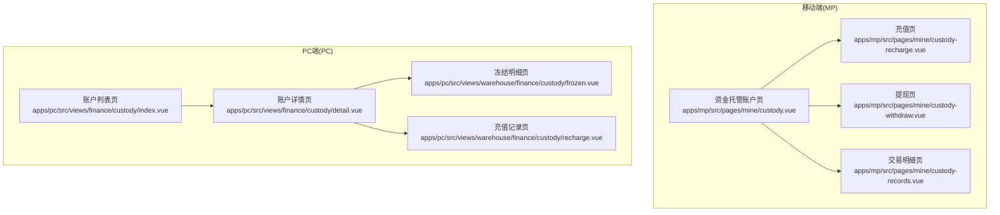
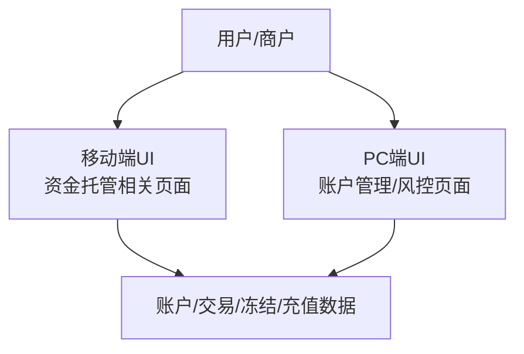
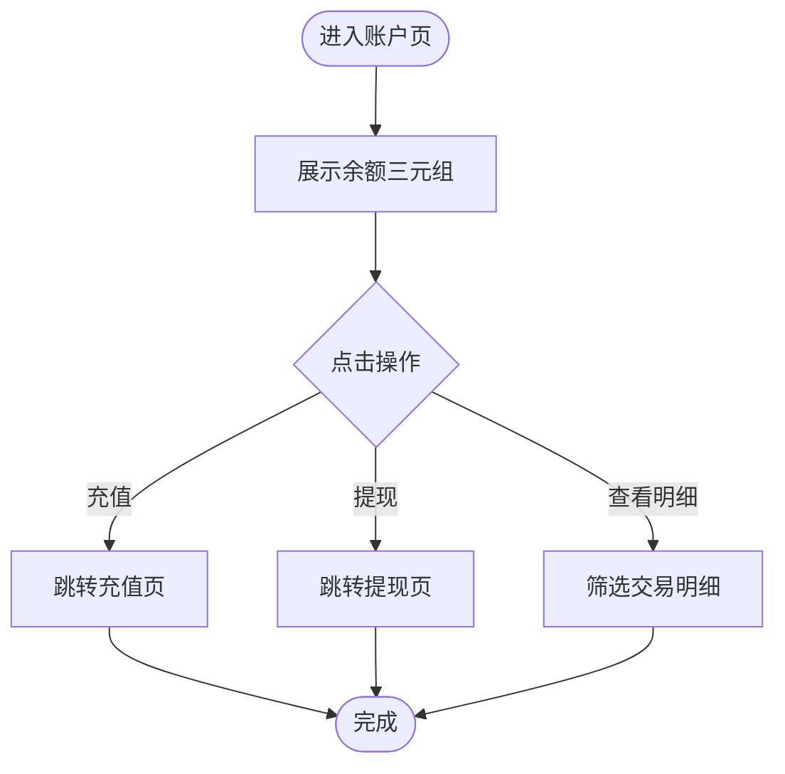
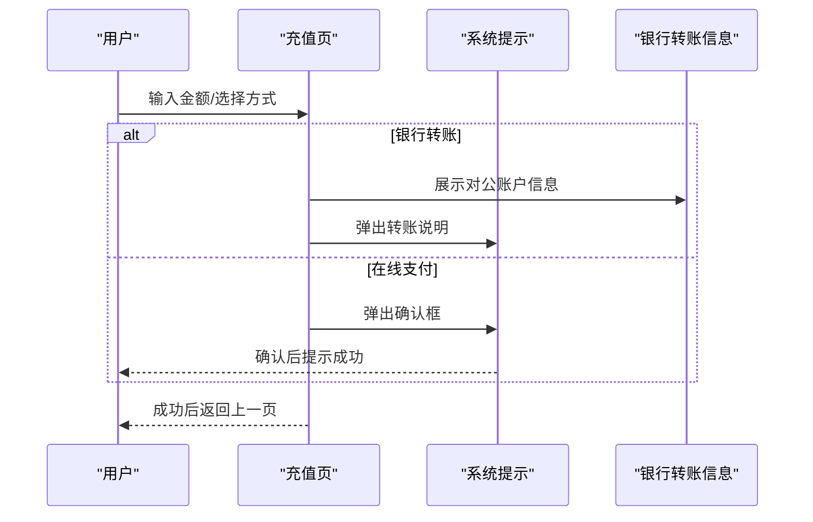
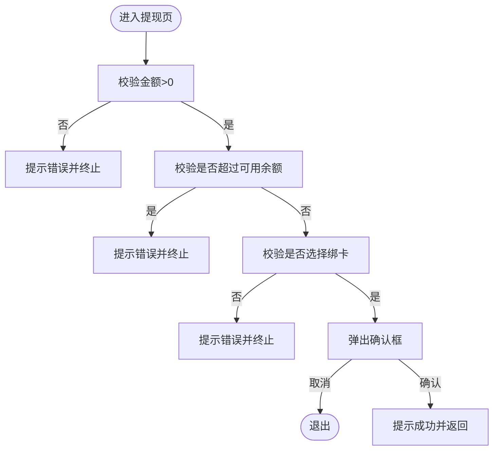
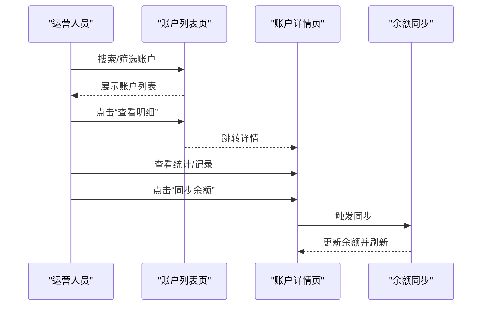
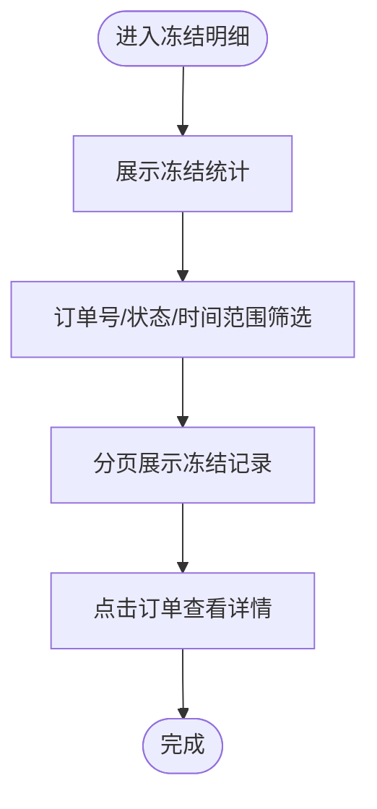
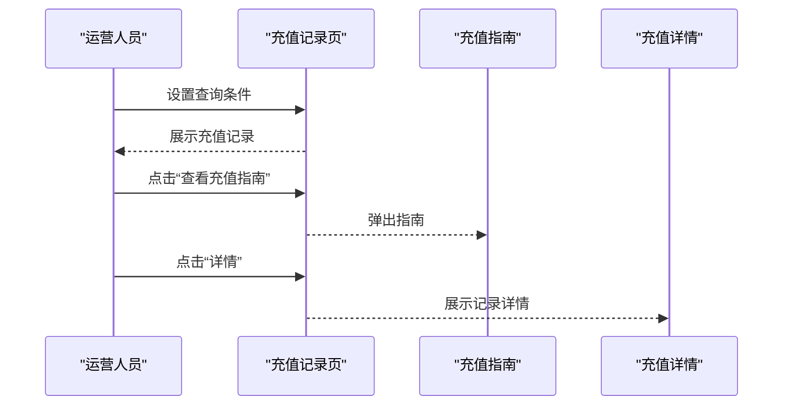
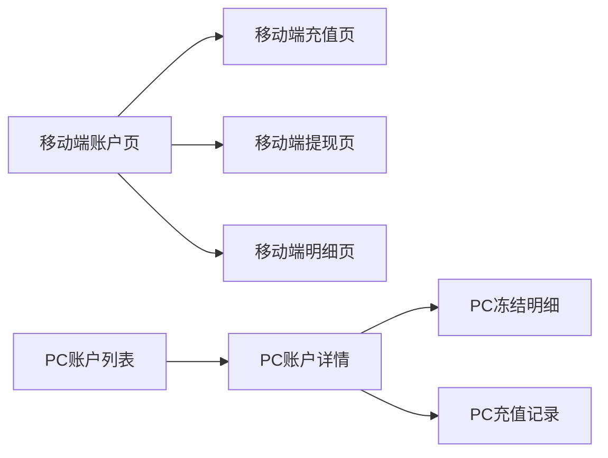

# 资金托管管理

<cite>
**本文引用的文件**   
- [apps/mp/src/pages/mine/custody.vue](file://apps/mp/src/pages/mine/custody.vue)
- [apps/mp/src/pages/mine/custody-recharge.vue](file://apps/mp/src/pages/mine/custody-recharge.vue)
- [apps/mp/src/pages/mine/custody-withdraw.vue](file://apps/mp/src/pages/mine/custody-withdraw.vue)
- [apps/mp/src/pages/mine/custody-records.vue](file://apps/mp/src/pages/mine/custody-records.vue)
- [apps/pc/src/views/finance/custody/index.vue](file://apps/pc/src/views/finance/custody/index.vue)
- [apps/pc/src/views/finance/custody/detail.vue](file://apps/pc/src/views/finance/custody/detail.vue)
- [apps/pc/src/views/warehouse/finance/custody/frozen.vue](file://apps/pc/src/views/warehouse/finance/custody/frozen.vue)
- [apps/pc/src/views/warehouse/finance/custody/recharge.vue](file://apps/pc/src/views/warehouse/finance/custody/recharge.vue)
</cite>

## 目录
1. [简介](#简介)
2. [项目结构](#项目结构)
3. [核心组件](#核心组件)
4. [架构总览](#架构总览)
5. [详细组件分析](#详细组件分析)
6. [依赖关系分析](#依赖关系分析)
7. [性能考量](#性能考量)
8. [故障排查指南](#故障排查指南)
9. [结论](#结论)
10. [附录](#附录)

## 简介
本文件面向工程仓资金托管管理功能，系统性梳理账户冻结/解冻、余额充值、资金划转、交易流水查询等核心能力，阐述托管机制的业务逻辑、资金安全控制、风险防范与合规管理要求，并提供操作指南与风险控制最佳实践。文档以移动端与PC端前端页面为依据，结合现有UI交互与数据展示，帮助非技术读者理解并正确使用资金托管体系。

## 项目结构
资金托管相关页面分布在移动端与PC端两套界面中：
- 移动端（小程序）：账户概览、充值、提现、交易明细等页面，聚焦用户侧日常操作。
- PC端（管理后台）：账户列表、账户详情、冻结明细、充值记录等页面，聚焦运营与风控侧管理。

图表来源
- [apps/mp/src/pages/mine/custody.vue:1-265](file://apps/mp/src/pages/mine/custody.vue#L1-L265)
- [apps/mp/src/pages/mine/custody-recharge.vue:1-444](file://apps/mp/src/pages/mine/custody-recharge.vue#L1-L444)
- [apps/mp/src/pages/mine/custody-withdraw.vue:1-375](file://apps/mp/src/pages/mine/custody-withdraw.vue#L1-L375)
- [apps/mp/src/pages/mine/custody-records.vue:1-418](file://apps/mp/src/pages/mine/custody-records.vue#L1-L418)
- [apps/pc/src/views/finance/custody/index.vue:1-222](file://apps/pc/src/views/finance/custody/index.vue#L1-L222)
- [apps/pc/src/views/finance/custody/detail.vue:1-511](file://apps/pc/src/views/finance/custody/detail.vue#L1-L511)
- [apps/pc/src/views/warehouse/finance/custody/frozen.vue:1-135](file://apps/pc/src/views/warehouse/finance/custody/frozen.vue#L1-L135)
- [apps/pc/src/views/warehouse/finance/custody/recharge.vue:1-302](file://apps/pc/src/views/warehouse/finance/custody/recharge.vue#L1-L302)

章节来源
- [apps/mp/src/pages/mine/custody.vue:1-265](file://apps/mp/src/pages/mine/custody.vue#L1-L265)
- [apps/pc/src/views/finance/custody/index.vue:1-222](file://apps/pc/src/views/finance/custody/index.vue#L1-L222)

## 核心组件
- 账户概览与交易明细（移动端）
  - 账户余额、可用余额、冻结金额三类余额展示；支持按“全部/收入/支出”筛选交易明细。
- 充值（移动端）
  - 支持输入金额、快捷金额、银行转账/在线支付方式选择；银行转账提供对公账户信息与提示。
- 提现（移动端）
  - 基于可用余额进行提现，支持选择绑卡、一键全部提现；展示提现说明与限额/手续费等规则。
- 账户管理（PC端）
  - 账户列表：按关键字、开户状态、绑卡状态、账户状态筛选，支持同步余额；账户详情：余额、账户信息、统计、交易/绑卡/开户/充值/提现记录。
- 冻结明细（PC端）
  - 展示冻结总金额、笔数、今日/当月解冻统计；支持按订单号、状态、时间范围查询冻结记录。
- 充值记录（PC端）
  - 展示充值统计、按方式/状态/时间范围查询；提供充值指南弹窗与记录详情。

章节来源
- [apps/mp/src/pages/mine/custody.vue:1-90](file://apps/mp/src/pages/mine/custody.vue#L1-L90)
- [apps/mp/src/pages/mine/custody-recharge.vue:1-178](file://apps/mp/src/pages/mine/custody-recharge.vue#L1-L178)
- [apps/mp/src/pages/mine/custody-withdraw.vue:1-143](file://apps/mp/src/pages/mine/custody-withdraw.vue#L1-L143)
- [apps/pc/src/views/finance/custody/index.vue:1-222](file://apps/pc/src/views/finance/custody/index.vue#L1-L222)
- [apps/pc/src/views/finance/custody/detail.vue:1-511](file://apps/pc/src/views/finance/custody/detail.vue#L1-L511)
- [apps/pc/src/views/warehouse/finance/custody/frozen.vue:1-135](file://apps/pc/src/views/warehouse/finance/custody/frozen.vue#L1-L135)
- [apps/pc/src/views/warehouse/finance/custody/recharge.vue:1-302](file://apps/pc/src/views/warehouse/finance/custody/recharge.vue#L1-L302)

## 架构总览
资金托管体系由“前端页面层 + 数据/状态展示层 + 运营管理入口”构成。移动端负责用户侧的日常操作与查询，PC端负责账户与业务的集中管理与风控监控。

图表来源
- [apps/mp/src/pages/mine/custody.vue:1-265](file://apps/mp/src/pages/mine/custody.vue#L1-L265)
- [apps/pc/src/views/finance/custody/index.vue:1-222](file://apps/pc/src/views/finance/custody/index.vue#L1-L222)
- [apps/pc/src/views/finance/custody/detail.vue:1-511](file://apps/pc/src/views/finance/custody/detail.vue#L1-L511)
- [apps/pc/src/views/warehouse/finance/custody/frozen.vue:1-135](file://apps/pc/src/views/warehouse/finance/custody/frozen.vue#L1-L135)
- [apps/pc/src/views/warehouse/finance/custody/recharge.vue:1-302](file://apps/pc/src/views/warehouse/finance/custody/recharge.vue#L1-L302)

## 详细组件分析

### 组件A：移动端“资金托管账户”
- 功能要点
  - 展示账户余额、可用余额、冻结金额。
  - 提供“充值/提现”入口跳转。
  - 交易明细支持“全部/收入/支出”筛选。
- 业务逻辑
  - 余额三元组：总余额=可用余额+冻结余额；交易明细按类型区分流入/流出。
- 风险与合规
  - 仅展示余额与明细，不直接暴露敏感账户信息；提现需基于可用余额，避免超支。

图表来源
- [apps/mp/src/pages/mine/custody.vue:1-90](file://apps/mp/src/pages/mine/custody.vue#L1-L90)

章节来源
- [apps/mp/src/pages/mine/custody.vue:1-90](file://apps/mp/src/pages/mine/custody.vue#L1-L90)

### 组件B：移动端“充值”
- 功能要点
  - 输入金额/快捷金额；选择银行转账或在线支付。
  - 银行转账提供对公账户信息与到账提示；在线支付弹确认框后跳回。
- 业务逻辑
  - 银行转账：线下打款，1-3个工作日到账；在线支付：即时到账。
  - 充值成功后返回上一页并提示。
- 风险与合规
  - 必填校验金额>0；银行转账强调备注企业ID以便入账核对。

图表来源
- [apps/mp/src/pages/mine/custody-recharge.vue:141-173](file://apps/mp/src/pages/mine/custody-recharge.vue#L141-L173)

章节来源
- [apps/mp/src/pages/mine/custody-recharge.vue:1-178](file://apps/mp/src/pages/mine/custody-recharge.vue#L1-L178)

### 组件C：移动端“提现”
- 功能要点
  - 基于可用余额输入提现金额；选择绑卡；展示提现说明（到账周期、限额、手续费等）。
- 业务逻辑
  - 校验：金额>0、不超过可用余额、已选择绑卡。
  - 提交后弹确认框，成功后返回上一页。
- 风险与合规
  - 严格限制可用余额范围；免手续费降低用户成本；限额与风控策略在后端实现。

图表来源
- [apps/mp/src/pages/mine/custody-withdraw.vue:102-138](file://apps/mp/src/pages/mine/custody-withdraw.vue#L102-L138)

章节来源
- [apps/mp/src/pages/mine/custody-withdraw.vue:1-143](file://apps/mp/src/pages/mine/custody-withdraw.vue#L1-L143)

### 组件D：PC端“账户列表与详情”
- 功能要点
  - 列表：按关键字、开户状态、绑卡状态、账户状态筛选；支持同步余额；点击“查看明细”进入详情。
  - 详情：账户余额/状态/信息、月度统计、交易/绑卡/开户/充值/提现记录分页查看；支持余额同步。
- 业务逻辑
  - 通过接口拉取账户列表与详情，格式化金额与状态标签；分页加载各类记录。
- 风险与合规
  - 详情页提供“同步余额”能力，确保对账一致性；状态标签直观反映账户健康度。

图表来源
- [apps/pc/src/views/finance/custody/index.vue:175-208](file://apps/pc/src/views/finance/custody/index.vue#L175-L208)
- [apps/pc/src/views/finance/custody/detail.vue:314-347](file://apps/pc/src/views/finance/custody/detail.vue#L314-L347)

章节来源
- [apps/pc/src/views/finance/custody/index.vue:1-222](file://apps/pc/src/views/finance/custody/index.vue#L1-L222)
- [apps/pc/src/views/finance/custody/detail.vue:1-511](file://apps/pc/src/views/finance/custody/detail.vue#L1-L511)

### 组件E：PC端“冻结明细”
- 功能要点
  - 统计冻结总金额、笔数、今日/当月解冻；按订单号、状态、时间范围查询。
- 业务逻辑
  - 冻结/解冻与订单生命周期关联；支持按采购/销售类型区分。
- 风险与合规
  - 明确冻结原因、预计解冻时间，便于审计与合规追溯。

图表来源
- [apps/pc/src/views/warehouse/finance/custody/frozen.vue:1-135](file://apps/pc/src/views/warehouse/finance/custody/frozen.vue#L1-L135)

章节来源
- [apps/pc/src/views/warehouse/finance/custody/frozen.vue:1-135](file://apps/pc/src/views/warehouse/finance/custody/frozen.vue#L1-L135)

### 组件F：PC端“充值记录”
- 功能要点
  - 统计本月充值、笔数、待审核、成功率；按方式/状态/时间范围查询；提供充值指南弹窗与记录详情。
- 业务逻辑
  - 银行转账强调备注台账编码；在线支付即时入账；失败/待审核状态清晰标注。
- 风险与合规
  - 充值指南规范转账备注，提升自动化入账准确率；状态颜色区分处理进度。

图表来源
- [apps/pc/src/views/warehouse/finance/custody/recharge.vue:101-143](file://apps/pc/src/views/warehouse/finance/custody/recharge.vue#L101-L143)
- [apps/pc/src/views/warehouse/finance/custody/recharge.vue:204-245](file://apps/pc/src/views/warehouse/finance/custody/recharge.vue#L204-L245)

章节来源
- [apps/pc/src/views/warehouse/finance/custody/recharge.vue:1-302](file://apps/pc/src/views/warehouse/finance/custody/recharge.vue#L1-L302)

## 依赖关系分析
- 页面间导航
  - 移动端：账户页 -> 充值/提现/明细；PC端：账户列表 -> 账户详情 -> 冻结/充值记录。
- 数据来源
  - 列表与详情页通过接口拉取账户与交易数据；充值/提现页在移动端本地校验后触发业务流程。
- 状态映射
  - 开户状态、绑卡状态、账户状态、交易类型、充值/提现状态均以标签形式展示，便于快速识别。

图表来源
- [apps/mp/src/pages/mine/custody.vue:1-90](file://apps/mp/src/pages/mine/custody.vue#L1-L90)
- [apps/pc/src/views/finance/custody/index.vue:175-208](file://apps/pc/src/views/finance/custody/index.vue#L175-L208)
- [apps/pc/src/views/finance/custody/detail.vue:314-347](file://apps/pc/src/views/finance/custody/detail.vue#L314-L347)
- [apps/pc/src/views/warehouse/finance/custody/frozen.vue:1-135](file://apps/pc/src/views/warehouse/finance/custody/frozen.vue#L1-L135)
- [apps/pc/src/views/warehouse/finance/custody/recharge.vue:1-302](file://apps/pc/src/views/warehouse/finance/custody/recharge.vue#L1-L302)

章节来源
- [apps/pc/src/views/finance/custody/index.vue:1-222](file://apps/pc/src/views/finance/custody/index.vue#L1-L222)
- [apps/pc/src/views/finance/custody/detail.vue:1-511](file://apps/pc/src/views/finance/custody/detail.vue#L1-L511)

## 性能考量
- 列表分页与筛选
  - PC端采用分页加载与多维筛选，减少一次性渲染压力，提升响应速度。
- 本地校验与提示
  - 移动端在提交前进行基础校验，减少无效请求与后端压力。
- 余额同步
  - 提供“同步余额”能力，避免因缓存导致的余额不一致问题。

## 故障排查指南
- 充值失败/未到账
  - 银行转账：检查转账备注是否包含要求的编码；确认到账时间窗口；等待系统自动识别。
  - 在线支付：确认支付渠道可用性与网络状态。
- 提现异常
  - 确认可用余额充足且绑卡有效；关注单笔限额与到账周期。
- 余额不一致
  - 使用PC端“同步余额”功能刷新数据；如仍异常，联系客服核对交易记录。
- 冻结/解冻争议
  - 在冻结明细中核对订单号、冻结原因与预计解冻时间；必要时联系风控团队复核。

章节来源
- [apps/pc/src/views/warehouse/finance/custody/recharge.vue:101-143](file://apps/pc/src/views/warehouse/finance/custody/recharge.vue#L101-L143)
- [apps/pc/src/views/finance/custody/detail.vue:339-347](file://apps/pc/src/views/finance/custody/detail.vue#L339-L347)
- [apps/pc/src/views/warehouse/finance/custody/frozen.vue:1-135](file://apps/pc/src/views/warehouse/finance/custody/frozen.vue#L1-L135)

## 结论
资金托管管理通过“移动端日常操作 + PC端集中管理”的双端协同，实现了从余额管理到交易/冻结/充值的全链路可视化与可控化。前端页面以清晰的状态标签与直观的筛选/分页能力，提升了用户体验与运营效率；同时通过严格的可用余额约束与合规提示，强化了资金安全与风险控制。

## 附录
- 操作指南（移动端）
  - 充值：选择金额与方式，银行转账注意备注；在线支付确认后即时到账。
  - 提现：确保可用余额充足并选择绑卡，关注到账周期与限额。
  - 明细：按类型筛选，核对余额变动与时间戳。
- 操作指南（PC端）
  - 账户列表：按状态/关键词筛选，必要时执行余额同步。
  - 账户详情：查看统计与各类记录，定位异常交易。
  - 冻结明细：核对冻结原因与预计解冻时间，跟踪解冻进度。
  - 充值记录：按方式/状态/时间范围查询，参考充值指南规范备注。