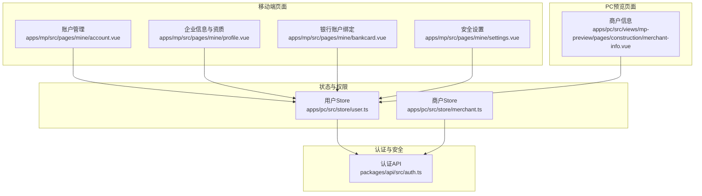
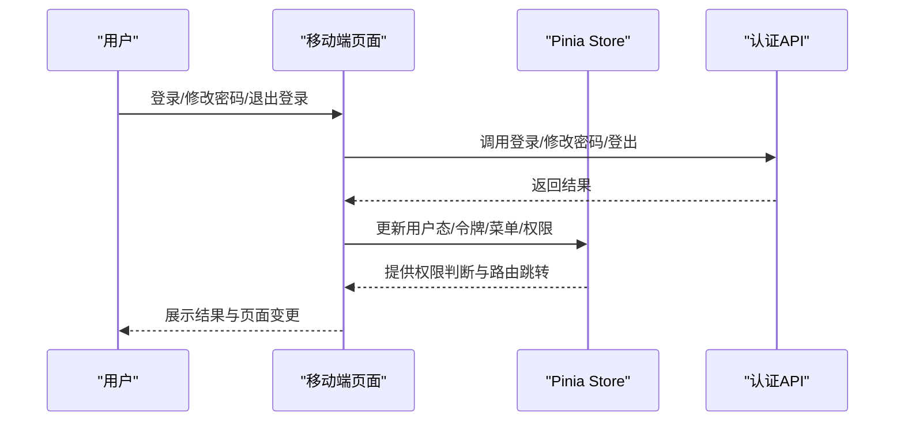
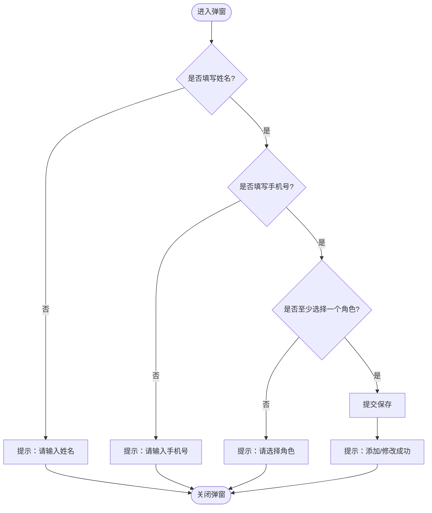
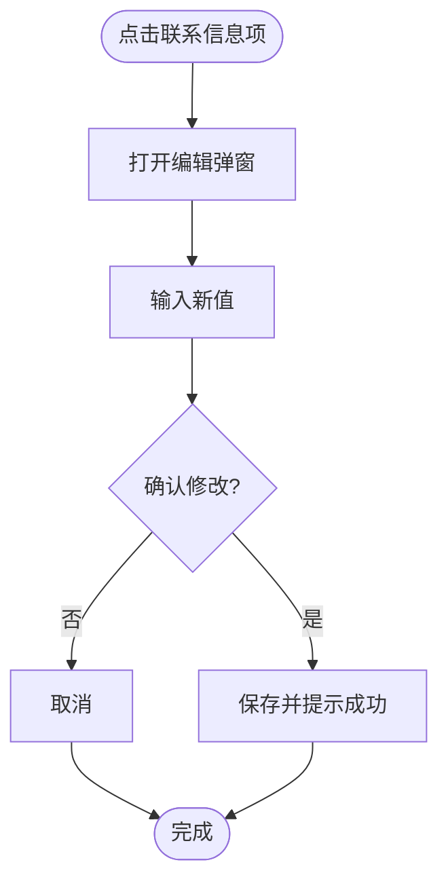
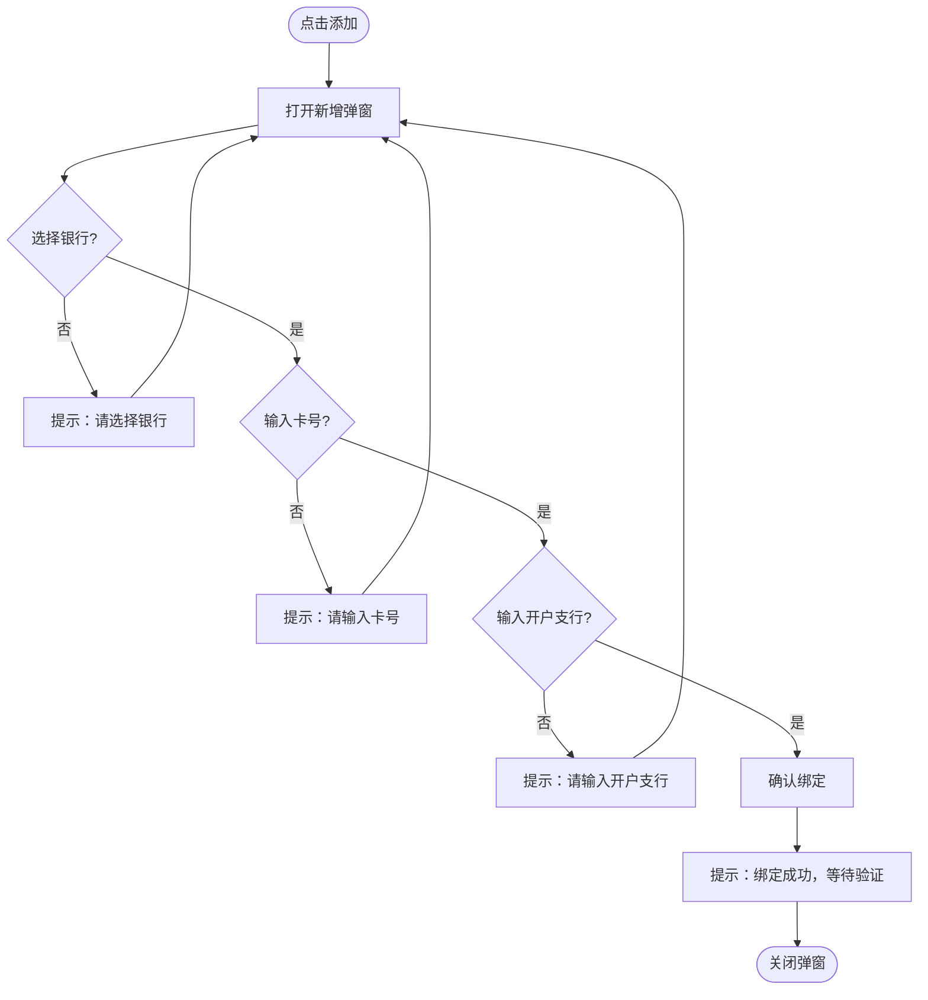
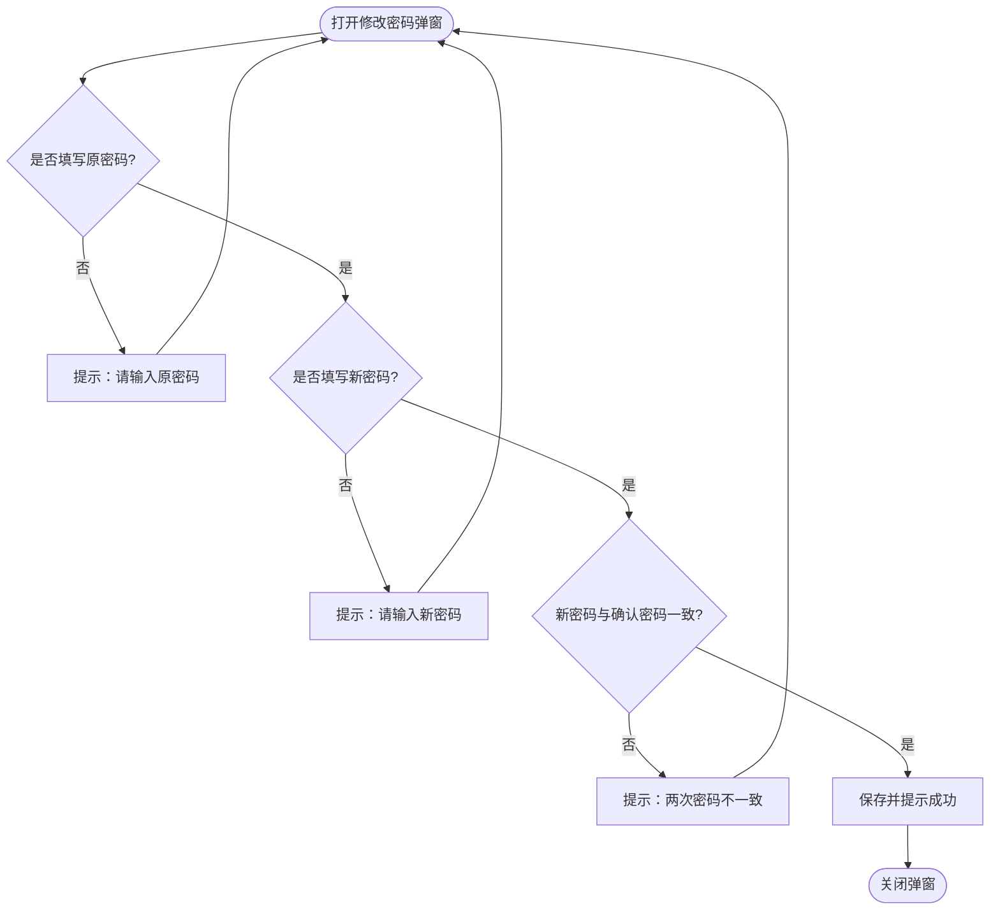
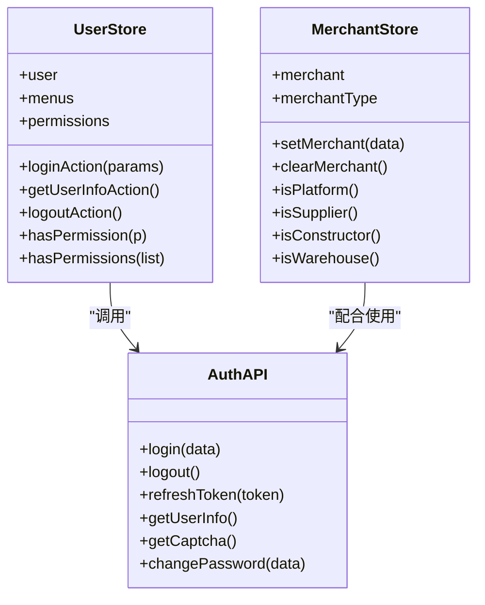
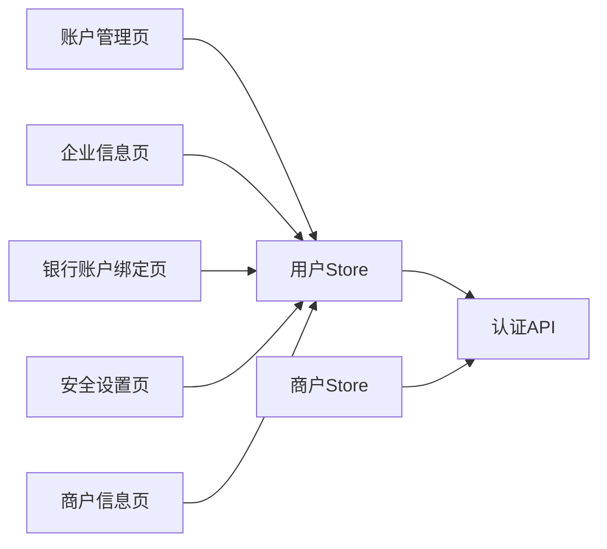

# 工程仓账户管理

<cite>
**本文档引用的文件**
- [apps/mp/src/pages/mine/account.vue](file://apps/mp/src/pages/mine/account.vue)
- [apps/mp/src/pages/mine/profile.vue](file://apps/mp/src/pages/mine/profile.vue)
- [apps/mp/src/pages/mine/settings.vue](file://apps/mp/src/pages/mine/settings.vue)
- [apps/mp/src/pages/mine/bankcard.vue](file://apps/mp/src/pages/mine/bankcard.vue)
- [apps/pc/src/views/mp-preview/pages/construction/merchant-info.vue](file://apps/pc/src/views/mp-preview/pages/construction/merchant-info.vue)
- [apps/pc/src/store/user.ts](file://apps/pc/src/store/user.ts)
- [apps/pc/src/store/merchant.ts](file://apps/pc/src/store/merchant.ts)
- [packages/api/src/auth.ts](file://packages/api/src/auth.ts)
</cite>

## 目录
1. [简介](#简介)
2. [项目结构](#项目结构)
3. [核心组件](#核心组件)
4. [架构总览](#架构总览)
5. [详细组件分析](#详细组件分析)
6. [依赖关系分析](#依赖关系分析)
7. [性能考虑](#性能考虑)
8. [故障排除指南](#故障排除指南)
9. [结论](#结论)
10. [附录](#附录)

## 简介
本文件面向工程仓账户管理功能，系统性梳理账户信息维护、银行账户绑定、安全设置、账户状态管理等全流程。文档基于现有前端页面与状态/存储实现，结合API层能力，给出验证规则、更新流程、权限控制机制与安全最佳实践，并提供操作指南与常见问题解决方案。

## 项目结构
工程仓账户管理涉及移动端与PC预览页面，主要分布在以下路径：
- 移动端页面：账户列表与子账号管理、企业信息与资质、银行账户绑定、安全设置
- PC预览页面：商户信息展示
- 状态与权限：Pinia Store 用户与商户信息
- 认证与安全：API 层登录、登出、刷新、修改密码、获取用户信息

**图表来源**
- [apps/mp/src/pages/mine/account.vue:1-605](file://apps/mp/src/pages/mine/account.vue#L1-L605)
- [apps/mp/src/pages/mine/profile.vue:1-499](file://apps/mp/src/pages/mine/profile.vue#L1-L499)
- [apps/mp/src/pages/mine/bankcard.vue:1-525](file://apps/mp/src/pages/mine/bankcard.vue#L1-L525)
- [apps/mp/src/pages/mine/settings.vue:1-448](file://apps/mp/src/pages/mine/settings.vue#L1-L448)
- [apps/pc/src/views/mp-preview/pages/construction/merchant-info.vue:1-241](file://apps/pc/src/views/mp-preview/pages/construction/merchant-info.vue#L1-L241)
- [apps/pc/src/store/user.ts:1-112](file://apps/pc/src/store/user.ts#L1-L112)
- [apps/pc/src/store/merchant.ts:1-49](file://apps/pc/src/store/merchant.ts#L1-L49)
- [packages/api/src/auth.ts:1-126](file://packages/api/src/auth.ts#L1-L126)

**章节来源**
- [apps/mp/src/pages/mine/account.vue:1-605](file://apps/mp/src/pages/mine/account.vue#L1-L605)
- [apps/mp/src/pages/mine/profile.vue:1-499](file://apps/mp/src/pages/mine/profile.vue#L1-L499)
- [apps/mp/src/pages/mine/bankcard.vue:1-525](file://apps/mp/src/pages/mine/bankcard.vue#L1-L525)
- [apps/mp/src/pages/mine/settings.vue:1-448](file://apps/mp/src/pages/mine/settings.vue#L1-L448)
- [apps/pc/src/views/mp-preview/pages/construction/merchant-info.vue:1-241](file://apps/pc/src/views/mp-preview/pages/construction/merchant-info.vue#L1-L241)
- [apps/pc/src/store/user.ts:1-112](file://apps/pc/src/store/user.ts#L1-L112)
- [apps/pc/src/store/merchant.ts:1-49](file://apps/pc/src/store/merchant.ts#L1-L49)
- [packages/api/src/auth.ts:1-126](file://packages/api/src/auth.ts#L1-L126)

## 核心组件
- 账户管理页：统计、搜索、子账号增删改、启用/禁用、重置密码
- 企业信息页：企业基本信息、联系信息、资质证照、银行账户、开票信息
- 银行卡绑定页：支持新增、验证、设为默认、解绑；限制最多5张
- 安全设置页：修改密码、绑定手机、消息通知开关、清除缓存、退出登录
- 商户信息页：PC侧预览，展示商户基础与主体信息及资质图片
- 用户/商户Store：统一管理用户态、菜单、权限与商户类型判断
- 认证API：登录、登出、刷新、修改密码、获取用户信息、验证码

**章节来源**
- [apps/mp/src/pages/mine/account.vue:1-605](file://apps/mp/src/pages/mine/account.vue#L1-L605)
- [apps/mp/src/pages/mine/profile.vue:1-499](file://apps/mp/src/pages/mine/profile.vue#L1-L499)
- [apps/mp/src/pages/mine/bankcard.vue:1-525](file://apps/mp/src/pages/mine/bankcard.vue#L1-L525)
- [apps/mp/src/pages/mine/settings.vue:1-448](file://apps/mp/src/pages/mine/settings.vue#L1-L448)
- [apps/pc/src/views/mp-preview/pages/construction/merchant-info.vue:1-241](file://apps/pc/src/views/mp-preview/pages/construction/merchant-info.vue#L1-L241)
- [apps/pc/src/store/user.ts:1-112](file://apps/pc/src/store/user.ts#L1-L112)
- [apps/pc/src/store/merchant.ts:1-49](file://apps/pc/src/store/merchant.ts#L1-L49)
- [packages/api/src/auth.ts:1-126](file://packages/api/src/auth.ts#L1-L126)

## 架构总览
账户管理采用“页面-状态/权限-接口”分层：
- 页面负责交互与校验（本地校验）
- Store负责用户态与商户态持久化与权限判断
- API层负责与后端交互（当前为Mock实现）

**图表来源**
- [apps/mp/src/pages/mine/settings.vue:190-269](file://apps/mp/src/pages/mine/settings.vue#L190-L269)
- [apps/pc/src/store/user.ts:40-91](file://apps/pc/src/store/user.ts#L40-L91)
- [packages/api/src/auth.ts:86-125](file://packages/api/src/auth.ts#L86-L125)

## 详细组件分析

### 账户管理（子账号）组件
- 功能要点
  - 统计总数、启用数、禁用数
  - 支持按姓名/手机号搜索
  - 子账号增删改：弹窗表单、角色多选
  - 启用/禁用切换与重置密码
- 验证规则
  - 姓名必填
  - 手机号必填
  - 至少选择一个角色
- 权限控制
  - 启用/禁用按钮仅在对应状态下显示
  - 重置密码对所有子账号可见
- 流程图（新增/编辑）

**图表来源**
- [apps/mp/src/pages/mine/account.vue:239-255](file://apps/mp/src/pages/mine/account.vue#L239-L255)

**章节来源**
- [apps/mp/src/pages/mine/account.vue:1-605](file://apps/mp/src/pages/mine/account.vue#L1-L605)

### 企业信息与资质组件
- 功能要点
  - 企业基本信息展示与编辑（弹窗输入）
  - 联系信息编辑（联系人、电话、邮箱）
  - 资质证照列表与图片预览、更新、添加
  - 银行账户列表与状态、跳转绑定页
  - 开票信息展示
- 验证规则
  - 编辑时通过弹窗输入校验（本地）
- 流程图（编辑联系信息）

**图表来源**
- [apps/mp/src/pages/mine/profile.vue:192-203](file://apps/mp/src/pages/mine/profile.vue#L192-L203)

**章节来源**
- [apps/mp/src/pages/mine/profile.vue:1-499](file://apps/mp/src/pages/mine/profile.vue#L1-L499)

### 银行账户绑定组件
- 功能要点
  - 最多绑定5张银行卡
  - 支持设为默认、验证（小额打款）、解绑
  - 新增弹窗：银行选择器、卡号、开户支行
- 验证规则
  - 选择银行
  - 填写卡号
  - 填写开户支行
- 流程图（新增绑定）

**图表来源**
- [apps/mp/src/pages/mine/bankcard.vue:193-217](file://apps/mp/src/pages/mine/bankcard.vue#L193-L217)

**章节来源**
- [apps/mp/src/pages/mine/bankcard.vue:1-525](file://apps/mp/src/pages/mine/bankcard.vue#L1-L525)

### 安全设置组件
- 功能要点
  - 修改密码：原密码、新密码、确认密码
  - 绑定手机：展示当前手机号
  - 消息通知开关
  - 清除缓存
  - 退出登录
- 验证规则
  - 原密码必填
  - 新密码必填
  - 新密码与确认密码一致
- 流程图（修改密码）

**图表来源**
- [apps/mp/src/pages/mine/settings.vue:190-206](file://apps/mp/src/pages/mine/settings.vue#L190-L206)

**章节来源**
- [apps/mp/src/pages/mine/settings.vue:1-448](file://apps/mp/src/pages/mine/settings.vue#L1-L448)

### 商户信息组件（PC预览）
- 功能要点
  - 展示商户基本信息、主体信息与认证状态
  - 资质证明图片网格展示
- 使用场景
  - PC端预览工程仓/商户信息，便于核对与审计

**章节来源**
- [apps/pc/src/views/mp-preview/pages/construction/merchant-info.vue:1-241](file://apps/pc/src/views/mp-preview/pages/construction/merchant-info.vue#L1-L241)

### 用户与商户状态/权限（Store）
- 用户Store
  - 登录/登出/刷新令牌/获取用户信息
  - 权限判断：hasPermission/hasPermissions
  - Mock模式下返回固定用户与菜单
- 商户Store
  - 设置/清空商户信息
  - 判断商户类型：平台/供应商/施工方/仓库

**图表来源**
- [apps/pc/src/store/user.ts:1-112](file://apps/pc/src/store/user.ts#L1-L112)
- [apps/pc/src/store/merchant.ts:1-49](file://apps/pc/src/store/merchant.ts#L1-L49)
- [packages/api/src/auth.ts:1-126](file://packages/api/src/auth.ts#L1-L126)

**章节来源**
- [apps/pc/src/store/user.ts:1-112](file://apps/pc/src/store/user.ts#L1-L112)
- [apps/pc/src/store/merchant.ts:1-49](file://apps/pc/src/store/merchant.ts#L1-L49)
- [packages/api/src/auth.ts:1-126](file://packages/api/src/auth.ts#L1-L126)

## 依赖关系分析
- 页面依赖Store进行用户态与权限判断，Store再依赖API层
- 银行卡绑定页依赖企业信息页中的“添加银行账户”入口
- 安全设置页依赖认证API进行密码修改与登出
- 商户信息页用于PC侧信息核对

**图表来源**
- [apps/mp/src/pages/mine/account.vue:1-605](file://apps/mp/src/pages/mine/account.vue#L1-L605)
- [apps/mp/src/pages/mine/profile.vue:1-499](file://apps/mp/src/pages/mine/profile.vue#L1-L499)
- [apps/mp/src/pages/mine/bankcard.vue:1-525](file://apps/mp/src/pages/mine/bankcard.vue#L1-L525)
- [apps/mp/src/pages/mine/settings.vue:1-448](file://apps/mp/src/pages/mine/settings.vue#L1-L448)
- [apps/pc/src/views/mp-preview/pages/construction/merchant-info.vue:1-241](file://apps/pc/src/views/mp-preview/pages/construction/merchant-info.vue#L1-L241)
- [apps/pc/src/store/user.ts:1-112](file://apps/pc/src/store/user.ts#L1-L112)
- [apps/pc/src/store/merchant.ts:1-49](file://apps/pc/src/store/merchant.ts#L1-L49)
- [packages/api/src/auth.ts:1-126](file://packages/api/src/auth.ts#L1-L126)

**章节来源**
- [apps/mp/src/pages/mine/account.vue:1-605](file://apps/mp/src/pages/mine/account.vue#L1-L605)
- [apps/mp/src/pages/mine/profile.vue:1-499](file://apps/mp/src/pages/mine/profile.vue#L1-L499)
- [apps/mp/src/pages/mine/bankcard.vue:1-525](file://apps/mp/src/pages/mine/bankcard.vue#L1-L525)
- [apps/mp/src/pages/mine/settings.vue:1-448](file://apps/mp/src/pages/mine/settings.vue#L1-L448)
- [apps/pc/src/views/mp-preview/pages/construction/merchant-info.vue:1-241](file://apps/pc/src/views/mp-preview/pages/construction/merchant-info.vue#L1-L241)
- [apps/pc/src/store/user.ts:1-112](file://apps/pc/src/store/user.ts#L1-L112)
- [apps/pc/src/store/merchant.ts:1-49](file://apps/pc/src/store/merchant.ts#L1-L49)
- [packages/api/src/auth.ts:1-126](file://packages/api/src/auth.ts#L1-L126)

## 性能考虑
- 页面渲染优化
  - 列表使用虚拟滚动（如数据量大，建议引入）
  - 图片懒加载与尺寸适配（资质证照、银行图标）
- 交互体验
  - 弹窗内联校验减少无效请求
  - 成功/失败Toast提示及时反馈
- 状态管理
  - Store集中管理用户态与权限，避免重复请求
  - Mock模式下减少网络抖动带来的交互延迟

## 故障排除指南
- 修改密码失败
  - 检查原密码、新密码与确认密码是否一致
  - 确认网络环境与API可用性
  - 参考路径：[apps/mp/src/pages/mine/settings.vue:190-206](file://apps/mp/src/pages/mine/settings.vue#L190-L206)
- 银行卡绑定失败
  - 确认银行、卡号、开户支行均填写
  - 确认未超过5张限制
  - 参考路径：[apps/mp/src/pages/mine/bankcard.vue:193-217](file://apps/mp/src/pages/mine/bankcard.vue#L193-L217)
- 退出登录异常
  - 检查Store登出逻辑与路由跳转
  - 参考路径：[apps/pc/src/store/user.ts:75-91](file://apps/pc/src/store/user.ts#L75-L91)
- 权限不足
  - 使用权限判断方法：hasPermission/hasPermissions
  - 参考路径：[apps/pc/src/store/user.ts:93-99](file://apps/pc/src/store/user.ts#L93-L99)

**章节来源**
- [apps/mp/src/pages/mine/settings.vue:190-206](file://apps/mp/src/pages/mine/settings.vue#L190-L206)
- [apps/mp/src/pages/mine/bankcard.vue:193-217](file://apps/mp/src/pages/mine/bankcard.vue#L193-L217)
- [apps/pc/src/store/user.ts:75-91](file://apps/pc/src/store/user.ts#L75-L91)
- [apps/pc/src/store/user.ts:93-99](file://apps/pc/src/store/user.ts#L93-L99)

## 结论
工程仓账户管理功能以页面-状态-接口三层结构清晰呈现，覆盖企业信息维护、银行账户绑定、安全设置与账户状态管理。当前实现以Mock为主，后续可对接真实后端接口，完善鉴权与风控策略，提升安全性与稳定性。

## 附录

### 操作指南（步骤化）
- 维护企业基本信息
  - 进入企业信息页，点击联系信息项进行编辑
  - 参考路径：[apps/mp/src/pages/mine/profile.vue:192-203](file://apps/mp/src/pages/mine/profile.vue#L192-L203)
- 更新资质证照
  - 在资质证照区域点击“更新”或“添加”
  - 参考路径：[apps/mp/src/pages/mine/profile.vue:211-232](file://apps/mp/src/pages/mine/profile.vue#L211-L232)
- 绑定银行账户
  - 点击“添加银行账户”，填写银行、卡号、开户支行
  - 参考路径：[apps/mp/src/pages/mine/bankcard.vue:147-217](file://apps/mp/src/pages/mine/bankcard.vue#L147-L217)
- 修改密码
  - 进入安全设置，打开修改密码弹窗，按提示填写
  - 参考路径：[apps/mp/src/pages/mine/settings.vue:185-206](file://apps/mp/src/pages/mine/settings.vue#L185-L206)
- 子账号管理
  - 添加/编辑子账号，选择角色，启用/禁用与重置密码
  - 参考路径：[apps/mp/src/pages/mine/account.vue:178-255](file://apps/mp/src/pages/mine/account.vue#L178-L255)

### 验证规则清单
- 子账号新增/编辑
  - 姓名必填
  - 手机号必填
  - 至少选择一个角色
- 银行卡绑定
  - 选择银行
  - 填写卡号
  - 填写开户支行
- 修改密码
  - 原密码必填
  - 新密码必填
  - 新密码与确认密码一致

### 权限控制机制
- 用户权限判断
  - hasPermission/hasPermissions
  - 参考路径：[apps/pc/src/store/user.ts:93-99](file://apps/pc/src/store/user.ts#L93-L99)
- 商户类型判断
  - isPlatform/isSupplier/isConstructor/isWarehouse
  - 参考路径：[apps/pc/src/store/merchant.ts:22-36](file://apps/pc/src/store/merchant.ts#L22-L36)

### 安全最佳实践
- 密码安全
  - 强制新旧密码一致性校验
  - 建议增加复杂度要求与历史密码校验
- 银行卡安全
  - 绑定后必须小额打款验证
  - 默认卡仅限已验证卡片
- 会话安全
  - 登出时清理令牌与用户信息
  - 参考路径：[apps/pc/src/store/user.ts:75-91](file://apps/pc/src/store/user.ts#L75-L91)