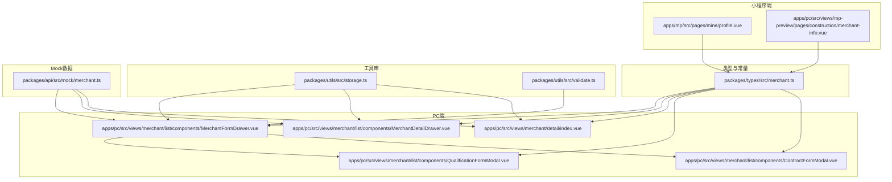
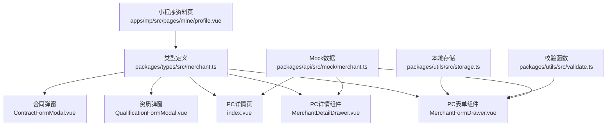
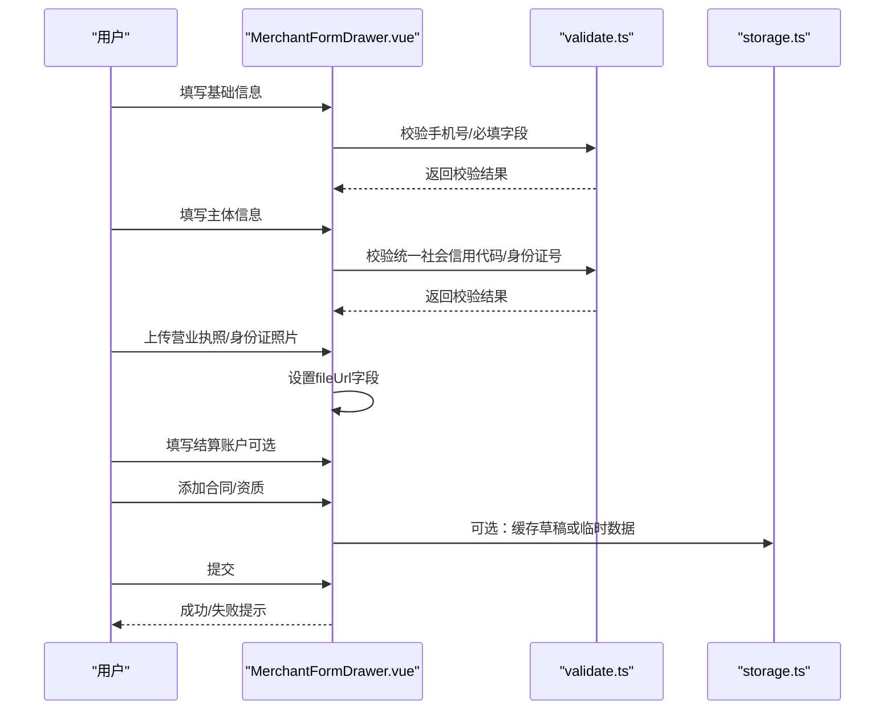
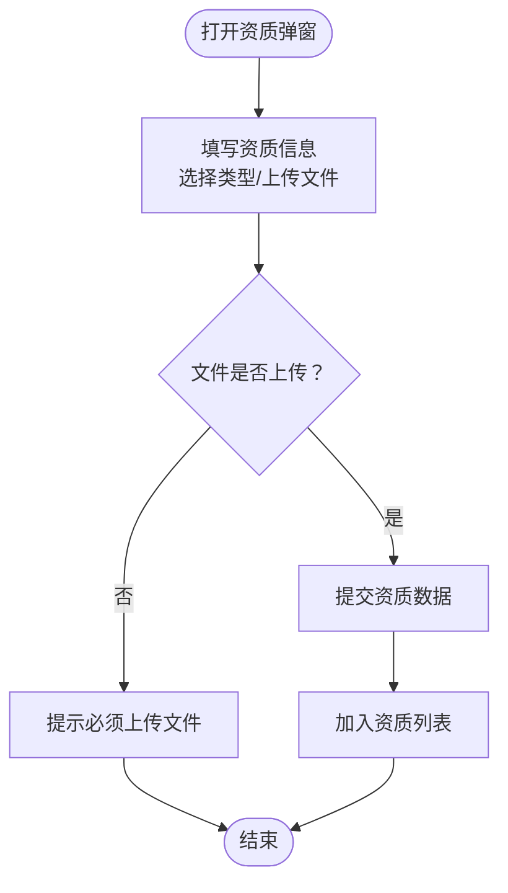
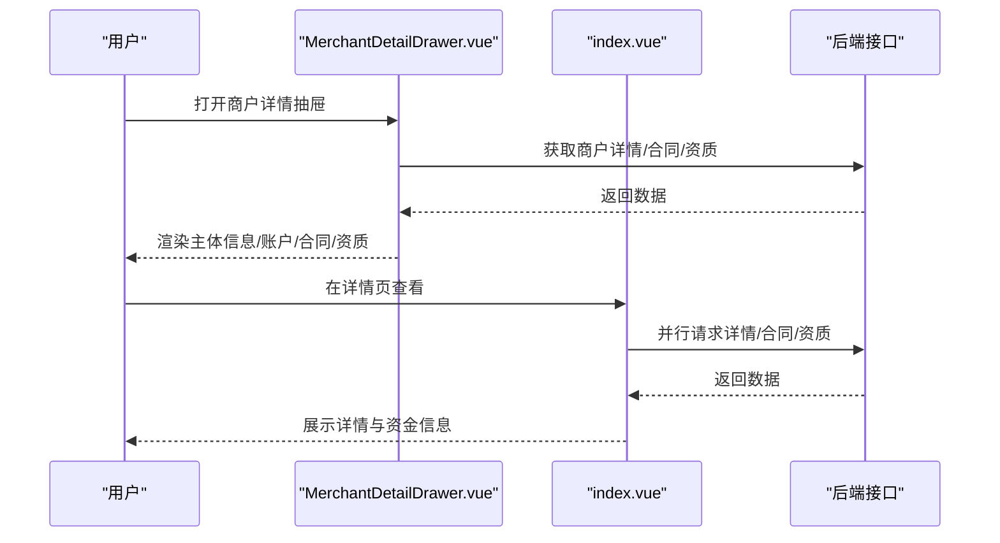
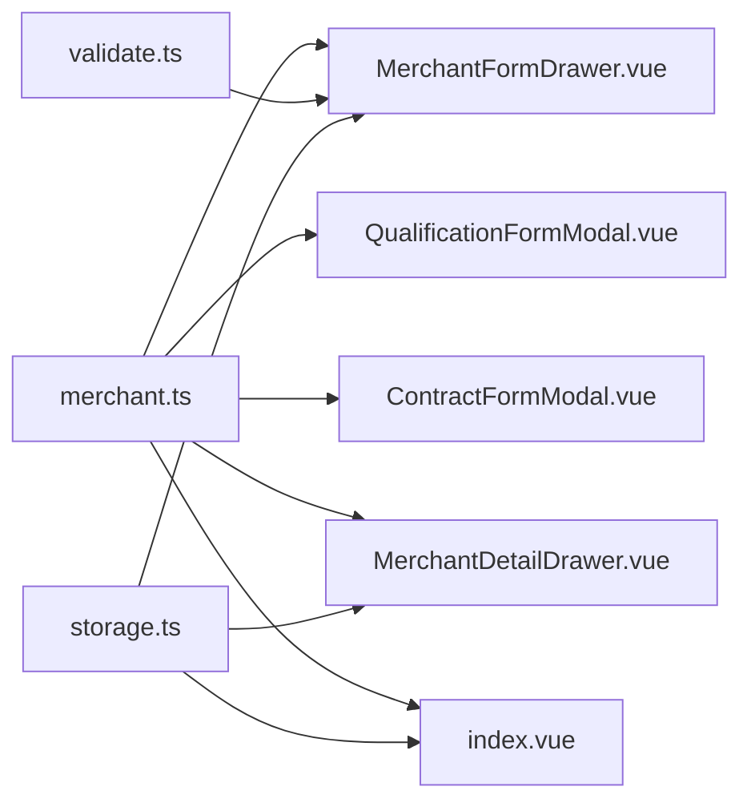
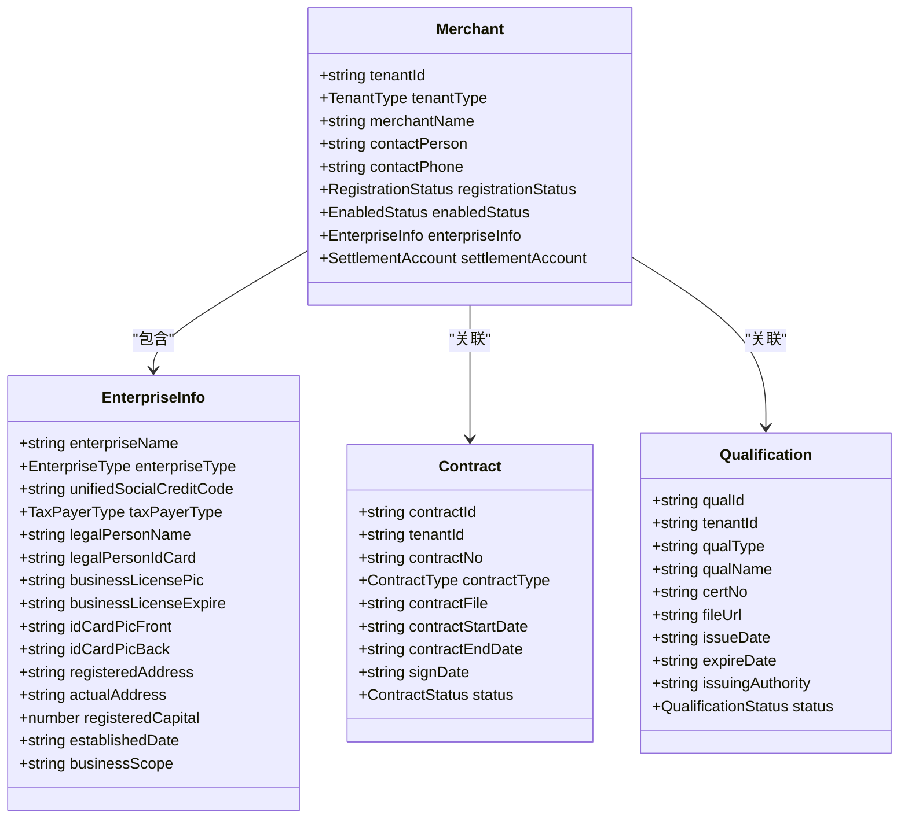

# 工程仓资料管理

<cite>
**本文引用的文件**
- [merchant.ts](file://packages/types/src/merchant.ts)
- [MerchantFormDrawer.vue](file://apps/pc/src/views/merchant/list/components/MerchantFormDrawer.vue)
- [MerchantDetailDrawer.vue](file://apps/pc/src/views/merchant/list/components/MerchantDetailDrawer.vue)
- [index.vue](file://apps/pc/src/views/merchant/detail/index.vue)
- [QualificationFormModal.vue](file://apps/pc/src/views/merchant/list/components/QualificationFormModal.vue)
- [ContractFormModal.vue](file://apps/pc/src/views/merchant/list/components/ContractFormModal.vue)
- [storage.ts](file://packages/utils/src/storage.ts)
- [validate.ts](file://packages/utils/src/validate.ts)
- [profile.vue](file://apps/mp/src/pages/mine/profile.vue)
- [merchant.ts](file://packages/api/src/mock/merchant.ts)
- [merchant-info.vue](file://apps/pc/src/views/mp-preview/pages/construction/merchant-info.vue)
</cite>

## 目录
1. [简介](#简介)
2. [项目结构](#项目结构)
3. [核心组件](#核心组件)
4. [架构总览](#架构总览)
5. [详细组件分析](#详细组件分析)
6. [依赖关系分析](#依赖关系分析)
7. [性能考量](#性能考量)
8. [故障排查指南](#故障排查指南)
9. [结论](#结论)
10. [附录](#附录)

## 简介
本文件面向工程仓资料管理功能，系统化梳理企业主体资料的完整管理体系，覆盖以下方面：
- 企业基本信息：统一社会信用代码、注册资本、成立日期、经营范围、纳税人类型等
- 联系人信息：法定代表人、联系人、联系方式
- 资质证书管理：营业执照、税务登记证、行业资质等
- 企业照片与文件上传：支持图片与PDF等格式
- 资料审核流程：入驻申请、平台审核、账户开通、入驻完成
- 信息更新要求与合规检查：字段校验、有效期管理、过期提醒
- 文件格式限制与存储管理：上传控件、文件类型与大小约束
- 隐私保护与安全：本地存储策略、访问控制与审计日志

## 项目结构
工程仓资料管理相关代码主要分布在前端PC端与小程序端，以及共享类型定义与工具库：
- 类型与枚举：统一定义商户、企业信息、合同、资质、托管账户等数据结构
- PC端页面与组件：商户资料录入、详情展示、资质与合同管理弹窗
- 小程序端页面：移动端资料预览与联系信息展示
- 工具库：本地存储、校验函数
- Mock数据：用于演示与测试

**图表来源**
- [merchant.ts](file://packages/types/src/merchant.ts)
- [MerchantFormDrawer.vue](file://apps/pc/src/views/merchant/list/components/MerchantFormDrawer.vue)
- [MerchantDetailDrawer.vue](file://apps/pc/src/views/merchant/list/components/MerchantDetailDrawer.vue)
- [index.vue](file://apps/pc/src/views/merchant/detail/index.vue)
- [QualificationFormModal.vue](file://apps/pc/src/views/merchant/list/components/QualificationFormModal.vue)
- [ContractFormModal.vue](file://apps/pc/src/views/merchant/list/components/ContractFormModal.vue)
- [storage.ts](file://packages/utils/src/storage.ts)
- [validate.ts](file://packages/utils/src/validate.ts)
- [profile.vue](file://apps/mp/src/pages/mine/profile.vue)
- [merchant.ts](file://packages/api/src/mock/merchant.ts)
- [merchant-info.vue](file://apps/pc/src/views/mp-preview/pages/construction/merchant-info.vue)

**章节来源**
- [merchant.ts](file://packages/types/src/merchant.ts)
- [MerchantFormDrawer.vue](file://apps/pc/src/views/merchant/list/components/MerchantFormDrawer.vue)
- [MerchantDetailDrawer.vue](file://apps/pc/src/views/merchant/list/components/MerchantDetailDrawer.vue)
- [index.vue](file://apps/pc/src/views/merchant/detail/index.vue)
- [QualificationFormModal.vue](file://apps/pc/src/views/merchant/list/components/QualificationFormModal.vue)
- [ContractFormModal.vue](file://apps/pc/src/views/merchant/list/components/ContractFormModal.vue)
- [storage.ts](file://packages/utils/src/storage.ts)
- [validate.ts](file://packages/utils/src/validate.ts)
- [profile.vue](file://apps/mp/src/pages/mine/profile.vue)
- [merchant.ts](file://packages/api/src/mock/merchant.ts)
- [merchant-info.vue](file://apps/pc/src/views/mp-preview/pages/construction/merchant-info.vue)

## 核心组件
- 商户主体信息模型：统一社会信用代码、企业类型、纳税人类型、法定代表人、身份证号、营业执照、身份证正反面、注册地址、实际经营地址、注册资本、成立日期、经营范围等
- 资质信息模型：资质类型、名称、证书编号、文件URL、发证日期、有效期、发证机关、状态、备注
- 合同信息模型：合同编号、类型、文件URL、生效期、截止期、签署日期、状态
- 托管账户模型：账户状态、开户状态、绑卡状态、可用/冻结/总余额、绑卡记录、开户记录
- 表单组件：多步骤表单录入主体信息、上传营业执照与身份证照片、设置结算账户、添加合同与资质
- 详情组件：展示主体信息、结算账户、合同与资质列表，并支持托管账户相关操作
- 小程序端资料页：展示企业基本信息、联系信息、证书与银行账户等

**章节来源**
- [merchant.ts](file://packages/types/src/merchant.ts)
- [MerchantFormDrawer.vue](file://apps/pc/src/views/merchant/list/components/MerchantFormDrawer.vue)
- [MerchantDetailDrawer.vue](file://apps/pc/src/views/merchant/list/components/MerchantDetailDrawer.vue)
- [index.vue](file://apps/pc/src/views/merchant/detail/index.vue)
- [QualificationFormModal.vue](file://apps/pc/src/views/merchant/list/components/QualificationFormModal.vue)
- [ContractFormModal.vue](file://apps/pc/src/views/merchant/list/components/ContractFormModal.vue)
- [profile.vue](file://apps/mp/src/pages/mine/profile.vue)

## 架构总览
资料管理采用“类型定义 + 前端组件 + 工具库”的分层架构：
- 类型层：在packages/types中集中定义数据模型与枚举，确保前后端一致性
- 视图层：PC端通过抽屉与模态框组织多步骤表单；小程序端以卡片式布局展示
- 工具层：本地存储封装与通用校验函数，保障数据持久化与输入合法性
- Mock层：提供示例数据，便于演示与测试

**图表来源**
- [merchant.ts](file://packages/types/src/merchant.ts)
- [MerchantFormDrawer.vue](file://apps/pc/src/views/merchant/list/components/MerchantFormDrawer.vue)
- [MerchantDetailDrawer.vue](file://apps/pc/src/views/merchant/list/components/MerchantDetailDrawer.vue)
- [index.vue](file://apps/pc/src/views/merchant/detail/index.vue)
- [QualificationFormModal.vue](file://apps/pc/src/views/merchant/list/components/QualificationFormModal.vue)
- [ContractFormModal.vue](file://apps/pc/src/views/merchant/list/components/ContractFormModal.vue)
- [storage.ts](file://packages/utils/src/storage.ts)
- [validate.ts](file://packages/utils/src/validate.ts)
- [profile.vue](file://apps/mp/src/pages/mine/profile.vue)
- [merchant.ts](file://packages/api/src/mock/merchant.ts)

## 详细组件分析

### 组件A：主体信息与文件上传（多步骤表单）
- 功能要点
  - 多步骤表单：基础信息、主体信息、结算账户、合同信息、资质信息
  - 主体信息字段：企业名称、企业类型、纳税人类型、统一社会信用代码（必填且18位）、法定代表人、法人身份证号（必填且18位）、营业执照图片、营业执照有效期、身份证正反面、注册地址、实际经营地址、注册资本、成立日期、经营范围
  - 文件上传：营业执照、身份证正反面支持图片格式；合同与资质支持PDF、DOC/DOCX、JPG/JPEG/PNG
  - 结算账户：账户名称、银行账号、开户银行、支行信息、联行号（选填）
  - 合同与资质：支持添加与删除，列表展示并标注状态
- 输入校验
  - 手机号、身份证号、统一社会信用代码长度与格式校验
  - 文件上传限制与必填校验
- 输出与存储
  - 表单数据结构与类型定义保持一致，便于后续提交与持久化

**图表来源**
- [MerchantFormDrawer.vue](file://apps/pc/src/views/merchant/list/components/MerchantFormDrawer.vue)
- [validate.ts](file://packages/utils/src/validate.ts)
- [storage.ts](file://packages/utils/src/storage.ts)

**章节来源**
- [MerchantFormDrawer.vue](file://apps/pc/src/views/merchant/list/components/MerchantFormDrawer.vue)
- [merchant.ts](file://packages/types/src/merchant.ts)
- [validate.ts](file://packages/utils/src/validate.ts)
- [storage.ts](file://packages/utils/src/storage.ts)

### 组件B：资质信息管理（弹窗表单）
- 功能要点
  - 资质类型选择联动生成默认名称
  - 支持上传PDF、JPG、JPEG、PNG格式文件
  - 填写证书编号、发证日期、有效期、发证机关、备注
- 文件格式限制
  - accept=".pdf,.jpg,.jpeg,.png"
- 状态管理
  - 列表展示时根据有效期标记“已过期”、“即将到期”等

**图表来源**
- [QualificationFormModal.vue](file://apps/pc/src/views/merchant/list/components/QualificationFormModal.vue)
- [merchant.ts](file://packages/types/src/merchant.ts)

**章节来源**
- [QualificationFormModal.vue](file://apps/pc/src/views/merchant/list/components/QualificationFormModal.vue)
- [merchant.ts](file://packages/types/src/merchant.ts)

### 组件C：合同信息管理（弹窗表单）
- 功能要点
  - 合同编号、类型、文件上传（PDF、DOC/DOCX、JPG/JPEG/PNG）
  - 生效期与截止期、签署日期
- 文件格式限制
  - accept=".pdf,.doc,.docx,.jpg,.jpeg,.png"

**章节来源**
- [ContractFormModal.vue](file://apps/pc/src/views/merchant/list/components/ContractFormModal.vue)
- [merchant.ts](file://packages/types/src/merchant.ts)

### 组件D：资料详情与展示
- 功能要点
  - 展示主体信息、结算账户、合同与资质列表
  - 支持查看营业执照、身份证照片、资质证书图片
  - 托管账户信息与资金余额展示
- 数据加载
  - 并行加载商户详情、合同列表、资质列表，提升响应速度

**图表来源**
- [MerchantDetailDrawer.vue](file://apps/pc/src/views/merchant/list/components/MerchantDetailDrawer.vue)
- [index.vue](file://apps/pc/src/views/merchant/detail/index.vue)

**章节来源**
- [MerchantDetailDrawer.vue](file://apps/pc/src/views/merchant/list/components/MerchantDetailDrawer.vue)
- [index.vue](file://apps/pc/src/views/merchant/detail/index.vue)

### 组件E：小程序端资料展示
- 功能要点
  - 展示企业基本信息（名称、统一社会信用代码、类型、成立日期、注册资本、地址、经营范围）
  - 展示联系信息（联系人、电话、邮箱）
  - 展示证书与银行账户状态
- 与PC端差异
  - 移动端以卡片与列表形式呈现，更注重可读性与触控体验

**章节来源**
- [profile.vue](file://apps/mp/src/pages/mine/profile.vue)
- [merchant-info.vue](file://apps/pc/src/views/mp-preview/pages/construction/merchant-info.vue)

## 依赖关系分析
- 组件耦合
  - 表单组件与类型定义强耦合，保证字段一致性
  - 弹窗组件与表单组件松耦合，通过事件传递数据
  - 详情组件依赖详情页的数据加载逻辑
- 外部依赖
  - 上传组件依赖accept属性与fileList回调，统一设置fileUrl
  - 校验函数提供手机号、身份证号、统一社会信用代码等校验
  - 本地存储封装提供令牌与用户信息的持久化

**图表来源**
- [merchant.ts](file://packages/types/src/merchant.ts)
- [MerchantFormDrawer.vue](file://apps/pc/src/views/merchant/list/components/MerchantFormDrawer.vue)
- [QualificationFormModal.vue](file://apps/pc/src/views/merchant/list/components/QualificationFormModal.vue)
- [ContractFormModal.vue](file://apps/pc/src/views/merchant/list/components/ContractFormModal.vue)
- [MerchantDetailDrawer.vue](file://apps/pc/src/views/merchant/list/components/MerchantDetailDrawer.vue)
- [index.vue](file://apps/pc/src/views/merchant/detail/index.vue)
- [validate.ts](file://packages/utils/src/validate.ts)
- [storage.ts](file://packages/utils/src/storage.ts)

**章节来源**
- [merchant.ts](file://packages/types/src/merchant.ts)
- [MerchantFormDrawer.vue](file://apps/pc/src/views/merchant/list/components/MerchantFormDrawer.vue)
- [QualificationFormModal.vue](file://apps/pc/src/views/merchant/list/components/QualificationFormModal.vue)
- [ContractFormModal.vue](file://apps/pc/src/views/merchant/list/components/ContractFormModal.vue)
- [MerchantDetailDrawer.vue](file://apps/pc/src/views/merchant/list/components/MerchantDetailDrawer.vue)
- [index.vue](file://apps/pc/src/views/merchant/detail/index.vue)
- [validate.ts](file://packages/utils/src/validate.ts)
- [storage.ts](file://packages/utils/src/storage.ts)

## 性能考量
- 并行加载：详情页对商户、合同、资质采用Promise.all并行请求，减少首屏等待
- 图片懒加载：详情页中的图片采用缩略图与懒加载策略，降低带宽占用
- 表单分步：多步骤表单避免一次性渲染大量DOM，提升交互流畅度
- 本地缓存：草稿与临时数据可缓存于localStorage，减少重复输入成本

## 故障排查指南
- 文件上传失败
  - 检查accept属性与文件类型是否匹配
  - 确认fileList回调中是否正确设置fileUrl
- 校验失败
  - 统一社会信用代码必须为18位；身份证号必须为18位；手机号格式需符合规则
- 数据不一致
  - 确保类型定义与表单数据结构一致；注意必填字段与可选字段
- 详情页空白
  - 检查并行请求是否全部成功；确认tenantId参数是否存在

**章节来源**
- [MerchantFormDrawer.vue](file://apps/pc/src/views/merchant/list/components/MerchantFormDrawer.vue)
- [validate.ts](file://packages/utils/src/validate.ts)
- [index.vue](file://apps/pc/src/views/merchant/detail/index.vue)

## 结论
工程仓资料管理通过统一的类型定义与组件化实现，构建了从录入、校验、上传到展示与管理的完整闭环。多步骤表单与弹窗组件提升了用户体验，而并行加载与本地存储优化则保障了性能与易用性。建议在后续迭代中进一步完善：
- 审核流程可视化：在详情页增加入驻流程步骤与状态提示
- 合规检查：对关键字段（统一社会信用代码、身份证号、银行账号）增加更强的合规校验
- 存储与隐私：明确文件存储策略与隐私保护机制，确保敏感信息的安全

## 附录

### 数据模型类图

**图表来源**
- [merchant.ts](file://packages/types/src/merchant.ts)