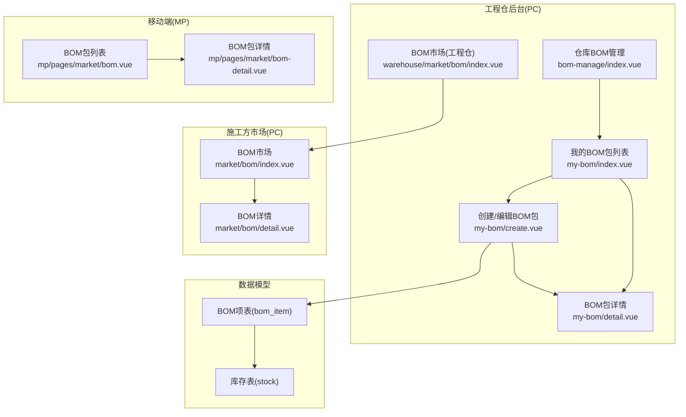
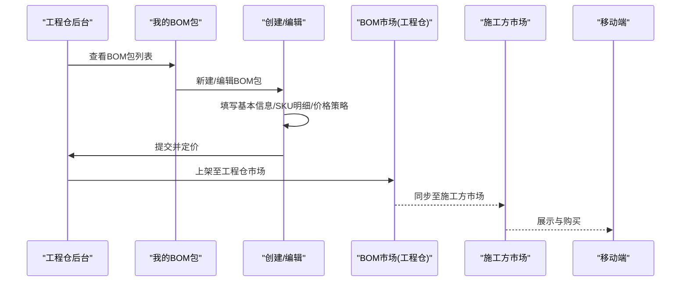
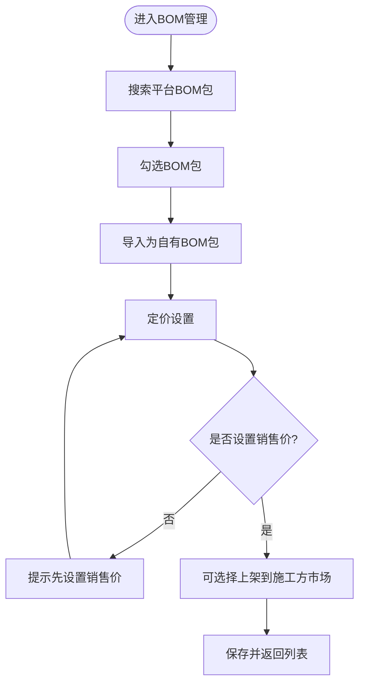
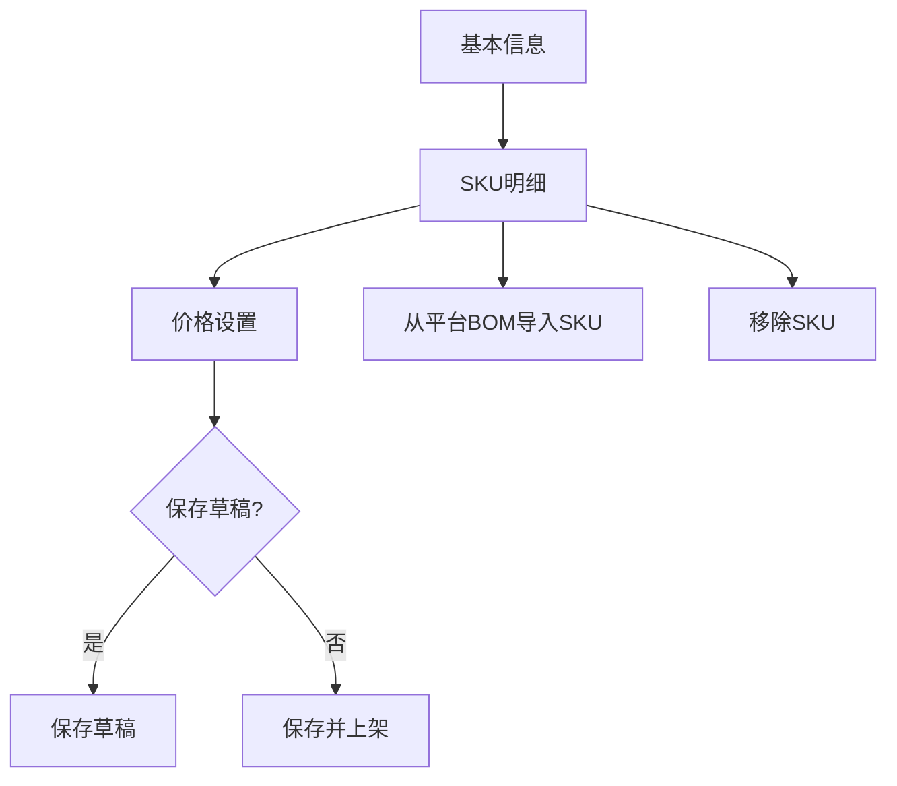
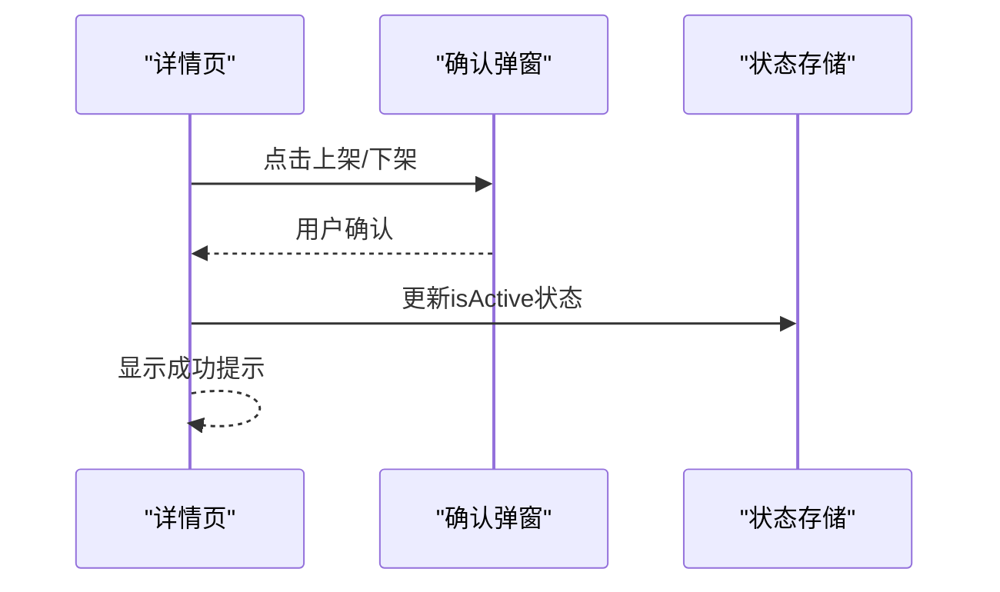
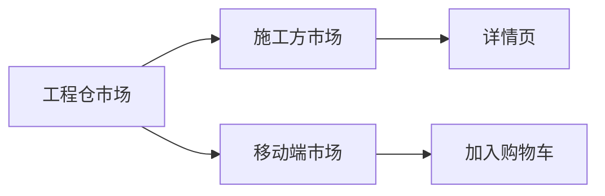
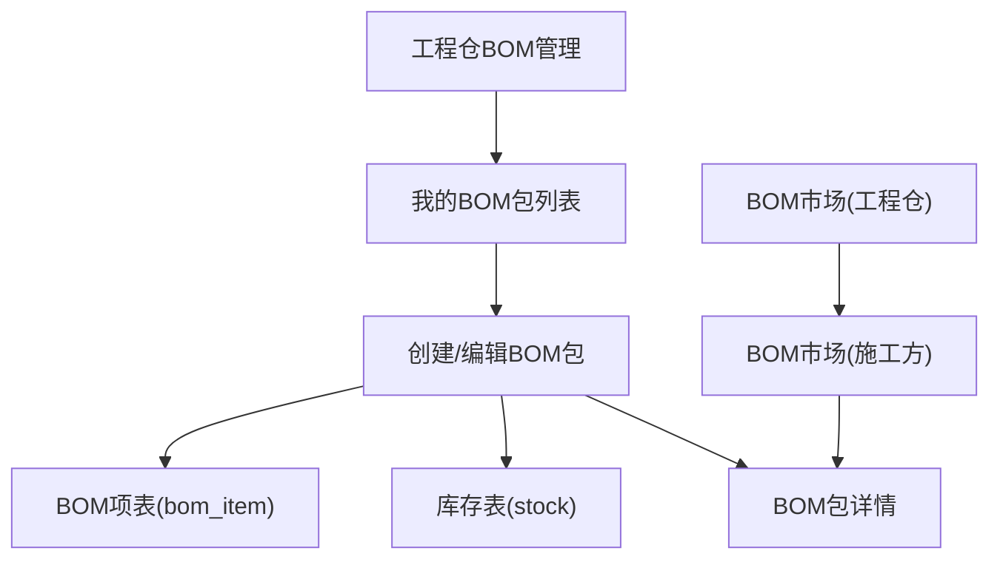

# BOM基装包管理

<cite>
**本文引用的文件**
- [apps/pc/src/views/warehouse/bom-manage/index.vue](file://apps/pc/src/views/warehouse/bom-manage/index.vue)
- [apps/pc/src/views/warehouse/my-bom/index.vue](file://apps/pc/src/views/warehouse/my-bom/index.vue)
- [apps/pc/src/views/warehouse/my-bom/create.vue](file://apps/pc/src/views/warehouse/my-bom/create.vue)
- [apps/pc/src/views/warehouse/my-bom/detail.vue](file://apps/pc/src/views/warehouse/my-bom/detail.vue)
- [apps/pc/src/views/warehouse/market/bom/index.vue](file://apps/pc/src/views/warehouse/market/bom/index.vue)
- [apps/mp/src/pages/market/bom.vue](file://apps/mp/src/pages/market/bom.vue)
- [apps/mp/src/pages/market/bom-detail.vue](file://apps/mp/src/pages/market/bom-detail.vue)
- [apps/pc/src/views/market/bom/index.vue](file://apps/pc/src/views/market/bom/index.vue)
- [apps/pc/src/views/market/bom/detail.vue](file://apps/pc/src/views/market/bom/detail.vue)
- [docs/PRD/03-数据模型与表结构.md](file://docs/PRD/03-数据模型与表结构.md)
</cite>

## 目录
1. [引言](#引言)
2. [项目结构](#项目结构)
3. [核心组件](#核心组件)
4. [架构总览](#架构总览)
5. [详细组件分析](#详细组件分析)
6. [依赖关系分析](#依赖关系分析)
7. [性能考虑](#性能考虑)
8. [故障排查指南](#故障排查指南)
9. [结论](#结论)
10. [附录](#附录)

## 引言
本文件围绕“BOM基装包管理”功能，系统化梳理BOM包在工程仓侧的创建、编辑、详情展示、定价与上架、权限配置与审核机制，并结合移动端与PC端的交互界面，给出商品组合逻辑、价格计算方式、库存管理策略、权限控制机制及版本管理建议。文档同时提供建筑行业典型场景的落地示例，帮助读者快速理解并实施。

## 项目结构
BOM基装包管理涉及多端界面与模块：
- 工程仓后台管理：BOM包列表、创建、详情、定价与上下架、平台BOM同步与导入
- 施工方市场：BOM包市场页、详情页、下单流程
- 移动端小程序：BOM包浏览、筛选、加入购物车
- 数据模型：BOM包、BOM项、库存等核心表结构



图表来源
- [apps/pc/src/views/warehouse/bom-manage/index.vue](file://apps/pc/src/views/warehouse/bom-manage/index.vue)
- [apps/pc/src/views/warehouse/my-bom/index.vue](file://apps/pc/src/views/warehouse/my-bom/index.vue)
- [apps/pc/src/views/warehouse/my-bom/create.vue](file://apps/pc/src/views/warehouse/my-bom/create.vue)
- [apps/pc/src/views/warehouse/my-bom/detail.vue](file://apps/pc/src/views/warehouse/my-bom/detail.vue)
- [apps/pc/src/views/warehouse/market/bom/index.vue](file://apps/pc/src/views/warehouse/market/bom/index.vue)
- [apps/pc/src/views/market/bom/index.vue](file://apps/pc/src/views/market/bom/index.vue)
- [apps/pc/src/views/market/bom/detail.vue](file://apps/pc/src/views/market/bom/detail.vue)
- [apps/mp/src/pages/market/bom.vue](file://apps/mp/src/pages/market/bom.vue)
- [apps/mp/src/pages/market/bom-detail.vue](file://apps/mp/src/pages/market/bom-detail.vue)
- [docs/PRD/03-数据模型与表结构.md](file://docs/PRD/03-数据模型与表结构.md)

章节来源
- [apps/pc/src/views/warehouse/bom-manage/index.vue](file://apps/pc/src/views/warehouse/bom-manage/index.vue)
- [apps/pc/src/views/warehouse/my-bom/index.vue](file://apps/pc/src/views/warehouse/my-bom/index.vue)
- [apps/pc/src/views/warehouse/my-bom/create.vue](file://apps/pc/src/views/warehouse/my-bom/create.vue)
- [apps/pc/src/views/warehouse/my-bom/detail.vue](file://apps/pc/src/views/warehouse/my-bom/detail.vue)
- [apps/pc/src/views/warehouse/market/bom/index.vue](file://apps/pc/src/views/warehouse/market/bom/index.vue)
- [apps/pc/src/views/market/bom/index.vue](file://apps/pc/src/views/market/bom/index.vue)
- [apps/pc/src/views/market/bom/detail.vue](file://apps/pc/src/views/market/bom/detail.vue)
- [apps/mp/src/pages/market/bom.vue](file://apps/mp/src/pages/market/bom.vue)
- [apps/mp/src/pages/market/bom-detail.vue](file://apps/mp/src/pages/market/bom-detail.vue)
- [docs/PRD/03-数据模型与表结构.md](file://docs/PRD/03-数据模型与表结构.md)

## 核心组件
- 工程仓BOM管理：平台BOM包导入、自建BOM包管理、定价与上架、状态切换、删除
- 我的BOM包：BOM包列表、复制、上下架、删除
- 创建/编辑BOM包：分步向导（基本信息/SKU明细/价格设置）、从平台BOM导入、草稿保存与提交
- BOM包详情：基本信息、价格信息、SKU明细、销售统计、上架/下架
- 市场BOM：工程仓侧BOM市场页；施工方侧BOM市场页与详情页
- 移动端BOM：BOM包列表、筛选、加入购物车

章节来源
- [apps/pc/src/views/warehouse/bom-manage/index.vue](file://apps/pc/src/views/warehouse/bom-manage/index.vue)
- [apps/pc/src/views/warehouse/my-bom/index.vue](file://apps/pc/src/views/warehouse/my-bom/index.vue)
- [apps/pc/src/views/warehouse/my-bom/create.vue](file://apps/pc/src/views/warehouse/my-bom/create.vue)
- [apps/pc/src/views/warehouse/my-bom/detail.vue](file://apps/pc/src/views/warehouse/my-bom/detail.vue)
- [apps/pc/src/views/warehouse/market/bom/index.vue](file://apps/pc/src/views/warehouse/market/bom/index.vue)
- [apps/pc/src/views/market/bom/index.vue](file://apps/pc/src/views/market/bom/index.vue)
- [apps/pc/src/views/market/bom/detail.vue](file://apps/pc/src/views/market/bom/detail.vue)
- [apps/mp/src/pages/market/bom.vue](file://apps/mp/src/pages/market/bom.vue)
- [apps/mp/src/pages/market/bom-detail.vue](file://apps/mp/src/pages/market/bom-detail.vue)

## 架构总览
BOM基装包管理采用“工程仓后台+施工方市场+移动端”的多端协同架构。工程仓负责BOM包的创建、编辑、定价与上架；施工方市场负责展示与购买；移动端提供便捷浏览与下单入口。数据层以BOM项表与库存表为核心，支撑SKU组合、价格计算与库存扣减。



图表来源
- [apps/pc/src/views/warehouse/bom-manage/index.vue](file://apps/pc/src/views/warehouse/bom-manage/index.vue)
- [apps/pc/src/views/warehouse/my-bom/index.vue](file://apps/pc/src/views/warehouse/my-bom/index.vue)
- [apps/pc/src/views/warehouse/my-bom/create.vue](file://apps/pc/src/views/warehouse/my-bom/create.vue)
- [apps/pc/src/views/warehouse/market/bom/index.vue](file://apps/pc/src/views/warehouse/market/bom/index.vue)
- [apps/pc/src/views/market/bom/index.vue](file://apps/pc/src/views/market/bom/index.vue)
- [apps/mp/src/pages/market/bom.vue](file://apps/mp/src/pages/market/bom.vue)

## 详细组件分析

### 工程仓BOM管理（平台BOM导入与定价）
- 功能要点
  - 平台BOM包导入：支持按关键字与分类筛选，勾选后批量导入为自有BOM包
  - 定价与上架：设置销售价、利润预估、是否上架到施工方市场
  - 状态管理：启用/停用、删除、同步平台策略
- 关键流程
  - 导入平台BOM：校验未添加的BOM，映射字段并插入本地列表
  - 定价确认：校验销售价，更新BOM状态与上架标记
  - 上架前置检查：若未定价则禁止上架



图表来源
- [apps/pc/src/views/warehouse/bom-manage/index.vue](file://apps/pc/src/views/warehouse/bom-manage/index.vue)

章节来源
- [apps/pc/src/views/warehouse/bom-manage/index.vue](file://apps/pc/src/views/warehouse/bom-manage/index.vue)

### 我的BOM包（列表、复制、上下架）
- 功能要点
  - 列表展示：名称、分类、SKU数量、售价、销量、上架状态、推送时间
  - 复制：弹窗确认，复制后可继续编辑SKU与价格
  - 上下架：平台来源BOM不可直接修改上架状态
  - 删除：非平台来源BOM支持删除
- 关键流程
  - 复制：携带原BOM数据，跳转创建页并标记来源
  - 上下架：根据状态变更消息提示

```mermaid
sequenceDiagram
participant List as "BOM列表"
participant Copy as "复制弹窗"
participant Create as "创建页"
participant Detail as "详情页"
List->>Copy : 点击复制
Copy-->>Create : 跳转并传入copyFrom参数
Create->>Create : 加载复制数据并可编辑
Create-->>Detail : 保存后跳转详情
```

图表来源
- [apps/pc/src/views/warehouse/my-bom/index.vue](file://apps/pc/src/views/warehouse/my-bom/index.vue)
- [apps/pc/src/views/warehouse/my-bom/create.vue](file://apps/pc/src/views/warehouse/my-bom/create.vue)
- [apps/pc/src/views/warehouse/my-bom/detail.vue](file://apps/pc/src/views/warehouse/my-bom/detail.vue)

章节来源
- [apps/pc/src/views/warehouse/my-bom/index.vue](file://apps/pc/src/views/warehouse/my-bom/index.vue)
- [apps/pc/src/views/warehouse/my-bom/create.vue](file://apps/pc/src/views/warehouse/my-bom/create.vue)
- [apps/pc/src/views/warehouse/my-bom/detail.vue](file://apps/pc/src/views/warehouse/my-bom/detail.vue)

### 创建/编辑BOM包（分步向导与价格策略）
- 功能要点
  - 分步向导：基本信息（名称、类型、分类、图片、描述）→ SKU明细（添加/导入/移除、单价/数量/小计/必选）→ 价格设置（固定/动态、加价模式、预估毛利）
  - 从平台BOM导入：弹窗选择平台BOM，批量导入其SKU明细
  - 草稿保存与提交：支持保存草稿与保存并上架
- 关键流程
  - 步骤校验：基本信息与SKU明细必填
  - 价格策略：固定价格需设置销售价；动态价格支持按比例或固定金额加价
  - 总成本与毛利：基于SKU小计实时计算



图表来源
- [apps/pc/src/views/warehouse/my-bom/create.vue](file://apps/pc/src/views/warehouse/my-bom/create.vue)

章节来源
- [apps/pc/src/views/warehouse/my-bom/create.vue](file://apps/pc/src/views/warehouse/my-bom/create.vue)

### BOM包详情（信息、SKU明细、销售统计）
- 功能要点
  - 基本信息：名称、类型、分类、来源、创建/更新时间
  - 价格信息：价格策略、成本预估、销售价格、毛利率
  - SKU明细：商品名称、规格、供应商、单价/数量/小计/是否必选
  - 销售统计：总销量、销售额、收藏数、好评率
  - 上架/下架：根据状态显示对应按钮
- 关键流程
  - 上架/下架：二次确认弹窗，成功后更新状态并提示



图表来源
- [apps/pc/src/views/warehouse/my-bom/detail.vue](file://apps/pc/src/views/warehouse/my-bom/detail.vue)

章节来源
- [apps/pc/src/views/warehouse/my-bom/detail.vue](file://apps/pc/src/views/warehouse/my-bom/detail.vue)

### 市场BOM（工程仓市场与施工方市场）
- 工程仓市场
  - 分类树、搜索、排序（综合/销量/价格升降序）
  - BOM卡片：图片、名称、描述、SKU数量、销量、价格、标签
- 施工方市场
  - 详情页：基本信息、SKU明细、价格信息、审核记录等
- 移动端市场
  - 列表：搜索、筛选（平台/自定义）、主要商品标签、参考总价、供应商
  - 详情：材料清单、全选/数量调整、加入购物车



图表来源
- [apps/pc/src/views/warehouse/market/bom/index.vue](file://apps/pc/src/views/warehouse/market/bom/index.vue)
- [apps/pc/src/views/market/bom/index.vue](file://apps/pc/src/views/market/bom/index.vue)
- [apps/pc/src/views/market/bom/detail.vue](file://apps/pc/src/views/market/bom/detail.vue)
- [apps/mp/src/pages/market/bom.vue](file://apps/mp/src/pages/market/bom.vue)
- [apps/mp/src/pages/market/bom-detail.vue](file://apps/mp/src/pages/market/bom-detail.vue)

章节来源
- [apps/pc/src/views/warehouse/market/bom/index.vue](file://apps/pc/src/views/warehouse/market/bom/index.vue)
- [apps/pc/src/views/market/bom/index.vue](file://apps/pc/src/views/market/bom/index.vue)
- [apps/pc/src/views/market/bom/detail.vue](file://apps/pc/src/views/market/bom/detail.vue)
- [apps/mp/src/pages/market/bom.vue](file://apps/mp/src/pages/market/bom.vue)
- [apps/mp/src/pages/market/bom-detail.vue](file://apps/mp/src/pages/market/bom-detail.vue)

## 依赖关系分析
- 组件耦合
  - “我的BOM包”与“创建/编辑”强关联，编辑时可复制平台BOM数据
  - “工程仓BOM管理”与“我的BOM包”双向联动：导入平台BOM即生成自有BOM
  - “详情页”依赖“创建/编辑”阶段的数据结构，保持一致的SKU与价格字段
- 外部依赖
  - 数据模型：BOM项表与库存表支撑SKU组合与库存扣减
  - 权限与审核：详情页预留权限配置与审核记录字段，便于扩展



图表来源
- [apps/pc/src/views/warehouse/my-bom/create.vue](file://apps/pc/src/views/warehouse/my-bom/create.vue)
- [apps/pc/src/views/warehouse/my-bom/detail.vue](file://apps/pc/src/views/warehouse/my-bom/detail.vue)
- [apps/pc/src/views/warehouse/my-bom/index.vue](file://apps/pc/src/views/warehouse/my-bom/index.vue)
- [apps/pc/src/views/warehouse/bom-manage/index.vue](file://apps/pc/src/views/warehouse/bom-manage/index.vue)
- [apps/pc/src/views/warehouse/market/bom/index.vue](file://apps/pc/src/views/warehouse/market/bom/index.vue)
- [apps/pc/src/views/market/bom/index.vue](file://apps/pc/src/views/market/bom/index.vue)
- [apps/pc/src/views/market/bom/detail.vue](file://apps/pc/src/views/market/bom/detail.vue)
- [docs/PRD/03-数据模型与表结构.md](file://docs/PRD/03-数据模型与表结构.md)

章节来源
- [apps/pc/src/views/warehouse/my-bom/create.vue](file://apps/pc/src/views/warehouse/my-bom/create.vue)
- [apps/pc/src/views/warehouse/my-bom/detail.vue](file://apps/pc/src/views/warehouse/my-bom/detail.vue)
- [apps/pc/src/views/warehouse/my-bom/index.vue](file://apps/pc/src/views/warehouse/my-bom/index.vue)
- [apps/pc/src/views/warehouse/bom-manage/index.vue](file://apps/pc/src/views/warehouse/bom-manage/index.vue)
- [apps/pc/src/views/warehouse/market/bom/index.vue](file://apps/pc/src/views/warehouse/market/bom/index.vue)
- [apps/pc/src/views/market/bom/index.vue](file://apps/pc/src/views/market/bom/index.vue)
- [apps/pc/src/views/market/bom/detail.vue](file://apps/pc/src/views/market/bom/detail.vue)
- [docs/PRD/03-数据模型与表结构.md](file://docs/PRD/03-数据模型与表结构.md)

## 性能考虑
- 列表渲染优化
  - 使用虚拟滚动与分页，避免一次性渲染大量BOM卡片
  - 对SKU明细表格使用懒加载与行内编辑，减少重绘
- 计算开销
  - 价格与毛利计算在前端实时完成，建议缓存SKU小计，仅在变更时重算
- 网络请求
  - 平台BOM导入采用分页与选择器，避免一次性拉取过多数据
- 图片与资源
  - 使用缩略图与懒加载，移动端详情页图片按需加载

## 故障排查指南
- 平台BOM导入失败
  - 现象：导入后无新增BOM或提示已添加
  - 排查：确认所选BOM未被标记为“已添加”，检查导入映射字段
- 定价失败
  - 现象：无法设置销售价或上架失败
  - 排查：确认销售价非空；若尝试上架，需先设置销售价
- 上下架异常
  - 现象：平台来源BOM无法直接修改上架状态
  - 排查：平台来源BOM受控，需通过复制或重新创建
- 移动端加入购物车
  - 现象：未选择任何商品
  - 排查：确保至少选择一种材料并设置数量

章节来源
- [apps/pc/src/views/warehouse/bom-manage/index.vue](file://apps/pc/src/views/warehouse/bom-manage/index.vue)
- [apps/pc/src/views/warehouse/my-bom/index.vue](file://apps/pc/src/views/warehouse/my-bom/index.vue)
- [apps/pc/src/views/warehouse/my-bom/create.vue](file://apps/pc/src/views/warehouse/my-bom/create.vue)
- [apps/pc/src/views/warehouse/my-bom/detail.vue](file://apps/pc/src/views/warehouse/my-bom/detail.vue)
- [apps/mp/src/pages/market/bom-detail.vue](file://apps/mp/src/pages/market/bom-detail.vue)

## 结论
BOM基装包管理通过工程仓后台的标准化流程与多端协同，实现了从平台BOM导入、自建BOM编辑、定价与上架到施工方市场的完整闭环。结合SKU组合、价格策略与库存模型，能够满足建筑行业多样化的装修套餐与成本核算需求。建议在后续迭代中完善权限配置与审核流程，强化版本管理与批量操作能力，持续提升用户体验与运营效率。

## 附录

### 商品组合逻辑与价格计算
- 商品组合逻辑
  - BOM由多个SKU组成，每个SKU包含单价、数量、是否必选等属性
  - 固定价格：销售价格为固定值；动态价格：按比例或固定金额加价
- 价格计算
  - 成本预估：SKU单价×数量之和
  - 销售价格：固定价格或动态计算
  - 毛利率：(销售价格-成本)/成本×100%

章节来源
- [apps/pc/src/views/warehouse/my-bom/create.vue](file://apps/pc/src/views/warehouse/my-bom/create.vue)
- [apps/pc/src/views/warehouse/my-bom/detail.vue](file://apps/pc/src/views/warehouse/my-bom/detail.vue)

### 库存管理策略
- 库存表(stock)用于记录各仓库SKU的可用数量、锁定数量与成本
- BOM项表(bom_item)用于记录BOM与SKU的组合关系与数量
- 建议在下单与出库环节进行库存扣减与锁定，防止超卖

章节来源
- [docs/PRD/03-数据模型与表结构.md](file://docs/PRD/03-数据模型与表结构.md)

### 权限控制与审核机制
- 权限配置
  - 可见工程仓：支持按工程仓维度控制BOM包可见范围
- 审核机制
  - 详情页预留审核记录字段，支持记录操作动作、时间、操作人与备注
- 版本管理
  - 建议引入BOM版本号与变更历史，支持回滚与对比

章节来源
- [apps/pc/src/views/market/bom/detail.vue](file://apps/pc/src/views/market/bom/detail.vue)
- [apps/pc/src/views/market/bom/index.vue](file://apps/pc/src/views/market/bom/index.vue)

### 实际应用案例
- 不同装修套餐的组合
  - 标准两居室/三居室基装包：按面积区间推荐SKU组合
  - 商业办公基装包：按空间用途划分材料清单
- 材料清单生成与成本核算
  - 移动端详情页支持全选与数量调整，实时计算总价
  - 工程仓详情页提供SKU明细与销售统计，辅助成本分析

章节来源
- [apps/mp/src/pages/market/bom.vue](file://apps/mp/src/pages/market/bom.vue)
- [apps/mp/src/pages/market/bom-detail.vue](file://apps/mp/src/pages/market/bom-detail.vue)
- [apps/pc/src/views/warehouse/my-bom/detail.vue](file://apps/pc/src/views/warehouse/my-bom/detail.vue)