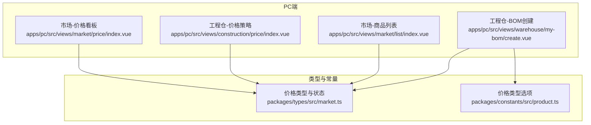
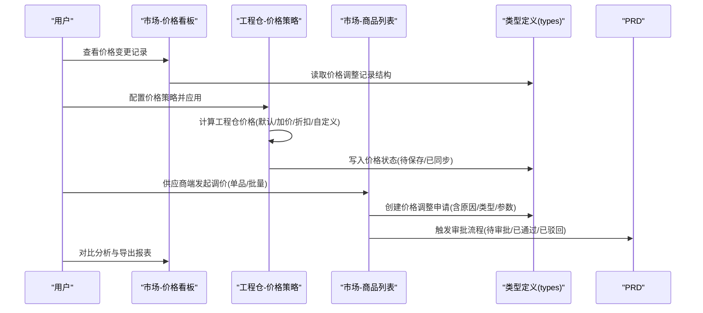
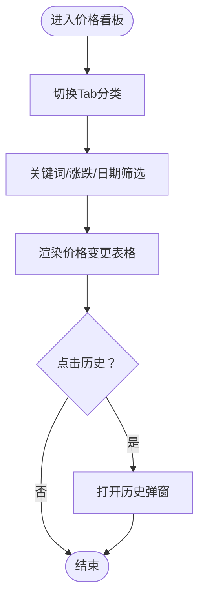
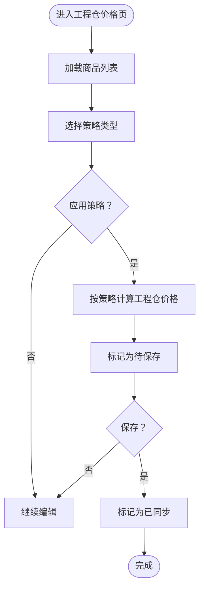
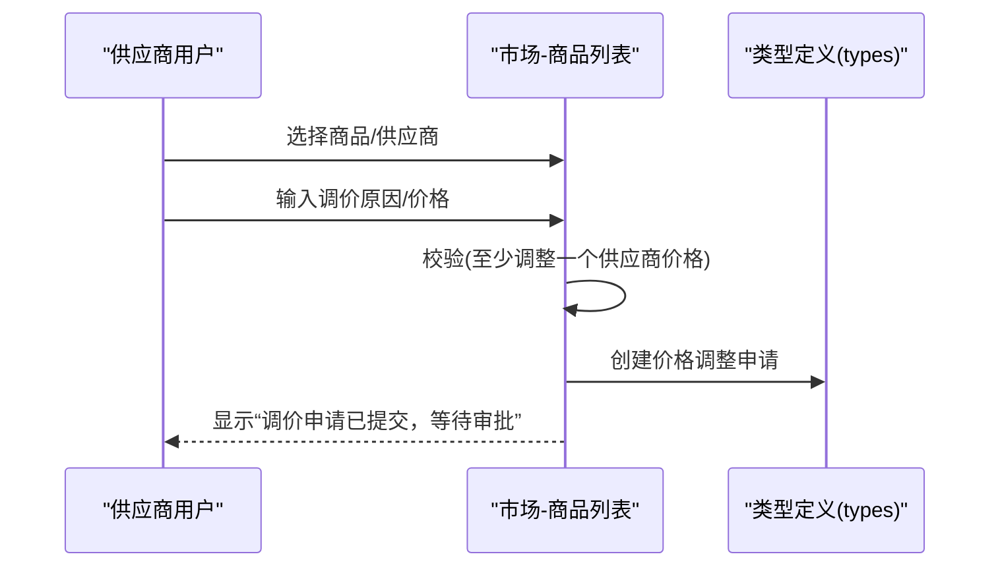
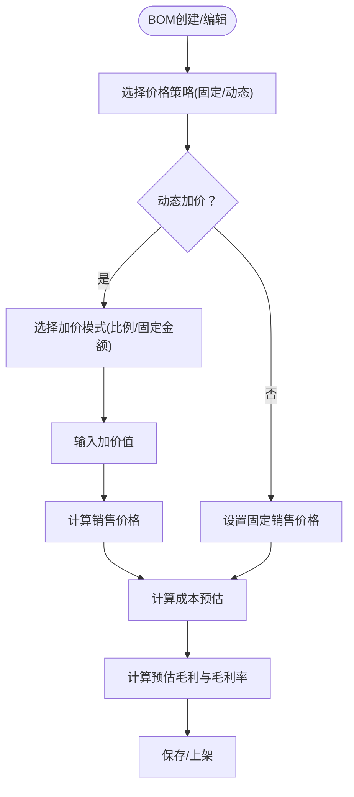
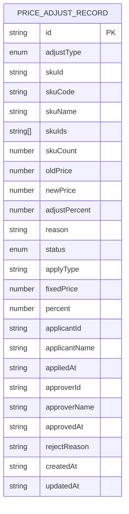

# 价格管理

<cite>
**本文引用的文件**
- [apps/pc/src/views/market/price/index.vue](file://apps/pc/src/views/market/price/index.vue)
- [apps/pc/src/views/construction/price/index.vue](file://apps/pc/src/views/construction/price/index.vue)
- [apps/pc/src/views/market/list/index.vue](file://apps/pc/src/views/market/list/index.vue)
- [packages/types/src/market.ts](file://packages/types/src/market.ts)
- [packages/constants/src/product.ts](file://packages/constants/src/product.ts)
- [apps/pc/src/views/warehouse/my-bom/create.vue](file://apps/pc/src/views/warehouse/my-bom/create.vue)
- [docs/PRD/02-业务流程设计.md](file://docs/PRD/02-业务流程设计.md)
</cite>

## 目录
1. [简介](#简介)
2. [项目结构](#项目结构)
3. [核心组件](#核心组件)
4. [架构总览](#架构总览)
5. [详细组件分析](#详细组件分析)
6. [依赖分析](#依赖分析)
7. [性能考虑](#性能考虑)
8. [故障排查指南](#故障排查指南)
9. [结论](#结论)
10. [附录](#附录)

## 简介
本文件围绕“价格管理”主题，系统梳理平台端、供应商端、工程仓端、施工方端在价格策略配置、批量价格调整、价格历史记录、价格对比分析等方面的前端实现与交互设计，并结合类型定义与PRD文档，给出价格计算公式、生效机制、审批流程、权限差异、模板与促销配置、价格同步机制等技术要点与最佳实践建议。文档同时覆盖数据模型、缓存策略、性能优化与异常处理方案，帮助读者快速理解与落地价格管理能力。

## 项目结构
价格管理相关页面主要分布在PC端的市场与工程仓模块，配合类型与常量定义，形成统一的数据契约与界面交互：

- 市场端价格看板与历史记录：用于查看平台标准价、供应商商品、工程仓商品的价格变更情况与历史轨迹
- 工程仓端价格策略与批量应用：支持默认/加价/折扣/自定义策略，批量应用与保存
- 供应商端价格调整：支持单品与批量调价申请，含审批状态
- BOM包价格策略：固定价格或动态加价模式，支持预估成本与利润计算
- 类型与常量：统一描述价格调整记录、状态枚举、价格类型选项

图表来源
- [apps/pc/src/views/market/price/index.vue:1-548](file://apps/pc/src/views/market/price/index.vue#L1-L548)
- [apps/pc/src/views/construction/price/index.vue:1-345](file://apps/pc/src/views/construction/price/index.vue#L1-L345)
- [apps/pc/src/views/market/list/index.vue:1450-1649](file://apps/pc/src/views/market/list/index.vue#L1450-L1649)
- [apps/pc/src/views/warehouse/my-bom/create.vue:150-349](file://apps/pc/src/views/warehouse/my-bom/create.vue#L150-L349)
- [packages/types/src/market.ts:1-212](file://packages/types/src/market.ts#L1-L212)
- [packages/constants/src/product.ts:1-26](file://packages/constants/src/product.ts#L1-L26)

章节来源
- [apps/pc/src/views/market/price/index.vue:1-548](file://apps/pc/src/views/market/price/index.vue#L1-L548)
- [apps/pc/src/views/construction/price/index.vue:1-345](file://apps/pc/src/views/construction/price/index.vue#L1-L345)
- [apps/pc/src/views/market/list/index.vue:1450-1649](file://apps/pc/src/views/market/list/index.vue#L1450-L1649)
- [apps/pc/src/views/warehouse/my-bom/create.vue:150-349](file://apps/pc/src/views/warehouse/my-bom/create.vue#L150-L349)
- [packages/types/src/market.ts:1-212](file://packages/types/src/market.ts#L1-L212)
- [packages/constants/src/product.ts:1-26](file://packages/constants/src/product.ts#L1-L26)

## 核心组件
- 市场端价格看板与历史记录
  - 提供“全部变更/平台标准价调整/供应商商品调价/工程仓售价调整”的Tab切换
  - 支持关键词、涨跌筛选、日期范围筛选
  - 展示商品编码、规格、原价、现价、调价幅度、操作人、变更时间
  - 支持查看某商品的历史调价明细弹窗
- 工程仓端价格策略与批量应用
  - 策略类型：默认价格、加价策略（固定金额/百分比）、折扣策略、自定义价格
  - 应用策略后标记为“待保存”，保存后标记为“已同步”
  - 支持按关键字与分类过滤，分页展示
- 供应商端价格调整
  - 单品调价：输入调价原因，校验至少调整一个供应商价格，提交后置为“待审批”
  - 批量调价：选择商品，设置固定价或百分比调整，提交后批量置为“待审批”
- BOM包价格策略
  - 固定价格或动态加价（按比例/固定金额），实时计算成本与预估毛利
  - 支持从平台BOM导入SKU明细

章节来源
- [apps/pc/src/views/market/price/index.vue:36-140](file://apps/pc/src/views/market/price/index.vue#L36-L140)
- [apps/pc/src/views/construction/price/index.vue:16-126](file://apps/pc/src/views/construction/price/index.vue#L16-L126)
- [apps/pc/src/views/market/list/index.vue:1452-1534](file://apps/pc/src/views/market/list/index.vue#L1452-L1534)
- [apps/pc/src/views/warehouse/my-bom/create.vue:154-182](file://apps/pc/src/views/warehouse/my-bom/create.vue#L154-L182)

## 架构总览
价格管理涉及“策略配置—批量调整—审批—生效—记录—对比分析”的闭环流程。前端通过视图组件承载交互，类型定义承载数据契约，PRD文档明确业务规则与流程。

图表来源
- [apps/pc/src/views/market/price/index.vue:36-140](file://apps/pc/src/views/market/price/index.vue#L36-L140)
- [apps/pc/src/views/construction/price/index.vue:21-126](file://apps/pc/src/views/construction/price/index.vue#L21-L126)
- [apps/pc/src/views/market/list/index.vue:1452-1534](file://apps/pc/src/views/market/list/index.vue#L1452-L1534)
- [packages/types/src/market.ts:77-119](file://packages/types/src/market.ts#L77-L119)
- [docs/PRD/02-业务流程设计.md:349-379](file://docs/PRD/02-业务流程设计.md#L349-L379)

## 详细组件分析

### 市场端价格看板与历史记录
- 功能要点
  - Tab分类：全部变更、平台标准价调整、供应商商品调价、工程仓售价调整
  - 筛选：关键词搜索（商品名称/SKU）、涨跌筛选、日期范围
  - 表格列：变更来源（Tag颜色区分）、商品信息（名称/编码/规格）、所属主体、原价/现价、调价幅度、操作人、变更时间
  - 历史弹窗：展示某商品的历次调价记录（时间、原价、现价、幅度、原因、操作人）
- 权限矩阵（示意）
  - 平台定价员：设置平台标准价、查看历史、导出报表
  - 供应商：供应商商品调价、查看历史
  - 工程仓：工程仓售价调整、查看历史
  - 只读：查看历史

图表来源
- [apps/pc/src/views/market/price/index.vue:36-140](file://apps/pc/src/views/market/price/index.vue#L36-L140)
- [apps/pc/src/views/market/price/index.vue:451-472](file://apps/pc/src/views/market/price/index.vue#L451-L472)

章节来源
- [apps/pc/src/views/market/price/index.vue:36-140](file://apps/pc/src/views/market/price/index.vue#L36-L140)
- [apps/pc/src/views/market/price/index.vue:451-472](file://apps/pc/src/views/market/price/index.vue#L451-L472)

### 工程仓端价格策略与批量应用
- 功能要点
  - 策略类型：默认价格（使用市场价）、加价策略（固定金额/百分比）、折扣策略、自定义价格
  - 应用策略：批量计算工程仓价格，标记为“待保存”
  - 保存价格：批量标记为“已同步”
  - 过滤与分页：按关键字与分类过滤，分页展示
- 计算公式
  - 默认价格：工程仓价格 = 供货价
  - 加价策略（固定金额）：工程仓价格 = 供货价 + 加价值
  - 加价策略（百分比）：工程仓价格 = 供货价 × (1 + 加价百分比/100)
  - 折扣策略：工程仓价格 = 供货价 × 折扣率/100
  - 自定义价格：可直接编辑（仅在策略为自定义时启用）

图表来源
- [apps/pc/src/views/construction/price/index.vue:21-126](file://apps/pc/src/views/construction/price/index.vue#L21-L126)
- [apps/pc/src/views/construction/price/index.vue:261-289](file://apps/pc/src/views/construction/price/index.vue#L261-L289)

章节来源
- [apps/pc/src/views/construction/price/index.vue:21-126](file://apps/pc/src/views/construction/price/index.vue#L21-L126)
- [apps/pc/src/views/construction/price/index.vue:261-289](file://apps/pc/src/views/construction/price/index.vue#L261-L289)

### 供应商端价格调整（单品与批量）
- 单品调价
  - 输入调价原因，校验至少调整一个供应商价格，提交后置为“待审批”
- 批量调价
  - 选择多个商品，设置固定价或百分比调整，提交后批量置为“待审批”
- 审批流程
  - 申请 → 待审批 → 审批通过/驳回 → 生效

图表来源
- [apps/pc/src/views/market/list/index.vue:1452-1534](file://apps/pc/src/views/market/list/index.vue#L1452-L1534)
- [packages/types/src/market.ts:104-119](file://packages/types/src/market.ts#L104-L119)

章节来源
- [apps/pc/src/views/market/list/index.vue:1452-1534](file://apps/pc/src/views/market/list/index.vue#L1452-L1534)
- [packages/types/src/market.ts:104-119](file://packages/types/src/market.ts#L104-L119)

### BOM包价格策略与成本/利润计算
- 价格策略
  - 固定价格：直接设置销售价格
  - 动态加价：按比例或固定金额加价，实时计算销售价格
- 成本与利润
  - 成本预估：SKU单价 × 数量求和
  - 预估毛利：销售价格 − 成本预估
  - 毛利率：(预估毛利 / 成本预估) × 100%

图表来源
- [apps/pc/src/views/warehouse/my-bom/create.vue:154-182](file://apps/pc/src/views/warehouse/my-bom/create.vue#L154-L182)
- [apps/pc/src/views/warehouse/my-bom/create.vue:258-267](file://apps/pc/src/views/warehouse/my-bom/create.vue#L258-L267)

章节来源
- [apps/pc/src/views/warehouse/my-bom/create.vue:154-182](file://apps/pc/src/views/warehouse/my-bom/create.vue#L154-L182)
- [apps/pc/src/views/warehouse/my-bom/create.vue:258-267](file://apps/pc/src/views/warehouse/my-bom/create.vue#L258-L267)

## 依赖分析
- 类型与状态
  - 价格调整记录结构：包含调整类型、SKU信息、原价/新价、调价幅度、状态、申请人/审批人、时间戳等
  - 价格调整状态枚举：待审批、已通过、已驳回
  - 价格调整类型枚举：单品调价、批量调价
- 价格类型选项
  - 基础价格、批发价格、零售价格、客户价格、促销价格
- 业务流程
  - 价格体系：供货价格（Supplier）→ 市场价格（Market）→ 销售价格（Sale）
  - 适用场景：工程仓采购、平台参考价、施工方采购

图表来源
- [packages/types/src/market.ts:77-102](file://packages/types/src/market.ts#L77-L102)

章节来源
- [packages/types/src/market.ts:7-11](file://packages/types/src/market.ts#L7-L11)
- [packages/types/src/market.ts:196-205](file://packages/types/src/market.ts#L196-L205)
- [packages/constants/src/product.ts:19-25](file://packages/constants/src/product.ts#L19-L25)
- [docs/PRD/02-业务流程设计.md:349-379](file://docs/PRD/02-业务流程设计.md#L349-L379)

## 性能考虑
- 前端渲染优化
  - 使用虚拟滚动/分页减少一次性渲染的数据量（如工程仓价格列表、市场价格变更记录）
  - 表格列宽与对齐策略避免重排抖动
- 计算优化
  - 策略计算在本地进行，批量应用后一次性更新状态，减少多次重绘
  - 动态加价计算在输入变更时即时计算，避免无效重算
- 缓存策略
  - 价格策略与SKU列表可在会话期间缓存，减少重复请求
  - 历史弹窗数据按需加载，避免初始渲染压力
- 异步与节流
  - 搜索与筛选采用防抖，降低频繁查询带来的UI卡顿
  - 批量操作提交采用节流，避免重复提交

## 故障排查指南
- 供应商端调价失败
  - 症状：提交后无提示或状态未更新
  - 排查：确认调价原因非空；至少有一个供应商价格发生变更；检查网络状态与消息提示
  - 参考路径：[apps/pc/src/views/market/list/index.vue:1452-1487](file://apps/pc/src/views/market/list/index.vue#L1452-L1487)
- 工程仓价格未生效
  - 症状：应用策略后仍为“待保存”
  - 排查：确认已点击“保存价格”；检查策略类型是否允许编辑（自定义策略才可编辑）
  - 参考路径：[apps/pc/src/views/construction/price/index.vue:284-289](file://apps/pc/src/views/construction/price/index.vue#L284-L289)
- 历史弹窗为空
  - 症状：点击“历史”后弹窗无数据
  - 排查：确认当前商品存在历史记录；检查弹窗数据绑定逻辑
  - 参考路径：[apps/pc/src/views/market/price/index.vue:451-472](file://apps/pc/src/views/market/price/index.vue#L451-L472)
- BOM包价格计算异常
  - 症状：成本/利润/毛利率显示不正确
  - 排查：确认SKU单价与数量；检查动态加价模式与加价值；核对固定价格设置
  - 参考路径：[apps/pc/src/views/warehouse/my-bom/create.vue:258-267](file://apps/pc/src/views/warehouse/my-bom/create.vue#L258-L267)

章节来源
- [apps/pc/src/views/market/list/index.vue:1452-1487](file://apps/pc/src/views/market/list/index.vue#L1452-L1487)
- [apps/pc/src/views/construction/price/index.vue:284-289](file://apps/pc/src/views/construction/price/index.vue#L284-L289)
- [apps/pc/src/views/market/price/index.vue:451-472](file://apps/pc/src/views/market/price/index.vue#L451-L472)
- [apps/pc/src/views/warehouse/my-bom/create.vue:258-267](file://apps/pc/src/views/warehouse/my-bom/create.vue#L258-L267)

## 结论
价格管理通过“策略配置—批量调整—审批—生效—记录—对比分析”的闭环，实现了平台、供应商、工程仓、施工方多端协同的价格治理。前端以视图组件承载交互，类型定义确保数据一致性，PRD明确了价格体系与流程规范。建议在生产环境中进一步完善后端接口对接、审批流可视化与价格生效的异步通知机制，持续优化前端性能与用户体验。

## 附录
- 价格体系与流程（摘自PRD）
  - 价格体系：供货价格（供应商）→ 市场价格（平台）→ 销售价格（工程仓/施工方）
  - 适用场景：工程仓向供应商采购、市场参考价、施工方向工程仓采购
- 价格类型选项（来自常量）
  - 基础价格、批发价格、零售价格、客户价格、促销价格

章节来源
- [docs/PRD/02-业务流程设计.md:349-379](file://docs/PRD/02-业务流程设计.md#L349-L379)
- [packages/constants/src/product.ts:19-25](file://packages/constants/src/product.ts#L19-L25)