# 供应商品市场

<cite>
**本文引用的文件**
- [apps/mp/src/pages/market/index.vue](file://apps/mp/src/pages/market/index.vue)
- [apps/mp/src/pages/cart/index.vue](file://apps/mp/src/pages/cart/index.vue)
- [apps/pc/src/views/market/list/index.vue](file://apps/pc/src/views/market/list/index.vue)
- [apps/pc/src/views/market/category/index.vue](file://apps/pc/src/views/market/category/index.vue)
- [apps/pc/src/views/market/price/index.vue](file://apps/pc/src/views/market/price/index.vue)
- [apps/pc/src/views/market/stock/index.vue](file://apps/pc/src/views/market/stock/index.vue)
- [apps/pc/src/views/order/detail/index.vue](file://apps/pc/src/views/order/detail/index.vue)
- [packages/types/src/market.ts](file://packages/types/src/market.ts)
- [packages/types/src/product.ts](file://packages/types/src/product.ts)
- [apps/pc/src/store/user.ts](file://apps/pc/src/store/user.ts)
- [docs/PRD/06-商品板块功能清单.md](file://docs/PRD/06-商品板块功能清单.md)
- [docs/PRD/02-业务流程设计.md](file://docs/PRD/02-业务流程设计.md)
</cite>

## 目录
1. [简介](#简介)
2. [项目结构](#项目结构)
3. [核心组件](#核心组件)
4. [架构总览](#架构总览)
5. [详细组件分析](#详细组件分析)
6. [依赖分析](#依赖分析)
7. [性能考虑](#性能考虑)
8. [故障排查指南](#故障排查指南)
9. [结论](#结论)
10. [附录](#附录)

## 简介
本文件面向“供应商品市场”功能，系统化梳理商品列表展示、搜索过滤、详情查看、购物车管理、分类管理、权限控制、库存联动、价格策略等核心能力，并结合业务流程与数据模型，给出可操作的流程图、数据模型图与异常处理建议。文档同时覆盖平台端与移动端两套界面实现，便于前后端协同开发与测试验证。

## 项目结构
供应商品市场功能主要分布在以下位置：
- 移动端（小程序）：商品市场、购物车、订单详情等页面
- PC端（管理后台）：商品市场管理、分类管理、价格管理、库存管理、订单详情等页面
- 类型定义：市场商品、价格调整、库存告警等类型定义
- 权限与用户：用户登录态、权限校验、菜单与路由

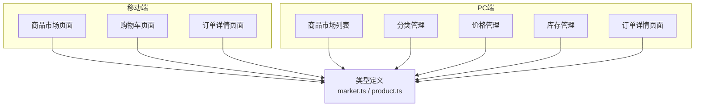

图表来源
- [apps/mp/src/pages/market/index.vue:1-800](file://apps/mp/src/pages/market/index.vue#L1-L800)
- [apps/mp/src/pages/cart/index.vue:1-332](file://apps/mp/src/pages/cart/index.vue#L1-L332)
- [apps/pc/src/views/market/list/index.vue:1-800](file://apps/pc/src/views/market/list/index.vue#L1-L800)
- [apps/pc/src/views/market/category/index.vue:1-549](file://apps/pc/src/views/market/category/index.vue#L1-L549)
- [apps/pc/src/views/market/price/index.vue:1-548](file://apps/pc/src/views/market/price/index.vue#L1-L548)
- [apps/pc/src/views/market/stock/index.vue:1-824](file://apps/pc/src/views/market/stock/index.vue#L1-L824)
- [packages/types/src/market.ts:1-212](file://packages/types/src/market.ts#L1-L212)
- [packages/types/src/product.ts:1-431](file://packages/types/src/product.ts#L1-L431)

章节来源
- [apps/mp/src/pages/market/index.vue:1-800](file://apps/mp/src/pages/market/index.vue#L1-L800)
- [apps/pc/src/views/market/list/index.vue:1-800](file://apps/pc/src/views/market/list/index.vue#L1-L800)
- [packages/types/src/market.ts:1-212](file://packages/types/src/market.ts#L1-L212)

## 核心组件
- 商品市场（移动端）：支持分类筛选、关键字搜索、价格/销量排序、供应商筛选、价格区间过滤、加入购物车等
- 商品市场（PC端）：支持四状态视图（全部/待上架/已上架/已下架）、导入商品、批量上架/下架/调价、设置可见工程仓、权限管理、价格历史查看
- 分类管理（PC端）：复用平台标准分类，支持分类可见性、排序、商品统计
- 价格管理（PC端）：价格调整记录、来源分类（平台/供应商/工程仓）、调价幅度筛选、历史查看
- 库存管理（PC端）：工程仓库存查询、安全库存设置、库存预警、快速补货
- 购物车（移动端）：按供应商分组、全选/反选、数量修改、合计计算、统一结算
- 订单详情（PC端/移动端）：订单状态、买卖双方信息、商品明细、金额统计

章节来源
- [apps/mp/src/pages/market/index.vue:1-800](file://apps/mp/src/pages/market/index.vue#L1-L800)
- [apps/mp/src/pages/cart/index.vue:1-332](file://apps/mp/src/pages/cart/index.vue#L1-L332)
- [apps/pc/src/views/market/list/index.vue:1-800](file://apps/pc/src/views/market/list/index.vue#L1-L800)
- [apps/pc/src/views/market/category/index.vue:1-549](file://apps/pc/src/views/market/category/index.vue#L1-L549)
- [apps/pc/src/views/market/price/index.vue:1-548](file://apps/pc/src/views/market/price/index.vue#L1-L548)
- [apps/pc/src/views/market/stock/index.vue:1-824](file://apps/pc/src/views/market/stock/index.vue#L1-L824)
- [apps/pc/src/views/order/detail/index.vue:67-96](file://apps/pc/src/views/order/detail/index.vue#L67-L96)

## 架构总览
供应商品市场贯穿“商品展示—搜索过滤—购物车—订单—库存—价格”的闭环，前端通过类型定义与权限体系保障一致性与安全性。

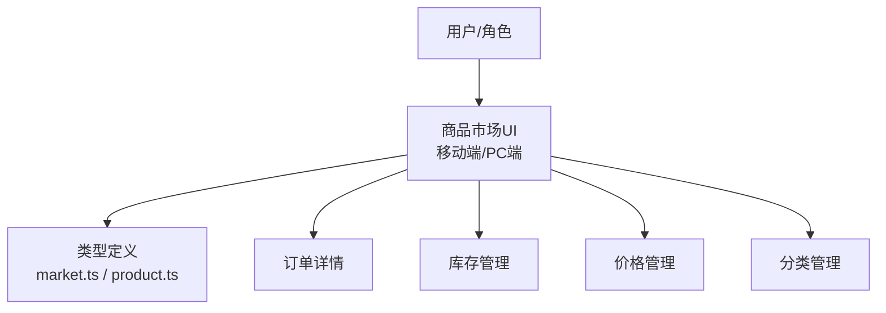

图表来源
- [packages/types/src/market.ts:1-212](file://packages/types/src/market.ts#L1-L212)
- [packages/types/src/product.ts:1-431](file://packages/types/src/product.ts#L1-L431)
- [apps/pc/src/views/order/detail/index.vue:67-96](file://apps/pc/src/views/order/detail/index.vue#L67-L96)
- [apps/pc/src/views/market/stock/index.vue:1-824](file://apps/pc/src/views/market/stock/index.vue#L1-L824)
- [apps/pc/src/views/market/price/index.vue:1-548](file://apps/pc/src/views/market/price/index.vue#L1-L548)
- [apps/pc/src/views/market/category/index.vue:1-549](file://apps/pc/src/views/market/category/index.vue#L1-L549)

## 详细组件分析

### 商品列表展示机制
- 移动端市场页：支持分类滚动、综合/销量/价格排序、供应商筛选、价格区间过滤、关键字搜索、加入购物车
- PC端市场页：四状态Tab（全部/待上架/已上架/已下架），支持分类树筛选、供应商筛选、供货状态筛选、导入商品、批量操作、上架/下架/调价、设置权限、排序权重

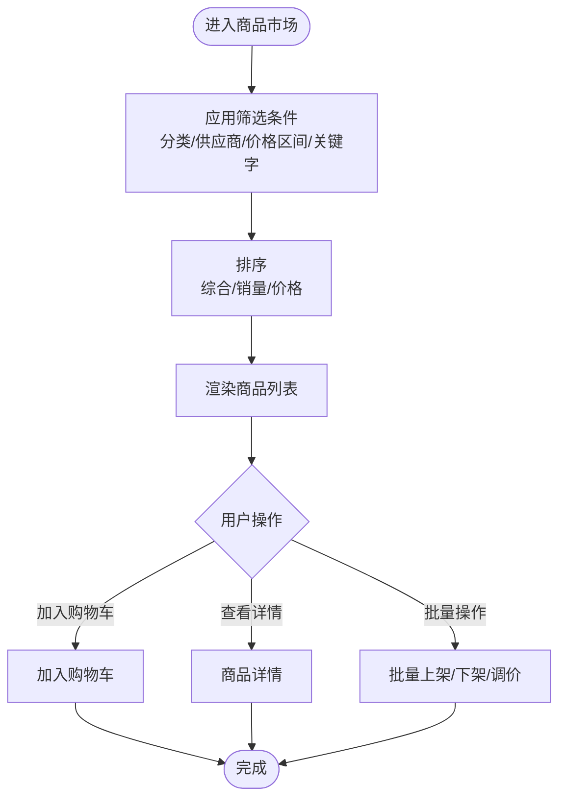

图表来源
- [apps/mp/src/pages/market/index.vue:1-800](file://apps/mp/src/pages/market/index.vue#L1-L800)
- [apps/pc/src/views/market/list/index.vue:1-800](file://apps/pc/src/views/market/list/index.vue#L1-L800)

章节来源
- [apps/mp/src/pages/market/index.vue:1-800](file://apps/mp/src/pages/market/index.vue#L1-L800)
- [apps/pc/src/views/market/list/index.vue:1-800](file://apps/pc/src/views/market/list/index.vue#L1-L800)

### 商品搜索过滤算法
- 关键字搜索：支持商品名称/编码模糊匹配
- 分类筛选：树形结构按类别过滤
- 供应商筛选：按供应商ID过滤
- 价格区间：基于最小/最大价格过滤
- 排序：综合、销量（升/降）、价格（升/降）

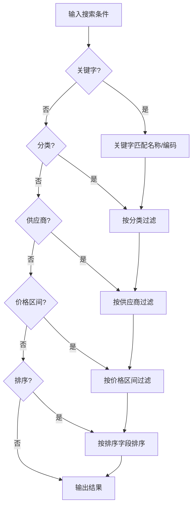

图表来源
- [apps/mp/src/pages/market/index.vue:483-521](file://apps/mp/src/pages/market/index.vue#L483-L521)

章节来源
- [apps/mp/src/pages/market/index.vue:483-521](file://apps/mp/src/pages/market/index.vue#L483-L521)

### 商品详情查看流程
- 移动端：点击商品卡片跳转详情页，展示SKU信息、规格、供应商、价格、库存等
- PC端：点击“详情”打开抽屉，展示SKU/SPU信息、供应商列表、可见工程仓、历史采购量等

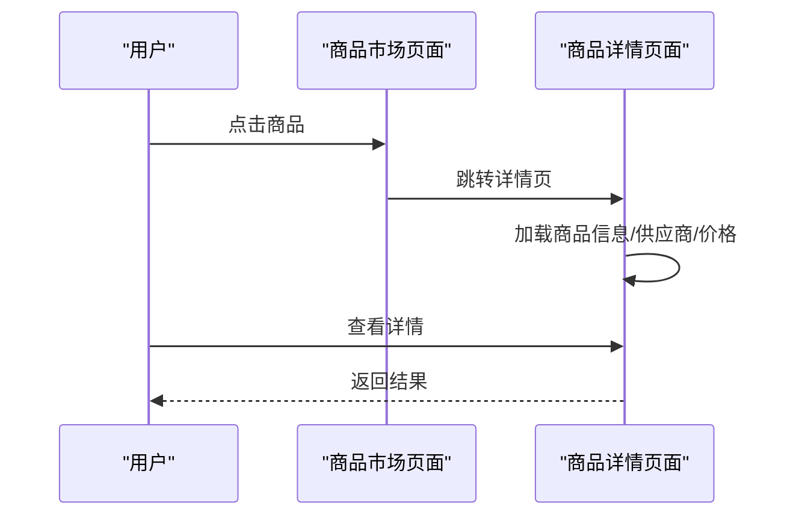

图表来源
- [apps/mp/src/pages/market/index.vue:582-588](file://apps/mp/src/pages/market/index.vue#L582-L588)
- [apps/pc/src/views/market/list/index.vue:534-597](file://apps/pc/src/views/market/list/index.vue#L534-L597)

章节来源
- [apps/mp/src/pages/market/index.vue:582-588](file://apps/mp/src/pages/market/index.vue#L582-L588)
- [apps/pc/src/views/market/list/index.vue:534-597](file://apps/pc/src/views/market/list/index.vue#L534-L597)

### 购物车管理逻辑
- 按供应商分组，支持全选/反选、单项勾选、数量修改、实时合计
- 结算时校验勾选项，跳转订单确认页

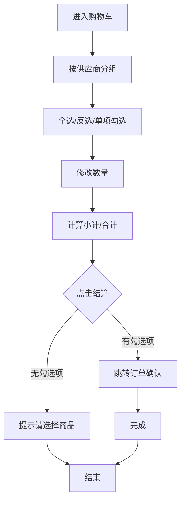

图表来源
- [apps/mp/src/pages/cart/index.vue:78-125](file://apps/mp/src/pages/cart/index.vue#L78-L125)

章节来源
- [apps/mp/src/pages/cart/index.vue:78-125](file://apps/mp/src/pages/cart/index.vue#L78-L125)

### 商品分类管理
- 复用平台标准分类，支持分类可见性开关、排序权重、商品统计（总数/已上架/待上架/热门/推荐）
- 支持展开/折叠、查看某分类下的商品列表

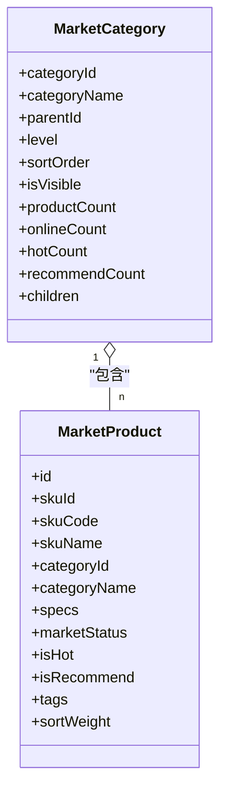

图表来源
- [packages/types/src/market.ts:121-138](file://packages/types/src/market.ts#L121-L138)
- [packages/types/src/market.ts:18-46](file://packages/types/src/market.ts#L18-L46)

章节来源
- [apps/pc/src/views/market/category/index.vue:1-549](file://apps/pc/src/views/market/category/index.vue#L1-L549)
- [packages/types/src/market.ts:121-138](file://packages/types/src/market.ts#L121-L138)

### 权限控制机制
- 用户登录态与权限：store中维护用户、菜单、权限；提供hasPermission/hasPermissions方法
- 功能权限矩阵：明确平台管理员、供应商、工程仓、施工方的角色权限边界
- 数据权限：按角色限定可见范围（如工程仓仅可见授权商品）

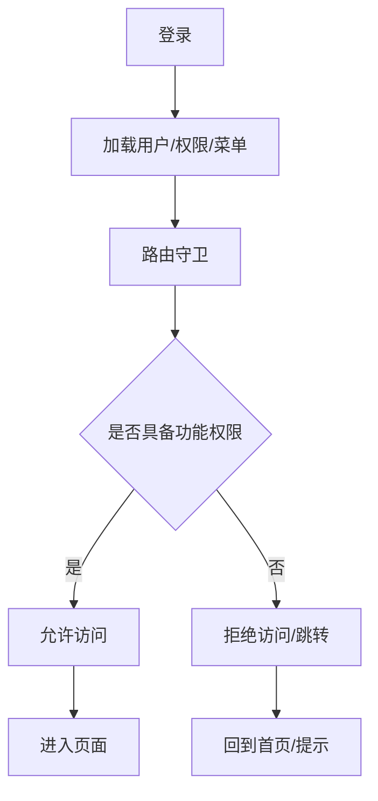

图表来源
- [apps/pc/src/store/user.ts:35-111](file://apps/pc/src/store/user.ts#L35-L111)
- [docs/PRD/06-商品板块功能清单.md:239-254](file://docs/PRD/06-商品板块功能清单.md#L239-L254)

章节来源
- [apps/pc/src/store/user.ts:35-111](file://apps/pc/src/store/user.ts#L35-L111)
- [docs/PRD/06-商品板块功能清单.md:239-254](file://docs/PRD/06-商品板块功能清单.md#L239-L254)

### 库存管理集成
- 工程仓库存查询：支持按仓库、分类、库存状态筛选，显示可用/锁定/安全库存
- 库存预警：根据当前库存与安全库存计算预警级别，支持快速补货
- 与订单流程联动：下单时锁定库存，发货后扣减库存，支持库存流水查看

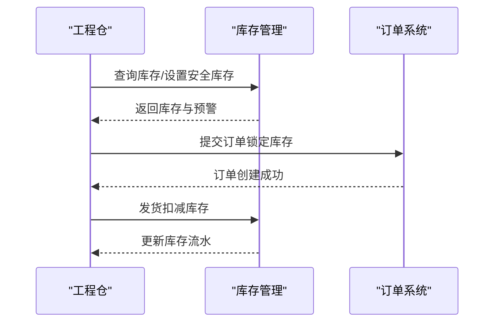

图表来源
- [apps/pc/src/views/market/stock/index.vue:497-669](file://apps/pc/src/views/market/stock/index.vue#L497-L669)
- [packages/types/src/market.ts:140-181](file://packages/types/src/market.ts#L140-L181)

章节来源
- [apps/pc/src/views/market/stock/index.vue:1-824](file://apps/pc/src/views/market/stock/index.vue#L1-L824)
- [packages/types/src/market.ts:140-181](file://packages/types/src/market.ts#L140-L181)

### 价格展示策略
- 市场价格：面向工程仓/施工方的建议售价
- 供应商价格：面向工程仓的供货价，支持最低价展示
- 价格调整：支持单品/批量调价，审批后生效，支持调价幅度与原因留痕

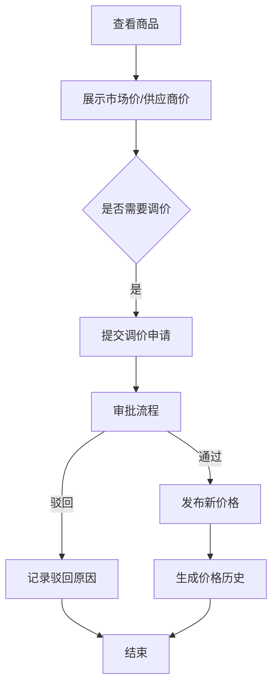

图表来源
- [apps/pc/src/views/market/price/index.vue:389-472](file://apps/pc/src/views/market/price/index.vue#L389-L472)
- [packages/types/src/market.ts:77-113](file://packages/types/src/market.ts#L77-L113)

章节来源
- [apps/pc/src/views/market/price/index.vue:1-548](file://apps/pc/src/views/market/price/index.vue#L1-L548)
- [packages/types/src/market.ts:77-113](file://packages/types/src/market.ts#L77-L113)

### 业务场景示例

#### 供应商如何发布商品
- 供应商在商品管理中创建/编辑SPU/SKU，设置建议价格、成本价、市场价
- 平台运营审核后商品进入“待上架”，可导入至商品市场
- 支持批量导入、批量上架、设置可见工程仓、排序权重

章节来源
- [docs/PRD/02-业务流程设计.md:279-347](file://docs/PRD/02-业务流程设计.md#L279-L347)
- [apps/pc/src/views/market/list/index.vue:1-800](file://apps/pc/src/views/market/list/index.vue#L1-L800)

#### 平台如何审核商品
- 平台运营在商品市场列表中对“待上架”商品进行审核，支持批量操作
- 审核通过后设置可见工程仓、排序权重，商品正式上架

章节来源
- [apps/pc/src/views/market/list/index.vue:1-800](file://apps/pc/src/views/market/list/index.vue#L1-L800)
- [docs/PRD/02-业务流程设计.md:327-347](file://docs/PRD/02-业务流程设计.md#L327-L347)

#### 用户如何浏览和购买商品
- 工程仓/施工方在商品市场浏览商品，支持分类/供应商/价格区间/关键字筛选
- 加入购物车后统一结算，生成采购订单，进入履约流程

章节来源
- [apps/mp/src/pages/market/index.vue:1-800](file://apps/mp/src/pages/market/index.vue#L1-L800)
- [apps/mp/src/pages/cart/index.vue:1-332](file://apps/mp/src/pages/cart/index.vue#L1-L332)
- [docs/PRD/02-业务流程设计.md:383-494](file://docs/PRD/02-业务流程设计.md#L383-L494)

## 依赖分析
- 类型依赖：市场商品、价格调整、库存告警、商品SPU/SKU等类型定义
- 权限依赖：用户store提供hasPermission/hasPermissions，配合PRD中的权限矩阵
- 页面依赖：移动端市场页与PC端市场页共享核心逻辑（搜索/筛选/排序），但UI与交互存在差异

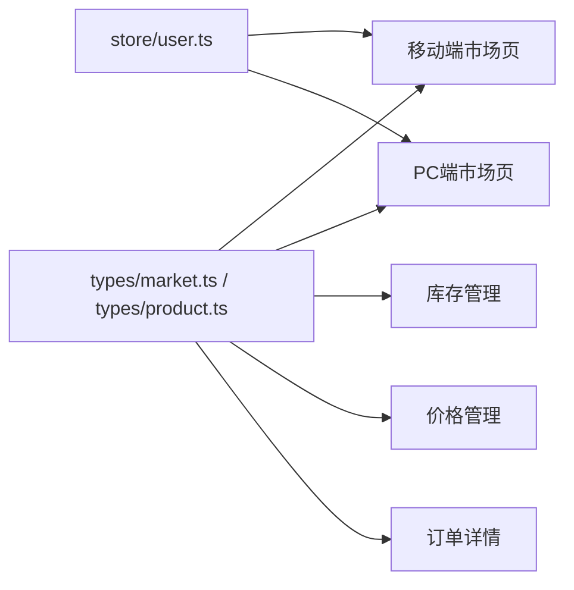

图表来源
- [packages/types/src/market.ts:1-212](file://packages/types/src/market.ts#L1-L212)
- [packages/types/src/product.ts:1-431](file://packages/types/src/product.ts#L1-L431)
- [apps/pc/src/store/user.ts:35-111](file://apps/pc/src/store/user.ts#L35-L111)

章节来源
- [packages/types/src/market.ts:1-212](file://packages/types/src/market.ts#L1-L212)
- [packages/types/src/product.ts:1-431](file://packages/types/src/product.ts#L1-L431)
- [apps/pc/src/store/user.ts:35-111](file://apps/pc/src/store/user.ts#L35-L111)

## 性能考虑
- 列表分页与虚拟滚动：PC端表格建议分页加载，移动端长列表可采用虚拟滚动优化
- 搜索与筛选：前端缓存常用筛选条件，避免重复计算；价格区间与供应商筛选建议使用索引字段
- 图片懒加载：商品列表与详情页图片采用懒加载，减少首屏压力
- 权限判断：在路由层与页面层双重校验，避免无效请求
- 价格与库存：批量操作时采用节流/防抖，避免频繁请求

## 故障排查指南
- 登录态异常：检查store中token与用户信息是否正确写入/清除，确认路由守卫逻辑
- 权限不足：核对用户权限列表与页面所需权限，确认PRD权限矩阵
- 商品无库存：检查库存管理中的可用/锁定/安全库存设置，确认订单锁定与扣减流程
- 价格未生效：检查价格调整审批状态与生效时间，核对历史记录
- 订单状态异常：核对订单状态机与各环节操作记录，定位问题节点

章节来源
- [apps/pc/src/store/user.ts:35-111](file://apps/pc/src/store/user.ts#L35-L111)
- [apps/pc/src/views/market/stock/index.vue:597-669](file://apps/pc/src/views/market/stock/index.vue#L597-L669)
- [apps/pc/src/views/market/price/index.vue:389-472](file://apps/pc/src/views/market/price/index.vue#L389-L472)
- [apps/pc/src/views/order/detail/index.vue:67-96](file://apps/pc/src/views/order/detail/index.vue#L67-L96)

## 结论
供应商品市场通过“商品展示—搜索过滤—购物车—订单—库存—价格”的闭环设计，实现了从供应商到工程仓/施工方的高效采供路径。前端以类型定义与权限体系为基石，结合移动端与PC端差异化交互，既保证了功能完整性，也兼顾了用户体验与性能优化。后续可在搜索索引、批量操作优化、价格审批自动化等方面持续演进。

## 附录

### 数据模型说明
- 市场商品：包含SKU/SKU编码/SPU/分类、规格、市场状态、价格、标签、排序权重等
- 价格调整：支持单品/批量调价、审批状态、调价幅度与原因
- 库存告警：按仓库/商品维度计算当前库存与安全库存，生成预警级别

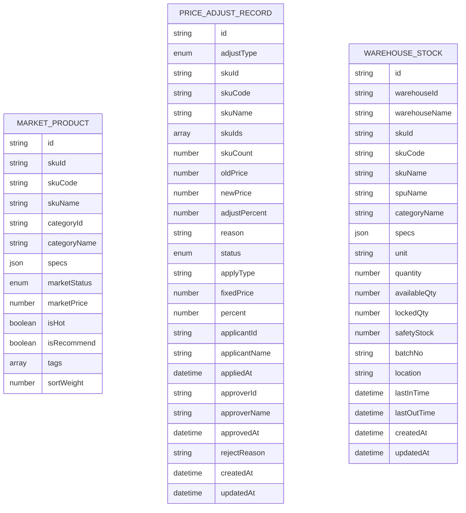

图表来源
- [packages/types/src/market.ts:18-181](file://packages/types/src/market.ts#L18-L181)

章节来源
- [packages/types/src/market.ts:18-181](file://packages/types/src/market.ts#L18-L181)