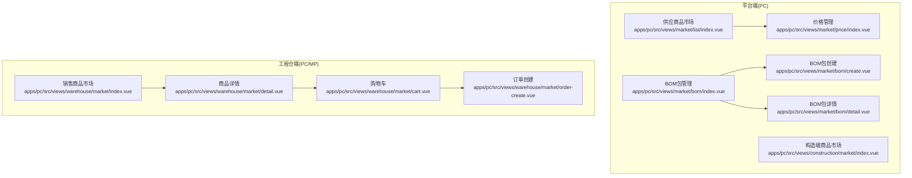
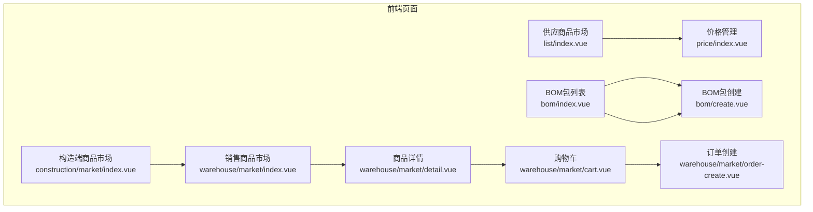
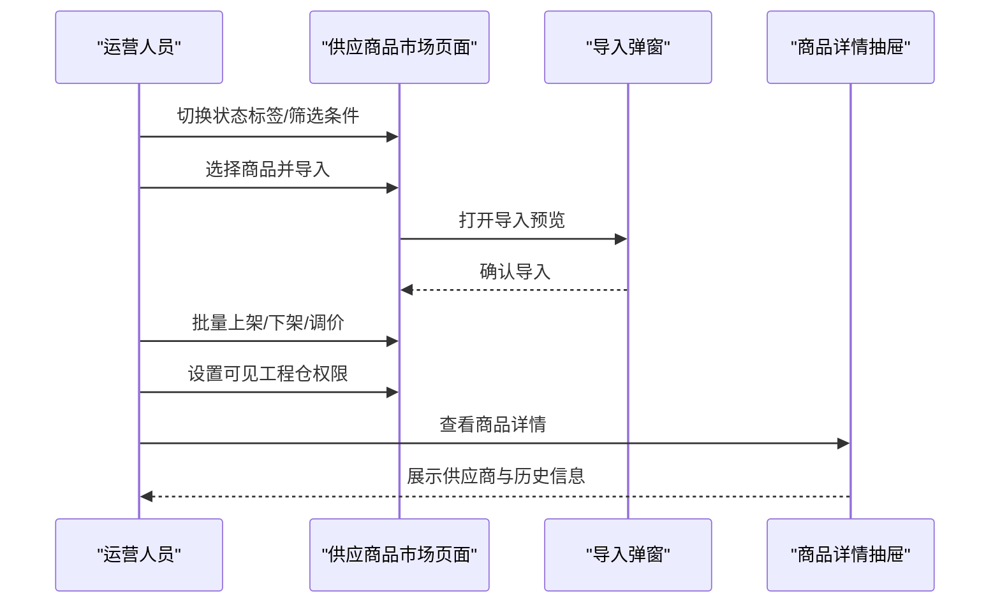
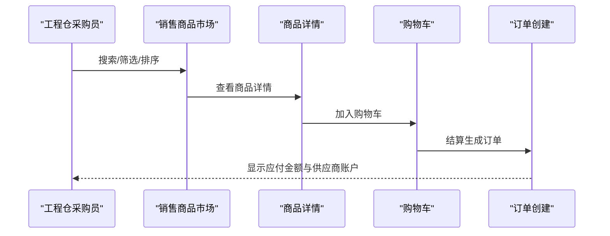
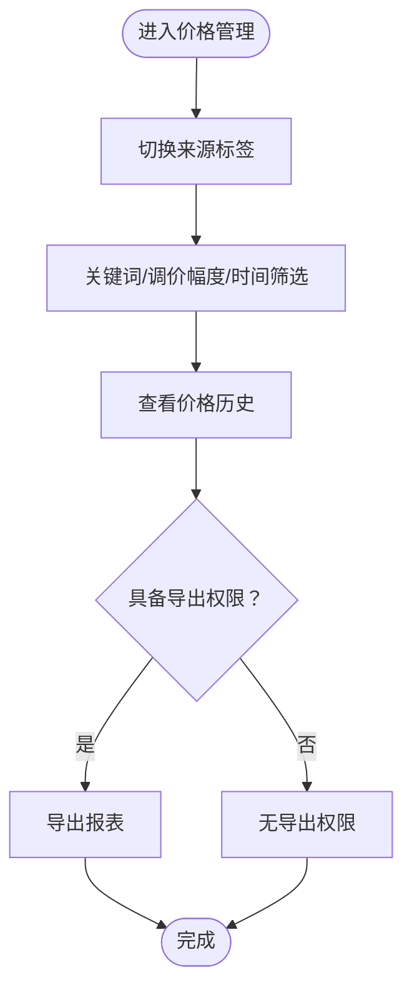
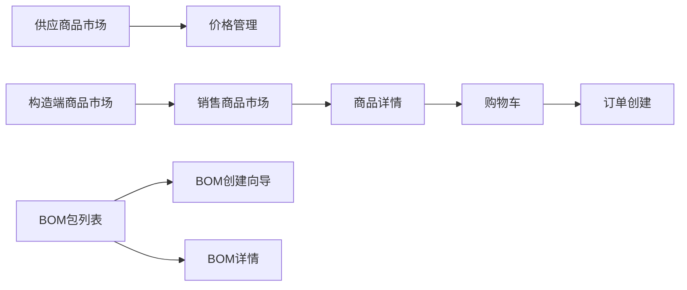

# 商品市场模块

<cite>
**本文档引用的文件**
- [PRD-商品市场模块v1.0.md](file://PRD-商品市场模块v1.0.md)
- [apps/pc/src/views/market/list/index.vue](file://apps/pc/src/views/market/list/index.vue)
- [apps/pc/src/views/market/bom/index.vue](file://apps/pc/src/views/market/bom/index.vue)
- [apps/pc/src/views/market/bom/create.vue](file://apps/pc/src/views/market/bom/create.vue)
- [apps/pc/src/views/market/bom/detail.vue](file://apps/pc/src/views/market/bom/detail.vue)
- [apps/pc/src/views/market/price/index.vue](file://apps/pc/src/views/market/price/index.vue)
- [apps/pc/src/views/warehouse/market/index.vue](file://apps/pc/src/views/warehouse/market/index.vue)
- [apps/pc/src/views/warehouse/market/detail.vue](file://apps/pc/src/views/warehouse/market/detail.vue)
- [apps/pc/src/views/warehouse/market/cart.vue](file://apps/pc/src/views/warehouse/market/cart.vue)
- [apps/pc/src/views/warehouse/market/order-create.vue](file://apps/pc/src/views/warehouse/market/order-create.vue)
- [apps/pc/src/views/construction/market/index.vue](file://apps/pc/src/views/construction/market/index.vue)
</cite>

## 目录
1. [简介](#简介)
2. [项目结构](#项目结构)
3. [核心组件](#核心组件)
4. [架构总览](#架构总览)
5. [详细组件分析](#详细组件分析)
6. [依赖分析](#依赖分析)
7. [性能考虑](#性能考虑)
8. [故障排查指南](#故障排查指南)
9. [结论](#结论)
10. [附录](#附录)

## 简介
本文件面向“商品市场模块”的业务与技术实现，围绕以下核心功能展开：供应商品市场（商品列表展示、搜索过滤、详情查看、购物车管理）、销售商品市场（销售商品展示、权限管理、价格策略配置、权限控制）、BOM基装包管理（BOM包创建、编辑、详情、审核）、价格管理（价格策略配置、批量价格调整、价格历史记录、价格对比分析）。文档结合PRD与前端页面源码，给出业务流程、操作步骤、数据模型、权限控制、异常处理、业务场景示例与最佳实践。

## 项目结构
商品市场模块由PC端与移动端两套界面构成，分别服务于平台运营侧与工程仓采购侧：
- 平台端（PC）：供应商品市场管理、BOM包管理、价格管理、工程仓端商品市场（构造端）。
- 工程仓端（PC/MP）：销售商品市场、购物车、订单创建与支付流程。



图表来源
- [apps/pc/src/views/market/list/index.vue](file://apps/pc/src/views/market/list/index.vue)
- [apps/pc/src/views/market/bom/index.vue](file://apps/pc/src/views/market/bom/index.vue)
- [apps/pc/src/views/market/bom/create.vue](file://apps/pc/src/views/market/bom/create.vue)
- [apps/pc/src/views/market/bom/detail.vue](file://apps/pc/src/views/market/bom/detail.vue)
- [apps/pc/src/views/market/price/index.vue](file://apps/pc/src/views/market/price/index.vue)
- [apps/pc/src/views/construction/market/index.vue](file://apps/pc/src/views/construction/market/index.vue)
- [apps/pc/src/views/warehouse/market/index.vue](file://apps/pc/src/views/warehouse/market/index.vue)
- [apps/pc/src/views/warehouse/market/detail.vue](file://apps/pc/src/views/warehouse/market/detail.vue)
- [apps/pc/src/views/warehouse/market/cart.vue](file://apps/pc/src/views/warehouse/market/cart.vue)
- [apps/pc/src/views/warehouse/market/order-create.vue](file://apps/pc/src/views/warehouse/market/order-create.vue)

章节来源
- [PRD-商品市场模块v1.0.md](file://PRD-商品市场模块v1.0.md)

## 核心组件
- 供应商品市场（平台端）：商品四状态（全部/待上架/已上架/已下架）管理、导入商品、批量上架/下架/调价、权限设置、分类树筛选、搜索与排序。
- 销售商品市场（工程仓端）：商品瀑布流展示、搜索与排序、购物车、订单创建。
- BOM基装包管理：BOM包列表、创建向导（基本信息+SKU明细）、权限配置、审核与上架/下架。
- 价格管理：价格变更记录、来源分类（平台/供应商/工程仓）、调价幅度筛选、历史价格查看。
- 构造端商品市场（工程仓侧）：按工程仓主体/仓库维度的商品展示、批量上下架、单个调价。

章节来源
- [apps/pc/src/views/market/list/index.vue](file://apps/pc/src/views/market/list/index.vue)
- [apps/pc/src/views/warehouse/market/index.vue](file://apps/pc/src/views/warehouse/market/index.vue)
- [apps/pc/src/views/market/bom/index.vue](file://apps/pc/src/views/market/bom/index.vue)
- [apps/pc/src/views/market/bom/create.vue](file://apps/pc/src/views/market/bom/create.vue)
- [apps/pc/src/views/market/bom/detail.vue](file://apps/pc/src/views/market/bom/detail.vue)
- [apps/pc/src/views/market/price/index.vue](file://apps/pc/src/views/market/price/index.vue)
- [apps/pc/src/views/construction/market/index.vue](file://apps/pc/src/views/construction/market/index.vue)

## 架构总览
模块采用前后端分离架构，前端以Vue3 + Arco Design为UI框架，页面通过路由组织，组件间通过props与事件通信；数据层面以本地模拟数据为主，便于演示与开发。



图表来源
- [apps/pc/src/views/market/list/index.vue](file://apps/pc/src/views/market/list/index.vue)
- [apps/pc/src/views/market/bom/index.vue](file://apps/pc/src/views/market/bom/index.vue)
- [apps/pc/src/views/market/bom/create.vue](file://apps/pc/src/views/market/bom/create.vue)
- [apps/pc/src/views/market/price/index.vue](file://apps/pc/src/views/market/price/index.vue)
- [apps/pc/src/views/warehouse/market/index.vue](file://apps/pc/src/views/warehouse/market/index.vue)
- [apps/pc/src/views/warehouse/market/detail.vue](file://apps/pc/src/views/warehouse/market/detail.vue)
- [apps/pc/src/views/warehouse/market/cart.vue](file://apps/pc/src/views/warehouse/market/cart.vue)
- [apps/pc/src/views/warehouse/market/order-create.vue](file://apps/pc/src/views/warehouse/market/order-create.vue)
- [apps/pc/src/views/construction/market/index.vue](file://apps/pc/src/views/construction/market/index.vue)

## 详细组件分析

### 供应商品市场（平台端）
- 业务流程
  - 商品生命周期：待上架 → 已上架 → 已下架；支持导入商品、批量上架/下架、批量调价、设置可见权限。
  - 搜索与筛选：关键词、分类树、供应商、供货状态；支持导入商品预览与确认。
  - 权限控制：商品级可见范围设置，支持区域化运营。
- 操作步骤
  - 选择商品 → 预览 → 确认导入 → 上架/下架 → 设置权限 → 记录留痕。
  - 批量操作：批量上架、批量下架、批量调价（固定价格/百分比）、批量设置权限。
- 数据模型
  - 商品：主图、SKU名称/编码、规格、所属SPU、历史采购量、供应商列表（含价格/起订量/周期/状态）、市场状态、可见工程仓、排序权重。
  - 供应商：名称、价格、起订量、周期、状态、优先级。
  - 工程仓：名称、可见数量。
- 权限控制
  - 功能权限矩阵：选品专员/运营主管/区域运营/工程仓；数据权限与字段权限区分。
- 异常处理
  - 供应商停货：自动切换到下一个最低价供应商。
  - 库存不足：加购时提示剩余库存。
  - 商品已下架：购物车置灰，结算时自动排除。



图表来源
- [apps/pc/src/views/market/list/index.vue](file://apps/pc/src/views/market/list/index.vue)

章节来源
- [apps/pc/src/views/market/list/index.vue](file://apps/pc/src/views/market/list/index.vue)
- [PRD-商品市场模块v1.0.md](file://PRD-商品市场模块v1.0.md)

### 销售商品市场（工程仓端）
- 业务流程
  - 商品瀑布流展示：分类树筛选、关键词搜索、排序（综合/销量/价格）。
  - 购物车：批量删除、数量调整、实时计算、供应商分组。
  - 订单创建：收货地址选择、商品清单、供应商账户信息、应付金额、线下转账流程。
- 操作步骤
  - 搜索/筛选 → 点击卡片/详情 → 加入购物车 → 结算 → 选择收货地址 → 确认订单 → 线下转账。
- 数据模型
  - 商品：主图、名称、规格、品牌、供应商（多家时显示最低价）、单价、单位。
  - 购物车：商品项（SKU、数量、单价、小计）、合计、供应商分组。
  - 订单：收货地址、商品清单、应付金额、支付方式（线下转账）、供应商账户。
- 权限控制
  - 工程仓主体/仓库维度的商品展示与上下架控制。
- 异常处理
  - 多供应商自动选择最低价供应商。
  - 库存不足提示与起订量限制。



图表来源
- [apps/pc/src/views/warehouse/market/index.vue](file://apps/pc/src/views/warehouse/market/index.vue)
- [apps/pc/src/views/warehouse/market/detail.vue](file://apps/pc/src/views/warehouse/market/detail.vue)
- [apps/pc/src/views/warehouse/market/cart.vue](file://apps/pc/src/views/warehouse/market/cart.vue)
- [apps/pc/src/views/warehouse/market/order-create.vue](file://apps/pc/src/views/warehouse/market/order-create.vue)

章节来源
- [apps/pc/src/views/warehouse/market/index.vue](file://apps/pc/src/views/warehouse/market/index.vue)
- [apps/pc/src/views/warehouse/market/detail.vue](file://apps/pc/src/views/warehouse/market/detail.vue)
- [apps/pc/src/views/warehouse/market/cart.vue](file://apps/pc/src/views/warehouse/market/cart.vue)
- [apps/pc/src/views/warehouse/market/order-create.vue](file://apps/pc/src/views/warehouse/market/order-create.vue)

### BOM基装包管理
- 业务流程
  - 创建向导：基本信息（名称/标签/说明）→ SKU明细（添加/批量导入/必选标记）→ 供应商策略（智能/单一/SKU级指定）→ 完成创建。
  - 列表管理：筛选（名称/上架状态）、权限配置（工程仓可见范围）、上架/下架、删除。
  - 详情查看：基本信息、SKU明细、审核记录。
- 操作步骤
  - 创建BOM包 → 填写基本信息 → 添加SKU → 配置标签与说明 → 提交审核 → 审核通过后上架 → 设置可见工程仓。
- 数据模型
  - BOM包：名称、标签、说明、可见工程仓、SKU列表（SKU编码/名称/规格/单价/单位/必选）、策略、状态。
  - SKU：单价、数量、供应商信息、可用供应商集合。
- 权限控制
  - 穿梭框选择可见工程仓，支持全选/清空。
- 异常处理
  - SKU必选标记不可删除；供应商策略配置提示。

```mermaid
sequenceDiagram
participant OP as "运营人员"
participant Create as "BOM创建向导"
participant List as "BOM包列表"
participant Detail as "BOM详情"
OP->>Create : 填写基本信息
OP->>Create : 添加SKU/批量导入
OP->>Create : 配置供应商策略
OP->>Create : 完成创建
Create-->>List : 显示BOM包
OP->>List : 权限配置/上架/下架
OP->>Detail : 查看SKU明细与审核记录
```

图表来源
- [apps/pc/src/views/market/bom/create.vue](file://apps/pc/src/views/market/bom/create.vue)
- [apps/pc/src/views/market/bom/index.vue](file://apps/pc/src/views/market/bom/index.vue)
- [apps/pc/src/views/market/bom/detail.vue](file://apps/pc/src/views/market/bom/detail.vue)

章节来源
- [apps/pc/src/views/market/bom/index.vue](file://apps/pc/src/views/market/bom/index.vue)
- [apps/pc/src/views/market/bom/create.vue](file://apps/pc/src/views/market/bom/create.vue)
- [apps/pc/src/views/market/bom/detail.vue](file://apps/pc/src/views/market/bom/detail.vue)

### 价格管理
- 业务流程
  - 价格变更记录：按来源（平台/供应商/工程仓）分类、关键词/调价幅度/时间范围筛选。
  - 历史价格查看：按商品维度展示历史调价记录。
  - 权限矩阵：平台定价员/供应商/仓库经理/只读用户。
- 操作步骤
  - 查看看板指标 → 切换来源Tab → 搜索/筛选 → 查看历史 → 导出报表（具备相应权限）。
- 数据模型
  - 价格记录：来源（platform/supplier/warehouse）、商品名称/SKU编码/规格、原价/现价/调价幅度、变更原因、操作人、变更时间。
- 权限控制
  - 不同角色对价格策略配置与导出报表具有不同权限。
- 异常处理
  - 调价申请需审批通过后生效。



图表来源
- [apps/pc/src/views/market/price/index.vue](file://apps/pc/src/views/market/price/index.vue)

章节来源
- [apps/pc/src/views/market/price/index.vue](file://apps/pc/src/views/market/price/index.vue)

### 构造端商品市场（工程仓侧）
- 业务流程
  - 按工程仓主体/仓库维度筛选商品 → 搜索/状态筛选 → 批量上下架 → 单个调价。
- 操作步骤
  - 选择主体/仓库 → 搜索/筛选 → 批量操作 → 单个调价。
- 数据模型
  - 商品：商品编码/名称/SPU、规格、工程仓主体/仓库、销售价/库存、状态、排序。
- 权限控制
  - 仅对授权工程仓可见。

章节来源
- [apps/pc/src/views/construction/market/index.vue](file://apps/pc/src/views/construction/market/index.vue)

## 依赖分析
- 组件耦合
  - 供应商品市场与价格管理存在数据联动（价格变更记录）。
  - 销售商品市场与构造端商品市场共享工程仓维度的数据模型。
  - BOM包管理与供应商品市场在SKU来源与权限控制上存在关联。
- 外部依赖
  - UI框架：Arco Design（表格、表单、抽屉、模态框、标签等）。
  - 路由：Vue Router（页面跳转与参数传递）。
  - 状态：Vue响应式（computed/ref/reactive）。



图表来源
- [apps/pc/src/views/market/list/index.vue](file://apps/pc/src/views/market/list/index.vue)
- [apps/pc/src/views/market/price/index.vue](file://apps/pc/src/views/market/price/index.vue)
- [apps/pc/src/views/warehouse/market/index.vue](file://apps/pc/src/views/warehouse/market/index.vue)
- [apps/pc/src/views/warehouse/market/detail.vue](file://apps/pc/src/views/warehouse/market/detail.vue)
- [apps/pc/src/views/warehouse/market/cart.vue](file://apps/pc/src/views/warehouse/market/cart.vue)
- [apps/pc/src/views/warehouse/market/order-create.vue](file://apps/pc/src/views/warehouse/market/order-create.vue)
- [apps/pc/src/views/market/bom/index.vue](file://apps/pc/src/views/market/bom/index.vue)
- [apps/pc/src/views/market/bom/create.vue](file://apps/pc/src/views/market/bom/create.vue)
- [apps/pc/src/views/market/bom/detail.vue](file://apps/pc/src/views/market/bom/detail.vue)
- [apps/pc/src/views/construction/market/index.vue](file://apps/pc/src/views/construction/market/index.vue)

## 性能考虑
- 首屏加载：商品列表加载应小于1秒；分类树渲染小于500毫秒。
- 购物车计算：数量变更时小计/合计实时刷新，延迟小于100毫秒。
- 并发支持：支持500人同时在线浏览与下单。
- 优化建议
  - 列表分页与虚拟滚动（如SKU明细较多时）。
  - 图片懒加载与压缩。
  - 本地缓存常用筛选条件与权限数据。

## 故障排查指南
- 常见问题
  - 加购时库存不足：提示“当前供应商库存仅剩下X件”。
  - 商品已下架：购物车置灰，结算时自动排除。
  - 供应商停货：自动切换到下一个最低价供应商。
  - 价格异常波动：通过价格管理查看历史与来源，必要时发起审批。
- 排查步骤
  - 检查商品市场状态与可见范围。
  - 核对供应商价格与库存。
  - 查看价格历史与调价原因。
  - 确认工程仓主体/仓库维度权限。

章节来源
- [PRD-商品市场模块v1.0.md](file://PRD-商品市场模块v1.0.md)

## 结论
商品市场模块通过清晰的业务流程与权限控制，实现了从供应到销售的全链路管理。平台端聚焦商品标准化与运营效率，工程仓端强调采购便捷与成本控制。BOM包管理与价格管理进一步提升了配置灵活性与数据可追溯性。建议在后续迭代中完善真实数据对接、审批流程与风控机制，持续优化性能与用户体验。

## 附录
- 业务场景示例
  - 平台运营每日巡检：查看待上架新品、停货预警、价格异常波动、集中批量上架。
  - 工程仓紧急补料：搜索关键词、筛选有货供应商、选择最低价下单、加入购物车结算。
  - 新项目开工备料：选择BOM套餐、调整可选材料规格、一键生成订单。
- 最佳实践
  - 供应商管理：建立稳定的供货关系与价格联动机制。
  - 区域化运营：基于工程仓维度设置商品可见范围与差异化策略。
  - 价格策略：定期评估价格竞争力，避免大幅波动影响采购计划。
  - BOM包：明确必选/可选SKU，合理配置供应商策略，提升下单效率。