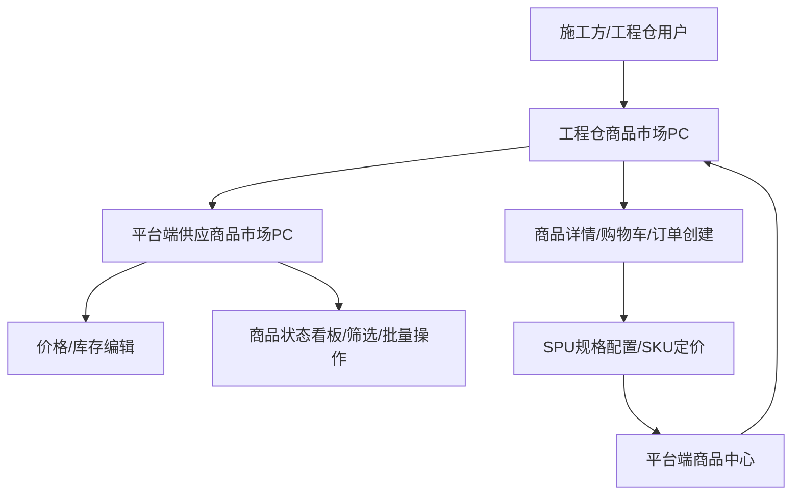
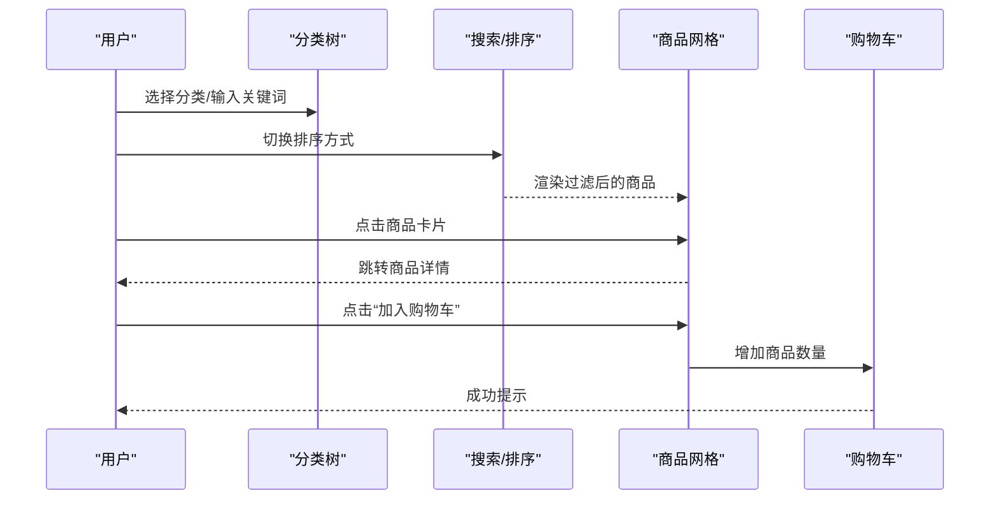
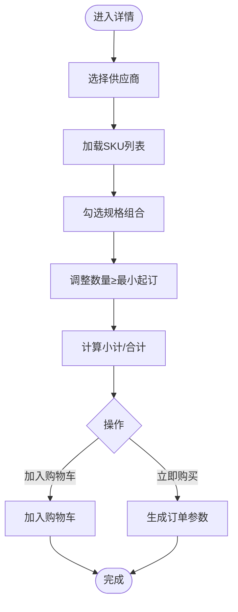
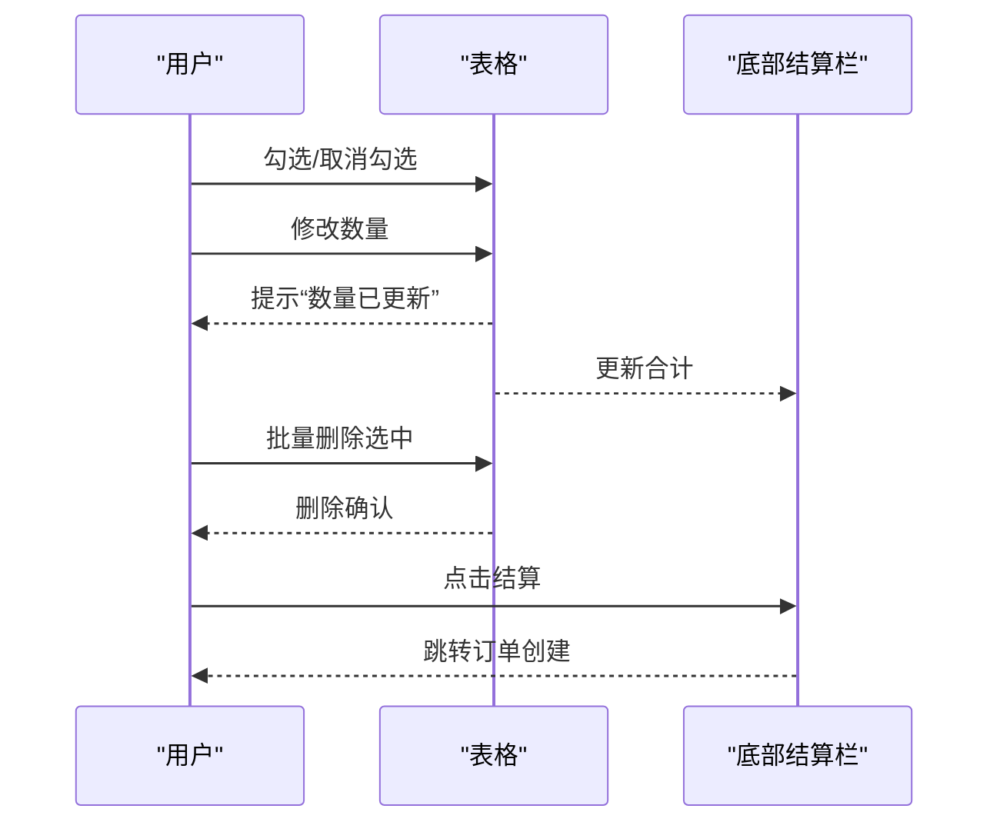
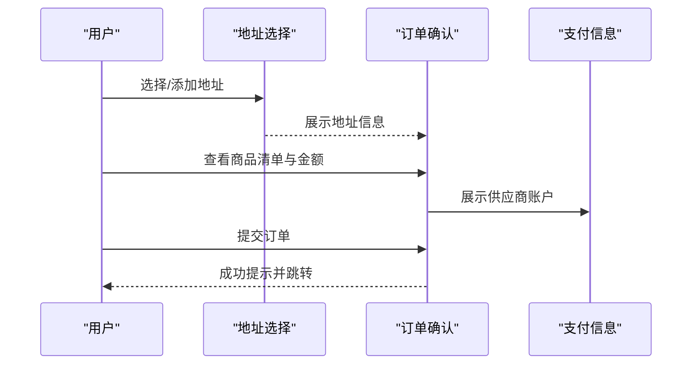
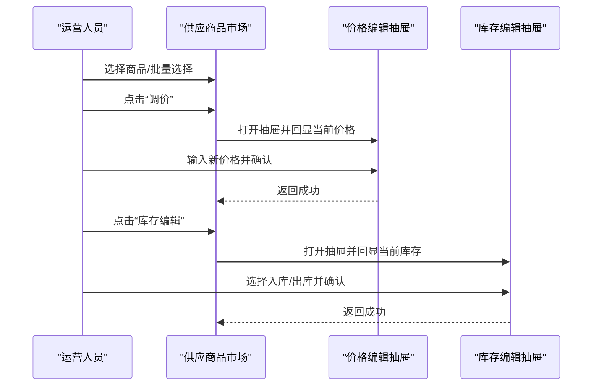
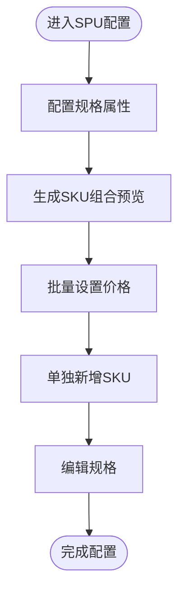
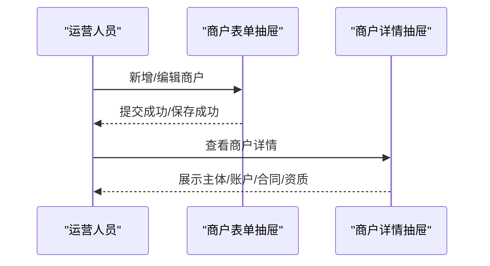
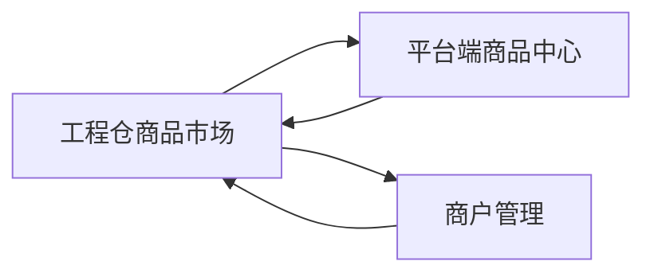

# 销售商品市场

<cite>
**本文引用的文件**
- [PRD-商品市场模块v1.0.md](file://PRD-商品市场模块v1.0.md)
- [index.vue](file://apps/pc/src/views/construction/market/index.vue)
- [PriceEditDrawer.vue](file://apps/pc/src/views/construction/market/components/PriceEditDrawer.vue)
- [StockEditDrawer.vue](file://apps/pc/src/views/construction/market/components/StockEditDrawer.vue)
- [index.vue](file://apps/pc/src/views/warehouse/market/index.vue)
- [detail.vue](file://apps/pc/src/views/warehouse/market/detail.vue)
- [cart.vue](file://apps/pc/src/views/warehouse/market/cart.vue)
- [order-create.vue](file://apps/pc/src/views/warehouse/market/order-create.vue)
- [Step2SpecConfig.vue](file://apps/pc/src/views/product/spu/components/Step2SpecConfig.vue)
- [Step3SkuPrice.vue](file://apps/pc/src/views/product/spu/components/Step3SkuPrice.vue)
- [MerchantFormDrawer.vue](file://apps/pc/src/views/merchant/list/components/MerchantFormDrawer.vue)
- [MerchantDetailDrawer.vue](file://apps/pc/src/views/merchant/list/components/MerchantDetailDrawer.vue)
</cite>

## 目录
1. [引言](#引言)
2. [项目结构](#项目结构)
3. [核心组件](#核心组件)
4. [架构总览](#架构总览)
5. [详细组件分析](#详细组件分析)
6. [依赖关系分析](#依赖关系分析)
7. [性能考虑](#性能考虑)
8. [故障排查指南](#故障排查指南)
9. [结论](#结论)
10. [附录](#附录)

## 引言
本文件面向“销售商品市场”功能，围绕工程仓端的商品展示、价格策略、库存管理、权限控制与审核机制进行系统化说明。文档基于现有PRD与源码实现，梳理业务流程、数据模型、交互规则与性能优化建议，帮助施工方高效选择与购买商品，帮助运营与工程仓人员完成价格与库存管理。

## 项目结构
销售商品市场主要由两部分构成：
- 工程仓端商品市场（PC端）：商品瀑布流展示、购物车、订单创建、商品详情页
- 平台端供应商品市场（PC端）：商品状态看板、筛选、批量运营、价格与库存编辑

```mermaid
graph TB
subgraph "工程仓端PC"
A["商品市场首页<br/>apps/pc/src/views/warehouse/market/index.vue"]
B["商品详情页<br/>apps/pc/src/views/warehouse/market/detail.vue"]
C["购物车<br/>apps/pc/src/views/warehouse/market/cart.vue"]
D["订单创建<br/>apps/pc/src/views/warehouse/market/order-create.vue"]
end
subgraph "平台端PC"
E["供应商品市场<br/>apps/pc/src/views/construction/market/index.vue"]
F["价格编辑抽屉<br/>apps/pc/src/views/construction/market/components/PriceEditDrawer.vue"]
G["库存编辑抽屉<br/>apps/pc/src/views/construction/market/components/StockEditDrawer.vue"]
end
subgraph "商品与商户支撑"
H["SPU规格配置<br/>apps/pc/src/views/product/spu/components/Step2SpecConfig.vue"]
I["SKU定价<br/>apps/pc/src/views/product/spu/components/Step3SkuPrice.vue"]
J["商户表单抽屉<br/>apps/pc/src/views/merchant/list/components/MerchantFormDrawer.vue"]
K["商户详情抽屉<br/>apps/pc/src/views/merchant/list/components/MerchantDetailDrawer.vue"]
end
A --> B
B --> C
C --> D
E --> F
E --> G
H --> I
J --> K
```

图表来源
- [index.vue:1-440](file://apps/pc/src/views/warehouse/market/index.vue#L1-L440)
- [detail.vue:1-723](file://apps/pc/src/views/warehouse/market/detail.vue#L1-L723)
- [cart.vue:1-312](file://apps/pc/src/views/warehouse/market/cart.vue#L1-L312)
- [order-create.vue:1-755](file://apps/pc/src/views/warehouse/market/order-create.vue#L1-L755)
- [index.vue:1-786](file://apps/pc/src/views/construction/market/index.vue#L1-L786)
- [PriceEditDrawer.vue:1-78](file://apps/pc/src/views/construction/market/components/PriceEditDrawer.vue#L1-L78)
- [StockEditDrawer.vue:1-92](file://apps/pc/src/views/construction/market/components/StockEditDrawer.vue#L1-L92)
- [Step2SpecConfig.vue:1-331](file://apps/pc/src/views/product/spu/components/Step2SpecConfig.vue#L1-L331)
- [Step3SkuPrice.vue:1-601](file://apps/pc/src/views/product/spu/components/Step3SkuPrice.vue#L1-L601)
- [MerchantFormDrawer.vue:1-524](file://apps/pc/src/views/merchant/list/components/MerchantFormDrawer.vue#L1-L524)
- [MerchantDetailDrawer.vue:1-343](file://apps/pc/src/views/merchant/list/components/MerchantDetailDrawer.vue#L1-L343)

章节来源
- [PRD-商品市场模块v1.0.md:1-321](file://PRD-商品市场模块v1.0.md#L1-L321)

## 核心组件
- 工程仓商品市场首页：分类树、搜索、排序、商品卡片、加入购物车、购物车入口
- 商品详情页：供应商选择、SKU规格选择、数量与小计计算、加入购物车/立即购买
- 购物车：批量删除、数量调整、实时计算、底部结算栏
- 订单创建：收货地址选择、商品清单、供应商账户、金额计算、提交订单
- 平台端供应商品市场：筛选、分类树、批量上架/下架、价格编辑抽屉
- 商品定价与规格：SPU规格配置、SKU定价、批量设置价格、手动新增SKU
- 商户管理：商户表单抽屉（多步骤）、商户详情抽屉（含托管账户）

章节来源
- [index.vue:1-440](file://apps/pc/src/views/warehouse/market/index.vue#L1-L440)
- [detail.vue:1-723](file://apps/pc/src/views/warehouse/market/detail.vue#L1-L723)
- [cart.vue:1-312](file://apps/pc/src/views/warehouse/market/cart.vue#L1-L312)
- [order-create.vue:1-755](file://apps/pc/src/views/warehouse/market/order-create.vue#L1-L755)
- [index.vue:1-786](file://apps/pc/src/views/construction/market/index.vue#L1-L786)
- [PriceEditDrawer.vue:1-78](file://apps/pc/src/views/construction/market/components/PriceEditDrawer.vue#L1-L78)
- [StockEditDrawer.vue:1-92](file://apps/pc/src/views/construction/market/components/StockEditDrawer.vue#L1-L92)
- [Step2SpecConfig.vue:1-331](file://apps/pc/src/views/product/spu/components/Step2SpecConfig.vue#L1-L331)
- [Step3SkuPrice.vue:1-601](file://apps/pc/src/views/product/spu/components/Step3SkuPrice.vue#L1-L601)
- [MerchantFormDrawer.vue:1-524](file://apps/pc/src/views/merchant/list/components/MerchantFormDrawer.vue#L1-L524)
- [MerchantDetailDrawer.vue:1-343](file://apps/pc/src/views/merchant/list/components/MerchantDetailDrawer.vue#L1-L343)

## 架构总览
销售商品市场采用“工程仓端展示+平台端运营”的双端架构：
- 工程仓端负责商品浏览、下单、结算
- 平台端负责商品状态管理、价格与库存运营、商户与托管账户管理
- 商品定价与规格配置位于平台端商品中心，为工程仓提供标准化SKU与价格

图表来源
- [index.vue:1-440](file://apps/pc/src/views/warehouse/market/index.vue#L1-L440)
- [index.vue:1-786](file://apps/pc/src/views/construction/market/index.vue#L1-L786)
- [Step2SpecConfig.vue:1-331](file://apps/pc/src/views/product/spu/components/Step2SpecConfig.vue#L1-L331)
- [Step3SkuPrice.vue:1-601](file://apps/pc/src/views/product/spu/components/Step3SkuPrice.vue#L1-L601)

## 详细组件分析

### 工程仓商品市场首页（瀑布流展示）
- 功能要点
  - 分类树：左侧分类导航，支持搜索与计数
  - 搜索：关键词搜索商品名称/编码
  - 排序：综合/价格升序/价格降序
  - 商品卡片：主图、品牌、规格、供应商数量与最低价、加入购物车
  - 购物车入口：右上角徽章显示数量
- 交互规则
  - 点击卡片跳转详情；点击“加入购物车”弹出成功提示
  - 多供应商时自动选择最低价供应商

图表来源
- [index.vue:1-440](file://apps/pc/src/views/warehouse/market/index.vue#L1-L440)

章节来源
- [index.vue:1-440](file://apps/pc/src/views/warehouse/market/index.vue#L1-L440)

### 商品详情页（供应商与SKU选择）
- 功能要点
  - 供应商选择：单选，切换后同步SKU最小起订与价格
  - SKU规格：勾选规格组合，输入数量，实时计算小计
  - 价格区间展示、热销/推荐标签、SPU信息
- 交互规则
  - 供应商暂停供货时，对应SKU禁用
  - 全选/取消全选SKU，自动按最小起订填充数量

图表来源
- [detail.vue:1-723](file://apps/pc/src/views/warehouse/market/detail.vue#L1-L723)

章节来源
- [detail.vue:1-723](file://apps/pc/src/views/warehouse/market/detail.vue#L1-L723)

### 购物车（批量删除、数量调整、实时计算）
- 功能要点
  - 批量删除选中商品
  - 数量增减（按钮式），最大值=库存
  - 实时计算小计与合计
  - 底部固定结算栏，禁用无选中时的结算按钮
- 交互规则
  - 删除确认对话框
  - 数量变更后提示“已更新”

图表来源
- [cart.vue:1-312](file://apps/pc/src/views/warehouse/market/cart.vue#L1-L312)

章节来源
- [cart.vue:1-312](file://apps/pc/src/views/warehouse/market/cart.vue#L1-L312)

### 订单创建（收货地址、供应商账户、金额计算）
- 功能要点
  - 收货地址选择：仓库地址优先，支持默认标记
  - 商品清单：供应商标识、单价、数量、小计
  - 供应商收款账户：账户名称、银行、账号、支行
  - 金额计算：商品金额、运费、优惠、应付金额
- 交互规则
  - 提交订单前校验收货地址
  - 提交后弹出确认并跳转订单列表

图表来源
- [order-create.vue:1-755](file://apps/pc/src/views/warehouse/market/order-create.vue#L1-L755)

章节来源
- [order-create.vue:1-755](file://apps/pc/src/views/warehouse/market/order-create.vue#L1-L755)

### 平台端供应商品市场（运营与权限）
- 功能要点
  - 状态看板：全部/待上架/已上架/已下架
  - 分类导航树：点击联动筛选
  - 筛选条件：关键词、分类、供应商、供货状态
  - 批量操作：导入商品、批量上架/下架、批量调价、批量设置权限
  - 表格字段：商品信息、分类/SPU、采购库存、供应商、供货状态、进入方式、上架状态、可见范围、操作
- 价格与库存编辑
  - 价格编辑抽屉：当前销售价、新销售价
  - 库存编辑抽屉：入库/出库、数量、备注

图表来源
- [index.vue:1-786](file://apps/pc/src/views/construction/market/index.vue#L1-L786)
- [PriceEditDrawer.vue:1-78](file://apps/pc/src/views/construction/market/components/PriceEditDrawer.vue#L1-L78)
- [StockEditDrawer.vue:1-92](file://apps/pc/src/views/construction/market/components/StockEditDrawer.vue#L1-L92)

章节来源
- [index.vue:1-786](file://apps/pc/src/views/construction/market/index.vue#L1-L786)
- [PriceEditDrawer.vue:1-78](file://apps/pc/src/views/construction/market/components/PriceEditDrawer.vue#L1-L78)
- [StockEditDrawer.vue:1-92](file://apps/pc/src/views/construction/market/components/StockEditDrawer.vue#L1-L92)

### 商品定价与规格配置（平台端商品中心）
- 规格配置
  - 选择规格属性，动态生成SKU组合，预览组合数量
  - 支持手动添加/删除规格值，回车添加
- SKU定价
  - 批量设置价格（建议零售价/供货价/销售价）
  - 单独新增SKU，支持自定义规格属性
  - 清空价格、删除SKU、编辑规格

图表来源
- [Step2SpecConfig.vue:1-331](file://apps/pc/src/views/product/spu/components/Step2SpecConfig.vue#L1-L331)
- [Step3SkuPrice.vue:1-601](file://apps/pc/src/views/product/spu/components/Step3SkuPrice.vue#L1-L601)

章节来源
- [Step2SpecConfig.vue:1-331](file://apps/pc/src/views/product/spu/components/Step2SpecConfig.vue#L1-L331)
- [Step3SkuPrice.vue:1-601](file://apps/pc/src/views/product/spu/components/Step3SkuPrice.vue#L1-L601)

### 商户管理（入驻与托管）
- 商户表单抽屉：多步骤（基础信息、主体信息、结算账户、合同、资质）
- 商户详情抽屉：展示主体、结算账户、合同与资质信息；支持托管账户申请与查询
- 与商品市场的关联：商户状态影响商品市场可见范围与权限

图表来源
- [MerchantFormDrawer.vue:1-524](file://apps/pc/src/views/merchant/list/components/MerchantFormDrawer.vue#L1-L524)
- [MerchantDetailDrawer.vue:1-343](file://apps/pc/src/views/merchant/list/components/MerchantDetailDrawer.vue#L1-L343)

章节来源
- [MerchantFormDrawer.vue:1-524](file://apps/pc/src/views/merchant/list/components/MerchantFormDrawer.vue#L1-L524)
- [MerchantDetailDrawer.vue:1-343](file://apps/pc/src/views/merchant/list/components/MerchantDetailDrawer.vue#L1-L343)

## 依赖关系分析
- 工程仓端依赖平台端提供的标准化SKU与价格
- 商品详情页依赖供应商与SKU定价数据
- 订单创建依赖收货地址与供应商账户信息
- 平台端运营依赖商品中心的规格与价格配置
- 商户管理影响商品市场可见范围与权限

图表来源
- [index.vue:1-440](file://apps/pc/src/views/warehouse/market/index.vue#L1-L440)
- [index.vue:1-786](file://apps/pc/src/views/construction/market/index.vue#L1-L786)
- [Step2SpecConfig.vue:1-331](file://apps/pc/src/views/product/spu/components/Step2SpecConfig.vue#L1-L331)
- [Step3SkuPrice.vue:1-601](file://apps/pc/src/views/product/spu/components/Step3SkuPrice.vue#L1-L601)
- [MerchantFormDrawer.vue:1-524](file://apps/pc/src/views/merchant/list/components/MerchantFormDrawer.vue#L1-L524)
- [MerchantDetailDrawer.vue:1-343](file://apps/pc/src/views/merchant/list/components/MerchantDetailDrawer.vue#L1-L343)

## 性能考虑
- 首屏加载：商品列表与详情页应控制请求体积，避免一次性加载过多图片
- 表格渲染：分页与虚拟滚动结合，减少大数据量渲染压力
- 购物车计算：本地计算，避免频繁网络请求
- 图片懒加载：瀑布流与详情页图片采用懒加载策略
- 分类树渲染：前端缓存与搜索过滤，避免重复计算

## 故障排查指南
- 加购库存不足：提示“当前供应商库存仅剩下X件”，引导更换供应商或减少数量
- 商品已下架：购物车中置灰并自动排除，结算时提示
- 供应商停货：自动切换到下一个最低价供应商
- 提交订单失败：检查收货地址是否选择，确认供应商账户信息是否正确
- 价格/库存编辑失败：检查必填项与数值范围，确保抽屉内输入合法

章节来源
- [PRD-商品市场模块v1.0.md:271-278](file://PRD-商品市场模块v1.0.md#L271-L278)
- [cart.vue:165-190](file://apps/pc/src/views/warehouse/market/cart.vue#L165-L190)
- [order-create.vue:337-353](file://apps/pc/src/views/warehouse/market/order-create.vue#L337-L353)

## 结论
销售商品市场通过工程仓端的高效浏览与下单体验，配合平台端的商品标准化与运营能力，实现了从“选品—定价—库存—下单—结算”的闭环。建议在实际落地中重点关注：
- 商品标准化与SKU配置的准确性
- 价格与库存的及时同步
- 工程仓权限与可见范围的精细化控制
- 性能与用户体验的持续优化

## 附录
- 权限矩阵（示例）
  - 平台运营：商品状态看板、筛选、批量运营、价格/库存编辑
  - 工程仓采购员：商品搜索、排序、加入购物车、下单
  - 施工方工长：BOM包选择、一键下单
- 操作流程（示例）
  - 施工方：搜索→筛选→查看详情→选择供应商与规格→加入购物车→结算
  - 工程仓：搜索→筛选→批量上架/下架→价格编辑→库存编辑
- 数据验证规则（示例）
  - 价格：非负、保留两位小数
  - 数量：≥最小起订，≤库存
  - 地址：必填校验
- 性能指标（参考）
  - 商品列表加载：<1s
  - 分类树渲染：<500ms
  - 购物车计算更新：<100ms
  - 页面并发支持：500人同时在线

章节来源
- [PRD-商品市场模块v1.0.md:250-304](file://PRD-商品市场模块v1.0.md#L250-L304)
- [index.vue:1-440](file://apps/pc/src/views/warehouse/market/index.vue#L1-L440)
- [detail.vue:1-723](file://apps/pc/src/views/warehouse/market/detail.vue#L1-L723)
- [cart.vue:1-312](file://apps/pc/src/views/warehouse/market/cart.vue#L1-L312)
- [order-create.vue:1-755](file://apps/pc/src/views/warehouse/market/order-create.vue#L1-L755)
- [index.vue:1-786](file://apps/pc/src/views/construction/market/index.vue#L1-L786)
- [PriceEditDrawer.vue:1-78](file://apps/pc/src/views/construction/market/components/PriceEditDrawer.vue#L1-L78)
- [StockEditDrawer.vue:1-92](file://apps/pc/src/views/construction/market/components/StockEditDrawer.vue#L1-L92)
- [Step2SpecConfig.vue:1-331](file://apps/pc/src/views/product/spu/components/Step2SpecConfig.vue#L1-L331)
- [Step3SkuPrice.vue:1-601](file://apps/pc/src/views/product/spu/components/Step3SkuPrice.vue#L1-L601)
- [MerchantFormDrawer.vue:1-524](file://apps/pc/src/views/merchant/list/components/MerchantFormDrawer.vue#L1-L524)
- [MerchantDetailDrawer.vue:1-343](file://apps/pc/src/views/merchant/list/components/MerchantDetailDrawer.vue#L1-L343)