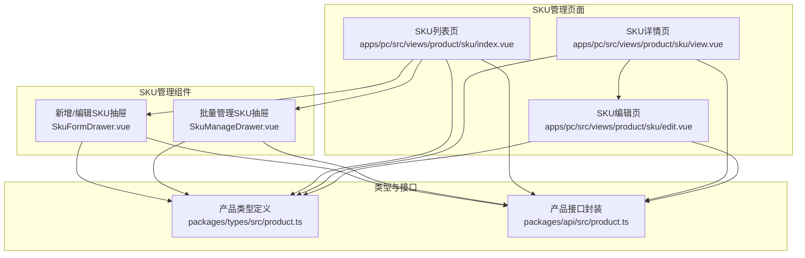
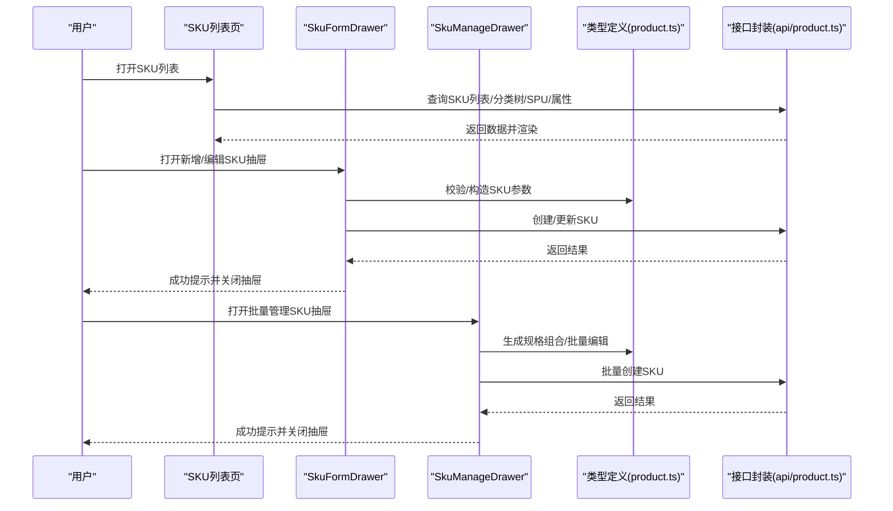
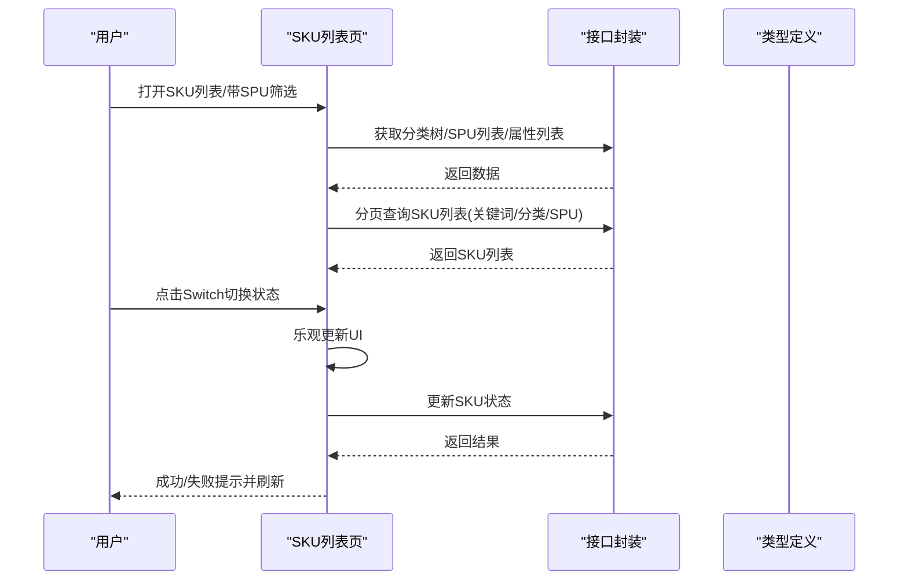
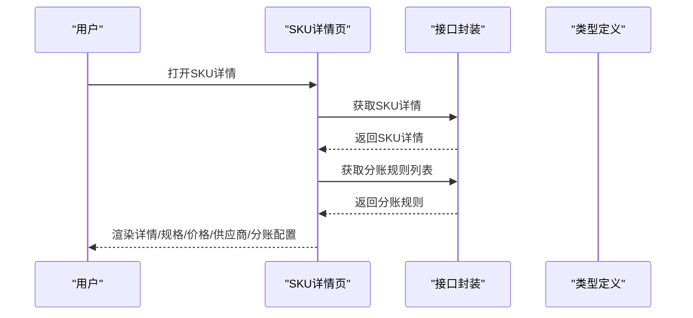
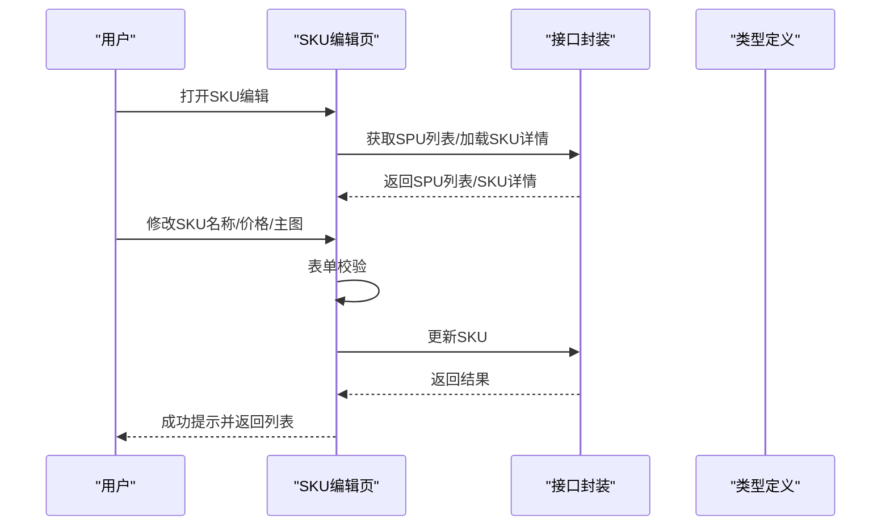
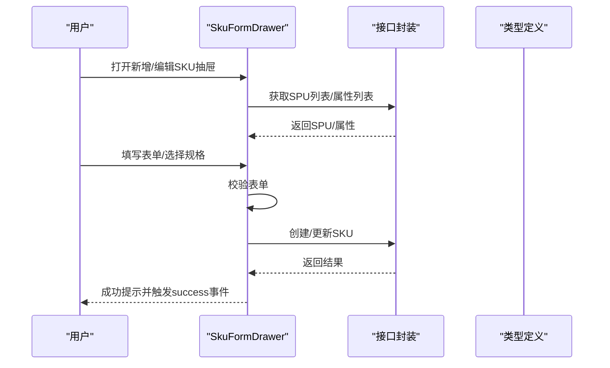
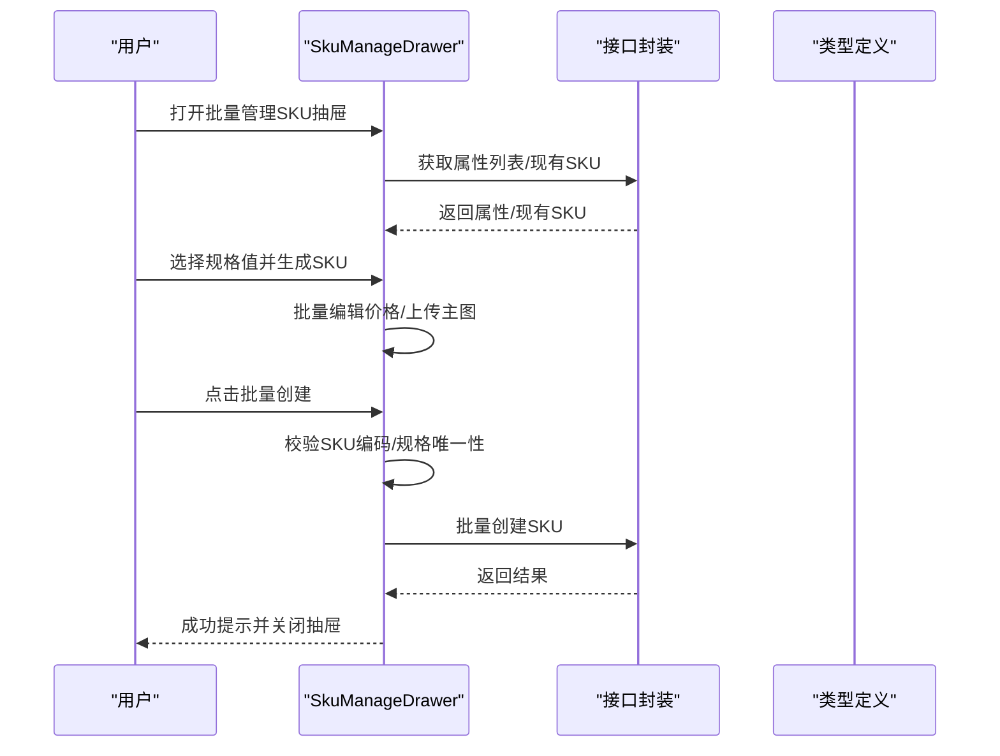
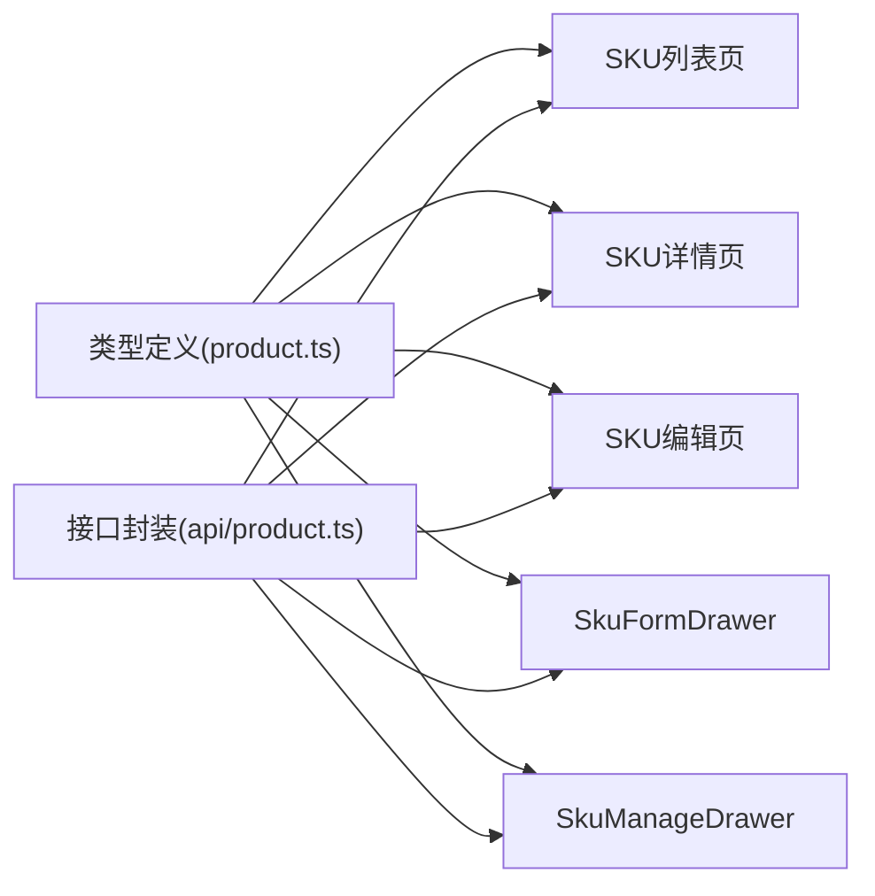

# SKU管理

<cite>
**本文引用的文件**
- [apps/pc/src/views/product/sku/index.vue](file://apps/pc/src/views/product/sku/index.vue)
- [apps/pc/src/views/product/sku/edit.vue](file://apps/pc/src/views/product/sku/edit.vue)
- [apps/pc/src/views/product/sku/view.vue](file://apps/pc/src/views/product/sku/view.vue)
- [apps/pc/src/views/product/sku/components/SkuFormDrawer.vue](file://apps/pc/src/views/product/sku/components/SkuFormDrawer.vue)
- [apps/pc/src/views/product/sku/components/SkuManageDrawer.vue](file://apps/pc/src/views/product/sku/components/SkuManageDrawer.vue)
- [packages/types/src/product.ts](file://packages/types/src/product.ts)
- [packages/api/src/product.ts](file://packages/api/src/product.ts)
- [docs/04_历史归档/2025_Q4/16-商品SKU菜单功能详细设计.md](file://docs/04_历史归档/2025_Q4/16-商品SKU菜单功能详细设计.md)
- [docs/04_历史归档/2025_Q4/18-SPU管理功能详细设计.md](file://docs/04_历史归档/2025_Q4/18-SPU管理功能详细设计.md)
</cite>

## 更新摘要
**变更内容**
- 从传统模态框升级为现代化抽屉式界面设计
- 新增SkuFormDrawer组件提供更好的用户体验
- 新增SkuManageDrawer组件支持批量SKU管理
- 抽屉式设计提升表单操作效率和视觉体验
- 改进规格属性管理和批量操作流程

## 目录
1. [简介](#简介)
2. [项目结构](#项目结构)
3. [核心组件](#核心组件)
4. [架构总览](#架构总览)
5. [详细组件分析](#详细组件分析)
6. [依赖分析](#依赖分析)
7. [性能考虑](#性能考虑)
8. [故障排查指南](#故障排查指南)
9. [结论](#结论)
10. [附录](#附录)

## 简介
本文件围绕"SKU管理"功能进行全面技术与业务说明，覆盖SKU基本信息维护、价格管理策略、库存管理机制、编辑表单设计、批量管理流程等核心能力；并深入阐述SKU与SPU的关联关系、规格属性映射、价格策略配置、库存预警设置等高级功能的实现细节与业务应用场景。文档同时提供面向开发与非技术读者的渐进式理解路径，辅以架构图与流程图帮助快速把握系统全貌。

**更新** 系统已从传统模态框升级为现代化抽屉式界面，提供更佳的用户体验和更高的操作效率。

## 项目结构
SKU管理功能主要分布在PC端商品中心模块，核心页面与组件如下：
- 列表页：SKU列表、筛选与分页、状态切换、批量操作入口
- 详情页：SKU完整信息、规格组合、价格信息、准入供应商、分账配置
- 编辑页：SKU基本信息与价格信息的编辑
- 抽屉组件：新增/编辑SKU表单抽屉、批量管理SKU抽屉（规格组合生成、批量编辑）

**图表来源**
- [apps/pc/src/views/product/sku/index.vue:1-800](file://apps/pc/src/views/product/sku/index.vue#L1-L800)
- [apps/pc/src/views/product/sku/view.vue:1-327](file://apps/pc/src/views/product/sku/view.vue#L1-L327)
- [apps/pc/src/views/product/sku/edit.vue:1-363](file://apps/pc/src/views/product/sku/edit.vue#L1-L363)
- [apps/pc/src/views/product/sku/components/SkuFormDrawer.vue:1-663](file://apps/pc/src/views/product/sku/components/SkuFormDrawer.vue#L1-L663)
- [apps/pc/src/views/product/sku/components/SkuManageDrawer.vue:1-621](file://apps/pc/src/views/product/sku/components/SkuManageDrawer.vue#L1-L621)
- [packages/types/src/product.ts:140-196](file://packages/types/src/product.ts#L140-L196)
- [packages/api/src/product.ts:182-221](file://packages/api/src/product.ts#L182-L221)

**章节来源**
- [apps/pc/src/views/product/sku/index.vue:1-800](file://apps/pc/src/views/product/sku/index.vue#L1-L800)
- [apps/pc/src/views/product/sku/view.vue:1-327](file://apps/pc/src/views/product/sku/view.vue#L1-L327)
- [apps/pc/src/views/product/sku/edit.vue:1-363](file://apps/pc/src/views/product/sku/edit.vue#L1-L363)
- [apps/pc/src/views/product/sku/components/SkuFormDrawer.vue:1-663](file://apps/pc/src/views/product/sku/components/SkuFormDrawer.vue#L1-L663)
- [apps/pc/src/views/product/sku/components/SkuManageDrawer.vue:1-621](file://apps/pc/src/views/product/sku/components/SkuManageDrawer.vue#L1-L621)
- [packages/types/src/product.ts:140-196](file://packages/types/src/product.ts#L140-L196)
- [packages/api/src/product.ts:182-221](file://packages/api/src/product.ts#L182-L221)

## 核心组件
- SKU列表页：提供搜索、筛选、分页、批量操作入口；支持按SPU筛选；支持上下架状态切换；支持新增SKU抽屉。
- SKU详情页：展示SKU基本信息、规格组合、价格信息、准入供应商、分账配置等；支持跳转编辑与查看SPU。
- SKU编辑页：支持SKU名称、主图、计量单位、价格信息等字段编辑。
- **SkuFormDrawer**：现代化抽屉式新增/编辑SKU表单，支持SPU选择、规格属性动态生成、图片上传、价格信息录入。
- **SkuManageDrawer**：现代化抽屉式批量管理SKU，支持规格属性组合生成SKU、批量编辑价格、批量创建SKU。

**更新** 所有表单操作现已采用抽屉式设计，提供更直观的用户体验和更高的操作效率。

**章节来源**
- [apps/pc/src/views/product/sku/index.vue:1-800](file://apps/pc/src/views/product/sku/index.vue#L1-L800)
- [apps/pc/src/views/product/sku/view.vue:1-327](file://apps/pc/src/views/product/sku/view.vue#L1-L327)
- [apps/pc/src/views/product/sku/edit.vue:1-363](file://apps/pc/src/views/product/sku/edit.vue#L1-L363)
- [apps/pc/src/views/product/sku/components/SkuFormDrawer.vue:1-663](file://apps/pc/src/views/product/sku/components/SkuFormDrawer.vue#L1-L663)
- [apps/pc/src/views/product/sku/components/SkuManageDrawer.vue:1-621](file://apps/pc/src/views/product/sku/components/SkuManageDrawer.vue#L1-L621)

## 架构总览
SKU管理的前端架构遵循"页面组件 + 抽屉组件 + 类型定义 + 接口封装"的分层设计：
- 页面组件负责列表、详情、编辑等场景的数据展示与交互；
- 抽屉组件承载复杂表单与批量流程，提供现代化的用户体验；
- 类型定义统一SKU、SPU、属性等数据结构；
- 接口封装统一调用后端API，屏蔽Mock与真实环境差异。

**更新** 抽屉式组件设计提升了用户交互体验，支持更复杂的表单操作和批量管理功能。

**图表来源**
- [apps/pc/src/views/product/sku/index.vue:568-584](file://apps/pc/src/views/product/sku/index.vue#L568-L584)
- [apps/pc/src/views/product/sku/components/SkuFormDrawer.vue:599-651](file://apps/pc/src/views/product/sku/components/SkuFormDrawer.vue#L599-L651)
- [apps/pc/src/views/product/sku/components/SkuManageDrawer.vue:496-548](file://apps/pc/src/views/product/sku/components/SkuManageDrawer.vue#L496-L548)
- [packages/types/src/product.ts:140-196](file://packages/types/src/product.ts#L140-L196)
- [packages/api/src/product.ts:182-221](file://packages/api/src/product.ts#L182-L221)

## 详细组件分析

### SKU列表页（SKU列表、筛选、状态切换、批量操作）
- 功能要点
  - 支持关键词搜索（SKU名称/编码）、分类级联筛选、所属SPU筛选；
  - 支持按SPU筛选联动：从SPU列表点击"管理SKU"自动带入spuId筛选；
  - 表格列包含主图、SKU编码、SKU名称、所属SPU、所属分类、规格、单位、价格、状态、创建时间；
  - 支持上下架状态切换（Switch开关），采用乐观更新+失败回滚；
  - 支持新增SKU抽屉、详情/编辑/删除操作按钮。
- 关键流程
  - 初始化加载分类树、SPU列表、属性列表；
  - 监听路由查询参数（spuId、categoryId）自动筛选；
  - 分页查询SKU列表，支持关键词、分类、SPU筛选；
  - 上下架切换：弹窗确认 -> 调用更新接口 -> 成功提示 -> 刷新列表。

**更新** 新增SKU操作现通过抽屉式表单完成，提供更直观的用户体验。

**图表来源**
- [apps/pc/src/views/product/sku/index.vue:508-524](file://apps/pc/src/views/product/sku/index.vue#L508-L524)
- [apps/pc/src/views/product/sku/index.vue:568-584](file://apps/pc/src/views/product/sku/index.vue#L568-L584)
- [apps/pc/src/views/product/sku/index.vue:604-620](file://apps/pc/src/views/product/sku/index.vue#L604-L620)
- [packages/api/src/product.ts:182-221](file://packages/api/src/product.ts#L182-L221)
- [packages/types/src/product.ts:135-138](file://packages/types/src/product.ts#L135-L138)

**章节来源**
- [apps/pc/src/views/product/sku/index.vue:1-800](file://apps/pc/src/views/product/sku/index.vue#L1-L800)
- [packages/api/src/product.ts:182-221](file://packages/api/src/product.ts#L182-L221)
- [packages/types/src/product.ts:135-138](file://packages/types/src/product.ts#L135-L138)

### SKU详情页（SKU信息、规格、价格、准入供应商、分账配置）
- 功能要点
  - 展示SKU基本信息（编码、名称、所属SPU、分类、单位、状态、条形码、品牌等）；
  - 规格组合以标签形式展示；
  - 价格信息展示供货基准价与建议销售价；
  - 准入供应商列表展示供应商名称、基础供货价、供货状态；
  - 分账配置展示规则名称、类型、分账比例、平台手续费、生效时间、状态；
  - 支持查看SPU与编辑SKU。
- 关键流程
  - 加载SKU详情；
  - 加载分账规则列表；
  - 支持跳转编辑与查看SPU。

**更新** 编辑操作现在通过SkuFormDrawer抽屉组件完成，提供更直观的编辑体验。

**图表来源**
- [apps/pc/src/views/product/sku/view.vue:199-222](file://apps/pc/src/views/product/sku/view.vue#L199-L222)
- [packages/api/src/product.ts:189-196](file://packages/api/src/product.ts#L189-L196)
- [packages/types/src/product.ts:198-209](file://packages/types/src/product.ts#L198-L209)

**章节来源**
- [apps/pc/src/views/product/sku/view.vue:1-327](file://apps/pc/src/views/product/sku/view.vue#L1-L327)
- [packages/api/src/product.ts:189-196](file://packages/api/src/product.ts#L189-L196)
- [packages/types/src/product.ts:198-209](file://packages/types/src/product.ts#L198-L209)

### SKU编辑页（SKU基本信息与价格编辑）
- 功能要点
  - 基本信息：所属SPU（禁用）、SKU编码（禁用）、SKU名称、规格属性（只读）、计量单位（禁用）、条形码（禁用）、主图上传；
  - 价格信息：供货价、销售价；
  - 保存成功后返回SKU列表。
- 关键流程
  - 加载SPU列表；
  - 加载SKU详情并填充表单；
  - 表单校验通过后调用更新接口。

**更新** 编辑功能现已集成到SkuFormDrawer抽屉组件中，提供更统一的编辑体验。

**图表来源**
- [apps/pc/src/views/product/sku/edit.vue:157-198](file://apps/pc/src/views/product/sku/edit.vue#L157-L198)
- [apps/pc/src/views/product/sku/edit.vue:218-235](file://apps/pc/src/views/product/sku/edit.vue#L218-L235)
- [packages/api/src/product.ts:205-212](file://packages/api/src/product.ts#L205-L212)
- [packages/types/src/product.ts:182-196](file://packages/types/src/product.ts#L182-L196)

**章节来源**
- [apps/pc/src/views/product/sku/edit.vue:1-363](file://apps/pc/src/views/product/sku/edit.vue#L1-L363)
- [packages/api/src/product.ts:205-212](file://packages/api/src/product.ts#L205-L212)
- [packages/types/src/product.ts:182-196](file://packages/types/src/product.ts#L182-L196)

### SkuFormDrawer（新增/编辑SKU表单）
- 功能要点
  - 所属SPU选择（支持搜索/选择）、SKU编码/名称、条形码、计量单位、主图/相册上传；
  - 价格信息：供货价、销售价、成本价、市场价；
  - 规格属性：继承SPU规格或自定义规格，支持动态增删；
  - 提交时校验必填字段，调用创建/更新接口。
- 关键流程
  - 选择SPU后加载属性列表；
  - 编辑模式下加载SKU详情并处理自定义规格；
  - 提交时准备规格键值对，调用接口。

**更新** 采用现代化抽屉式设计，提供更直观的表单布局和更好的用户体验。

**图表来源**
- [apps/pc/src/views/product/sku/components/SkuFormDrawer.vue:342-355](file://apps/pc/src/views/product/sku/components/SkuFormDrawer.vue#L342-L355)
- [apps/pc/src/views/product/sku/components/SkuFormDrawer.vue:422-438](file://apps/pc/src/views/product/sku/components/SkuFormDrawer.vue#L422-L438)
- [apps/pc/src/views/product/sku/components/SkuFormDrawer.vue:599-651](file://apps/pc/src/views/product/sku/components/SkuFormDrawer.vue#L599-L651)
- [packages/api/src/product.ts:198-212](file://packages/api/src/product.ts#L198-L212)
- [packages/types/src/product.ts:166-196](file://packages/types/src/product.ts#L166-L196)

**章节来源**
- [apps/pc/src/views/product/sku/components/SkuFormDrawer.vue:1-663](file://apps/pc/src/views/product/sku/components/SkuFormDrawer.vue#L1-L663)
- [packages/api/src/product.ts:198-212](file://packages/api/src/product.ts#L198-L212)
- [packages/types/src/product.ts:166-196](file://packages/types/src/product.ts#L166-L196)

### SkuManageDrawer（批量管理SKU）
- 功能要点
  - 步骤1：规格属性组合生成SKU（多选规格值，生成规格组合，支持批量编辑价格）；
  - 步骤2：SKU编辑（批量编辑价格、上传主图、填写SKU编码/名称、删除SKU）；
  - 批量创建SKU：校验SKU编码与规格组合唯一性后批量创建。
- 关键流程
  - 加载SPU属性列表与现有SKU；
  - 生成规格组合并预览；
  - 批量编辑价格；
  - 批量创建SKU并提示结果。

**更新** 采用现代化抽屉式设计，支持两步流程化的批量管理，提供更好的用户体验。

**图表来源**
- [apps/pc/src/views/product/sku/components/SkuManageDrawer.vue:323-342](file://apps/pc/src/views/product/sku/components/SkuManageDrawer.vue#L323-L342)
- [apps/pc/src/views/product/sku/components/SkuManageDrawer.vue:354-381](file://apps/pc/src/views/product/sku/components/SkuManageDrawer.vue#L354-L381)
- [apps/pc/src/views/product/sku/components/SkuManageDrawer.vue:458-489](file://apps/pc/src/views/product/sku/components/SkuManageDrawer.vue#L458-L489)
- [apps/pc/src/views/product/sku/components/SkuManageDrawer.vue:496-548](file://apps/pc/src/views/product/sku/components/SkuManageDrawer.vue#L496-L548)
- [packages/api/src/product.ts:198-203](file://packages/api/src/product.ts#L198-L203)
- [packages/types/src/product.ts:211-216](file://packages/types/src/product.ts#L211-L216)

**章节来源**
- [apps/pc/src/views/product/sku/components/SkuManageDrawer.vue:1-621](file://apps/pc/src/views/product/sku/components/SkuManageDrawer.vue#L1-L621)
- [packages/api/src/product.ts:198-203](file://packages/api/src/product.ts#L198-L203)
- [packages/types/src/product.ts:211-216](file://packages/types/src/product.ts#L211-L216)

## 依赖分析
- 类型依赖
  - SKU、SPU、属性、价格信息、分账规则等类型定义集中在产品类型模块，确保前后端数据结构一致。
- 接口依赖
  - SKU列表、详情、创建、更新、删除、批量更新状态等接口由产品接口封装统一暴露，屏蔽Mock与真实环境差异。
- 页面/组件依赖
  - 列表页依赖接口封装与类型定义；详情页依赖接口封装与类型定义；编辑页依赖接口封装与类型定义；抽屉组件依赖接口封装与类型定义。

**更新** 抽屉组件现在成为SKU管理的核心交互组件，承担了大部分表单操作功能。

**图表来源**
- [packages/types/src/product.ts:140-196](file://packages/types/src/product.ts#L140-L196)
- [packages/api/src/product.ts:182-221](file://packages/api/src/product.ts#L182-L221)
- [apps/pc/src/views/product/sku/index.vue:1-800](file://apps/pc/src/views/product/sku/index.vue#L1-L800)
- [apps/pc/src/views/product/sku/view.vue:1-327](file://apps/pc/src/views/product/sku/view.vue#L1-L327)
- [apps/pc/src/views/product/sku/edit.vue:1-363](file://apps/pc/src/views/product/sku/edit.vue#L1-L363)
- [apps/pc/src/views/product/sku/components/SkuFormDrawer.vue:1-663](file://apps/pc/src/views/product/sku/components/SkuFormDrawer.vue#L1-L663)
- [apps/pc/src/views/product/sku/components/SkuManageDrawer.vue:1-621](file://apps/pc/src/views/product/sku/components/SkuManageDrawer.vue#L1-L621)

**章节来源**
- [packages/types/src/product.ts:140-196](file://packages/types/src/product.ts#L140-L196)
- [packages/api/src/product.ts:182-221](file://packages/api/src/product.ts#L182-L221)

## 性能考虑
- 列表查询优化
  - 分页加载，避免一次性加载大量SKU；
  - 搜索与筛选采用防抖与即时查询结合，减少不必要的请求。
- 图片优化
  - 列表缩略图采用固定尺寸与裁剪，提升渲染性能；
  - 抽屉组件中图片上传采用本地URL预览，减少网络请求。
- 规模控制
  - 批量管理SKU时限制规格组合数量，避免生成过多SKU导致性能问题；
  - 批量创建SKU前进行唯一性校验，减少后端压力。
- **抽屉式交互优化**
  - 抽屉组件支持异步加载，避免阻塞主界面；
  - 规格属性动态加载，减少初始渲染压力；
  - 批量操作采用分步处理，提升用户体验。

**更新** 抽屉式设计提供了更好的性能表现，特别是在处理复杂表单和批量操作时。

## 故障排查指南
- 常见问题
  - SKU不存在：接口返回错误时，提示"SKU不存在"，引导返回列表；
  - SKU编码/名称重复：提示重复并建议修改；
  - 规格组合重复：提示重复并建议调整规格；
  - 网络错误：显示错误提示并提供重试按钮；
  - 图片上传失败：提示上传失败，请检查图片格式与大小。
- 排查步骤
  - 检查接口返回状态与错误信息；
  - 校验表单必填字段与唯一性；
  - 确认图片格式与大小限制；
  - 检查规格组合生成逻辑与唯一性校验。

**更新** 抽屉式组件提供了更好的错误提示和用户反馈机制。

**章节来源**
- [packages/api/src/product.ts:189-196](file://packages/api/src/product.ts#L189-L196)
- [apps/pc/src/views/product/sku/components/SkuFormDrawer.vue:646-651](file://apps/pc/src/views/product/sku/components/SkuFormDrawer.vue#L646-L651)
- [apps/pc/src/views/product/sku/components/SkuManageDrawer.vue:503-520](file://apps/pc/src/views/product/sku/components/SkuManageDrawer.vue#L503-L520)

## 结论
SKU管理功能通过"页面组件 + 抽屉组件 + 类型定义 + 接口封装"的架构设计，实现了SKU基本信息维护、价格管理策略、库存管理机制、编辑表单设计与批量管理等核心能力。配合SKU与SPU的关联关系、规格属性映射、价格策略配置与分账配置，能够满足复杂的商品中心业务场景。

**更新** 系统已从传统模态框升级为现代化抽屉式界面，显著提升了用户体验和操作效率。建议在后续迭代中进一步完善库存预警、价格策略自动化与批量导入导出等高级功能。

## 附录

### SKU与SPU关联关系
- SKU继承SPU的基本属性（计量单位、主图、相册等）；
- SKU与SPU通过spuId建立一对一关联；
- 从SPU详情页可直接跳转至该SPU下的SKU列表，实现无缝切换。

**章节来源**
- [docs/04_历史归档/2025_Q4/18-SPU管理功能详细设计.md:360-383](file://docs/04_历史归档/2025_Q4/18-SPU管理功能详细设计.md#L360-L383)
- [apps/pc/src/views/product/sku/index.vue:511-521](file://apps/pc/src/views/product/sku/index.vue#L511-L521)

### 规格属性映射
- SKU规格来源于SPU的规格属性，支持继承与自定义；
- 规格组合采用键值对结构，保证唯一性；
- 批量管理SKU时通过规格属性组合生成SKU，支持批量编辑价格与主图。

**更新** 抽屉式组件提供了更直观的规格属性管理界面。

**章节来源**
- [apps/pc/src/views/product/sku/components/SkuFormDrawer.vue:470-477](file://apps/pc/src/views/product/sku/components/SkuFormDrawer.vue#L470-L477)
- [apps/pc/src/views/product/sku/components/SkuManageDrawer.vue:354-381](file://apps/pc/src/views/product/sku/components/SkuManageDrawer.vue#L354-L381)

### 价格策略配置
- SKU支持设置供货价、销售价、成本价、市场价；
- 批量管理SKU时支持批量编辑价格；
- 详情页展示建议销售价与准入供应商的基础供货价，便于比价与定价。

**更新** 抽屉式表单提供了更便捷的价格信息录入和编辑体验。

**章节来源**
- [apps/pc/src/views/product/sku/components/SkuFormDrawer.vue:68-126](file://apps/pc/src/views/product/sku/components/SkuFormDrawer.vue#L68-L126)
- [apps/pc/src/views/product/sku/components/SkuManageDrawer.vue:249-281](file://apps/pc/src/views/product/sku/components/SkuManageDrawer.vue#L249-L281)
- [apps/pc/src/views/product/sku/view.vue:69-103](file://apps/pc/src/views/product/sku/view.vue#L69-L103)

### 库存管理机制
- SKU详情页展示SKU的库存相关信息（库存总量、可用量、锁定量等）；
- 与仓库模块联动，支持库存盘点、调拨、出入库等操作；
- 支持库存预警设置，结合业务规则进行提醒与处理。

**更新** 抽屉式设计使得库存管理相关的表单操作更加直观和高效。

**章节来源**
- [apps/pc/src/views/product/sku/view.vue:1-327](file://apps/pc/src/views/product/sku/view.vue#L1-L327)
- [packages/types/src/product.ts:273-293](file://packages/types/src/product.ts#L273-L293)