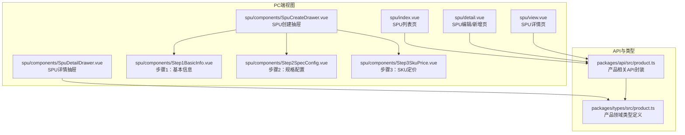
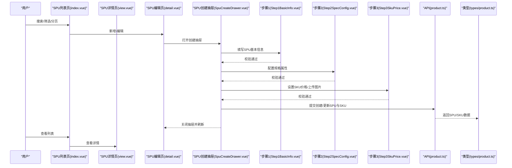
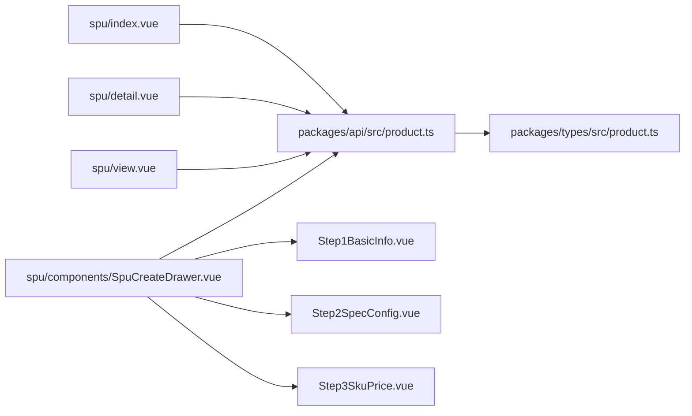
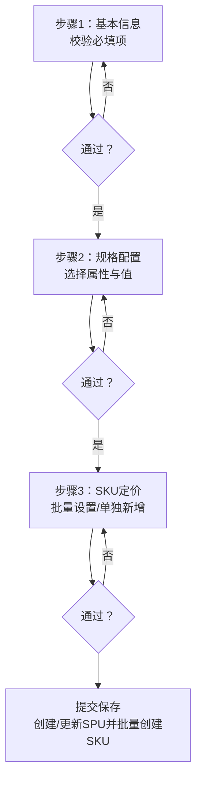

# SPU管理

<cite>
**本文引用的文件**
- [apps/pc/src/views/product/spu/index.vue](file://apps/pc/src/views/product/spu/index.vue)
- [apps/pc/src/views/product/spu/detail.vue](file://apps/pc/src/views/product/spu/detail.vue)
- [apps/pc/src/views/product/spu/view.vue](file://apps/pc/src/views/product/spu/view.vue)
- [apps/pc/src/views/product/spu/components/Step1BasicInfo.vue](file://apps/pc/src/views/product/spu/components/Step1BasicInfo.vue)
- [apps/pc/src/views/product/spu/components/Step2SpecConfig.vue](file://apps/pc/src/views/product/spu/components/Step2SpecConfig.vue)
- [apps/pc/src/views/product/spu/components/Step3SkuPrice.vue](file://apps/pc/src/views/product/spu/components/Step3SkuPrice.vue)
- [apps/pc/src/views/product/spu/components/SpuCreateDrawer.vue](file://apps/pc/src/views/product/spu/components/SpuCreateDrawer.vue)
- [apps/pc/src/views/product/spu/components/SpuDetailDrawer.vue](file://apps/pc/src/views/product/spu/components/SpuDetailDrawer.vue)
- [packages/api/src/product.ts](file://packages/api/src/product.ts)
- [packages/types/src/product.ts](file://packages/types/src/product.ts)
- [docs/PRD/18-SPU管理功能详细设计.md](file://docs/PRD/18-SPU管理功能详细设计.md)
</cite>

## 目录
1. [简介](#简介)
2. [项目结构](#项目结构)
3. [核心组件](#核心组件)
4. [架构总览](#架构总览)
5. [详细组件分析](#详细组件分析)
6. [依赖关系分析](#依赖关系分析)
7. [性能考量](#性能考量)
8. [故障排查指南](#故障排查指南)
9. [结论](#结论)
10. [附录](#附录)

## 简介
本文件面向“SPU管理”功能，围绕SPU基本信息管理、图片上传与管理、规格配置流程、价格设置、详情查看、编辑修改、状态管理与批量操作等核心能力进行系统化说明，并结合PRD文档梳理三步创建向导（基本信息、规格配置、价格设置）的数据收集、校验规则、状态流转与业务约束，帮助开发者与产品、运营人员高效理解与落地。

## 项目结构
SPU管理主要分布在PC端商品中心的“SPU”页面与抽屉式组件中，配合API层与类型定义完成前后端交互与数据契约。

图表来源
- [apps/pc/src/views/product/spu/index.vue:1-473](file://apps/pc/src/views/product/spu/index.vue#L1-L473)
- [apps/pc/src/views/product/spu/detail.vue:1-800](file://apps/pc/src/views/product/spu/detail.vue#L1-L800)
- [apps/pc/src/views/product/spu/view.vue:1-314](file://apps/pc/src/views/product/spu/view.vue#L1-L314)
- [apps/pc/src/views/product/spu/components/SpuCreateDrawer.vue:1-235](file://apps/pc/src/views/product/spu/components/SpuCreateDrawer.vue#L1-L235)
- [apps/pc/src/views/product/spu/components/Step1BasicInfo.vue:1-142](file://apps/pc/src/views/product/spu/components/Step1BasicInfo.vue#L1-L142)
- [apps/pc/src/views/product/spu/components/Step2SpecConfig.vue:1-331](file://apps/pc/src/views/product/spu/components/Step2SpecConfig.vue#L1-L331)
- [apps/pc/src/views/product/spu/components/Step3SkuPrice.vue:1-601](file://apps/pc/src/views/product/spu/components/Step3SkuPrice.vue#L1-L601)
- [packages/api/src/product.ts:1-258](file://packages/api/src/product.ts#L1-L258)
- [packages/types/src/product.ts:1-431](file://packages/types/src/product.ts#L1-L431)

章节来源
- [apps/pc/src/views/product/spu/index.vue:1-473](file://apps/pc/src/views/product/spu/index.vue#L1-L473)
- [apps/pc/src/views/product/spu/detail.vue:1-800](file://apps/pc/src/views/product/spu/detail.vue#L1-L800)
- [apps/pc/src/views/product/spu/view.vue:1-314](file://apps/pc/src/views/product/spu/view.vue#L1-L314)
- [apps/pc/src/views/product/spu/components/SpuCreateDrawer.vue:1-235](file://apps/pc/src/views/product/spu/components/SpuCreateDrawer.vue#L1-L235)
- [apps/pc/src/views/product/spu/components/Step1BasicInfo.vue:1-142](file://apps/pc/src/views/product/spu/components/Step1BasicInfo.vue#L1-L142)
- [apps/pc/src/views/product/spu/components/Step2SpecConfig.vue:1-331](file://apps/pc/src/views/product/spu/components/Step2SpecConfig.vue#L1-L331)
- [apps/pc/src/views/product/spu/components/Step3SkuPrice.vue:1-601](file://apps/pc/src/views/product/spu/components/Step3SkuPrice.vue#L1-L601)
- [packages/api/src/product.ts:1-258](file://packages/api/src/product.ts#L1-L258)
- [packages/types/src/product.ts:1-431](file://packages/types/src/product.ts#L1-L431)

## 核心组件
- SPU列表页：提供搜索、筛选、分页、新增、编辑、详情、管理SKU、删除等能力。
- SPU编辑/新增页：三步向导（基本信息、规格配置、SKU定价），支持图片上传、批量设置价格、单独新增SKU等。
- SPU详情页：查看SPU基本信息、SKU列表、分账配置与操作记录。
- 抽屉组件：SPU创建抽屉与SPU详情抽屉，承载向导与详情展示。
- API封装：统一调用SPU/SKU相关接口，屏蔽Mock与真实环境差异。
- 类型定义：SPU、SKU、规格属性、状态枚举等强类型定义。

章节来源
- [apps/pc/src/views/product/spu/index.vue:1-473](file://apps/pc/src/views/product/spu/index.vue#L1-L473)
- [apps/pc/src/views/product/spu/detail.vue:1-800](file://apps/pc/src/views/product/spu/detail.vue#L1-L800)
- [apps/pc/src/views/product/spu/view.vue:1-314](file://apps/pc/src/views/product/spu/view.vue#L1-L314)
- [apps/pc/src/views/product/spu/components/SpuCreateDrawer.vue:1-235](file://apps/pc/src/views/product/spu/components/SpuCreateDrawer.vue#L1-L235)
- [apps/pc/src/views/product/spu/components/SpuDetailDrawer.vue:1-98](file://apps/pc/src/views/product/spu/components/SpuDetailDrawer.vue#L1-L98)
- [packages/api/src/product.ts:1-258](file://packages/api/src/product.ts#L1-L258)
- [packages/types/src/product.ts:1-431](file://packages/types/src/product.ts#L1-L431)

## 架构总览
SPU管理采用“页面组件 + 抽屉组件 + 步骤组件 + API封装 + 类型定义”的分层架构，页面负责交互与状态管理，抽屉承载复杂表单向导，步骤组件拆分业务流程，API层统一处理数据访问，类型层确保数据契约一致。

图表来源
- [apps/pc/src/views/product/spu/index.vue:1-473](file://apps/pc/src/views/product/spu/index.vue#L1-L473)
- [apps/pc/src/views/product/spu/view.vue:1-314](file://apps/pc/src/views/product/spu/view.vue#L1-L314)
- [apps/pc/src/views/product/spu/detail.vue:1-800](file://apps/pc/src/views/product/spu/detail.vue#L1-L800)
- [apps/pc/src/views/product/spu/components/SpuCreateDrawer.vue:1-235](file://apps/pc/src/views/product/spu/components/SpuCreateDrawer.vue#L1-L235)
- [apps/pc/src/views/product/spu/components/Step1BasicInfo.vue:1-142](file://apps/pc/src/views/product/spu/components/Step1BasicInfo.vue#L1-L142)
- [apps/pc/src/views/product/spu/components/Step2SpecConfig.vue:1-331](file://apps/pc/src/views/product/spu/components/Step2SpecConfig.vue#L1-L331)
- [apps/pc/src/views/product/spu/components/Step3SkuPrice.vue:1-601](file://apps/pc/src/views/product/spu/components/Step3SkuPrice.vue#L1-L601)
- [packages/api/src/product.ts:1-258](file://packages/api/src/product.ts#L1-L258)
- [packages/types/src/product.ts:1-431](file://packages/types/src/product.ts#L1-L431)

## 详细组件分析

### SPU列表页（index.vue）
- 功能要点
  - 搜索：支持按SPU名称/编码模糊搜索，回车触发。
  - 筛选：三级分类级联选择，自动筛选该分类下的SPU。
  - 列表：主图、SPU编码、名称、分类、单位、关联属性、SKU数量、创建时间；操作列支持详情、编辑、管理SKU、删除。
  - 分页：分页加载，支持页码切换。
  - 新增：跳转至新增SPU页面。
- 交互与状态
  - 监听路由参数categoryId，支持从分类树跳转自动带参筛选。
  - 删除采用二次确认，成功后刷新列表。
- 关键实现位置
  - 搜索与分页：[apps/pc/src/views/product/spu/index.vue:428-436](file://apps/pc/src/views/product/spu/index.vue#L428-L436)
  - 删除确认与调用：[apps/pc/src/views/product/spu/index.vue:457-471](file://apps/pc/src/views/product/spu/index.vue#L457-L471)
  - 路由跳转：[apps/pc/src/views/product/spu/index.vue:438-455](file://apps/pc/src/views/product/spu/index.vue#L438-L455)

章节来源
- [apps/pc/src/views/product/spu/index.vue:1-473](file://apps/pc/src/views/product/spu/index.vue#L1-L473)
- [docs/PRD/18-SPU管理功能详细设计.md:124-191](file://docs/PRD/18-SPU管理功能详细设计.md#L124-L191)

### SPU详情页（view.vue）
- 功能要点
  - 基本信息展示：SPU名称、编码、分类、单位、SKU数量、状态、主图/相册、描述。
  - SKU列表：展示SKU编码、名称、规格组合、价格与状态。
  - 分账配置：展示分账规则列表（名称、类型、比例、生效时间、状态）。
  - 操作：管理SKU、编辑、返回。
- 交互与状态
  - 通过API加载SPU详情、SKU列表、分账规则。
  - 打开SKU管理抽屉后，抽屉成功回调会刷新详情数据。
- 关键实现位置
  - 加载详情与SKU：[apps/pc/src/views/product/spu/view.vue:198-214](file://apps/pc/src/views/product/spu/view.vue#L198-L214)
  - 打开SKU管理抽屉：[apps/pc/src/views/product/spu/view.vue:224-230](file://apps/pc/src/views/product/spu/view.vue#L224-L230)

章节来源
- [apps/pc/src/views/product/spu/view.vue:1-314](file://apps/pc/src/views/product/spu/view.vue#L1-L314)
- [packages/api/src/product.ts:148-180](file://packages/api/src/product.ts#L148-L180)

### SPU编辑/新增页（detail.vue）
- 功能要点
  - 基本信息：SPU名称、编码、分类、单位、主图、相册、描述、备注。
  - 规格属性：选择规格属性、设置属性值，实时预览SKU数量。
  - SKU列表：批量设置价格、清空价格、上传SKU主图、编辑规格、单独新增SKU、删除SKU。
- 交互与状态
  - 从API加载分类树与属性列表，编辑时回填SPU详情。
  - 主图变化时同步更新SKU默认主图。
  - 生成SKU采用笛卡尔积算法，去重合并手动新增SKU。
- 关键实现位置
  - 加载分类树与属性：[apps/pc/src/views/product/spu/detail.vue:542-566](file://apps/pc/src/views/product/spu/detail.vue#L542-L566)
  - 生成SKU列表：[apps/pc/src/views/product/spu/detail.vue:702-753](file://apps/pc/src/views/product/spu/detail.vue#L702-L753)
  - 批量设置价格：[apps/pc/src/views/product/spu/detail.vue:772-787](file://apps/pc/src/views/product/spu/detail.vue#L772-L787)

章节来源
- [apps/pc/src/views/product/spu/detail.vue:1-800](file://apps/pc/src/views/product/spu/detail.vue#L1-L800)
- [packages/api/src/product.ts:100-140](file://packages/api/src/product.ts#L100-L140)

### SPU创建抽屉（SpuCreateDrawer.vue）
- 功能要点
  - 三步向导：基本信息、规格配置、SKU定价。
  - 步骤间校验：每步通过validate后再进入下一步。
  - 提交：创建/更新SPU并批量创建SKU。
- 交互与状态
  - 通过ref调用各步骤组件validate方法。
  - 提交时构造SPU参数与SKU数组，逐条创建SKU。
- 关键实现位置
  - 下一步与校验：[apps/pc/src/views/product/spu/components/SpuCreateDrawer.vue:141-151](file://apps/pc/src/views/product/spu/components/SpuCreateDrawer.vue#L141-L151)
  - 提交保存：[apps/pc/src/views/product/spu/components/SpuCreateDrawer.vue:159-210](file://apps/pc/src/views/product/spu/components/SpuCreateDrawer.vue#L159-L210)

章节来源
- [apps/pc/src/views/product/spu/components/SpuCreateDrawer.vue:1-235](file://apps/pc/src/views/product/spu/components/SpuCreateDrawer.vue#L1-L235)
- [apps/pc/src/views/product/spu/components/Step1BasicInfo.vue:1-142](file://apps/pc/src/views/product/spu/components/Step1BasicInfo.vue#L1-L142)
- [apps/pc/src/views/product/spu/components/Step2SpecConfig.vue:1-331](file://apps/pc/src/views/product/spu/components/Step2SpecConfig.vue#L1-L331)
- [apps/pc/src/views/product/spu/components/Step3SkuPrice.vue:1-601](file://apps/pc/src/views/product/spu/components/Step3SkuPrice.vue#L1-L601)

### 步骤组件

#### 步骤1：基本信息（Step1BasicInfo.vue）
- 字段与校验
  - SPU名称、SPU编码、所属分类、计量单位、主图、相册、描述、备注。
  - 校验规则：必填项、长度限制、URL格式等。
- 交互
  - 图片URL输入与回车添加，支持删除。
- 关键实现位置
  - 表单与校验：[apps/pc/src/views/product/spu/components/Step1BasicInfo.vue:2-73](file://apps/pc/src/views/product/spu/components/Step1BasicInfo.vue#L2-L73)
  - 图片URL添加/删除：[apps/pc/src/views/product/spu/components/Step1BasicInfo.vue:107-116](file://apps/pc/src/views/product/spu/components/Step1BasicInfo.vue#L107-L116)

章节来源
- [apps/pc/src/views/product/spu/components/Step1BasicInfo.vue:1-142](file://apps/pc/src/views/product/spu/components/Step1BasicInfo.vue#L1-L142)
- [docs/PRD/18-SPU管理功能详细设计.md:516-536](file://docs/PRD/18-SPU管理功能详细设计.md#L516-L536)

#### 步骤2：规格配置（Step2SpecConfig.vue）
- 功能
  - 选择规格属性（从系统属性库选择或自定义），设置属性值，生成SKU预览。
- 校验
  - 至少选择一个规格属性，且每个规格至少有一个属性值。
- 交互
  - 展示SKU预览组合数量与部分组合预览。
- 关键实现位置
  - 属性选择与过滤：[apps/pc/src/views/product/spu/components/Step2SpecConfig.vue:96-103](file://apps/pc/src/views/product/spu/components/Step2SpecConfig.vue#L96-L103)
  - SKU数量与组合预览：[apps/pc/src/views/product/spu/components/Step2SpecConfig.vue:105-134](file://apps/pc/src/views/product/spu/components/Step2SpecConfig.vue#L105-L134)
  - 生成SKU列表：[apps/pc/src/views/product/spu/components/Step2SpecConfig.vue:185-220](file://apps/pc/src/views/product/spu/components/Step2SpecConfig.vue#L185-L220)

章节来源
- [apps/pc/src/views/product/spu/components/Step2SpecConfig.vue:1-331](file://apps/pc/src/views/product/spu/components/Step2SpecConfig.vue#L1-L331)
- [docs/PRD/18-SPU管理功能详细设计.md:69-106](file://docs/PRD/18-SPU管理功能详细设计.md#L69-L106)

#### 步骤3：SKU定价（Step3SkuPrice.vue）
- 功能
  - 批量设置价格（建议零售价、供货价、销售价）、清空价格。
  - 单独新增SKU（可自定义规格或从已有规格选择）。
  - 编辑SKU规格组合。
- 交互
  - 批量设置价格弹窗，留空字段不修改。
  - 单独新增SKU时，校验规格组合唯一性。
- 关键实现位置
  - 批量设置价格：[apps/pc/src/views/product/spu/components/Step3SkuPrice.vue:340-347](file://apps/pc/src/views/product/spu/components/Step3SkuPrice.vue#L340-L347)
  - 清空价格：[apps/pc/src/views/product/spu/components/Step3SkuPrice.vue:349-355](file://apps/pc/src/views/product/spu/components/Step3SkuPrice.vue#L349-L355)
  - 单独新增SKU：[apps/pc/src/views/product/spu/components/Step3SkuPrice.vue:464-531](file://apps/pc/src/views/product/spu/components/Step3SkuPrice.vue#L464-L531)

章节来源
- [apps/pc/src/views/product/spu/components/Step3SkuPrice.vue:1-601](file://apps/pc/src/views/product/spu/components/Step3SkuPrice.vue#L1-L601)
- [docs/PRD/18-SPU管理功能详细设计.md:427-482](file://docs/PRD/18-SPU管理功能详细设计.md#L427-L482)

### API与类型

#### API封装（packages/api/src/product.ts）
- 能力覆盖
  - 分类树、属性列表、SPU列表/详情、SPU创建/更新/删除、SKU列表/详情、批量上下架等。
- Mock策略
  - 通过isMock开关统一走Mock实现，便于开发调试。
- 关键实现位置
  - SPULIST/DETAIL/CREATE/UPDATE/DELETE：[packages/api/src/product.ts:141-180](file://packages/api/src/product.ts#L141-L180)
  - SKU相关：[packages/api/src/product.ts:182-236](file://packages/api/src/product.ts#L182-L236)

章节来源
- [packages/api/src/product.ts:1-258](file://packages/api/src/product.ts#L1-L258)
- [packages/types/src/product.ts:1-431](file://packages/types/src/product.ts#L1-L431)

#### 类型定义（packages/types/src/product.ts）
- 核心类型
  - Spu、Sku、ProductCategory、ProductAttr、SkuPriceInfo、状态枚举等。
- 关键实现位置
  - Spu/Sku接口与状态枚举：[packages/types/src/product.ts:90-164](file://packages/types/src/product.ts#L90-L164)
  - 规格属性与枚举：[packages/types/src/product.ts:52-88](file://packages/types/src/product.ts#L52-L88)

章节来源
- [packages/types/src/product.ts:1-431](file://packages/types/src/product.ts#L1-L431)

## 依赖关系分析

图表来源
- [apps/pc/src/views/product/spu/index.vue:1-473](file://apps/pc/src/views/product/spu/index.vue#L1-L473)
- [apps/pc/src/views/product/spu/detail.vue:1-800](file://apps/pc/src/views/product/spu/detail.vue#L1-L800)
- [apps/pc/src/views/product/spu/view.vue:1-314](file://apps/pc/src/views/product/spu/view.vue#L1-L314)
- [apps/pc/src/views/product/spu/components/SpuCreateDrawer.vue:1-235](file://apps/pc/src/views/product/spu/components/SpuCreateDrawer.vue#L1-L235)
- [apps/pc/src/views/product/spu/components/Step1BasicInfo.vue:1-142](file://apps/pc/src/views/product/spu/components/Step1BasicInfo.vue#L1-L142)
- [apps/pc/src/views/product/spu/components/Step2SpecConfig.vue:1-331](file://apps/pc/src/views/product/spu/components/Step2SpecConfig.vue#L1-L331)
- [apps/pc/src/views/product/spu/components/Step3SkuPrice.vue:1-601](file://apps/pc/src/views/product/spu/components/Step3SkuPrice.vue#L1-L601)
- [packages/api/src/product.ts:1-258](file://packages/api/src/product.ts#L1-L258)
- [packages/types/src/product.ts:1-431](file://packages/types/src/product.ts#L1-L431)

## 性能考量
- 列表查询优化
  - 分页加载、索引建议（SPU名称、编码、分类ID）、图片懒加载。
- SKU生成优化
  - 前端预生成笛卡尔积，限制SKU数量上限，避免超大组合导致性能问题。
- 图片优化
  - 图片压缩、CDN加速、统一尺寸裁剪。
- 缓存优化
  - 缓存分类树、SPU详情、属性列表，减少重复请求。

章节来源
- [docs/PRD/18-SPU管理功能详细设计.md:763-785](file://docs/PRD/18-SPU管理功能详细设计.md#L763-L785)

## 故障排查指南
- 常见异常与提示
  - 网络错误：提供重试按钮。
  - SPU不存在/分类不存在：刷新列表并提示用户。
  - 名称/编码重复：提示修改。
  - 删除阻断：有SKU/供货关系/订单时阻止删除并提示。
  - 表单校验失败：高亮错误字段，提示完善。
  - 价格非法：提示大于0。
- 关键实现位置
  - 删除二次确认与调用：[apps/pc/src/views/product/spu/index.vue:457-471](file://apps/pc/src/views/product/spu/index.vue#L457-L471)
  - 异常场景提示：[docs/PRD/18-SPU管理功能详细设计.md:744-760](file://docs/PRD/18-SPU管理功能详细设计.md#L744-L760)

章节来源
- [apps/pc/src/views/product/spu/index.vue:457-471](file://apps/pc/src/views/product/spu/index.vue#L457-L471)
- [docs/PRD/18-SPU管理功能详细设计.md:744-760](file://docs/PRD/18-SPU管理功能详细设计.md#L744-L760)

## 结论
SPU管理功能通过清晰的页面与组件分层、严谨的三步向导与校验、完善的API与类型契约，实现了从SPU创建、编辑、详情查看到SKU管理与批量操作的完整闭环。遵循PRD中的业务规则与性能优化建议，可在保证用户体验的同时提升系统稳定性与扩展性。

## 附录

### 三步创建向导流程图

图表来源
- [apps/pc/src/views/product/spu/components/SpuCreateDrawer.vue:141-151](file://apps/pc/src/views/product/spu/components/SpuCreateDrawer.vue#L141-L151)
- [apps/pc/src/views/product/spu/components/Step1BasicInfo.vue:96-105](file://apps/pc/src/views/product/spu/components/Step1BasicInfo.vue#L96-L105)
- [apps/pc/src/views/product/spu/components/Step2SpecConfig.vue:222-230](file://apps/pc/src/views/product/spu/components/Step2SpecConfig.vue#L222-L230)
- [apps/pc/src/views/product/spu/components/Step3SkuPrice.vue:533-537](file://apps/pc/src/views/product/spu/components/Step3SkuPrice.vue#L533-L537)