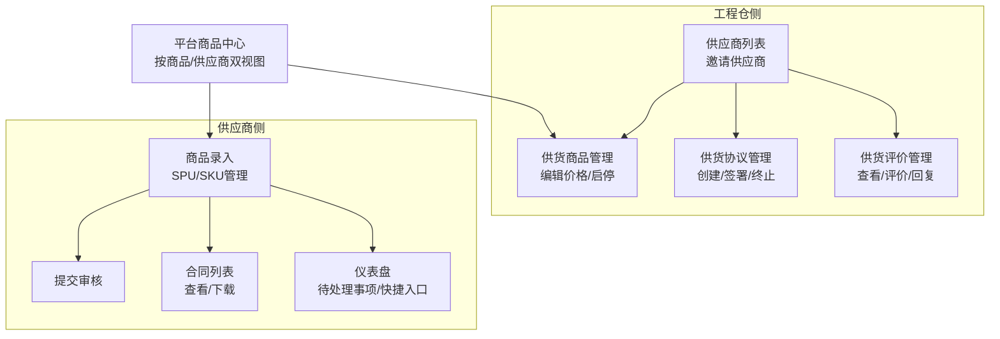
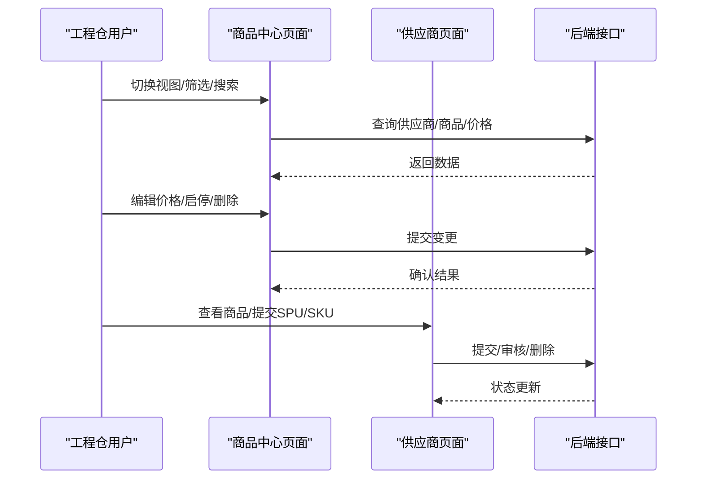
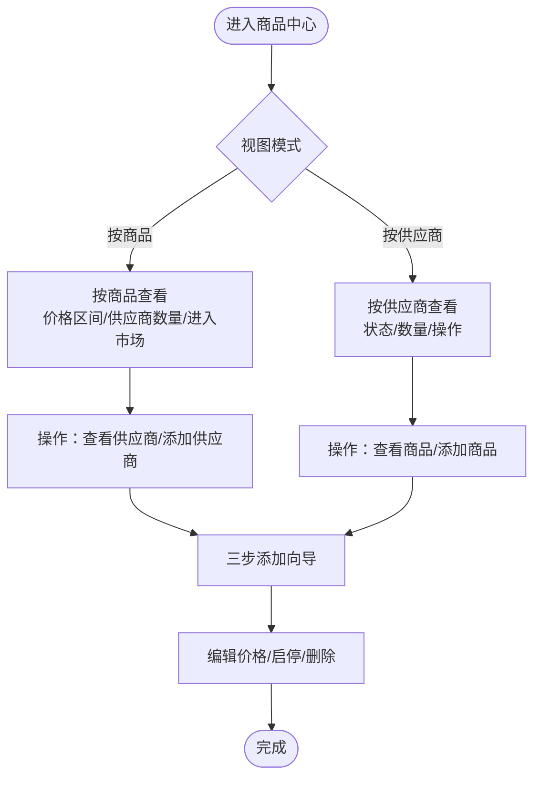
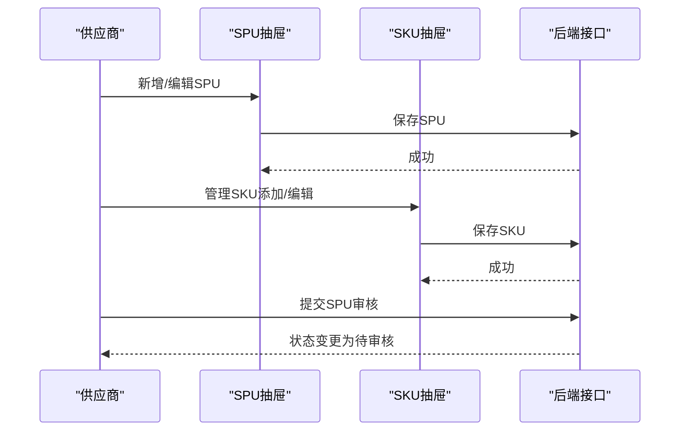
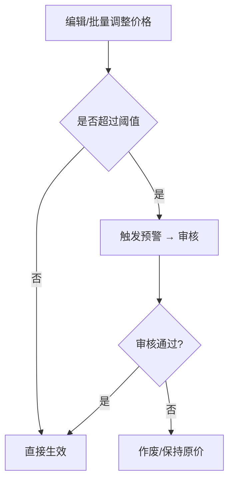
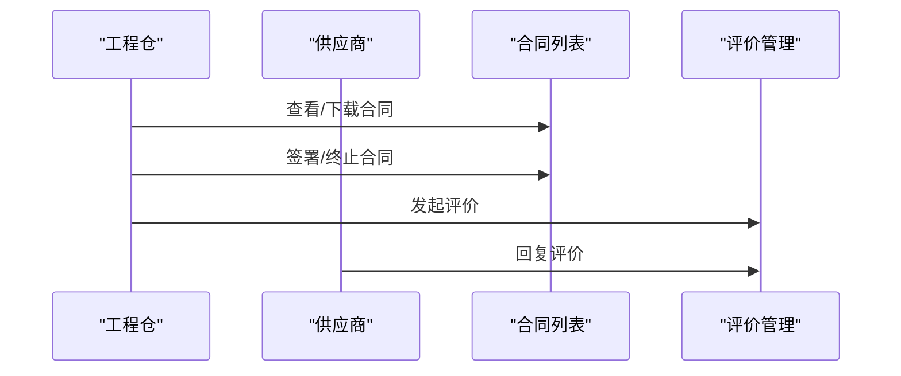
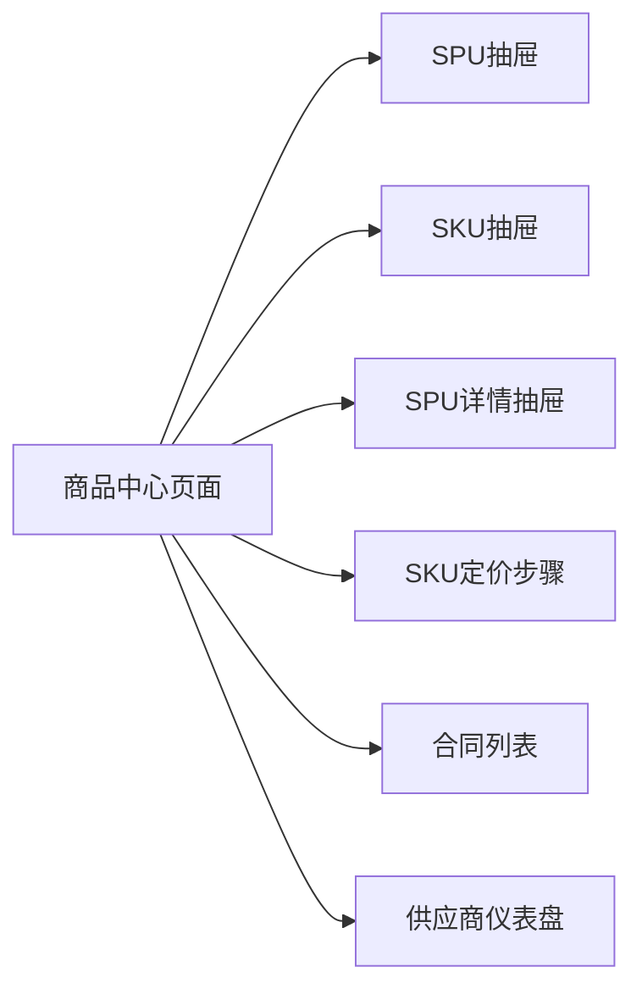

# 供应商供货管理

<cite>
**本文引用的文件**
- [供应商供货与工程仓配置功能详细设计.md](file://docs/PRD/13-供应商供货与工程仓配置功能详细设计.md)
- [供应商供货管理页面.vue](file://apps/pc/src/views/product/supply/index.vue)
- [供应商商品录入页面.vue](file://apps/pc/src/views/supplier/product-submit/index.vue)
- [SPU抽屉.vue](file://apps/pc/src/views/supplier/product-submit/components/SupplierSpuDrawer.vue)
- [SKU抽屉.vue](file://apps/pc/src/views/supplier/product-submit/components/SupplierSkuDrawer.vue)
- [SPU详情抽屉.vue](file://apps/pc/src/views/supplier/product-submit/components/SupplierSpuDetailDrawer.vue)
- [SKU定价步骤.vue](file://apps/pc/src/views/supplier/product-submit/components/SupplierStep3SkuPrice.vue)
- [供应商合同列表.vue](file://apps/pc/src/views/supplier/contract/index.vue)
- [供应商仪表盘.vue](file://apps/pc/src/views/supplier/dashboard/index.vue)
</cite>

## 目录
1. [引言](#引言)
2. [项目结构](#项目结构)
3. [核心组件](#核心组件)
4. [架构总览](#架构总览)
5. [详细组件分析](#详细组件分析)
6. [依赖分析](#依赖分析)
7. [性能考虑](#性能考虑)
8. [故障排查指南](#故障排查指南)
9. [结论](#结论)
10. [附录](#附录)

## 引言
本文件围绕“供应商供货管理”主题，系统梳理供应商与工程仓之间的供货关系建立、商品与价格管理、协议与评价体系、商品资质与提交流程等关键能力，结合前端页面与PRD文档，给出可执行的业务流程、数据流与交互设计说明，帮助研发与运营团队高效落地与维护该功能模块。

## 项目结构
供应商供货管理涉及两大视角：
- 工程仓视角：管理供应商、邀请/终止合作、查看/编辑供货商品与价格
- 供应商视角：管理自身商品、提交商品资料、维护供货价格与库存、查看合同与评价

**章节来源**
- [供应商供货与工程仓配置功能详细设计.md:1-1245](file://docs/PRD/13-供应商供货与工程仓配置功能详细设计.md#L1-L1245)

## 核心组件
- 供应商与商品的双视图管理：支持按商品查看供应商报价、按供应商查看供货商品，便于比价与管理
- 供货价格与优先级：支持单价、起订量、交货周期、自动进入市场等配置；支持价格异动预警与人工审核
- 供应商资质与商品提交：SPU/SKU信息、图片、属性配置、审核状态流转
- 合同与评价：合同创建/签署/终止，供应商对工程仓的评价回复与工程仓对供应商的评价

**章节来源**
- [供应商供货管理页面.vue:1-1764](file://apps/pc/src/views/product/supply/index.vue#L1-L1764)
- [供应商商品录入页面.vue:1-649](file://apps/pc/src/views/supplier/product-submit/index.vue#L1-L649)
- [SPU抽屉.vue:1-305](file://apps/pc/src/views/supplier/product-submit/components/SupplierSpuDrawer.vue#L1-L305)
- [SKU抽屉.vue:1-496](file://apps/pc/src/views/supplier/product-submit/components/SupplierSkuDrawer.vue#L1-L496)
- [SPU详情抽屉.vue:1-209](file://apps/pc/src/views/supplier/product-submit/components/SupplierSpuDetailDrawer.vue#L1-L209)
- [SKU定价步骤.vue:1-138](file://apps/pc/src/views/supplier/product-submit/components/SupplierStep3SkuPrice.vue#L1-L138)
- [供应商合同列表.vue:1-254](file://apps/pc/src/views/supplier/contract/index.vue#L1-L254)
- [供应商仪表盘.vue:1-240](file://apps/pc/src/views/supplier/dashboard/index.vue#L1-L240)

## 架构总览
供应商供货管理由“页面组件 + 抽屉/模态 + 类型与状态枚举”构成，数据流贯穿“筛选/搜索 → 列表/表格 → 详情/编辑 → 操作（启停/删除/提交）”。

**图表来源**
- [供应商供货管理页面.vue:1-1764](file://apps/pc/src/views/product/supply/index.vue#L1-L1764)
- [供应商商品录入页面.vue:1-649](file://apps/pc/src/views/supplier/product-submit/index.vue#L1-L649)

## 详细组件分析

### 1) 供应商与商品双视图管理
- 按商品查看：展示SKU主图、名称、SPU归属、分类、规格、供应价格区间、供应商数量、进入市场状态、操作（查看供应商/添加供应商）
- 按供应商查看：展示供应商ID/名称/联系人/电话、供货商品数、状态（正常/已停用）、操作（查看商品/添加商品）
- 三步添加向导：选择商品（SPU/SKU）、选择供应商、设置供货信息（价格/起订量/周期/备注），支持批量设置与SKU明细编辑
- 价格编辑与启停：支持单个/批量编辑价格、暂停/恢复/删除供货关系，删除时若无其他供应商则自动下架

**图表来源**
- [供应商供货管理页面.vue:1-1764](file://apps/pc/src/views/product/supply/index.vue#L1-L1764)

**章节来源**
- [供应商供货管理页面.vue:1-1764](file://apps/pc/src/views/product/supply/index.vue#L1-L1764)

### 2) 供应商商品提交与审核
- SPU管理：名称/编码/分类/单位/属性/图片/描述/备注；支持草稿/待审核/已通过/已驳回状态；提交审核后不可再编辑
- SKU管理：基于SPU属性生成规格组合，配置建议售价与供货价；支持添加/编辑/删除
- 审核流程：供应商提交 → 平台审核 → 通过/驳回；通过后进入商品市场

**图表来源**
- [SPU抽屉.vue:1-305](file://apps/pc/src/views/supplier/product-submit/components/SupplierSpuDrawer.vue#L1-L305)
- [SKU抽屉.vue:1-496](file://apps/pc/src/views/supplier/product-submit/components/SupplierSkuDrawer.vue#L1-L496)
- [供应商商品录入页面.vue:1-649](file://apps/pc/src/views/supplier/product-submit/index.vue#L1-L649)

**章节来源**
- [供应商商品录入页面.vue:1-649](file://apps/pc/src/views/supplier/product-submit/index.vue#L1-L649)
- [SPU抽屉.vue:1-305](file://apps/pc/src/views/supplier/product-submit/components/SupplierSpuDrawer.vue#L1-L305)
- [SKU抽屉.vue:1-496](file://apps/pc/src/views/supplier/product-submit/components/SupplierSkuDrawer.vue#L1-L496)
- [SPU详情抽屉.vue:1-209](file://apps/pc/src/views/supplier/product-submit/components/SupplierSpuDetailDrawer.vue#L1-L209)
- [SKU定价步骤.vue:1-138](file://apps/pc/src/views/supplier/product-submit/components/SupplierStep3SkuPrice.vue#L1-L138)

### 3) 供货价格与优先级
- 价格配置：支持统一设置、批量调整、按比例调整；支持价格生效时间与有效期
- 优先级与综合得分：A/B/C/D级优先级映射到不同得分，用于推荐与选品
- 价格异动预警：涨幅超阈值触发预警，需人工审核后生效

**图表来源**
- [供应商供货管理页面.vue:1-1764](file://apps/pc/src/views/product/supply/index.vue#L1-L1764)

**章节来源**
- [供应商供货管理页面.vue:1-1764](file://apps/pc/src/views/product/supply/index.vue#L1-L1764)

### 4) 合同与评价
- 合同管理：列表筛选（状态/类型/时间），查看/下载；支持新增合同、签署（电子/线下）、终止
- 评价管理：工程仓对供应商进行商品质量/交货速度/服务态度/价格合理性评价；供应商可回复

**图表来源**
- [供应商合同列表.vue:1-254](file://apps/pc/src/views/supplier/contract/index.vue#L1-L254)
- [供应商供货与工程仓配置功能详细设计.md:571-920](file://docs/PRD/13-供应商供货与工程仓配置功能详细设计.md#L571-L920)

**章节来源**
- [供应商合同列表.vue:1-254](file://apps/pc/src/views/supplier/contract/index.vue#L1-L254)
- [供应商供货与工程仓配置功能详细设计.md:571-920](file://docs/PRD/13-供应商供货与工程仓配置功能详细设计.md#L571-L920)

### 5) 供应商仪表盘与快捷入口
- 仪表盘展示：供货中商品数、待处理订单、本月供货额、累计结算金额
- 快捷入口：商品管理、主体信息、合同列表、托管账户
- 待处理事项：新订单确认、库存不足提醒、合同到期提醒

**章节来源**
- [供应商仪表盘.vue:1-240](file://apps/pc/src/views/supplier/dashboard/index.vue#L1-L240)

## 依赖分析
- 组件耦合
  - 商品中心页面与供应商页面相互协作：前者管理“关系与价格”，后者管理“商品与资质”
  - 抽屉组件（SPU/SKU/详情）与页面松耦合，通过事件与数据传递交互
- 数据依赖
  - 价格与优先级依赖SPU/SKU属性与单位
  - 审核状态依赖平台流程与权限矩阵
- 外部依赖
  - 合同与评价依赖后端接口（PRD中已列出接口路径）

**图表来源**
- [供应商供货管理页面.vue:1-1764](file://apps/pc/src/views/product/supply/index.vue#L1-L1764)
- [SPU抽屉.vue:1-305](file://apps/pc/src/views/supplier/product-submit/components/SupplierSpuDrawer.vue#L1-L305)
- [SKU抽屉.vue:1-496](file://apps/pc/src/views/supplier/product-submit/components/SupplierSkuDrawer.vue#L1-L496)
- [SPU详情抽屉.vue:1-209](file://apps/pc/src/views/supplier/product-submit/components/SupplierSpuDetailDrawer.vue#L1-L209)
- [SKU定价步骤.vue:1-138](file://apps/pc/src/views/supplier/product-submit/components/SupplierStep3SkuPrice.vue#L1-L138)
- [供应商合同列表.vue:1-254](file://apps/pc/src/views/supplier/contract/index.vue#L1-L254)
- [供应商仪表盘.vue:1-240](file://apps/pc/src/views/supplier/dashboard/index.vue#L1-L240)

**章节来源**
- [供应商供货管理页面.vue:1-1764](file://apps/pc/src/views/product/supply/index.vue#L1-L1764)
- [供应商商品录入页面.vue:1-649](file://apps/pc/src/views/supplier/product-submit/index.vue#L1-L649)

## 性能考虑
- 列表渲染优化：支持分页与虚拟滚动，避免一次性渲染大量SKU/供应商
- 批量操作：批量设置价格/启停/删除，减少多次网络请求
- 图片懒加载与缩略图：降低首屏加载压力
- 状态缓存：本地缓存筛选条件与分页状态，提升用户体验

## 故障排查指南
- 价格异动告警
  - 现象：价格涨幅超过阈值，无法直接生效
  - 处理：检查异动规则配置，提交审核后生效
- 供应商删除影响
  - 现象：删除最后一个供应商导致商品下架
  - 处理：删除前确认是否还有其他供应商，必要时先添加新供应商
- 审核状态限制
  - 现象：已通过审核的商品无法编辑
  - 处理：重新提交草稿并发起审核
- 合同签署问题
  - 现象：电子签署验证码未收到或线下签署文件缺失
  - 处理：检查手机号/邮箱与文件格式，确保符合要求

**章节来源**
- [供应商供货管理页面.vue:1476-1559](file://apps/pc/src/views/product/supply/index.vue#L1476-L1559)
- [供应商商品录入页面.vue:571-598](file://apps/pc/src/views/supplier/product-submit/index.vue#L571-L598)
- [供应商合同列表.vue:195-206](file://apps/pc/src/views/supplier/contract/index.vue#L195-L206)

## 结论
供应商供货管理通过“双视图+商品提交+价格优先级+合同与评价”的闭环设计，实现了从“供应商资质与商品信息”到“价格与库存管理”的全流程覆盖。工程仓与供应商两端协同，既能保障选品透明与成本可控，又能促进供应商生态的健康发展。

## 附录
- 权限矩阵与角色分工详见PRD文档
- 接口设计与字段说明详见PRD文档中的接口章节

**章节来源**
- [供应商供货与工程仓配置功能详细设计.md:974-1245](file://docs/PRD/13-供应商供货与工程仓配置功能详细设计.md#L974-L1245)