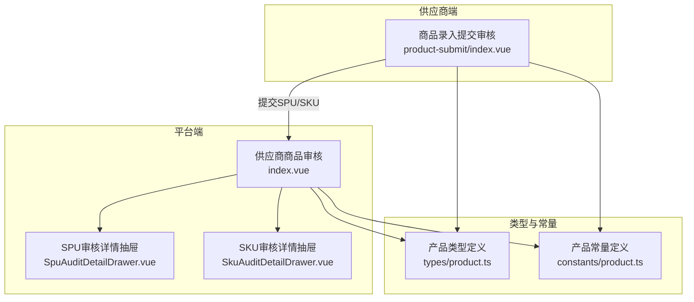
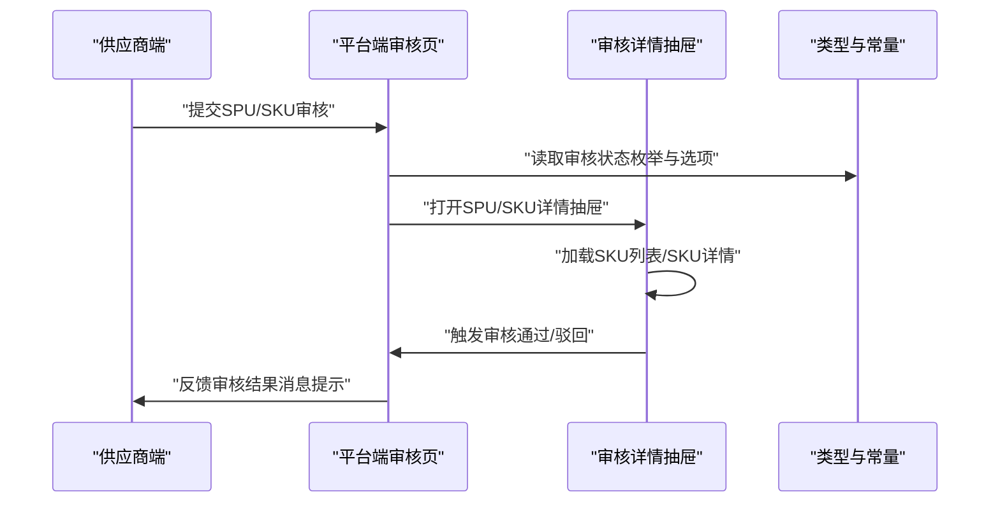
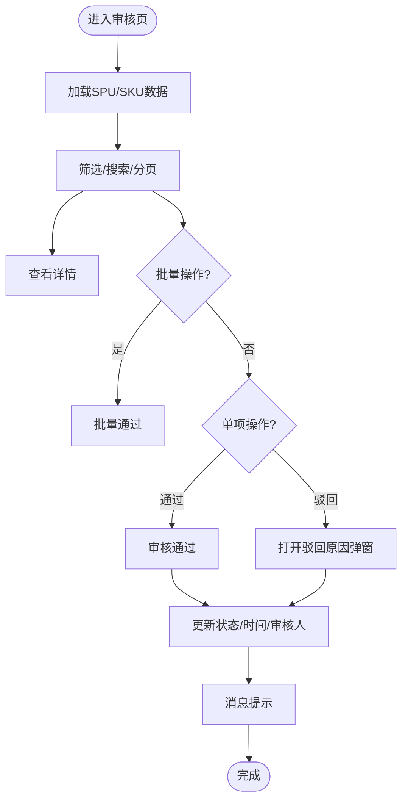
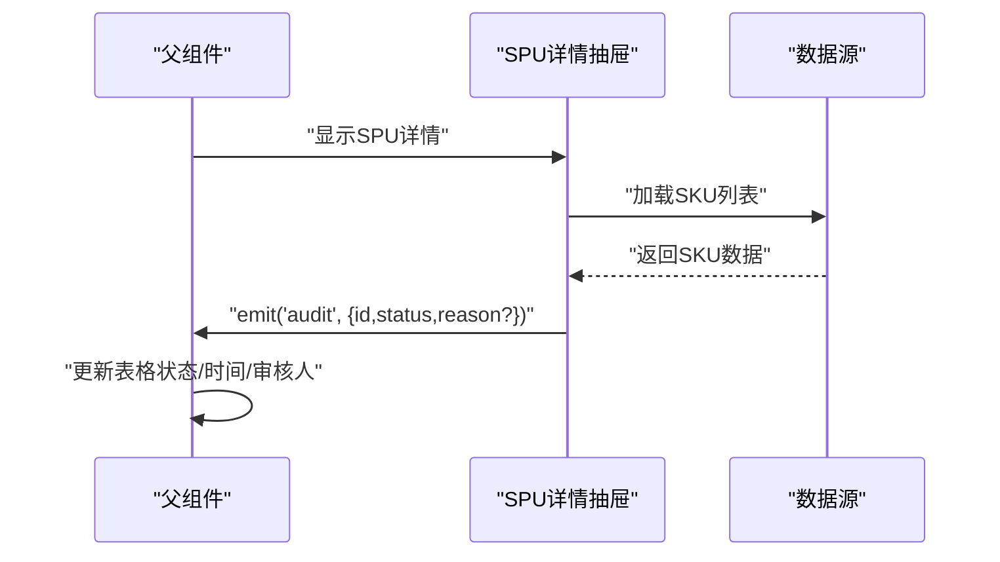
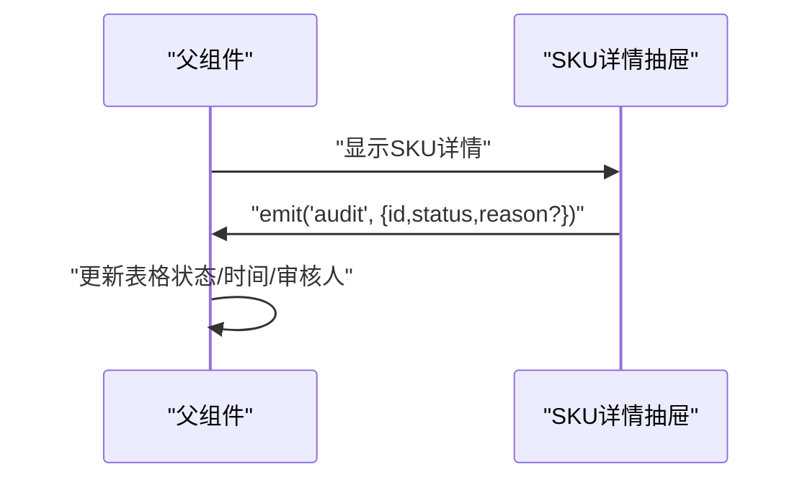
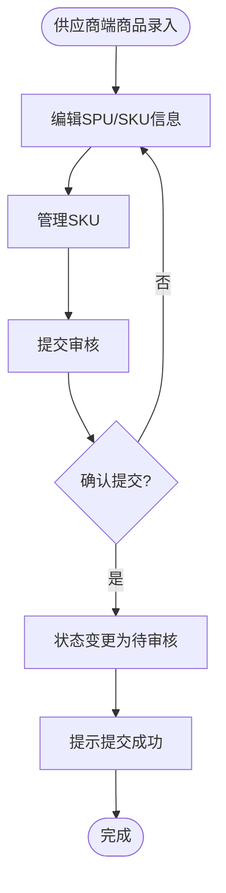
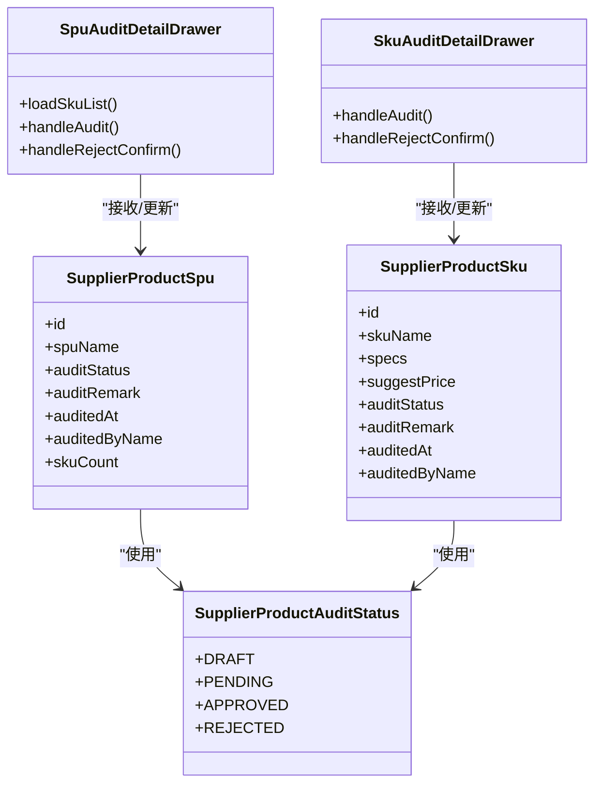

# 供应商审核管理

<cite>
**本文档引用的文件**
- [apps/pc/src/views/product/supplier-audit/index.vue](file://apps/pc/src/views/product/supplier-audit/index.vue)
- [apps/pc/src/views/product/supplier-audit/components/SpuAuditDetailDrawer.vue](file://apps/pc/src/views/product/supplier-audit/components/SpuAuditDetailDrawer.vue)
- [apps/pc/src/views/product/supplier-audit/components/SkuAuditDetailDrawer.vue](file://apps/pc/src/views/product/supplier-audit/components/SkuAuditDetailDrawer.vue)
- [apps/pc/src/views/supplier/product-submit/index.vue](file://apps/pc/src/views/supplier/product-submit/index.vue)
- [packages/types/src/product.ts](file://packages/types/src/product.ts)
- [packages/constants/src/product.ts](file://packages/constants/src/product.ts)
</cite>

## 目录
1. [简介](#简介)
2. [项目结构](#项目结构)
3. [核心组件](#核心组件)
4. [架构总览](#架构总览)
5. [详细组件分析](#详细组件分析)
6. [依赖关系分析](#依赖关系分析)
7. [性能考虑](#性能考虑)
8. [故障排除指南](#故障排除指南)
9. [结论](#结论)
10. [附录](#附录)

## 简介
本文件面向供应商审核管理功能，系统性阐述供应商提交商品信息的审核流程，覆盖SPU审核、SKU审核、审核详情查看等核心能力，并详细说明审核状态管理、审核意见处理、审核结果反馈、审核历史记录等业务流程。同时提供审核标准制定、审核人员分配、审核时效控制、审核质量评估等实现细节与最佳实践建议。

## 项目结构
供应商审核管理相关代码主要分布在以下位置：
- 平台端审核入口：`apps/pc/src/views/product/supplier-audit/index.vue`
- SPU审核详情抽屉：`apps/pc/src/views/product/supplier-audit/components/SpuAuditDetailDrawer.vue`
- SKU审核详情抽屉：`apps/pc/src/views/product/supplier-audit/components/SkuAuditDetailDrawer.vue`
- 供应商端商品提交入口：`apps/pc/src/views/supplier/product-submit/index.vue`
- 类型与常量定义：`packages/types/src/product.ts`、`packages/constants/src/product.ts`

**图表来源**
- [apps/pc/src/views/product/supplier-audit/index.vue:1-757](file://apps/pc/src/views/product/supplier-audit/index.vue#L1-L757)
- [apps/pc/src/views/product/supplier-audit/components/SpuAuditDetailDrawer.vue:1-270](file://apps/pc/src/views/product/supplier-audit/components/SpuAuditDetailDrawer.vue#L1-L270)
- [apps/pc/src/views/product/supplier-audit/components/SkuAuditDetailDrawer.vue:1-182](file://apps/pc/src/views/product/supplier-audit/components/SkuAuditDetailDrawer.vue#L1-L182)
- [apps/pc/src/views/supplier/product-submit/index.vue:1-649](file://apps/pc/src/views/supplier/product-submit/index.vue#L1-L649)
- [packages/types/src/product.ts:330-431](file://packages/types/src/product.ts#L330-L431)
- [packages/constants/src/product.ts:1-26](file://packages/constants/src/product.ts#L1-L26)

**章节来源**
- [apps/pc/src/views/product/supplier-audit/index.vue:1-757](file://apps/pc/src/views/product/supplier-audit/index.vue#L1-L757)
- [apps/pc/src/views/supplier/product-submit/index.vue:1-649](file://apps/pc/src/views/supplier/product-submit/index.vue#L1-L649)
- [packages/types/src/product.ts:330-431](file://packages/types/src/product.ts#L330-L431)
- [packages/constants/src/product.ts:1-26](file://packages/constants/src/product.ts#L1-L26)

## 核心组件
- 平台端供应商商品审核页：支持SPU与SKU双标签切换，提供筛选、分页、批量审核、详情查看、加入商品库等能力。
- SPU审核详情抽屉：展示SPU基本信息、图片、SKU列表及审核操作。
- SKU审核详情抽屉：展示SKU规格、价格、审核状态与审核操作。
- 供应商端商品录入页：支持SPU/SKU管理、编辑、删除、提交审核等。

关键特性：
- 审核状态枚举与选项：统一使用`SupplierProductAuditStatus`与`SUPPLIER_PRODUCT_AUDIT_STATUS_OPTIONS`。
- 审核操作：通过/驳回，支持批量通过与批量驳回。
- 审核意见：驳回时需填写原因，通过时自动填充审核人与时间。
- 商品库集成：审核通过后可选择加入平台商品库。

**章节来源**
- [apps/pc/src/views/product/supplier-audit/index.vue:1-757](file://apps/pc/src/views/product/supplier-audit/index.vue#L1-L757)
- [apps/pc/src/views/product/supplier-audit/components/SpuAuditDetailDrawer.vue:1-270](file://apps/pc/src/views/product/supplier-audit/components/SpuAuditDetailDrawer.vue#L1-L270)
- [apps/pc/src/views/product/supplier-audit/components/SkuAuditDetailDrawer.vue:1-182](file://apps/pc/src/views/product/supplier-audit/components/SkuAuditDetailDrawer.vue#L1-L182)
- [apps/pc/src/views/supplier/product-submit/index.vue:1-649](file://apps/pc/src/views/supplier/product-submit/index.vue#L1-L649)
- [packages/types/src/product.ts:330-431](file://packages/types/src/product.ts#L330-L431)

## 架构总览
平台端与供应商端通过统一的类型与常量进行协作，确保审核状态、操作行为与UI交互一致。

**图表来源**
- [apps/pc/src/views/supplier/product-submit/index.vue:571-582](file://apps/pc/src/views/supplier/product-submit/index.vue#L571-L582)
- [apps/pc/src/views/product/supplier-audit/index.vue:590-632](file://apps/pc/src/views/product/supplier-audit/index.vue#L590-L632)
- [apps/pc/src/views/product/supplier-audit/components/SpuAuditDetailDrawer.vue:163-204](file://apps/pc/src/views/product/supplier-audit/components/SpuAuditDetailDrawer.vue#L163-L204)
- [apps/pc/src/views/product/supplier-audit/components/SkuAuditDetailDrawer.vue:122-146](file://apps/pc/src/views/product/supplier-audit/components/SkuAuditDetailDrawer.vue#L122-L146)
- [packages/types/src/product.ts:330-431](file://packages/types/src/product.ts#L330-L431)

## 详细组件分析

### 平台端供应商商品审核页（SPU/SKU）
- 功能要点
  - 双标签页：SPU审核与SKU审核，分别展示对应表格与操作按钮。
  - 筛选与搜索：支持关键词、分类、审核状态筛选；分页控制。
  - 批量操作：批量通过/批量驳回SPU。
  - 单项操作：查看详情、通过、驳回、加入商品库（仅SPU通过后）。
  - 审核状态展示：颜色区分草稿、待审核、已通过、已驳回。
- 数据流
  - 表格数据来源于本地mock，实际场景应替换为API调用。
  - 审核操作通过确认对话框触发，更新本地状态并提示消息。

**图表来源**
- [apps/pc/src/views/product/supplier-audit/index.vue:538-578](file://apps/pc/src/views/product/supplier-audit/index.vue#L538-L578)
- [apps/pc/src/views/product/supplier-audit/index.vue:590-660](file://apps/pc/src/views/product/supplier-audit/index.vue#L590-L660)
- [apps/pc/src/views/product/supplier-audit/index.vue:662-728](file://apps/pc/src/views/product/supplier-audit/index.vue#L662-L728)

**章节来源**
- [apps/pc/src/views/product/supplier-audit/index.vue:1-757](file://apps/pc/src/views/product/supplier-audit/index.vue#L1-L757)

### SPU审核详情抽屉
- 功能要点
  - 展示SPU基本信息、图片、SKU列表。
  - 在待审核状态下提供“通过/驳回”操作。
  - 驳回时弹出原因输入框，校验非空后触发审核事件。
- 数据流
  - 打开抽屉时异步加载SKU列表。
  - 审核完成后通过事件向上抛出，由父组件更新表格状态。

**图表来源**
- [apps/pc/src/views/product/supplier-audit/components/SpuAuditDetailDrawer.vue:154-161](file://apps/pc/src/views/product/supplier-audit/components/SpuAuditDetailDrawer.vue#L154-L161)
- [apps/pc/src/views/product/supplier-audit/components/SpuAuditDetailDrawer.vue:206-226](file://apps/pc/src/views/product/supplier-audit/components/SpuAuditDetailDrawer.vue#L206-L226)

**章节来源**
- [apps/pc/src/views/product/supplier-audit/components/SpuAuditDetailDrawer.vue:1-270](file://apps/pc/src/views/product/supplier-audit/components/SpuAuditDetailDrawer.vue#L1-L270)

### SKU审核详情抽屉
- 功能要点
  - 展示SKU规格、价格、审核状态等信息。
  - 在待审核状态下提供“通过/驳回”操作。
  - 驳回时弹出原因输入框，校验非空后触发审核事件。
- 数据流
  - 审核完成后通过事件向上抛出，由父组件更新表格状态。

**图表来源**
- [apps/pc/src/views/product/supplier-audit/components/SkuAuditDetailDrawer.vue:122-146](file://apps/pc/src/views/product/supplier-audit/components/SkuAuditDetailDrawer.vue#L122-L146)

**章节来源**
- [apps/pc/src/views/product/supplier-audit/components/SkuAuditDetailDrawer.vue:1-182](file://apps/pc/src/views/product/supplier-audit/components/SkuAuditDetailDrawer.vue#L1-L182)

### 供应商端商品录入与提交审核
- 功能要点
  - 支持SPU/SKU管理、编辑、删除、提交审核。
  - 提交审核前进行二次确认，提交后状态变为“待审核”，且禁止后续编辑。
  - 支持从SPU跳转到SKU管理界面。
- 数据流
  - 供应商在商品录入页完成SPU/SKU信息维护后，点击“提交审核”按钮。
  - 状态更新为待审核，等待平台审核。

**图表来源**
- [apps/pc/src/views/supplier/product-submit/index.vue:550-582](file://apps/pc/src/views/supplier/product-submit/index.vue#L550-L582)
- [apps/pc/src/views/supplier/product-submit/index.vue:565-569](file://apps/pc/src/views/supplier/product-submit/index.vue#L565-L569)

**章节来源**
- [apps/pc/src/views/supplier/product-submit/index.vue:1-649](file://apps/pc/src/views/supplier/product-submit/index.vue#L1-L649)

## 依赖关系分析
- 类型与常量
  - `SupplierProductAuditStatus`：统一定义草稿、待审核、已通过、已驳回四种状态。
  - `SUPPLIER_PRODUCT_AUDIT_STATUS_OPTIONS`：用于UI下拉选择与展示。
  - `SupplierProductSpu/SupplierProductSku`：平台侧审核对象的数据结构，包含审核状态、审核备注、审核时间、审核人等字段。
- 组件间耦合
  - 审核页与详情抽屉通过事件通信，保持松耦合。
  - 供应商端与平台端通过统一类型对接，避免状态不一致。

**图表来源**
- [packages/types/src/product.ts:330-431](file://packages/types/src/product.ts#L330-L431)
- [apps/pc/src/views/product/supplier-audit/components/SpuAuditDetailDrawer.vue:119-127](file://apps/pc/src/views/product/supplier-audit/components/SpuAuditDetailDrawer.vue#L119-L127)
- [apps/pc/src/views/product/supplier-audit/components/SkuAuditDetailDrawer.vue:89-97](file://apps/pc/src/views/product/supplier-audit/components/SkuAuditDetailDrawer.vue#L89-L97)

**章节来源**
- [packages/types/src/product.ts:330-431](file://packages/types/src/product.ts#L330-L431)
- [apps/pc/src/views/product/supplier-audit/components/SpuAuditDetailDrawer.vue:1-270](file://apps/pc/src/views/product/supplier-audit/components/SpuAuditDetailDrawer.vue#L1-L270)
- [apps/pc/src/views/product/supplier-audit/components/SkuAuditDetailDrawer.vue:1-182](file://apps/pc/src/views/product/supplier-audit/components/SkuAuditDetailDrawer.vue#L1-L182)

## 性能考虑
- 列表渲染优化
  - 使用虚拟滚动或分页加载，避免一次性渲染大量数据。
  - 图片懒加载与占位符，减少首屏压力。
- 异步加载
  - 抽屉打开时再加载SKU列表，降低初始渲染成本。
- 状态更新
  - 采用局部状态更新与消息提示，避免全量刷新。
- 批量操作
  - 批量通过/驳回时，前端先更新UI，再进行网络请求，提升交互流畅度。

## 故障排除指南
- 驳回原因为空
  - 现象：点击“驳回”后无响应或提示输入原因。
  - 处理：确保在弹窗中填写原因，字数限制合理。
  - 参考路径：[apps/pc/src/views/product/supplier-audit/index.vue:662-666](file://apps/pc/src/views/product/supplier-audit/index.vue#L662-L666)
- 提交审核不可用
  - 现象：SPU提交审核按钮被禁用。
  - 原因：SPU状态非草稿或SKU数量为0。
  - 参考路径：[apps/pc/src/views/supplier/product-submit/index.vue:104-107](file://apps/pc/src/views/supplier/product-submit/index.vue#L104-L107)
- 审核状态不一致
  - 现象：页面状态与实际不符。
  - 处理：检查类型定义与状态映射是否一致，确保前后端状态同步。
  - 参考路径：[packages/types/src/product.ts:330-431](file://packages/types/src/product.ts#L330-L431)

**章节来源**
- [apps/pc/src/views/product/supplier-audit/index.vue:662-666](file://apps/pc/src/views/product/supplier-audit/index.vue#L662-L666)
- [apps/pc/src/views/supplier/product-submit/index.vue:104-107](file://apps/pc/src/views/supplier/product-submit/index.vue#L104-L107)
- [packages/types/src/product.ts:330-431](file://packages/types/src/product.ts#L330-L431)

## 结论
该审核管理功能以统一的状态枚举与数据结构为核心，结合平台端与供应商端的协同，实现了从商品录入到审核通过的完整闭环。通过详情抽屉与批量操作，提升了审核效率与用户体验。建议在实际落地时完善后端接口、权限控制与审计日志，确保审核过程可追溯、可评估。

## 附录

### 审核状态管理最佳实践
- 明确状态流转：草稿 → 待审核 → 已通过/已驳回。
- 审核意见必填：驳回时强制填写原因，便于供应商整改。
- 审核人与时间：自动记录审核人与审核时间，保证可追溯性。
- 批量操作安全：对批量通过/驳回增加二次确认与错误回滚。

### 审核标准与质量评估
- 审核标准：商品图片清晰、规格参数完整、价格信息准确、描述合规。
- 质量评估：统计通过率、平均审核时长、驳回原因分布，持续优化审核策略。

### 审核时效控制
- 设定SLA：如“T+1工作日”内完成初审，“T+3工作日”内完成终审。
- 超时提醒：对超时任务进行预警与催办。
- 自动归档：超过一定周期未处理的申请自动归档或转人工处理。