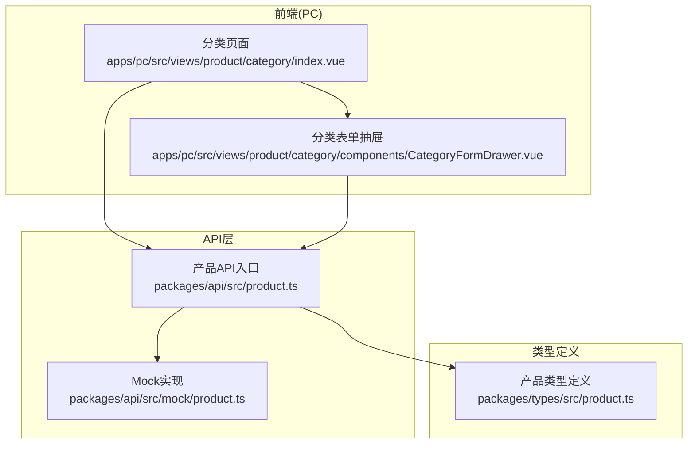
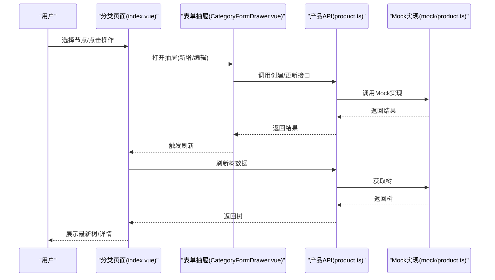
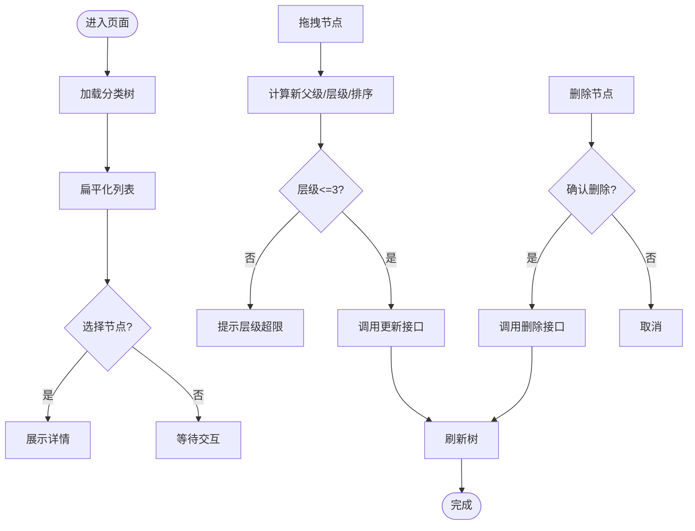
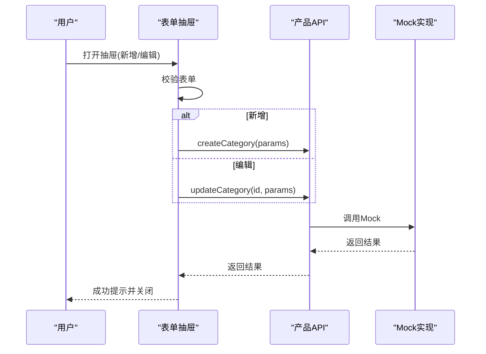
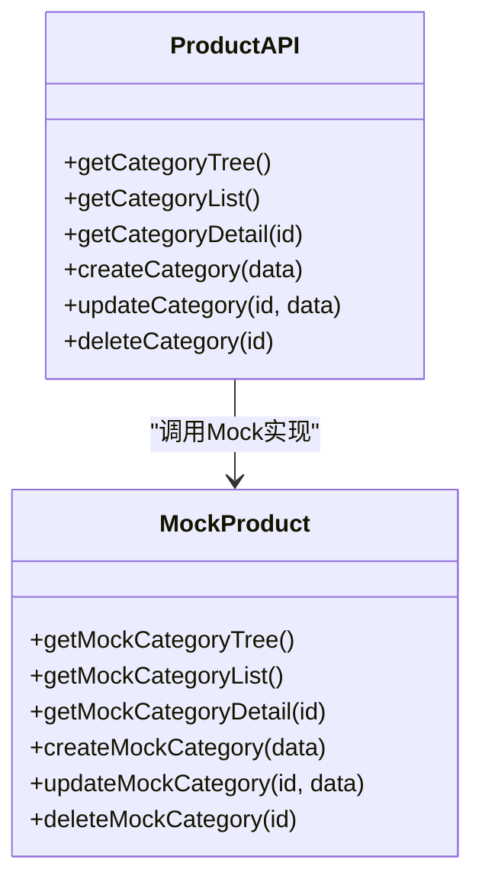
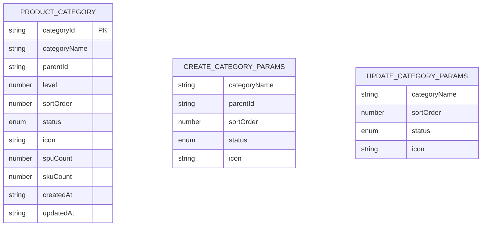
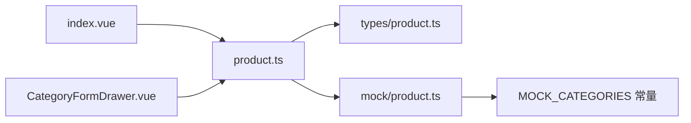

# 商品分类管理

<cite>
**本文引用的文件**
- [apps/pc/src/views/product/category/index.vue](file://apps/pc/src/views/product/category/index.vue)
- [apps/pc/src/views/product/category/components/CategoryFormDrawer.vue](file://apps/pc/src/views/product/category/components/CategoryFormDrawer.vue)
- [packages/api/src/product.ts](file://packages/api/src/product.ts)
- [packages/api/src/mock/product.ts](file://packages/api/src/mock/product.ts)
- [packages/types/src/product.ts](file://packages/types/src/product.ts)
- [docs/PRD/06-商品板块功能清单.md](file://docs/PRD/06-商品板块功能清单.md)
</cite>

## 目录
1. [简介](#简介)
2. [项目结构](#项目结构)
3. [核心组件](#核心组件)
4. [架构总览](#架构总览)
5. [详细组件分析](#详细组件分析)
6. [依赖分析](#依赖分析)
7. [性能考量](#性能考量)
8. [故障排查指南](#故障排查指南)
9. [结论](#结论)
10. [附录](#附录)

## 简介
本文件围绕“商品分类管理”功能，系统化阐述分类的层级设计原理、CRUD 操作流程、树形结构展示、权限控制机制，并深入说明添加、编辑、删除、移动等操作的实现细节，包括父子关系维护、排序策略、状态管理等。同时提供最佳实践、数据验证规则、异常处理方案以及典型业务场景示例，帮助开发者与产品人员高效理解与落地该能力。

## 项目结构
商品分类管理主要由前端页面与表单抽屉、API 层与类型定义构成，采用“左树右详情”的布局，支持搜索、拖拽排序与层级移动，配合权限矩阵保障操作安全。

**图表来源**
- [apps/pc/src/views/product/category/index.vue:1-408](file://apps/pc/src/views/product/category/index.vue#L1-L408)
- [apps/pc/src/views/product/category/components/CategoryFormDrawer.vue:1-169](file://apps/pc/src/views/product/category/components/CategoryFormDrawer.vue#L1-L169)
- [packages/api/src/product.ts:1-258](file://packages/api/src/product.ts#L1-L258)
- [packages/api/src/mock/product.ts:27-129](file://packages/api/src/mock/product.ts#L27-L129)
- [packages/types/src/product.ts:22-50](file://packages/types/src/product.ts#L22-L50)

**章节来源**
- [apps/pc/src/views/product/category/index.vue:1-408](file://apps/pc/src/views/product/category/index.vue#L1-L408)
- [apps/pc/src/views/product/category/components/CategoryFormDrawer.vue:1-169](file://apps/pc/src/views/product/category/components/CategoryFormDrawer.vue#L1-L169)
- [packages/api/src/product.ts:1-258](file://packages/api/src/product.ts#L1-L258)
- [packages/api/src/mock/product.ts:27-129](file://packages/api/src/mock/product.ts#L27-L129)
- [packages/types/src/product.ts:22-50](file://packages/types/src/product.ts#L22-L50)

## 核心组件
- 分类页面（树形+详情）
  - 左侧树形：支持搜索、拖拽排序、层级移动；最多三级
  - 右侧详情：展示选中分类的属性与关联数量
- 分类表单抽屉：统一承载新增/编辑，支持上级分类选择、排序与状态控制
- API 层：提供树查询、创建、更新、删除等接口；当前为 Mock 实现
- 类型定义：规范分类实体、创建/更新参数与状态枚举

**章节来源**
- [apps/pc/src/views/product/category/index.vue:1-408](file://apps/pc/src/views/product/category/index.vue#L1-L408)
- [apps/pc/src/views/product/category/components/CategoryFormDrawer.vue:1-169](file://apps/pc/src/views/product/category/components/CategoryFormDrawer.vue#L1-L169)
- [packages/api/src/product.ts:52-98](file://packages/api/src/product.ts#L52-L98)
- [packages/types/src/product.ts:22-50](file://packages/types/src/product.ts#L22-L50)

## 架构总览
从用户交互到数据持久化的整体流程如下：

**图表来源**
- [apps/pc/src/views/product/category/index.vue:197-344](file://apps/pc/src/views/product/category/index.vue#L197-L344)
- [apps/pc/src/views/product/category/components/CategoryFormDrawer.vue:137-167](file://apps/pc/src/views/product/category/components/CategoryFormDrawer.vue#L137-L167)
- [packages/api/src/product.ts:52-98](file://packages/api/src/product.ts#L52-L98)
- [packages/api/src/mock/product.ts:933-973](file://packages/api/src/mock/product.ts#L933-L973)

## 详细组件分析

### 组件一：分类页面（树形+详情）
- 布局与交互
  - 左侧树形支持搜索、拖拽排序、节点操作（新增子分类、编辑、删除）
  - 右侧详情展示分类属性与关联 SPU/SKU 数量，支持跳转至对应列表
- 数据流
  - 初始化加载树：调用树接口，扁平化列表用于搜索与拖拽
  - 选中节点：根据选中键查找详情并渲染
  - 删除：二次确认后调用删除接口并刷新
  - 拖拽：计算目标父级、层级与排序，调用更新接口并刷新
- 关键实现要点
  - 搜索：对树进行深度过滤，保留匹配路径
  - 扁平化：用于拖拽时快速定位节点与兄弟节点
  - 层级限制：拖拽后若层级超过三级则提示
  - 权限矩阵：仅平台管理员具备新增/编辑/删除/拖拽权限

**图表来源**
- [apps/pc/src/views/product/category/index.vue:175-326](file://apps/pc/src/views/product/category/index.vue#L175-L326)
- [packages/api/src/product.ts:52-98](file://packages/api/src/product.ts#L52-L98)

**章节来源**
- [apps/pc/src/views/product/category/index.vue:1-408](file://apps/pc/src/views/product/category/index.vue#L1-L408)
- [docs/PRD/06-商品板块功能清单.md:24-40](file://docs/PRD/06-商品板块功能清单.md#L24-L40)

### 组件二：分类表单抽屉（新增/编辑）
- 表单字段
  - 分类名称（必填）、上级分类（树选择）、排序号、状态（启用/禁用）
- 行为
  - 新增：提交创建参数
  - 编辑：提交更新参数
  - 上级分类树：编辑时排除自身及其子孙，避免循环引用
- 校验
  - 分类名称必填
  - 提交前进行表单校验，错误消息提示

**图表来源**
- [apps/pc/src/views/product/category/components/CategoryFormDrawer.vue:137-167](file://apps/pc/src/views/product/category/components/CategoryFormDrawer.vue#L137-L167)
- [packages/api/src/product.ts:75-98](file://packages/api/src/product.ts#L75-L98)
- [packages/api/src/mock/product.ts:946-973](file://packages/api/src/mock/product.ts#L946-L973)

**章节来源**
- [apps/pc/src/views/product/category/components/CategoryFormDrawer.vue:1-169](file://apps/pc/src/views/product/category/components/CategoryFormDrawer.vue#L1-L169)
- [packages/api/src/product.ts:75-98](file://packages/api/src/product.ts#L75-L98)
- [packages/api/src/mock/product.ts:946-973](file://packages/api/src/mock/product.ts#L946-L973)

### 组件三：API 层与 Mock 实现
- API 入口
  - 树查询、列表查询、详情查询、创建、更新、删除
  - 当前为 Mock 模式，返回内存数据
- Mock 实现
  - 分类树、列表、详情、创建、更新、删除均在内存中维护
  - 创建时支持指定父级，自动追加到父级 children
  - 删除时从扁平化列表中移除

**图表来源**
- [packages/api/src/product.ts:52-98](file://packages/api/src/product.ts#L52-L98)
- [packages/api/src/mock/product.ts:933-997](file://packages/api/src/mock/product.ts#L933-L997)

**章节来源**
- [packages/api/src/product.ts:1-258](file://packages/api/src/product.ts#L1-L258)
- [packages/api/src/mock/product.ts:933-997](file://packages/api/src/mock/product.ts#L933-L997)

### 组件四：数据模型与类型定义
- 分类实体
  - 包含分类标识、名称、父级、层级、排序、状态、图标、子节点、统计数、时间戳
- 参数类型
  - 创建参数：名称、父级、排序、状态、图标
  - 更新参数：名称、排序、状态、图标
- 状态枚举
  - 启用/禁用

**图表来源**
- [packages/types/src/product.ts:22-50](file://packages/types/src/product.ts#L22-L50)

**章节来源**
- [packages/types/src/product.ts:22-50](file://packages/types/src/product.ts#L22-L50)

## 依赖分析
- 前端页面依赖 API 层提供的树与 CRUD 方法
- 表单抽屉依赖 API 层进行创建/更新
- API 层依赖类型定义保证参数与返回值一致性
- Mock 实现依赖内置分类树常量与扁平化工具函数

**图表来源**
- [apps/pc/src/views/product/category/index.vue:99-99](file://apps/pc/src/views/product/category/index.vue#L99-L99)
- [apps/pc/src/views/product/category/components/CategoryFormDrawer.vue:40-40](file://apps/pc/src/views/product/category/components/CategoryFormDrawer.vue#L40-L40)
- [packages/api/src/product.ts:1-48](file://packages/api/src/product.ts#L1-L48)
- [packages/api/src/mock/product.ts:27-129](file://packages/api/src/mock/product.ts#L27-L129)

**章节来源**
- [apps/pc/src/views/product/category/index.vue:99-99](file://apps/pc/src/views/product/category/index.vue#L99-L99)
- [apps/pc/src/views/product/category/components/CategoryFormDrawer.vue:40-40](file://apps/pc/src/views/product/category/components/CategoryFormDrawer.vue#L40-L40)
- [packages/api/src/product.ts:1-48](file://packages/api/src/product.ts#L1-L48)
- [packages/api/src/mock/product.ts:27-129](file://packages/api/src/mock/product.ts#L27-L129)

## 性能考量
- 树渲染
  - 使用虚拟滚动与懒加载可进一步优化超大分类树的渲染性能（建议）
- 搜索
  - 搜索为一次性遍历，建议在数据量较大时引入索引或服务端检索
- 拖拽
  - 拖拽计算涉及扁平化列表查找，建议在移动端使用节流与轻量动画
- 刷新
  - 每次操作后统一刷新树，减少重复请求；可在更新成功后局部更新节点

[本节为通用建议，无需具体文件分析]

## 故障排查指南
- 删除失败
  - 现象：删除提示失败
  - 排查：确认分类是否存在、是否有关联商品；检查接口返回错误信息
  - 参考
    - [apps/pc/src/views/product/category/index.vue:261-279](file://apps/pc/src/views/product/category/index.vue#L261-L279)
    - [packages/api/src/product.ts:91-98](file://packages/api/src/product.ts#L91-L98)
    - [packages/api/src/mock/product.ts:984-997](file://packages/api/src/mock/product.ts#L984-L997)
- 拖拽层级超限
  - 现象：拖拽后提示层级超过三级
  - 排查：确认目标位置是否导致层级超过三级；必要时调整目标父级
  - 参考
    - [apps/pc/src/views/product/category/index.vue:310-313](file://apps/pc/src/views/product/category/index.vue#L310-L313)
- 表单校验失败
  - 现象：提交时报错
  - 排查：检查必填字段与格式；查看消息提示
  - 参考
    - [apps/pc/src/views/product/category/components/CategoryFormDrawer.vue:64-66](file://apps/pc/src/views/product/category/components/CategoryFormDrawer.vue#L64-L66)
    - [apps/pc/src/views/product/category/components/CategoryFormDrawer.vue:137-167](file://apps/pc/src/views/product/category/components/CategoryFormDrawer.vue#L137-L167)

**章节来源**
- [apps/pc/src/views/product/category/index.vue:261-279](file://apps/pc/src/views/product/category/index.vue#L261-L279)
- [apps/pc/src/views/product/category/index.vue:310-313](file://apps/pc/src/views/product/category/index.vue#L310-L313)
- [apps/pc/src/views/product/category/components/CategoryFormDrawer.vue:64-66](file://apps/pc/src/views/product/category/components/CategoryFormDrawer.vue#L64-L66)
- [apps/pc/src/views/product/category/components/CategoryFormDrawer.vue:137-167](file://apps/pc/src/views/product/category/components/CategoryFormDrawer.vue#L137-L167)
- [packages/api/src/product.ts:91-98](file://packages/api/src/product.ts#L91-L98)
- [packages/api/src/mock/product.ts:984-997](file://packages/api/src/mock/product.ts#L984-L997)

## 结论
商品分类管理以清晰的树形结构与完善的 CRUD 能力为核心，结合拖拽排序与层级限制，满足多级分类的组织需求。通过统一的表单抽屉与 API 抽象，前后端职责明确、扩展性强。建议在后续版本中完善权限矩阵、服务端实现与性能优化，以支撑更大规模的数据与更复杂的业务场景。

[本节为总结，无需具体文件分析]

## 附录

### A. 分类CRUD操作流程
- 新增
  - 打开抽屉，填写必填字段，提交创建接口
  - 参考
    - [apps/pc/src/views/product/category/components/CategoryFormDrawer.vue:149-158](file://apps/pc/src/views/product/category/components/CategoryFormDrawer.vue#L149-L158)
    - [packages/api/src/product.ts:75-80](file://packages/api/src/product.ts#L75-L80)
- 编辑
  - 选择节点打开抽屉，修改字段后提交更新接口
  - 参考
    - [apps/pc/src/views/product/category/components/CategoryFormDrawer.vue:141-148](file://apps/pc/src/views/product/category/components/CategoryFormDrawer.vue#L141-L148)
    - [packages/api/src/product.ts:82-89](file://packages/api/src/product.ts#L82-L89)
- 删除
  - 二次确认后调用删除接口，刷新树
  - 参考
    - [apps/pc/src/views/product/category/index.vue:261-279](file://apps/pc/src/views/product/category/index.vue#L261-L279)
    - [packages/api/src/product.ts:91-98](file://packages/api/src/product.ts#L91-L98)
- 移动/排序
  - 拖拽节点计算新父级、层级与排序，提交更新接口
  - 参考
    - [apps/pc/src/views/product/category/index.vue:281-326](file://apps/pc/src/views/product/category/index.vue#L281-L326)
    - [packages/api/src/product.ts:82-89](file://packages/api/src/product.ts#L82-L89)

**章节来源**
- [apps/pc/src/views/product/category/components/CategoryFormDrawer.vue:141-158](file://apps/pc/src/views/product/category/components/CategoryFormDrawer.vue#L141-L158)
- [apps/pc/src/views/product/category/index.vue:261-326](file://apps/pc/src/views/product/category/index.vue#L261-L326)
- [packages/api/src/product.ts:75-98](file://packages/api/src/product.ts#L75-L98)

### B. 分类树形结构展示
- 左树右详情布局，支持搜索与拖拽
- 展示字段：名称、父级、层级、排序、状态、SPU/SKU 数量
- 参考
  - [apps/pc/src/views/product/category/index.vue:1-408](file://apps/pc/src/views/product/category/index.vue#L1-L408)

**章节来源**
- [apps/pc/src/views/product/category/index.vue:1-408](file://apps/pc/src/views/product/category/index.vue#L1-L408)

### C. 权限控制机制
- 平台管理员：具备新增、编辑、删除、拖拽、绑定属性等全部权限
- 供应商/工程仓/施工方：仅可查看，不可修改
- 参考
  - [docs/PRD/06-商品板块功能清单.md:239-255](file://docs/PRD/06-商品板块功能清单.md#L239-L255)

**章节来源**
- [docs/PRD/06-商品板块功能清单.md:239-255](file://docs/PRD/06-商品板块功能清单.md#L239-L255)

### D. 数据验证规则与最佳实践
- 字段与规则
  - 分类名称：必填
  - 排序号：数字，数值越大越靠前
  - 状态：启用/禁用
- 最佳实践
  - 新增/编辑前进行前端校验与后端校验双保险
  - 拖拽时严格限制层级不超过三级
  - 删除前进行存在性与关联性检查
  - 使用扁平化列表辅助拖拽计算，提升交互体验
- 参考
  - [apps/pc/src/views/product/category/components/CategoryFormDrawer.vue:64-66](file://apps/pc/src/views/product/category/components/CategoryFormDrawer.vue#L64-L66)
  - [apps/pc/src/views/product/category/index.vue:310-313](file://apps/pc/src/views/product/category/index.vue#L310-L313)
  - [docs/PRD/06-商品板块功能清单.md:29-38](file://docs/PRD/06-商品板块功能清单.md#L29-L38)

**章节来源**
- [apps/pc/src/views/product/category/components/CategoryFormDrawer.vue:64-66](file://apps/pc/src/views/product/category/components/CategoryFormDrawer.vue#L64-L66)
- [apps/pc/src/views/product/category/index.vue:310-313](file://apps/pc/src/views/product/category/index.vue#L310-L313)
- [docs/PRD/06-商品板块功能清单.md:29-38](file://docs/PRD/06-商品板块功能清单.md#L29-L38)

### E. 业务场景示例
- 场景一：新增一级分类
  - 步骤：点击“新增一级分类”，填写名称与排序，提交创建
  - 参考
    - [apps/pc/src/views/product/category/index.vue:243-247](file://apps/pc/src/views/product/category/index.vue#L243-L247)
    - [apps/pc/src/views/product/category/components/CategoryFormDrawer.vue:149-158](file://apps/pc/src/views/product/category/components/CategoryFormDrawer.vue#L149-L158)
- 场景二：移动分类到子级
  - 步骤：拖拽节点到目标节点内部，系统自动计算新父级与层级
  - 参考
    - [apps/pc/src/views/product/category/index.vue:298-308](file://apps/pc/src/views/product/category/index.vue#L298-L308)
- 场景三：删除分类
  - 步骤：点击删除，二次确认后调用删除接口
  - 参考
    - [apps/pc/src/views/product/category/index.vue:261-279](file://apps/pc/src/views/product/category/index.vue#L261-L279)

**章节来源**
- [apps/pc/src/views/product/category/index.vue:243-247](file://apps/pc/src/views/product/category/index.vue#L243-L247)
- [apps/pc/src/views/product/category/index.vue:261-279](file://apps/pc/src/views/product/category/index.vue#L261-L279)
- [apps/pc/src/views/product/category/index.vue:298-308](file://apps/pc/src/views/product/category/index.vue#L298-L308)
- [apps/pc/src/views/product/category/components/CategoryFormDrawer.vue:149-158](file://apps/pc/src/views/product/category/components/CategoryFormDrawer.vue#L149-L158)