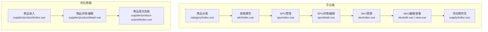
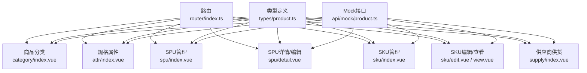
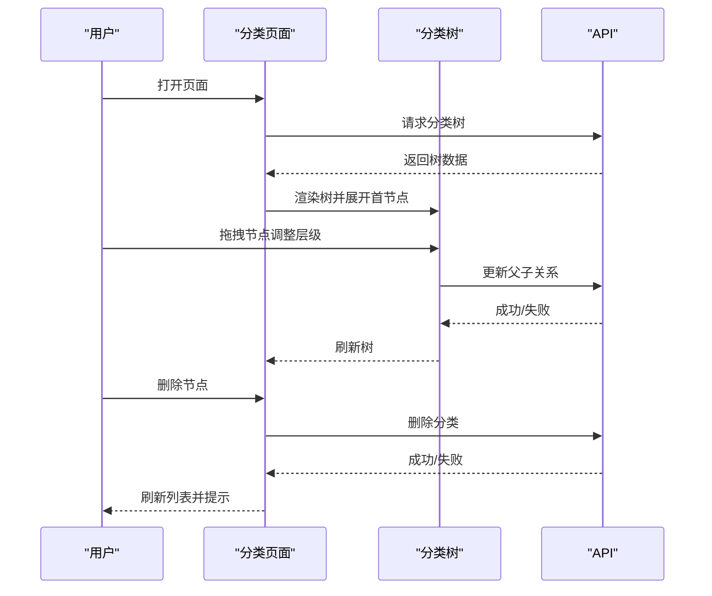
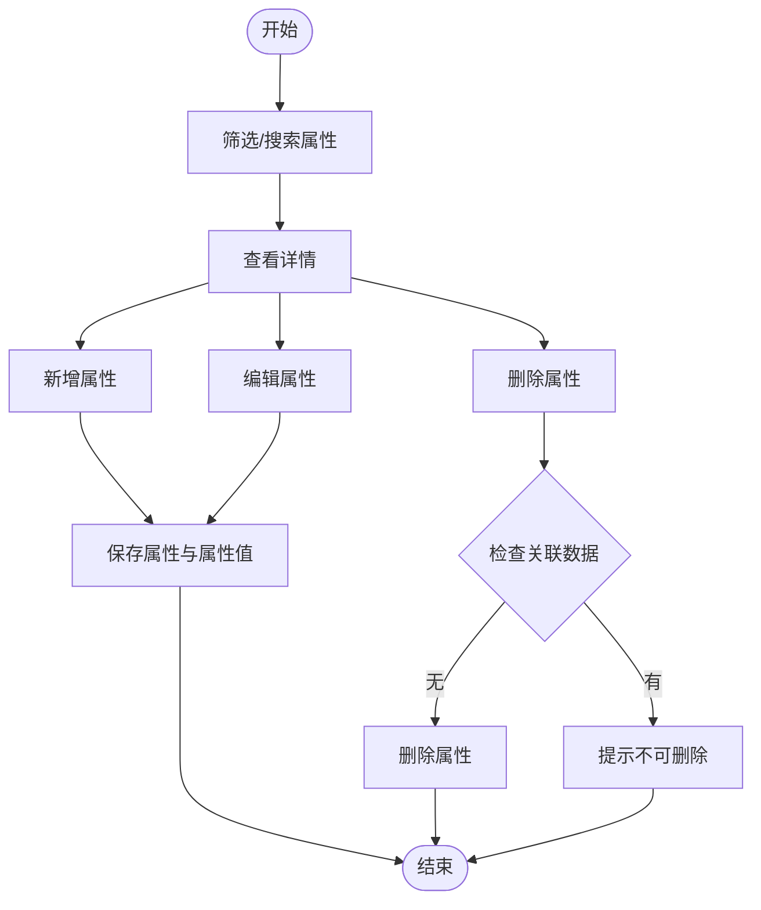
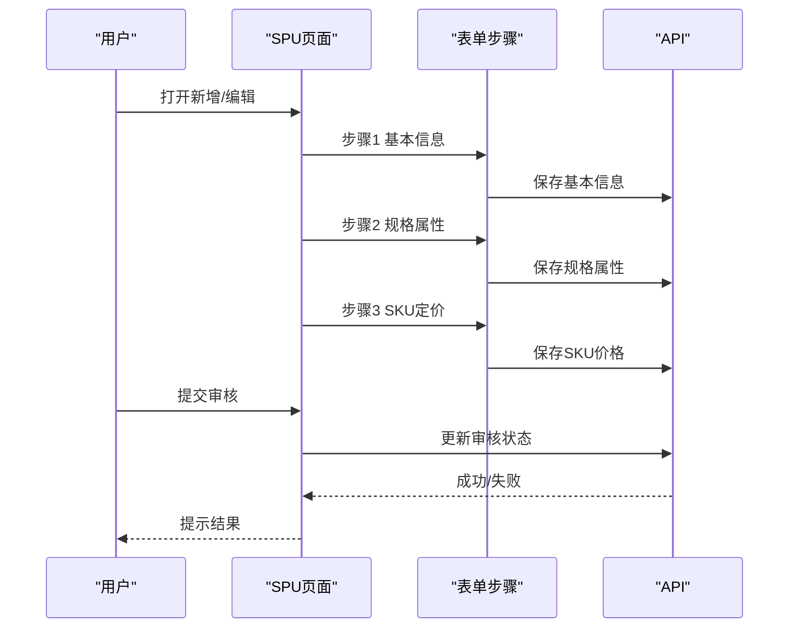
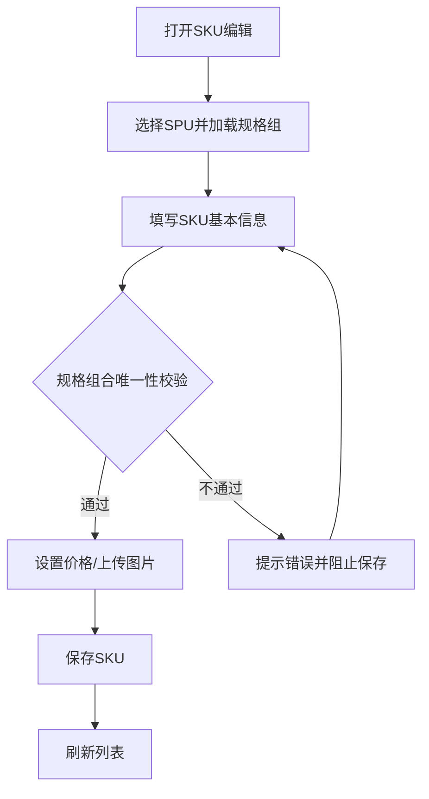
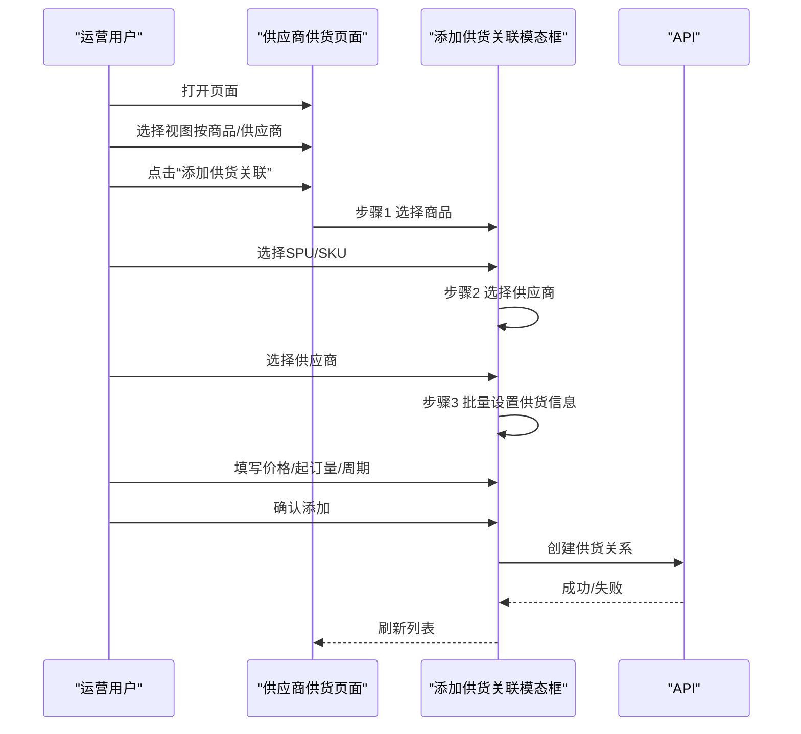
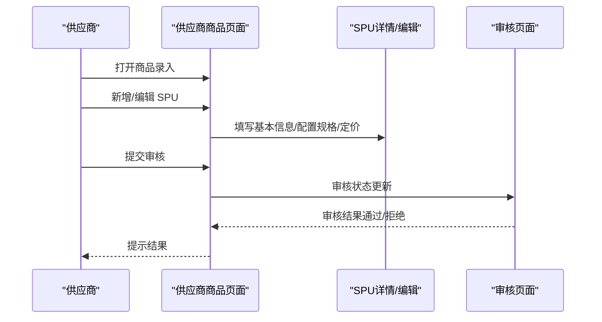
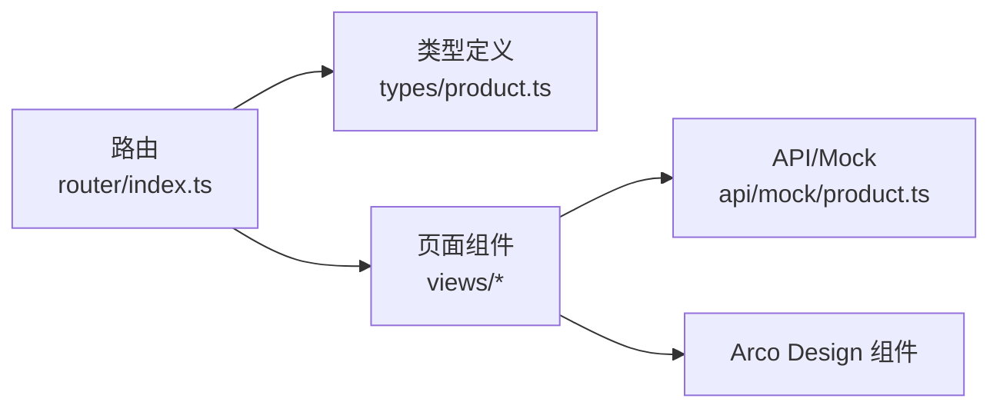

# 商品管理中心

<cite>
**本文引用的文件**
- [apps/pc/src/views/product/category/index.vue](file://apps/pc/src/views/product/category/index.vue)
- [apps/pc/src/views/product/attr/index.vue](file://apps/pc/src/views/product/attr/index.vue)
- [apps/pc/src/views/product/spu/index.vue](file://apps/pc/src/views/product/spu/index.vue)
- [apps/pc/src/views/product/spu/detail.vue](file://apps/pc/src/views/product/spu/detail.vue)
- [apps/pc/src/views/product/sku/index.vue](file://apps/pc/src/views/product/sku/index.vue)
- [apps/pc/src/views/product/sku/edit.vue](file://apps/pc/src/views/product/sku/edit.vue)
- [apps/pc/src/views/product/sku/view.vue](file://apps/pc/src/views/product/sku/view.vue)
- [apps/pc/src/views/product/supply/index.vue](file://apps/pc/src/views/product/supply/index.vue)
- [apps/pc/src/views/supplier/product/index.vue](file://apps/pc/src/views/supplier/product/index.vue)
- [apps/pc/src/views/supplier/product/detail.vue](file://apps/pc/src/views/supplier/product/detail.vue)
- [apps/pc/src/views/supplier/product-submit/index.vue](file://apps/pc/src/views/supplier/product-submit/index.vue)
- [apps/pc/src/views/supplier/product-submit/components/SupplierSpuCreateDrawer.vue](file://apps/pc/src/views/supplier/product-submit/components/SupplierSpuCreateDrawer.vue)
- [apps/pc/src/views/supplier/product-submit/components/SupplierSkuDrawer.vue](file://apps/pc/src/views/supplier/product-submit/components/SupplierSkuDrawer.vue)
- [apps/pc/src/views/supplier/product-submit/components/SupplierSpuDetailDrawer.vue](file://apps/pc/src/views/supplier/product-submit/components/SupplierSpuDetailDrawer.vue)
- [apps/pc/src/views/supplier/product-submit/components/SupplierStep3SkuPrice.vue](file://apps/pc/src/views/supplier/product-submit/components/SupplierStep3SkuPrice.vue)
- [apps/pc/src/views/supplier/warehouse-config/index.vue](file://apps/pc/src/views/supplier/warehouse-config/index.vue)
- [apps/pc/src/router/index.ts](file://apps/pc/src/router/index.ts)
- [packages/types/src/product.ts](file://packages/types/src/product.ts)
- [packages/api/src/mock/product.ts](file://packages/api/src/mock/product.ts)
- [docs/PRD/03-数据模型与表结构.md](file://docs/PRD/03-数据模型与表结构.md)
- [docs/PRD/06-商品板块功能清单.md](file://docs/PRD/06-商品板块功能清单.md)
- [docs/PRD/07-平台端商品中心功能清单.md](file://docs/PRD/07-平台端商品中心功能清单.md)
- [docs/PRD/16-商品SKU菜单功能详细设计.md](file://docs/PRD/16-商品SKU菜单功能详细设计.md)
- [docs/PRD/18-SPU管理功能详细设计.md](file://docs/PRD/18-SPU管理功能详细设计.md)
- [docs/PRD/02-业务流程设计.md](file://docs/PRD/02-业务流程设计.md)
</cite>

## 目录
1. [简介](#简介)
2. [项目结构](#项目结构)
3. [核心组件](#核心组件)
4. [架构总览](#架构总览)
5. [详细组件分析](#详细组件分析)
6. [依赖分析](#依赖分析)
7. [性能考虑](#性能考虑)
8. [故障排查指南](#故障排查指南)
9. [结论](#结论)
10. [附录](#附录)

## 简介
本文件面向“商品管理中心”的核心功能，围绕以下主题展开：商品分类管理（层级设计、CRUD、树形结构）、规格属性管理（属性定义、属性值管理、属性关联）、SPU管理（基本信息、图片管理、规格配置、审核流程）、SKU管理（基本信息、价格管理、库存管理、编辑表单）、供应商供货管理（供货商配置、供货价格管理、供货库存同步、供货商审核）。文档提供业务流程、操作步骤、数据模型、权限控制、异常处理、业务场景示例与最佳实践。

## 项目结构
商品管理中心位于 PC 管理端前端工程中，主要页面分布在 product 与 supplier 两大模块：
- 商品管理（平台侧）：分类、属性、SPU、SKU、供应商供货
- 供应商侧：商品录入、商品详情、商品提交审核、工程仓配置

图表来源
- [apps/pc/src/views/product/category/index.vue:93-296](file://apps/pc/src/views/product/category/index.vue#L93-L296)
- [apps/pc/src/views/product/attr/index.vue](file://apps/pc/src/views/product/attr/index.vue)
- [apps/pc/src/views/product/spu/index.vue](file://apps/pc/src/views/product/spu/index.vue)
- [apps/pc/src/views/product/spu/detail.vue](file://apps/pc/src/views/product/spu/detail.vue)
- [apps/pc/src/views/product/sku/index.vue](file://apps/pc/src/views/product/sku/index.vue)
- [apps/pc/src/views/product/sku/edit.vue](file://apps/pc/src/views/product/sku/edit.vue)
- [apps/pc/src/views/product/sku/view.vue](file://apps/pc/src/views/product/sku/view.vue)
- [apps/pc/src/views/product/supply/index.vue](file://apps/pc/src/views/product/supply/index.vue)
- [apps/pc/src/views/supplier/product/index.vue](file://apps/pc/src/views/supplier/product/index.vue)
- [apps/pc/src/views/supplier/product/detail.vue](file://apps/pc/src/views/supplier/product/detail.vue)
- [apps/pc/src/views/supplier/product-submit/index.vue](file://apps/pc/src/views/supplier/product-submit/index.vue)

章节来源
- [apps/pc/src/router/index.ts:57-134](file://apps/pc/src/router/index.ts#L57-L134)

## 核心组件
- 商品分类管理：树形结构、拖拽排序、搜索过滤、增删改查
- 规格属性管理：属性列表、属性详情、属性创建/编辑/删除、属性值管理
- SPU 管理：SPU 列表、新增/编辑/查看、规格属性配置、图片管理、审核流程
- SKU 管理：SKU 列表、SKU 编辑、价格管理、库存管理、规格组合
- 供应商供货：按商品/供应商视图切换、批量关联、价格编辑、状态管理

章节来源
- [apps/pc/src/views/product/category/index.vue:93-296](file://apps/pc/src/views/product/category/index.vue#L93-L296)
- [apps/pc/src/views/product/attr/index.vue](file://apps/pc/src/views/product/attr/index.vue)
- [apps/pc/src/views/product/spu/index.vue](file://apps/pc/src/views/product/spu/index.vue)
- [apps/pc/src/views/product/spu/detail.vue](file://apps/pc/src/views/product/spu/detail.vue)
- [apps/pc/src/views/product/sku/index.vue](file://apps/pc/src/views/product/sku/index.vue)
- [apps/pc/src/views/product/sku/edit.vue](file://apps/pc/src/views/product/sku/edit.vue)
- [apps/pc/src/views/product/sku/view.vue](file://apps/pc/src/views/product/sku/view.vue)
- [apps/pc/src/views/product/supply/index.vue](file://apps/pc/src/views/product/supply/index.vue)
- [apps/pc/src/views/supplier/product/index.vue](file://apps/pc/src/views/supplier/product/index.vue)
- [apps/pc/src/views/supplier/product/detail.vue](file://apps/pc/src/views/supplier/product/detail.vue)
- [apps/pc/src/views/supplier/product-submit/index.vue](file://apps/pc/src/views/supplier/product-submit/index.vue)

## 架构总览
商品管理中心采用“页面-组件-类型-接口”的分层架构：
- 页面层：路由驱动的 Vue 页面组件
- 组件层：抽屉、表单、表格、模态框等复用组件
- 类型层：统一的产品领域类型定义（分类、属性、SPU、SKU、供应商商品等）
- 接口层：API 模块与 Mock 数据

图表来源
- [apps/pc/src/router/index.ts:57-134](file://apps/pc/src/router/index.ts#L57-L134)
- [packages/types/src/product.ts:22-431](file://packages/types/src/product.ts#L22-L431)
- [packages/api/src/mock/product.ts:1-800](file://packages/api/src/mock/product.ts#L1-L800)

## 详细组件分析

### 商品分类管理
- 功能要点
  - 左树右详情布局，最多三级分类
  - 支持新增一级/子分类、编辑、删除、拖拽排序
  - 支持按关键字搜索过滤树节点
  - 加载树数据、扁平化处理、展开首节点
- 业务流程
  - 初始化加载分类树
  - 用户选择节点后右侧展示属性列表
  - 拖拽调整层级或同级排序
  - 删除节点时级联删除并刷新
- 数据模型
  - 分类实体包含层级、排序、状态、统计字段
- 权限控制
  - 仅平台管理员可进行分类 CRUD
- 异常处理
  - 加载失败日志输出；删除失败提示错误消息

图表来源
- [apps/pc/src/views/product/category/index.vue:197-296](file://apps/pc/src/views/product/category/index.vue#L197-L296)
- [packages/api/src/mock/product.ts:27-199](file://packages/api/src/mock/product.ts#L27-L199)

章节来源
- [apps/pc/src/views/product/category/index.vue:93-296](file://apps/pc/src/views/product/category/index.vue#L93-L296)
- [packages/types/src/product.ts:22-50](file://packages/types/src/product.ts#L22-L50)
- [docs/PRD/03-数据模型与表结构.md:301-313](file://docs/PRD/03-数据模型与表结构.md#L301-L313)

### 规格属性管理
- 功能要点
  - 属性列表查询、详情查看、创建、编辑、删除、启用/禁用
  - 属性值管理：添加、编辑、删除、批量添加
  - 支持按分类、属性名称筛选
- 业务流程
  - 新增属性：校验编码唯一性，保存属性及属性值
  - 编辑属性：校验编码唯一性（排除自身）
  - 删除属性：检查是否存在属性值与被商品使用，无关联方可删除
- 数据模型
  - 属性实体含类型（单选/多选/输入）、选项值、排序、状态
- 权限控制
  - 平台管理员可操作
- 异常处理
  - 删除前校验关联数据，失败给出明确提示

图表来源
- [apps/pc/src/views/product/attr/index.vue](file://apps/pc/src/views/product/attr/index.vue)
- [docs/PRD/06-商品板块功能清单.md:42-55](file://docs/PRD/06-商品板块功能清单.md#L42-L55)
- [docs/PRD/07-平台端商品中心功能清单.md:76-82](file://docs/PRD/07-平台端商品中心功能清单.md#L76-L82)

章节来源
- [apps/pc/src/views/product/attr/index.vue](file://apps/pc/src/views/product/attr/index.vue)
- [packages/types/src/product.ts:58-83](file://packages/types/src/product.ts#L58-L83)
- [docs/PRD/06-商品板块功能清单.md:42-55](file://docs/PRD/06-商品板块功能清单.md#L42-L55)

### SPU 管理
- 功能要点
  - SPU 列表：主图、编码、名称、分类、单位、SKU 数、审核状态、创建时间
  - 新增/编辑/查看：基本信息、规格属性、SKU 定价
  - 图片管理：主图、相册图上传与预览
  - 审核流程：草稿→待审核→已上架/已下架/审核拒绝
- 业务流程
  - 第一步：基本信息（名称、编码、分类、单位、主图、相册、描述、备注）
  - 第二步：规格属性（添加/删除规格、设置规格值、实时预览 SKU 数）
  - 第三步：SKU 定价（批量设置价格、清空价格、保存）
  - 提交审核：草稿且存在 SKU 时可提交
- 数据模型
  - SPU 实体含名称、编码、分类、单位、图片、描述、备注、状态
  - SKU 实体含规格组合、价格、库存、状态
- 权限控制
  - 平台管理员与运营人员可操作；供应商仅查看或提交审核
- 异常处理
  - 表单校验失败提示；图片格式/大小限制；规格/价格必填校验

图表来源
- [apps/pc/src/views/product/spu/index.vue](file://apps/pc/src/views/product/spu/index.vue)
- [apps/pc/src/views/product/spu/detail.vue](file://apps/pc/src/views/product/spu/detail.vue)
- [docs/PRD/18-SPU管理功能详细设计.md:223-311](file://docs/PRD/18-SPU管理功能详细设计.md#L223-L311)
- [docs/PRD/18-SPU管理功能详细设计.md:490-511](file://docs/PRD/18-SPU管理功能详细设计.md#L490-L511)

章节来源
- [apps/pc/src/views/product/spu/index.vue](file://apps/pc/src/views/product/spu/index.vue)
- [apps/pc/src/views/product/spu/detail.vue](file://apps/pc/src/views/product/spu/detail.vue)
- [packages/types/src/product.ts:90-133](file://packages/types/src/product.ts#L90-L133)
- [docs/PRD/18-SPU管理功能详细设计.md:1-538](file://docs/PRD/18-SPU管理功能详细设计.md#L1-L538)

### SKU 管理
- 功能要点
  - SKU 列表：主图、编码、名称、所属SPU、规格、单位、建议售价、审核状态、创建时间
  - SKU 编辑：名称/编码/规格/单位/描述、图片上传
  - 价格管理：建议售价、供货价、销售价、成本价、市场价
  - 库存管理：供应商数量、总库存
- 业务流程
  - 新增 SKU：选择 SPu，动态生成规格选择器，校验唯一性
  - 编辑 SKU：可修改规格组合、价格、图片
  - 价格批量设置：支持批量设置供货价/销售价
- 数据模型
  - SKU 实体含规格映射、价格字段、库存统计、状态
- 权限控制
  - 平台管理员/运营可操作；供应商不可直接操作
- 异常处理
  - 规格组合唯一性校验；SKU 编码/名称唯一性校验

图表来源
- [apps/pc/src/views/product/sku/index.vue](file://apps/pc/src/views/product/sku/index.vue)
- [apps/pc/src/views/product/sku/edit.vue](file://apps/pc/src/views/product/sku/edit.vue)
- [apps/pc/src/views/product/sku/view.vue](file://apps/pc/src/views/product/sku/view.vue)
- [docs/PRD/16-商品SKU菜单功能详细设计.md:238-311](file://docs/PRD/16-商品SKU菜单功能详细设计.md#L238-L311)

章节来源
- [apps/pc/src/views/product/sku/index.vue](file://apps/pc/src/views/product/sku/index.vue)
- [apps/pc/src/views/product/sku/edit.vue](file://apps/pc/src/views/product/sku/edit.vue)
- [apps/pc/src/views/product/sku/view.vue](file://apps/pc/src/views/product/sku/view.vue)
- [packages/types/src/product.ts:140-196](file://packages/types/src/product.ts#L140-L196)
- [docs/PRD/16-商品SKU菜单功能详细设计.md:238-311](file://docs/PRD/16-商品SKU菜单功能详细设计.md#L238-L311)

### 供应商供货管理
- 功能要点
  - 按商品/供应商视图切换
  - 批量关联供应商与商品（支持按SPU或SKU选择）
  - 批量设置供货信息（供货价、预计供货量、最小起订量、供货周期）
  - 供应商商品列表：价格、优先级、状态、操作（编辑、暂停/恢复、删除）
- 业务流程
  - 选择商品（SPU/SKU）→选择供应商→批量设置供货信息→确认添加
  - 查看供应商：最低价高亮、优先级选择、状态切换
  - 编辑供货价：建议不超过平台供货价
- 数据模型
  - 供应商商品实体含供货价、最小起订量、预计供货量、状态、审核状态
- 权限控制
  - 平台运营可操作；供应商不可直接操作
- 异常处理
  - 价格合理性校验；批量操作前确认

图表来源
- [apps/pc/src/views/product/supply/index.vue:1-800](file://apps/pc/src/views/product/supply/index.vue#L1-L800)
- [packages/types/src/product.ts:255-271](file://packages/types/src/product.ts#L255-L271)

章节来源
- [apps/pc/src/views/product/supply/index.vue:1-800](file://apps/pc/src/views/product/supply/index.vue#L1-L800)
- [packages/types/src/product.ts:255-271](file://packages/types/src/product.ts#L255-L271)
- [docs/PRD/06-商品板块功能清单.md:96-125](file://docs/PRD/06-商品板块功能清单.md#L96-L125)

### 供应商商品录入与审核
- 功能要点
  - 供应商可在“商品录入”中管理 SPU/SKU，支持搜索、筛选、分页
  - SPU：新增/编辑/详情/管理SKU/提交审核/删除
  - SKU：新增/编辑/详情
  - 审核状态：草稿/待审核/已通过/已驳回
- 业务流程
  - 新增/编辑 SPU：填写基本信息、配置规格属性、SKU 定价
  - 提交审核：草稿且存在 SKU 时可提交，提交后不可再编辑
  - 平台审核：通过/拒绝，记录审核意见与时间
- 数据模型
  - 供应商商品 SPU/SKU 实体含审核状态、审核备注、审计信息
- 权限控制
  - 供应商仅可操作自身商品；平台可审核
- 异常处理
  - 提交审核前校验 SKU 数量；删除前确认

图表来源
- [apps/pc/src/views/supplier/product/index.vue](file://apps/pc/src/views/supplier/product/index.vue)
- [apps/pc/src/views/supplier/product/detail.vue](file://apps/pc/src/views/supplier/product/detail.vue)
- [apps/pc/src/views/supplier/product-submit/index.vue](file://apps/pc/src/views/supplier/product-submit/index.vue)
- [packages/types/src/product.ts:337-388](file://packages/types/src/product.ts#L337-L388)

章节来源
- [apps/pc/src/views/supplier/product/index.vue](file://apps/pc/src/views/supplier/product/index.vue)
- [apps/pc/src/views/supplier/product/detail.vue](file://apps/pc/src/views/supplier/product/detail.vue)
- [apps/pc/src/views/supplier/product-submit/index.vue](file://apps/pc/src/views/supplier/product-submit/index.vue)
- [packages/types/src/product.ts:337-388](file://packages/types/src/product.ts#L337-L388)
- [docs/PRD/06-商品板块功能清单.md:96-125](file://docs/PRD/06-商品板块功能清单.md#L96-L125)

## 依赖分析
- 组件耦合
  - 页面与类型定义强耦合（统一的数据结构）
  - 页面与 API/Mock 强耦合（数据加载与保存）
  - 供应商端与平台端页面通过路由隔离
- 外部依赖
  - Arco Design UI 组件库
  - Vue Router 路由与导航守卫
- 权限控制
  - 路由元信息控制页面访问权限
  - 不同角色页面入口不同（平台/供应商/工程仓）

图表来源
- [apps/pc/src/router/index.ts:57-134](file://apps/pc/src/router/index.ts#L57-L134)
- [packages/types/src/product.ts:22-431](file://packages/types/src/product.ts#L22-L431)
- [packages/api/src/mock/product.ts:1-800](file://packages/api/src/mock/product.ts#L1-L800)

章节来源
- [apps/pc/src/router/index.ts:776-787](file://apps/pc/src/router/index.ts#L776-L787)

## 性能考虑
- 树形数据渲染
  - 使用懒加载与虚拟滚动（如需）减少大数据量渲染压力
  - 搜索过滤采用前端递归过滤，建议限制关键词长度与结果集
- 表单与抽屉
  - 抽屉/模态框按需挂载，避免不必要的组件初始化
  - 表单校验在提交时集中执行，减少频繁校验
- 图片上传
  - 限制图片大小与格式，上传前本地预览，避免大图导致内存压力
- 批量操作
  - 批量设置价格/关联供应商时，前端先做去重与校验，减少无效请求

## 故障排查指南
- 分类树加载失败
  - 检查网络请求与接口可用性；查看控制台错误日志
  - 确认分类层级是否超过三级限制
- 删除分类失败
  - 确认是否存在子节点或被商品引用；按提示清理后再试
- SPU 新增/编辑失败
  - 校验必填字段与唯一性（名称/编码）；检查规格配置是否完整
- SKU 编辑失败
  - 规格组合唯一性冲突；SKU 编码/名称重复
- 供应商供货关联失败
  - 确认已选择商品与供应商；检查价格/起订量/周期是否合法
- 审核状态异常
  - 检查提交条件（草稿且存在 SKU）；确认平台审核流程是否正确执行

章节来源
- [apps/pc/src/views/product/category/index.vue:201-212](file://apps/pc/src/views/product/category/index.vue#L201-L212)
- [apps/pc/src/views/product/spu/detail.vue](file://apps/pc/src/views/product/spu/detail.vue)
- [apps/pc/src/views/product/sku/edit.vue](file://apps/pc/src/views/product/sku/edit.vue)
- [apps/pc/src/views/product/supply/index.vue:1-800](file://apps/pc/src/views/product/supply/index.vue#L1-L800)
- [docs/PRD/18-SPU管理功能详细设计.md:514-536](file://docs/PRD/18-SPU管理功能详细设计.md#L514-L536)

## 结论
商品管理中心以清晰的页面分层与统一的数据类型为基础，覆盖了从分类、属性、SPU、SKU 到供应商供货的全链路功能。通过规范的业务流程、严格的校验与完善的权限控制，确保平台与供应商两端协同高效运作。建议在后续迭代中持续优化前端性能与用户体验，并完善异常监控与日志追踪。

## 附录
- 业务场景示例
  - 供应商新增商品：填写 SPU 基本信息→配置规格属性→SKU 定价→提交审核
  - 平台运营配置供货：按商品视图选择 SKU→批量设置供货价→批量关联供应商
  - 工程仓采购：浏览市场→下单→支付→收货→结算
- 最佳实践
  - 保持属性与规格的唯一性与一致性
  - 严格的价格与库存校验，避免超卖与价格异常
  - 审核流程留痕，便于追溯与审计
  - 图片资源压缩与 CDN 加速，提升加载性能