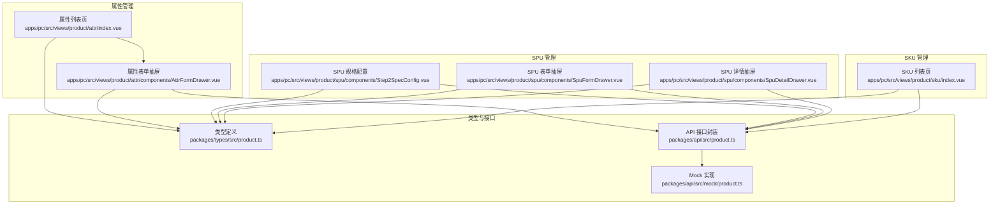
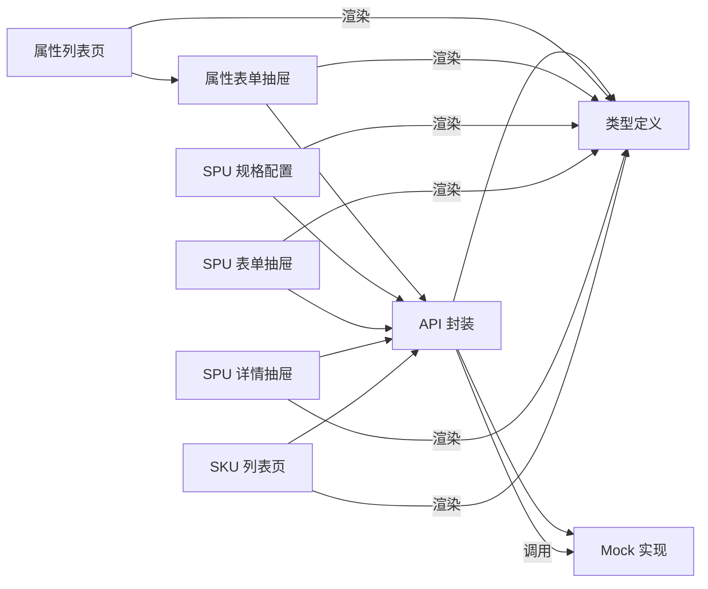
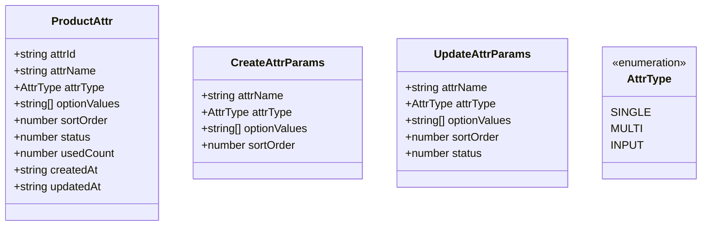
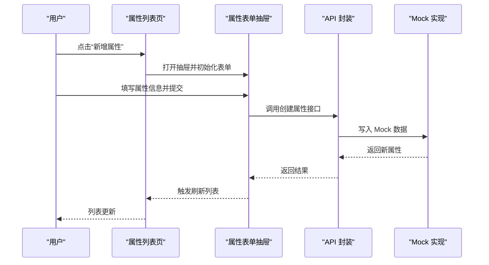
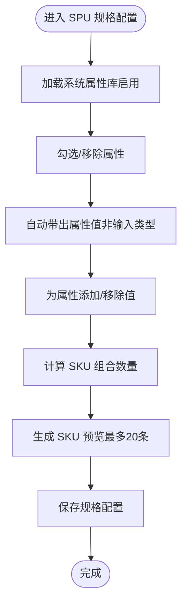
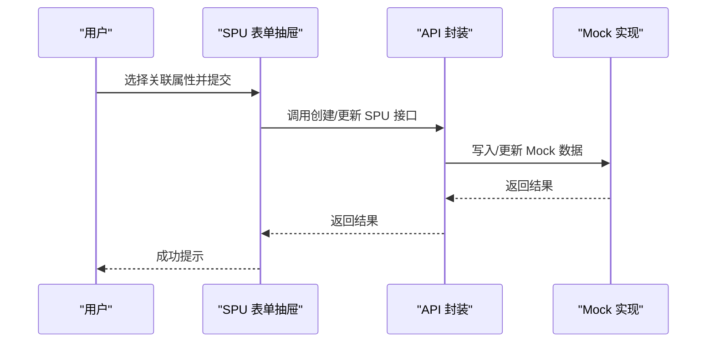
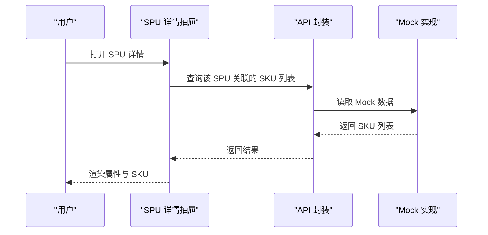
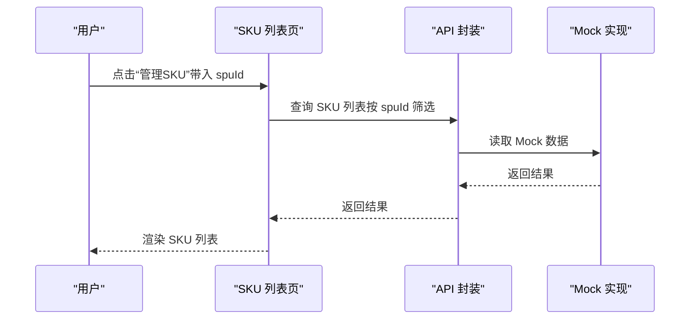
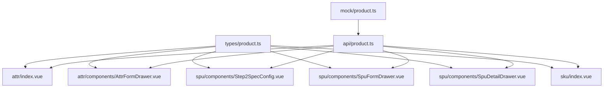

# 规格属性管理

<cite>
**本文引用的文件**
- [apps/pc/src/views/product/attr/index.vue](file://apps/pc/src/views/product/attr/index.vue)
- [apps/pc/src/views/product/attr/components/AttrFormDrawer.vue](file://apps/pc/src/views/product/attr/components/AttrFormDrawer.vue)
- [apps/pc/src/views/product/spu/components/Step2SpecConfig.vue](file://apps/pc/src/views/product/spu/components/Step2SpecConfig.vue)
- [apps/pc/src/views/product/spu/components/SpuFormDrawer.vue](file://apps/pc/src/views/product/spu/components/SpuFormDrawer.vue)
- [apps/pc/src/views/product/spu/components/SpuDetailDrawer.vue](file://apps/pc/src/views/product/spu/components/SpuDetailDrawer.vue)
- [packages/types/src/product.ts](file://packages/types/src/product.ts)
- [packages/api/src/product.ts](file://packages/api/src/product.ts)
- [packages/api/src/mock/product.ts](file://packages/api/src/mock/product.ts)
- [apps/pc/src/views/product/sku/index.vue](file://apps/pc/src/views/product/sku/index.vue)
</cite>

## 目录
1. [简介](#简介)
2. [项目结构](#项目结构)
3. [核心组件](#核心组件)
4. [架构总览](#架构总览)
5. [详细组件分析](#详细组件分析)
6. [依赖分析](#依赖分析)
7. [性能考虑](#性能考虑)
8. [故障排查指南](#故障排查指南)
9. [结论](#结论)
10. [附录](#附录)

## 简介
本文件围绕“规格属性管理”功能进行系统化说明，覆盖属性定义机制、属性值管理、属性与商品的关联关系、属性查询与筛选、属性类型管理、属性值排序、属性可见性控制、批量属性操作等核心能力，并结合业务规则、数据模型设计与实际应用场景，帮助开发者与运营人员高效理解与使用。

## 项目结构
规格属性管理涉及以下关键页面与组件：
- 属性管理列表页：负责属性的查询、筛选、删除与打开属性编辑抽屉
- 属性表单抽屉：负责属性的新增与编辑，含属性类型、可选值、排序与状态
- SPU 规格配置：负责在创建/编辑 SPU 时选择规格属性并维护属性值
- SPU 表单抽屉：负责 SPU 基础信息与属性关联
- SPU 详情抽屉：展示 SPU 关联的属性与 SKU 列表
- SKU 列表页：支持按 SPU 筛选，展示规格标签
- 类型与 API：定义属性数据模型、类型枚举与前后端接口

图表来源
- [apps/pc/src/views/product/attr/index.vue:1-239](file://apps/pc/src/views/product/attr/index.vue#L1-L239)
- [apps/pc/src/views/product/attr/components/AttrFormDrawer.vue:1-172](file://apps/pc/src/views/product/attr/components/AttrFormDrawer.vue#L1-L172)
- [apps/pc/src/views/product/spu/components/Step2SpecConfig.vue:1-331](file://apps/pc/src/views/product/spu/components/Step2SpecConfig.vue#L1-L331)
- [apps/pc/src/views/product/spu/components/SpuFormDrawer.vue:1-176](file://apps/pc/src/views/product/spu/components/SpuFormDrawer.vue#L1-L176)
- [apps/pc/src/views/product/spu/components/SpuDetailDrawer.vue:1-98](file://apps/pc/src/views/product/spu/components/SpuDetailDrawer.vue#L1-L98)
- [apps/pc/src/views/product/sku/index.vue:1-886](file://apps/pc/src/views/product/sku/index.vue#L1-L886)
- [packages/types/src/product.ts:52-83](file://packages/types/src/product.ts#L52-L83)
- [packages/api/src/product.ts:100-139](file://packages/api/src/product.ts#L100-L139)
- [packages/api/src/mock/product.ts:1030-1063](file://packages/api/src/mock/product.ts#L1030-L1063)

章节来源
- [apps/pc/src/views/product/attr/index.vue:1-239](file://apps/pc/src/views/product/attr/index.vue#L1-L239)
- [apps/pc/src/views/product/attr/components/AttrFormDrawer.vue:1-172](file://apps/pc/src/views/product/attr/components/AttrFormDrawer.vue#L1-L172)
- [apps/pc/src/views/product/spu/components/Step2SpecConfig.vue:1-331](file://apps/pc/src/views/product/spu/components/Step2SpecConfig.vue#L1-L331)
- [apps/pc/src/views/product/spu/components/SpuFormDrawer.vue:1-176](file://apps/pc/src/views/product/spu/components/SpuFormDrawer.vue#L1-L176)
- [apps/pc/src/views/product/spu/components/SpuDetailDrawer.vue:1-98](file://apps/pc/src/views/product/spu/components/SpuDetailDrawer.vue#L1-L98)
- [apps/pc/src/views/product/sku/index.vue:1-886](file://apps/pc/src/views/product/sku/index.vue#L1-L886)
- [packages/types/src/product.ts:52-83](file://packages/types/src/product.ts#L52-L83)
- [packages/api/src/product.ts:100-139](file://packages/api/src/product.ts#L100-L139)
- [packages/api/src/mock/product.ts:1030-1063](file://packages/api/src/mock/product.ts#L1030-L1063)

## 核心组件
- 属性列表页：提供属性名称搜索、状态筛选、分页、新增/编辑/删除操作；支持按属性类型标签展示与排序号、使用次数统计。
- 属性表单抽屉：支持属性名称、属性类型（单选/多选/输入）、可选值（输入框类型隐藏）、排序号、状态（编辑时可见）。
- SPU 规格配置：支持从系统属性库选择规格属性、动态维护属性值、实时计算 SKU 组合数量与预览。
- SPU 表单抽屉：支持选择关联属性（多选），并在编辑时展示状态。
- SPU 详情抽屉：展示 SPU 关联属性与 SKU 列表，便于核对规格配置。
- SKU 列表页：支持按 SPU 筛选，展示规格标签（key:value）与上下架状态切换。

章节来源
- [apps/pc/src/views/product/attr/index.vue:1-239](file://apps/pc/src/views/product/attr/index.vue#L1-L239)
- [apps/pc/src/views/product/attr/components/AttrFormDrawer.vue:1-172](file://apps/pc/src/views/product/attr/components/AttrFormDrawer.vue#L1-L172)
- [apps/pc/src/views/product/spu/components/Step2SpecConfig.vue:1-331](file://apps/pc/src/views/product/spu/components/Step2SpecConfig.vue#L1-L331)
- [apps/pc/src/views/product/spu/components/SpuFormDrawer.vue:1-176](file://apps/pc/src/views/product/spu/components/SpuFormDrawer.vue#L1-L176)
- [apps/pc/src/views/product/spu/components/SpuDetailDrawer.vue:1-98](file://apps/pc/src/views/product/spu/components/SpuDetailDrawer.vue#L1-L98)
- [apps/pc/src/views/product/sku/index.vue:1-886](file://apps/pc/src/views/product/sku/index.vue#L1-L886)

## 架构总览
规格属性管理遵循“类型定义 → API 封装 → 页面组件”的分层架构。类型定义位于 types 包，API 封装位于 api 包，页面组件位于 pc 应用。Mock 实现用于开发阶段的数据模拟。

图表来源
- [packages/types/src/product.ts:52-83](file://packages/types/src/product.ts#L52-L83)
- [packages/api/src/product.ts:100-139](file://packages/api/src/product.ts#L100-L139)
- [packages/api/src/mock/product.ts:1030-1063](file://packages/api/src/mock/product.ts#L1030-L1063)
- [apps/pc/src/views/product/attr/index.vue:1-239](file://apps/pc/src/views/product/attr/index.vue#L1-L239)
- [apps/pc/src/views/product/attr/components/AttrFormDrawer.vue:1-172](file://apps/pc/src/views/product/attr/components/AttrFormDrawer.vue#L1-L172)
- [apps/pc/src/views/product/spu/components/Step2SpecConfig.vue:1-331](file://apps/pc/src/views/product/spu/components/Step2SpecConfig.vue#L1-L331)
- [apps/pc/src/views/product/spu/components/SpuFormDrawer.vue:1-176](file://apps/pc/src/views/product/spu/components/SpuFormDrawer.vue#L1-L176)
- [apps/pc/src/views/product/spu/components/SpuDetailDrawer.vue:1-98](file://apps/pc/src/views/product/spu/components/SpuDetailDrawer.vue#L1-L98)
- [apps/pc/src/views/product/sku/index.vue:1-886](file://apps/pc/src/views/product/sku/index.vue#L1-L886)

## 详细组件分析

### 属性定义与数据模型
- 属性类型枚举：单选、多选、输入
- 属性实体：包含属性 ID、名称、类型、可选值数组、排序号、状态、使用计数、创建/更新时间
- 属性创建参数：名称、类型、可选值、排序号
- 属性更新参数：名称、类型、可选值、排序号、状态

图表来源
- [packages/types/src/product.ts:52-83](file://packages/types/src/product.ts#L52-L83)

章节来源
- [packages/types/src/product.ts:52-83](file://packages/types/src/product.ts#L52-L83)

### 属性列表页与属性表单抽屉
- 列表页功能：关键词搜索（属性名称）、状态筛选、分页、操作列（编辑/删除）、属性类型标签、可选值展示（单选/多选最多显示5个，输入类型显示占位）、排序号、使用次数、创建时间
- 表单抽屉功能：属性名称必填、属性类型在新增时可选且不可更改、输入类型隐藏可选值输入区、可选值增删、排序号、状态（编辑时可见）

图表来源
- [apps/pc/src/views/product/attr/index.vue:165-219](file://apps/pc/src/views/product/attr/index.vue#L165-L219)
- [apps/pc/src/views/product/attr/components/AttrFormDrawer.vue:119-152](file://apps/pc/src/views/product/attr/components/AttrFormDrawer.vue#L119-L152)
- [packages/api/src/product.ts:116-121](file://packages/api/src/product.ts#L116-L121)
- [packages/api/src/mock/product.ts:1030-1045](file://packages/api/src/mock/product.ts#L1030-L1045)

章节来源
- [apps/pc/src/views/product/attr/index.vue:1-239](file://apps/pc/src/views/product/attr/index.vue#L1-L239)
- [apps/pc/src/views/product/attr/components/AttrFormDrawer.vue:1-172](file://apps/pc/src/views/product/attr/components/AttrFormDrawer.vue#L1-L172)
- [packages/api/src/product.ts:116-121](file://packages/api/src/product.ts#L116-L121)
- [packages/api/src/mock/product.ts:1030-1045](file://packages/api/src/mock/product.ts#L1030-L1045)

### SPU 规格配置与属性值维护
- 选择规格属性：支持从系统属性库搜索与勾选，自动带出属性值（非输入类型）
- 维护属性值：支持为每个属性追加值，回车确认，移除值；实时计算 SKU 组合数量与预览
- 生成 SKU：根据所选属性与值生成笛卡尔积 SKU 列表，支持区分手动与自动生成

图表来源
- [apps/pc/src/views/product/spu/components/Step2SpecConfig.vue:96-230](file://apps/pc/src/views/product/spu/components/Step2SpecConfig.vue#L96-L230)
- [apps/pc/src/views/product/spu/components/Step2SpecConfig.vue:185-220](file://apps/pc/src/views/product/spu/components/Step2SpecConfig.vue#L185-L220)

章节来源
- [apps/pc/src/views/product/spu/components/Step2SpecConfig.vue:1-331](file://apps/pc/src/views/product/spu/components/Step2SpecConfig.vue#L1-L331)

### SPU 表单抽屉与属性关联
- 关联属性：在创建/编辑 SPU 时，从属性库中选择关联属性（多选），并展示属性类型标签
- 提交流程：校验必填项后，调用创建/更新接口，返回成功提示

图表来源
- [apps/pc/src/views/product/spu/components/SpuFormDrawer.vue:132-174](file://apps/pc/src/views/product/spu/components/SpuFormDrawer.vue#L132-L174)
- [packages/api/src/product.ts:157-180](file://packages/api/src/product.ts#L157-L180)
- [packages/api/src/mock/product.ts:1030-1045](file://packages/api/src/mock/product.ts#L1030-L1045)

章节来源
- [apps/pc/src/views/product/spu/components/SpuFormDrawer.vue:1-176](file://apps/pc/src/views/product/spu/components/SpuFormDrawer.vue#L1-L176)
- [packages/api/src/product.ts:157-180](file://packages/api/src/product.ts#L157-L180)
- [packages/api/src/mock/product.ts:1030-1045](file://packages/api/src/mock/product.ts#L1030-L1045)

### SPU 详情抽屉与 SKU 展示
- 展示 SPU 关联属性与 SKU 列表，便于核对规格配置
- SKU 列表展示规格标签（key:value）与状态

图表来源
- [apps/pc/src/views/product/spu/components/SpuDetailDrawer.vue:80-92](file://apps/pc/src/views/product/spu/components/SpuDetailDrawer.vue#L80-L92)
- [packages/api/src/product.ts:231-236](file://packages/api/src/product.ts#L231-L236)
- [packages/api/src/mock/product.ts:1030-1045](file://packages/api/src/mock/product.ts#L1030-L1045)

章节来源
- [apps/pc/src/views/product/spu/components/SpuDetailDrawer.vue:1-98](file://apps/pc/src/views/product/spu/components/SpuDetailDrawer.vue#L1-L98)
- [packages/api/src/product.ts:231-236](file://packages/api/src/product.ts#L231-L236)
- [packages/api/src/mock/product.ts:1030-1045](file://packages/api/src/mock/product.ts#L1030-L1045)

### SKU 列表页与属性筛选
- 支持按 SPU 筛选（从 SPU 列表点击“管理SKU”自动带入 spuId），展示规格标签（key:value）
- 支持上下架状态切换（乐观更新 + 失败回滚）

图表来源
- [apps/pc/src/views/product/sku/index.vue:508-540](file://apps/pc/src/views/product/sku/index.vue#L508-L540)
- [apps/pc/src/views/product/sku/index.vue:568-584](file://apps/pc/src/views/product/sku/index.vue#L568-L584)
- [packages/api/src/product.ts:182-187](file://packages/api/src/product.ts#L182-L187)
- [packages/api/src/mock/product.ts:1030-1045](file://packages/api/src/mock/product.ts#L1030-L1045)

章节来源
- [apps/pc/src/views/product/sku/index.vue:1-886](file://apps/pc/src/views/product/sku/index.vue#L1-L886)
- [packages/api/src/product.ts:182-187](file://packages/api/src/product.ts#L182-L187)
- [packages/api/src/mock/product.ts:1030-1045](file://packages/api/src/mock/product.ts#L1030-L1045)

## 依赖分析
- 类型依赖：各页面组件依赖 types 中的枚举与接口定义，确保前后端数据结构一致
- 接口依赖：页面组件通过 api 封装调用后端接口，开发阶段由 mock 实现提供数据
- 组件耦合：属性列表与表单抽屉松耦合，通过事件回调触发刷新；SPU 规格配置与属性库解耦，通过属性类型与可选值驱动

图表来源
- [packages/types/src/product.ts:52-83](file://packages/types/src/product.ts#L52-L83)
- [packages/api/src/product.ts:100-139](file://packages/api/src/product.ts#L100-L139)
- [packages/api/src/mock/product.ts:1030-1063](file://packages/api/src/mock/product.ts#L1030-L1063)
- [apps/pc/src/views/product/attr/index.vue:1-239](file://apps/pc/src/views/product/attr/index.vue#L1-L239)
- [apps/pc/src/views/product/attr/components/AttrFormDrawer.vue:1-172](file://apps/pc/src/views/product/attr/components/AttrFormDrawer.vue#L1-L172)
- [apps/pc/src/views/product/spu/components/Step2SpecConfig.vue:1-331](file://apps/pc/src/views/product/spu/components/Step2SpecConfig.vue#L1-L331)
- [apps/pc/src/views/product/spu/components/SpuFormDrawer.vue:1-176](file://apps/pc/src/views/product/spu/components/SpuFormDrawer.vue#L1-L176)
- [apps/pc/src/views/product/spu/components/SpuDetailDrawer.vue:1-98](file://apps/pc/src/views/product/spu/components/SpuDetailDrawer.vue#L1-L98)
- [apps/pc/src/views/product/sku/index.vue:1-886](file://apps/pc/src/views/product/sku/index.vue#L1-L886)

章节来源
- [packages/types/src/product.ts:52-83](file://packages/types/src/product.ts#L52-L83)
- [packages/api/src/product.ts:100-139](file://packages/api/src/product.ts#L100-L139)
- [packages/api/src/mock/product.ts:1030-1063](file://packages/api/src/mock/product.ts#L1030-L1063)
- [apps/pc/src/views/product/attr/index.vue:1-239](file://apps/pc/src/views/product/attr/index.vue#L1-L239)
- [apps/pc/src/views/product/attr/components/AttrFormDrawer.vue:1-172](file://apps/pc/src/views/product/attr/components/AttrFormDrawer.vue#L1-L172)
- [apps/pc/src/views/product/spu/components/Step2SpecConfig.vue:1-331](file://apps/pc/src/views/product/spu/components/Step2SpecConfig.vue#L1-L331)
- [apps/pc/src/views/product/spu/components/SpuFormDrawer.vue:1-176](file://apps/pc/src/views/product/spu/components/SpuFormDrawer.vue#L1-L176)
- [apps/pc/src/views/product/spu/components/SpuDetailDrawer.vue:1-98](file://apps/pc/src/views/product/spu/components/SpuDetailDrawer.vue#L1-L98)
- [apps/pc/src/views/product/sku/index.vue:1-886](file://apps/pc/src/views/product/sku/index.vue#L1-L886)

## 性能考虑
- 列表分页：属性与 SKU 列表均采用分页加载，避免一次性渲染大量数据
- 可选值渲染优化：属性列表对可选值做截断展示，减少 DOM 渲染压力
- 规格配置预览：SKU 预览限制展示数量，避免大规模组合渲染
- 乐观更新：SKU 上下架状态切换采用乐观更新策略，提升交互响应速度

## 故障排查指南
- 属性删除失败：检查是否存在属性值或被商品使用；Mock 实现会返回明确错误信息
- 属性创建/更新异常：检查表单校验（名称、类型、可选值等）；查看消息提示
- SPU 规格配置为空：确认系统属性库中存在启用状态的属性；检查属性类型与可选值是否正确
- SKU 列表筛选无效：确认从 SPU 列表点击“管理SKU”时是否正确带入 spuId

章节来源
- [packages/api/src/product.ts:132-139](file://packages/api/src/product.ts#L132-L139)
- [packages/api/src/mock/product.ts:1056-1063](file://packages/api/src/mock/product.ts#L1056-L1063)
- [apps/pc/src/views/product/attr/components/AttrFormDrawer.vue:119-152](file://apps/pc/src/views/product/attr/components/AttrFormDrawer.vue#L119-L152)
- [apps/pc/src/views/product/spu/components/Step2SpecConfig.vue:96-103](file://apps/pc/src/views/product/spu/components/Step2SpecConfig.vue#L96-L103)
- [apps/pc/src/views/product/sku/index.vue:508-540](file://apps/pc/src/views/product/sku/index.vue#L508-L540)

## 结论
规格属性管理通过清晰的类型定义、完善的 API 封装与直观的页面组件，实现了属性创建、属性值维护、属性与商品关联、属性筛选与 SKU 生成的全链路闭环。系统具备良好的扩展性与可维护性，适合在多角色权限与复杂商品结构场景下稳定运行。

## 附录
- 业务规则摘要
  - 属性类型：单选（用于唯一维度如颜色）、多选（用于组合维度如包装规格）、输入（用于自定义维度如品牌）
  - 属性值：单选/多选类型必须维护可选值；输入类型无需可选值
  - 排序号：数值越大排序越靠前
  - 状态：启用/禁用，禁用属性不会出现在可用列表中
  - SPU 关联：SPU 创建/编辑时需选择关联属性，用于生成 SKU 组合
  - SKU 筛选：支持按 SPU 筛选，展示规格标签与上下架状态

- 数据模型要点
  - 属性实体包含 attrId、attrName、attrType、optionValues、sortOrder、status、usedCount、createdAt、updatedAt
  - SPU 关联属性通过 attrIds 与 attrNames 维护
  - SKU 规格以键值对形式存储在 specs 字段中

章节来源
- [packages/types/src/product.ts:52-83](file://packages/types/src/product.ts#L52-L83)
- [apps/pc/src/views/product/spu/components/SpuFormDrawer.vue:79-116](file://apps/pc/src/views/product/spu/components/SpuFormDrawer.vue#L79-L116)
- [apps/pc/src/views/product/sku/index.vue:568-584](file://apps/pc/src/views/product/sku/index.vue#L568-L584)