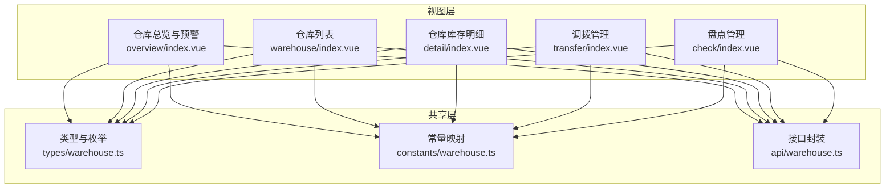
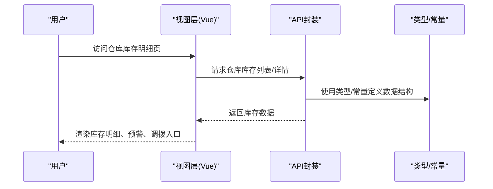
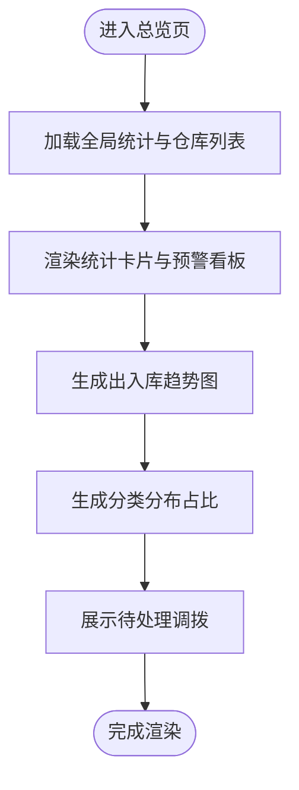
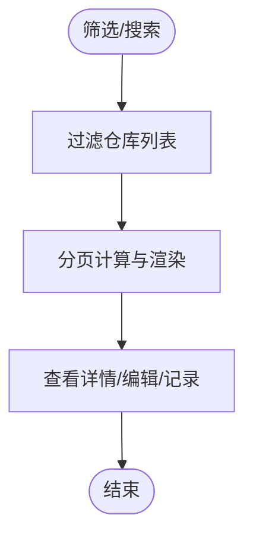
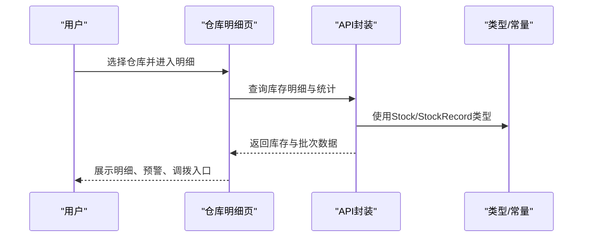
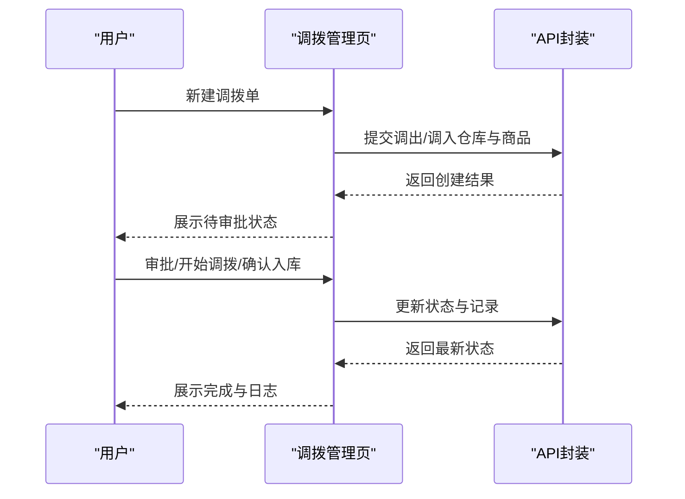
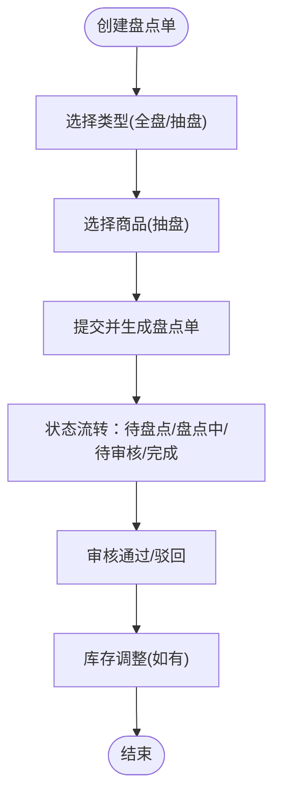
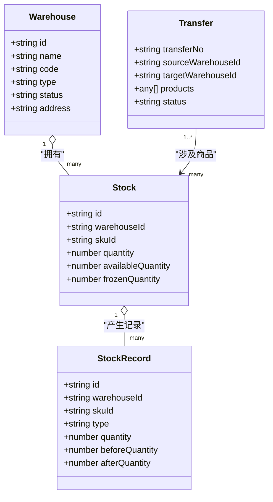

# 仓库库存明细

<cite>
**本文引用的文件**
- [apps/pc/src/views/stock/detail/index.vue](file://apps/pc/src/views/stock/detail/index.vue)
- [apps/pc/src/views/stock/overview/index.vue](file://apps/pc/src/views/stock/overview/index.vue)
- [apps/pc/src/views/stock/warehouse/index.vue](file://apps/pc/src/views/stock/warehouse/index.vue)
- [apps/pc/src/views/stock/transfer/index.vue](file://apps/pc/src/views/stock/transfer/index.vue)
- [apps/pc/src/views/stock/check/index.vue](file://apps/pc/src/views/stock/check/index.vue)
- [packages/types/src/warehouse.ts](file://packages/types/src/warehouse.ts)
- [packages/constants/src/warehouse.ts](file://packages/constants/src/warehouse.ts)
- [packages/api/src/warehouse.ts](file://packages/api/src/warehouse.ts)
</cite>

## 目录
1. [简介](#简介)
2. [项目结构](#项目结构)
3. [核心组件](#核心组件)
4. [架构总览](#架构总览)
5. [详细组件分析](#详细组件分析)
6. [依赖关系分析](#依赖关系分析)
7. [性能考量](#性能考量)
8. [故障排查指南](#故障排查指南)
9. [结论](#结论)
10. [附录](#附录)

## 简介
本文件围绕“仓库库存明细”功能，系统化梳理仓库维度的库存查询、库存分布、库存预警、库存报表、库存调拨追踪与统计分析方法。通过对前端页面与类型/常量/API 层的协同分析，帮助仓库管理人员与决策者实现：
- 快速定位仓库库存现状与异常
- 基于分类与仓库维度的库存占比与周转对比
- 跨仓库调拨的全流程追踪与审批
- 基于盘点与批次的库存质量与准确性保障

## 项目结构
仓库库存明细相关能力主要分布在 PC 端视图层与共享的类型/常量/API 层：
- 视图层（Vue 页面）
  - 仓库总览与预警：apps/pc/src/views/stock/overview/index.vue
  - 仓库列表与筛选：apps/pc/src/views/stock/warehouse/index.vue
  - 仓库库存明细：apps/pc/src/views/stock/detail/index.vue
  - 调拨管理：apps/pc/src/views/stock/transfer/index.vue
  - 盘点管理：apps/pc/src/views/stock/check/index.vue
- 类型与常量
  - 数据模型与枚举：packages/types/src/warehouse.ts
  - 状态与枚举映射：packages/constants/src/warehouse.ts
- 接口封装
  - 仓库与库存接口：packages/api/src/warehouse.ts

图表来源
- [apps/pc/src/views/stock/overview/index.vue:1-1004](file://apps/pc/src/views/stock/overview/index.vue#L1-L1004)
- [apps/pc/src/views/stock/warehouse/index.vue:1-715](file://apps/pc/src/views/stock/warehouse/index.vue#L1-L715)
- [apps/pc/src/views/stock/detail/index.vue:1-1135](file://apps/pc/src/views/stock/detail/index.vue#L1-L1135)
- [apps/pc/src/views/stock/transfer/index.vue:1-723](file://apps/pc/src/views/stock/transfer/index.vue#L1-L723)
- [apps/pc/src/views/stock/check/index.vue:1-452](file://apps/pc/src/views/stock/check/index.vue#L1-L452)
- [packages/types/src/warehouse.ts:1-112](file://packages/types/src/warehouse.ts#L1-L112)
- [packages/constants/src/warehouse.ts:1-30](file://packages/constants/src/warehouse.ts#L1-L30)
- [packages/api/src/warehouse.ts:1-114](file://packages/api/src/warehouse.ts#L1-L114)

章节来源
- [apps/pc/src/views/stock/overview/index.vue:1-1004](file://apps/pc/src/views/stock/overview/index.vue#L1-L1004)
- [apps/pc/src/views/stock/warehouse/index.vue:1-715](file://apps/pc/src/views/stock/warehouse/index.vue#L1-L715)
- [apps/pc/src/views/stock/detail/index.vue:1-1135](file://apps/pc/src/views/stock/detail/index.vue#L1-L1135)
- [apps/pc/src/views/stock/transfer/index.vue:1-723](file://apps/pc/src/views/stock/transfer/index.vue#L1-L723)
- [apps/pc/src/views/stock/check/index.vue:1-452](file://apps/pc/src/views/stock/check/index.vue#L1-L452)
- [packages/types/src/warehouse.ts:1-112](file://packages/types/src/warehouse.ts#L1-L112)
- [packages/constants/src/warehouse.ts:1-30](file://packages/constants/src/warehouse.ts#L1-L30)
- [packages/api/src/warehouse.ts:1-114](file://packages/api/src/warehouse.ts#L1-L114)

## 核心组件
- 仓库总览与预警页：提供全局库存统计、仓库容量与预警看板、出入库趋势、分类分布、待处理调拨等。
- 仓库列表页：支持按类型/状态/关键词筛选，展示仓库容量、商品种类、库存总量与价值、预警/缺货数量等。
- 仓库库存明细页：按仓库维度展示商品明细、批次、库存状态、出入库记录、安全库存设置、调拨与调整入口。
- 调拨管理页：支持创建调拨单、审批流转、调拨中与确认入库，提供调拨单号、仓库对、商品明细与价值统计。
- 盘点管理页：支持创建全盘/抽盘、查询状态、差异金额、审核通过/驳回与库存调整。

章节来源
- [apps/pc/src/views/stock/overview/index.vue:1-1004](file://apps/pc/src/views/stock/overview/index.vue#L1-L1004)
- [apps/pc/src/views/stock/warehouse/index.vue:1-715](file://apps/pc/src/views/stock/warehouse/index.vue#L1-L715)
- [apps/pc/src/views/stock/detail/index.vue:1-1135](file://apps/pc/src/views/stock/detail/index.vue#L1-L1135)
- [apps/pc/src/views/stock/transfer/index.vue:1-723](file://apps/pc/src/views/stock/transfer/index.vue#L1-L723)
- [apps/pc/src/views/stock/check/index.vue:1-452](file://apps/pc/src/views/stock/check/index.vue#L1-L452)

## 架构总览
整体采用“视图层（Vue 页面）—共享层（类型/常量/API）”的分层设计。视图层通过 API 封装访问仓库与库存数据，类型与常量提供统一的数据结构与枚举映射，确保前后端一致性与可维护性。

图表来源
- [apps/pc/src/views/stock/detail/index.vue:1-1135](file://apps/pc/src/views/stock/detail/index.vue#L1-L1135)
- [packages/api/src/warehouse.ts:1-114](file://packages/api/src/warehouse.ts#L1-L114)
- [packages/types/src/warehouse.ts:1-112](file://packages/types/src/warehouse.ts#L1-L112)
- [packages/constants/src/warehouse.ts:1-30](file://packages/constants/src/warehouse.ts#L1-L30)

## 详细组件分析

### 仓库总览与预警（overview/index.vue）
- 功能要点
  - 全局统计：仓库总数、商品种类、总库存量、库存总价值、日均周转、预警/缺货数量。
  - 实时监控：仓库容量使用率、商品种类、库存总量与价值、周转天数、预警/缺货数量。
  - 预警看板：按级别显示库存预警与仓库容量告警，支持跳转处理。
  - 出入库趋势：近7天入库/出库柱状图与周度汇总。
  - 分类分布：按品类统计库存总量、价值与占比，并标注预警数量。
  - 待处理调拨：展示待审批调拨单并支持审批。
- 关键数据聚合
  - 仓库维度：使用率 = 已用容量/总容量；库存总量/价值；预警/缺货商品数。
  - 分类维度：按品类汇总总量、总价值与占比。
  - 时间维度：出入库趋势按日聚合。
- 决策支持
  - 高周转天数提示优化补货节奏；高价值库存关注安全库存与滞销风险。
  - 容量告警提示清仓或扩容策略。

图表来源
- [apps/pc/src/views/stock/overview/index.vue:1-1004](file://apps/pc/src/views/stock/overview/index.vue#L1-L1004)

章节来源
- [apps/pc/src/views/stock/overview/index.vue:1-1004](file://apps/pc/src/views/stock/overview/index.vue#L1-L1004)

### 仓库列表与筛选（warehouse/index.vue）
- 功能要点
  - 支持按关键词、仓库类型、状态筛选；分页展示仓库容量、商品种类、库存总量与价值、预警/缺货数量。
  - 容量条可视化：根据使用率动态配色。
  - 操作：查看详情、编辑、出入库记录。
- 统计分析
  - 仓库间对比：容量、商品种类、库存总量/价值、预警/缺货数量。
  - 结合总览页进行跨仓对比与资源调度。

图表来源
- [apps/pc/src/views/stock/warehouse/index.vue:1-715](file://apps/pc/src/views/stock/warehouse/index.vue#L1-L715)

章节来源
- [apps/pc/src/views/stock/warehouse/index.vue:1-715](file://apps/pc/src/views/stock/warehouse/index.vue#L1-L715)

### 仓库库存明细（detail/index.vue）
- 功能要点
  - 仓库基础信息与统计卡片：商品种类、库存总量、库存价值、可用库存、预警/缺货数量。
  - 商品明细：分类、规格、库存数量（含可用/锁定）、安全库存、采购价、库存价值、库位、更新时间、批次数量。
  - 筛选与分页：按关键字与分类筛选，分页展示。
  - 操作：入库、出库、记录、调整、批次查看、发起调拨。
  - 安全库存与预警：基于“当前库存 < 安全库存”触发预警。
  - 调拨：多选商品批量发起调拨，填写调入仓库与原因。
- 关键逻辑
  - 明细筛选：根据“全部/预警/缺货”切换；支持关键词与分类联动。
  - 库存状态：可用/锁定/缺货/预警等状态标识。
  - 批次管理：支持批次列表查看与按批次出库。

图表来源
- [apps/pc/src/views/stock/detail/index.vue:1-1135](file://apps/pc/src/views/stock/detail/index.vue#L1-L1135)
- [packages/api/src/warehouse.ts:1-114](file://packages/api/src/warehouse.ts#L1-L114)
- [packages/types/src/warehouse.ts:1-112](file://packages/types/src/warehouse.ts#L1-L112)

章节来源
- [apps/pc/src/views/stock/detail/index.vue:1-1135](file://apps/pc/src/views/stock/detail/index.vue#L1-L1135)

### 调拨管理（transfer/index.vue）
- 功能要点
  - 调拨单生命周期：待审批、已审批、调拨中、已完成、已拒绝。
  - 新建调拨单：选择调出/调入仓库、添加商品（可用库存限制）、填写原因。
  - 审批与执行：审批通过后开始调拨，确认入库后完成。
  - 详情与审批记录：展示调拨单号、仓库对、商品明细、总数量/价值与审批时间线。
- 追踪机制
  - 单据状态流转与操作日志（时间线）。
  - 调拨前后库存变化与记录类型（调拨入库/出库）。

图表来源
- [apps/pc/src/views/stock/transfer/index.vue:1-723](file://apps/pc/src/views/stock/transfer/index.vue#L1-L723)
- [packages/api/src/warehouse.ts:106-114](file://packages/api/src/warehouse.ts#L106-L114)
- [packages/types/src/warehouse.ts:87-112](file://packages/types/src/warehouse.ts#L87-L112)

章节来源
- [apps/pc/src/views/stock/transfer/index.vue:1-723](file://apps/pc/src/views/stock/transfer/index.vue#L1-L723)

### 盘点管理（check/index.vue）
- 功能要点
  - 创建全盘/抽盘：选择仓库、类型、商品（抽盘），填写备注。
  - 查询与筛选：按单号、仓库、状态、日期范围查询。
  - 审核：展示差异金额与差异明细，支持通过/驳回。
- 统计分析
  - 盘点差异金额与差异原因，支撑库存准确性评估与成本核算。

图表来源
- [apps/pc/src/views/stock/check/index.vue:1-452](file://apps/pc/src/views/stock/check/index.vue#L1-L452)

章节来源
- [apps/pc/src/views/stock/check/index.vue:1-452](file://apps/pc/src/views/stock/check/index.vue#L1-L452)

## 依赖关系分析
- 类型与常量
  - 类型定义：仓库(Warehouse)、库区(WarehouseArea)、库位(WarehouseLocation)、库存(Stock)、库存记录(StockRecord)。
  - 常量映射：仓库状态、库区类型、库位状态、库存记录类型。
- API 封装
  - 仓库与库存：列表、详情、创建/更新/删除、库存明细、出入库、调拨、记录查询。
  - 调拨与盘点：调拨单生命周期、盘点单创建与审核。
- 视图层
  - 通过 props 与状态管理消费 API 返回数据，结合类型/常量进行渲染与交互。

图表来源
- [packages/types/src/warehouse.ts:1-112](file://packages/types/src/warehouse.ts#L1-L112)

章节来源
- [packages/types/src/warehouse.ts:1-112](file://packages/types/src/warehouse.ts#L1-L112)
- [packages/constants/src/warehouse.ts:1-30](file://packages/constants/src/warehouse.ts#L1-L30)
- [packages/api/src/warehouse.ts:1-114](file://packages/api/src/warehouse.ts#L1-L114)

## 性能考量
- 列表分页与筛选：通过分页参数与本地/服务端筛选减少一次性渲染压力。
- 图表渲染：趋势图按最大值动态计算高度，避免过度重绘。
- 批量操作：调拨与盘点支持批量选择，减少重复请求与交互成本。
- 数据缓存：在 Mock 或本地缓存场景下，合理利用响应式数据避免重复拉取。

## 故障排查指南
- 仓库不存在或详情为空
  - 现象：仓库详情接口返回空或报错。
  - 排查：检查仓库 ID 参数与后端是否存在；确认 Mock 数据是否匹配。
  - 相关路径
    - [packages/api/src/warehouse.ts:15-22](file://packages/api/src/warehouse.ts#L15-L22)
- 调拨单必填项缺失
  - 现象：创建/审批调拨单时报错。
  - 排查：确认调出/调入仓库、商品、原因是否填写。
  - 相关路径
    - [apps/pc/src/views/stock/transfer/index.vue:541-561](file://apps/pc/src/views/stock/transfer/index.vue#L541-L561)
- 盘点单状态异常
  - 现象：盘点单状态不一致或无法继续。
  - 排查：检查状态流转顺序与权限；确认差异审核是否完成。
  - 相关路径
    - [apps/pc/src/views/stock/check/index.vue:393-428](file://apps/pc/src/views/stock/check/index.vue#L393-L428)

章节来源
- [packages/api/src/warehouse.ts:15-22](file://packages/api/src/warehouse.ts#L15-L22)
- [apps/pc/src/views/stock/transfer/index.vue:541-561](file://apps/pc/src/views/stock/transfer/index.vue#L541-L561)
- [apps/pc/src/views/stock/check/index.vue:393-428](file://apps/pc/src/views/stock/check/index.vue#L393-L428)

## 结论
仓库库存明细功能以“视图层—共享层”分层设计实现，围绕仓库维度提供库存查询、分布、预警、报表与调拨追踪的闭环能力。通过类型/常量/API 的统一约束，确保数据一致性与可扩展性；通过分页、筛选、趋势与占比分析，为仓库管理与决策提供有效支撑。

## 附录
- 决策支持与优化建议
  - 库存占比分析：结合分类分布与价值占比，识别高价值/低效品类，优化安全库存与补货策略。
  - 仓库周转对比：关注周转天数差异，优化调拨与补货节奏，降低资金占用。
  - 异常监控：建立预警阈值与容量告警机制，定期盘点与批次管理，提升库存准确性。
  - 调拨优化：基于仓库间供需与容量，制定调拨计划与审批流程，缩短响应时间。