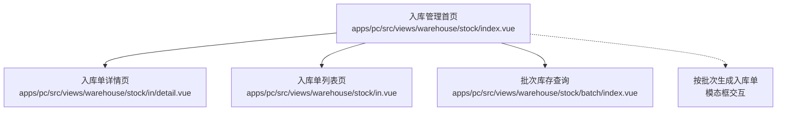
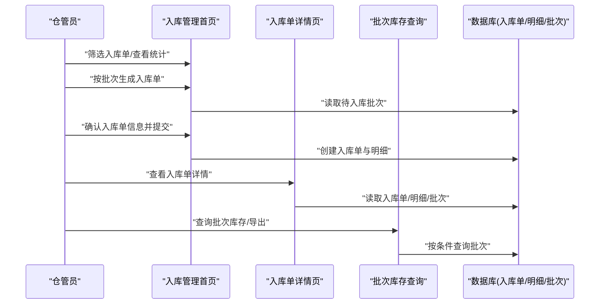
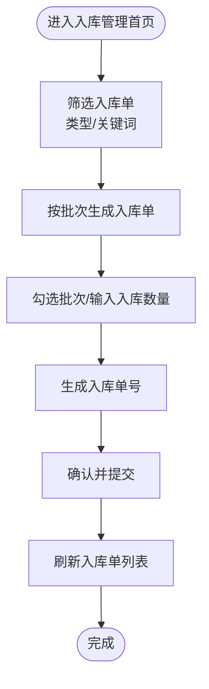
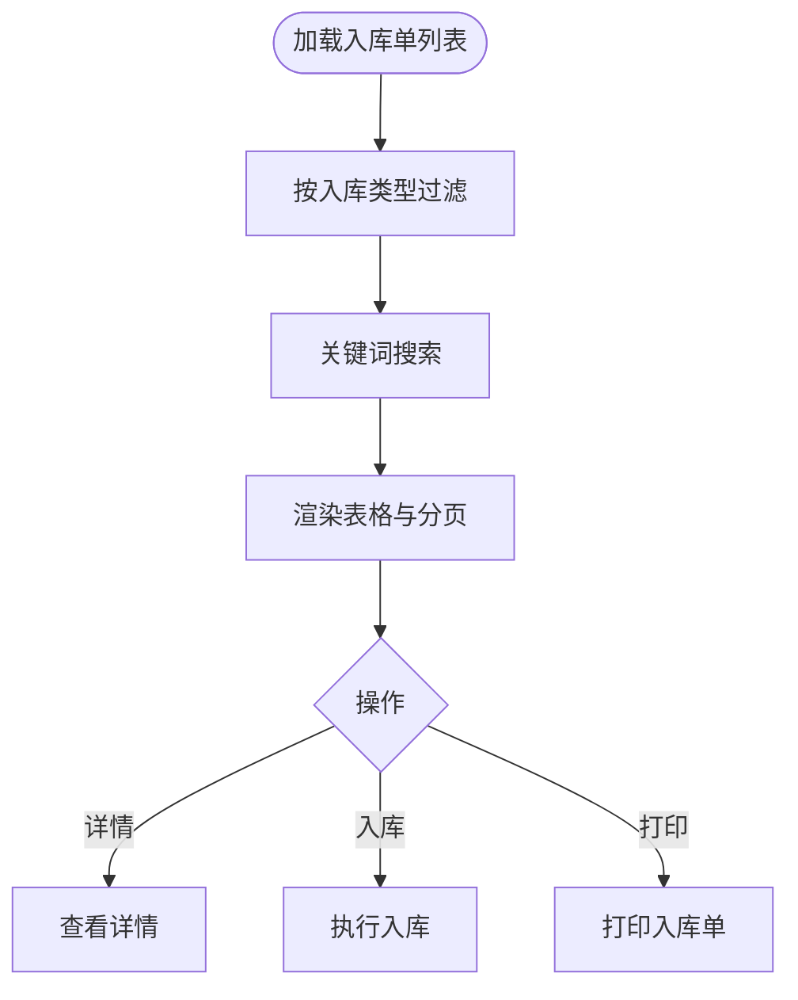
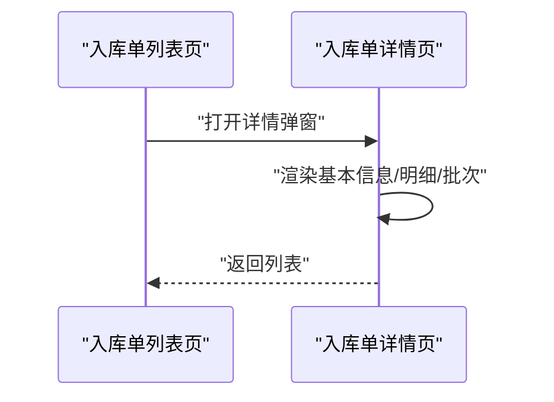
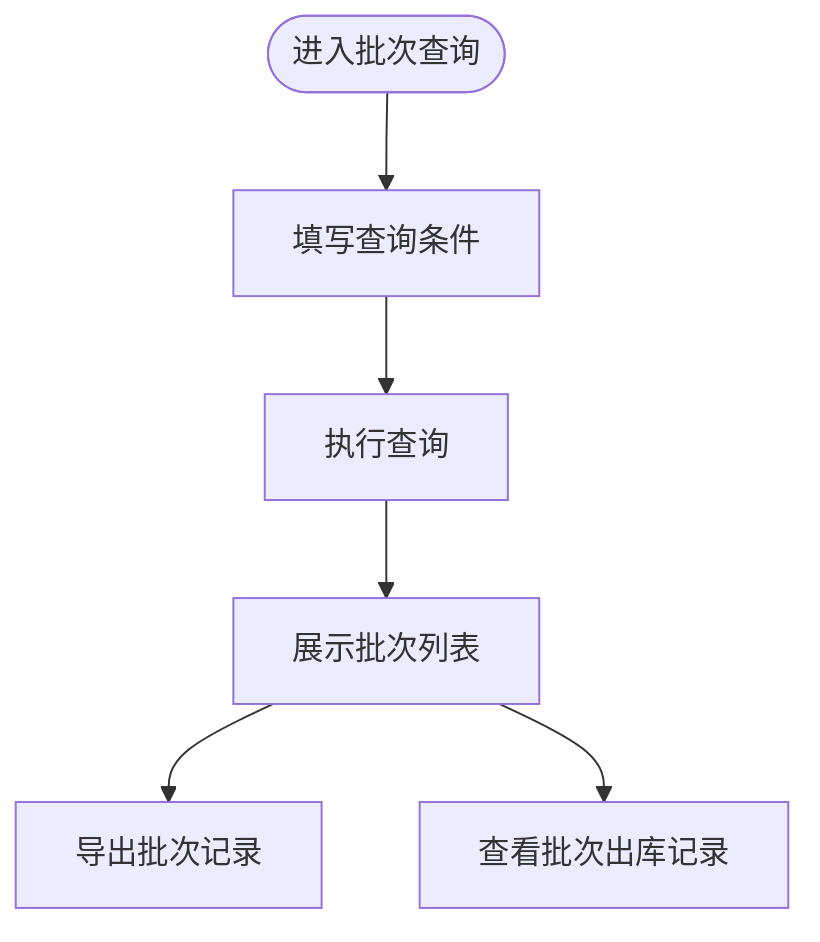
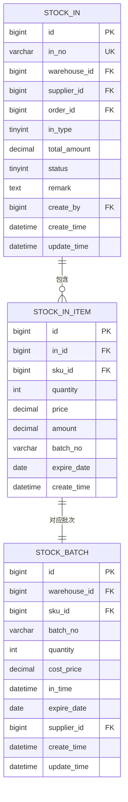
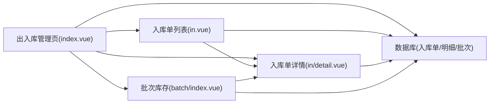

# 入库管理

<cite>
**本文引用的文件**
- [apps/pc/src/views/warehouse/stock/index.vue](file://apps/pc/src/views/warehouse/stock/index.vue)
- [apps/pc/src/views/warehouse/stock/in.vue](file://apps/pc/src/views/warehouse/stock/in.vue)
- [apps/pc/src/views/warehouse/stock/batch/index.vue](file://apps/pc/src/views/warehouse/stock/batch/index.vue)
- [apps/pc/src/views/warehouse/stock/in/detail.vue](file://apps/pc/src/views/warehouse/stock/in/detail.vue)
- [docs/PRD/02-业务流程设计.md](file://docs/PRD/02-业务流程设计.md)
- [docs/PRD/03-数据模型与表结构.md](file://docs/PRD/03-数据模型与表结构.md)
- [工程仓端_完整58个功能_全链路.csv](file://工程仓端_完整58个功能_全链路.csv)
</cite>

## 目录
1. [简介](#简介)
2. [项目结构](#项目结构)
3. [核心组件](#核心组件)
4. [架构总览](#架构总览)
5. [详细组件分析](#详细组件分析)
6. [依赖分析](#依赖分析)
7. [性能考虑](#性能考虑)
8. [故障排查指南](#故障排查指南)
9. [结论](#结论)
10. [附录](#附录)

## 简介
本文件面向“入库管理”功能，系统化阐述入库单创建流程、入库审核机制、入库查询与历史记录管理、入库数据结构与审批流程设计、库存数量更新逻辑与批次管理机制，并覆盖不同入库类型（采购入库、调拨入库、退货入库等）、异常入库处理方案以及入库数据的审计追踪。同时提供操作指南与常见问题解决方案，帮助工程仓仓管员高效完成入库作业。

## 项目结构
入库管理相关前端页面集中在 PC 端工程仓模块，主要涉及以下页面：
- 入库管理首页：展示入库单列表、筛选与统计
- 入库单详情页：查看入库单明细、批次明细、打印
- 批次库存查询：按批次维度查询库存、导出、查看出库记录
- 入库单创建（按批次）：从待入库批次批量生成入库单

图表来源
- [apps/pc/src/views/warehouse/stock/index.vue:10-118](file://apps/pc/src/views/warehouse/stock/index.vue#L10-L118)
- [apps/pc/src/views/warehouse/stock/in.vue:1-165](file://apps/pc/src/views/warehouse/stock/in.vue#L1-L165)
- [apps/pc/src/views/warehouse/stock/batch/index.vue:1-125](file://apps/pc/src/views/warehouse/stock/batch/index.vue#L1-L125)
- [apps/pc/src/views/warehouse/stock/in/detail.vue:1-42](file://apps/pc/src/views/warehouse/stock/in/detail.vue#L1-L42)

章节来源
- [apps/pc/src/views/warehouse/stock/index.vue:1-118](file://apps/pc/src/views/warehouse/stock/index.vue#L1-L118)
- [apps/pc/src/views/warehouse/stock/in.vue:1-165](file://apps/pc/src/views/warehouse/stock/in.vue#L1-L165)
- [apps/pc/src/views/warehouse/stock/batch/index.vue:1-125](file://apps/pc/src/views/warehouse/stock/batch/index.vue#L1-L125)
- [apps/pc/src/views/warehouse/stock/in/detail.vue:1-42](file://apps/pc/src/views/warehouse/stock/in/detail.vue#L1-L42)

## 核心组件
- 入库管理首页（出入库管理页）：提供入库单列表、筛选、统计卡片、按批次生成入库单入口、入库单详情查看。
- 入库单列表页：展示入库单基础信息、状态、来源单据、仓库、供应商、批次数量、总数量与金额等。
- 入库单详情页：展示入库单基本信息、商品明细、批次明细、状态标签、打印入口。
- 批次库存查询页：按批次号、商品名称、入库日期、库存状态、仓库等条件查询批次库存，查看批次出库记录并导出。
- 数据模型支撑：入库单、入库明细、批次库存等数据库表结构定义。

章节来源
- [apps/pc/src/views/warehouse/stock/index.vue:10-118](file://apps/pc/src/views/warehouse/stock/index.vue#L10-L118)
- [apps/pc/src/views/warehouse/stock/in.vue:56-118](file://apps/pc/src/views/warehouse/stock/in.vue#L56-L118)
- [apps/pc/src/views/warehouse/stock/in/detail.vue:1-42](file://apps/pc/src/views/warehouse/stock/in/detail.vue#L1-L42)
- [apps/pc/src/views/warehouse/stock/batch/index.vue:13-87](file://apps/pc/src/views/warehouse/stock/batch/index.vue#L13-L87)
- [docs/PRD/03-数据模型与表结构.md:515-590](file://docs/PRD/03-数据模型与表结构.md#L515-L590)

## 架构总览
入库管理在前端采用“页面组件 + 数据模型”的结构，页面负责用户交互与展示，数据模型来自 PRD 的数据库表结构。业务流程遵循“创建入库单 → 验货/异常处理 → 入库确认 → 更新库存”的闭环。

图表来源
- [apps/pc/src/views/warehouse/stock/index.vue:235-313](file://apps/pc/src/views/warehouse/stock/index.vue#L235-L313)
- [apps/pc/src/views/warehouse/stock/in/detail.vue:1-42](file://apps/pc/src/views/warehouse/stock/in/detail.vue#L1-L42)
- [apps/pc/src/views/warehouse/stock/batch/index.vue:13-87](file://apps/pc/src/views/warehouse/stock/batch/index.vue#L13-L87)
- [docs/PRD/03-数据模型与表结构.md:515-590](file://docs/PRD/03-数据模型与表结构.md#L515-L590)

## 详细组件分析

### 入库管理首页（出入库管理页）
- 功能要点
  - 入库单列表：支持按入库类型（采购/调拨/退货）、关键词搜索、分页展示。
  - 统计看板：今日入库单、待入库数量、入库商品数、入库金额。
  - 按批次生成入库单：弹窗内支持多选批次、计算总数量与总金额、生成入库单号、填写备注。
  - 入库单详情查看：弹窗展示入库单基本信息、商品明细、批次明细。
- 交互流程
  - 选择入库类型与关键词过滤，点击“按批次入库”打开模态框。
  - 在模态框中勾选批次，输入入库数量（受批次可入库数量限制），生成入库单号，提交后刷新列表。

图表来源
- [apps/pc/src/views/warehouse/stock/index.vue:235-313](file://apps/pc/src/views/warehouse/stock/index.vue#L235-L313)
- [apps/pc/src/views/warehouse/stock/index.vue:686-762](file://apps/pc/src/views/warehouse/stock/index.vue#L686-L762)

章节来源
- [apps/pc/src/views/warehouse/stock/index.vue:10-118](file://apps/pc/src/views/warehouse/stock/index.vue#L10-L118)
- [apps/pc/src/views/warehouse/stock/index.vue:235-313](file://apps/pc/src/views/warehouse/stock/index.vue#L235-L313)
- [apps/pc/src/views/warehouse/stock/index.vue:686-762](file://apps/pc/src/views/warehouse/stock/index.vue#L686-L762)

### 入库单列表页
- 功能要点
  - 展示入库单号、入库类型、来源单据、仓库、供应商、商品种类、批次数量、总数量、总金额、状态、创建人、创建时间。
  - 支持“详情”查看与“入库”“打印”等操作（部分状态开放）。
- 状态与颜色映射
  - 采购入库：绿色标签
  - 调拨入库：蓝色标签
  - 退货入库：橙色标签
  - 状态：待入库/入库中/已完成/已取消（颜色与文案映射）

图表来源
- [apps/pc/src/views/warehouse/stock/in.vue:56-118](file://apps/pc/src/views/warehouse/stock/in.vue#L56-L118)
- [apps/pc/src/views/warehouse/stock/in.vue:310-346](file://apps/pc/src/views/warehouse/stock/in.vue#L310-L346)

章节来源
- [apps/pc/src/views/warehouse/stock/in.vue:56-118](file://apps/pc/src/views/warehouse/stock/in.vue#L56-L118)
- [apps/pc/src/views/warehouse/stock/in.vue:310-346](file://apps/pc/src/views/warehouse/stock/in.vue#L310-L346)

### 入库单详情页
- 功能要点
  - 展示入库单号、入库类型、来源单据、仓库、供应商、创建人、创建时间、状态。
  - 商品明细：商品名称、规格、单位、单价、入库数量、金额。
  - 批次明细：批次号、SKU 编码、商品名称、入库数量。
  - 打印入口。
- 与首页联动
  - 从首页点击“详情”打开，携带当前入库单数据。

图表来源
- [apps/pc/src/views/warehouse/stock/in.vue:120-163](file://apps/pc/src/views/warehouse/stock/in.vue#L120-L163)
- [apps/pc/src/views/warehouse/stock/in/detail.vue:1-42](file://apps/pc/src/views/warehouse/stock/in/detail.vue#L1-L42)

章节来源
- [apps/pc/src/views/warehouse/stock/in.vue:120-163](file://apps/pc/src/views/warehouse/stock/in.vue#L120-L163)
- [apps/pc/src/views/warehouse/stock/in/detail.vue:1-42](file://apps/pc/src/views/warehouse/stock/in/detail.vue#L1-L42)

### 批次库存查询页
- 功能要点
  - 搜索条件：批次号、商品名称、入库日期范围、库存状态（充足/紧张/已出完）、仓库。
  - 列表字段：批次号、商品编码/名称/规格/单位、入库日期/生产日期、入库数量/当前库存/已出库数量、批次批注、入库仓库、入库单号、库存状态。
  - 操作：查看商品详情、查看批次出库记录、导出。
- 库存状态判断
  - 当前库存为 0：已出完
  - 当前库存 < 入库数量 × 0.3：库存紧张
  - 否则：库存充足

图表来源
- [apps/pc/src/views/warehouse/stock/batch/index.vue:13-87](file://apps/pc/src/views/warehouse/stock/batch/index.vue#L13-L87)
- [apps/pc/src/views/warehouse/stock/batch/index.vue:303-343](file://apps/pc/src/views/warehouse/stock/batch/index.vue#L303-L343)

章节来源
- [apps/pc/src/views/warehouse/stock/batch/index.vue:13-87](file://apps/pc/src/views/warehouse/stock/batch/index.vue#L13-L87)
- [apps/pc/src/views/warehouse/stock/batch/index.vue:303-343](file://apps/pc/src/views/warehouse/stock/batch/index.vue#L303-L343)

### 数据模型与审批流程设计
- 入库单数据结构
  - 入库单表（stock_in）：入库单号、仓库、供应商、订单、入库类型、总金额、状态、备注、创建人、创建/更新时间。
  - 入库明细表（stock_in_item）：入库单 ID、SKU、数量、单价、金额、批次号、过期日期、创建时间。
  - 批次库存表（stock_batch）：仓库、SKU、批次号、数量、成本价、入库时间、过期日期、供应商、创建/更新时间。
- 审批流程设计
  - 业务流程：创建入库单 → 验货/异常处理 → 入库确认 → 更新库存 → 入库完成。
  - 异常处理：退货、换货、部分入库等。
- 入库类型
  - 采购入库、退货入库、调拨入库、其他入库（类型枚举见数据模型）。

图表来源
- [docs/PRD/03-数据模型与表结构.md:515-590](file://docs/PRD/03-数据模型与表结构.md#L515-L590)

章节来源
- [docs/PRD/03-数据模型与表结构.md:515-590](file://docs/PRD/03-数据模型与表结构.md#L515-L590)
- [docs/PRD/02-业务流程设计.md:708-756](file://docs/PRD/02-业务流程设计.md#L708-L756)

### 不同入库类型的处理方式
- 采购入库：关联采购订单，按订单批次生成入库单，入库完成后更新库存与批次。
- 调拨入库：关联调拨单，从其他仓库调拨商品，入库后更新目标仓库库存。
- 退货入库：关联销售退货单或异常退货，入库后更新库存与批次，支持部分入库。
- 其他入库：如盘盈、赠品等，按业务规则生成入库单并更新库存。

章节来源
- [docs/PRD/02-业务流程设计.md:708-756](file://docs/PRD/02-业务流程设计.md#L708-L756)
- [docs/PRD/03-数据模型与表结构.md:515-530](file://docs/PRD/03-数据模型与表结构.md#L515-L530)

### 异常入库的处理方案
- 异常场景
  - 货损/破损：在收货环节记录货损数量、上传图片、填写说明，生成货损记录并触发售后补发流程。
  - 数量不符：实收数量小于订单数量，需备注说明差异原因。
  - 质量问题：拒收或退回，走退货入库流程。
- 处理建议
  - 收货前拍照留痕，确保异常有据可依。
  - 货损数量不得大于实收数量，避免系统校验不通过。
  - 异常入库后及时更新库存与批次，保证账实一致。

章节来源
- [工程仓端_完整58个功能_全链路.csv:28-29](file://工程仓端_完整58个功能_全链路.csv#L28-L29)

### 入库数据的审计追踪
- 审计要素
  - 入库单号、入库类型、来源单据、仓库、供应商、创建人、创建时间、状态变更记录。
  - 入库单详情中的“审核时间”“入库时间”“操作人”等字段可用于审计追溯。
- 建议
  - 保留入库单与批次的原始数据，定期导出入库记录用于财务与内审。
  - 对异常入库（如退货、部分入库）单独标注并归档。

章节来源
- [apps/pc/src/views/warehouse/stock/in/detail.vue:20-42](file://apps/pc/src/views/warehouse/stock/in/detail.vue#L20-L42)

## 依赖分析
- 页面依赖
  - 入库管理首页依赖：PrdPanel、统计卡片、表格、分页、模态框、消息提示。
  - 入库单列表页依赖：表格列定义、状态颜色映射、详情弹窗。
  - 入库单详情页依赖：描述信息、商品明细、批次明细、打印按钮。
  - 批次库存查询页依赖：查询表单、表格、状态颜色映射、出库记录弹窗。
- 数据依赖
  - 入库单、入库明细、批次库存三张表构成入库数据主干，入库单与入库明细一对多，入库明细与批次库存一一对应。

图表来源
- [apps/pc/src/views/warehouse/stock/index.vue:10-118](file://apps/pc/src/views/warehouse/stock/index.vue#L10-L118)
- [apps/pc/src/views/warehouse/stock/in.vue:1-165](file://apps/pc/src/views/warehouse/stock/in.vue#L1-L165)
- [apps/pc/src/views/warehouse/stock/batch/index.vue:1-125](file://apps/pc/src/views/warehouse/stock/batch/index.vue#L1-L125)
- [apps/pc/src/views/warehouse/stock/in/detail.vue:1-42](file://apps/pc/src/views/warehouse/stock/in/detail.vue#L1-L42)
- [docs/PRD/03-数据模型与表结构.md:515-590](file://docs/PRD/03-数据模型与表结构.md#L515-L590)

章节来源
- [apps/pc/src/views/warehouse/stock/index.vue:10-118](file://apps/pc/src/views/warehouse/stock/index.vue#L10-L118)
- [apps/pc/src/views/warehouse/stock/in.vue:1-165](file://apps/pc/src/views/warehouse/stock/in.vue#L1-L165)
- [apps/pc/src/views/warehouse/stock/batch/index.vue:1-125](file://apps/pc/src/views/warehouse/stock/batch/index.vue#L1-L125)
- [apps/pc/src/views/warehouse/stock/in/detail.vue:1-42](file://apps/pc/src/views/warehouse/stock/in/detail.vue#L1-L42)
- [docs/PRD/03-数据模型与表结构.md:515-590](file://docs/PRD/03-数据模型与表结构.md#L515-L590)

## 性能考虑
- 列表渲染优化
  - 使用虚拟滚动或分页减少一次性渲染的数据量。
  - 对高频字段（如状态、数量）使用轻量组件与缓存策略。
- 查询性能
  - 批次查询建议添加索引：批次号、商品编码/名称、入库日期、仓库。
  - 对大字段（备注、描述）延迟加载或懒渲染。
- 交互体验
  - 模态框内批量操作（多选批次、计算总额）应避免频繁重渲染，使用计算属性与防抖。

## 故障排查指南
- 常见问题
  - 无法生成入库单号：检查日期与随机数生成逻辑，确保唯一性。
  - 无法提交入库单：检查是否勾选批次、入库数量是否大于 0、入库单号是否生成。
  - 批次查询无结果：检查查询条件是否过于严格，尝试重置筛选。
  - 货损数量校验失败：确保货损数量不大于实收数量。
- 建议
  - 对异常入库（退货、部分入库）保留截图与说明，便于后续审计。
  - 定期导出入库记录，核对库存与批次数据一致性。

章节来源
- [apps/pc/src/views/warehouse/stock/index.vue:718-762](file://apps/pc/src/views/warehouse/stock/index.vue#L718-L762)
- [apps/pc/src/views/warehouse/stock/batch/index.vue:303-343](file://apps/pc/src/views/warehouse/stock/batch/index.vue#L303-L343)
- [工程仓端_完整58个功能_全链路.csv:28-29](file://工程仓端_完整58个功能_全链路.csv#L28-L29)

## 结论
入库管理以“按批次入库”为核心能力，结合入库单、入库明细与批次库存三者数据模型，形成完整的入库业务闭环。通过清晰的入库类型区分、严格的异常处理机制与完善的审计追踪，能够有效保障工程仓库存数据的准确性与可追溯性。建议在实际落地中强化批次管理与异常入库流程的自动化提示与校验，提升仓管员效率与数据质量。

## 附录
- 操作指南（步骤化）
  - 创建入库单：进入“出入库管理” → “入库管理”，点击“按批次入库”，勾选批次并输入入库数量，生成入库单号，提交。
  - 查看待入库单：在“入库管理”页面按类型筛选或关键词搜索，查看“待入库”状态的入库单。
  - 查看入库单详情：点击“详情”，查看入库单基本信息、商品明细与批次明细。
  - 查询批次库存：在“批次库存”页面按条件查询，查看批次出库记录并导出。
  - 异常入库处理：在收货环节记录货损数量、上传图片、填写说明，生成货损记录并触发售后流程。
- 关键字段速查
  - 入库单：入库单号、仓库、供应商、订单、入库类型、总金额、状态、备注、创建人。
  - 入库明细：SKU、数量、单价、金额、批次号、过期日期。
  - 批次库存：批次号、数量、成本价、入库时间、过期日期、供应商。