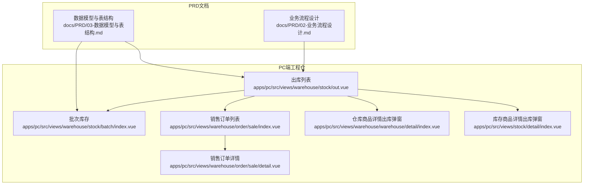
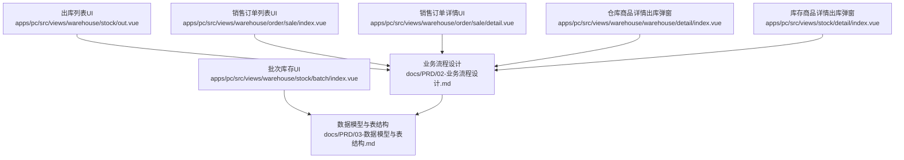
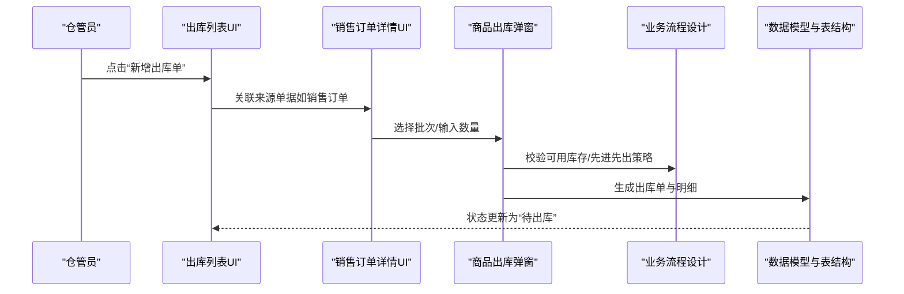
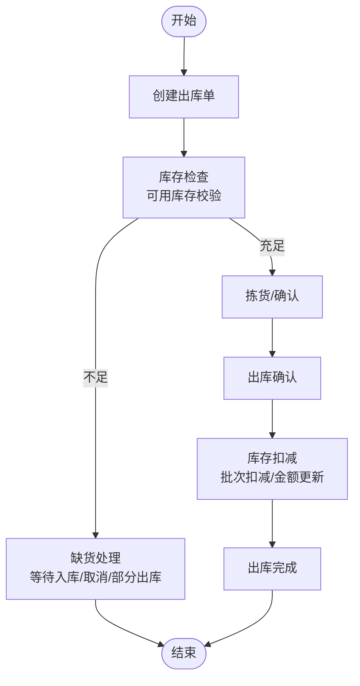
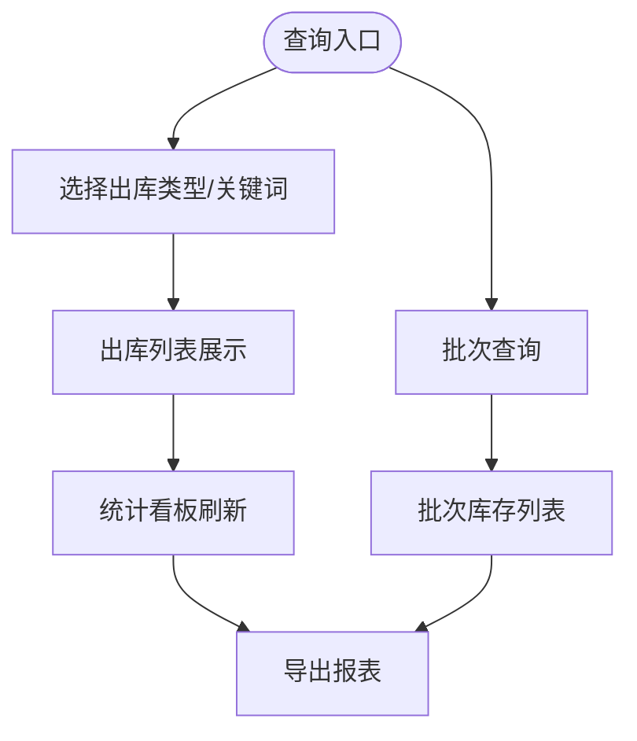
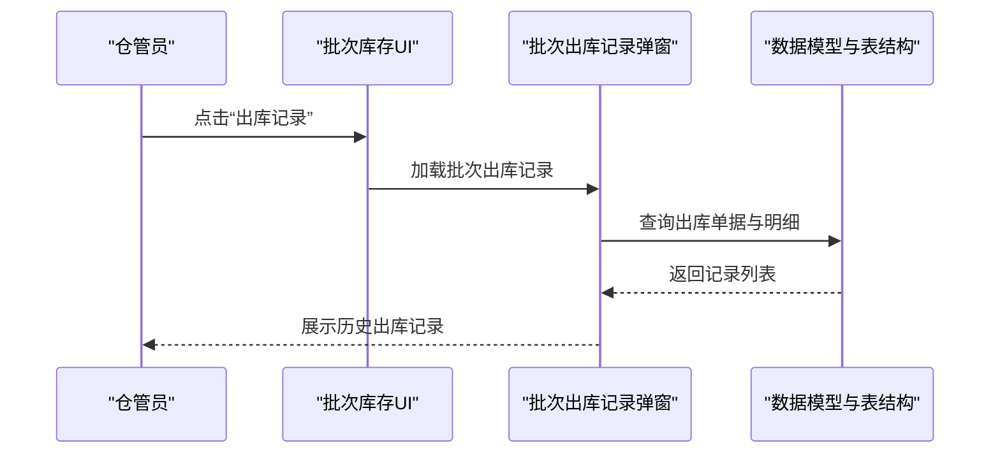
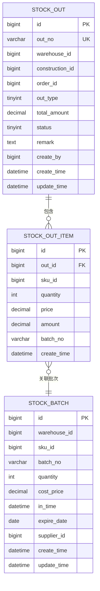
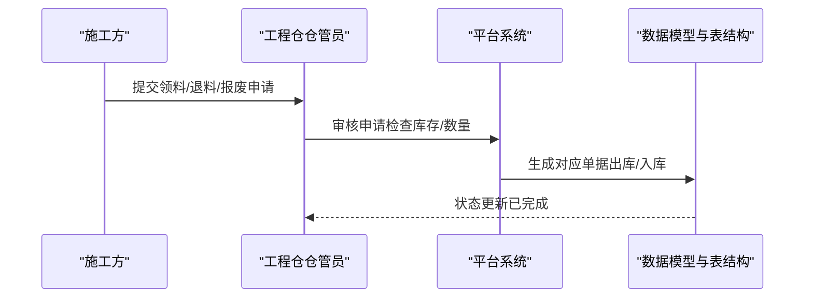
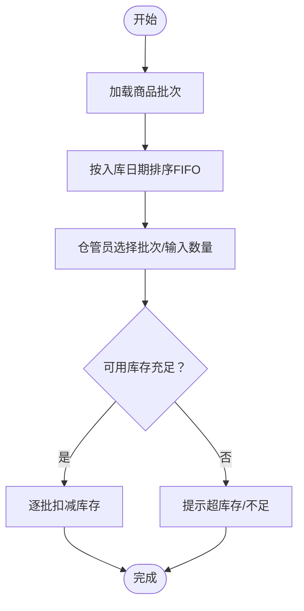
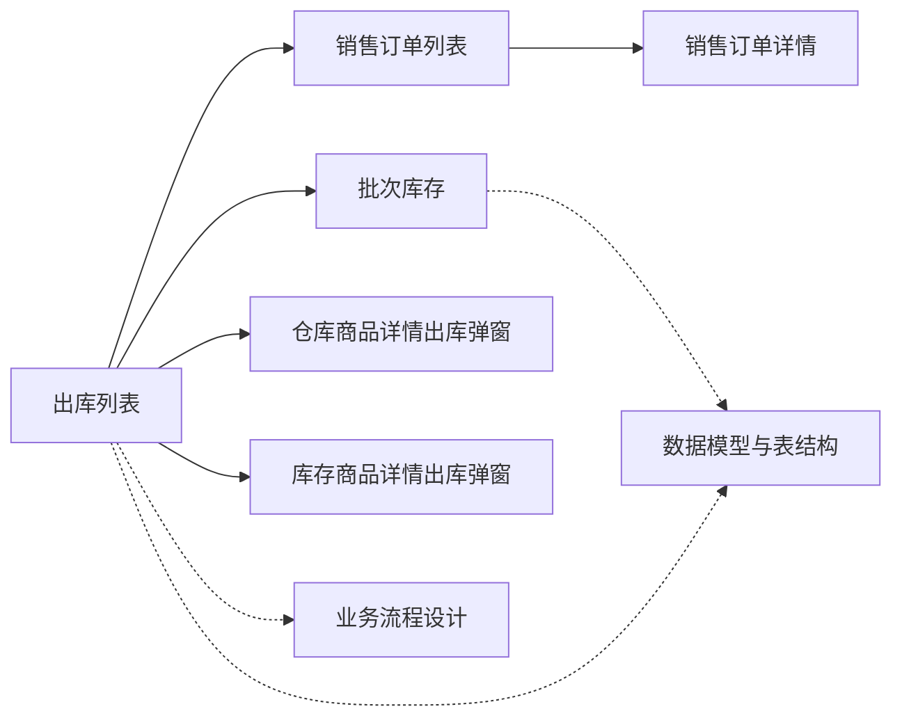

# 出库管理

<cite>
**本文引用的文件**
- [apps/pc/src/views/warehouse/stock/out.vue](file://apps/pc/src/views/warehouse/stock/out.vue)
- [apps/pc/src/views/warehouse/stock/batch/index.vue](file://apps/pc/src/views/warehouse/stock/batch/index.vue)
- [apps/pc/src/views/warehouse/order/sale/index.vue](file://apps/pc/src/views/warehouse/order/sale/index.vue)
- [apps/pc/src/views/warehouse/order/sale/detail.vue](file://apps/pc/src/views/warehouse/order/sale/detail.vue)
- [apps/pc/src/views/warehouse/warehouse/detail/index.vue](file://apps/pc/src/views/warehouse/warehouse/detail/index.vue)
- [apps/pc/src/views/stock/detail/index.vue](file://apps/pc/src/views/stock/detail/index.vue)
- [docs/PRD/02-业务流程设计.md](file://docs/PRD/02-业务流程设计.md)
- [docs/PRD/03-数据模型与表结构.md](file://docs/PRD/03-数据模型与表结构.md)
</cite>

## 目录
1. [简介](#简介)
2. [项目结构](#项目结构)
3. [核心组件](#核心组件)
4. [架构总览](#架构总览)
5. [详细组件分析](#详细组件分析)
6. [依赖关系分析](#依赖关系分析)
7. [性能考量](#性能考量)
8. [故障排查指南](#故障排查指南)
9. [结论](#结论)
10. [附录](#附录)

## 简介
本文件围绕“出库管理”功能，系统化阐述出库单创建流程、出库审核机制、出库查询与历史记录管理、数据结构与审批流程设计、库存数量扣减逻辑与批次选择策略，并覆盖销售出库、调拨出库、领料出库、报废出库等多类型处理方式，以及超库存控制与审计追踪。同时提供操作指南与异常处理建议，帮助非技术用户与开发人员快速理解与落地。

## 项目结构
出库管理在前端采用“页面-视图-组件”的组织方式，核心页面集中在 PC 端工程仓模块：
- 出库列表与统计：仓库/stock/out.vue
- 批次库存与出库记录：仓库/stock/batch/index.vue
- 销售出库关联：仓库/order/sale/index.vue、仓库/order/sale/detail.vue
- 商品出库弹窗：仓库/warehouse/detail/index.vue、stock/detail/index.vue
- 业务流程与数据模型：docs/PRD/02-业务流程设计.md、docs/PRD/03-数据模型与表结构.md

**图表来源**
- [apps/pc/src/views/warehouse/stock/out.vue:1-325](file://apps/pc/src/views/warehouse/stock/out.vue#L1-L325)
- [apps/pc/src/views/warehouse/stock/batch/index.vue:1-431](file://apps/pc/src/views/warehouse/stock/batch/index.vue#L1-L431)
- [apps/pc/src/views/warehouse/order/sale/index.vue:1-183](file://apps/pc/src/views/warehouse/order/sale/index.vue#L1-L183)
- [apps/pc/src/views/warehouse/order/sale/detail.vue:431-485](file://apps/pc/src/views/warehouse/order/sale/detail.vue#L431-L485)
- [apps/pc/src/views/warehouse/warehouse/detail/index.vue:218-243](file://apps/pc/src/views/warehouse/warehouse/detail/index.vue#L218-L243)
- [apps/pc/src/views/stock/detail/index.vue:282-307](file://apps/pc/src/views/stock/detail/index.vue#L282-L307)
- [docs/PRD/02-业务流程设计.md:760-817](file://docs/PRD/02-业务流程设计.md#L760-L817)
- [docs/PRD/03-数据模型与表结构.md:546-574](file://docs/PRD/03-数据模型与表结构.md#L546-L574)

**章节来源**
- [apps/pc/src/views/warehouse/stock/out.vue:1-325](file://apps/pc/src/views/warehouse/stock/out.vue#L1-L325)
- [apps/pc/src/views/warehouse/stock/batch/index.vue:1-431](file://apps/pc/src/views/warehouse/stock/batch/index.vue#L1-L431)
- [apps/pc/src/views/warehouse/order/sale/index.vue:1-183](file://apps/pc/src/views/warehouse/order/sale/index.vue#L1-L183)
- [apps/pc/src/views/warehouse/order/sale/detail.vue:431-485](file://apps/pc/src/views/warehouse/order/sale/detail.vue#L431-L485)
- [apps/pc/src/views/warehouse/warehouse/detail/index.vue:218-243](file://apps/pc/src/views/warehouse/warehouse/detail/index.vue#L218-L243)
- [apps/pc/src/views/stock/detail/index.vue:282-307](file://apps/pc/src/views/stock/detail/index.vue#L282-L307)
- [docs/PRD/02-业务流程设计.md:760-817](file://docs/PRD/02-业务流程设计.md#L760-L817)
- [docs/PRD/03-数据模型与表结构.md:546-574](file://docs/PRD/03-数据模型与表结构.md#L546-L574)

## 核心组件
- 出库列表页：提供出库单筛选（类型、关键词）、状态展示、统计看板、新增出库单入口与操作列（详情、出库、打印）。
- 批次库存页：展示批次维度的库存、出库记录、状态颜色与导出能力；支持按批次号、商品、入库日期、库存状态、仓库查询。
- 销售出库关联：销售订单列表展示“出库状态”，详情页提供“选择批次”与“发货数量”交互，支撑销售出库的来源关联与批次分配。
- 商品出库弹窗：在仓库/库存详情中弹出，支持选择批次与输入出库数量，触发库存扣减与出库单生成。
- 业务流程与数据模型：明确出库类型、状态流转、库存校验与扣减策略、批次先进先出推荐等规则。

**章节来源**
- [apps/pc/src/views/warehouse/stock/out.vue:10-114](file://apps/pc/src/views/warehouse/stock/out.vue#L10-L114)
- [apps/pc/src/views/warehouse/stock/batch/index.vue:13-123](file://apps/pc/src/views/warehouse/stock/batch/index.vue#L13-L123)
- [apps/pc/src/views/warehouse/order/sale/index.vue:21-65](file://apps/pc/src/views/warehouse/order/sale/index.vue#L21-L65)
- [apps/pc/src/views/warehouse/order/sale/detail.vue:431-485](file://apps/pc/src/views/warehouse/order/sale/detail.vue#L431-L485)
- [apps/pc/src/views/warehouse/warehouse/detail/index.vue:218-243](file://apps/pc/src/views/warehouse/warehouse/detail/index.vue#L218-L243)
- [apps/pc/src/views/stock/detail/index.vue:282-307](file://apps/pc/src/views/stock/detail/index.vue#L282-L307)
- [docs/PRD/02-业务流程设计.md:760-817](file://docs/PRD/02-业务流程设计.md#L760-L817)
- [docs/PRD/03-数据模型与表结构.md:546-574](file://docs/PRD/03-数据模型与表结构.md#L546-L574)

## 架构总览
出库管理从前端到数据层的关键交互如下：
- 前端页面负责展示与交互（筛选、查询、弹窗、导出）。
- 销售出库通过“销售订单”作为来源单据，详情页选择批次与数量，生成出库单。
- 批次库存页用于追溯每批商品的出库记录，辅助批次选择与先进先出策略。
- 后端数据模型定义出库单、出库明细与批次库存表，支撑状态、金额、数量与批次字段。

**图表来源**
- [apps/pc/src/views/warehouse/stock/out.vue:1-325](file://apps/pc/src/views/warehouse/stock/out.vue#L1-L325)
- [apps/pc/src/views/warehouse/stock/batch/index.vue:1-431](file://apps/pc/src/views/warehouse/stock/batch/index.vue#L1-L431)
- [apps/pc/src/views/warehouse/order/sale/index.vue:1-183](file://apps/pc/src/views/warehouse/order/sale/index.vue#L1-L183)
- [apps/pc/src/views/warehouse/order/sale/detail.vue:431-485](file://apps/pc/src/views/warehouse/order/sale/detail.vue#L431-L485)
- [apps/pc/src/views/warehouse/warehouse/detail/index.vue:218-243](file://apps/pc/src/views/warehouse/warehouse/detail/index.vue#L218-L243)
- [apps/pc/src/views/stock/detail/index.vue:282-307](file://apps/pc/src/views/stock/detail/index.vue#L282-L307)
- [docs/PRD/02-业务流程设计.md:760-817](file://docs/PRD/02-业务流程设计.md#L760-L817)
- [docs/PRD/03-数据模型与表结构.md:546-574](file://docs/PRD/03-数据模型与表结构.md#L546-L574)

## 详细组件分析

### 出库单创建流程
- 来源关联：销售出库需关联销售订单；调拨出库关联调拨单；领料/报废出库关联相应申请单。
- 批次选择：在销售订单详情或商品出库弹窗中，系统提供批次列表（入库日期、批注、可用数量），支持勾选与输入发货数量。
- 数量校验：前端在批次选择时提示可用库存，避免超发；后端在保存/确认时再次校验可用库存。
- 状态流转：创建后默认“待出库”，完成拣货与确认后进入“已完成”。

**图表来源**
- [apps/pc/src/views/warehouse/order/sale/detail.vue:431-485](file://apps/pc/src/views/warehouse/order/sale/detail.vue#L431-L485)
- [apps/pc/src/views/warehouse/warehouse/detail/index.vue:218-243](file://apps/pc/src/views/warehouse/warehouse/detail/index.vue#L218-L243)
- [apps/pc/src/views/stock/detail/index.vue:282-307](file://apps/pc/src/views/stock/detail/index.vue#L282-L307)
- [docs/PRD/02-业务流程设计.md:760-817](file://docs/PRD/02-业务流程设计.md#L760-L817)
- [docs/PRD/03-数据模型与表结构.md:546-574](file://docs/PRD/03-数据模型与表结构.md#L546-L574)

**章节来源**
- [apps/pc/src/views/warehouse/order/sale/detail.vue:431-485](file://apps/pc/src/views/warehouse/order/sale/detail.vue#L431-L485)
- [apps/pc/src/views/warehouse/warehouse/detail/index.vue:218-243](file://apps/pc/src/views/warehouse/warehouse/detail/index.vue#L218-L243)
- [apps/pc/src/views/stock/detail/index.vue:282-307](file://apps/pc/src/views/stock/detail/index.vue#L282-L307)
- [docs/PRD/02-业务流程设计.md:760-817](file://docs/PRD/02-业务流程设计.md#L760-L817)
- [docs/PRD/03-数据模型与表结构.md:546-574](file://docs/PRD/03-数据模型与表结构.md#L546-L574)

### 出库审核机制
- 审核角色：工程仓仓管员负责创建与确认出库；平台系统提供状态与日志支持。
- 审核要点：库存充足性检查、批次选择合理性、数量与金额一致性。
- 状态变更：从“待出库”到“已完成”，期间可打印出库单与送货单。

**图表来源**
- [docs/PRD/02-业务流程设计.md:760-817](file://docs/PRD/02-业务流程设计.md#L760-L817)
- [docs/PRD/03-数据模型与表结构.md:546-574](file://docs/PRD/03-数据模型与表结构.md#L546-L574)

**章节来源**
- [docs/PRD/02-业务流程设计.md:760-817](file://docs/PRD/02-业务流程设计.md#L760-L817)
- [docs/PRD/03-数据模型与表结构.md:546-574](file://docs/PRD/03-数据模型与表结构.md#L546-L574)

### 出库查询功能
- 出库列表：支持按类型（销售/调拨/领料）、关键词（出库单号/客户）筛选，分页展示。
- 统计看板：今日出库单、待出库单、出库商品数、出库金额。
- 批次查询：按批次号、商品、入库日期范围、库存状态、仓库筛选批次库存。

**图表来源**
- [apps/pc/src/views/warehouse/stock/out.vue:117-131](file://apps/pc/src/views/warehouse/stock/out.vue#L117-L131)
- [apps/pc/src/views/warehouse/stock/batch/index.vue:13-40](file://apps/pc/src/views/warehouse/stock/batch/index.vue#L13-L40)

**章节来源**
- [apps/pc/src/views/warehouse/stock/out.vue:117-131](file://apps/pc/src/views/warehouse/stock/out.vue#L117-L131)
- [apps/pc/src/views/warehouse/stock/batch/index.vue:13-40](file://apps/pc/src/views/warehouse/stock/batch/index.vue#L13-L40)

### 出库历史记录管理
- 批次出库记录：点击“出库记录”弹窗，展示该批次的历史出库单号、时间、数量、类型、关联订单与操作人。
- 审计追踪：出库单据与明细包含创建人、创建时间、更新时间，便于审计与溯源。

**图表来源**
- [apps/pc/src/views/warehouse/stock/batch/index.vue:90-123](file://apps/pc/src/views/warehouse/stock/batch/index.vue#L90-L123)
- [docs/PRD/03-数据模型与表结构.md:546-574](file://docs/PRD/03-数据模型与表结构.md#L546-L574)

**章节来源**
- [apps/pc/src/views/warehouse/stock/batch/index.vue:90-123](file://apps/pc/src/views/warehouse/stock/batch/index.vue#L90-L123)
- [docs/PRD/03-数据模型与表结构.md:546-574](file://docs/PRD/03-数据模型与表结构.md#L546-L574)

### 出库单据的数据结构
- 出库单（stock_out）：包含出库单号、仓库、施工方、订单、出库类型、总金额、状态、备注、创建人与时间戳。
- 出库明细（stock_out_item）：包含出库单ID、SKU、数量、单价、金额、批次号与创建时间。
- 批次库存（stock_batch）：包含仓库、SKU、批次号、数量、成本价、入库时间、过期日期、供应商与时间戳。

**图表来源**
- [docs/PRD/03-数据模型与表结构.md:546-590](file://docs/PRD/03-数据模型与表结构.md#L546-L590)

**章节来源**
- [docs/PRD/03-数据模型与表结构.md:546-590](file://docs/PRD/03-数据模型与表结构.md#L546-L590)

### 审批流程设计
- 销售出库：以销售订单为来源，订单状态与“出库状态”联动；仓管员在订单详情选择批次与数量后生成出库单。
- 领料/退料/报废：由施工方发起申请，工程仓仓管员审核后执行出库/入库，形成现场库存变动。

**图表来源**
- [docs/PRD/02-业务流程设计.md:859-959](file://docs/PRD/02-业务流程设计.md#L859-L959)
- [docs/PRD/03-数据模型与表结构.md:640-737](file://docs/PRD/03-数据模型与表结构.md#L640-L737)

**章节来源**
- [docs/PRD/02-业务流程设计.md:859-959](file://docs/PRD/02-业务流程设计.md#L859-L959)
- [docs/PRD/03-数据模型与表结构.md:640-737](file://docs/PRD/03-数据模型与表结构.md#L640-L737)

### 库存数量扣减逻辑与批次选择策略
- 先进先出（FIFO）：系统在销售出库时推荐批次顺序（按入库日期），仓管员可手动调整。
- 扣减策略：按批次逐批扣减，直至满足出库数量；若某批次不足则继续使用后续批次。
- 超库存控制：前端与后端均进行可用库存校验，防止超发。

**图表来源**
- [apps/pc/src/views/warehouse/order/sale/detail.vue:431-485](file://apps/pc/src/views/warehouse/order/sale/detail.vue#L431-L485)
- [apps/pc/src/views/warehouse/warehouse/detail/index.vue:218-243](file://apps/pc/src/views/warehouse/warehouse/detail/index.vue#L218-L243)
- [apps/pc/src/views/stock/detail/index.vue:282-307](file://apps/pc/src/views/stock/detail/index.vue#L282-L307)
- [docs/PRD/02-业务流程设计.md:760-817](file://docs/PRD/02-业务流程设计.md#L760-L817)

**章节来源**
- [apps/pc/src/views/warehouse/order/sale/detail.vue:431-485](file://apps/pc/src/views/warehouse/order/sale/detail.vue#L431-L485)
- [apps/pc/src/views/warehouse/warehouse/detail/index.vue:218-243](file://apps/pc/src/views/warehouse/warehouse/detail/index.vue#L218-L243)
- [apps/pc/src/views/stock/detail/index.vue:282-307](file://apps/pc/src/views/stock/detail/index.vue#L282-L307)
- [docs/PRD/02-业务流程设计.md:760-817](file://docs/PRD/02-业务流程设计.md#L760-L817)

### 不同出库类型的处理方式
- 销售出库：关联销售订单，按订单行选择批次与数量，生成出库单。
- 调拨出库：关联调拨单，从调出仓库扣减，目标仓库入账。
- 领料出库：由施工方发起领料申请，工程仓审核后执行出库，现场库存增加。
- 报废出库：由施工方发起报废申请，工程仓审核后执行出库，库存减少。

**章节来源**
- [docs/PRD/02-业务流程设计.md:768-769](file://docs/PRD/02-业务流程设计.md#L768-L769)
- [docs/PRD/03-数据模型与表结构.md:554-555](file://docs/PRD/03-数据模型与表结构.md#L554-L555)
- [docs/PRD/03-数据模型与表结构.md:640-737](file://docs/PRD/03-数据模型与表结构.md#L640-L737)

### 超库存出库的控制机制
- 前端校验：在批次选择界面提示可用数量，限制输入范围。
- 后端校验：保存/确认时再次校验可用库存，拒绝超发请求。
- 异常处理：提示“库存不足/超库存”，支持等待补货、取消或部分出库。

**章节来源**
- [apps/pc/src/views/warehouse/order/sale/detail.vue:431-485](file://apps/pc/src/views/warehouse/order/sale/detail.vue#L431-L485)
- [apps/pc/src/views/warehouse/warehouse/detail/index.vue:218-243](file://apps/pc/src/views/warehouse/warehouse/detail/index.vue#L218-L243)
- [apps/pc/src/views/stock/detail/index.vue:282-307](file://apps/pc/src/views/stock/detail/index.vue#L282-L307)
- [docs/PRD/02-业务流程设计.md:778-791](file://docs/PRD/02-业务流程设计.md#L778-L791)

### 出库数据的审计追踪
- 出库单据与明细包含创建人、创建时间、更新时间，支持导出与查询。
- 批次库存记录包含入库单号、仓库、批次号、当前库存、已出库数量，便于溯源。

**章节来源**
- [docs/PRD/03-数据模型与表结构.md:546-574](file://docs/PRD/03-数据模型与表结构.md#L546-L574)
- [apps/pc/src/views/warehouse/stock/batch/index.vue:90-123](file://apps/pc/src/views/warehouse/stock/batch/index.vue#L90-L123)

## 依赖关系分析
- 页面依赖：出库列表依赖销售订单列表与详情；批次库存依赖数据模型；商品出库弹窗依赖业务流程与数据模型。
- 文档依赖：业务流程与数据模型共同约束前端交互与后端实现。

**图表来源**
- [apps/pc/src/views/warehouse/stock/out.vue:1-325](file://apps/pc/src/views/warehouse/stock/out.vue#L1-L325)
- [apps/pc/src/views/warehouse/order/sale/index.vue:1-183](file://apps/pc/src/views/warehouse/order/sale/index.vue#L1-L183)
- [apps/pc/src/views/warehouse/order/sale/detail.vue:431-485](file://apps/pc/src/views/warehouse/order/sale/detail.vue#L431-L485)
- [apps/pc/src/views/warehouse/stock/batch/index.vue:1-431](file://apps/pc/src/views/warehouse/stock/batch/index.vue#L1-L431)
- [apps/pc/src/views/warehouse/warehouse/detail/index.vue:218-243](file://apps/pc/src/views/warehouse/warehouse/detail/index.vue#L218-L243)
- [apps/pc/src/views/stock/detail/index.vue:282-307](file://apps/pc/src/views/stock/detail/index.vue#L282-L307)
- [docs/PRD/02-业务流程设计.md:760-817](file://docs/PRD/02-业务流程设计.md#L760-L817)
- [docs/PRD/03-数据模型与表结构.md:546-590](file://docs/PRD/03-数据模型与表结构.md#L546-L590)

**章节来源**
- [apps/pc/src/views/warehouse/stock/out.vue:1-325](file://apps/pc/src/views/warehouse/stock/out.vue#L1-L325)
- [apps/pc/src/views/warehouse/order/sale/index.vue:1-183](file://apps/pc/src/views/warehouse/order/sale/index.vue#L1-L183)
- [apps/pc/src/views/warehouse/order/sale/detail.vue:431-485](file://apps/pc/src/views/warehouse/order/sale/detail.vue#L431-L485)
- [apps/pc/src/views/warehouse/stock/batch/index.vue:1-431](file://apps/pc/src/views/warehouse/stock/batch/index.vue#L1-L431)
- [apps/pc/src/views/warehouse/warehouse/detail/index.vue:218-243](file://apps/pc/src/views/warehouse/warehouse/detail/index.vue#L218-L243)
- [apps/pc/src/views/stock/detail/index.vue:282-307](file://apps/pc/src/views/stock/detail/index.vue#L282-L307)
- [docs/PRD/02-业务流程设计.md:760-817](file://docs/PRD/02-业务流程设计.md#L760-L817)
- [docs/PRD/03-数据模型与表结构.md:546-590](file://docs/PRD/03-数据模型与表结构.md#L546-L590)

## 性能考量
- 列表分页与筛选：合理设置分页大小与查询条件，避免一次性加载过多数据。
- 批次查询：按关键字段（入库日期、仓库、库存状态）过滤，减少无关数据传输。
- 前端渲染：对大表格采用虚拟滚动与懒加载，提升交互流畅度。
- 数据导出：批量导出时提示进度与限制条数，避免阻塞 UI。

## 故障排查指南
- 出库数量超库存
  - 现象：无法保存/确认，提示“库存不足/超库存”。
  - 排查：检查批次可用数量、销售订单行数量、是否存在锁定库存。
  - 处理：补充入库、调整数量或拆分为多个出库单。
- 批次选择错误
  - 现象：先进先出策略未生效或批次错配。
  - 排查：确认批次排序逻辑与仓管员选择是否一致。
  - 处理：重新选择批次或手动调整数量。
- 出库单状态异常
  - 现象：状态未更新或显示不一致。
  - 排查：检查接口返回与前端状态映射。
  - 处理：刷新页面或重新提交确认。
- 批次历史缺失
  - 现象：点击“出库记录”为空。
  - 排查：确认批次号与商品是否匹配、是否有出库单据。
  - 处理：核对批次与商品信息，重新查询。

**章节来源**
- [apps/pc/src/views/warehouse/order/sale/detail.vue:431-485](file://apps/pc/src/views/warehouse/order/sale/detail.vue#L431-L485)
- [apps/pc/src/views/warehouse/stock/batch/index.vue:90-123](file://apps/pc/src/views/warehouse/stock/batch/index.vue#L90-L123)
- [apps/pc/src/views/warehouse/stock/out.vue:117-131](file://apps/pc/src/views/warehouse/stock/out.vue#L117-L131)

## 结论
出库管理通过“销售订单来源关联+批次先进先出+FIFO扣减+状态流转+审计追踪”的闭环设计，实现了多类型出库的标准化与可视化。前端提供完善的查询、筛选与导出能力，结合 PRD 的业务流程与数据模型，能够有效支撑工程仓日常出库作业，并为后续扩展（如调拨、现场库存等）奠定基础。

## 附录
- 操作指南（概述）
  - 新增出库单：在出库列表点击“新增出库单”，选择来源单据与类型，进入详情选择批次与数量。
  - 出库确认：完成拣货后确认出库，系统自动扣减库存并更新状态。
  - 查询与导出：使用类型与关键词筛选，查看统计看板，导出批次与出库记录。
  - 批次追溯：在批次库存页查看历史出库记录，核对批次与仓库信息。