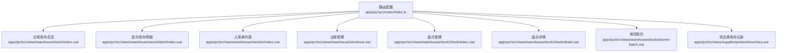
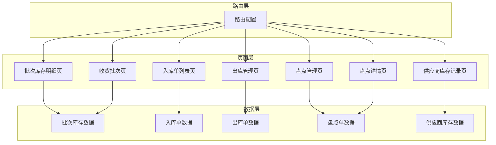
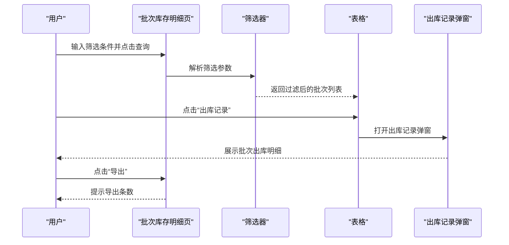
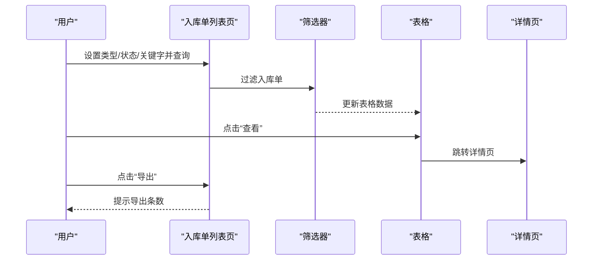
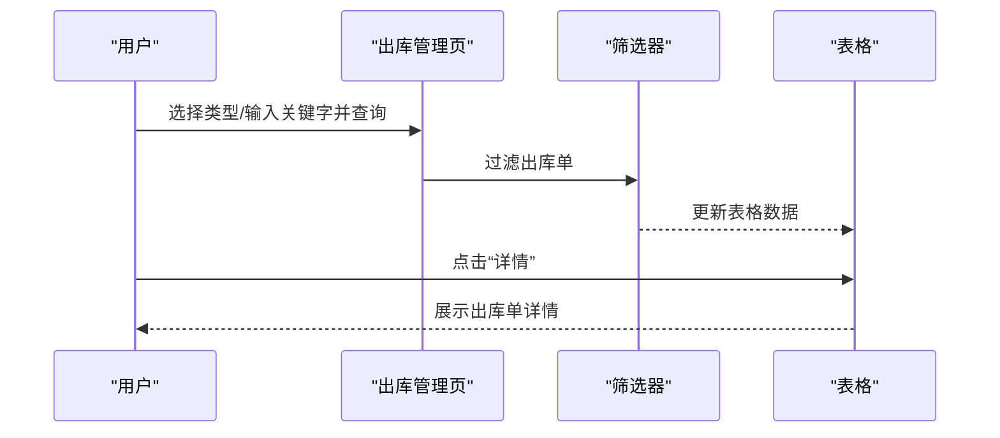
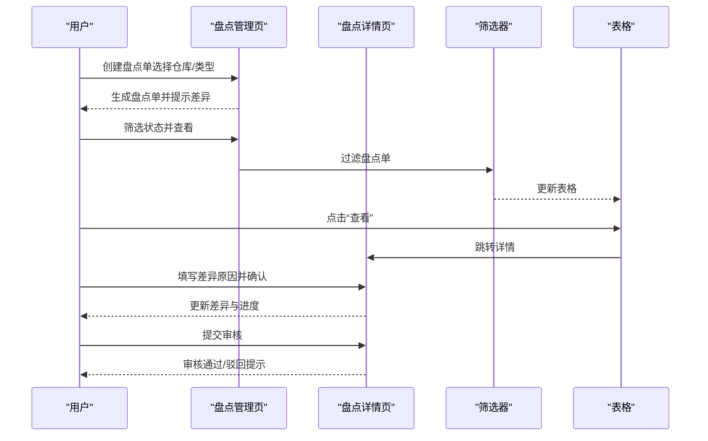
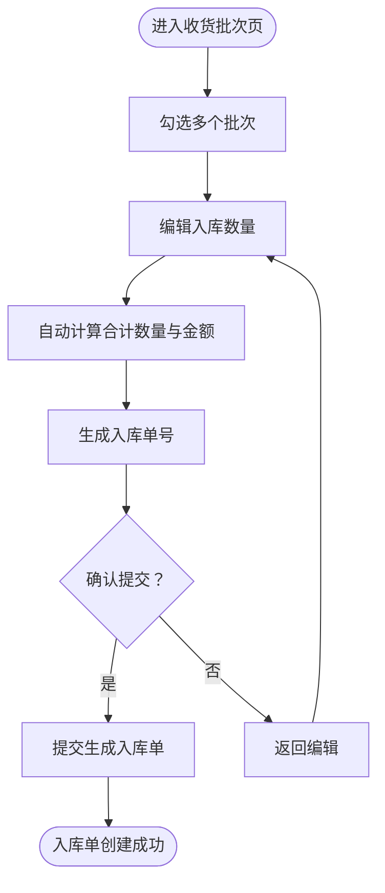
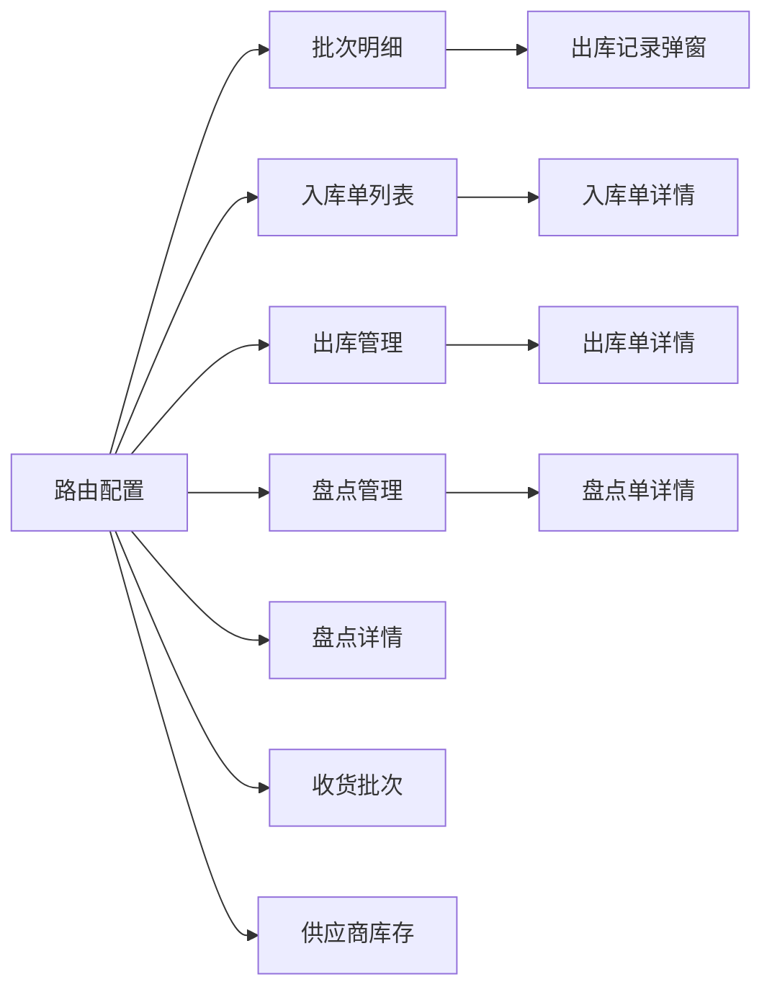

# 商品库存明细

<cite>
**本文引用的文件**
- [apps/pc/src/views/warehouse/stock/batch/index.vue](file://apps/pc/src/views/warehouse/stock/batch/index.vue)
- [apps/pc/src/views/warehouse/stock/check/index.vue](file://apps/pc/src/views/warehouse/stock/check/index.vue)
- [apps/pc/src/views/warehouse/stock/check/detail.vue](file://apps/pc/src/views/warehouse/stock/check/detail.vue)
- [apps/pc/src/views/warehouse/stock/in/index.vue](file://apps/pc/src/views/warehouse/stock/in/index.vue)
- [apps/pc/src/views/warehouse/stock/out.vue](file://apps/pc/src/views/warehouse/stock/out.vue)
- [apps/pc/src/views/warehouse/stock/index.vue](file://apps/pc/src/views/warehouse/stock/index.vue)
- [apps/pc/src/router/index.ts](file://apps/pc/src/router/index.ts)
- [apps/pc/src/views/warehouse/stock/receive-batch.vue](file://apps/pc/src/views/warehouse/stock/receive-batch.vue)
- [apps/pc/src/views/supplier/product/inventory.vue](file://apps/pc/src/views/supplier/product/inventory.vue)
</cite>

## 目录
1. [简介](#简介)
2. [项目结构](#项目结构)
3. [核心组件](#核心组件)
4. [架构总览](#架构总览)
5. [详细组件分析](#详细组件分析)
6. [依赖关系分析](#依赖关系分析)
7. [性能考量](#性能考量)
8. [故障排查指南](#故障排查指南)
9. [结论](#结论)
10. [附录](#附录)

## 简介
本文件围绕“商品库存明细”功能，系统化梳理并解释以下能力：
- 商品库存明细查询：按商品、批次、仓库、时间等条件检索库存明细
- 库存变动记录：入库、出库、调拨、盘点等业务驱动的库存变化轨迹
- 库存批次追踪：从批次维度追踪入库、出库、结余与状态
- 库存分布统计：按商品、仓库、时间等维度进行多维统计与趋势分析
- 高级筛选与导出：支持多条件组合筛选与批量导出
- 报告与看板：提供库存状态、预警、趋势等可视化分析

## 项目结构
与“库存明细”直接相关的前端页面主要位于 PC 端仓库管理模块，路由组织清晰，便于定位到各子功能页。

图表来源
- [apps/pc/src/router/index.ts:525-762](file://apps/pc/src/router/index.ts#L525-L762)
- [apps/pc/src/views/warehouse/stock/index.vue:1-862](file://apps/pc/src/views/warehouse/stock/index.vue#L1-L862)
- [apps/pc/src/views/warehouse/stock/batch/index.vue:1-431](file://apps/pc/src/views/warehouse/stock/batch/index.vue#L1-L431)
- [apps/pc/src/views/warehouse/stock/in/index.vue:1-205](file://apps/pc/src/views/warehouse/stock/in/index.vue#L1-L205)
- [apps/pc/src/views/warehouse/stock/out.vue:1-325](file://apps/pc/src/views/warehouse/stock/out.vue#L1-L325)
- [apps/pc/src/views/warehouse/stock/check/index.vue:1-451](file://apps/pc/src/views/warehouse/stock/check/index.vue#L1-L451)
- [apps/pc/src/views/warehouse/stock/check/detail.vue:1-279](file://apps/pc/src/views/warehouse/stock/check/detail.vue#L1-L279)
- [apps/pc/src/views/warehouse/stock/receive-batch.vue](file://apps/pc/src/views/warehouse/stock/receive-batch.vue)
- [apps/pc/src/views/supplier/product/inventory.vue](file://apps/pc/src/views/supplier/product/inventory.vue)

章节来源
- [apps/pc/src/router/index.ts:525-762](file://apps/pc/src/router/index.ts#L525-L762)

## 核心组件
- 批次库存明细页：提供批次维度的库存明细、状态、出入库记录、导出等功能
- 入库单列表页：提供入库单的查询、筛选、导出、审核等
- 出库管理页：提供出库单的查询、筛选、状态管理等
- 盘点管理与详情页：提供盘点单的创建、审核、差异处理、进度跟踪等
- 收货批次页：支持按批次收货、合并入库等
- 供应商库存记录页：面向供应商视角的库存明细与记录

章节来源
- [apps/pc/src/views/warehouse/stock/batch/index.vue:1-431](file://apps/pc/src/views/warehouse/stock/batch/index.vue#L1-L431)
- [apps/pc/src/views/warehouse/stock/in/index.vue:1-205](file://apps/pc/src/views/warehouse/stock/in/index.vue#L1-L205)
- [apps/pc/src/views/warehouse/stock/out.vue:1-325](file://apps/pc/src/views/warehouse/stock/out.vue#L1-L325)
- [apps/pc/src/views/warehouse/stock/check/index.vue:1-451](file://apps/pc/src/views/warehouse/stock/check/index.vue#L1-L451)
- [apps/pc/src/views/warehouse/stock/check/detail.vue:1-279](file://apps/pc/src/views/warehouse/stock/check/detail.vue#L1-L279)
- [apps/pc/src/views/warehouse/stock/receive-batch.vue](file://apps/pc/src/views/warehouse/stock/receive-batch.vue)
- [apps/pc/src/views/supplier/product/inventory.vue](file://apps/pc/src/views/supplier/product/inventory.vue)

## 架构总览
“库存明细”功能由“页面层 + 路由层 + 数据层（本地模拟）”构成。页面通过表单与表格展示库存明细、出入库记录、批次状态；路由负责导航与参数传递；数据层采用本地模拟数据，便于演示与开发验证。

图表来源
- [apps/pc/src/router/index.ts:525-762](file://apps/pc/src/router/index.ts#L525-L762)
- [apps/pc/src/views/warehouse/stock/batch/index.vue:1-431](file://apps/pc/src/views/warehouse/stock/batch/index.vue#L1-L431)
- [apps/pc/src/views/warehouse/stock/in/index.vue:1-205](file://apps/pc/src/views/warehouse/stock/in/index.vue#L1-L205)
- [apps/pc/src/views/warehouse/stock/out.vue:1-325](file://apps/pc/src/views/warehouse/stock/out.vue#L1-L325)
- [apps/pc/src/views/warehouse/stock/check/index.vue:1-451](file://apps/pc/src/views/warehouse/stock/check/index.vue#L1-L451)
- [apps/pc/src/views/warehouse/stock/check/detail.vue:1-279](file://apps/pc/src/views/warehouse/stock/check/detail.vue#L1-L279)
- [apps/pc/src/views/warehouse/stock/receive-batch.vue](file://apps/pc/src/views/warehouse/stock/receive-batch.vue)
- [apps/pc/src/views/supplier/product/inventory.vue](file://apps/pc/src/views/supplier/product/inventory.vue)

## 详细组件分析

### 批次库存明细（商品维度的库存汇总）
- 功能要点
  - 多维筛选：批次号、商品名称/编码、入库日期范围、库存状态（充足/紧张/已出完）、仓库
  - 列表展示：批次号、商品编码/名称、规格、单位、入库日期/生产日期、入库数量、当前库存、已出库数量、批次批注、入库单号、库存状态
  - 操作入口：查看商品详情、查看批次出库记录、导出
- 关键流程
  - 查询：根据筛选条件过滤批次列表，更新分页总数
  - 查看出库记录：弹窗展示该批次的出库明细（出库单号、时间、数量、类型、关联订单、客户/仓库、操作人）
  - 导出：提示导出条数，便于后续报表分析

图表来源
- [apps/pc/src/views/warehouse/stock/batch/index.vue:1-431](file://apps/pc/src/views/warehouse/stock/batch/index.vue#L1-L431)

章节来源
- [apps/pc/src/views/warehouse/stock/batch/index.vue:1-431](file://apps/pc/src/views/warehouse/stock/batch/index.vue#L1-L431)

### 入库单列表（库存变动记录）
- 功能要点
  - 查询：入库单号、入库类型（采购/退货/调拨）、状态（待审核/已审核/已完成）
  - 列表：入库单号、类型、来源单号、供应商/仓库、入库数量、入库金额、状态、创建时间
  - 操作：查看、审核（待审核时）
  - 导出：提示导出条数
- 变动记录机制
  - 入库单作为库存增加的原始凭证，明细页可查看商品明细与关联批次，形成“入库→库存增加”的可追溯链路

图表来源
- [apps/pc/src/views/warehouse/stock/in/index.vue:1-205](file://apps/pc/src/views/warehouse/stock/in/index.vue#L1-L205)

章节来源
- [apps/pc/src/views/warehouse/stock/in/index.vue:1-205](file://apps/pc/src/views/warehouse/stock/in/index.vue#L1-L205)

### 出库管理（库存变动记录）
- 功能要点
  - 查询：出库类型（销售/调拨/领料）、关键字、状态
  - 列表：出库单号、类型、来源单据、出库仓库、客户/去向、商品种类、总数量、总金额、状态、创建人/时间
  - 操作：详情、出库、打印（待实现）
- 变动记录机制
  - 出库单作为库存减少的原始凭证，结合批次先进先出策略，形成“出库→库存减少”的可追溯链路

图表来源
- [apps/pc/src/views/warehouse/stock/out.vue:1-325](file://apps/pc/src/views/warehouse/stock/out.vue#L1-L325)

章节来源
- [apps/pc/src/views/warehouse/stock/out.vue:1-325](file://apps/pc/src/views/warehouse/stock/out.vue#L1-L325)

### 盘点管理与盘点详情（库存分布统计与差异处理）
- 功能要点
  - 盘点管理：创建盘点单（全盘/抽盘），筛选状态（待审核/已通过/已驳回），查看/审核/删除
  - 盘点详情：搜索商品、差异筛选（盘盈/盘亏/无差异）、进度条、差异原因选择、确认盘点、提交审核
- 分布统计
  - 通过“差异”字段与“差异原因”进行库存分布统计，辅助判断损耗、误差、丢失等风险点

图表来源
- [apps/pc/src/views/warehouse/stock/check/index.vue:1-451](file://apps/pc/src/views/warehouse/stock/check/index.vue#L1-L451)
- [apps/pc/src/views/warehouse/stock/check/detail.vue:1-279](file://apps/pc/src/views/warehouse/stock/check/detail.vue#L1-L279)

章节来源
- [apps/pc/src/views/warehouse/stock/check/index.vue:1-451](file://apps/pc/src/views/warehouse/stock/check/index.vue#L1-L451)
- [apps/pc/src/views/warehouse/stock/check/detail.vue:1-279](file://apps/pc/src/views/warehouse/stock/check/detail.vue#L1-L279)

### 收货批次（按批次入库与合并生成入库单）
- 功能要点
  - 选择多个批次，合并生成入库单
  - 自动计算总数量与总金额
  - 生成入库单号并提交
- 批次信息管理
  - 显示批次号、商品名称、供应商、仓库、可入库数量、单价、入库数量等

图表来源
- [apps/pc/src/views/warehouse/stock/index.vue:626-762](file://apps/pc/src/views/warehouse/stock/index.vue#L626-L762)

章节来源
- [apps/pc/src/views/warehouse/stock/index.vue:626-762](file://apps/pc/src/views/warehouse/stock/index.vue#L626-L762)

### 供应商库存记录（面向供应商的库存明细）
- 功能要点
  - 展示供应商视角下的库存记录，便于供应商对自身库存进行核对与管理
  - 与平台库存明细形成互补，支撑多角色协同

章节来源
- [apps/pc/src/views/supplier/product/inventory.vue](file://apps/pc/src/views/supplier/product/inventory.vue)

## 依赖关系分析
- 路由依赖：各功能页均通过路由配置进行导航，确保页面间跳转与参数传递（如订单号、商品ID）
- 页面依赖：批次明细页依赖“出库记录弹窗”以查看批次历史出库；入库/出库/盘点页分别维护各自的筛选与导出逻辑
- 数据依赖：当前实现为本地模拟数据，便于快速验证功能；生产环境需对接后端接口

图表来源
- [apps/pc/src/router/index.ts:525-762](file://apps/pc/src/router/index.ts#L525-L762)
- [apps/pc/src/views/warehouse/stock/batch/index.vue:1-431](file://apps/pc/src/views/warehouse/stock/batch/index.vue#L1-L431)
- [apps/pc/src/views/warehouse/stock/in/index.vue:1-205](file://apps/pc/src/views/warehouse/stock/in/index.vue#L1-L205)
- [apps/pc/src/views/warehouse/stock/out.vue:1-325](file://apps/pc/src/views/warehouse/stock/out.vue#L1-L325)
- [apps/pc/src/views/warehouse/stock/check/index.vue:1-451](file://apps/pc/src/views/warehouse/stock/check/index.vue#L1-L451)
- [apps/pc/src/views/warehouse/stock/check/detail.vue:1-279](file://apps/pc/src/views/warehouse/stock/check/detail.vue#L1-L279)

## 性能考量
- 列表渲染优化：使用虚拟滚动或分页加载，避免一次性渲染大量行
- 筛选性能：前端筛选建议限制初始数据量，或采用服务端分页+筛选
- 图表渲染：库存趋势图建议按周/月聚合，避免过多数据点导致卡顿
- 导出性能：大列表导出建议异步分批导出，并提供进度提示

## 故障排查指南
- 查询无结果
  - 检查筛选条件是否过严（如日期范围、状态、仓库）
  - 清空筛选后重试，逐步缩小范围定位问题
- 导出失败或为空
  - 确认当前筛选条件下是否存在数据
  - 尝试扩大筛选范围或清除筛选
- 盘点差异未填写原因
  - 差异大于0或小于0时需填写原因，否则无法提交审核
- 出库/入库单状态异常
  - 确认单据状态流转是否符合预期（待审核→已完成）
  - 检查来源单据是否正确关联

章节来源
- [apps/pc/src/views/warehouse/stock/check/detail.vue:221-247](file://apps/pc/src/views/warehouse/stock/check/detail.vue#L221-L247)
- [apps/pc/src/views/warehouse/stock/batch/index.vue:355-361](file://apps/pc/src/views/warehouse/stock/batch/index.vue#L355-L361)
- [apps/pc/src/views/warehouse/stock/in/index.vue:167-173](file://apps/pc/src/views/warehouse/stock/in/index.vue#L167-L173)

## 结论
“商品库存明细”功能通过“批次维度明细 + 入出库单 + 盘点差异 + 供应商视角记录”构建了完整的库存可见性与可追溯性。结合多维筛选与导出能力，能够满足日常库存核对、分布统计与趋势分析的需求。建议在生产环境中接入后端接口，完善权限控制与审计日志，进一步提升系统的稳定性与安全性。

## 附录
- 高级筛选建议
  - 批次明细：支持按“批次号/商品名/入库日期/库存状态/仓库”组合筛选
  - 入库/出库：支持按“单号/类型/状态/时间范围/仓库/商品”筛选
  - 盘点：支持按“单号/类型/状态/仓库/商品”筛选
- 导出使用指南
  - 在各列表页点击“导出”，系统将提示导出条数；建议在筛选后导出，提高效率
- 报告与看板
  - 可基于导出数据进行库存分布、周转率、损耗率等指标分析
  - 建议按“商品-仓库-时间”维度构建库存看板，辅助决策