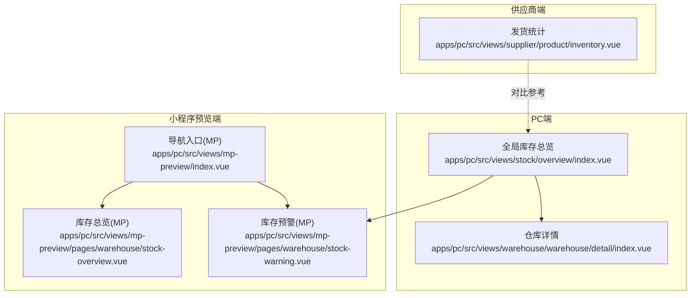
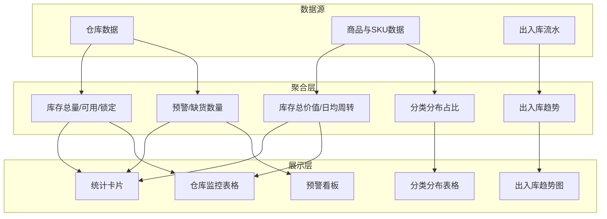
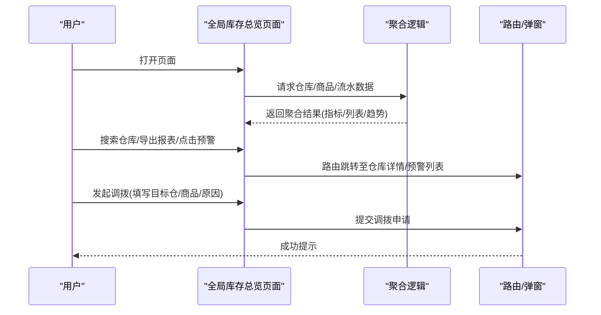
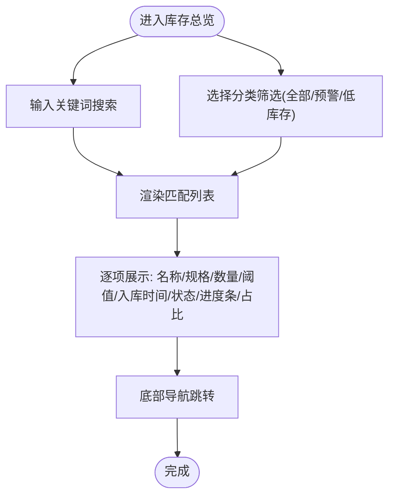
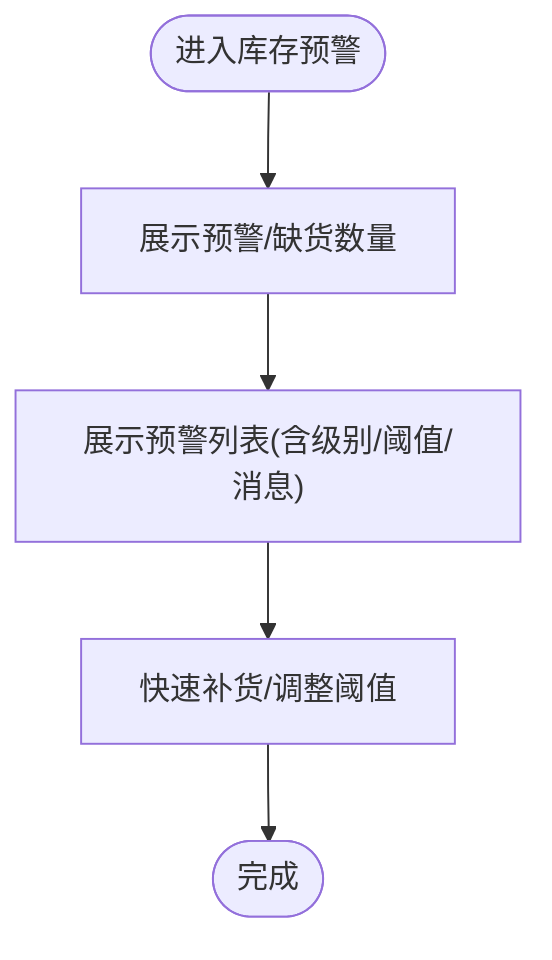
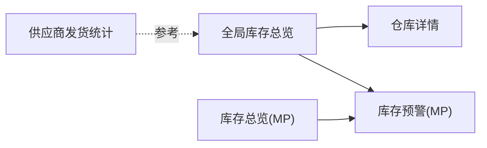

# 库存总览

<cite>
**本文引用的文件**
- [apps/pc/src/views/stock/overview/index.vue](file://apps/pc/src/views/stock/overview/index.vue)
- [apps/pc/src/views/warehouse/warehouse/detail/index.vue](file://apps/pc/src/views/warehouse/warehouse/detail/index.vue)
- [apps/pc/src/views/mp-preview/pages/warehouse/stock-overview.vue](file://apps/pc/src/views/mp-preview/pages/warehouse/stock-overview.vue)
- [apps/pc/src/views/mp-preview/pages/warehouse/stock-warning.vue](file://apps/pc/src/views/mp-preview/pages/warehouse/stock-warning.vue)
- [apps/pc/src/views/supplier/product/inventory.vue](file://apps/pc/src/views/supplier/product/inventory.vue)
- [apps/pc/src/views/mp-preview/index.vue](file://apps/pc/src/views/mp-preview/index.vue)
</cite>

## 目录
1. [简介](#简介)
2. [项目结构](#项目结构)
3. [核心组件](#核心组件)
4. [架构总览](#架构总览)
5. [详细组件分析](#详细组件分析)
6. [依赖关系分析](#依赖关系分析)
7. [性能考量](#性能考量)
8. [故障排查指南](#故障排查指南)
9. [结论](#结论)
10. [附录](#附录)

## 简介
本文件围绕“库存总览”功能，系统化梳理库存统计分析、库存预警设置、库存周转率计算、库存价值分析等核心能力，结合现有页面实现，给出数据聚合算法思路、预警阈值配置方法、报表生成机制与数据可视化展示方案，并提供库存优化建议与数据分析最佳实践。

## 项目结构
“库存总览”相关页面分布在 PC 端与小程序预览端，覆盖全局库存概览、仓库维度明细、预警列表、以及供应商侧发货统计等场景。核心页面如下：
- PC 端全局库存总览：展示仓库总数、商品种类、总库存量、库存总价值、日均周转、预警/缺货数量等关键指标，并提供仓库监控、分类分布、出入库趋势、待处理调拨等功能。
- 仓库详情页：展示仓库内 SPU/SKU 数量、库存总量、库存价值等基础指标。
- 小程序预览端库存总览与预警：移动端风格的库存概览与预警列表，便于现场人员快速查看与处理。
- 供应商发货统计：展示供应商视角的发货与补发统计，辅助其理解自身库存变化与订单关联。

**图表来源**
- [apps/pc/src/views/stock/overview/index.vue:1-1004](file://apps/pc/src/views/stock/overview/index.vue#L1-L1004)
- [apps/pc/src/views/warehouse/warehouse/detail/index.vue:35-64](file://apps/pc/src/views/warehouse/warehouse/detail/index.vue#L35-L64)
- [apps/pc/src/views/mp-preview/pages/warehouse/stock-overview.vue:1-471](file://apps/pc/src/views/mp-preview/pages/warehouse/stock-overview.vue#L1-L471)
- [apps/pc/src/views/mp-preview/pages/warehouse/stock-warning.vue:1-398](file://apps/pc/src/views/mp-preview/pages/warehouse/stock-warning.vue#L1-L398)
- [apps/pc/src/views/mp-preview/index.vue:86-127](file://apps/pc/src/views/mp-preview/index.vue#L86-L127)
- [apps/pc/src/views/supplier/product/inventory.vue:1-401](file://apps/pc/src/views/supplier/product/inventory.vue#L1-L401)

**章节来源**
- [apps/pc/src/views/stock/overview/index.vue:1-1004](file://apps/pc/src/views/stock/overview/index.vue#L1-L1004)
- [apps/pc/src/views/warehouse/warehouse/detail/index.vue:35-64](file://apps/pc/src/views/warehouse/warehouse/detail/index.vue#L35-L64)
- [apps/pc/src/views/mp-preview/pages/warehouse/stock-overview.vue:1-471](file://apps/pc/src/views/mp-preview/pages/warehouse/stock-overview.vue#L1-L471)
- [apps/pc/src/views/mp-preview/pages/warehouse/stock-warning.vue:1-398](file://apps/pc/src/views/mp-preview/pages/warehouse/stock-warning.vue#L1-L398)
- [apps/pc/src/views/mp-preview/index.vue:86-127](file://apps/pc/src/views/mp-preview/index.vue#L86-L127)
- [apps/pc/src/views/supplier/product/inventory.vue:1-401](file://apps/pc/src/views/supplier/product/inventory.vue#L1-L401)

## 核心组件
- 全局库存总览卡片与表格：展示仓库总数、商品种类、总库存量、库存总价值、日均周转、预警/缺货数量；支持仓库搜索、导出报表、调拨申请等。
- 仓库监控与分类分布：按仓库维度展示库存容量、商品种类、库存总量、库存价值、周转天数、预警/缺货数量；按分类维度展示库存分布占比与预警数量。
- 出入库趋势与预警看板：展示近7天出入库趋势、本周汇总、预警列表与处理入口。
- 小程序端库存总览与预警：移动端风格的库存概览卡片、搜索与分类筛选、进度条可视化；预警列表分级展示与快速处理入口。
- 供应商发货统计：供应商视角的发货与补发统计，辅助理解自身库存变化与订单关联。

**章节来源**
- [apps/pc/src/views/stock/overview/index.vue:1-264](file://apps/pc/src/views/stock/overview/index.vue#L1-L264)
- [apps/pc/src/views/mp-preview/pages/warehouse/stock-overview.vue:1-112](file://apps/pc/src/views/mp-preview/pages/warehouse/stock-overview.vue#L1-L112)
- [apps/pc/src/views/mp-preview/pages/warehouse/stock-warning.vue:1-90](file://apps/pc/src/views/mp-preview/pages/warehouse/stock-warning.vue#L1-L90)
- [apps/pc/src/views/supplier/product/inventory.vue:1-164](file://apps/pc/src/views/supplier/product/inventory.vue#L1-L164)

## 架构总览
库存总览由“指标聚合层”“数据展示层”“交互控制层”组成：
- 指标聚合层：从仓库与商品维度聚合库存数量、价值、预警与缺货数量、出入库趋势等。
- 数据展示层：通过统计卡片、表格、趋势图、预警看板等组件呈现。
- 交互控制层：提供搜索、筛选、导出、调拨申请、快速处理等操作。

[此图为概念性架构示意，无需图表来源]

## 详细组件分析

### 全局库存总览（PC端）
- 指标卡片：仓库总数、商品种类、总库存量、库存总价值、日均周转、预警/缺货数量。
- 仓库监控：支持按仓库名/负责人搜索，展示库存容量条形图、商品种类、库存总量、库存价值、周转天数、预警/缺货数量、状态与操作。
- 分类分布：按分类展示商品种类、库存总量、库存价值、占比与预警数量。
- 出入库趋势：近7天入库/出库数量与本周汇总。
- 预警看板：按级别展示预警标题、描述、仓库与时间。
- 报表导出：一键导出当前视图报表。
- 调拨申请：发起跨仓调拨，填写目标仓、商品、原因等。

**图表来源**
- [apps/pc/src/views/stock/overview/index.vue:384-647](file://apps/pc/src/views/stock/overview/index.vue#L384-L647)

**章节来源**
- [apps/pc/src/views/stock/overview/index.vue:1-382](file://apps/pc/src/views/stock/overview/index.vue#L1-L382)
- [apps/pc/src/views/stock/overview/index.vue:384-647](file://apps/pc/src/views/stock/overview/index.vue#L384-L647)

### 仓库详情（PC端）
- 展示仓库维度的基础库存指标：SPU/SKU 数量、库存总量、库存价值等。
- 用于与全局总览联动，定位到具体仓库进行精细化管理。

**章节来源**
- [apps/pc/src/views/warehouse/warehouse/detail/index.vue:35-64](file://apps/pc/src/views/warehouse/warehouse/detail/index.vue#L35-L64)

### 小程序端库存总览（MP）
- 概览卡片：商品种类、库存预警、库存总量。
- 搜索与筛选：按名称/编码搜索，按“全部/预警商品/低库存”筛选。
- 列表项：商品名称/规格、库存数量、预警阈值、最近入库时间、状态标签与进度条、库存占比。
- 底部导航：回到工作台/采购市场/订单/我的。

**图表来源**
- [apps/pc/src/views/mp-preview/pages/warehouse/stock-overview.vue:114-217](file://apps/pc/src/views/mp-preview/pages/warehouse/stock-overview.vue#L114-L217)

**章节来源**
- [apps/pc/src/views/mp-preview/pages/warehouse/stock-overview.vue:1-112](file://apps/pc/src/views/mp-preview/pages/warehouse/stock-overview.vue#L1-L112)
- [apps/pc/src/views/mp-preview/pages/warehouse/stock-overview.vue:114-217](file://apps/pc/src/views/mp-preview/pages/warehouse/stock-overview.vue#L114-L217)

### 小程序端库存预警（MP）
- 概览：预警商品数、缺货商品数。
- 列表：商品名称/规格、当前库存、预警阈值、安全库存、预警级别、提示消息。
- 快速处理：快速补货、调整阈值。

**图表来源**
- [apps/pc/src/views/mp-preview/pages/warehouse/stock-warning.vue:1-90](file://apps/pc/src/views/mp-preview/pages/warehouse/stock-warning.vue#L1-L90)

**章节来源**
- [apps/pc/src/views/mp-preview/pages/warehouse/stock-warning.vue:1-90](file://apps/pc/src/views/mp-preview/pages/warehouse/stock-warning.vue#L1-L90)

### 供应商发货统计（对比参考）
- 供应商视角的发货与补发统计，辅助理解自身库存变化与订单关联。
- 与全局库存总览形成互补：前者关注“出库与补发”，后者关注“在库与价值”。

**章节来源**
- [apps/pc/src/views/supplier/product/inventory.vue:1-164](file://apps/pc/src/views/supplier/product/inventory.vue#L1-L164)

## 依赖关系分析
- 页面依赖：全局库存总览依赖仓库与商品数据聚合；仓库详情依赖仓库维度数据；小程序端库存总览与预警依赖本地模拟数据与导航；供应商发货统计为独立对比参考。
- 交互依赖：全局库存总览与仓库详情之间存在路由跳转与参数传递；小程序端与 PC 端在功能上互补但数据来源不同。
- 可视化依赖：趋势图采用柱状图样式，容量条采用进度条样式，预警看板采用分级标签与图标。

**图表来源**
- [apps/pc/src/views/stock/overview/index.vue:596-646](file://apps/pc/src/views/stock/overview/index.vue#L596-L646)
- [apps/pc/src/views/mp-preview/pages/warehouse/stock-overview.vue:93-110](file://apps/pc/src/views/mp-preview/pages/warehouse/stock-overview.vue#L93-L110)
- [apps/pc/src/views/mp-preview/pages/warehouse/stock-warning.vue:71-89](file://apps/pc/src/views/mp-preview/pages/warehouse/stock-warning.vue#L71-L89)
- [apps/pc/src/views/supplier/product/inventory.vue:1-164](file://apps/pc/src/views/supplier/product/inventory.vue#L1-L164)

**章节来源**
- [apps/pc/src/views/stock/overview/index.vue:596-646](file://apps/pc/src/views/stock/overview/index.vue#L596-L646)
- [apps/pc/src/views/mp-preview/pages/warehouse/stock-overview.vue:93-110](file://apps/pc/src/views/mp-preview/pages/warehouse/stock-overview.vue#L93-L110)
- [apps/pc/src/views/mp-preview/pages/warehouse/stock-warning.vue:71-89](file://apps/pc/src/views/mp-preview/pages/warehouse/stock-warning.vue#L71-L89)
- [apps/pc/src/views/supplier/product/inventory.vue:1-164](file://apps/pc/src/views/supplier/product/inventory.vue#L1-L164)

## 性能考量
- 渲染优化：对大型表格采用虚拟滚动与分页策略，减少一次性渲染压力。
- 计算优化：趋势图最大值动态计算，避免固定上限导致视觉失真；仓库搜索采用前端过滤，建议在数据量大时引入服务端分页与索引。
- 图表性能：进度条与容量条采用纯 CSS 实现，避免复杂图表库带来的体积与渲染开销。
- 交互响应：导出、调拨等异步操作应提供加载态与错误提示，避免阻塞用户操作。

[本节为通用指导，无需章节来源]

## 故障排查指南
- 数据为空或异常：
  - 检查聚合逻辑中的仓库/商品/流水数据是否正确传入。
  - 核对趋势图最大值计算与容量条比例计算，确保分母非零。
- 视图错位或样式异常：
  - 检查 scoped 样式与主题变量是否冲突。
  - 确认容器高度与固定定位元素的层级关系。
- 交互失败：
  - 校验路由参数与弹窗状态，确保调拨表单必填项校验通过后再提交。
  - 对导出功能添加成功/失败回调，便于用户感知。

**章节来源**
- [apps/pc/src/views/stock/overview/index.vue:581-647](file://apps/pc/src/views/stock/overview/index.vue#L581-L647)

## 结论
“库存总览”通过多维指标与可视化看板，实现了从全局到仓库再到商品的立体化库存洞察。现有实现以 PC 端为主，小程序端提供移动端便捷入口。建议后续在数据聚合层引入服务端分页与缓存、在预警规则层支持自定义阈值与多维度分级、在报表层支持多口径导出与订阅推送，持续提升库存运营效率与决策质量。

[本节为总结性内容，无需章节来源]

## 附录

### 库存分析指标与计算公式
- 库存总量：按仓库/商品维度求和可用数量与锁定数量。
- 库存总价值：按商品单价乘以可用数量求和。
- 日均周转：近7天入库/出库总量除以7，或以期初/期末平均库存与期间销售成本计算（需业务口径约定）。
- 周转天数：平均库存 / 日销货成本（天），或以库存价值与日均销售额计算。
- 预警数量：当前库存低于安全库存或预警阈值的商品数量。
- 缺货数量：当前库存为0的商品数量。

[本节为通用指标说明，无需章节来源]

### 预警阈值配置方法
- 安全库存：基于历史需求波动与补货周期设定。
- 预警阈值：通常为安全库存的 50%-80%，用于提前补货。
- 缺货阈值：库存归零，触发紧急补货。
- 配置入口：建议在商品/仓库维度提供阈值编辑与批量调整功能，并支持分级提醒（如短信/邮件）。

[本节为通用配置说明，无需章节来源]

### 报表生成机制
- 导出字段：仓库名称、容量使用率、商品种类、库存总量、库存价值、周转天数、预警/缺货数量、出入库趋势等。
- 导出格式：支持 Excel/PDF，按当前筛选条件与时间范围生成。
- 订阅推送：支持按日/周/月生成并发送至指定邮箱或群组。

[本节为通用机制说明，无需章节来源]

### 数据可视化展示技术实现
- 统计卡片：使用数值组件展示关键指标，辅以图标与颜色区分状态。
- 表格：采用分页与列宽自适应，支持排序与筛选。
- 进度条/容量条：通过动态宽度与颜色映射展示占比与风险等级。
- 趋势图：柱状图展示出入库趋势，标注本周汇总与净增减。

[本节为通用实现说明，无需章节来源]