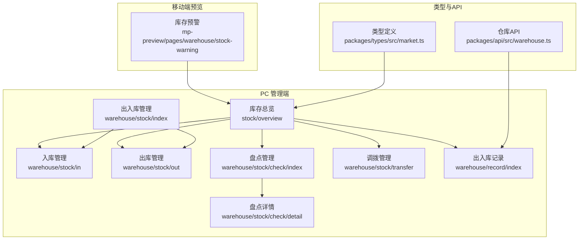
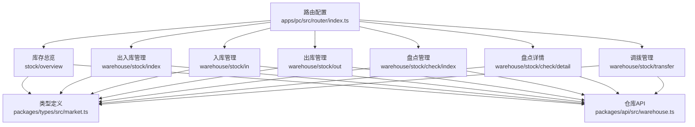
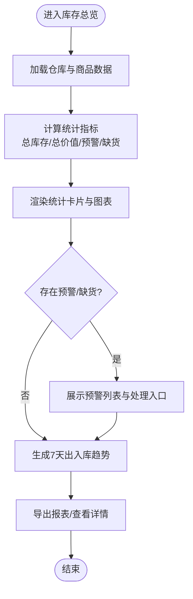
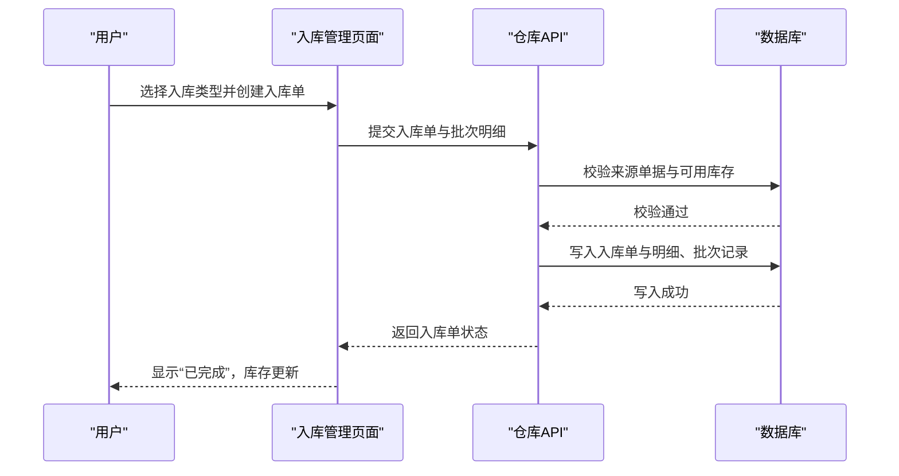
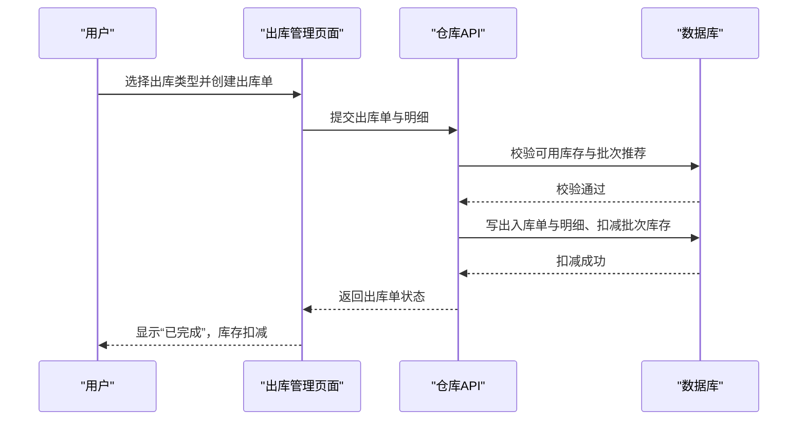
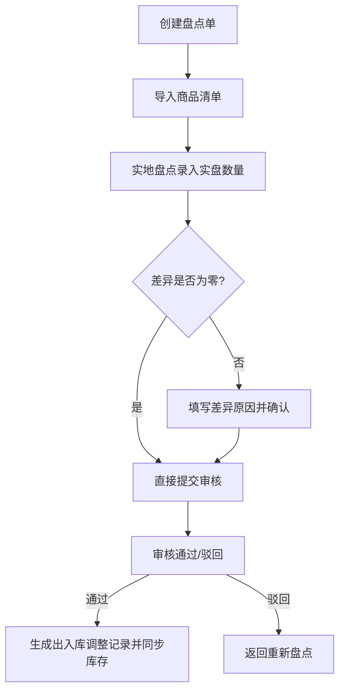
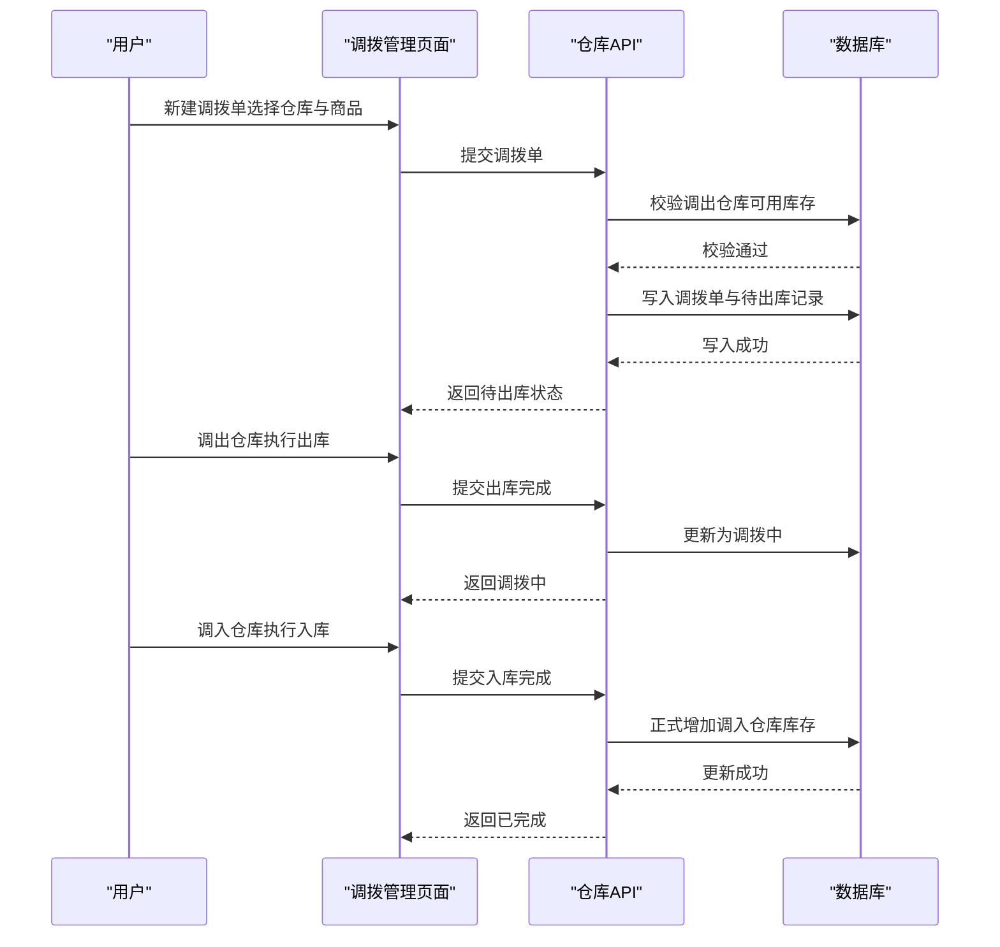
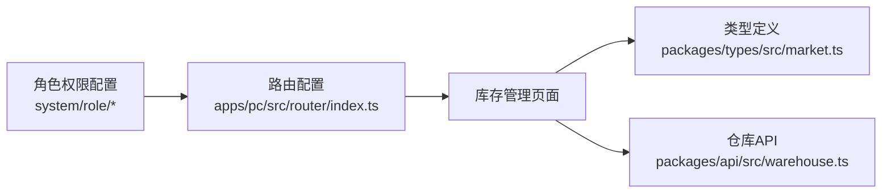

# 库存管理系统

<cite>
**本文档引用的文件**
- [apps/pc/src/views/stock/overview/index.vue](file://apps/pc/src/views/stock/overview/index.vue)
- [apps/pc/src/views/warehouse/stock/index.vue](file://apps/pc/src/views/warehouse/stock/index.vue)
- [apps/pc/src/views/warehouse/stock/in.vue](file://apps/pc/src/views/warehouse/stock/in.vue)
- [apps/pc/src/views/warehouse/stock/out.vue](file://apps/pc/src/views/warehouse/stock/out.vue)
- [apps/pc/src/views/warehouse/stock/check/index.vue](file://apps/pc/src/views/warehouse/stock/check/index.vue)
- [apps/pc/src/views/warehouse/stock/check/detail.vue](file://apps/pc/src/views/warehouse/stock/check/detail.vue)
- [apps/pc/src/views/warehouse/stock/transfer.vue](file://apps/pc/src/views/warehouse/stock/transfer.vue)
- [apps/pc/src/views/stock/check/index.vue](file://apps/pc/src/views/stock/check/index.vue)
- [apps/pc/src/views/stock/transfer/index.vue](file://apps/pc/src/views/stock/transfer/index.vue)
- [apps/pc/src/views/market/stock/index.vue](file://apps/pc/src/views/market/stock/index.vue)
- [apps/pc/src/views/mp-preview/pages/warehouse/stock-warning.vue](file://apps/pc/src/views/mp-preview/pages/warehouse/stock-warning.vue)
- [packages/types/src/market.ts](file://packages/types/src/market.ts)
- [apps/pc/src/router/index.ts](file://apps/pc/src/router/index.ts)
- [apps/pc/src/views/system/role/components/PermissionDrawer.vue](file://apps/pc/src/views/system/role/components/PermissionDrawer.vue)
- [apps/pc/src/views/system/role/components/RoleFormDrawer.vue](file://apps/pc/src/views/system/role/components/RoleFormDrawer.vue)
- [packages/api/src/warehouse.ts](file://packages/api/src/warehouse.ts)
- [docs/PRD/03-数据模型与表结构.md](file://docs/PRD/03-数据模型与表结构.md)
- [docs/PRD/02-业务流程设计.md](file://docs/PRD/02-业务流程设计.md)
</cite>

## 目录
1. [简介](#简介)
2. [项目结构](#项目结构)
3. [核心组件](#核心组件)
4. [架构总览](#架构总览)
5. [详细组件分析](#详细组件分析)
6. [依赖分析](#依赖分析)
7. [性能考虑](#性能考虑)
8. [故障排除指南](#故障排除指南)
9. [结论](#结论)
10. [附录](#附录)

## 简介
本文件为工程材料管理采供一体化平台中的库存管理系统提供全面技术文档。系统围绕“库存总览、入库管理、出库管理、盘点管理、调拨管理”五大核心功能域，结合前端页面与数据模型，形成完整的业务闭环。文档涵盖业务流程、操作步骤、数据模型、权限控制、异常处理与最佳实践，帮助开发者与运营人员高效理解与维护系统。

## 项目结构
库存管理模块主要分布在 PC 管理端与移动端预览端，页面组织遵循按功能域划分的层次化结构：
- PC 管理端：包含库存总览、出入库管理、盘点管理、调拨管理、出入库记录等页面，路由统一挂载在“库存管理”菜单下。
- 移动端预览端：提供库存预警等移动端视图，便于一线人员快速响应。
- 类型定义与 API：通过 packages/types 与 packages/api 提供类型约束与数据访问层支撑。

图表来源
- [apps/pc/src/views/stock/overview/index.vue:1-1004](file://apps/pc/src/views/stock/overview/index.vue#L1-L1004)
- [apps/pc/src/views/warehouse/stock/index.vue:1-27](file://apps/pc/src/views/warehouse/stock/index.vue#L1-L27)
- [apps/pc/src/views/warehouse/stock/in.vue:1-431](file://apps/pc/src/views/warehouse/stock/in.vue#L1-L431)
- [apps/pc/src/views/warehouse/stock/out.vue:1-325](file://apps/pc/src/views/warehouse/stock/out.vue#L1-L325)
- [apps/pc/src/views/warehouse/stock/check/index.vue:1-451](file://apps/pc/src/views/warehouse/stock/check/index.vue#L1-L451)
- [apps/pc/src/views/warehouse/stock/check/detail.vue:217-278](file://apps/pc/src/views/warehouse/stock/check/detail.vue#L217-L278)
- [apps/pc/src/views/warehouse/stock/transfer.vue:1-253](file://apps/pc/src/views/warehouse/stock/transfer.vue#L1-L253)
- [apps/pc/src/views/mp-preview/pages/warehouse/stock-warning.vue:1-76](file://apps/pc/src/views/mp-preview/pages/warehouse/stock-warning.vue#L1-L76)
- [packages/types/src/market.ts:140-181](file://packages/types/src/market.ts#L140-L181)
- [packages/api/src/warehouse.ts:75-96](file://packages/api/src/warehouse.ts#L75-L96)

章节来源
- [apps/pc/src/router/index.ts:237-284](file://apps/pc/src/router/index.ts#L237-L284)

## 核心组件
- 库存总览：集中展示仓库总数、商品种类、总库存量、库存总价值、预警/缺货商品、出入库趋势、分类库存分布、待处理调拨申请等关键指标，并提供导出报表、跳转至仓库详情与调拨管理的能力。
- 入库管理：支持采购入库、调拨入库、退货入库等类型，提供状态流转（待入库/入库中/已完成）、来源关联、统计看板与批量操作。
- 出库管理：支持销售出库、调拨出库、领料出库等类型，提供状态流转、来源关联、库存校验（先进先出、可用库存校验）、统计看板与批量操作。
- 盘点管理：支持全盘/抽盘两种模式，提供盘点单创建、审核、差异处理、生成出入库调整记录、导出盘点结果等功能。
- 调拨管理：支持新建调拨单、调出仓库出库、调入仓库入库、状态跟踪、在途库存管理与预计到达时间。

章节来源
- [apps/pc/src/views/stock/overview/index.vue:1-1004](file://apps/pc/src/views/stock/overview/index.vue#L1-L1004)
- [apps/pc/src/views/warehouse/stock/in.vue:1-431](file://apps/pc/src/views/warehouse/stock/in.vue#L1-L431)
- [apps/pc/src/views/warehouse/stock/out.vue:1-325](file://apps/pc/src/views/warehouse/stock/out.vue#L1-L325)
- [apps/pc/src/views/warehouse/stock/check/index.vue:1-451](file://apps/pc/src/views/warehouse/stock/check/index.vue#L1-L451)
- [apps/pc/src/views/warehouse/stock/transfer.vue:1-253](file://apps/pc/src/views/warehouse/stock/transfer.vue#L1-L253)

## 架构总览
系统采用前端路由驱动的单页应用架构，库存管理功能通过统一的路由配置挂载到“库存管理”菜单下，页面之间通过路由参数与状态共享实现联动。类型定义与 API 层为页面提供数据契约与后端交互能力。

图表来源
- [apps/pc/src/router/index.ts:237-284](file://apps/pc/src/router/index.ts#L237-L284)
- [packages/types/src/market.ts:140-181](file://packages/types/src/market.ts#L140-L181)
- [packages/api/src/warehouse.ts:75-96](file://packages/api/src/warehouse.ts#L75-L96)

## 详细组件分析

### 库存总览
- 功能要点
  - 统计看板：仓库总数、商品种类、总库存量、库存总价值、预警/缺货商品、日均周转。
  - 仓库监控：按仓库维度展示库存容量、商品种类、库存总量、库存价值、周转天数、预警/缺货数量。
  - 分类分布：按商品分类展示库存总量、库存价值及占比。
  - 待处理调拨：展示待审批调拨申请，支持一键审批。
  - 预警与容量告警：展示各类预警信息，支持快速跳转处理。
- 业务流程
  - 数据聚合：从仓库与商品维度聚合库存、出入库、调拨等数据，计算总价值与周转指标。
  - 预警规则：基于安全库存与当前库存比值判定预警级别；缺货商品直接标记为缺货。
  - 趋势分析：基于近7天出入库数据生成趋势图与汇总。
- 异常处理
  - 无数据时显示空状态；导出报表时提示处理中；点击“处理”按钮跳转至相应页面。
- 最佳实践
  - 定期校准安全库存阈值；关注高周转天数仓库，优化补货节奏；利用分类分布识别滞销与热销品类。

图表来源
- [apps/pc/src/views/stock/overview/index.vue:391-404](file://apps/pc/src/views/stock/overview/index.vue#L391-L404)
- [apps/pc/src/views/stock/overview/index.vue:505-538](file://apps/pc/src/views/stock/overview/index.vue#L505-L538)
- [apps/pc/src/views/stock/overview/index.vue:540-558](file://apps/pc/src/views/stock/overview/index.vue#L540-L558)

章节来源
- [apps/pc/src/views/stock/overview/index.vue:1-1004](file://apps/pc/src/views/stock/overview/index.vue#L1-L1004)

### 入库管理
- 功能要点
  - 多类型入库：采购入库、调拨入库、退货入库。
  - 状态流转：待入库 → 入库中 → 已完成。
  - 来源关联：关联采购单、调拨单、销售退货单。
  - 统计看板：今日入库单、待入库数量、入库商品数、入库金额。
- 业务流程
  - 创建入库单：选择入库类型、关联来源单据、录入批次明细。
  - 审核入库：校验来源与数量，生成批次记录，更新库存金额与数量。
  - 完成入库：状态变更为已完成，库存数据同步更新。
- 异常处理
  - 待入库状态下允许编辑；入库完成后禁止修改；差异需备注说明。
- 最佳实践
  - 严格校验来源单据；按批次入库便于溯源；及时打印入库单作为凭证。

图表来源
- [apps/pc/src/views/warehouse/stock/in.vue:187-289](file://apps/pc/src/views/warehouse/stock/in.vue#L187-L289)
- [apps/pc/src/views/warehouse/stock/in.vue:374-391](file://apps/pc/src/views/warehouse/stock/in.vue#L374-L391)
- [docs/PRD/02-业务流程设计.md:735-756](file://docs/PRD/02-业务流程设计.md#L735-L756)

章节来源
- [apps/pc/src/views/warehouse/stock/in.vue:1-431](file://apps/pc/src/views/warehouse/stock/in.vue#L1-L431)
- [docs/PRD/02-业务流程设计.md:735-756](file://docs/PRD/02-业务流程设计.md#L735-L756)

### 出库管理
- 功能要点
  - 多类型出库：销售出库、调拨出库、领料出库。
  - 状态流转：待出库 → 出库中 → 已完成。
  - 库存校验：先进先出策略与可用库存校验，防止超发。
  - 统计看板：今日出库单、待出库数量、出库商品数、出库金额。
- 业务流程
  - 创建出库单：选择出库类型、关联来源单据、录入出库明细。
  - 审核出库：校验可用库存与批次推荐，生成出库单与批次扣减。
  - 完成出库：状态变更为已完成，库存数量与金额同步扣减。
- 异常处理
  - 待出库状态下允许编辑；出库完成后禁止修改；超发控制防止负库存。
- 最佳实践
  - 优先使用先进先出策略；加强超发控制；及时打印出库单与送货单。

图表来源
- [apps/pc/src/views/warehouse/stock/out.vue:133-212](file://apps/pc/src/views/warehouse/stock/out.vue#L133-L212)
- [apps/pc/src/views/warehouse/stock/out.vue:275-292](file://apps/pc/src/views/warehouse/stock/out.vue#L275-L292)

章节来源
- [apps/pc/src/views/warehouse/stock/out.vue:1-325](file://apps/pc/src/views/warehouse/stock/out.vue#L1-L325)

### 盘点管理
- 功能要点
  - 盘点类型：全盘/抽盘；支持选择具体商品进行抽盘。
  - 审核流程：待审核 → 已通过/已驳回；通过后自动生成出入库调整记录。
  - 差异处理：支持填写差异原因，逐项确认后提交审核。
- 业务流程
  - 创建盘点单：选择仓库与盘点类型，导入商品清单。
  - 实地盘点：录入实盘数量，系统自动计算差异。
  - 审核与调整：审核通过后同步调整库存，生成差异记录。
- 异常处理
  - 未盘点完成不得提交；差异商品必须填写原因；审核意见必填。
- 最佳实践
  - 抽盘模式下优先选择高价值或易损耗商品；差异原因应清晰可追溯；定期复盘差异原因以优化库存管理。

图表来源
- [apps/pc/src/views/warehouse/stock/check/index.vue:264-310](file://apps/pc/src/views/warehouse/stock/check/index.vue#L264-L310)
- [apps/pc/src/views/warehouse/stock/check/detail.vue:217-243](file://apps/pc/src/views/warehouse/stock/check/detail.vue#L217-L243)

章节来源
- [apps/pc/src/views/warehouse/stock/check/index.vue:1-451](file://apps/pc/src/views/warehouse/stock/check/index.vue#L1-L451)
- [apps/pc/src/views/warehouse/stock/check/detail.vue:217-278](file://apps/pc/src/views/warehouse/stock/check/detail.vue#L217-L278)

### 调拨管理
- 功能要点
  - 调拨流程：新建调拨单 → 调出仓库出库 → 调入仓库入库。
  - 状态跟踪：待出库 → 调拨中 → 已完成。
  - 库存校验：调出仓库出库前校验可用库存。
  - 在途管理：支持预计到达时间与在途库存管理。
- 业务流程
  - 创建调拨单：选择调出/调入仓库、商品与数量。
  - 调出出库：调出仓库执行出库，生成待入库记录。
  - 调入入库：调入仓库执行入库，正式增加库存。
- 异常处理
  - 调出仓库可用库存不足时禁止创建；调拨完成后禁止修改。
- 最佳实践
  - 优先就近调拨以降低在途风险；明确预计到达时间；定期复盘调拨效率。

图表来源
- [apps/pc/src/views/warehouse/stock/transfer.vue:121-170](file://apps/pc/src/views/warehouse/stock/transfer.vue#L121-L170)
- [apps/pc/src/views/stock/transfer/index.vue:376-420](file://apps/pc/src/views/stock/transfer/index.vue#L376-L420)

章节来源
- [apps/pc/src/views/warehouse/stock/transfer.vue:1-253](file://apps/pc/src/views/warehouse/stock/transfer.vue#L1-L253)
- [apps/pc/src/views/stock/transfer/index.vue:376-420](file://apps/pc/src/views/stock/transfer/index.vue#L376-L420)

### 库存预警与移动端支持
- 功能要点
  - 预警类型：缺货、库存低于安全线、仓库容量告警。
  - 快速补货：移动端提供快速补货入口。
  - 预警列表：支持查看所有预警商品与处理记录。
- 最佳实践
  - 设置合理的安全库存阈值；定期复盘预警原因；移动端及时响应处理。

章节来源
- [apps/pc/src/views/market/stock/index.vue:141-489](file://apps/pc/src/views/market/stock/index.vue#L141-L489)
- [apps/pc/src/views/mp-preview/pages/warehouse/stock-warning.vue:1-76](file://apps/pc/src/views/mp-preview/pages/warehouse/stock-warning.vue#L1-L76)
- [packages/types/src/market.ts:164-181](file://packages/types/src/market.ts#L164-L181)

## 依赖分析
- 页面依赖
  - 各功能页面依赖统一的类型定义（如 WarehouseStock、StockAlert），确保前后端数据一致性。
  - 出入库记录页面依赖仓库 API，提供分页查询与过滤能力。
- 路由与权限
  - 路由统一挂载在“库存管理”菜单下，支持不同角色访问相应页面。
  - 角色权限配置支持“库存管理”相关页面的细粒度授权。

图表来源
- [apps/pc/src/router/index.ts:237-284](file://apps/pc/src/router/index.ts#L237-L284)
- [packages/types/src/market.ts:140-181](file://packages/types/src/market.ts#L140-L181)
- [packages/api/src/warehouse.ts:75-96](file://packages/api/src/warehouse.ts#L75-L96)
- [apps/pc/src/views/system/role/components/PermissionDrawer.vue:52-136](file://apps/pc/src/views/system/role/components/PermissionDrawer.vue#L52-L136)

章节来源
- [apps/pc/src/router/index.ts:237-284](file://apps/pc/src/router/index.ts#L237-L284)
- [apps/pc/src/views/system/role/components/PermissionDrawer.vue:52-136](file://apps/pc/src/views/system/role/components/PermissionDrawer.vue#L52-L136)

## 性能考虑
- 数据聚合与缓存
  - 库存总览页面的数据聚合应在前端进行分页与节流，避免一次性渲染大量数据。
  - 对高频查询（如出入库记录）建议引入本地缓存与增量更新机制。
- 图表渲染
  - 趋势图与分类分布图应限制数据点数量，采用虚拟滚动或分页展示。
- 网络请求
  - 批量操作（如批量入库/出库）应合并请求，减少网络往返次数。
- 前端状态管理
  - 使用轻量状态管理（如 Pinia）存储筛选条件与分页状态，避免重复请求。

## 故障排除指南
- 登录与权限
  - 若出现无权限访问页面，检查路由元信息与角色权限配置，确保用户具备相应权限。
- 数据异常
  - 若出入库记录缺失或不一致，检查仓库 API 的分页参数与过滤条件，确认查询逻辑正确。
- 预警不准确
  - 检查安全库存阈值设置与当前库存数据，必要时重新计算并同步。
- 移动端预警
  - 确认移动端页面与 PC 端数据源一致，检查网络请求与数据格式。

章节来源
- [apps/pc/src/router/index.ts:776-787](file://apps/pc/src/router/index.ts#L776-L787)
- [packages/api/src/warehouse.ts:75-96](file://packages/api/src/warehouse.ts#L75-L96)

## 结论
库存管理系统通过“库存总览、入库管理、出库管理、盘点管理、调拨管理”的完整闭环，实现了从数据采集、业务流转到分析决策的全链路覆盖。配合完善的权限控制与移动端支持，能够有效提升库存透明度与运营效率。建议持续优化阈值设定、流程自动化与数据分析能力，以进一步降低运营成本并提升客户满意度。

## 附录
- 数据模型参考
  - 库存相关核心实体：stock、stock_in、stock_out、stock_batch、stock_check、site_stock。
  - 关键字段：库存数量、锁定数量、成本价格、总金额、批次号、有效期等。
- 业务规则参考
  - 入库/出库必须关联来源单据；待状态可编辑，完成后禁止修改；差异需备注说明；超发控制与先进先出策略。

章节来源
- [docs/PRD/03-数据模型与表结构.md:500-635](file://docs/PRD/03-数据模型与表结构.md#L500-L635)