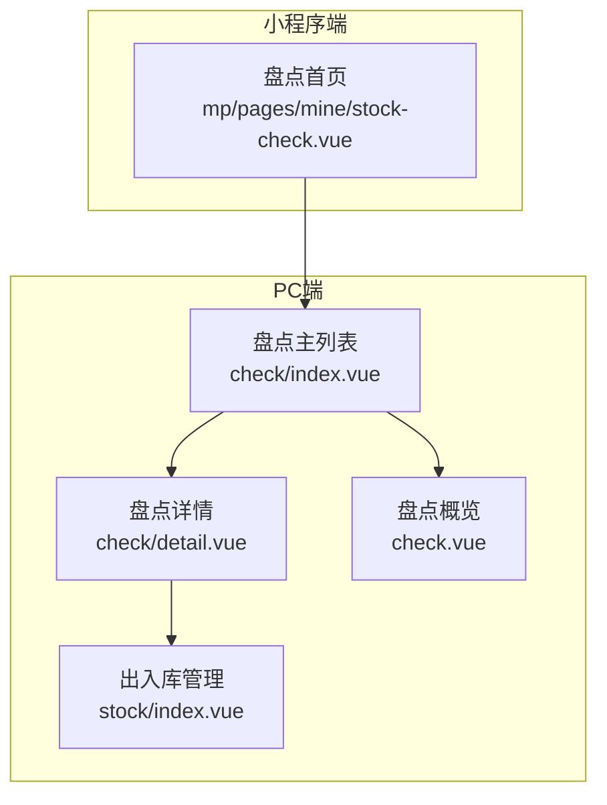
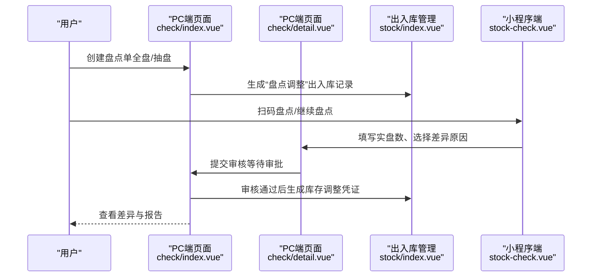
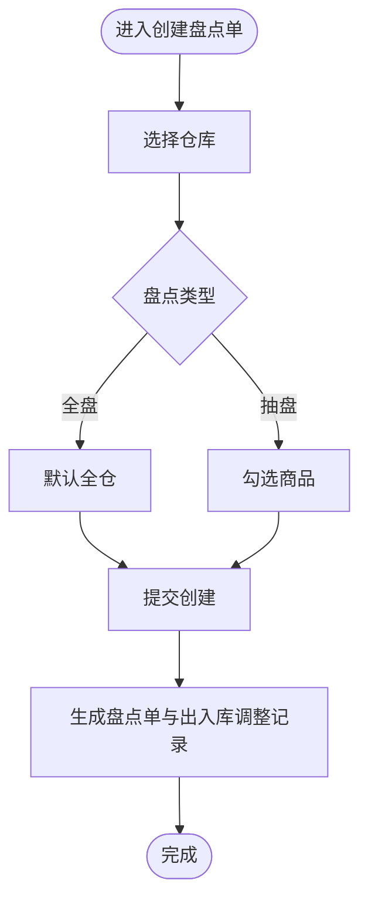
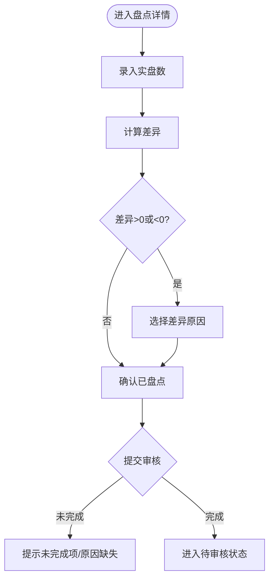
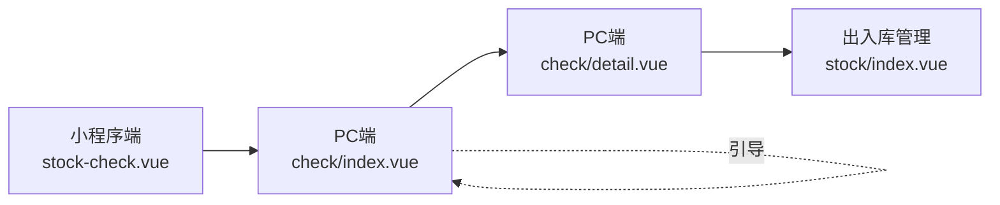

# 盘点管理

<cite>
**本文引用的文件**
- [apps/pc/src/views/warehouse/stock/check.vue](file://apps/pc/src/views/warehouse/stock/check.vue)
- [apps/pc/src/views/warehouse/stock/check/index.vue](file://apps/pc/src/views/warehouse/stock/check/index.vue)
- [apps/pc/src/views/warehouse/stock/check/detail.vue](file://apps/pc/src/views/warehouse/stock/check/detail.vue)
- [apps/pc/src/views/warehouse/stock/index.vue](file://apps/pc/src/views/warehouse/stock/index.vue)
- [apps/mp/src/pages/mine/stock-check.vue](file://apps/mp/src/pages/mine/stock-check.vue)
- [搭建教程.md](file://搭建教程.md)
</cite>

## 目录
1. [简介](#简介)
2. [项目结构](#项目结构)
3. [核心组件](#核心组件)
4. [架构总览](#架构总览)
5. [详细组件分析](#详细组件分析)
6. [依赖关系分析](#依赖关系分析)
7. [性能考量](#性能考量)
8. [故障排查指南](#故障排查指南)
9. [结论](#结论)
10. [附录](#附录)

## 简介
本文件围绕“盘点管理”功能，系统化梳理从盘点任务创建、执行、差异处理到报告生成的全流程，并结合现有前端页面与交互，给出策略制定、范围确定、数据采集、差异分析、异常处理、结果确认与审批等最佳实践与优化建议。文档同时覆盖循环盘点、定期盘点、专项盘点等策略，以及移动端扫码盘点能力。

## 项目结构
盘点管理相关页面主要分布在 PC 端与小程序端：
- PC 端
  - 盘点主列表与创建：apps/pc/src/views/warehouse/stock/check/index.vue
  - 盘点详情与差异处理：apps/pc/src/views/warehouse/stock/check/detail.vue
  - 盘点概览与统计：apps/pc/src/views/warehouse/stock/check.vue
  - 入库/出库管理（与库存调整联动）：apps/pc/src/views/warehouse/stock/index.vue
- 小程序端
  - 盘点首页与统计：apps/mp/src/pages/mine/stock-check.vue
- 文档参考
  - 库存调整与盘点单联动说明：搭建教程.md

**图表来源**
- [apps/pc/src/views/warehouse/stock/check/index.vue:1-451](file://apps/pc/src/views/warehouse/stock/check/index.vue#L1-L451)
- [apps/pc/src/views/warehouse/stock/check/detail.vue:1-279](file://apps/pc/src/views/warehouse/stock/check/detail.vue#L1-L279)
- [apps/pc/src/views/warehouse/stock/check.vue:1-289](file://apps/pc/src/views/warehouse/stock/check.vue#L1-L289)
- [apps/pc/src/views/warehouse/stock/index.vue:1-862](file://apps/pc/src/views/warehouse/stock/index.vue#L1-L862)
- [apps/mp/src/pages/mine/stock-check.vue:1-441](file://apps/mp/src/pages/mine/stock-check.vue#L1-L441)

**章节来源**
- [apps/pc/src/views/warehouse/stock/check/index.vue:1-451](file://apps/pc/src/views/warehouse/stock/check/index.vue#L1-L451)
- [apps/pc/src/views/warehouse/stock/check/detail.vue:1-279](file://apps/pc/src/views/warehouse/stock/check/detail.vue#L1-L279)
- [apps/pc/src/views/warehouse/stock/check.vue:1-289](file://apps/pc/src/views/warehouse/stock/check.vue#L1-L289)
- [apps/pc/src/views/warehouse/stock/index.vue:1-862](file://apps/pc/src/views/warehouse/stock/index.vue#L1-L862)
- [apps/mp/src/pages/mine/stock-check.vue:1-441](file://apps/mp/src/pages/mine/stock-check.vue#L1-L441)

## 核心组件
- 盘点主列表与创建
  - 支持按状态筛选、搜索、创建盘点单；抽盘模式下支持勾选商品；审核流程（通过/驳回）。
- 盘点详情与差异处理
  - 实盘录入、差异计算、差异原因选择、逐项确认、提交审核。
- 盘点概览与统计
  - 展示盘点次数、待盘点、准确率、差异金额等指标。
- 入库/出库管理
  - 与库存调整联动，支持“盘点调整”类型的出入库记录生成。
- 小程序端盘点入口
  - 提供新建盘点、扫码盘点、查看盘点单、导出报表等基础能力。

**章节来源**
- [apps/pc/src/views/warehouse/stock/check/index.vue:1-451](file://apps/pc/src/views/warehouse/stock/check/index.vue#L1-L451)
- [apps/pc/src/views/warehouse/stock/check/detail.vue:1-279](file://apps/pc/src/views/warehouse/stock/check/detail.vue#L1-L279)
- [apps/pc/src/views/warehouse/stock/check.vue:1-289](file://apps/pc/src/views/warehouse/stock/check.vue#L1-L289)
- [apps/pc/src/views/warehouse/stock/index.vue:1-862](file://apps/pc/src/views/warehouse/stock/index.vue#L1-L862)
- [apps/mp/src/pages/mine/stock-check.vue:1-441](file://apps/mp/src/pages/mine/stock-check.vue#L1-L441)

## 架构总览
从用户视角看，盘点管理由“创建—执行—审核—调整—报告”闭环构成。PC 端负责创建与审核、差异处理与统计；小程序端负责盘点执行与扫码辅助；出入库管理负责库存调整的凭证生成。

**图表来源**
- [apps/pc/src/views/warehouse/stock/check/index.vue:362-426](file://apps/pc/src/views/warehouse/stock/check/index.vue#L362-L426)
- [apps/pc/src/views/warehouse/stock/check/detail.vue:221-243](file://apps/pc/src/views/warehouse/stock/check/detail.vue#L221-L243)
- [apps/pc/src/views/warehouse/stock/index.vue:718-782](file://apps/pc/src/views/warehouse/stock/index.vue#L718-L782)
- [apps/mp/src/pages/mine/stock-check.vue:158-189](file://apps/mp/src/pages/mine/stock-check.vue#L158-L189)

## 详细组件分析

### 盘点主列表与创建（PC 端）
- 功能要点
  - 支持按状态筛选（待审核/已通过/已驳回），关键词搜索（盘点单号）。
  - 创建盘点单：选择仓库、盘点类型（全盘/抽盘），抽盘时勾选商品；提交后自动生成出入库调整记录。
  - 审核流程：通过或驳回，填写意见；通过后同步调整库存。
- 关键交互
  - 创建确认：校验仓库必填、生成单号、统计商品数与盈亏金额。
  - 删除盘点单：弹窗确认。
- 数据模型（CheckOrder）
  - 字段包括：id、checkNo、warehouseId、warehouseName、checkType、productCount、profitQty、lossQty、profitAmount、lossAmount、status、creatorName、createdAt。

**图表来源**
- [apps/pc/src/views/warehouse/stock/check/index.vue:362-396](file://apps/pc/src/views/warehouse/stock/check/index.vue#L362-L396)

**章节来源**
- [apps/pc/src/views/warehouse/stock/check/index.vue:1-451](file://apps/pc/src/views/warehouse/stock/check/index.vue#L1-L451)

### 盘点详情与差异处理（PC 端）
- 功能要点
  - 实盘录入：仅在“盘点中”状态下允许编辑实盘数，实时计算差异。
  - 差异原因：非零差异需选择原因（如入库漏登、出库漏登、计量误差、自然损耗、运输破损、其他）。
  - 逐项确认：确认后标记为“已盘点”，支持搜索与差异筛选。
  - 提交审核：未盘点商品或有差异未填原因则拦截。
- 关键交互
  - 实盘变更：动态更新差异字段。
  - 提交审核：校验全部盘点完成且差异原因完备。
- 数据模型（商品行）
  - 字段包括：productCode、productName、spec、unit、bookQty、actualQty、diff、reason、checked。

**图表来源**
- [apps/pc/src/views/warehouse/stock/check/detail.vue:217-243](file://apps/pc/src/views/warehouse/stock/check/detail.vue#L217-L243)

**章节来源**
- [apps/pc/src/views/warehouse/stock/check/detail.vue:1-279](file://apps/pc/src/views/warehouse/stock/check/detail.vue#L1-L279)

### 盘点概览与统计（PC 端）
- 功能要点
  - 展示“本月盘点次数”、“待盘点次数”、“盘点准确率”、“差异金额”等关键指标。
  - 盘点单列表：支持状态筛选（全部/待盘点/盘点中/已完成），展示盘点类型、仓库、范围、SKU总数、有差异数量、盈亏金额、状态、创建人、创建时间。
  - 操作：详情、开始盘点、提交、更多（查看差异/调整库存/打印）。
- 业务规则
  - 盘点过程中建议冻结对应库存的出入库。
  - 实盘数与系统数的差异即为盈亏。
  - 差异需经审核后方可调整库存。
  - 盘盈盘亏需同步到财务系统记账。
  - 盘点完成生成盘点报告归档。

**章节来源**
- [apps/pc/src/views/warehouse/stock/check.vue:1-289](file://apps/pc/src/views/warehouse/stock/check.vue#L1-L289)

### 入库/出库管理与库存调整联动（PC 端）
- 功能要点
  - 支持“按批次生成采购入库单”，可合并多批次生成一张入库单。
  - “库存调整”类型：用于盘点调整，需创建盘点单并通过审核后生成出入库调整记录。
- 交互说明
  - 当用户选择“库存调整”时，引导跳转至盘点管理页面创建盘点单并走审核流程。

**章节来源**
- [apps/pc/src/views/warehouse/stock/index.vue:718-782](file://apps/pc/src/views/warehouse/stock/index.vue#L718-L782)
- [搭建教程.md:364-378](file://搭建教程.md#L364-L378)

### 小程序端盘点入口（移动端）
- 功能要点
  - 统计：待盘点、已盘点、差异数量。
  - 操作：新建盘点、扫码盘点、查看详情、继续盘点、导出报表。
  - 流程：扫码识别商品，进入盘点流程；支持断点续盘。
- 业务规则
  - 与 PC 端一致：差异原因必填、审核后调整库存。

**章节来源**
- [apps/mp/src/pages/mine/stock-check.vue:1-441](file://apps/mp/src/pages/mine/stock-check.vue#L1-L441)

## 依赖关系分析
- 组件耦合
  - 盘点详情依赖出入库管理以生成库存调整凭证。
  - 小程序端与 PC 端共享业务规则与状态机（草稿/盘点中/待审核/已完成）。
- 外部集成
  - 扫码能力来自小程序原生接口，用于快速录入商品。
  - 审核通过后与财务系统对接（描述性规则，具体实现不在前端）。

**图表来源**
- [apps/mp/src/pages/mine/stock-check.vue:158-189](file://apps/mp/src/pages/mine/stock-check.vue#L158-L189)
- [apps/pc/src/views/warehouse/stock/check/index.vue:362-396](file://apps/pc/src/views/warehouse/stock/check/index.vue#L362-L396)
- [apps/pc/src/views/warehouse/stock/check/detail.vue:221-243](file://apps/pc/src/views/warehouse/stock/check/detail.vue#L221-L243)
- [apps/pc/src/views/warehouse/stock/index.vue:718-782](file://apps/pc/src/views/warehouse/stock/index.vue#L718-L782)

**章节来源**
- [apps/mp/src/pages/mine/stock-check.vue:1-441](file://apps/mp/src/pages/mine/stock-check.vue#L1-L441)
- [apps/pc/src/views/warehouse/stock/check/index.vue:1-451](file://apps/pc/src/views/warehouse/stock/check/index.vue#L1-L451)
- [apps/pc/src/views/warehouse/stock/check/detail.vue:1-279](file://apps/pc/src/views/warehouse/stock/check/detail.vue#L1-L279)
- [apps/pc/src/views/warehouse/stock/index.vue:1-862](file://apps/pc/src/views/warehouse/stock/index.vue#L1-L862)

## 性能考量
- 列表分页与筛选
  - 使用分页参数控制每页条数，避免一次性渲染大量数据。
  - 在前端进行关键词与状态过滤，减少后端压力。
- 实时差异计算
  - 在详情页对实盘变更进行本地计算，降低网络请求频率。
- 移动端体验
  - 小程序端采用轻量列表与扫码入口，提升现场盘点效率。
- 审核流程
  - 审核前置校验（未完成项/原因缺失）减少无效提交，提高整体吞吐。

## 故障排查指南
- 创建盘点单失败
  - 现象：无法提交。
  - 排查：检查仓库是否选择、抽盘模式下是否勾选商品、商品实盘数是否填写。
- 实盘录入异常
  - 现象：差异未更新或无法保存。
  - 排查：确认当前状态为“盘点中”，确保实盘数可编辑；检查网络与权限。
- 差异原因缺失
  - 现象：提交审核时报错。
  - 排查：非零差异必须填写原因；逐项确认后再提交。
- 审核不通过
  - 现象：盘点单被驳回。
  - 排查：检查审核意见是否填写、差异原因是否合理、是否符合业务规则。
- 小程序扫码失败
  - 现象：扫码无响应。
  - 排查：检查小程序权限与设备兼容性；重试扫码或手动输入。

**章节来源**
- [apps/pc/src/views/warehouse/stock/check/index.vue:371-396](file://apps/pc/src/views/warehouse/stock/check/index.vue#L371-L396)
- [apps/pc/src/views/warehouse/stock/check/detail.vue:221-243](file://apps/pc/src/views/warehouse/stock/check/detail.vue#L221-L243)
- [apps/mp/src/pages/mine/stock-check.vue:158-189](file://apps/mp/src/pages/mine/stock-check.vue#L158-L189)

## 结论
盘点管理通过“创建—执行—审核—调整—报告”的闭环，结合 PC 端与小程序端协同，实现了从任务下发到结果归档的全链路管理。建议在实际落地中强化差异原因标准化、完善异常处理流程、加强移动端扫码与离线能力，并持续优化审核与统计指标，以提升盘点效率与准确性。

## 附录

### 盘点策略与规则
- 盘点策略
  - 循环盘点：对高价值/高周转商品定期抽盘，提升重点商品准确性。
  - 定期盘点：月末/季末全仓盘点，确保账实相符。
  - 专项盘点：针对异常波动、审计要求或特殊事件开展专项盘点。
- 盘点范围
  - 按仓库、按品类、按库位筛选，抽盘模式支持精确选择商品。
- 数据采集
  - 小程序扫码与PC端手工录入相结合，支持断点续盘与批量导入。
- 差异分析
  - 差异原因分类（入库漏登、出库漏登、计量误差、自然损耗、运输破损、其他），支持统计与报表导出。
- 异常处理
  - 审核前置校验、差异原因必填、未完成项拦截，确保数据质量。
- 结果确认与审批
  - 审核通过后自动生成库存调整凭证，同步财务系统，形成闭环归档。

**章节来源**
- [apps/pc/src/views/warehouse/stock/check.vue:244-255](file://apps/pc/src/views/warehouse/stock/check.vue#L244-L255)
- [apps/pc/src/views/warehouse/stock/check/detail.vue:86-104](file://apps/pc/src/views/warehouse/stock/check/detail.vue#L86-L104)
- [apps/pc/src/views/warehouse/stock/index.vue:718-782](file://apps/pc/src/views/warehouse/stock/index.vue#L718-L782)
- [搭建教程.md:364-378](file://搭建教程.md#L364-L378)