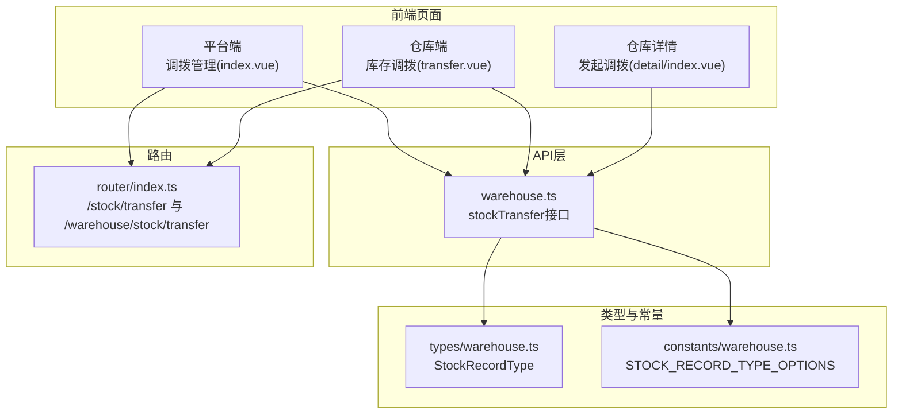
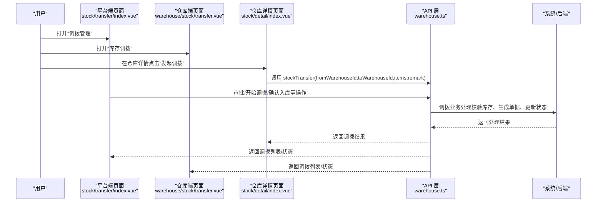
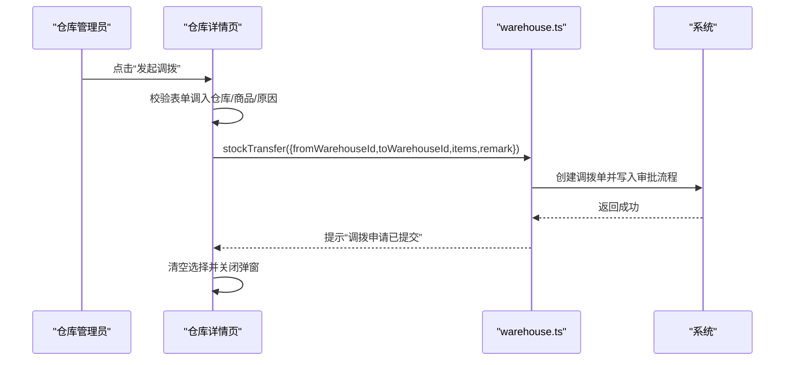
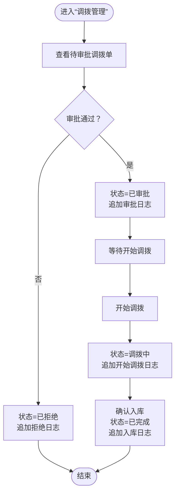
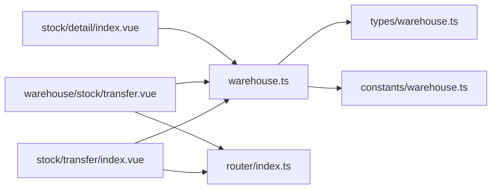

# 调拨管理

<cite>
**本文引用的文件**
- [apps/pc/src/views/stock/transfer/index.vue](file://apps/pc/src/views/stock/transfer/index.vue)
- [apps/pc/src/views/warehouse/stock/transfer.vue](file://apps/pc/src/views/warehouse/stock/transfer.vue)
- [apps/pc/src/views/stock/detail/index.vue](file://apps/pc/src/views/stock/detail/index.vue)
- [packages/api/src/warehouse.ts](file://packages/api/src/warehouse.ts)
- [packages/constants/src/warehouse.ts](file://packages/constants/src/warehouse.ts)
- [packages/types/src/warehouse.ts](file://packages/types/src/warehouse.ts)
- [apps/pc/src/router/index.ts](file://apps/pc/src/router/index.ts)
- [docs/PRD/02-业务流程设计.md](file://docs/PRD/02-业务流程设计.md)
- [docs/PRD/03-数据模型与表结构.md](file://docs/PRD/03-数据模型与表结构.md)
</cite>

## 目录
1. [简介](#简介)
2. [项目结构](#项目结构)
3. [核心组件](#核心组件)
4. [架构总览](#架构总览)
5. [详细组件分析](#详细组件分析)
6. [依赖分析](#依赖分析)
7. [性能考虑](#性能考虑)
8. [故障排查指南](#故障排查指南)
9. [结论](#结论)
10. [附录](#附录)

## 简介
本文件围绕“调拨管理”功能进行全面技术与业务说明，覆盖调拨申请创建、调拨审核流程、调拨执行监控、调拨记录查询等核心业务；并详细阐述调拨单据的数据结构、权限控制机制、数量与成本计算逻辑、跨仓库调拨处理、时效性控制、异常处理以及统计分析方法。同时提供操作指南与流程优化建议，帮助非技术读者快速理解与使用。

## 项目结构
调拨管理涉及前端页面、API 定义、类型与常量、路由配置及业务流程与数据模型文档。核心页面包括：
- 平台端“调拨管理”列表页：支持筛选、审批、开始调拨、确认入库、查看详情等。
- 仓库端“库存调拨”看板页：展示调拨统计与状态卡片。
- 仓库详情页“发起调拨”弹窗：从仓库视角发起调拨申请。
- API 层提供 stockTransfer 接口，统一调拨请求入口。
- 类型与常量定义了调拨相关的枚举与记录类型，确保前后端一致。

图表来源
- [apps/pc/src/views/stock/transfer/index.vue:1-723](file://apps/pc/src/views/stock/transfer/index.vue#L1-L723)
- [apps/pc/src/views/warehouse/stock/transfer.vue:1-253](file://apps/pc/src/views/warehouse/stock/transfer.vue#L1-L253)
- [apps/pc/src/views/stock/detail/index.vue:441-800](file://apps/pc/src/views/stock/detail/index.vue#L441-L800)
- [packages/api/src/warehouse.ts:106-113](file://packages/api/src/warehouse.ts#L106-L113)
- [packages/types/src/warehouse.ts:103-111](file://packages/types/src/warehouse.ts#L103-L111)
- [packages/constants/src/warehouse.ts:21-29](file://packages/constants/src/warehouse.ts#L21-L29)
- [apps/pc/src/router/index.ts:260-265](file://apps/pc/src/router/index.ts#L260-L265)

章节来源
- [apps/pc/src/views/stock/transfer/index.vue:1-723](file://apps/pc/src/views/stock/transfer/index.vue#L1-L723)
- [apps/pc/src/views/warehouse/stock/transfer.vue:1-253](file://apps/pc/src/views/warehouse/stock/transfer.vue#L1-L253)
- [apps/pc/src/views/stock/detail/index.vue:441-800](file://apps/pc/src/views/stock/detail/index.vue#L441-L800)
- [packages/api/src/warehouse.ts:106-113](file://packages/api/src/warehouse.ts#L106-L113)
- [packages/types/src/warehouse.ts:103-111](file://packages/types/src/warehouse.ts#L103-L111)
- [packages/constants/src/warehouse.ts:21-29](file://packages/constants/src/warehouse.ts#L21-L29)
- [apps/pc/src/router/index.ts:260-265](file://apps/pc/src/router/index.ts#L260-L265)

## 核心组件
- 调拨管理列表页（平台端）
  - 功能：筛选（关键字、调出/调入仓库、日期）、分页、状态标签、审批操作、开始调拨、确认入库、查看详情。
  - 数据：模拟调拨列表，包含调拨单号、调出/调入仓库、商品数量、总数量、总价值、状态、申请人、申请时间、审批日志等。
  - 行为：根据 tab 切换过滤；搜索关键词匹配调拨单号或商品名称；选择仓库时联动过滤；分页控制。
- 仓库端库存调拨看板
  - 功能：统计“待出库”“调拨中”“本月调拨量”“调拨SKU数”，表格展示调拨单列表，支持状态颜色与文案映射。
- 仓库详情发起调拨
  - 功能：从仓库视角发起调拨，选择调入仓库、勾选商品、设置调拨数量、填写原因。
  - 行为：校验必填项，提交后清空选择并提示成功。
- API 接口
  - stockTransfer：统一调拨接口，参数包含 fromWarehouseId、toWarehouseId、items（skuId、quantity）、remark。
- 类型与常量
  - StockRecordType：定义调拨入库/出库枚举。
  - STOCK_RECORD_TYPE_OPTIONS：出入库与调拨类型的选项集合，便于 UI 展示。

章节来源
- [apps/pc/src/views/stock/transfer/index.vue:16-108](file://apps/pc/src/views/stock/transfer/index.vue#L16-L108)
- [apps/pc/src/views/warehouse/stock/transfer.vue:10-105](file://apps/pc/src/views/warehouse/stock/transfer.vue#L10-L105)
- [apps/pc/src/views/stock/detail/index.vue:441-800](file://apps/pc/src/views/stock/detail/index.vue#L441-L800)
- [packages/api/src/warehouse.ts:106-113](file://packages/api/src/warehouse.ts#L106-L113)
- [packages/types/src/warehouse.ts:103-111](file://packages/types/src/warehouse.ts#L103-L111)
- [packages/constants/src/warehouse.ts:21-29](file://packages/constants/src/warehouse.ts#L21-L29)

## 架构总览
调拨管理从前端页面到 API 层的交互路径如下：

图表来源
- [apps/pc/src/views/stock/transfer/index.vue:563-614](file://apps/pc/src/views/stock/transfer/index.vue#L563-L614)
- [apps/pc/src/views/warehouse/stock/transfer.vue:1-253](file://apps/pc/src/views/warehouse/stock/transfer.vue#L1-L253)
- [apps/pc/src/views/stock/detail/index.vue:773-800](file://apps/pc/src/views/stock/detail/index.vue#L773-L800)
- [packages/api/src/warehouse.ts:106-113](file://packages/api/src/warehouse.ts#L106-L113)

## 详细组件分析

### 调拨申请创建（仓库详情发起）
- 页面入口：仓库详情页“发起调拨”弹窗。
- 表单字段：调出仓库（默认当前仓库）、调入仓库、调拨商品（勾选商品并设置数量）、调拨原因。
- 校验逻辑：调入仓库必选、至少勾选一个商品、原因必填。
- 提交流程：调用 stockTransfer 接口，提交后清空选择并提示成功。

图表来源
- [apps/pc/src/views/stock/detail/index.vue:773-800](file://apps/pc/src/views/stock/detail/index.vue#L773-L800)
- [packages/api/src/warehouse.ts:106-113](file://packages/api/src/warehouse.ts#L106-L113)

章节来源
- [apps/pc/src/views/stock/detail/index.vue:441-800](file://apps/pc/src/views/stock/detail/index.vue#L441-L800)
- [packages/api/src/warehouse.ts:106-113](file://packages/api/src/warehouse.ts#L106-L113)

### 调拨审核流程（平台端）
- 页面入口：平台端“调拨管理”列表页。
- 审批动作：待审批状态下支持“审批通过/拒绝”，分别更新状态与审批日志。
- 状态流转：pending → approved/rejected；approved → in_transit；in_transit → completed。
- 日志记录：每次操作追加审批记录，包含操作人、时间、备注。

图表来源
- [apps/pc/src/views/stock/transfer/index.vue:563-614](file://apps/pc/src/views/stock/transfer/index.vue#L563-L614)

章节来源
- [apps/pc/src/views/stock/transfer/index.vue:16-108](file://apps/pc/src/views/stock/transfer/index.vue#L16-L108)
- [apps/pc/src/views/stock/transfer/index.vue:563-614](file://apps/pc/src/views/stock/transfer/index.vue#L563-L614)

### 调拨执行监控（仓库端看板）
- 统计维度：待出库、调拨中、本月调拨量、调拨SKU数。
- 表格列：调拨单号、调出/调入仓库、商品种类、总数量、总价值、状态、预计到达、创建人、创建时间、操作（详情/出库/入库/取消）。
- 状态映射：pending → processing → completed；颜色与文案对应。

章节来源
- [apps/pc/src/views/warehouse/stock/transfer.vue:10-105](file://apps/pc/src/views/warehouse/stock/transfer.vue#L10-L105)

### 调拨记录查询（平台端与仓库端）
- 平台端：支持按关键字、调出/调入仓库、日期范围筛选；分页显示；支持查看详情与审批记录。
- 仓库端：统计看板与列表；支持查看详情与状态操作。

章节来源
- [apps/pc/src/views/stock/transfer/index.vue:25-108](file://apps/pc/src/views/stock/transfer/index.vue#L25-L108)
- [apps/pc/src/views/warehouse/stock/transfer.vue:49-105](file://apps/pc/src/views/warehouse/stock/transfer.vue#L49-L105)

### 调拨单据数据结构
- 调拨单（平台端/仓库端通用）：
  - 基本信息：transferNo、source/targetWarehouseId/name、applicantName、createdAt、reason。
  - 商品明细：products（skuId/skuCode/skuName/spec/quantity/unit/price）。
  - 统计：productCount、totalQuantity、totalValue。
  - 状态：pending/approved/in_transit/completed/rejected。
  - 审批日志：logs（id/action/operatorName/createdAt/remark）。
- API 请求体：
  - fromWarehouseId、toWarehouseId、items（[{skuId, quantity}]）、remark。

章节来源
- [apps/pc/src/views/stock/transfer/index.vue:311-420](file://apps/pc/src/views/stock/transfer/index.vue#L311-L420)
- [packages/api/src/warehouse.ts:106-113](file://packages/api/src/warehouse.ts#L106-L113)
- [packages/types/src/warehouse.ts:87-101](file://packages/types/src/warehouse.ts#L87-L101)

### 调拨权限控制机制
- 路由层面：平台端与仓库端分别提供“调拨管理/库存调拨”路由，页面具备独立入口与权限控制。
- 操作权限：审批、开始调拨、确认入库等操作仅在相应状态下可执行，避免越权操作。
- 数据权限：仓库详情发起调拨默认使用当前仓库为调出仓库，防止跨仓库越权。

章节来源
- [apps/pc/src/router/index.ts:260-265](file://apps/pc/src/router/index.ts#L260-L265)
- [apps/pc/src/router/index.ts:645-650](file://apps/pc/src/router/index.ts#L645-L650)
- [apps/pc/src/views/stock/detail/index.vue:773-800](file://apps/pc/src/views/stock/detail/index.vue#L773-L800)

### 调拨数量与成本计算逻辑
- 数量计算：
  - 商品明细 quantity 为本次调拨数量。
  - 总数量 totalQuantity 为所有明细 quantity 的合计。
  - 商品种类 productCount 为明细条目数。
- 成本计算：
  - 小计 = quantity × price。
  - 总价值 totalValue 为所有明细小计之和。
- 库存影响：
  - 审批通过后，调出仓库可用库存减少；开始调拨后，调入仓库待入库库存增加；确认入库后，调入仓库正式库存增加。

章节来源
- [apps/pc/src/views/stock/transfer/index.vue:234-255](file://apps/pc/src/views/stock/transfer/index.vue#L234-L255)
- [apps/pc/src/views/stock/transfer/index.vue:311-420](file://apps/pc/src/views/stock/transfer/index.vue#L311-L420)

### 跨仓库调拨处理流程
- 仓库选择：调出仓库与调入仓库不可相同；调入仓库下拉框动态排除调出仓库。
- 库存校验：调拨前需确保调出仓库可用库存 ≥ 调拨数量。
- 单据生成：创建调拨单，记录调出/调入仓库、商品明细、数量、单价、总价值、原因。
- 状态推进：审批 → 开始调拨（在途）→ 确认入库（完成）。

章节来源
- [apps/pc/src/views/stock/transfer/index.vue:111-133](file://apps/pc/src/views/stock/transfer/index.vue#L111-L133)
- [apps/pc/src/views/stock/transfer/index.vue:563-614](file://apps/pc/src/views/stock/transfer/index.vue#L563-L614)
- [apps/pc/src/views/stock/detail/index.vue:773-800](file://apps/pc/src/views/stock/detail/index.vue#L773-L800)

### 调拨时效性控制机制
- 预计到达 ETA：列表页展示 ETA 字段，便于跟踪在途时效。
- 状态推进：审批 → 开始调拨 → 确认入库，每个节点记录操作时间，形成可追溯的时效轨迹。
- 优化建议：结合物流单号与到货通知，完善 ETA 更新与提醒机制。

章节来源
- [apps/pc/src/views/warehouse/stock/transfer.vue:90-91](file://apps/pc/src/views/warehouse/stock/transfer.vue#L90-L91)
- [apps/pc/src/views/stock/transfer/index.vue:587-609](file://apps/pc/src/views/stock/transfer/index.vue#L587-L609)

### 调拨异常处理方案
- 审批拒绝：当调出仓库库存不足或其它原因导致无法调拨时，支持“拒绝”操作，并记录拒绝日志。
- 调拨失败：若调拨过程中出现异常（如网络中断），应保留当前状态并在重试后继续推进。
- 异常日志：审批日志包含操作人、时间、备注，便于定位问题与审计。

章节来源
- [apps/pc/src/views/stock/transfer/index.vue:575-585](file://apps/pc/src/views/stock/transfer/index.vue#L575-L585)
- [apps/pc/src/views/stock/transfer/index.vue:563-614](file://apps/pc/src/views/stock/transfer/index.vue#L563-L614)

### 调拨数据统计分析
- 平台端统计看板：待出库、调拨中、本月调拨量、调拨SKU数。
- 仓库端统计看板：待出库、调拨中、本月调拨量、调拨SKU数。
- 报表维度：按仓库、商品、时间段、状态等多维聚合，支持导出与趋势分析。

章节来源
- [apps/pc/src/views/warehouse/stock/transfer.vue:26-47](file://apps/pc/src/views/warehouse/stock/transfer.vue#L26-L47)
- [apps/pc/src/views/stock/transfer/index.vue:16-23](file://apps/pc/src/views/stock/transfer/index.vue#L16-L23)

## 依赖分析
- 前端页面依赖：
  - 调拨管理列表页依赖 API 接口与类型定义，用于渲染与交互。
  - 仓库端看板页依赖状态映射与统计逻辑。
  - 仓库详情页依赖发起调拨弹窗与 API 接口。
- 类型与常量：
  - StockRecordType 与 STOCK_RECORD_TYPE_OPTIONS 保证调拨入库/出库在 UI 与后端的一致性。
- 路由：
  - 平台端与仓库端分别提供调拨入口，避免权限交叉。

图表来源
- [apps/pc/src/views/stock/transfer/index.vue:1-723](file://apps/pc/src/views/stock/transfer/index.vue#L1-L723)
- [apps/pc/src/views/warehouse/stock/transfer.vue:1-253](file://apps/pc/src/views/warehouse/stock/transfer.vue#L1-L253)
- [apps/pc/src/views/stock/detail/index.vue:441-800](file://apps/pc/src/views/stock/detail/index.vue#L441-L800)
- [packages/api/src/warehouse.ts:106-113](file://packages/api/src/warehouse.ts#L106-L113)
- [packages/types/src/warehouse.ts:103-111](file://packages/types/src/warehouse.ts#L103-L111)
- [packages/constants/src/warehouse.ts:21-29](file://packages/constants/src/warehouse.ts#L21-L29)
- [apps/pc/src/router/index.ts:260-265](file://apps/pc/src/router/index.ts#L260-L265)

章节来源
- [apps/pc/src/views/stock/transfer/index.vue:1-723](file://apps/pc/src/views/stock/transfer/index.vue#L1-L723)
- [apps/pc/src/views/warehouse/stock/transfer.vue:1-253](file://apps/pc/src/views/warehouse/stock/transfer.vue#L1-L253)
- [apps/pc/src/views/stock/detail/index.vue:441-800](file://apps/pc/src/views/stock/detail/index.vue#L441-L800)
- [packages/api/src/warehouse.ts:106-113](file://packages/api/src/warehouse.ts#L106-L113)
- [packages/types/src/warehouse.ts:103-111](file://packages/types/src/warehouse.ts#L103-L111)
- [packages/constants/src/warehouse.ts:21-29](file://packages/constants/src/warehouse.ts#L21-L29)
- [apps/pc/src/router/index.ts:260-265](file://apps/pc/src/router/index.ts#L260-L265)

## 性能考虑
- 列表分页与筛选：通过分页与本地过滤减少渲染压力；建议在真实后端接入时采用服务端分页与筛选。
- 状态映射与颜色：使用映射表进行状态到颜色/文案的转换，避免重复判断。
- 表单校验：在提交前进行必填项校验，减少无效请求。
- 批量操作：在仓库详情发起调拨时，支持批量勾选商品，提升效率。

## 故障排查指南
- 审批失败/拒绝：检查调出仓库可用库存是否满足调拨数量；查看审批日志中的拒绝原因。
- 开始调拨后无法确认入库：确认物流状态与 ETA 是否更新；检查在途库存是否正确增加。
- 发起调拨失败：检查调入仓库是否选择、商品是否勾选、原因是否填写。
- 数据不一致：核对审批日志与库存变动记录，定位异常节点。

章节来源
- [apps/pc/src/views/stock/transfer/index.vue:563-614](file://apps/pc/src/views/stock/transfer/index.vue#L563-L614)
- [apps/pc/src/views/stock/detail/index.vue:773-800](file://apps/pc/src/views/stock/detail/index.vue#L773-L800)

## 结论
调拨管理通过清晰的状态流转、完善的日志记录与统一的 API 接口，实现了跨仓库库存调配的全流程闭环。平台端与仓库端页面分工明确，配合类型与常量定义，确保了数据一致性与可维护性。建议在真实后端接入时进一步完善 ETA 更新、异常重试与审计追踪机制，以提升用户体验与系统稳定性。

## 附录

### 操作指南（面向仓库管理员）
- 发起调拨
  - 在仓库详情页点击“发起调拨”，选择调入仓库、勾选商品并设置数量，填写原因后提交。
- 审批与执行
  - 平台端审批通过后，仓库端可“开始调拨”；调拨完成后在仓库端“确认入库”。

章节来源
- [apps/pc/src/views/stock/detail/index.vue:773-800](file://apps/pc/src/views/stock/detail/index.vue#L773-L800)
- [apps/pc/src/views/stock/transfer/index.vue:563-614](file://apps/pc/src/views/stock/transfer/index.vue#L563-L614)

### 流程优化建议
- 引入 ETA 自动更新与提醒机制，结合物流单号提升透明度。
- 增加调拨异常自动重试与人工干预通道，降低失败率。
- 提供调拨报表与趋势分析，辅助决策与优化库存策略。