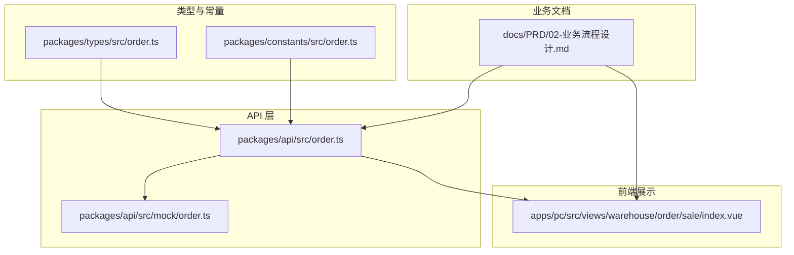
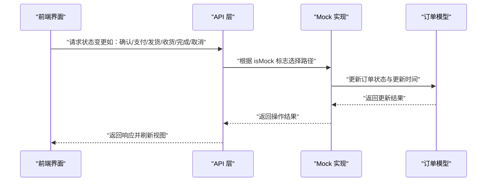
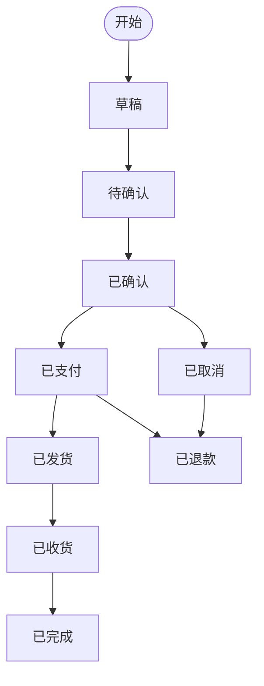
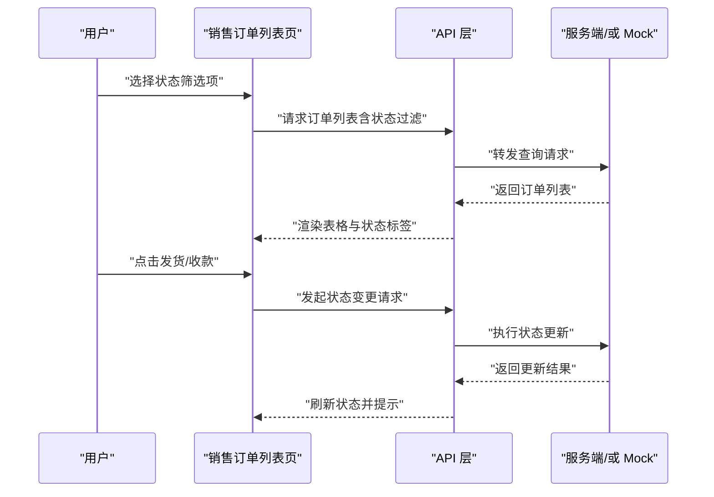
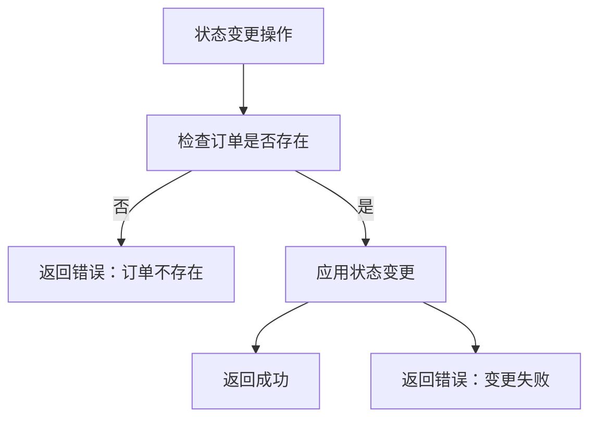
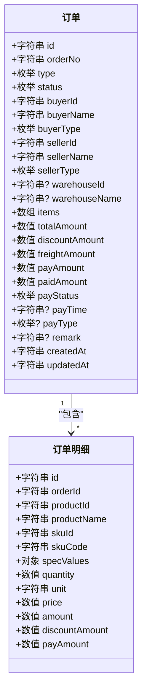
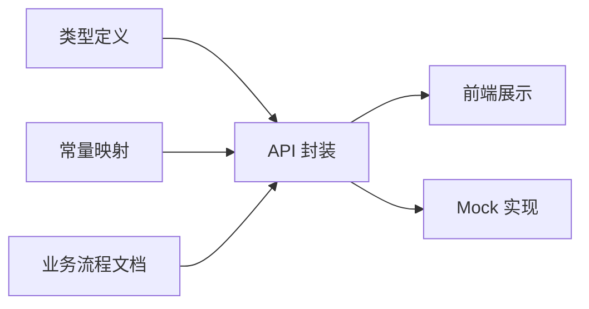

# 订单状态管理

<cite>
**本文引用的文件**
- [packages/types/src/order.ts](file://packages/types/src/order.ts)
- [packages/constants/src/order.ts](file://packages/constants/src/order.ts)
- [packages/api/src/order.ts](file://packages/api/src/order.ts)
- [packages/api/src/mock/order.ts](file://packages/api/src/mock/order.ts)
- [apps/pc/src/views/warehouse/order/sale/index.vue](file://apps/pc/src/views/warehouse/order/sale/index.vue)
- [apps/pc/src/views/merchant/list/index.vue](file://apps/pc/src/views/merchant/list/index.vue)
- [docs/PRD/02-业务流程设计.md](file://docs/PRD/02-业务流程设计.md)
</cite>

## 目录
1. [简介](#简介)
2. [项目结构](#项目结构)
3. [核心组件](#核心组件)
4. [架构总览](#架构总览)
5. [详细组件分析](#详细组件分析)
6. [依赖分析](#依赖分析)
7. [性能考虑](#性能考虑)
8. [故障排查指南](#故障排查指南)
9. [结论](#结论)
10. [附录](#附录)

## 简介
本文件围绕“订单状态管理”主题，系统化梳理工程仓订单的状态定义、状态机设计、状态流转规则、状态查询与更新、状态回滚与异常处理、以及监控与可观测性建议。文档以仓库端销售订单为例，结合类型定义、常量映射、API 封装与前端展示，形成从数据模型到业务流程的闭环说明。

## 项目结构
围绕订单状态管理的关键代码分布在以下模块：
- 类型与常量层：统一定义订单类型、订单状态、支付状态、支付方式等枚举与映射。
- API 层：封装订单查询、创建、状态变更（确认、支付、发货、收货、完成、取消）等接口；支持 Mock 模式与真实后端切换。
- 前端展示层：销售订单列表页按状态筛选与展示，并提供发货、收款等操作入口。
- 文档与流程：PRD 中对订单状态机、数据单据流转与业务规则进行说明。

图表来源
- [packages/types/src/order.ts:1-124](file://packages/types/src/order.ts#L1-L124)
- [packages/constants/src/order.ts:1-57](file://packages/constants/src/order.ts#L1-L57)
- [packages/api/src/order.ts:1-156](file://packages/api/src/order.ts#L1-L156)
- [packages/api/src/mock/order.ts:1-230](file://packages/api/src/mock/order.ts#L1-L230)
- [apps/pc/src/views/warehouse/order/sale/index.vue:1-183](file://apps/pc/src/views/warehouse/order/sale/index.vue#L1-L183)
- [docs/PRD/02-业务流程设计.md:309-398](file://docs/PRD/02-业务流程设计.md#L309-L398)

章节来源
- [packages/types/src/order.ts:1-124](file://packages/types/src/order.ts#L1-L124)
- [packages/constants/src/order.ts:1-57](file://packages/constants/src/order.ts#L1-L57)
- [packages/api/src/order.ts:1-156](file://packages/api/src/order.ts#L1-L156)
- [packages/api/src/mock/order.ts:1-230](file://packages/api/src/mock/order.ts#L1-L230)
- [apps/pc/src/views/warehouse/order/sale/index.vue:1-183](file://apps/pc/src/views/warehouse/order/sale/index.vue#L1-L183)
- [docs/PRD/02-业务流程设计.md:309-398](file://docs/PRD/02-业务流程设计.md#L309-L398)

## 核心组件
- 订单数据模型与枚举
  - 订单类型：采购、销售、调拨、退货。
  - 订单状态：草稿、待确认、已确认、已支付、已发货、已收货、已完成、已取消、已退款。
  - 支付状态：未支付、部分支付、已支付、退款中、已退款。
  - 支付方式：余额、银行转账、支付宝、微信。
- 常量映射与标签颜色
  - 订单状态与支付状态的标签文本与颜色映射，用于前端展示。
- API 封装
  - 列表查询、详情获取、创建、更新、状态变更（确认、支付、发货、收货、完成、取消）等。
  - 支持 Mock 模式与真实后端切换，便于开发联调。
- 前端展示
  - 销售订单列表页按状态筛选、展示状态标签、提供发货与收款入口。
- 业务流程与状态机
  - PRD 对订单状态机、数据单据流转、支付与发货解耦等规则进行了说明。

章节来源
- [packages/types/src/order.ts:46-78](file://packages/types/src/order.ts#L46-L78)
- [packages/types/src/order.ts:53-71](file://packages/types/src/order.ts#L53-L71)
- [packages/constants/src/order.ts:10-40](file://packages/constants/src/order.ts#L10-L40)
- [packages/api/src/order.ts:14-97](file://packages/api/src/order.ts#L14-L97)
- [apps/pc/src/views/warehouse/order/sale/index.vue:13-65](file://apps/pc/src/views/warehouse/order/sale/index.vue#L13-L65)
- [docs/PRD/02-业务流程设计.md:309-398](file://docs/PRD/02-业务流程设计.md#L309-L398)

## 架构总览
订单状态管理采用“类型定义—常量映射—API 封装—前端展示—业务规则”的分层架构。前端通过 API 层发起状态变更请求，后端根据业务规则执行状态更新；Mock 模式下直接更新内存中的订单集合，便于快速验证。

图表来源
- [packages/api/src/order.ts:12-12](file://packages/api/src/order.ts#L12-L12)
- [packages/api/src/order.ts:45-97](file://packages/api/src/order.ts#L45-L97)
- [packages/api/src/mock/order.ts:215-229](file://packages/api/src/mock/order.ts#L215-L229)

章节来源
- [packages/api/src/order.ts:12-12](file://packages/api/src/order.ts#L12-L12)
- [packages/api/src/order.ts:45-97](file://packages/api/src/order.ts#L45-L97)
- [packages/api/src/mock/order.ts:215-229](file://packages/api/src/mock/order.ts#L215-L229)

## 详细组件分析

### 订单状态机与业务规则
- 状态定义与含义
  - 草稿：订单刚创建，尚未进入业务流程。
  - 待确认：等待买方或卖方确认。
  - 已确认：双方确认，进入后续流程。
  - 已支付：完成支付，可能已发货或待发货。
  - 已发货：已生成发货单，物流在途。
  - 已收货：收货完成，进入验收阶段。
  - 已完成：满足最终完成条件（如全部支付+全部收货）。
  - 已取消：订单被取消，通常伴随退款。
  - 已退款：订单退款完成。
- 状态流转与触发条件
  - 确认：由卖方或系统触发，将状态从“待确认/草稿”推进至“已确认”。
  - 支付：完成支付后，订单进入“已支付”，可继续发货。
  - 发货：生成发货单后，订单进入“已发货”。
  - 收货：收货批次完成后，订单进入“已收货”，随后校验是否满足“已完成”。
  - 完成：当所有支付与收货完成时，订单标记为“已完成”。
  - 取消：订单在任意阶段可被取消，通常导致“已取消”并触发退款流程。
- 业务规则要点
  - 支付与发货解耦：供应商确认订单后即可发货，无需等待支付。
  - 支付状态仅在最终完成时校验，不影响中间流程。
  - 支持多次分批支付、分批发货、分批收货。
  - 所有操作均关联原始订单 ID，确保数据一致性。

图表来源
- [packages/types/src/order.ts:53-63](file://packages/types/src/order.ts#L53-L63)
- [packages/constants/src/order.ts:10-20](file://packages/constants/src/order.ts#L10-L20)
- [docs/PRD/02-业务流程设计.md:309-333](file://docs/PRD/02-业务流程设计.md#L309-L333)

章节来源
- [packages/types/src/order.ts:53-63](file://packages/types/src/order.ts#L53-L63)
- [packages/constants/src/order.ts:10-20](file://packages/constants/src/order.ts#L10-L20)
- [docs/PRD/02-业务流程设计.md:309-333](file://docs/PRD/02-业务流程设计.md#L309-L333)

### 订单状态查询与更新流程
- 查询
  - 列表查询支持关键词、状态、买方/卖方过滤，分页返回。
  - 详情查询支持按订单 ID 获取完整信息。
- 更新
  - 确认、支付、发货、收货、完成、取消等状态变更接口。
  - Mock 模式下直接更新内存中的订单集合，设置更新时间为当前时间。
- 前端交互
  - 销售订单列表页提供按状态筛选、状态标签展示、发货与收款入口。

图表来源
- [packages/api/src/order.ts:14-28](file://packages/api/src/order.ts#L14-L28)
- [packages/api/src/order.ts:45-97](file://packages/api/src/order.ts#L45-L97)
- [apps/pc/src/views/warehouse/order/sale/index.vue:13-65](file://apps/pc/src/views/warehouse/order/sale/index.vue#L13-L65)

章节来源
- [packages/api/src/order.ts:14-28](file://packages/api/src/order.ts#L14-L28)
- [packages/api/src/order.ts:45-97](file://packages/api/src/order.ts#L45-L97)
- [apps/pc/src/views/warehouse/order/sale/index.vue:13-65](file://apps/pc/src/views/warehouse/order/sale/index.vue#L13-L65)

### 状态回滚与异常处理
- 回滚策略
  - 当前 API 层未提供显式的“状态回退”接口；取消与退款通过专用接口实现。
  - 若需回滚，可在服务端实现幂等的“状态变更撤销”机制，或通过审计日志追踪并人工干预。
- 异常处理
  - Mock 模式下若订单不存在或状态更新失败，会抛出错误并返回给调用方。
  - 建议在前端捕获错误并提示，同时记录日志以便排查。

图表来源
- [packages/api/src/order.ts:21-28](file://packages/api/src/order.ts#L21-L28)
- [packages/api/src/order.ts:45-61](file://packages/api/src/order.ts#L45-L61)
- [packages/api/src/mock/order.ts:215-229](file://packages/api/src/mock/order.ts#L215-L229)

章节来源
- [packages/api/src/order.ts:21-28](file://packages/api/src/order.ts#L21-L28)
- [packages/api/src/order.ts:45-61](file://packages/api/src/order.ts#L45-L61)
- [packages/api/src/mock/order.ts:215-229](file://packages/api/src/mock/order.ts#L215-L229)

### 数据模型与状态映射
- 订单模型字段
  - 包含订单号、类型、状态、买卖方信息、仓库信息、明细、金额、支付状态、支付方式、备注、创建/更新时间等。
- 状态与支付状态映射
  - 订单状态与支付状态分别提供标签与颜色映射，用于前端直观展示。

图表来源
- [packages/types/src/order.ts:3-44](file://packages/types/src/order.ts#L3-L44)

章节来源
- [packages/types/src/order.ts:3-44](file://packages/types/src/order.ts#L3-L44)
- [packages/constants/src/order.ts:22-40](file://packages/constants/src/order.ts#L22-L40)

## 依赖分析
- 组件耦合
  - API 层依赖类型与常量层提供的枚举与映射。
  - 前端展示层依赖 API 层提供的接口与状态映射。
  - 业务流程文档指导状态机设计与数据单据流转。
- 外部依赖
  - Mock 模式用于开发联调，避免强依赖真实后端。
- 潜在风险
  - 若未实现“状态回滚”接口，需在服务端补充幂等撤销能力。
  - 前端应增强错误提示与重试机制，提升用户体验。

图表来源
- [packages/types/src/order.ts:1-124](file://packages/types/src/order.ts#L1-L124)
- [packages/constants/src/order.ts:1-57](file://packages/constants/src/order.ts#L1-L57)
- [packages/api/src/order.ts:1-156](file://packages/api/src/order.ts#L1-L156)
- [apps/pc/src/views/warehouse/order/sale/index.vue:1-183](file://apps/pc/src/views/warehouse/order/sale/index.vue#L1-L183)
- [docs/PRD/02-业务流程设计.md:309-398](file://docs/PRD/02-业务流程设计.md#L309-L398)

章节来源
- [packages/types/src/order.ts:1-124](file://packages/types/src/order.ts#L1-L124)
- [packages/constants/src/order.ts:1-57](file://packages/constants/src/order.ts#L1-L57)
- [packages/api/src/order.ts:1-156](file://packages/api/src/order.ts#L1-L156)
- [apps/pc/src/views/warehouse/order/sale/index.vue:1-183](file://apps/pc/src/views/warehouse/order/sale/index.vue#L1-L183)
- [docs/PRD/02-业务流程设计.md:309-398](file://docs/PRD/02-业务流程设计.md#L309-L398)

## 性能考虑
- 列表查询优化
  - 前端分页加载，减少一次性传输数据量。
  - 后端实现索引与过滤字段优化，避免全表扫描。
- 状态变更幂等
  - 服务端对重复请求进行去重与幂等校验，避免重复更新。
- Mock 模式限制
  - 开发阶段使用内存数据，上线需替换为真实数据库与缓存策略。

## 故障排查指南
- 常见问题
  - 订单不存在：详情查询返回错误，需检查订单 ID 或权限。
  - 状态更新失败：确认订单状态是否允许变更，或是否存在并发冲突。
  - 取消/退款异常：检查取消原因与退款流程是否正确执行。
- 建议措施
  - 前端捕获错误并提示，记录操作日志与参数。
  - 服务端增加审计日志，记录每次状态变更的时间、操作人与原因。
  - 对关键状态变更增加前置校验与事务保证。

章节来源
- [packages/api/src/order.ts:21-28](file://packages/api/src/order.ts#L21-L28)
- [packages/api/src/order.ts:45-61](file://packages/api/src/order.ts#L45-L61)
- [packages/api/src/mock/order.ts:215-229](file://packages/api/src/mock/order.ts#L215-L229)

## 结论
本方案通过清晰的类型定义、完善的常量映射、可扩展的 API 封装与直观的前端展示，构建了完整的订单状态管理体系。结合 PRD 的业务规则与状态机设计，实现了支付与发货解耦、支持多次分批操作，并提供了 Mock 模式下的高效开发体验。建议后续完善状态回滚与审计能力，进一步提升系统的可靠性与可观测性。

## 附录
- 相关文件路径
  - [packages/types/src/order.ts](file://packages/types/src/order.ts)
  - [packages/constants/src/order.ts](file://packages/constants/src/order.ts)
  - [packages/api/src/order.ts](file://packages/api/src/order.ts)
  - [packages/api/src/mock/order.ts](file://packages/api/src/mock/order.ts)
  - [apps/pc/src/views/warehouse/order/sale/index.vue](file://apps/pc/src/views/warehouse/order/sale/index.vue)
  - [apps/pc/src/views/merchant/list/index.vue](file://apps/pc/src/views/merchant/list/index.vue)
  - [docs/PRD/02-业务流程设计.md](file://docs/PRD/02-业务流程设计.md)