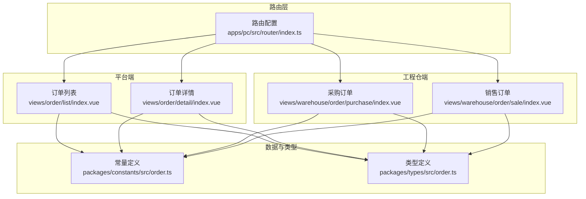
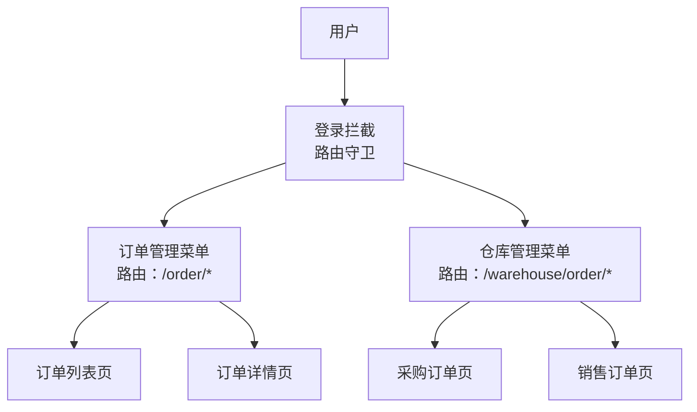
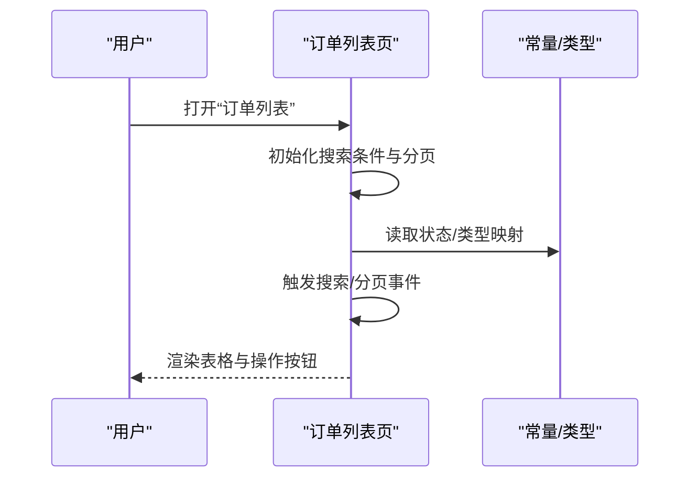
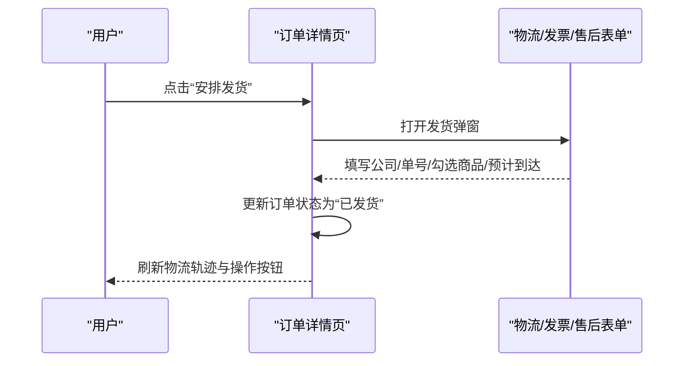
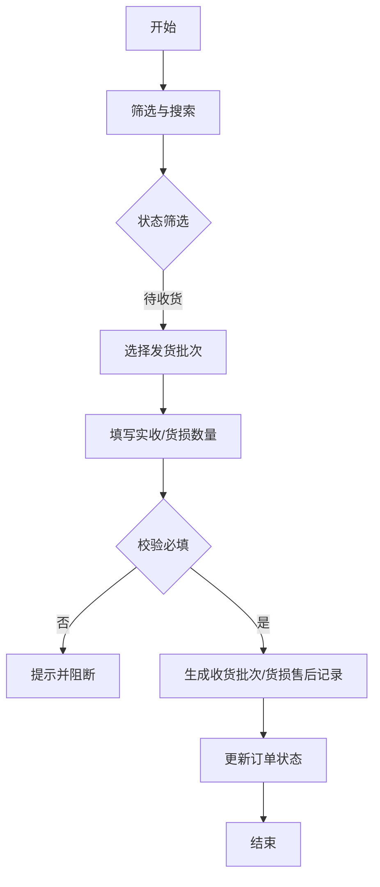
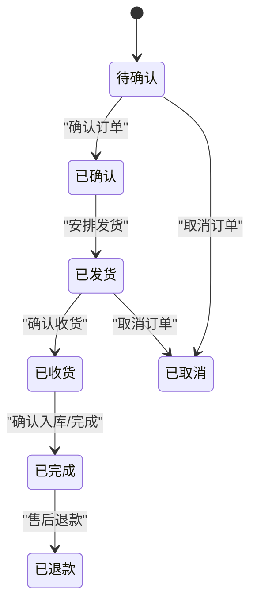
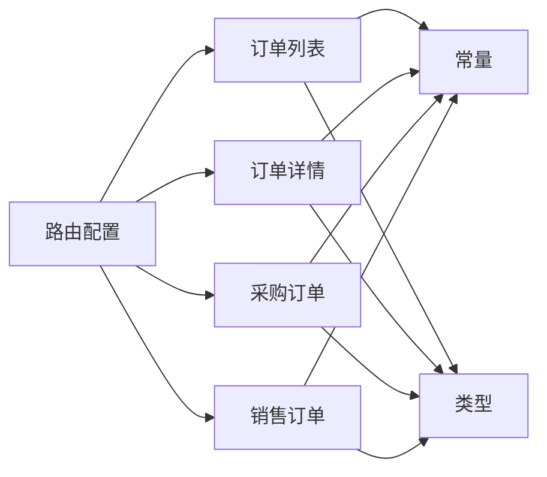

# 订单管理系统

<cite>
**本文引用的文件**
- [apps/pc/src/router/index.ts](file://apps/pc/src/router/index.ts)
- [apps/pc/src/views/order/list/index.vue](file://apps/pc/src/views/order/list/index.vue)
- [apps/pc/src/views/order/detail/index.vue](file://apps/pc/src/views/order/detail/index.vue)
- [apps/pc/src/views/warehouse/order/purchase/index.vue](file://apps/pc/src/views/warehouse/order/purchase/index.vue)
- [apps/pc/src/views/warehouse/order/sale/index.vue](file://apps/pc/src/views/warehouse/order/sale/index.vue)
- [packages/constants/src/order.ts](file://packages/constants/src/order.ts)
- [packages/types/src/order.ts](file://packages/types/src/order.ts)
</cite>

## 目录
1. [引言](#引言)
2. [项目结构](#项目结构)
3. [核心组件](#核心组件)
4. [架构总览](#架构总览)
5. [详细组件分析](#详细组件分析)
6. [依赖关系分析](#依赖关系分析)
7. [性能考虑](#性能考虑)
8. [故障排查指南](#故障排查指南)
9. [结论](#结论)
10. [附录](#附录)

## 引言
本文件面向“订单管理系统”的采购与销售订单管理，围绕以下目标展开：  
- 采购订单管理：创建、列表、详情、状态流转  
- 销售订单管理：创建、列表、详情、状态流转  
- 订单状态管理：状态机、流转图、状态变更、历史记录  
- 权限控制与异常处理  
- 提供状态流转示例与最佳实践  

系统采用多端布局（平台端、供应商端、工程仓端），本文聚焦工程仓端的订单管理能力，并结合平台端统一的路由与常量/类型定义，形成完整的业务闭环。

## 项目结构
- 路由集中于 PC 端，覆盖“订单管理”主菜单下的“订单列表”“订单详情”“采购订单”“销售订单”等页面
- 工程仓端在“仓库管理”下提供“采购订单”“销售订单”及其“详情”页面
- 订单状态、支付状态、类型等通过常量与类型定义统一管理
- 订单数据模型在类型定义中明确字段与枚举值

图表来源
- [apps/pc/src/router/index.ts:205-235](file://apps/pc/src/router/index.ts#L205-L235)
- [apps/pc/src/views/order/list/index.vue:1-197](file://apps/pc/src/views/order/list/index.vue#L1-L197)
- [apps/pc/src/views/order/detail/index.vue:1-1297](file://apps/pc/src/views/order/detail/index.vue#L1-L1297)
- [apps/pc/src/views/warehouse/order/purchase/index.vue:1-815](file://apps/pc/src/views/warehouse/order/purchase/index.vue#L1-L815)
- [apps/pc/src/views/warehouse/order/sale/index.vue:1-183](file://apps/pc/src/views/warehouse/order/sale/index.vue#L1-L183)
- [packages/constants/src/order.ts:1-57](file://packages/constants/src/order.ts#L1-L57)
- [packages/types/src/order.ts:1-124](file://packages/types/src/order.ts#L1-L124)

章节来源
- [apps/pc/src/router/index.ts:205-235](file://apps/pc/src/router/index.ts#L205-L235)
- [packages/constants/src/order.ts:1-57](file://packages/constants/src/order.ts#L1-L57)
- [packages/types/src/order.ts:1-124](file://packages/types/src/order.ts#L1-L124)

## 核心组件
- 订单列表页：支持按关键字、类型、状态筛选；支持分页；提供“查看”“确认”“发货”等操作入口
- 订单详情页：展示订单基础信息、买卖双方信息、商品明细、金额汇总、分账信息、物流信息、发票信息、验收入库、售后记录、操作日志；根据状态提供“确认订单”“安排发货”“确认收货/入库”“确认完成”“申请开票/售后”“取消订单”等按钮
- 采购订单页（工程仓端）：支持按来源、供应商、支付状态筛选；提供“立即支付”“收货”等操作；支持按发货批次收货与货损处理
- 销售订单页（工程仓端）：展示待发货/发货中/已完成/已取消等状态；支持“发货”“收款”等操作
- 常量与类型：统一定义订单类型、状态、支付状态、状态映射、支付方式等

章节来源
- [apps/pc/src/views/order/list/index.vue:1-197](file://apps/pc/src/views/order/list/index.vue#L1-L197)
- [apps/pc/src/views/order/detail/index.vue:1-1297](file://apps/pc/src/views/order/detail/index.vue#L1-L1297)
- [apps/pc/src/views/warehouse/order/purchase/index.vue:1-815](file://apps/pc/src/views/warehouse/order/purchase/index.vue#L1-L815)
- [apps/pc/src/views/warehouse/order/sale/index.vue:1-183](file://apps/pc/src/views/warehouse/order/sale/index.vue#L1-L183)
- [packages/constants/src/order.ts:1-57](file://packages/constants/src/order.ts#L1-L57)
- [packages/types/src/order.ts:1-124](file://packages/types/src/order.ts#L1-L124)

## 架构总览
系统采用前端路由驱动的单页应用架构，订单管理功能通过统一的路由注册到“订单管理”菜单下，工程仓端在“仓库管理”下提供更细粒度的采购/销售订单入口。状态与类型通过常量与类型定义集中管理，确保各页面行为一致。

图表来源
- [apps/pc/src/router/index.ts:776-787](file://apps/pc/src/router/index.ts#L776-L787)
- [apps/pc/src/router/index.ts:205-235](file://apps/pc/src/router/index.ts#L205-L235)
- [apps/pc/src/router/index.ts:672-708](file://apps/pc/src/router/index.ts#L672-L708)

## 详细组件分析

### 订单列表页（平台端）
- 功能要点
  - 支持按订单号、类型、状态、时间范围搜索
  - 列表展示订单号、类型、买方/卖方、金额、支付状态、订单状态、创建时间
  - 操作列提供“查看”“确认”“发货”等按钮，依据状态动态显示
- 数据模型
  - 使用统一的订单类型与状态映射常量，保证界面标签与逻辑一致
- 权限与异常
  - 路由守卫校验登录态；列表页加载时模拟异步请求，失败场景需补充错误提示与重试机制

图表来源
- [apps/pc/src/views/order/list/index.vue:85-197](file://apps/pc/src/views/order/list/index.vue#L85-L197)
- [packages/constants/src/order.ts:10-40](file://packages/constants/src/order.ts#L10-L40)

章节来源
- [apps/pc/src/views/order/list/index.vue:1-197](file://apps/pc/src/views/order/list/index.vue#L1-L197)
- [packages/constants/src/order.ts:1-57](file://packages/constants/src/order.ts#L1-L57)

### 订单详情页（平台端）
- 功能要点
  - 展示订单基础信息、买卖双方信息、商品明细、金额汇总
  - 分账信息（销售订单）、物流信息、发票信息、验收入库（采购订单）、售后记录、操作日志
  - 按状态提供“确认订单”“安排发货”“确认收货/入库”“确认完成”“申请开票/售后”“取消订单”等按钮
- 状态流转
  - 通过按钮触发状态变更与日志追加，如“确认订单”“安排发货”“确认收货/入库”“确认完成”“取消订单”
- 物流与发票
  - 支持查询物流轨迹、填写物流单号、选择发货商品；支持申请开票、下载发票
- 售后
  - 支持申请售后（退货退款/仅退款/换货），填写原因、金额、凭证等

图表来源
- [apps/pc/src/views/order/detail/index.vue:523-618](file://apps/pc/src/views/order/detail/index.vue#L523-L618)
- [apps/pc/src/views/order/detail/index.vue:955-1018](file://apps/pc/src/views/order/detail/index.vue#L955-L1018)

章节来源
- [apps/pc/src/views/order/detail/index.vue:1-1297](file://apps/pc/src/views/order/detail/index.vue#L1-L1297)

### 采购订单页（工程仓端）
- 功能要点
  - 支持按来源（购物车/商品市场/采购计划）、供应商、支付状态筛选
  - 列表展示订单编号、来源、供应商、商品信息、金额、支付状态、订单状态、时间
  - 操作列提供“详情”“取消订单”“立即支付”“收货”等
- 支付与收货
  - “立即支付”弹窗支持输入支付金额、上传凭证、备注；支持部分/全部支付
  - “收货”流程支持选择发货批次、填写实收/货损数量、生成收货批次、可选货损售后记录
- 最佳实践
  - 收货前校验必填项（至少一个 SKU 的收货数量）
  - 全部收货且已支付则更新为“已完成”

图表来源
- [apps/pc/src/views/warehouse/order/purchase/index.vue:459-480](file://apps/pc/src/views/warehouse/order/purchase/index.vue#L459-L480)
- [apps/pc/src/views/warehouse/order/purchase/index.vue:623-748](file://apps/pc/src/views/warehouse/order/purchase/index.vue#L623-L748)

章节来源
- [apps/pc/src/views/warehouse/order/purchase/index.vue:1-815](file://apps/pc/src/views/warehouse/order/purchase/index.vue#L1-L815)

### 销售订单页（工程仓端）
- 功能要点
  - 展示待发货/发货中/已完成/已取消等状态
  - 操作列提供“详情”“发货”“收款”等
- 最佳实践
  - 发货前确保物流信息完整；收款前检查支付状态

章节来源
- [apps/pc/src/views/warehouse/order/sale/index.vue:1-183](file://apps/pc/src/views/warehouse/order/sale/index.vue#L1-L183)

### 订单状态管理（状态机与映射）
- 订单类型
  - 采购、销售、调拨、退货
- 订单状态
  - 草稿、待确认、已确认、已支付、已发货、已收货、已完成、已取消、已退款
- 支付状态
  - 未支付、部分支付、已支付、退款中、已退款
- 状态映射
  - 通过常量定义状态标签与颜色，用于列表与详情页的可视化展示

图表来源
- [packages/constants/src/order.ts:10-40](file://packages/constants/src/order.ts#L10-L40)
- [packages/types/src/order.ts:53-78](file://packages/types/src/order.ts#L53-L78)

章节来源
- [packages/constants/src/order.ts:1-57](file://packages/constants/src/order.ts#L1-L57)
- [packages/types/src/order.ts:1-124](file://packages/types/src/order.ts#L1-L124)

## 依赖关系分析
- 路由依赖
  - 订单管理与仓库管理路由均位于 PC 端路由配置中，分别指向平台端与工程仓端页面
- 页面依赖
  - 订单列表/详情依赖常量与类型进行状态/类型渲染与逻辑判断
  - 采购/销售订单页依赖各自的状态映射与业务操作逻辑
- 组件耦合
  - 页面内组件化程度高，状态与交互集中在组件内部，便于维护与扩展

图表来源
- [apps/pc/src/router/index.ts:205-235](file://apps/pc/src/router/index.ts#L205-L235)
- [apps/pc/src/router/index.ts:672-708](file://apps/pc/src/router/index.ts#L672-L708)
- [packages/constants/src/order.ts:1-57](file://packages/constants/src/order.ts#L1-L57)
- [packages/types/src/order.ts:1-124](file://packages/types/src/order.ts#L1-L124)

章节来源
- [apps/pc/src/router/index.ts:1-790](file://apps/pc/src/router/index.ts#L1-L790)
- [packages/constants/src/order.ts:1-57](file://packages/constants/src/order.ts#L1-L57)
- [packages/types/src/order.ts:1-124](file://packages/types/src/order.ts#L1-L124)

## 性能考虑
- 列表分页与虚拟滚动：在订单量增长时，建议启用分页或虚拟滚动以降低 DOM 压力
- 图片懒加载：商品图片建议开启懒加载，减少首屏资源占用
- 状态缓存：对状态映射与枚举进行内存缓存，避免重复计算
- 表单校验前置：在弹窗提交前进行必填项与数值范围校验，减少无效请求
- 日志与轨迹：物流轨迹与操作日志按需加载，避免一次性渲染过多节点

## 故障排查指南
- 登录态缺失
  - 现象：访问订单页被重定向至登录页
  - 处理：检查本地 Token 是否存在；若不存在，引导重新登录
- 状态按钮不可用
  - 现象：某些状态下按钮不显示或不可点击
  - 处理：确认当前订单状态是否符合操作前提；检查状态映射与条件渲染逻辑
- 发货/收货失败
  - 现象：物流单号为空、勾选商品为空导致提交失败
  - 处理：在提交前进行非空校验与提示；确保必填项完整
- 支付异常
  - 现象：支付金额超过待付或小于最小值
  - 处理：限制输入范围与最大值；提示用户正确填写金额
- 售后申请失败
  - 现象：售后类型未选择或退款金额非法
  - 处理：完善表单校验与必填提示

章节来源
- [apps/pc/src/router/index.ts:776-787](file://apps/pc/src/router/index.ts#L776-L787)
- [apps/pc/src/views/order/detail/index.vue:969-993](file://apps/pc/src/views/order/detail/index.vue#L969-L993)
- [apps/pc/src/views/warehouse/order/purchase/index.vue:583-595](file://apps/pc/src/views/warehouse/order/purchase/index.vue#L583-L595)
- [apps/pc/src/views/warehouse/order/purchase/index.vue:692-748](file://apps/pc/src/views/warehouse/order/purchase/index.vue#L692-L748)

## 结论
本系统通过统一的路由、常量与类型定义，实现了跨端一致的订单管理体验。平台端与工程仓端分别承担“全局订单视图”与“具体业务操作”，配合完善的订单状态机与状态映射，满足采购与销售订单的全生命周期管理。建议在后续迭代中进一步增强接口层与数据持久化能力，完善异常与回滚机制，提升系统的稳定性与可观测性。

## 附录
- 订单状态流转示例（销售订单）
  - 待确认 → 已确认 → 已发货 → 已收货 → 已完成
  - 关键节点：确认订单、安排发货、确认收货、确认完成
- 订单状态流转示例（采购订单）
  - 待确认 → 已确认 → 已支付 → 已发货 → 待收货 → 已入库 → 已完成
  - 关键节点：立即支付、选择发货批次、收货/货损处理、确认入库
- 最佳实践
  - 明确状态边界与前置条件，避免跨状态操作
  - 对关键操作（发货、收货、支付、售后）增加二次确认
  - 保持操作日志完整，便于审计与问题追溯
  - 对弹窗表单进行严格的前端校验与后端校验双保险