# 采购订单管理

<cite>
**本文档引用的文件**
- [apps/pc/src/views/warehouse/order/purchase/create.vue](file://apps/pc/src/views/warehouse/order/purchase/create.vue)
- [apps/pc/src/views/warehouse/order/purchase/index.vue](file://apps/pc/src/views/warehouse/order/purchase/index.vue)
- [apps/pc/src/views/warehouse/order/purchase/detail.vue](file://apps/pc/src/views/warehouse/order/purchase/detail.vue)
- [apps/pc/src/views/warehouse/order/purchase/detail.vue](file://apps/pc/src/views/warehouse/order/purchase/detail.vue)
- [apps/mp/src/pages/order/create.vue](file://apps/mp/src/pages/order/create.vue)
- [apps/mp/src/pages/order/detail.vue](file://apps/mp/src/pages/order/detail.vue)
- [apps/mp/src/pages/order/index.vue](file://apps/mp/src/pages/order/index.vue)
- [packages/api/src/mock/order.ts](file://packages/api/src/mock/order.ts)
- [packages/api/src/order.ts](file://packages/api/src/order.ts)
- [packages/types/src/order.ts](file://packages/types/src/order.ts)
</cite>

## 目录
1. [简介](#简介)
2. [项目结构](#项目结构)
3. [核心组件](#核心组件)
4. [架构概览](#架构概览)
5. [详细组件分析](#详细组件分析)
6. [依赖分析](#依赖分析)
7. [性能考虑](#性能考虑)
8. [故障排除指南](#故障排除指南)
9. [结论](#结论)
10. [附录](#附录)

## 简介

采购订单管理是工程仓管理系统的核心功能模块，负责管理从采购订单创建、审批、执行到收货入库的完整业务流程。本系统采用前后端分离架构，支持PC端和移动端双端操作，提供完整的采购订单生命周期管理。

系统主要功能包括：
- 采购订单创建和编辑
- 订单状态管理和流转控制
- 商品选择和价格计算
- 支付管理和财务对账
- 发货和收货流程管理
- 库存管理和批次追溯
- 售后服务和货损处理

## 项目结构

工程仓采购订单管理采用多端架构设计，主要包含以下核心目录：

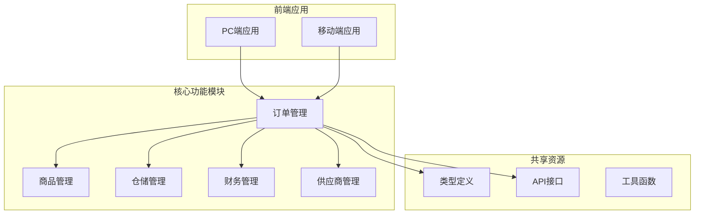

**图表来源**
- [apps/pc/src/views/warehouse/order/purchase/create.vue](file://apps/pc/src/views/warehouse/order/purchase/create.vue)
- [apps/pc/src/views/warehouse/order/purchase/index.vue](file://apps/pc/src/views/warehouse/order/purchase/index.vue)
- [apps/pc/src/views/warehouse/order/purchase/detail.vue](file://apps/pc/src/views/warehouse/order/purchase/detail.vue)

**章节来源**
- [apps/pc/src/views/warehouse/order/purchase/create.vue:1-468](file://apps/pc/src/views/warehouse/order/purchase/create.vue#L1-L468)
- [apps/pc/src/views/warehouse/order/purchase/index.vue:1-815](file://apps/pc/src/views/warehouse/order/purchase/index.vue#L1-L815)
- [apps/pc/src/views/warehouse/order/purchase/detail.vue:1-1497](file://apps/pc/src/views/warehouse/order/purchase/detail.vue#L1-L1497)

## 核心组件

### 订单管理组件

系统的核心组件围绕采购订单的完整生命周期构建，主要包括以下三个关键页面：

#### 1. 订单创建组件 (Purchase Create)
负责采购订单的创建和初始化，支持商品选择、数量设置和订单信息填写。

#### 2. 订单列表组件 (Purchase List)
提供采购订单的查询、筛选和批量操作功能，支持多种状态的订单管理。

#### 3. 订单详情组件 (Purchase Detail)
展示订单的详细信息，包括商品明细、物流跟踪、收货入库和支付记录等。

### 移动端适配组件

移动端提供简化版的订单管理功能，针对移动设备的交互特点进行了优化：

#### 1. 订单创建页 (Mobile Order Create)
移动端订单创建界面，支持地址选择、供应商分组和备注输入。

#### 2. 订单详情页 (Mobile Order Detail)
移动端订单详情展示，提供简洁的状态信息和操作按钮。

#### 3. 订单列表页 (Mobile Order Index)
移动端订单列表，支持标签切换和状态筛选。

**章节来源**
- [apps/mp/src/pages/order/create.vue:1-680](file://apps/mp/src/pages/order/create.vue#L1-L680)
- [apps/mp/src/pages/order/detail.vue:1-567](file://apps/mp/src/pages/order/detail.vue#L1-L567)
- [apps/mp/src/pages/order/index.vue:1-846](file://apps/mp/src/pages/order/index.vue#L1-L846)

## 架构概览

系统采用分层架构设计，确保各组件间的松耦合和高内聚：

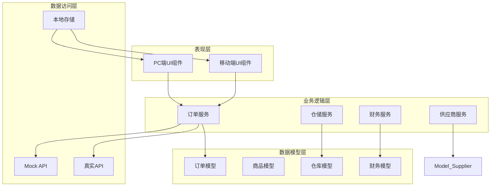

**图表来源**
- [packages/api/src/mock/order.ts:1-44](file://packages/api/src/mock/order.ts#L1-L44)
- [packages/api/src/order.ts:90-155](file://packages/api/src/order.ts#L90-L155)
- [packages/types/src/order.ts](file://packages/types/src/order.ts)

## 详细组件分析

### 订单创建流程组件

#### 组件架构设计

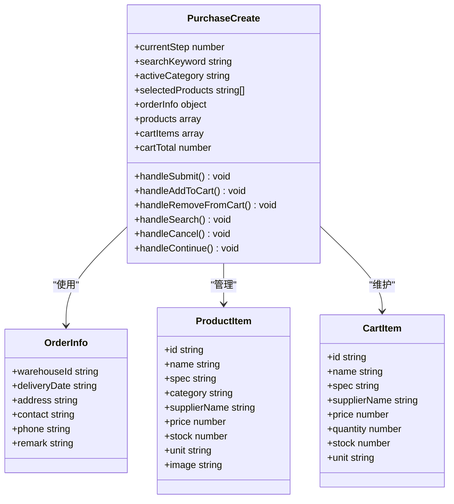

**图表来源**
- [apps/pc/src/views/warehouse/order/purchase/create.vue:211-322](file://apps/pc/src/views/warehouse/order/purchase/create.vue#L211-L322)

#### 表单字段说明

| 字段名称 | 类型 | 必填 | 描述 | 验证规则 |
|---------|------|------|------|----------|
| 仓库ID | string | 是 | 收货仓库标识 | 非空校验 |
| 期望交货日期 | date | 是 | 订单期望到货时间 | 日期有效性 |
| 收货地址 | string | 是 | 详细收货地址 | 长度限制(200字符) |
| 联系人 | string | 是 | 收货联系人姓名 | 长度限制(50字符) |
| 联系电话 | string | 是 | 收货联系人电话 | 格式验证 |
| 订单备注 | string | 否 | 订单特殊说明 | 长度限制(500字符) |

#### 验证规则实现

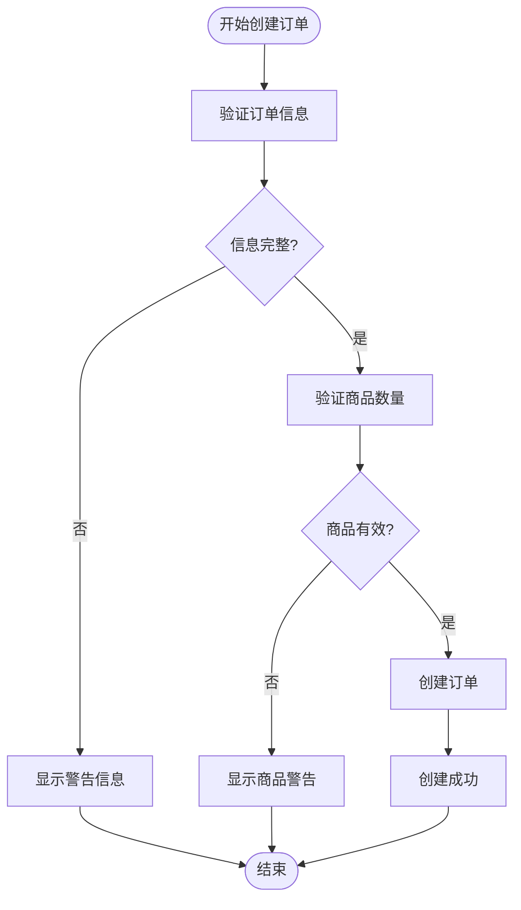

**图表来源**
- [apps/pc/src/views/warehouse/order/purchase/create.vue:296-310](file://apps/pc/src/views/warehouse/order/purchase/create.vue#L296-L310)

**章节来源**
- [apps/pc/src/views/warehouse/order/purchase/create.vue:1-468](file://apps/pc/src/views/warehouse/order/purchase/create.vue#L1-L468)

### 订单列表管理组件

#### 订单状态管理

系统支持完整的订单状态流转，每个状态都有明确的业务含义和操作权限：

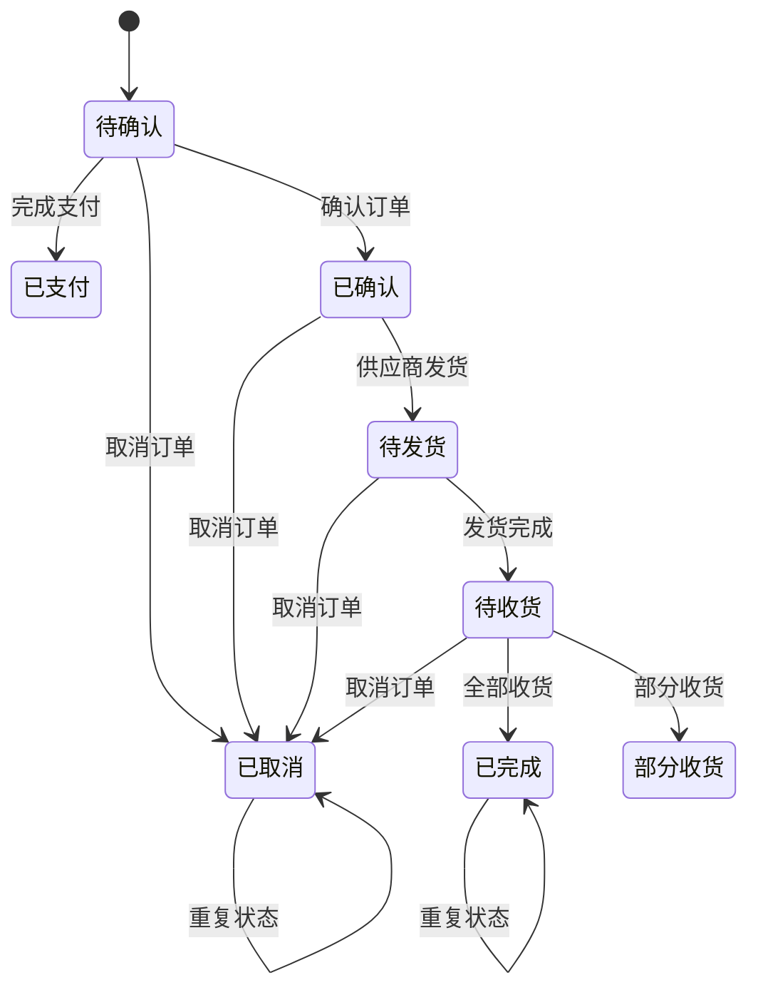

**图表来源**
- [apps/pc/src/views/warehouse/order/purchase/index.vue:530-540](file://apps/pc/src/views/warehouse/order/purchase/index.vue#L530-L540)

#### 支付状态管理

支付状态与订单状态相互独立，支持灵活的支付策略：

| 支付状态 | 描述 | 订单状态影响 | 操作权限 |
|---------|------|-------------|----------|
| 未支付 | 等待支付 | 待确认/待支付 | 仅支付操作 |
| 部分支付 | 已支付部分金额 | 待发货/待收货 | 继续支付 |
| 已支付 | 全额支付完成 | 已完成 | 查看详情 |

**章节来源**
- [apps/pc/src/views/warehouse/order/purchase/index.vue:1-815](file://apps/pc/src/views/warehouse/order/purchase/index.vue#L1-L815)

### 订单详情展示组件

#### 数据模型设计

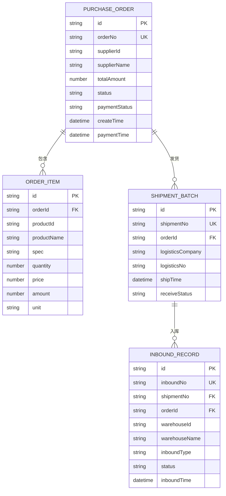

**图表来源**
- [packages/types/src/order.ts](file://packages/types/src/order.ts)

#### 批次追溯功能

系统提供完整的批次追溯能力，支持从订单到入库的全流程追踪：

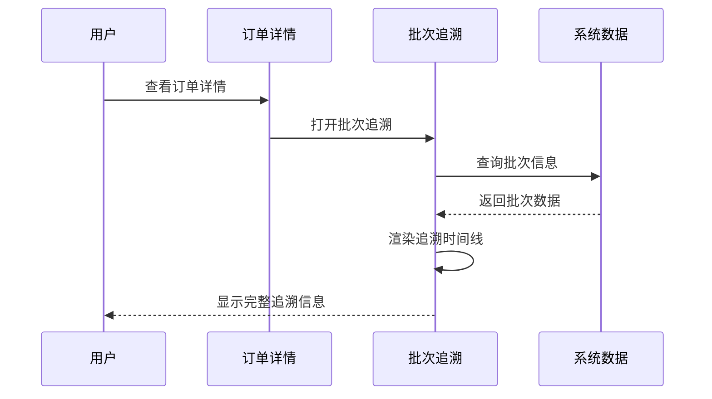

**图表来源**
- [apps/pc/src/views/warehouse/order/purchase/detail.vue:282-378](file://apps/pc/src/views/warehouse/order/purchase/detail.vue#L282-L378)

**章节来源**
- [apps/pc/src/views/warehouse/order/purchase/detail.vue:1-1497](file://apps/pc/src/views/warehouse/order/purchase/detail.vue#L1-L1497)

### 移动端订单管理

#### 移动端交互优化

移动端采用简洁的设计理念，针对触摸操作进行专门优化：

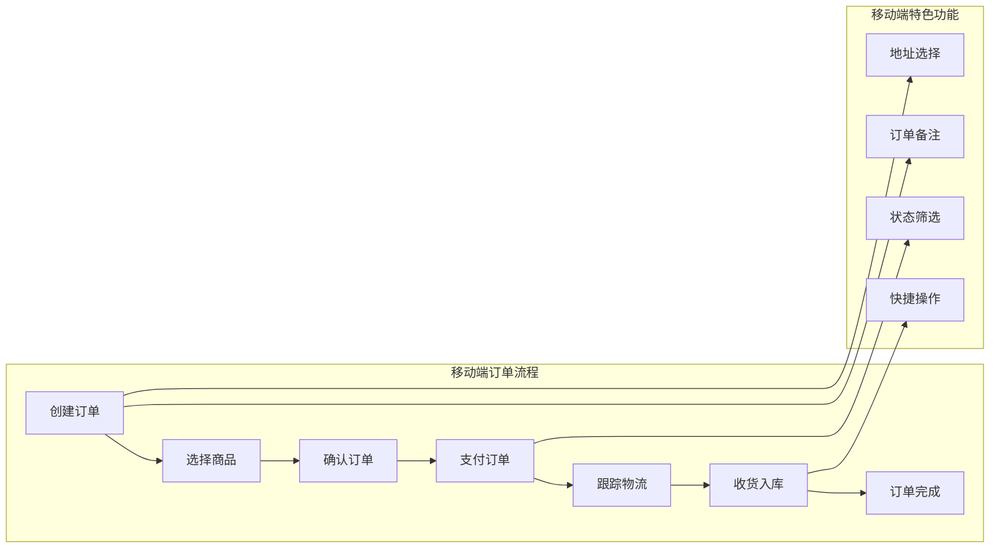

**图表来源**
- [apps/mp/src/pages/order/create.vue:1-680](file://apps/mp/src/pages/order/create.vue#L1-L680)

**章节来源**
- [apps/mp/src/pages/order/create.vue:1-680](file://apps/mp/src/pages/order/create.vue#L1-L680)
- [apps/mp/src/pages/order/detail.vue:1-567](file://apps/mp/src/pages/order/detail.vue#L1-L567)
- [apps/mp/src/pages/order/index.vue:1-846](file://apps/mp/src/pages/order/index.vue#L1-L846)

## 依赖分析

### 外部依赖关系

系统依赖的关键外部库和框架：

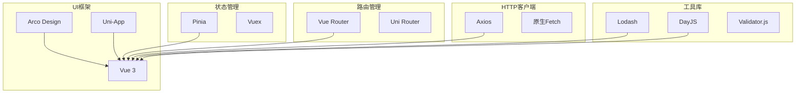

### 内部模块依赖

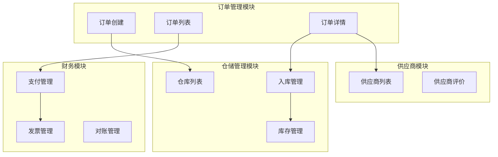

**图表来源**
- [packages/api/src/order.ts:90-155](file://packages/api/src/order.ts#L90-L155)
- [packages/api/src/mock/order.ts:1-44](file://packages/api/src/mock/order.ts#L1-L44)

**章节来源**
- [packages/api/src/order.ts:90-155](file://packages/api/src/order.ts#L90-L155)
- [packages/api/src/mock/order.ts:1-44](file://packages/api/src/mock/order.ts#L1-L44)

## 性能考虑

### 前端性能优化

系统在前端层面采用了多项性能优化策略：

1. **组件懒加载**：订单相关组件采用动态导入，减少初始加载时间
2. **虚拟滚动**：订单列表使用虚拟滚动技术，提升大数据量下的渲染性能
3. **缓存策略**：合理使用浏览器缓存和内存缓存，减少重复请求
4. **图片优化**：采用响应式图片和懒加载，降低网络传输压力

### 后端性能优化

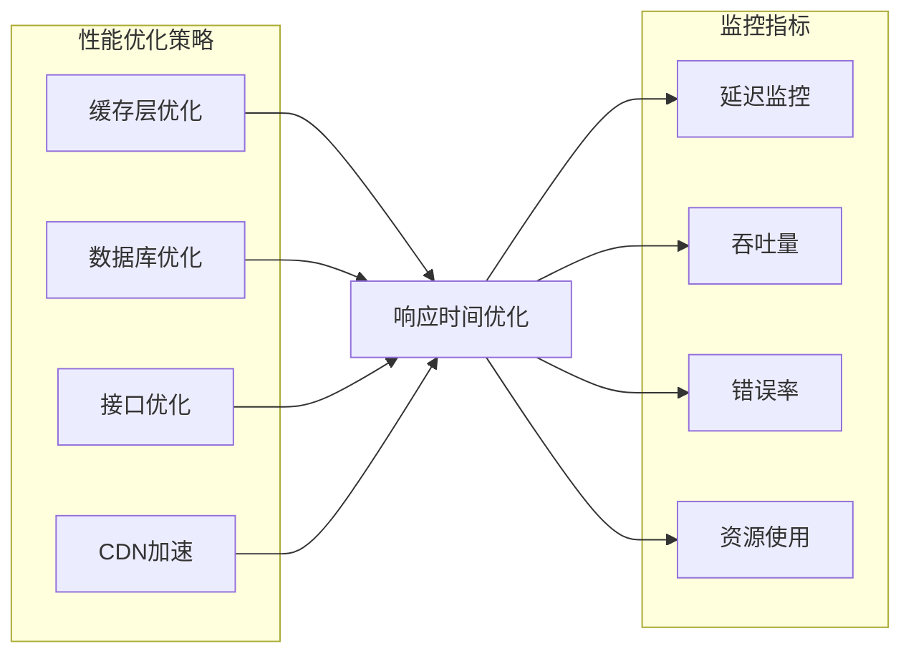

### 数据库优化建议

1. **索引优化**：为常用查询字段建立合适的数据库索引
2. **分页查询**：大列表采用分页查询，避免一次性加载过多数据
3. **连接池配置**：合理配置数据库连接池参数，提升并发处理能力
4. **查询优化**：使用EXPLAIN分析慢查询，优化SQL语句

## 故障排除指南

### 常见问题及解决方案

#### 1. 订单创建失败

**问题现象**：用户提交订单时出现错误提示

**可能原因**：
- 商品库存不足
- 订单信息填写不完整
- 网络连接异常
- 服务器超时

**解决步骤**：
1. 检查商品库存是否充足
2. 验证必填字段是否完整
3. 确认网络连接状态
4. 查看服务器日志获取详细错误信息

#### 2. 订单状态更新异常

**问题现象**：订单状态无法正常更新

**排查方法**：
1. 检查状态转换规则是否正确
2. 验证权限控制逻辑
3. 确认事务处理是否完整
4. 查看状态机日志

#### 3. 支付处理问题

**问题现象**：支付完成后订单状态未更新

**处理方案**：
1. 检查支付回调接口
2. 验证支付状态同步机制
3. 确认异步任务执行情况
4. 查看支付日志和错误信息

**章节来源**
- [apps/pc/src/views/warehouse/order/purchase/create.vue:296-310](file://apps/pc/src/views/warehouse/order/purchase/create.vue#L296-L310)
- [apps/pc/src/views/warehouse/order/purchase/index.vue:583-595](file://apps/pc/src/views/warehouse/order/purchase/index.vue#L583-L595)

### 日志记录和监控

系统建立了完善的日志记录机制：

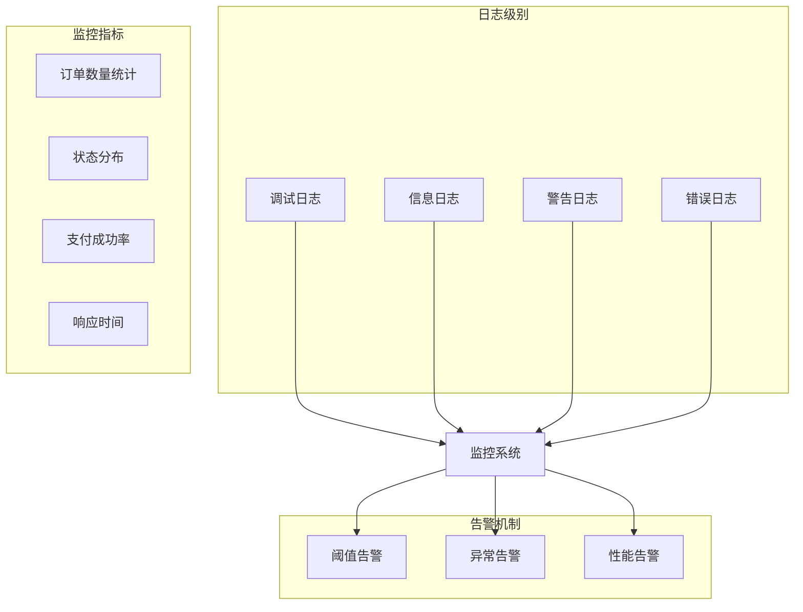

## 结论

采购订单管理功能通过模块化设计和清晰的业务流程，为工程仓提供了完整的采购订单生命周期管理能力。系统支持多端操作、灵活的状态管理和完善的追溯功能，能够满足不同场景下的采购管理需求。

### 主要优势

1. **完整的业务覆盖**：从订单创建到入库完成的全流程管理
2. **灵活的状态控制**：支持复杂的订单状态流转和权限控制
3. **多端适配**：PC端和移动端的统一功能体验
4. **数据追溯**：完整的批次追溯和审计功能
5. **性能优化**：针对大数据量的性能优化策略

### 改进建议

1. **增强异常处理**：完善异常情况下的用户提示和恢复机制
2. **优化用户体验**：进一步简化操作流程，提升用户效率
3. **扩展集成能力**：增加更多第三方系统集成接口
4. **强化数据分析**：提供更丰富的报表和分析功能

## 附录

### 最佳实践建议

#### 1. 订单创建最佳实践
- 确保商品信息的准确性和完整性
- 合理设置期望交货日期
- 详细填写收货地址和联系信息
- 及时更新订单备注和特殊要求

#### 2. 订单管理最佳实践
- 建立标准化的订单审核流程
- 及时跟进订单状态变化
- 保持与供应商的有效沟通
- 定期清理过期或无效订单

#### 3. 数据管理最佳实践
- 定期备份重要数据
- 建立数据质量检查机制
- 优化数据存储结构
- 实施数据安全保护措施

### 常用操作流程

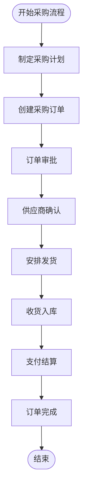