# 销售订单管理

<cite>
**本文档引用的文件**
- [apps/mp/src/pages/order/create.vue](file://apps/mp/src/pages/order/create.vue)
- [apps/mp/src/pages/order/index.vue](file://apps/mp/src/pages/order/index.vue)
- [apps/mp/src/pages/order/detail.vue](file://apps/mp/src/pages/order/detail.vue)
- [apps/mp/src/pages/order/sale.vue](file://apps/mp/src/pages/order/sale.vue)
- [apps/mp/src/pages/order/ship.vue](file://apps/mp/src/pages/order/ship.vue)
- [apps/mp/src/pages/order/receive.vue](file://apps/mp/src/pages/order/receive.vue)
- [apps/pc/src/views/order/sale/index.vue](file://apps/pc/src/views/order/sale/index.vue)
- [apps/pc/src/views/warehouse/order/sale/index.vue](file://apps/pc/src/views/warehouse/order/sale/index.vue)
- [apps/pc/src/views/warehouse/order/sale/detail.vue](file://apps/pc/src/views/warehouse/order/sale/detail.vue)
</cite>

## 目录
1. [简介](#简介)
2. [项目结构](#项目结构)
3. [核心组件](#核心组件)
4. [架构总览](#架构总览)
5. [详细组件分析](#详细组件分析)
6. [依赖关系分析](#依赖关系分析)
7. [性能考虑](#性能考虑)
8. [故障排除指南](#故障排除指南)
9. [结论](#结论)
10. [附录](#附录)

## 简介
本文件面向销售订单管理功能，系统化梳理从移动端到PC端的销售订单全链路能力，包括订单创建、订单列表展示、订单详情查看、发货与收货、状态流转与权限控制等。文档以“用户视角”为主线，结合“前端页面组件”的实现细节，帮助开发者与运营人员快速理解并高效使用销售订单管理功能。

## 项目结构
销售订单相关页面分布在移动端与PC端两套界面体系中：
- 移动端（小程序）：订单创建、订单列表、订单详情、销售订单页、发货处理、收货入库等页面。
- PC端（管理后台）：销售订单列表、销售订单详情、仓库端销售订单列表与详情等。

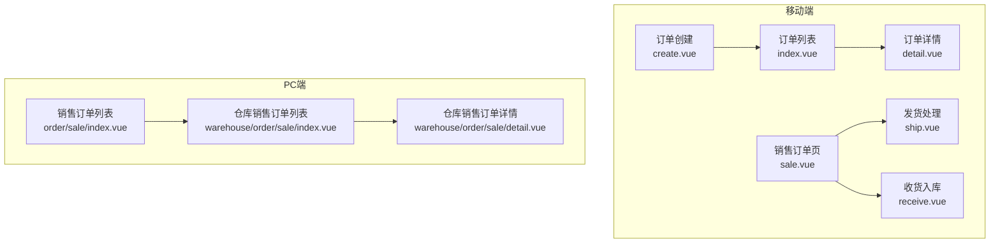

图表来源
- [apps/mp/src/pages/order/create.vue:1-680](file://apps/mp/src/pages/order/create.vue#L1-L680)
- [apps/mp/src/pages/order/index.vue:1-846](file://apps/mp/src/pages/order/index.vue#L1-L846)
- [apps/mp/src/pages/order/detail.vue:1-567](file://apps/mp/src/pages/order/detail.vue#L1-L567)
- [apps/mp/src/pages/order/sale.vue:1-551](file://apps/mp/src/pages/order/sale.vue#L1-L551)
- [apps/mp/src/pages/order/ship.vue:1-982](file://apps/mp/src/pages/order/ship.vue#L1-L982)
- [apps/mp/src/pages/order/receive.vue:1-1159](file://apps/mp/src/pages/order/receive.vue#L1-L1159)
- [apps/pc/src/views/order/sale/index.vue:1-547](file://apps/pc/src/views/order/sale/index.vue#L1-L547)
- [apps/pc/src/views/warehouse/order/sale/index.vue:1-183](file://apps/pc/src/views/warehouse/order/sale/index.vue#L1-L183)
- [apps/pc/src/views/warehouse/order/sale/detail.vue:1-633](file://apps/pc/src/views/warehouse/order/sale/detail.vue#L1-L633)

章节来源
- [apps/mp/src/pages/order/create.vue:1-680](file://apps/mp/src/pages/order/create.vue#L1-L680)
- [apps/mp/src/pages/order/index.vue:1-846](file://apps/mp/src/pages/order/index.vue#L1-L846)
- [apps/mp/src/pages/order/detail.vue:1-567](file://apps/mp/src/pages/order/detail.vue#L1-L567)
- [apps/mp/src/pages/order/sale.vue:1-551](file://apps/mp/src/pages/order/sale.vue#L1-L551)
- [apps/mp/src/pages/order/ship.vue:1-982](file://apps/mp/src/pages/order/ship.vue#L1-L982)
- [apps/mp/src/pages/order/receive.vue:1-1159](file://apps/mp/src/pages/order/receive.vue#L1-L1159)
- [apps/pc/src/views/order/sale/index.vue:1-547](file://apps/pc/src/views/order/sale/index.vue#L1-L547)
- [apps/pc/src/views/warehouse/order/sale/index.vue:1-183](file://apps/pc/src/views/warehouse/order/sale/index.vue#L1-L183)
- [apps/pc/src/views/warehouse/order/sale/detail.vue:1-633](file://apps/pc/src/views/warehouse/order/sale/detail.vue#L1-L633)

## 核心组件
- 订单创建组件：负责收货地址选择、供应商分组商品展示、备注输入、运费与总价计算、提交校验与跳转。
- 订单列表组件：支持销售/采购双标签切换、状态筛选、关键词搜索、批量操作入口。
- 订单详情组件：展示客户信息、订单信息、商品明细、金额构成、物流信息、操作按钮与进度日志。
- 发货处理组件：扫码发货、筛选条件、订单统计、部分发货与确认发货流程。
- 收货入库组件：到货跟踪、供应商联系、入库确认、质检与拍照上传。
- PC销售订单列表：高级筛选（工程仓、供应商、时间范围）、状态统计、表格列与操作权限矩阵。
- 仓库销售订单列表与详情：出库状态、收款状态、发货与完成操作、批次库存精细化发货。

章节来源
- [apps/mp/src/pages/order/create.vue:131-307](file://apps/mp/src/pages/order/create.vue#L131-L307)
- [apps/mp/src/pages/order/index.vue:246-516](file://apps/mp/src/pages/order/index.vue#L246-L516)
- [apps/mp/src/pages/order/detail.vue:146-280](file://apps/mp/src/pages/order/detail.vue#L146-L280)
- [apps/mp/src/pages/order/ship.vue:215-370](file://apps/mp/src/pages/order/ship.vue#L215-L370)
- [apps/mp/src/pages/order/receive.vue:269-445](file://apps/mp/src/pages/order/receive.vue#L269-L445)
- [apps/pc/src/views/order/sale/index.vue:164-501](file://apps/pc/src/views/order/sale/index.vue#L164-L501)
- [apps/pc/src/views/warehouse/order/sale/index.vue:70-171](file://apps/pc/src/views/warehouse/order/sale/index.vue#L70-L171)
- [apps/pc/src/views/warehouse/order/sale/detail.vue:327-591](file://apps/pc/src/views/warehouse/order/sale/detail.vue#L327-L591)

## 架构总览
销售订单管理在前端采用“页面组件 + 路由跳转 + 状态管理”的模式组织，移动端与PC端分别承载不同角色的业务职责：
- 移动端：面向仓管员/仓管主管，侧重“发货处理”“收货入库”“订单详情”等高频操作。
- PC端：面向平台/财务/仓库管理员，侧重“销售订单列表”“仓库销售订单列表与详情”“应扣记录”等管理维度。

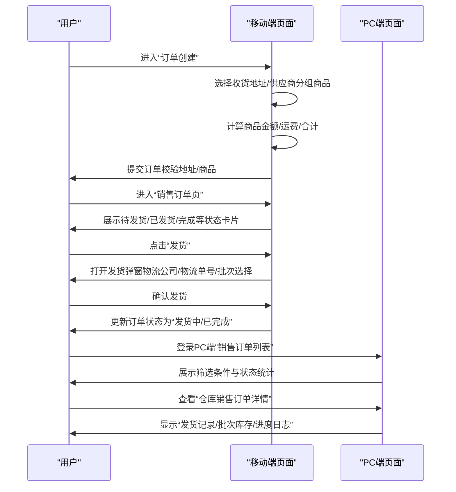

图表来源
- [apps/mp/src/pages/order/create.vue:277-306](file://apps/mp/src/pages/order/create.vue#L277-L306)
- [apps/mp/src/pages/order/sale.vue:281-287](file://apps/mp/src/pages/order/sale.vue#L281-L287)
- [apps/mp/src/pages/order/ship.vue:493-575](file://apps/mp/src/pages/order/ship.vue#L493-L575)
- [apps/pc/src/views/order/sale/index.vue:370-405](file://apps/pc/src/views/order/sale/index.vue#L370-L405)
- [apps/pc/src/views/warehouse/order/sale/detail.vue:493-575](file://apps/pc/src/views/warehouse/order/sale/detail.vue#L493-L575)

## 详细组件分析

### 订单创建（移动端）
- 功能要点
  - 地址选择：默认地址加载、地址列表弹窗、新增地址提示。
  - 商品分组：按供应商分组展示，显示预计送达天数。
  - 备注输入：供应商备注独立编辑，支持200字符限制。
  - 金额计算：商品金额、运费、合计自动计算。
  - 提交校验：必填项校验、二次确认弹窗、提交成功跳转。
- 表单字段与校验
  - 收货地址：必选；若为空则提示。
  - 订单商品：非空校验；用于后续发货/收货。
  - 备注：可选，长度限制。
- 操作流程
  - 选择地址 → 勾选备注 → 确认金额 → 提交订单 → 成功提示 → 跳转订单列表。

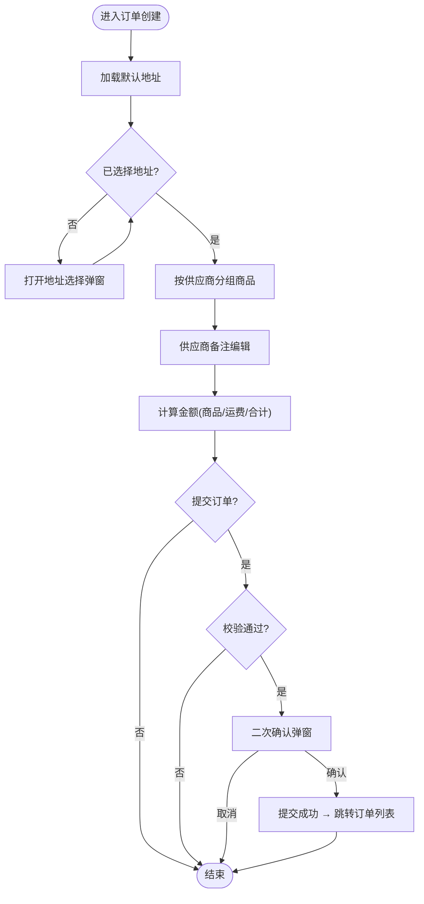

图表来源
- [apps/mp/src/pages/order/create.vue:165-251](file://apps/mp/src/pages/order/create.vue#L165-L251)
- [apps/mp/src/pages/order/create.vue:277-306](file://apps/mp/src/pages/order/create.vue#L277-L306)

章节来源
- [apps/mp/src/pages/order/create.vue:1-680](file://apps/mp/src/pages/order/create.vue#L1-L680)

### 订单列表（移动端）
- 功能要点
  - 双标签：销售订单/采购订单。
  - 状态筛选：销售订单支持“全部/待付款/待发货/已发货/已完成/售后”，采购订单支持“全部/待确认/待付款/待发货/待入库/已完成”。
  - 搜索：支持订单号/客户名称/供应商名称等关键词过滤。
  - 快捷入口：发货处理、收货入库、扫码发货、扫码入库。
- 操作按钮
  - 销售订单：发货、打印、查看物流、开票、处理售后。
  - 采购订单：取消、确认、付款、物流、确认入库。

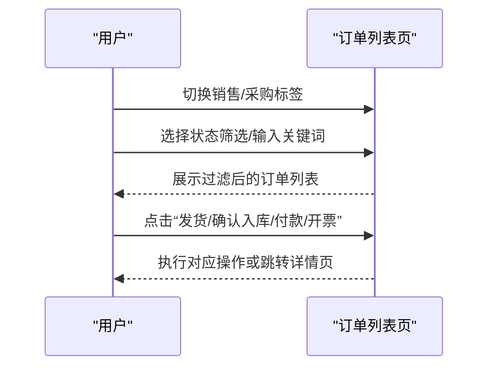

图表来源
- [apps/mp/src/pages/order/index.vue:246-516](file://apps/mp/src/pages/order/index.vue#L246-L516)

章节来源
- [apps/mp/src/pages/order/index.vue:1-846](file://apps/mp/src/pages/order/index.vue#L1-L846)

### 订单详情（移动端）
- 功能要点
  - 状态卡片：根据状态显示背景色、图标、描述。
  - 客户信息/订单信息/商品明细/金额构成/物流信息。
  - 操作按钮：根据当前状态显示“发货/打印/确认入库/确认/取消/付款/申请开票/查看物流”等。
- 交互细节
  - 复制订单号/物流单号。
  - 点击“发货”跳转发货页，“确认订单/取消/付款/申请开票/查看物流”弹窗或跳转。

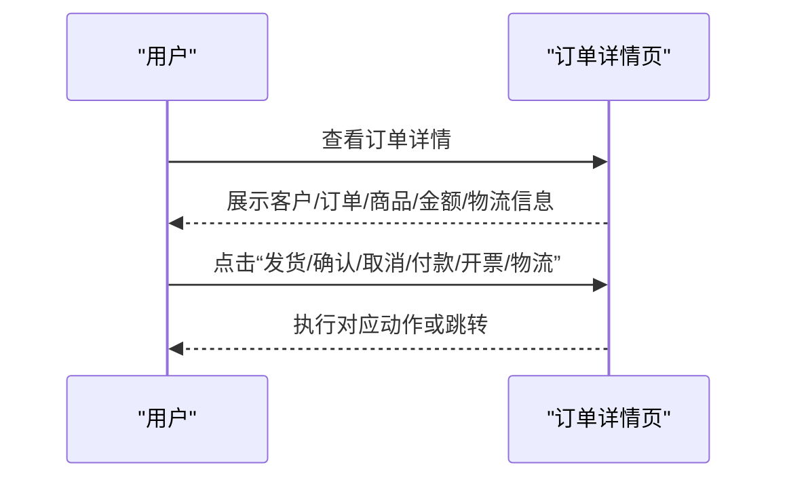

图表来源
- [apps/mp/src/pages/order/detail.vue:146-280](file://apps/mp/src/pages/order/detail.vue#L146-L280)

章节来源
- [apps/mp/src/pages/order/detail.vue:1-567](file://apps/mp/src/pages/order/detail.vue#L1-L567)

### 销售订单页（移动端）
- 功能要点
  - 状态Tab：全部/待发货/已发货/已完成/售后。
  - 搜索：订单号/商品名称。
  - 订单卡片：订单号、状态、商品列表、金额、操作按钮（发货/物流/详情）。
- 交互细节
  - 点击“发货”跳转发货页；“物流”提示功能开发中；“详情”跳转详情页。

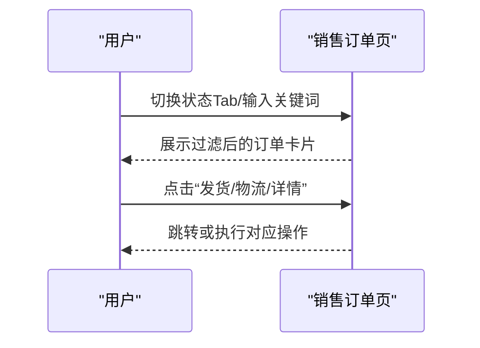

图表来源
- [apps/mp/src/pages/order/sale.vue:124-296](file://apps/mp/src/pages/order/sale.vue#L124-L296)

章节来源
- [apps/mp/src/pages/order/sale.vue:1-551](file://apps/mp/src/pages/order/sale.vue#L1-L551)

### 发货处理（移动端）
- 功能要点
  - 扫码发货：支持扫描订单条码。
  - 筛选：订单类型（全部/加急/部分发货）、日期范围（全部/今日/近7天）。
  - 订单统计：待发货、今日订单、加急订单、部分发货。
  - 发货确认：物流公司/物流单号/备注；支持部分发货与确认发货。
- 流程
  - 选择订单 → 填写物流信息 → 选择发货数量 → 确认发货 → 更新订单状态与进度。

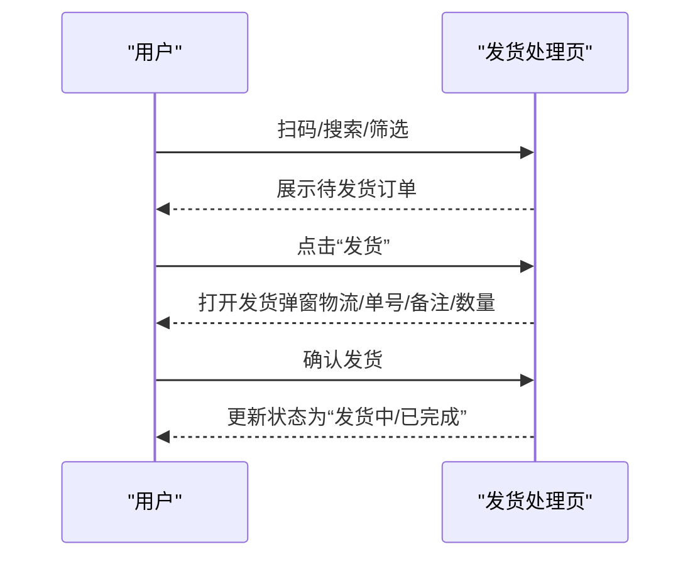

图表来源
- [apps/mp/src/pages/order/ship.vue:215-370](file://apps/mp/src/pages/order/ship.vue#L215-L370)
- [apps/mp/src/pages/order/ship.vue:493-575](file://apps/mp/src/pages/order/ship.vue#L493-L575)

章节来源
- [apps/mp/src/pages/order/ship.vue:1-982](file://apps/mp/src/pages/order/ship.vue#L1-L982)

### 收货入库（移动端）
- 功能要点
  - 扫码入库：支持扫描采购订单条码。
  - 筛选：订单状态（全部/运输中/已到货/部分入库）、供应商。
  - 订单统计：待入库、今日到货、运输中、部分入库。
  - 入库确认：入库类型、质检状态、备注、拍照上传；支持部分入库与确认入库。
- 流程
  - 选择订单 → 填写入库信息 → 选择仓库/库位 → 确认入库 → 更新状态与进度。

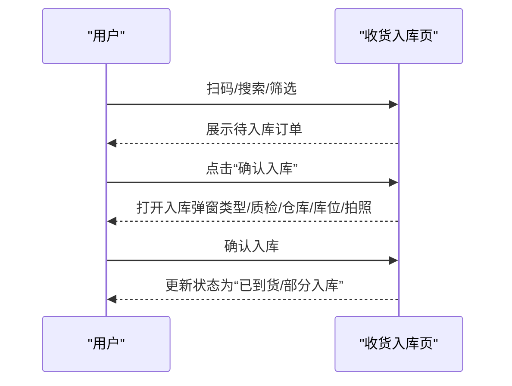

图表来源
- [apps/mp/src/pages/order/receive.vue:269-445](file://apps/mp/src/pages/order/receive.vue#L269-L445)

章节来源
- [apps/mp/src/pages/order/receive.vue:1-1159](file://apps/mp/src/pages/order/receive.vue#L1-L1159)

### PC销售订单列表
- 功能要点
  - Tab分类统计：全部、待确认、待支付、待发货、待收货、已完成、已退款。
  - 搜索筛选：关键词（订单号/采购方/供应商）、工程仓、供应商、创建时间范围。
  - 表格列：订单编号、采购工程仓、供应商、商品信息、订单金额、应扣金额、实付金额、订单状态、支付状态、创建时间、操作（详情、应扣记录）。
  - 权限矩阵：不同角色可见不同操作按钮。
- 交互细节
  - 点击“详情”跳转订单详情；点击“应扣记录”弹窗展示明细。

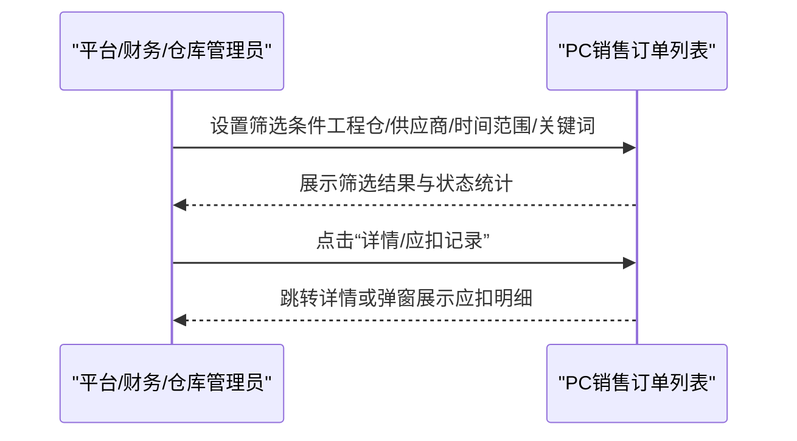

图表来源
- [apps/pc/src/views/order/sale/index.vue:164-501](file://apps/pc/src/views/order/sale/index.vue#L164-L501)

章节来源
- [apps/pc/src/views/order/sale/index.vue:1-547](file://apps/pc/src/views/order/sale/index.vue#L1-L547)

### 仓库销售订单列表与详情
- 功能要点
  - 列表：全部/待发货/发货中/已完成/已取消；支持导出。
  - 详情：订单信息、客户信息、收货信息、物流信息、商品明细、发货记录、订单进度。
  - 操作：发货、确认完成。
- 交互细节
  - “发货”弹窗支持精细化发货（仓库、物流公司、物流单号、批次库存选择）。
  - “确认完成”更新订单状态为“已完成”。

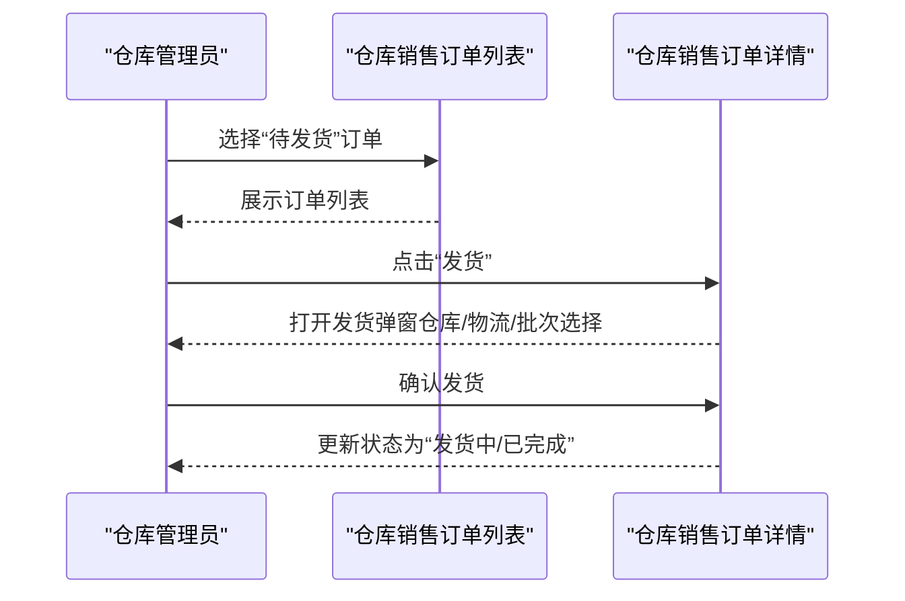

图表来源
- [apps/pc/src/views/warehouse/order/sale/index.vue:70-171](file://apps/pc/src/views/warehouse/order/sale/index.vue#L70-L171)
- [apps/pc/src/views/warehouse/order/sale/detail.vue:327-591](file://apps/pc/src/views/warehouse/order/sale/detail.vue#L327-L591)

章节来源
- [apps/pc/src/views/warehouse/order/sale/index.vue:1-183](file://apps/pc/src/views/warehouse/order/sale/index.vue#L1-L183)
- [apps/pc/src/views/warehouse/order/sale/detail.vue:1-633](file://apps/pc/src/views/warehouse/order/sale/detail.vue#L1-L633)

## 依赖关系分析
- 页面间路由跳转
  - 订单创建 → 订单列表
  - 订单列表 → 订单详情
  - 销售订单页 → 发货处理/收货入库/订单详情
  - PC销售订单列表 → 仓库销售订单列表 → 仓库销售订单详情
- 数据流
  - 移动端：本地状态驱动（Vue响应式），通过uni.navigateTo/redirectTo进行页面跳转。
  - PC端：基于vue-router进行页面跳转，Arco Design组件提供UI与交互。

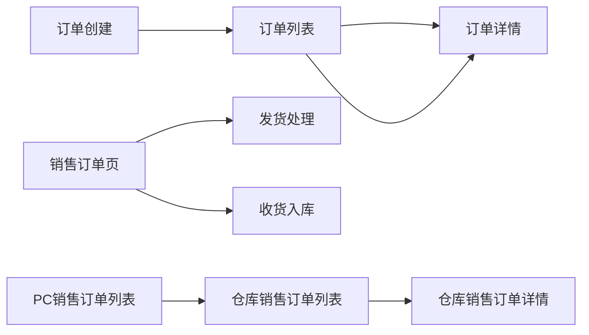

图表来源
- [apps/mp/src/pages/order/create.vue:299-306](file://apps/mp/src/pages/order/create.vue#L299-L306)
- [apps/mp/src/pages/order/index.vue:423-425](file://apps/mp/src/pages/order/index.vue#L423-L425)
- [apps/mp/src/pages/order/sale.vue:277-287](file://apps/mp/src/pages/order/sale.vue#L277-L287)
- [apps/pc/src/views/order/sale/index.vue:455-457](file://apps/pc/src/views/order/sale/index.vue#L455-L457)
- [apps/pc/src/views/warehouse/order/sale/index.vue:160-162](file://apps/pc/src/views/warehouse/order/sale/index.vue#L160-L162)

章节来源
- [apps/mp/src/pages/order/create.vue:1-680](file://apps/mp/src/pages/order/create.vue#L1-L680)
- [apps/mp/src/pages/order/index.vue:1-846](file://apps/mp/src/pages/order/index.vue#L1-L846)
- [apps/mp/src/pages/order/sale.vue:1-551](file://apps/mp/src/pages/order/sale.vue#L1-L551)
- [apps/pc/src/views/order/sale/index.vue:1-547](file://apps/pc/src/views/order/sale/index.vue#L1-L547)
- [apps/pc/src/views/warehouse/order/sale/index.vue:1-183](file://apps/pc/src/views/warehouse/order/sale/index.vue#L1-L183)

## 性能考虑
- 列表渲染优化
  - 使用虚拟滚动或分页（PC端已内置分页），避免一次性渲染大量订单。
  - 过滤与搜索建议在服务端完成，前端做轻量缓存。
- 图片与资源
  - 商品图片懒加载，占位图优化首屏体验。
- 交互反馈
  - 加载状态与错误提示统一处理，减少重复请求。
- 状态管理
  - 将常用筛选条件与统计数据缓存至本地存储，提升二次访问速度。

## 故障排除指南
- 订单创建失败
  - 现象：提交按钮不可用或提示“请选择收货地址/订单数据异常”。
  - 排查：检查地址选择状态、订单商品数组是否为空、备注长度是否超限。
  - 处理：修复必填项后再提交。
- 发货失败
  - 现象：确认发货时报错或状态未更新。
  - 排查：物流公司/物流单号是否填写、批次选择数量是否与待发货数量一致、是否有部分发货差异提示。
  - 处理：完善物流信息、核对发货数量、确认批次选择。
- 收货入库异常
  - 现象：确认入库后状态未变化或图片上传失败。
  - 排查：入库类型/质检状态是否选择、仓库/库位是否正确、上传图片格式与数量是否符合要求。
  - 处理：修正入库信息与附件后重新提交。
- PC端筛选无效
  - 现象：设置筛选条件后列表未变化。
  - 排查：关键词/工程仓/供应商/时间范围是否正确传入；分页参数是否重置。
  - 处理：重置筛选或检查接口参数。

章节来源
- [apps/mp/src/pages/order/create.vue:277-306](file://apps/mp/src/pages/order/create.vue#L277-L306)
- [apps/mp/src/pages/order/ship.vue:493-575](file://apps/mp/src/pages/order/ship.vue#L493-L575)
- [apps/mp/src/pages/order/receive.vue:405-435](file://apps/mp/src/pages/order/receive.vue#L405-L435)
- [apps/pc/src/views/order/sale/index.vue:387-405](file://apps/pc/src/views/order/sale/index.vue#L387-L405)

## 结论
销售订单管理在移动端与PC端形成完整的业务闭环：移动端聚焦“创建—发货—收货—详情”的高频操作，PC端聚焦“销售订单管理—仓库订单管理—应扣记录”的管理维度。通过清晰的状态机、完善的筛选与权限矩阵、以及可扩展的发货/入库流程，系统能够满足多角色协作下的高效运营需求。

## 附录
- 最佳实践
  - 发货前务必核对批次库存与物流信息，确保可追溯性。
  - 收货入库需同步质检与拍照留痕，保障供应链透明度。
  - 定期导出销售订单报表，配合财务结算与审计。
- 常见问题
  - 订单状态不一致：检查发货/收货流程是否完成，核对日志与进度。
  - 权限不足：确认登录角色是否具备相应操作权限。
  - 数据延迟：刷新页面或清理缓存后重试。