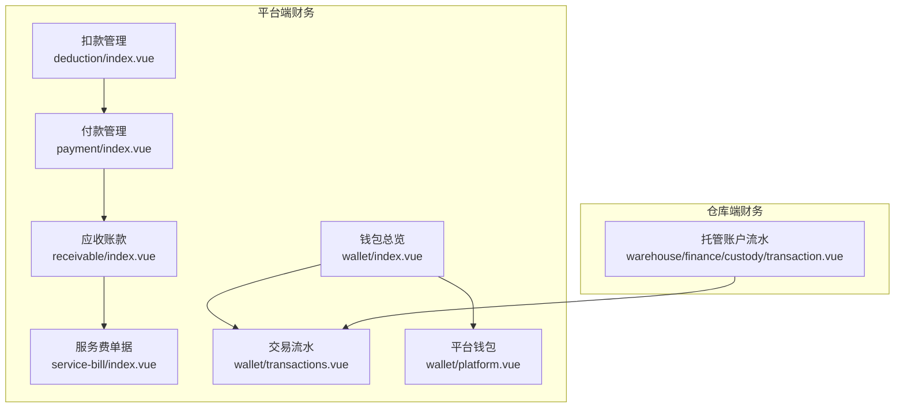
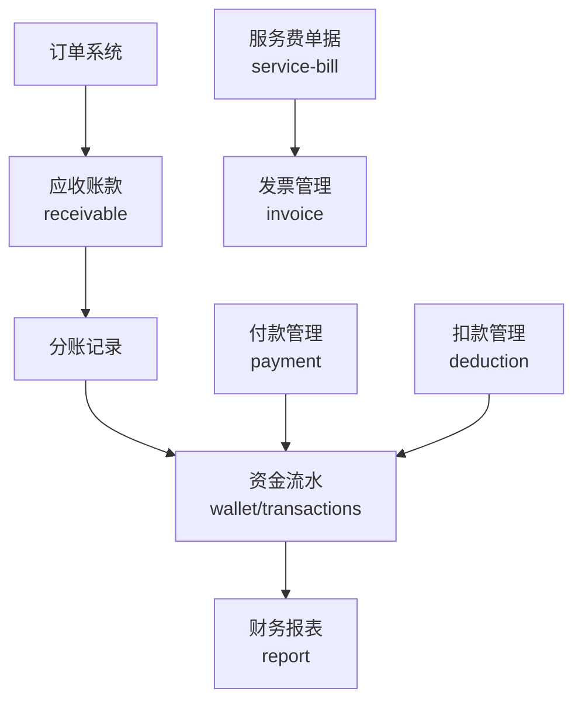
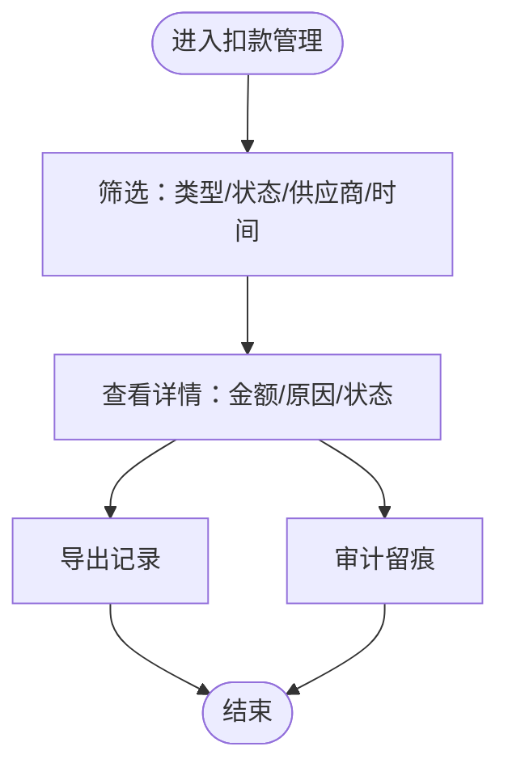
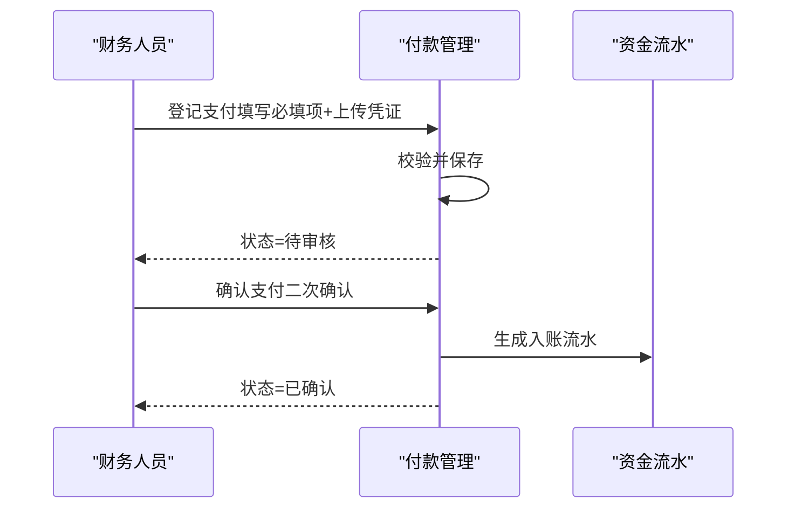
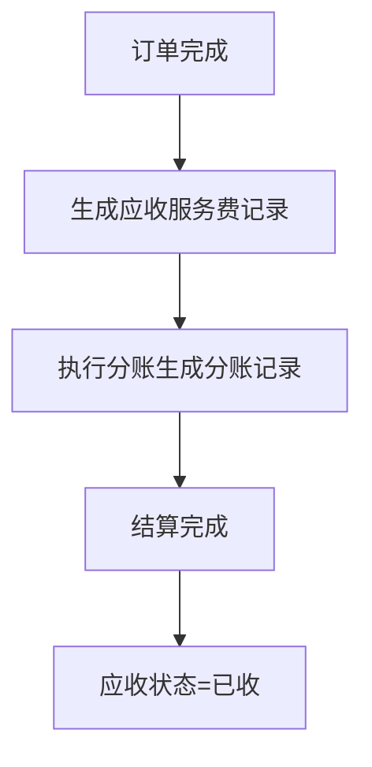
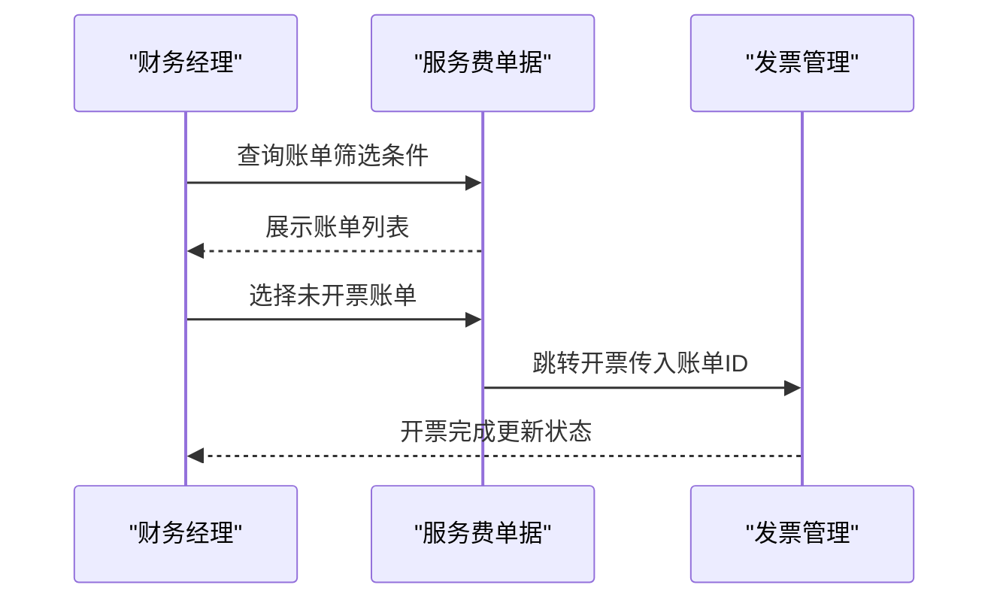
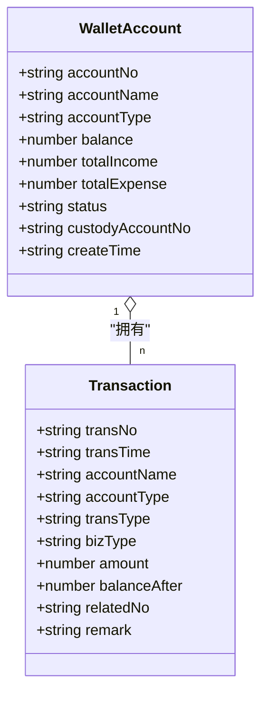
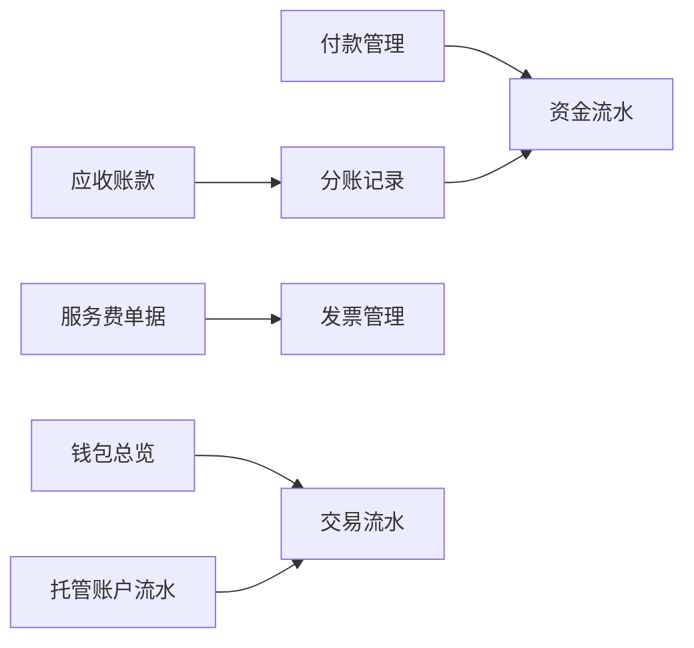

# 其他财务功能

<cite>
**本文引用的文件**
- [apps/pc/src/views/finance/deduction/index.vue](file://apps/pc/src/views/finance/deduction/index.vue)
- [apps/pc/src/views/finance/payment/index.vue](file://apps/pc/src/views/finance/payment/index.vue)
- [apps/pc/src/views/finance/receivable/index.vue](file://apps/pc/src/views/finance/receivable/index.vue)
- [apps/pc/src/views/finance/service-bill/index.vue](file://apps/pc/src/views/finance/service-bill/index.vue)
- [apps/pc/src/views/finance/wallet/index.vue](file://apps/pc/src/views/finance/wallet/index.vue)
- [apps/pc/src/views/finance/wallet/transactions.vue](file://apps/pc/src/views/finance/wallet/transactions.vue)
- [apps/pc/src/views/finance/wallet/platform.vue](file://apps/pc/src/views/finance/wallet/platform.vue)
- [apps/pc/src/views/warehouse/finance/custody/transaction.vue](file://apps/pc/src/views/warehouse/finance/custody/transaction.vue)
</cite>

## 目录
1. [简介](#简介)
2. [项目结构](#项目结构)
3. [核心组件](#核心组件)
4. [架构总览](#架构总览)
5. [详细组件分析](#详细组件分析)
6. [依赖分析](#依赖分析)
7. [性能考虑](#性能考虑)
8. [故障排查指南](#故障排查指南)
9. [结论](#结论)
10. [附录](#附录)

## 简介
本章节面向“其他财务功能”的使用与实施，覆盖以下模块：
- 会计科目管理：通过“资金流水”“平台钱包”“托管账户流水”等模块体现资金分类与核算维度，便于对接会计账簿。
- 扣款管理：集中展示应扣记录（如罚款、违约金等），支持筛选、统计与查看详情。
- 付款管理：统一登记与确认各类支付，支持凭证上传、状态流转与导出。
- 应收账款：平台服务费的应收台账，贯穿“订单→应收→分账→结算”，支持逾期监控与导出。
- 服务费单据：服务费账单的生成、开票与状态管理，支撑发票与税务归集。
- 资金流水：商户账户与平台账户的交易明细、收支统计与导出。

本文件同时给出业务场景、操作流程、数据模型与集成关系，并提供配置指南、操作示例与常见问题解答，帮助财务与运营人员高效落地。

## 项目结构
财务相关页面集中在 PC 端“财务”与“仓库端财务”两大视图路径下，采用按功能域划分的组织方式：
- 平台端财务：deduction、payment、receivable、service-bill、wallet（含 platform、transactions 子页）、invoice、settlement 等。
- 仓库端财务：custody（含 overview、transaction、recharge、withdraw、frozen 等子页）、statement、bill（purchase/sale/service）、invoice 等。

图表来源
- [apps/pc/src/views/finance/deduction/index.vue:1-290](file://apps/pc/src/views/finance/deduction/index.vue#L1-L290)
- [apps/pc/src/views/finance/payment/index.vue:1-428](file://apps/pc/src/views/finance/payment/index.vue#L1-L428)
- [apps/pc/src/views/finance/receivable/index.vue:1-492](file://apps/pc/src/views/finance/receivable/index.vue#L1-L492)
- [apps/pc/src/views/finance/service-bill/index.vue:1-287](file://apps/pc/src/views/finance/service-bill/index.vue#L1-L287)
- [apps/pc/src/views/finance/wallet/index.vue:1-389](file://apps/pc/src/views/finance/wallet/index.vue#L1-L389)
- [apps/pc/src/views/finance/wallet/transactions.vue:1-434](file://apps/pc/src/views/finance/wallet/transactions.vue#L1-L434)
- [apps/pc/src/views/finance/wallet/platform.vue:1-244](file://apps/pc/src/views/finance/wallet/platform.vue#L1-L244)
- [apps/pc/src/views/warehouse/finance/custody/transaction.vue:1-219](file://apps/pc/src/views/warehouse/finance/custody/transaction.vue#L1-L219)

章节来源
- [apps/pc/src/views/finance/deduction/index.vue:1-290](file://apps/pc/src/views/finance/deduction/index.vue#L1-L290)
- [apps/pc/src/views/finance/payment/index.vue:1-428](file://apps/pc/src/views/finance/payment/index.vue#L1-L428)
- [apps/pc/src/views/finance/receivable/index.vue:1-492](file://apps/pc/src/views/finance/receivable/index.vue#L1-L492)
- [apps/pc/src/views/finance/service-bill/index.vue:1-287](file://apps/pc/src/views/finance/service-bill/index.vue#L1-L287)
- [apps/pc/src/views/finance/wallet/index.vue:1-389](file://apps/pc/src/views/finance/wallet/index.vue#L1-L389)
- [apps/pc/src/views/finance/wallet/transactions.vue:1-434](file://apps/pc/src/views/finance/wallet/transactions.vue#L1-L434)
- [apps/pc/src/views/finance/wallet/platform.vue:1-244](file://apps/pc/src/views/finance/wallet/platform.vue#L1-L244)
- [apps/pc/src/views/warehouse/finance/custody/transaction.vue:1-219](file://apps/pc/src/views/warehouse/finance/custody/transaction.vue#L1-L219)

## 核心组件
- 扣款管理：应扣记录的统计卡片、筛选器、表格与详情交互；支持按类型（罚款/违约金/其他）与状态（已扣款/待扣款）过滤。
- 付款管理：支付登记、状态机（待审核/已确认/已驳回）、凭证查看、导出；支持按支付类型（工程仓→施工方/施工方→工程仓）与时间范围筛选。
- 应收账款：应收统计（今日/本月/历史/总数）、标签页（全部/待收/已收/已作废/已逾期）、导出与详情弹窗；支持按商户类型与时间范围筛选。
- 服务费单据：服务费账单列表、开票状态、账单详情弹窗；支持按工程仓、开票状态与时间范围筛选。
- 钱包总览：商户账户列表（工程仓/供应商），余额、收入、支出、状态与关联托管账户；支持冻结/解冻与跳转交易流水。
- 交易流水：账户级流水明细，支持账户类型、收支类型、业务类型、时间范围筛选；提供收支合计与余额统计。
- 平台钱包：平台专属账户概览与收支明细，支持业务类型筛选与导出。
- 托管账户流水（仓库端）：账户余额、本月收支、冻结/待分账等关键指标；支持交易类型、关键词与时间范围筛选。

章节来源
- [apps/pc/src/views/finance/deduction/index.vue:1-290](file://apps/pc/src/views/finance/deduction/index.vue#L1-L290)
- [apps/pc/src/views/finance/payment/index.vue:1-428](file://apps/pc/src/views/finance/payment/index.vue#L1-L428)
- [apps/pc/src/views/finance/receivable/index.vue:1-492](file://apps/pc/src/views/finance/receivable/index.vue#L1-L492)
- [apps/pc/src/views/finance/service-bill/index.vue:1-287](file://apps/pc/src/views/finance/service-bill/index.vue#L1-L287)
- [apps/pc/src/views/finance/wallet/index.vue:1-389](file://apps/pc/src/views/finance/wallet/index.vue#L1-L389)
- [apps/pc/src/views/finance/wallet/transactions.vue:1-434](file://apps/pc/src/views/finance/wallet/transactions.vue#L1-L434)
- [apps/pc/src/views/finance/wallet/platform.vue:1-244](file://apps/pc/src/views/finance/wallet/platform.vue#L1-L244)
- [apps/pc/src/views/warehouse/finance/custody/transaction.vue:1-219](file://apps/pc/src/views/warehouse/finance/custody/transaction.vue#L1-L219)

## 架构总览
财务模块围绕“订单—资金—账单—报表”的闭环展开：
- 订单完成后生成“应收账款”（平台服务费应收）与“分账记录”（资金清算）。
- “付款管理”用于登记与确认各类支付，支持凭证与状态流转。
- “资金流水”提供账户级明细与汇总，支撑对账与报表。
- “服务费单据”用于生成并向工程仓开具服务费发票，满足税务与合规要求。
- “扣款管理”用于记录与追踪因合同履约产生的扣款事项（如罚款、违约金）。

图表来源
- [apps/pc/src/views/finance/receivable/index.vue:160-168](file://apps/pc/src/views/finance/receivable/index.vue#L160-L168)
- [apps/pc/src/views/finance/payment/index.vue:1-428](file://apps/pc/src/views/finance/payment/index.vue#L1-L428)
- [apps/pc/src/views/finance/service-bill/index.vue:1-287](file://apps/pc/src/views/finance/service-bill/index.vue#L1-L287)
- [apps/pc/src/views/finance/deduction/index.vue:1-290](file://apps/pc/src/views/finance/deduction/index.vue#L1-L290)
- [apps/pc/src/views/finance/wallet/transactions.vue:1-434](file://apps/pc/src/views/finance/wallet/transactions.vue#L1-L434)

## 详细组件分析

### 扣款管理
- 业务场景：对未履约或质量不符的供应商进行扣款，形成应扣记录并跟踪状态。
- 操作流程：筛选应扣记录（类型/状态/供应商/时间），查看详情，核对金额与原因。
- 数据模型要点：
  - 应扣编号、关联订单号、供应商、应扣类型（罚款/违约金/其他）、金额、状态（已扣款/待扣款）、原因、创建时间。
- 集成关系：与订单系统联动生成应扣记录；与资金流水联动体现资金变动；支持导出与审计。

图表来源
- [apps/pc/src/views/finance/deduction/index.vue:32-112](file://apps/pc/src/views/finance/deduction/index.vue#L32-L112)

章节来源
- [apps/pc/src/views/finance/deduction/index.vue:1-290](file://apps/pc/src/views/finance/deduction/index.vue#L1-L290)

### 付款管理
- 业务场景：登记与确认各类支付（工程仓→施工方/施工方→工程仓），确保资金到账与入账。
- 操作流程：登记支付（必填项包括支付类型、付款方、收款方、金额、支付时间等），上传凭证，财务确认/驳回，导出。
- 数据模型要点：
  - 支付单号、关联订单、支付类型、付款方、收款方、支付金额、支付方式、支付状态（待审核/已确认/已驳回）、支付时间、确认时间、操作人、凭证URL。
- 状态机：登记支付 → 待审核 → 财务确认 → 已确认（入账）；若驳回则回到待审核或允许编辑重提。

图表来源
- [apps/pc/src/views/finance/payment/index.vue:195-233](file://apps/pc/src/views/finance/payment/index.vue#L195-L233)

章节来源
- [apps/pc/src/views/finance/payment/index.vue:1-428](file://apps/pc/src/views/finance/payment/index.vue#L1-L428)

### 应收账款
- 业务场景：平台服务费的应收台账，连接订单与结算，支持逾期监控与导出。
- 操作流程：筛选（状态/商户类型/时间），查看详情（交易金额、工程仓收入、平台应收、分账状态、商品分账明细），导出。
- 数据模型要点：
  - 应收编号、关联订单、商户名称、交易金额、工程仓收入、平台应收服务费、分账状态、产生时间、商品分账比例与金额。
- 资金流向说明：订单创建→应收服务费记录（债权凭证）→订单完成后执行分账→结算后应收状态变更为“已收”。

图表来源
- [apps/pc/src/views/finance/receivable/index.vue:160-168](file://apps/pc/src/views/finance/receivable/index.vue#L160-L168)

章节来源
- [apps/pc/src/views/finance/receivable/index.vue:1-492](file://apps/pc/src/views/finance/receivable/index.vue#L1-L492)

### 服务费单据
- 业务场景：生成并向工程仓开具服务费发票，支撑税务与合规。
- 操作流程：筛选（账单编号/工程仓/开票状态/时间），查看详情，开票（跳转发票管理），导出。
- 数据模型要点：
  - 账单编号、工程仓、关联订单、订单金额、服务费率、服务费金额、开票状态、发票号码、账单时间、开票时间。

图表来源
- [apps/pc/src/views/finance/service-bill/index.vue:238-240](file://apps/pc/src/views/finance/service-bill/index.vue#L238-L240)

章节来源
- [apps/pc/src/views/finance/service-bill/index.vue:1-287](file://apps/pc/src/views/finance/service-bill/index.vue#L1-L287)

### 钱包总览与交易流水
- 业务场景：统一管理商户账户（工程仓/供应商）与平台账户，提供余额、收入、支出、冻结与可用余额概览，支持交易明细与导出。
- 操作流程：筛选账户（类型/状态/关键词），查看详情与交易流水，冻结/解冻账户，导出流水。
- 数据模型要点：
  - 账户编号、账户名称、账户类型（平台/工程仓/供应商）、余额、累计收入、累计支出、状态、关联托管账户、开户时间。
  - 交易流水：流水号、交易时间、账户名称、账户类型、收支类型、业务类型、交易金额、账户余额、关联单据、备注。

图表来源
- [apps/pc/src/views/finance/wallet/index.vue:161-258](file://apps/pc/src/views/finance/wallet/index.vue#L161-L258)
- [apps/pc/src/views/finance/wallet/transactions.vue:160-311](file://apps/pc/src/views/finance/wallet/transactions.vue#L160-L311)

章节来源
- [apps/pc/src/views/finance/wallet/index.vue:1-389](file://apps/pc/src/views/finance/wallet/index.vue#L1-L389)
- [apps/pc/src/views/finance/wallet/transactions.vue:1-434](file://apps/pc/src/views/finance/wallet/transactions.vue#L1-L434)

### 平台钱包
- 业务场景：平台专属账户的概览与收支明细，支持业务类型筛选与导出。
- 操作流程：切换概览/明细，筛选（类型/业务类型/时间），导出。
- 数据模型要点：
  - 流水号、交易时间、收支类型、业务类型、交易金额、账户余额、备注。

章节来源
- [apps/pc/src/views/finance/wallet/platform.vue:1-244](file://apps/pc/src/views/finance/wallet/platform.vue#L1-L244)

### 托管账户流水（仓库端）
- 业务场景：工程仓/供应商在第三方存管体系下的资金变动明细，支持收入/支出/充值/提现/冻结/解冻/分账等类型。
- 操作流程：筛选（交易类型/时间/关键词），导出，查看订单详情。
- 数据模型要点：
  - 交易时间、交易类型、交易号、关联订单、交易金额、交易说明、余额、状态。

章节来源
- [apps/pc/src/views/warehouse/finance/custody/transaction.vue:1-219](file://apps/pc/src/views/warehouse/finance/custody/transaction.vue#L1-L219)

## 依赖分析
- 组件内聚性：各模块均采用本地状态与计算属性驱动视图，耦合度低，职责清晰。
- 外部依赖：Arco Design 组件库（表格、统计、标签、模态框、分页等）；Vue Router 用于页面跳转；Message/Modal 用于交互反馈。
- 数据来源：多数页面使用本地静态数据模拟，便于演示与测试；生产环境应替换为真实 API 接口。
- 集成点：
  - 付款管理与资金流水：登记支付后生成入账流水。
  - 应收账款与分账：订单完成后生成应收与分账记录。
  - 服务费单据与发票：生成账单并跳转开票。
  - 钱包与托管：账户与流水相互映射，支持冻结/解冻与可用余额计算。

图表来源
- [apps/pc/src/views/finance/payment/index.vue:325-330](file://apps/pc/src/views/finance/payment/index.vue#L325-L330)
- [apps/pc/src/views/finance/receivable/index.vue:232-329](file://apps/pc/src/views/finance/receivable/index.vue#L232-L329)
- [apps/pc/src/views/finance/service-bill/index.vue:170-176](file://apps/pc/src/views/finance/service-bill/index.vue#L170-L176)
- [apps/pc/src/views/finance/wallet/index.vue:161-258](file://apps/pc/src/views/finance/wallet/index.vue#L161-L258)
- [apps/pc/src/views/finance/wallet/transactions.vue:160-311](file://apps/pc/src/views/finance/wallet/transactions.vue#L160-L311)
- [apps/pc/src/views/warehouse/finance/custody/transaction.vue:131-142](file://apps/pc/src/views/warehouse/finance/custody/transaction.vue#L131-L142)

## 性能考虑
- 列表分页：使用分页参数控制每页条数与当前页，避免一次性加载大量数据。
- 本地筛选：在前端进行筛选与排序时，建议限制初始数据规模或引入虚拟滚动（如需扩展）。
- 图表与统计：使用统计组件展示关键指标，减少复杂计算逻辑。
- 导出优化：导出前先判断当前筛选结果数量，避免空数据导出。

## 故障排查指南
- 无法查看凭证：检查凭证URL是否存在，若为空则不显示“查看凭证”按钮。
- 状态不可逆：确认支付后状态不可修改，若需更正需走驳回流程并重新编辑。
- 导出无数据：当筛选结果为空时，导出会提示“暂无数据可导出”。
- 账户冻结：冻结状态下无法交易，可通过解冻恢复；解冻前需二次确认。
- 逾期应收：系统支持逾期状态标记，建议定期复核并催收。

章节来源
- [apps/pc/src/views/finance/payment/index.vue:395-398](file://apps/pc/src/views/finance/payment/index.vue#L395-L398)
- [apps/pc/src/views/finance/receivable/index.vue:412-418](file://apps/pc/src/views/finance/receivable/index.vue#L412-L418)
- [apps/pc/src/views/finance/wallet/index.vue:325-345](file://apps/pc/src/views/finance/wallet/index.vue#L325-L345)

## 结论
本模块通过“扣款管理、付款管理、应收账款、服务费单据、钱包与流水”的协同，构建了从订单到资金再到账单与报表的完整闭环。建议在生产环境中：
- 替换本地静态数据为真实 API；
- 补充权限控制矩阵与操作日志；
- 完善税务与合规字段（如税额、税率、发票类型等）；
- 增强异常处理与重试机制；
- 提供批量导入/导出与报表订阅能力。

## 附录
- 功能配置指南
  - 扣款管理：配置应扣类型与状态枚举，设置默认筛选条件。
  - 付款管理：启用凭证上传、设置支付方式选项、配置状态流转规则。
  - 应收账款：配置逾期阈值与提醒策略，设置导出字段。
  - 服务费单据：配置工程仓与服务费率，设置开票状态同步。
  - 钱包与流水：配置账户类型与业务类型，设置冻结/解冻规则。
- 操作示例
  - 登记一笔“工程仓→施工方”的付款，上传凭证，财务确认后生成入账流水。
  - 生成服务费账单并开票，更新开票状态，导出账单。
  - 查看某工程仓的交易流水，按业务类型筛选并导出。
- 常见问题
  - 为什么“查看凭证”按钮不可见？可能该支付未上传凭证。
  - 为什么已确认的记录不能修改？已确认记录禁止修改，需通过红冲或反向单据处理。
  - 如何冻结/解冻账户？在账户列表中选择对应操作并确认。