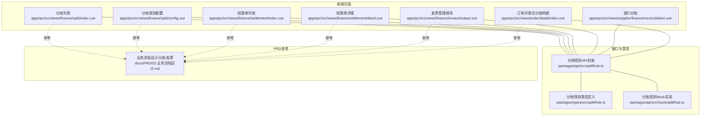
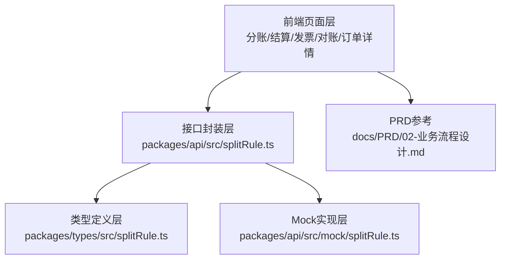
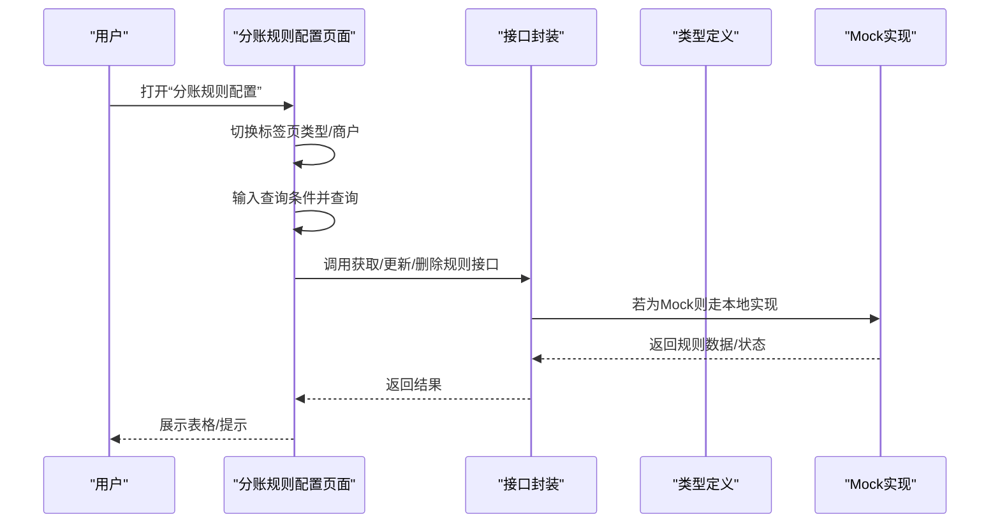
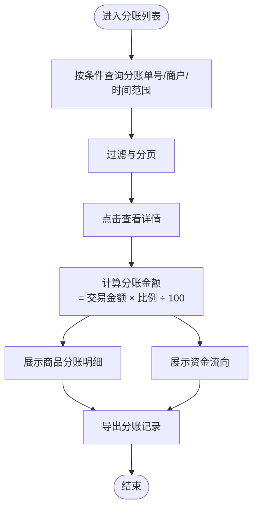
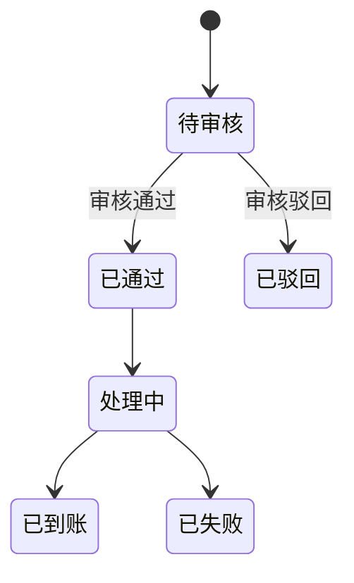
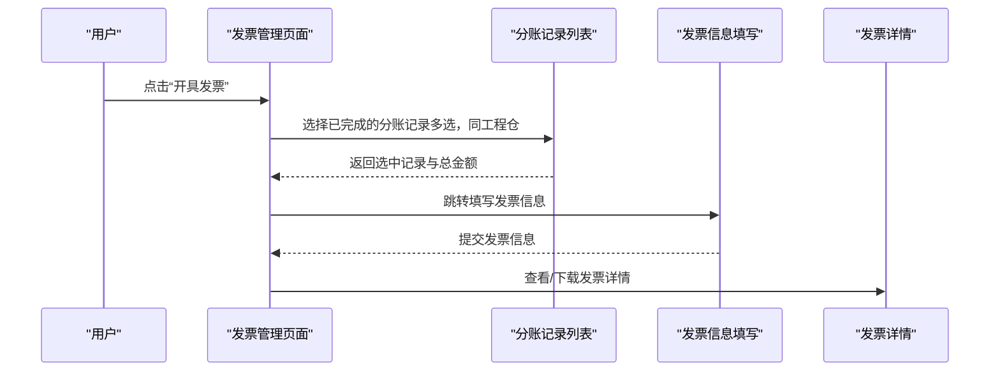
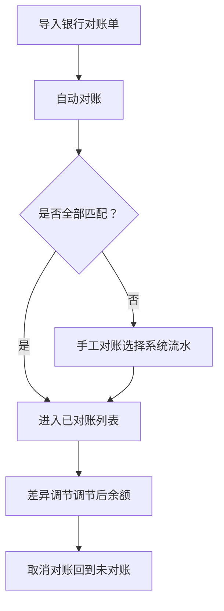
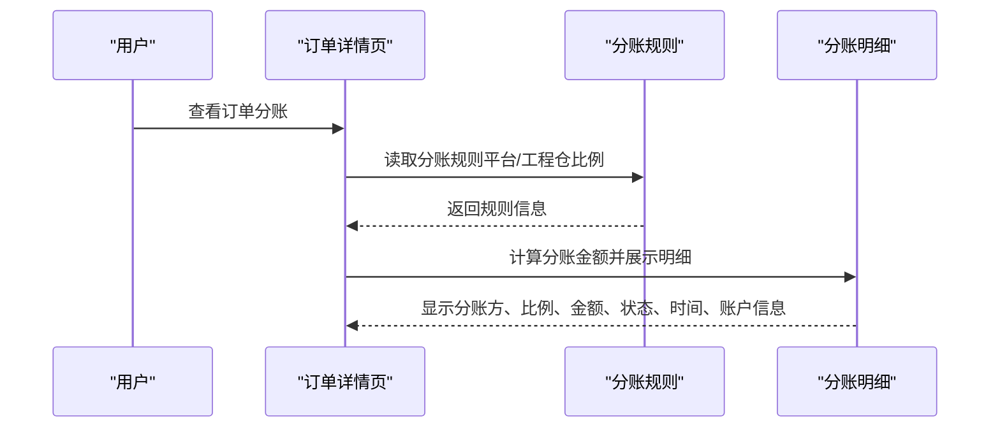
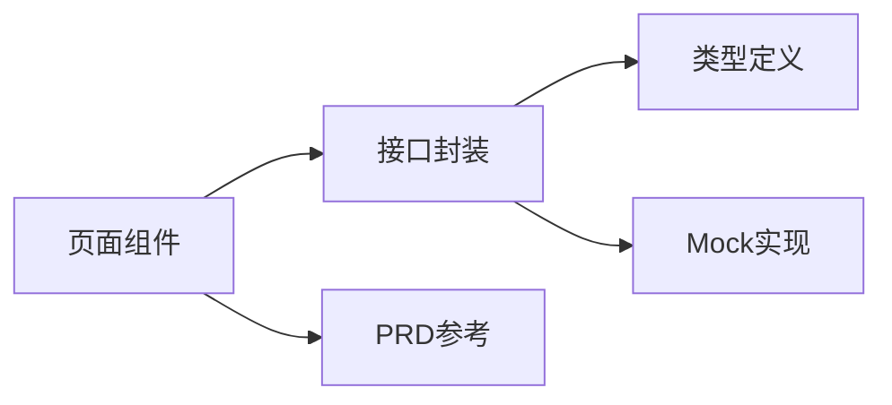

# 分账管理

<cite>
**本文引用的文件**
- [apps/pc/src/views/finance/split/index.vue](file://apps/pc/src/views/finance/split/index.vue)
- [apps/pc/src/views/finance/split/config.vue](file://apps/pc/src/views/finance/split/config.vue)
- [apps/pc/src/views/finance/settlement/index.vue](file://apps/pc/src/views/finance/settlement/index.vue)
- [apps/pc/src/views/finance/settlement/detail.vue](file://apps/pc/src/views/finance/settlement/detail.vue)
- [apps/pc/src/views/finance/invoice/output.vue](file://apps/pc/src/views/finance/invoice/output.vue)
- [apps/pc/src/views/supplier/finance/reconciliation.vue](file://apps/pc/src/views/supplier/finance/reconciliation.vue)
- [apps/pc/src/views/order/detail/index.vue](file://apps/pc/src/views/order/detail/index.vue)
- [packages/api/src/splitRule.ts](file://packages/api/src/splitRule.ts)
- [packages/types/src/splitRule.ts](file://packages/types/src/splitRule.ts)
- [packages/api/src/mock/splitRule.ts](file://packages/api/src/mock/splitRule.ts)
- [docs/PRD/02-业务流程设计.md](file://docs/PRD/02-业务流程设计.md)
</cite>

## 目录
1. [简介](#简介)
2. [项目结构](#项目结构)
3. [核心组件](#核心组件)
4. [架构总览](#架构总览)
5. [详细组件分析](#详细组件分析)
6. [依赖关系分析](#依赖关系分析)
7. [性能考量](#性能考量)
8. [故障排查指南](#故障排查指南)
9. [结论](#结论)
10. [附录](#附录)

## 简介
本文件围绕“分账管理”功能，系统化梳理分账规则配置、分账计算、分账执行、分账记录、分账模板与批量操作、分账报表与对账机制等核心能力。结合前端页面与类型定义，解释分账比例设置、分账条件配置、分账时间规则、分账金额计算等业务逻辑，并给出可视化流程图与状态图，帮助研发与运营人员快速理解与落地。

## 项目结构
分账管理涉及多个前端页面与后端接口封装层，主要分布在 PC 端财务模块与系统配置模块，同时配合订单详情页展示分账结果与明细。

图表来源
- [apps/pc/src/views/finance/split/index.vue](file://apps/pc/src/views/finance/split/index.vue)
- [apps/pc/src/views/finance/split/config.vue](file://apps/pc/src/views/finance/split/config.vue)
- [apps/pc/src/views/finance/settlement/index.vue](file://apps/pc/src/views/finance/settlement/index.vue)
- [apps/pc/src/views/finance/settlement/detail.vue](file://apps/pc/src/views/finance/settlement/detail.vue)
- [apps/pc/src/views/finance/invoice/output.vue](file://apps/pc/src/views/finance/invoice/output.vue)
- [apps/pc/src/views/supplier/finance/reconciliation.vue](file://apps/pc/src/views/supplier/finance/reconciliation.vue)
- [apps/pc/src/views/order/detail/index.vue](file://apps/pc/src/views/order/detail/index.vue)
- [packages/api/src/splitRule.ts](file://packages/api/src/splitRule.ts)
- [packages/types/src/splitRule.ts](file://packages/types/src/splitRule.ts)
- [packages/api/src/mock/splitRule.ts](file://packages/api/src/mock/splitRule.ts)
- [docs/PRD/02-业务流程设计.md](file://docs/PRD/02-业务流程设计.md)

章节来源
- [apps/pc/src/views/finance/split/index.vue](file://apps/pc/src/views/finance/split/index.vue)
- [apps/pc/src/views/finance/split/config.vue](file://apps/pc/src/views/finance/split/config.vue)
- [apps/pc/src/views/finance/settlement/index.vue](file://apps/pc/src/views/finance/settlement/index.vue)
- [apps/pc/src/views/finance/settlement/detail.vue](file://apps/pc/src/views/finance/settlement/detail.vue)
- [apps/pc/src/views/finance/invoice/output.vue](file://apps/pc/src/views/finance/invoice/output.vue)
- [apps/pc/src/views/supplier/finance/reconciliation.vue](file://apps/pc/src/views/supplier/finance/reconciliation.vue)
- [apps/pc/src/views/order/detail/index.vue](file://apps/pc/src/views/order/detail/index.vue)
- [packages/api/src/splitRule.ts](file://packages/api/src/splitRule.ts)
- [packages/types/src/splitRule.ts](file://packages/types/src/splitRule.ts)
- [packages/api/src/mock/splitRule.ts](file://packages/api/src/mock/splitRule.ts)
- [docs/PRD/02-业务流程设计.md](file://docs/PRD/02-业务流程设计.md)

## 核心组件
- 分账规则配置：支持按商户类型或具体商户配置平台与商户的分账比例，提供启用/禁用、查询与编辑能力。
- 分账列表与详情：展示分账单号、交易金额、分账金额、分账比例、商户类型、分账时间等；支持导出与查看详情。
- 结算单管理：展示结算单号、商户、结算金额、银行信息、申请时间、结算状态、到账时间等；支持审核与导出。
- 发票管理（销项）：支持按分账记录合并开票、填写发票信息、查看与下载发票详情。
- 银行对账：支持导入银行流水、自动对账、手工对账、差异调节与取消对账。
- 订单详情：展示订单分账规则、分账明细（分账方、角色、比例、金额、状态、时间、账户信息）。

章节来源
- [apps/pc/src/views/finance/split/config.vue](file://apps/pc/src/views/finance/split/config.vue)
- [apps/pc/src/views/finance/split/index.vue](file://apps/pc/src/views/finance/split/index.vue)
- [apps/pc/src/views/finance/settlement/index.vue](file://apps/pc/src/views/finance/settlement/index.vue)
- [apps/pc/src/views/finance/settlement/detail.vue](file://apps/pc/src/views/finance/settlement/detail.vue)
- [apps/pc/src/views/finance/invoice/output.vue](file://apps/pc/src/views/finance/invoice/output.vue)
- [apps/pc/src/views/supplier/finance/reconciliation.vue](file://apps/pc/src/views/supplier/finance/reconciliation.vue)
- [apps/pc/src/views/order/detail/index.vue](file://apps/pc/src/views/order/detail/index.vue)

## 架构总览
分账管理采用“前端页面 + 接口封装 + 类型定义 + Mock 数据”的分层架构。前端页面负责交互与展示，接口封装统一调用后端或本地 Mock，类型定义确保前后端契约一致，Mock 提供开发与演示环境。

图表来源
- [packages/api/src/splitRule.ts](file://packages/api/src/splitRule.ts)
- [packages/types/src/splitRule.ts](file://packages/types/src/splitRule.ts)
- [packages/api/src/mock/splitRule.ts](file://packages/api/src/mock/splitRule.ts)
- [docs/PRD/02-业务流程设计.md](file://docs/PRD/02-业务流程设计.md)

## 详细组件分析

### 分账规则配置（按商户类型/按商户）
- 功能要点
  - 按商户类型配置：展示平台分账比例与商户分账比例（互为补数），支持启用/禁用。
  - 按商户配置：支持新增、编辑、删除；支持按商户名称与类型查询。
  - 分账比例联动：平台分账比例变化时，商户分账比例自动更新为 100 减去平台比例。
- 交互流程
  - 切换标签页（类型/商户）
  - 查询与筛选
  - 编辑或删除现有配置
  - 新增配置并校验必填项

图表来源
- [apps/pc/src/views/finance/split/config.vue](file://apps/pc/src/views/finance/split/config.vue)
- [packages/api/src/splitRule.ts](file://packages/api/src/splitRule.ts)
- [packages/types/src/splitRule.ts](file://packages/types/src/splitRule.ts)
- [packages/api/src/mock/splitRule.ts](file://packages/api/src/mock/splitRule.ts)

章节来源
- [apps/pc/src/views/finance/split/config.vue](file://apps/pc/src/views/finance/split/config.vue)
- [packages/api/src/splitRule.ts](file://packages/api/src/splitRule.ts)
- [packages/types/src/splitRule.ts](file://packages/types/src/splitRule.ts)
- [packages/api/src/mock/splitRule.ts](file://packages/api/src/mock/splitRule.ts)

### 分账列表与详情
- 功能要点
  - 列表：分账单号、应收编号、关联订单、交易金额、分账金额、分账比例、商户名称/类型、分账时间、操作（详情）。
  - 详情：展示商品分账明细（商品名称、金额、比例、分账金额）与资金流向（收款方、收款方类型、比例、金额）。
  - 统计与导出：提供今日/本月/历史分账金额与总笔数统计，支持导出。
- 业务逻辑
  - 分账金额 = 交易金额 × 分账比例 ÷ 100
  - 商品分账明细按商品金额与比例计算分账金额

图表来源
- [apps/pc/src/views/finance/split/index.vue](file://apps/pc/src/views/finance/split/index.vue)

章节来源
- [apps/pc/src/views/finance/split/index.vue](file://apps/pc/src/views/finance/split/index.vue)

### 结算单管理
- 功能要点
  - 列表：结算单号、商户名称/类型、结算金额、结算银行（含卡号）、申请时间、结算状态、到账时间、操作（详情/审核）。
  - 详情：展示结算单关联的分账记录与状态流转。
  - 导出与审核：支持导出与对“待审核”状态进行审核。
- 状态管理
  - 待审核、已通过、处理中、已到账、已驳回、已失败

图表来源
- [apps/pc/src/views/finance/settlement/index.vue](file://apps/pc/src/views/finance/settlement/index.vue)
- [apps/pc/src/views/finance/settlement/detail.vue](file://apps/pc/src/views/finance/settlement/detail.vue)

章节来源
- [apps/pc/src/views/finance/settlement/index.vue](file://apps/pc/src/views/finance/settlement/index.vue)
- [apps/pc/src/views/finance/settlement/detail.vue](file://apps/pc/src/views/finance/settlement/detail.vue)

### 发票管理（销项）
- 功能要点
  - 选择“分账已完成”的记录进行开票，支持多选合并开票，相同工程仓的记录可合并。
  - 填写发票类型、发票号码与备注，完成开票。
  - 支持查看与下载发票详情。
- 流程
  - 从分账记录选择 → 填写发票信息 → 开具 → 下载/查看

图表来源
- [apps/pc/src/views/finance/invoice/output.vue](file://apps/pc/src/views/finance/invoice/output.vue)

章节来源
- [apps/pc/src/views/finance/invoice/output.vue](file://apps/pc/src/views/finance/invoice/output.vue)

### 银行对账
- 功能要点
  - 导入银行对账单、自动对账、手工对账、差异调节、取消对账。
  - 统计已对账/未对账笔数与金额，差异金额。
- 流程
  - 导入 → 自动/手工对账 → 差异调节 → 取消对账

图表来源
- [apps/pc/src/views/supplier/finance/reconciliation.vue](file://apps/pc/src/views/supplier/finance/reconciliation.vue)

章节来源
- [apps/pc/src/views/supplier/finance/reconciliation.vue](file://apps/pc/src/views/supplier/finance/reconciliation.vue)

### 订单详情中的分账明细
- 功能要点
  - 展示分账规则名称、适用场景、平台/工程仓分账比例、最低分账金额、分账时效。
  - 展示分账明细（分账方、角色、比例、金额、状态、时间、账户信息）。
- 业务逻辑
  - 分账金额 = 订单金额 × 分账比例 ÷ 100
  - 分账状态支持“成功/进行中/待处理”等

图表来源
- [apps/pc/src/views/order/detail/index.vue](file://apps/pc/src/views/order/detail/index.vue)

章节来源
- [apps/pc/src/views/order/detail/index.vue](file://apps/pc/src/views/order/detail/index.vue)

## 依赖关系分析
- 页面与接口封装
  - 分账列表/配置/结算/发票/对账/订单详情均依赖接口封装层，统一调用规则查询、创建、更新、删除、审计、启用/停用、日志与规则查询等方法。
- 接口封装与类型定义
  - 接口封装使用类型定义中的枚举与接口，保证参数与返回值一致性。
- Mock 与真实接口
  - 通过 isMock 标志切换本地 Mock 与真实后端，便于开发与测试。
- PRD 参考
  - 业务流程设计文档提供了分账与发票的链路说明，作为页面交互与状态流转的依据。

图表来源
- [packages/api/src/splitRule.ts](file://packages/api/src/splitRule.ts)
- [packages/types/src/splitRule.ts](file://packages/types/src/splitRule.ts)
- [packages/api/src/mock/splitRule.ts](file://packages/api/src/mock/splitRule.ts)
- [docs/PRD/02-业务流程设计.md](file://docs/PRD/02-业务流程设计.md)

章节来源
- [packages/api/src/splitRule.ts](file://packages/api/src/splitRule.ts)
- [packages/types/src/splitRule.ts](file://packages/types/src/splitRule.ts)
- [packages/api/src/mock/splitRule.ts](file://packages/api/src/mock/splitRule.ts)
- [docs/PRD/02-业务流程设计.md](file://docs/PRD/02-业务流程设计.md)

## 性能考量
- 列表分页与筛选：前端分页与本地筛选适合中小规模数据；大规模数据建议后端分页与服务端筛选。
- 计算复杂度：分账金额计算为 O(n) 遍历与简单乘除法，性能开销低。
- 对账效率：自动对账基于金额匹配，建议在导入后先做自动对账，再手工对账剩余记录以提升效率。
- 导出优化：导出前进行空数据校验与提示，避免无效请求。

## 故障排查指南
- 分账规则无法更新/删除
  - 检查规则状态是否允许更新/删除（草稿/失效状态才允许）。
  - 检查接口返回错误信息与 Mock 校验逻辑。
- 分账金额不正确
  - 核对交易金额与分账比例是否正确。
  - 检查是否存在多级分账或模板叠加导致的偏差。
- 结算单状态异常
  - 检查审核流程与状态机转换是否符合预期。
  - 核对银行对账与结算金额的一致性。
- 发票开具失败
  - 检查发票号码是否为空、发票类型是否选择、分账记录是否已完成。
- 对账差异
  - 检查银行流水与系统流水的金额与摘要是否一致。
  - 使用差异调节表核对调节项。

章节来源
- [packages/api/src/splitRule.ts](file://packages/api/src/splitRule.ts)
- [packages/api/src/mock/splitRule.ts](file://packages/api/src/mock/splitRule.ts)
- [apps/pc/src/views/finance/invoice/output.vue](file://apps/pc/src/views/finance/invoice/output.vue)
- [apps/pc/src/views/supplier/finance/reconciliation.vue](file://apps/pc/src/views/supplier/finance/reconciliation.vue)

## 结论
分账管理通过“规则配置—计算—执行—记录—对账—报表”的闭环，实现了平台与商户之间的资金分配与透明化管理。前端页面覆盖了规则配置、分账列表、结算管理、发票管理与银行对账等关键环节，配合接口封装与类型定义，确保功能稳定与扩展性强。建议在生产环境中逐步替换 Mock 为真实后端接口，并完善自动化测试与监控告警。

## 附录
- 分账规则类型与状态
  - 规则类别：全部、商品、商户、商户+商品（优先级递减）
  - 规则状态：草稿、待审核、生效中、已失效
  - 审核状态：待审核、已通过、已驳回
- 分账规则对比（来自 PRD）
  - 链路一（工程仓→供应商）与链路二（施工方→工程仓）的分账比例与服务费承担方不同，需在规则配置中体现。

章节来源
- [packages/types/src/splitRule.ts](file://packages/types/src/splitRule.ts)
- [docs/PRD/02-业务流程设计.md](file://docs/PRD/02-业务流程设计.md)