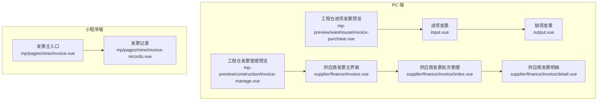
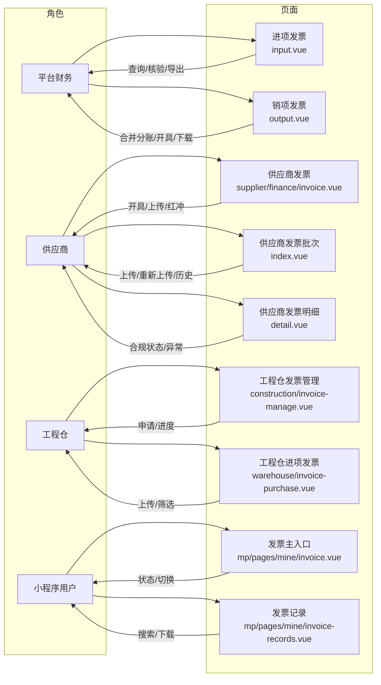
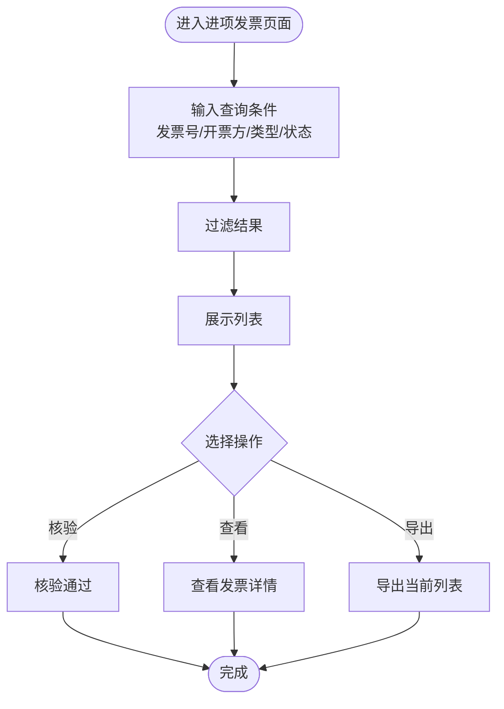
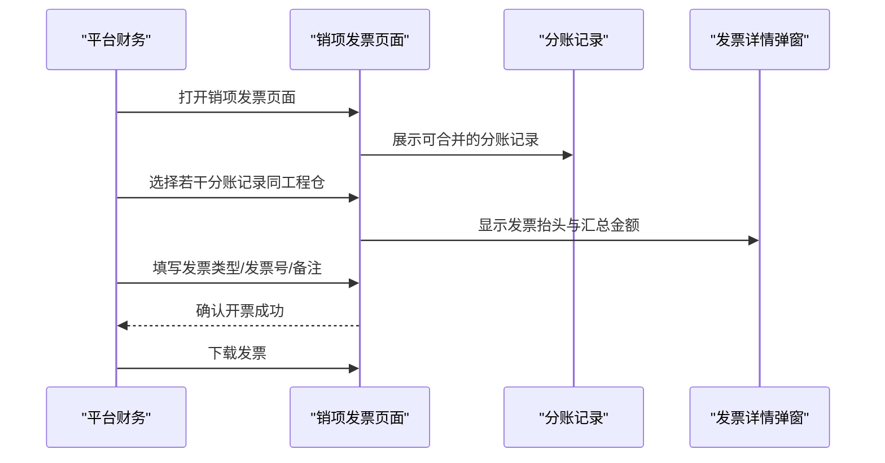
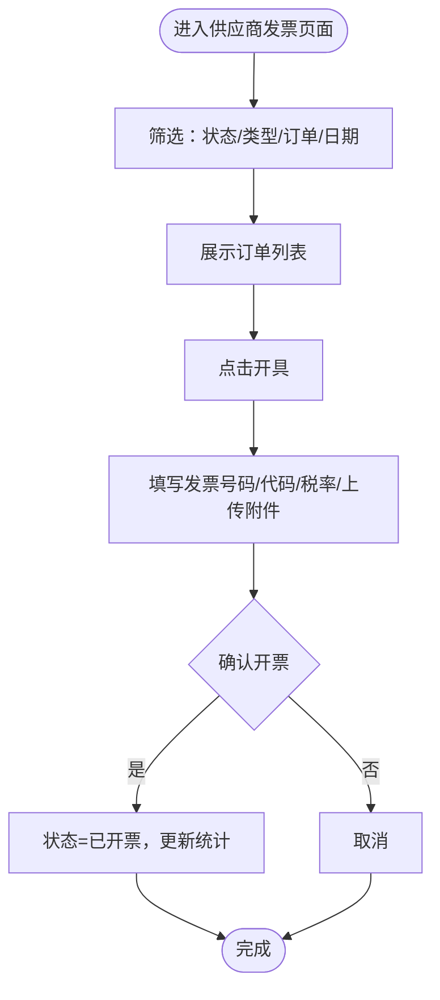
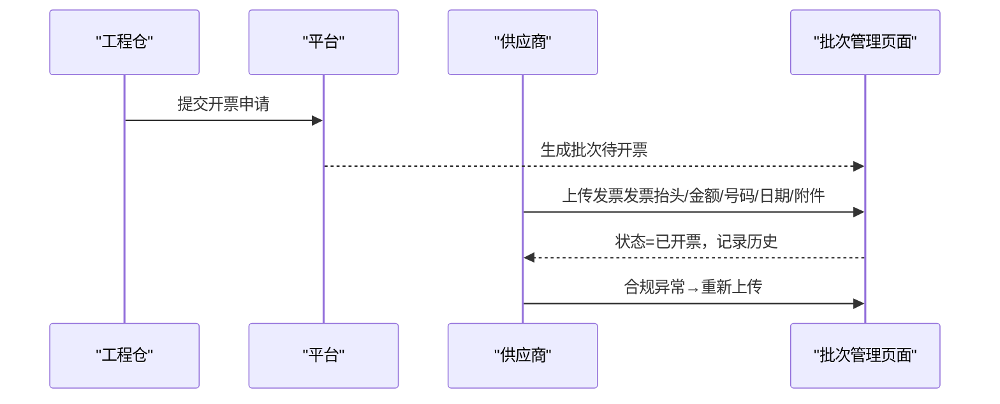
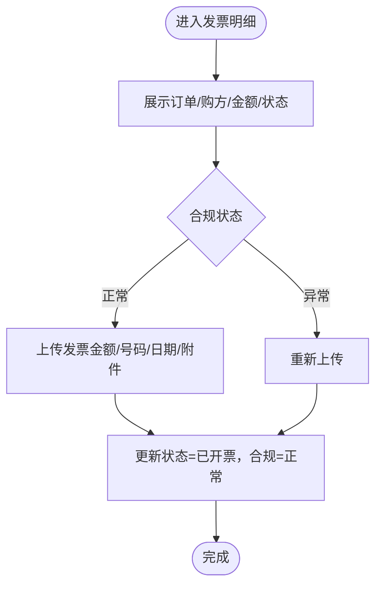
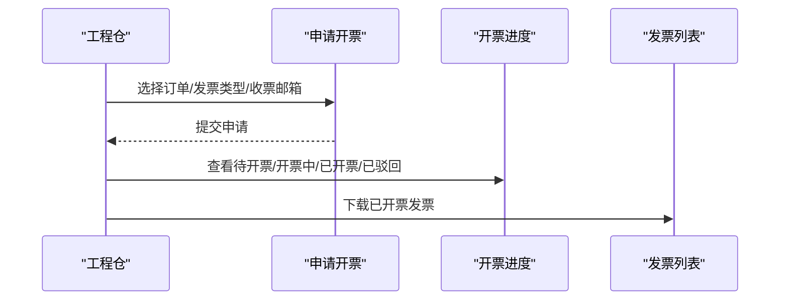
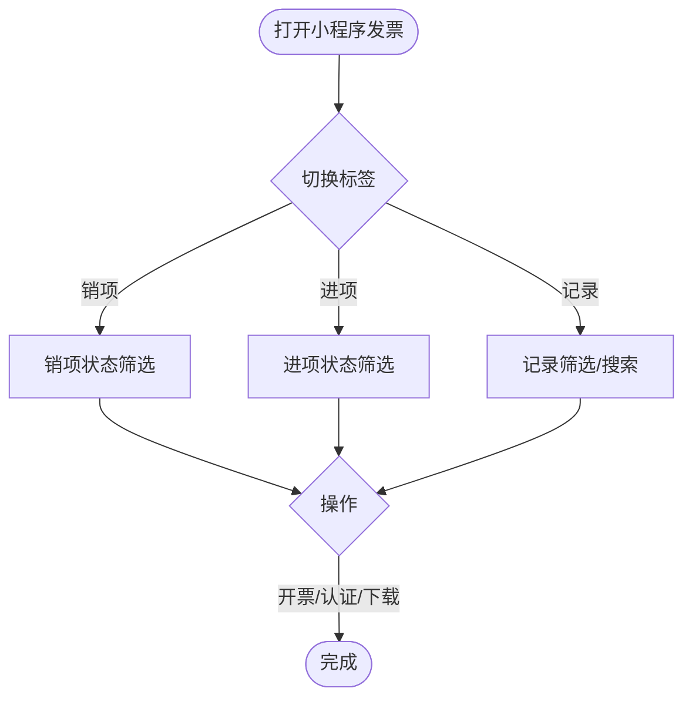
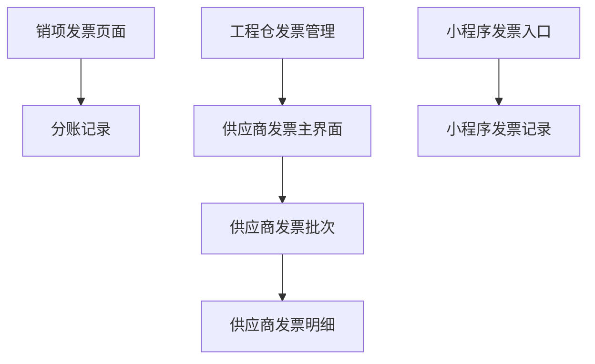

# 发票管理

<cite>
**本文引用的文件**
- [apps/pc/src/views/finance/invoice/input.vue](file://apps/pc/src/views/finance/invoice/input.vue)
- [apps/pc/src/views/finance/invoice/output.vue](file://apps/pc/src/views/finance/invoice/output.vue)
- [apps/pc/src/views/supplier/finance/invoice.vue](file://apps/pc/src/views/supplier/finance/invoice.vue)
- [apps/pc/src/views/supplier/finance/invoice/index.vue](file://apps/pc/src/views/supplier/finance/invoice/index.vue)
- [apps/pc/src/views/supplier/finance/invoice/detail.vue](file://apps/pc/src/views/supplier/finance/invoice/detail.vue)
- [apps/pc/src/views/mp-preview/pages/construction/invoice-manage.vue](file://apps/pc/src/views/mp-preview/pages/construction/invoice-manage.vue)
- [apps/pc/src/views/mp-preview/pages/warehouse/invoice-purchase.vue](file://apps/pc/src/views/mp-preview/pages/warehouse/invoice-purchase.vue)
- [apps/mp/src/pages/mine/invoice.vue](file://apps/mp/src/pages/mine/invoice.vue)
- [apps/mp/src/pages/mine/invoice-records.vue](file://apps/mp/src/pages/mine/invoice-records.vue)
- [docs/供应商端产品PRD.md](file://docs/供应商端产品PRD.md)
</cite>

## 目录
1. [简介](#简介)
2. [项目结构](#项目结构)
3. [核心组件](#核心组件)
4. [架构总览](#架构总览)
5. [详细组件分析](#详细组件分析)
6. [依赖关系分析](#依赖关系分析)
7. [性能考虑](#性能考虑)
8. [故障排查指南](#故障排查指南)
9. [结论](#结论)
10. [附录](#附录)

## 简介
本文件围绕“发票管理”主题，系统化梳理并解读工程仓与供应商两端的发票业务能力，包括进项发票管理、销项发票管理、发票开具、发票查询、发票状态管理、发票模板与打印、发票归档与异常处理、批量导入导出、统计分析与合规检查等。文档以仓库中现有页面与组件为依据，配合流程图与类图，帮助开发者与产品、财务人员快速理解与落地实现。

## 项目结构
发票管理功能主要分布在 PC 端与小程序端，覆盖“平台财务侧”“供应商侧”“工程仓侧”三个角色视角，并提供移动端预览页用于演示。

- 平台财务侧（PC）
  - 进项发票管理：apps/pc/src/views/finance/invoice/input.vue
  - 销项发票管理：apps/pc/src/views/finance/invoice/output.vue
- 供应商侧（PC）
  - 销项发票管理：apps/pc/src/views/supplier/finance/invoice.vue
  - 发票批次管理：apps/pc/src/views/supplier/finance/invoice/index.vue
  - 发票明细与合规：apps/pc/src/views/supplier/finance/invoice/detail.vue
- 工程仓侧（PC 预览）
  - 发票管理（含申请开票/进度）：apps/pc/src/views/mp-preview/pages/construction/invoice-manage.vue
  - 进项发票（上传/筛选）：apps/pc/src/views/mp-preview/pages/warehouse/invoice-purchase.vue
- 移动端（小程序）
  - 发票主入口与切换：apps/mp/src/pages/mine/invoice.vue
  - 发票记录与搜索：apps/mp/src/pages/mine/invoice-records.vue

图表来源
- [apps/pc/src/views/finance/invoice/input.vue:1-294](file://apps/pc/src/views/finance/invoice/input.vue#L1-L294)
- [apps/pc/src/views/finance/invoice/output.vue:1-665](file://apps/pc/src/views/finance/invoice/output.vue#L1-L665)
- [apps/pc/src/views/supplier/finance/invoice.vue:1-333](file://apps/pc/src/views/supplier/finance/invoice.vue#L1-L333)
- [apps/pc/src/views/supplier/finance/invoice/index.vue:1-652](file://apps/pc/src/views/supplier/finance/invoice/index.vue#L1-L652)
- [apps/pc/src/views/supplier/finance/invoice/detail.vue:166-318](file://apps/pc/src/views/supplier/finance/invoice/detail.vue#L166-L318)
- [apps/pc/src/views/mp-preview/pages/construction/invoice-manage.vue:1-610](file://apps/pc/src/views/mp-preview/pages/construction/invoice-manage.vue#L1-L610)
- [apps/pc/src/views/mp-preview/pages/warehouse/invoice-purchase.vue:1-43](file://apps/pc/src/views/mp-preview/pages/warehouse/invoice-purchase.vue#L1-L43)
- [apps/mp/src/pages/mine/invoice.vue:1-607](file://apps/mp/src/pages/mine/invoice.vue#L1-L607)
- [apps/mp/src/pages/mine/invoice-records.vue:1-383](file://apps/mp/src/pages/mine/invoice-records.vue#L1-L383)

章节来源
- [apps/pc/src/views/finance/invoice/input.vue:1-294](file://apps/pc/src/views/finance/invoice/input.vue#L1-L294)
- [apps/pc/src/views/finance/invoice/output.vue:1-665](file://apps/pc/src/views/finance/invoice/output.vue#L1-L665)
- [apps/pc/src/views/supplier/finance/invoice.vue:1-333](file://apps/pc/src/views/supplier/finance/invoice.vue#L1-L333)
- [apps/pc/src/views/supplier/finance/invoice/index.vue:1-652](file://apps/pc/src/views/supplier/finance/invoice/index.vue#L1-L652)
- [apps/pc/src/views/supplier/finance/invoice/detail.vue:166-318](file://apps/pc/src/views/supplier/finance/invoice/detail.vue#L166-L318)
- [apps/pc/src/views/mp-preview/pages/construction/invoice-manage.vue:1-610](file://apps/pc/src/views/mp-preview/pages/construction/invoice-manage.vue#L1-L610)
- [apps/pc/src/views/mp-preview/pages/warehouse/invoice-purchase.vue:1-43](file://apps/pc/src/views/mp-preview/pages/warehouse/invoice-purchase.vue#L1-L43)
- [apps/mp/src/pages/mine/invoice.vue:1-607](file://apps/mp/src/pages/mine/invoice.vue#L1-L607)
- [apps/mp/src/pages/mine/invoice-records.vue:1-383](file://apps/mp/src/pages/mine/invoice-records.vue#L1-L383)

## 核心组件
- 进项发票管理（平台财务侧）
  - 功能要点：发票查询、状态筛选、核验、导出
  - 关键字段：发票类型（专票/普票/电子）、开票方、金额、税额、价税合计、开票日期、核验状态
  - 关键流程：待核验 → 已核验入账 → 税务抵扣
- 销项发票管理（平台财务侧）
  - 功能要点：待开票/已开具/已作废筛选、按来源（工程仓申请/平台手动）筛选、批量选择分账记录合并开票、填写发票信息、下载
  - 关键字段：发票类型（专票/电子）、发票号码、收票方、关联分账单号、金额/税额/价税合计、状态、申请/开票时间
- 供应商销项发票管理
  - 功能要点：按状态/类型/日期筛选、开具发票（输入发票号码/代码、选择税率、上传附件）、下载、红冲
  - 关键字段：发票类型、发票状态、价税合计、税额、税率、购方名称/税号、开票日期
- 供应商发票批次管理
  - 功能要点：批次维度的待开票/已开票/已作废统计、上传发票、重新上传、查看发票详情与开具历史
  - 关键字段：批次号、工程仓、关联订单数/金额、可开票金额、发票抬头、发票号码、申请人、申请时间、合规状态
- 工程仓发票管理（预览）
  - 功能要点：发票列表/申请开票/开票进度；支持选择订单、发票类型、收票邮箱、金额汇总与提交申请
- 小程序发票入口与记录
  - 功能要点：销项/进项/开票记录三栏切换；状态筛选；记录搜索与下载

章节来源
- [apps/pc/src/views/finance/invoice/input.vue:111-294](file://apps/pc/src/views/finance/invoice/input.vue#L111-L294)
- [apps/pc/src/views/finance/invoice/output.vue:308-665](file://apps/pc/src/views/finance/invoice/output.vue#L308-L665)
- [apps/pc/src/views/supplier/finance/invoice.vue:174-333](file://apps/pc/src/views/supplier/finance/invoice.vue#L174-L333)
- [apps/pc/src/views/supplier/finance/invoice/index.vue:276-652](file://apps/pc/src/views/supplier/finance/invoice/index.vue#L276-L652)
- [apps/pc/src/views/supplier/finance/invoice/detail.vue:166-318](file://apps/pc/src/views/supplier/finance/invoice/detail.vue#L166-L318)
- [apps/pc/src/views/mp-preview/pages/construction/invoice-manage.vue:145-610](file://apps/pc/src/views/mp-preview/pages/construction/invoice-manage.vue#L145-L610)
- [apps/mp/src/pages/mine/invoice.vue:205-607](file://apps/mp/src/pages/mine/invoice.vue#L205-L607)
- [apps/mp/src/pages/mine/invoice-records.vue:80-383](file://apps/mp/src/pages/mine/invoice-records.vue#L80-L383)

## 架构总览
从“角色-页面-数据-流程”的角度，发票管理由以下层次构成：

- 角色层
  - 平台财务：负责进项核验、销项开票与统计
  - 供应商：负责销项发票开具、上传、合规校验
  - 工程仓：负责发票申请、进度跟踪、进项上传
  - 小程序用户：查看发票状态、下载、记录检索
- 页面层
  - PC 端：进项/销项发票管理、供应商发票主界面与批次管理、工程仓发票预览
  - 小程序端：发票主入口与记录页
- 数据层
  - 发票记录（含批次、明细、历史）
  - 分账记录（销项开票来源）
  - 订单与购方信息（供应商开票来源）
- 流程层
  - 进项：收票→核验→入账→抵扣
  - 销项：申请/手动→合并分账→开具→下载→合规校验
  - 异常：作废/红冲/重新上传/合规异常提示

图表来源
- [apps/pc/src/views/finance/invoice/input.vue:1-294](file://apps/pc/src/views/finance/invoice/input.vue#L1-L294)
- [apps/pc/src/views/finance/invoice/output.vue:1-665](file://apps/pc/src/views/finance/invoice/output.vue#L1-L665)
- [apps/pc/src/views/supplier/finance/invoice.vue:1-333](file://apps/pc/src/views/supplier/finance/invoice.vue#L1-L333)
- [apps/pc/src/views/supplier/finance/invoice/index.vue:1-652](file://apps/pc/src/views/supplier/finance/invoice/index.vue#L1-L652)
- [apps/pc/src/views/supplier/finance/invoice/detail.vue:166-318](file://apps/pc/src/views/supplier/finance/invoice/detail.vue#L166-L318)
- [apps/pc/src/views/mp-preview/pages/construction/invoice-manage.vue:1-610](file://apps/pc/src/views/mp-preview/pages/construction/invoice-manage.vue#L1-L610)
- [apps/pc/src/views/mp-preview/pages/warehouse/invoice-purchase.vue:1-43](file://apps/pc/src/views/mp-preview/pages/warehouse/invoice-purchase.vue#L1-L43)
- [apps/mp/src/pages/mine/invoice.vue:1-607](file://apps/mp/src/pages/mine/invoice.vue#L1-L607)
- [apps/mp/src/pages/mine/invoice-records.vue:1-383](file://apps/mp/src/pages/mine/invoice-records.vue#L1-L383)

## 详细组件分析

### 进项发票管理（平台财务侧）
- 功能点
  - 查询：按发票号、开票方、发票类型、核验状态筛选
  - 统计：本月进项金额/税额、待核验张数、发票总数
  - 操作：查看、核验、导出
- 关键字段
  - 发票类型映射：专票/普票/电子
  - 状态映射：待核验/已核验/已作废
- 业务流程
  - 收集发票→平台入库→人工核验→核验通过后入账→可用于税务抵扣

图表来源
- [apps/pc/src/views/finance/invoice/input.vue:111-294](file://apps/pc/src/views/finance/invoice/input.vue#L111-L294)

章节来源
- [apps/pc/src/views/finance/invoice/input.vue:111-294](file://apps/pc/src/views/finance/invoice/input.vue#L111-L294)

### 销项发票管理（平台财务侧）
- 功能点
  - 筛选：全部/待开票/已开具/已作废；按发票号、收票方、来源、日期范围
  - 合并开票：选择“分账已完成”的记录，支持多选合并；相同工程仓可合并
  - 开具：填写发票类型、发票号码、备注；下载发票
- 关键字段
  - 来源：工程仓申请/平台手动
  - 状态：待开票/已开具/已作废
  - 关联分账单号：用于合并开票
- 业务流程
  - 工程仓结算→生成分账→财务选择分账记录→合并开票→生成发票→交付工程仓

图表来源
- [apps/pc/src/views/finance/invoice/output.vue:308-665](file://apps/pc/src/views/finance/invoice/output.vue#L308-L665)

章节来源
- [apps/pc/src/views/finance/invoice/output.vue:308-665](file://apps/pc/src/views/finance/invoice/output.vue#L308-L665)

### 供应商销项发票管理
- 功能点
  - 筛选：按状态（待开票/已开票/已红冲）、发票类型、订单号、日期范围
  - 开具：自动带入订单信息，填写发票号码/代码、选择税率、上传附件
  - 下载与红冲：已开票可下载，支持红冲
- 关键字段
  - 发票类型：专票/电子普票
  - 状态颜色：待开票（橙）/已开票（绿）/已红冲（红）
- 业务流程
  - 选择待开票订单→系统自动填充购方信息→填写发票信息→上传附件→完成开票→通知采购方

图表来源
- [apps/pc/src/views/supplier/finance/invoice.vue:174-333](file://apps/pc/src/views/supplier/finance/invoice.vue#L174-L333)

章节来源
- [apps/pc/src/views/supplier/finance/invoice.vue:174-333](file://apps/pc/src/views/supplier/finance/invoice.vue#L174-L333)

### 供应商发票批次管理
- 功能点
  - 批次维度：全部/待开票/已开票/已作废；按工程仓、申请时间筛选
  - 操作：上传发票、重新上传、查看发票详情、查看开具历史
- 关键字段
  - 批次号、工程仓、关联订单数/金额、可开票金额、发票抬头/号码/日期、合规状态
- 业务流程
  - 工程仓申请→平台生成批次→供应商上传发票→合规校验→历史记录沉淀

图表来源
- [apps/pc/src/views/supplier/finance/invoice/index.vue:276-652](file://apps/pc/src/views/supplier/finance/invoice/index.vue#L276-L652)

章节来源
- [apps/pc/src/views/supplier/finance/invoice/index.vue:276-652](file://apps/pc/src/views/supplier/finance/invoice/index.vue#L276-L652)

### 供应商发票明细与合规
- 功能点
  - 明细页：展示订单、购方信息、发票状态、合规状态、异常原因
  - 操作：上传发票、查看订单、返回
- 关键字段
  - 状态：未开票/已开票
  - 合规状态：正常/异常（异常时可重新上传）

图表来源
- [apps/pc/src/views/supplier/finance/invoice/detail.vue:166-318](file://apps/pc/src/views/supplier/finance/invoice/detail.vue#L166-L318)

章节来源
- [apps/pc/src/views/supplier/finance/invoice/detail.vue:166-318](file://apps/pc/src/views/supplier/finance/invoice/detail.vue#L166-L318)

### 工程仓发票管理（预览）
- 功能点
  - 发票列表：状态（已开票/待开票）、金额、开票时间
  - 申请开票：选择订单、发票类型、收票邮箱、金额汇总、提交申请
  - 开票进度：状态（待开票/开票中/已开票/已驳回）、申请金额、申请时间、驳回原因
- 业务流程
  - 工程仓选择订单→填写发票信息→提交申请→财务审核/开票→进度反馈→发票下载

图表来源
- [apps/pc/src/views/mp-preview/pages/construction/invoice-manage.vue:145-610](file://apps/pc/src/views/mp-preview/pages/construction/invoice-manage.vue#L145-L610)

章节来源
- [apps/pc/src/views/mp-preview/pages/construction/invoice-manage.vue:145-610](file://apps/pc/src/views/mp-preview/pages/construction/invoice-manage.vue#L145-L610)

### 小程序发票入口与记录
- 功能点
  - 三栏切换：销项发票/进项发票/开票记录
  - 状态筛选：销项（全部/待开票/开票中/已开票）；进项（全部/待收票/已收票/已认证）
  - 记录检索：按发票号/订单号搜索；查看/下载
- 业务流程
  - 用户在小程序查看发票状态→根据状态执行相应动作（开票/认证/下载）

图表来源
- [apps/mp/src/pages/mine/invoice.vue:205-607](file://apps/mp/src/pages/mine/invoice.vue#L205-L607)
- [apps/mp/src/pages/mine/invoice-records.vue:80-383](file://apps/mp/src/pages/mine/invoice-records.vue#L80-L383)

章节来源
- [apps/mp/src/pages/mine/invoice.vue:205-607](file://apps/mp/src/pages/mine/invoice.vue#L205-L607)
- [apps/mp/src/pages/mine/invoice-records.vue:80-383](file://apps/mp/src/pages/mine/invoice-records.vue#L80-L383)

## 依赖关系分析
- 组件内聚性
  - 各页面职责清晰：进项/销项/供应商/工程仓/小程序分别承载不同角色的发票能力
- 组件耦合度
  - 销项发票页面与分账记录存在强关联（合并开票）
  - 供应商发票批次与明细存在强关联（上传/重新上传/历史）
- 外部依赖
  - 文件上传（PDF/JPG/PNG）
  - 时间选择器/日期范围选择
  - 表格/分页/标签页/模态框等 UI 组件库

图表来源
- [apps/pc/src/views/finance/invoice/output.vue:308-665](file://apps/pc/src/views/finance/invoice/output.vue#L308-L665)
- [apps/pc/src/views/supplier/finance/invoice/index.vue:276-652](file://apps/pc/src/views/supplier/finance/invoice/index.vue#L276-L652)
- [apps/pc/src/views/supplier/finance/invoice/detail.vue:166-318](file://apps/pc/src/views/supplier/finance/invoice/detail.vue#L166-L318)
- [apps/pc/src/views/mp-preview/pages/construction/invoice-manage.vue:145-610](file://apps/pc/src/views/mp-preview/pages/construction/invoice-manage.vue#L145-L610)
- [apps/mp/src/pages/mine/invoice.vue:205-607](file://apps/mp/src/pages/mine/invoice.vue#L205-L607)
- [apps/mp/src/pages/mine/invoice-records.vue:80-383](file://apps/mp/src/pages/mine/invoice-records.vue#L80-L383)

章节来源
- [apps/pc/src/views/finance/invoice/output.vue:308-665](file://apps/pc/src/views/finance/invoice/output.vue#L308-L665)
- [apps/pc/src/views/supplier/finance/invoice/index.vue:276-652](file://apps/pc/src/views/supplier/finance/invoice/index.vue#L276-L652)
- [apps/pc/src/views/supplier/finance/invoice/detail.vue:166-318](file://apps/pc/src/views/supplier/finance/invoice/detail.vue#L166-L318)
- [apps/pc/src/views/mp-preview/pages/construction/invoice-manage.vue:145-610](file://apps/pc/src/views/mp-preview/pages/construction/invoice-manage.vue#L145-L610)
- [apps/mp/src/pages/mine/invoice.vue:205-607](file://apps/mp/src/pages/mine/invoice.vue#L205-L607)
- [apps/mp/src/pages/mine/invoice-records.vue:80-383](file://apps/mp/src/pages/mine/invoice-records.vue#L80-L383)

## 性能考虑
- 列表渲染优化
  - 使用虚拟滚动/分页，避免一次性渲染大量发票记录
  - 对复杂表格列采用懒加载或延迟渲染
- 查询与筛选
  - 前端筛选仅适用于有限数据集；建议后端分页与条件索引
  - 日期范围/关键字搜索建议防抖
- 文件上传
  - 控制单次上传文件数量与大小，提供进度提示
- 状态与合规
  - 合规状态异常时，提供明确提示与重新上传入口，减少重复请求

## 故障排查指南
- 常见问题
  - 发票号码为空/格式不正确：供应商上传时校验发票号码必填与格式
  - 开票金额超限：开票金额 ≤ 订单金额（含多次开票）
  - 三流合一不一致：订单金额 ≈ 支付金额 ≈ 开票金额（±0.01元容差）
  - 作废/红冲：仅“已开票”状态可红冲；作废需记录原因
- 定位方法
  - 查看发票状态与合规状态（正常/异常）
  - 检查开具历史与异常原因
  - 核对订单金额、支付金额、开票金额一致性
- 处理建议
  - 异常状态：引导重新上传或修正信息
  - 红冲流程：补充红冲原因并生成负数记录

章节来源
- [apps/pc/src/views/supplier/finance/invoice.vue:275-333](file://apps/pc/src/views/supplier/finance/invoice.vue#L275-L333)
- [apps/pc/src/views/supplier/finance/invoice/index.vue:556-652](file://apps/pc/src/views/supplier/finance/invoice/index.vue#L556-L652)
- [docs/供应商端产品PRD.md:401-432](file://docs/供应商端产品PRD.md#L401-L432)

## 结论
本项目围绕“进项核验—销项开票—合规校验—归档下载”的发票全生命周期，提供了平台财务侧、供应商侧、工程仓侧与小程序端的完整能力矩阵。通过分账合并开票、批次化管理、合规状态可视化与异常处理机制，有效支撑了业务的合规与效率目标。后续可在后端接口对接、批量导入导出、统计分析与合规检查方面进一步完善。

## 附录
- 发票类型与状态映射参考
  - 发票类型：专票/普票/电子（平台财务侧）
  - 发票类型：专票/电子普票（供应商侧）
  - 状态：待核验/已核验/已作废（平台财务侧）
  - 状态：待开票/已开票/已红冲（供应商侧）
  - 状态：待开票/开票中/已开票/已驳回（工程仓侧）
- API 调用与数据同步建议
  - 建议以“分页+条件筛选+缓存”方式拉取发票列表
  - 开票/上传/红冲等操作采用幂等设计，携带唯一请求 ID
  - 同步流程：前端提交→后端校验→异步处理→回调更新状态与历史