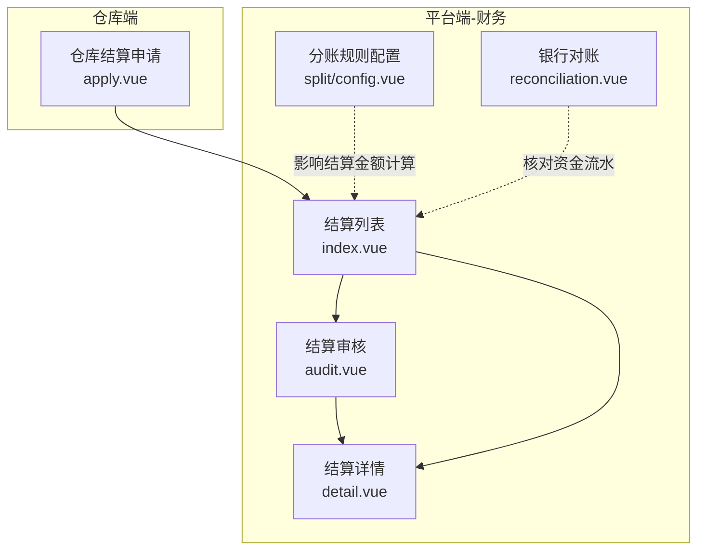
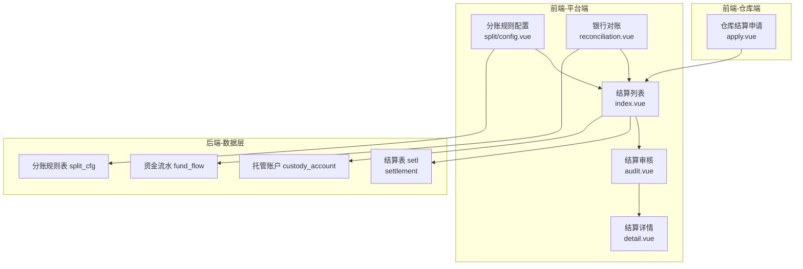
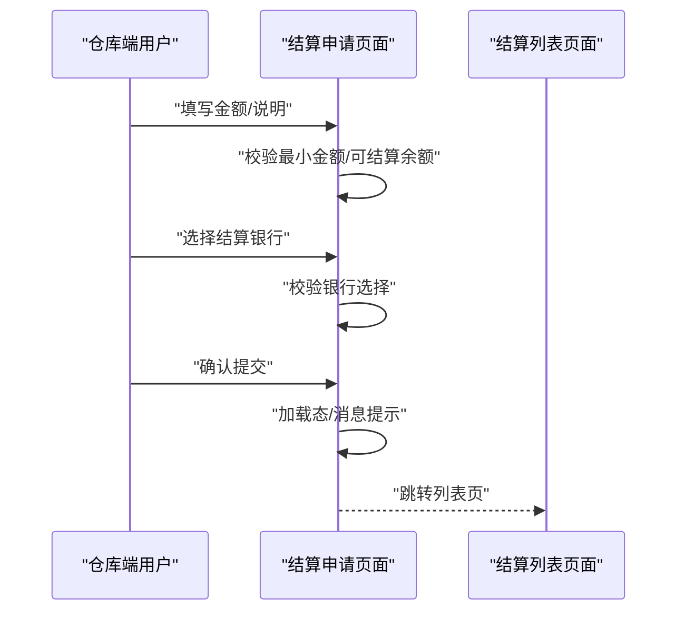
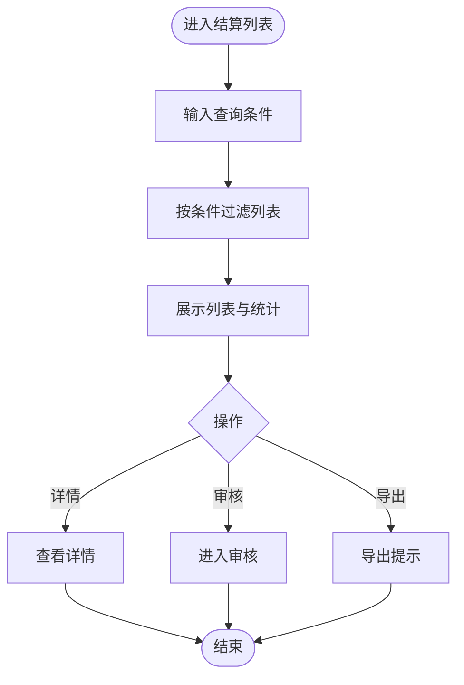
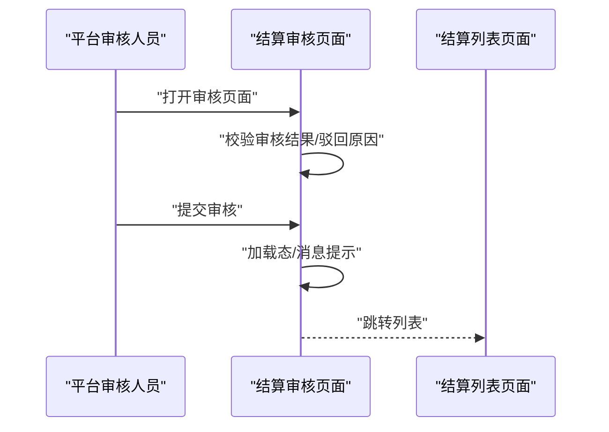
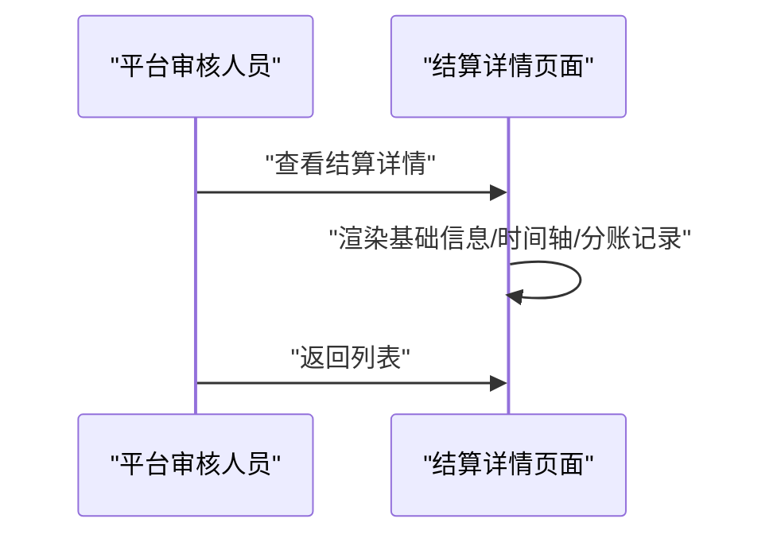
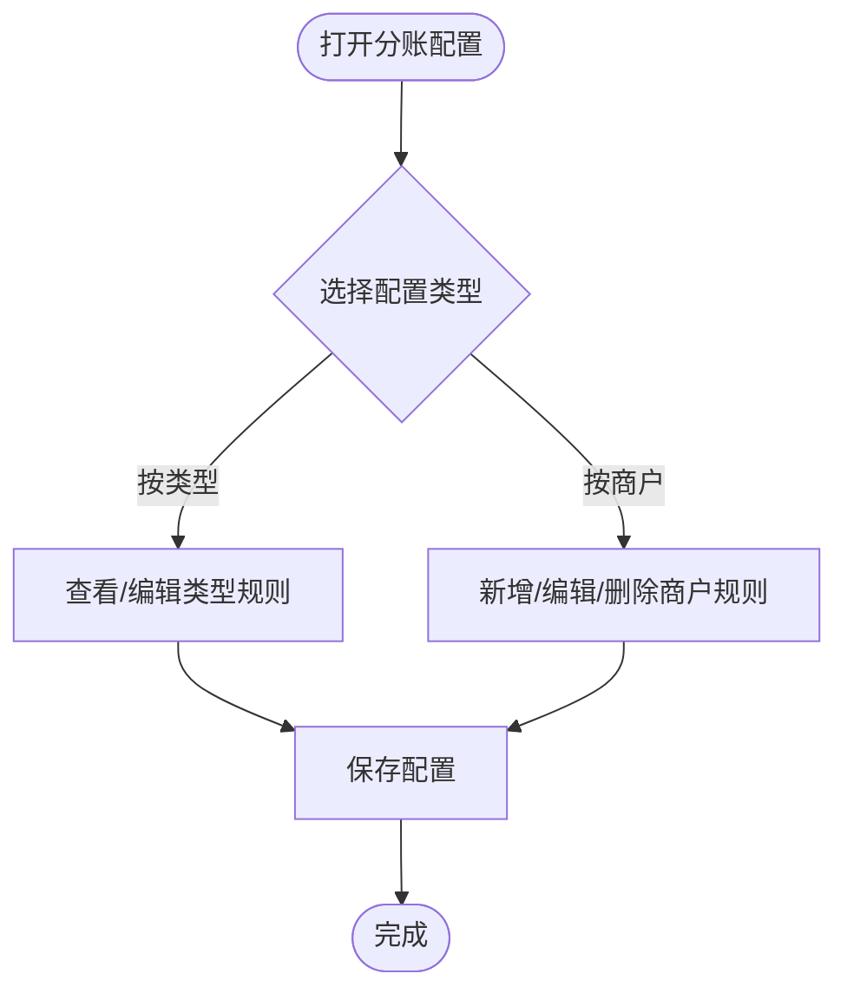
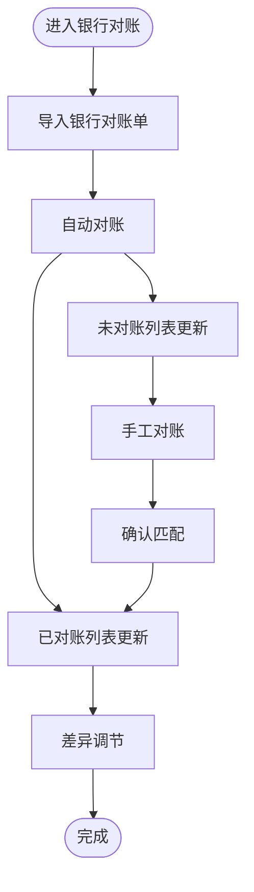
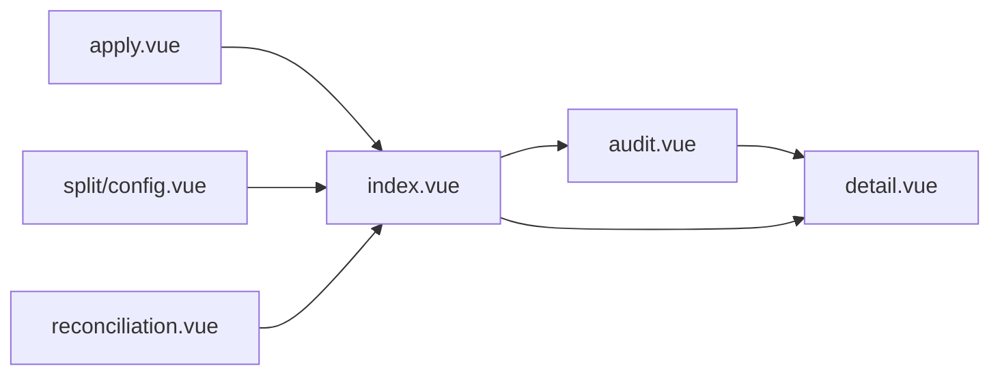

# 结算管理

<cite>
**本文引用的文件**
- [apps/pc/src/views/finance/settlement/index.vue](file://apps/pc/src/views/finance/settlement/index.vue)
- [apps/pc/src/views/finance/settlement/audit.vue](file://apps/pc/src/views/finance/settlement/audit.vue)
- [apps/pc/src/views/finance/settlement/detail.vue](file://apps/pc/src/views/finance/settlement/detail.vue)
- [apps/pc/src/views/warehouse/finance/settlement/apply.vue](file://apps/pc/src/views/warehouse/finance/settlement/apply.vue)
- [apps/pc/src/views/finance/split/config.vue](file://apps/pc/src/views/finance/split/config.vue)
- [apps/pc/src/views/supplier/finance/reconciliation.vue](file://apps/pc/src/views/supplier/finance/reconciliation.vue)
- [docs/PRD/02-业务流程设计.md](file://docs/PRD/02-业务流程设计.md)
- [docs/PRD/03-数据模型与表结构.md](file://docs/PRD/03-数据模型与表结构.md)
</cite>

## 目录
1. [简介](#简介)
2. [项目结构](#项目结构)
3. [核心组件](#核心组件)
4. [架构总览](#架构总览)
5. [详细组件分析](#详细组件分析)
6. [依赖分析](#依赖分析)
7. [性能考虑](#性能考虑)
8. [故障排查指南](#故障排查指南)
9. [结论](#结论)
10. [附录](#附录)

## 简介
本文件围绕“结算管理”主题，系统化梳理从“结算申请—结算审核—结算执行—结算详情”的全流程，并结合仓库端结算申请、平台端结算审核与列表、以及结算对账与分账规则配置等前端界面，给出业务流程、数据模型映射、状态流转与异常处理建议。文档同时提供结算周期设置、结算金额计算、结算单生成、状态跟踪、风险控制与报表分析的实践指引，帮助读者快速理解并落地结算能力。

## 项目结构
结算管理相关页面主要分布在 PC 端财务模块与仓库端财务模块：
- 仓库端结算申请：确认结算信息、选择结算银行、提交申请
- 平台端结算管理：结算列表、结算审核、结算详情
- 财务分账规则：按商户类型与按商户维度配置分账比例
- 银行对账：银行流水与系统流水的自动/手工对账与差异调节

图表来源
- [apps/pc/src/views/warehouse/finance/settlement/apply.vue:1-246](file://apps/pc/src/views/warehouse/finance/settlement/apply.vue#L1-L246)
- [apps/pc/src/views/finance/settlement/index.vue:1-263](file://apps/pc/src/views/finance/settlement/index.vue#L1-L263)
- [apps/pc/src/views/finance/settlement/audit.vue:1-168](file://apps/pc/src/views/finance/settlement/audit.vue#L1-L168)
- [apps/pc/src/views/finance/settlement/detail.vue:1-159](file://apps/pc/src/views/finance/settlement/detail.vue#L1-L159)
- [apps/pc/src/views/finance/split/config.vue:1-283](file://apps/pc/src/views/finance/split/config.vue#L1-L283)
- [apps/pc/src/views/supplier/finance/reconciliation.vue:1-354](file://apps/pc/src/views/supplier/finance/reconciliation.vue#L1-L354)

章节来源
- [apps/pc/src/views/warehouse/finance/settlement/apply.vue:1-246](file://apps/pc/src/views/warehouse/finance/settlement/apply.vue#L1-L246)
- [apps/pc/src/views/finance/settlement/index.vue:1-263](file://apps/pc/src/views/finance/settlement/index.vue#L1-L263)
- [apps/pc/src/views/finance/settlement/audit.vue:1-168](file://apps/pc/src/views/finance/settlement/audit.vue#L1-L168)
- [apps/pc/src/views/finance/settlement/detail.vue:1-159](file://apps/pc/src/views/finance/settlement/detail.vue#L1-L159)
- [apps/pc/src/views/finance/split/config.vue:1-283](file://apps/pc/src/views/finance/split/config.vue#L1-L283)
- [apps/pc/src/views/supplier/finance/reconciliation.vue:1-354](file://apps/pc/src/views/supplier/finance/reconciliation.vue#L1-L354)

## 核心组件
- 仓库端结算申请（apply.vue）
  - 功能要点：三步式流程（确认结算信息→选择结算银行→提交申请），校验最小结算金额与银行选择，提交后跳转列表页。
  - 关键交互：步骤切换、金额输入校验、银行卡选择、提交加载态与消息提示。
- 平台端结算列表（index.vue）
  - 功能要点：查询筛选（单号、商户、状态、日期）、分页、统计卡片、状态标签颜色映射、查看详情与审核入口。
  - 关键交互：搜索过滤、导出提示、分页回调。
- 平台端结算审核（audit.vue）
  - 功能要点：展示申请信息、账户余额与交易流水、审核结果选择（通过/驳回）、备注与原因必填逻辑、提交后跳转列表。
  - 关键交互：表单校验、提交加载态、消息提示。
- 平台端结算详情（detail.vue）
  - 功能要点：展示结算单基础信息、状态时间轴、关联分账记录表格。
  - 关键交互：返回按钮、时间轴状态样式。
- 分账规则配置（split/config.vue）
  - 功能要点：按商户类型与按商户两种配置视图；支持新增、编辑、删除、启用/禁用；平台与商户比例联动。
  - 关键交互：切换标签页、查询过滤、弹窗表单、开关状态。
- 银行对账（reconciliation.vue）
  - 功能要点：未对账/已对账/差异调节三面板；支持导入银行对账单、自动对账、手工对账、忽略与取消对账。
  - 关键交互：上传、自动匹配、手工匹配弹窗、搜索候选流水。

章节来源
- [apps/pc/src/views/warehouse/finance/settlement/apply.vue:1-246](file://apps/pc/src/views/warehouse/finance/settlement/apply.vue#L1-L246)
- [apps/pc/src/views/finance/settlement/index.vue:1-263](file://apps/pc/src/views/finance/settlement/index.vue#L1-L263)
- [apps/pc/src/views/finance/settlement/audit.vue:1-168](file://apps/pc/src/views/finance/settlement/audit.vue#L1-L168)
- [apps/pc/src/views/finance/settlement/detail.vue:1-159](file://apps/pc/src/views/finance/settlement/detail.vue#L1-L159)
- [apps/pc/src/views/finance/split/config.vue:1-283](file://apps/pc/src/views/finance/split/config.vue#L1-L283)
- [apps/pc/src/views/supplier/finance/reconciliation.vue:1-354](file://apps/pc/src/views/supplier/finance/reconciliation.vue#L1-L354)

## 架构总览
结算管理从前端到后端的数据与流程关系如下：

图表来源
- [apps/pc/src/views/warehouse/finance/settlement/apply.vue:1-246](file://apps/pc/src/views/warehouse/finance/settlement/apply.vue#L1-L246)
- [apps/pc/src/views/finance/settlement/index.vue:1-263](file://apps/pc/src/views/finance/settlement/index.vue#L1-L263)
- [apps/pc/src/views/finance/settlement/audit.vue:1-168](file://apps/pc/src/views/finance/settlement/audit.vue#L1-L168)
- [apps/pc/src/views/finance/settlement/detail.vue:1-159](file://apps/pc/src/views/finance/settlement/detail.vue#L1-L159)
- [apps/pc/src/views/finance/split/config.vue:1-283](file://apps/pc/src/views/finance/split/config.vue#L1-L283)
- [apps/pc/src/views/supplier/finance/reconciliation.vue:1-354](file://apps/pc/src/views/supplier/finance/reconciliation.vue#L1-L354)
- [docs/PRD/03-数据模型与表结构.md:771-794](file://docs/PRD/03-数据模型与表结构.md#L771-L794)

## 详细组件分析

### 仓库端结算申请（apply.vue）
- 业务流程
  - 第一步：确认可结算金额与最小金额限制，输入结算金额并填写说明。
  - 第二步：选择结算银行（默认卡或添加银行卡）。
  - 第三步：确认提交信息，点击提交后进入加载态并提示成功，跳转至结算列表。
- 关键控制点
  - 金额校验：最小金额限制、可结算余额上限。
  - 银行选择：必选项，支持添加银行卡。
  - 提交：防重复提交、加载态、消息提示。
- 状态与数据
  - 申请成功后，平台侧生成结算单并进入“待审核”状态，后续由平台审核人员处理。

图表来源
- [apps/pc/src/views/warehouse/finance/settlement/apply.vue:1-246](file://apps/pc/src/views/warehouse/finance/settlement/apply.vue#L1-L246)

章节来源
- [apps/pc/src/views/warehouse/finance/settlement/apply.vue:1-246](file://apps/pc/src/views/warehouse/finance/settlement/apply.vue#L1-L246)

### 平台端结算列表（index.vue）
- 业务流程
  - 查询筛选：支持按结算单号、商户、状态、日期范围筛选。
  - 列表展示：包含金额、银行信息、申请时间、状态、到账时间等字段。
  - 操作：查看详情、审核入口（仅“待审核”状态）。
  - 统计：待审核笔数、待审核金额、本月已结算、本月结算笔数。
- 关键控制点
  - 状态颜色与文案映射，分页与总数更新。
  - 导出：无数据时提示，有数据时提示导出条数。
- 状态与数据
  - 状态枚举：待审核、已通过、处理中、已到账、已驳回、已失败。

图表来源
- [apps/pc/src/views/finance/settlement/index.vue:1-263](file://apps/pc/src/views/finance/settlement/index.vue#L1-L263)

章节来源
- [apps/pc/src/views/finance/settlement/index.vue:1-263](file://apps/pc/src/views/finance/settlement/index.vue#L1-L263)

### 平台端结算审核（audit.vue）
- 业务流程
  - 展示结算申请信息、账户余额与可用余额、近期交易流水。
  - 审核结果：通过/驳回；驳回时需填写原因。
  - 提交后跳转至结算列表。
- 关键控制点
  - 表单必填校验：驳回原因必填。
  - 提交加载态与消息提示。
- 状态与数据
  - 审核通过后进入“处理中”，最终“已到账”。

图表来源
- [apps/pc/src/views/finance/settlement/audit.vue:1-168](file://apps/pc/src/views/finance/settlement/audit.vue#L1-L168)

章节来源
- [apps/pc/src/views/finance/settlement/audit.vue:1-168](file://apps/pc/src/views/finance/settlement/audit.vue#L1-L168)

### 平台端结算详情（detail.vue）
- 业务流程
  - 展示结算单基础信息（单号、状态、商户、金额、银行、到账时间等）。
  - 时间轴展示状态流转（已创建、已通过、处理中、已到账）。
  - 关联分账记录表格（分账单号、订单号、交易金额、分账金额、分账时间）。
- 关键控制点
  - 返回按钮、时间轴状态样式、金额字段高亮。

图表来源
- [apps/pc/src/views/finance/settlement/detail.vue:1-159](file://apps/pc/src/views/finance/settlement/detail.vue#L1-L159)

章节来源
- [apps/pc/src/views/finance/settlement/detail.vue:1-159](file://apps/pc/src/views/finance/settlement/detail.vue#L1-L159)

### 分账规则配置（split/config.vue）
- 业务流程
  - 按商户类型配置：展示平台与商户分账比例、启用/禁用状态。
  - 按商户配置：支持新增、编辑、删除、启用/禁用；平台比例与商户比例互斥联动。
- 关键控制点
  - 切换标签页、查询过滤、弹窗表单、开关状态。
- 与结算的关系
  - 分账规则决定结算单中的“平台服务费/商户分账金额”，影响结算金额计算与到账金额。

图表来源
- [apps/pc/src/views/finance/split/config.vue:1-283](file://apps/pc/src/views/finance/split/config.vue#L1-L283)

章节来源
- [apps/pc/src/views/finance/split/config.vue:1-283](file://apps/pc/src/views/finance/split/config.vue#L1-L283)

### 银行对账（reconciliation.vue）
- 业务流程
  - 导入银行对账单、自动对账、手工对账、忽略未匹配、取消对账。
  - 差异调节：展示银行账面余额与系统账面余额差异及调节项。
- 关键控制点
  - 上传文件、自动匹配、手工匹配弹窗、搜索候选系统流水、确认匹配与取消对账。
- 与结算的关系
  - 对账准确是结算执行与报表分析的基础，有助于发现结算异常与风控问题。

图表来源
- [apps/pc/src/views/supplier/finance/reconciliation.vue:1-354](file://apps/pc/src/views/supplier/finance/reconciliation.vue#L1-L354)

章节来源
- [apps/pc/src/views/supplier/finance/reconciliation.vue:1-354](file://apps/pc/src/views/supplier/finance/reconciliation.vue#L1-L354)

## 依赖分析
- 页面间依赖
  - 仓库端结算申请 → 平台端结算列表
  - 平台端结算列表 → 结算审核（仅“待审核”状态）
  - 结算审核 → 结算详情
  - 结算列表 → 结算详情
- 数据依赖
  - 结算列表依赖结算表与托管账户表，用于展示状态与余额。
  - 分账规则配置影响结算单中的服务费与实际金额。
  - 银行对账依赖资金流水表，确保系统与银行数据一致。

图表来源
- [apps/pc/src/views/warehouse/finance/settlement/apply.vue:1-246](file://apps/pc/src/views/warehouse/finance/settlement/apply.vue#L1-L246)
- [apps/pc/src/views/finance/settlement/index.vue:1-263](file://apps/pc/src/views/finance/settlement/index.vue#L1-L263)
- [apps/pc/src/views/finance/settlement/audit.vue:1-168](file://apps/pc/src/views/finance/settlement/audit.vue#L1-L168)
- [apps/pc/src/views/finance/settlement/detail.vue:1-159](file://apps/pc/src/views/finance/settlement/detail.vue#L1-L159)
- [apps/pc/src/views/finance/split/config.vue:1-283](file://apps/pc/src/views/finance/split/config.vue#L1-L283)
- [apps/pc/src/views/supplier/finance/reconciliation.vue:1-354](file://apps/pc/src/views/supplier/finance/reconciliation.vue#L1-L354)

章节来源
- [apps/pc/src/views/warehouse/finance/settlement/apply.vue:1-246](file://apps/pc/src/views/warehouse/finance/settlement/apply.vue#L1-L246)
- [apps/pc/src/views/finance/settlement/index.vue:1-263](file://apps/pc/src/views/finance/settlement/index.vue#L1-L263)
- [apps/pc/src/views/finance/settlement/audit.vue:1-168](file://apps/pc/src/views/finance/settlement/audit.vue#L1-L168)
- [apps/pc/src/views/finance/settlement/detail.vue:1-159](file://apps/pc/src/views/finance/settlement/detail.vue#L1-L159)
- [apps/pc/src/views/finance/split/config.vue:1-283](file://apps/pc/src/views/finance/split/config.vue#L1-L283)
- [apps/pc/src/views/supplier/finance/reconciliation.vue:1-354](file://apps/pc/src/views/supplier/finance/reconciliation.vue#L1-L354)

## 性能考虑
- 列表查询与分页
  - 使用本地过滤与分页，避免一次性渲染大量数据；必要时可引入服务端分页与懒加载。
- 表单校验与提交
  - 在提交前进行前端校验，减少无效请求；提交采用加载态与防重复提交策略。
- 对账效率
  - 自动对账采用批量匹配策略，手工对账使用搜索与候选列表，降低人工成本。
- 数据一致性
  - 结算金额与分账规则联动计算，建议在前端做实时预估并在提交时二次校验。

## 故障排查指南
- 结算申请失败
  - 检查最小金额与可结算余额限制；确认银行选择是否为空。
  - 参考：[apps/pc/src/views/warehouse/finance/settlement/apply.vue:126-140](file://apps/pc/src/views/warehouse/finance/settlement/apply.vue#L126-L140)
- 审核驳回未填写原因
  - 驳回时需填写原因，否则提示并阻止提交。
  - 参考：[apps/pc/src/views/finance/settlement/audit.vue:115-129](file://apps/pc/src/views/finance/settlement/audit.vue#L115-L129)
- 列表无数据导出
  - 导出前检查列表长度，无数据时提示。
  - 参考：[apps/pc/src/views/finance/settlement/index.vue:230-236](file://apps/pc/src/views/finance/settlement/index.vue#L230-L236)
- 对账异常
  - 未匹配流水较多时，优先使用自动对账；手工对账时注意金额差异提示。
  - 参考：[apps/pc/src/views/supplier/finance/reconciliation.vue:264-270](file://apps/pc/src/views/supplier/finance/reconciliation.vue#L264-L270)

章节来源
- [apps/pc/src/views/warehouse/finance/settlement/apply.vue:126-140](file://apps/pc/src/views/warehouse/finance/settlement/apply.vue#L126-L140)
- [apps/pc/src/views/finance/settlement/audit.vue:115-129](file://apps/pc/src/views/finance/settlement/audit.vue#L115-L129)
- [apps/pc/src/views/finance/settlement/index.vue:230-236](file://apps/pc/src/views/finance/settlement/index.vue#L230-L236)
- [apps/pc/src/views/supplier/finance/reconciliation.vue:264-270](file://apps/pc/src/views/supplier/finance/reconciliation.vue#L264-L270)

## 结论
结算管理以“仓库端申请—平台端审核—平台端执行—对账核对—报表分析”为主线，形成闭环。前端通过三步式申请、列表筛选与状态可视化、分账规则配置与银行对账，支撑结算业务的高效运转。建议在实际落地中强化风控校验（如最小/最大金额、可用余额、对账差异阈值）、完善异常处理（驳回原因、对账差异调节）与报表分析（结算支出、结算笔数、到账时效）。

## 附录

### 业务流程与状态映射
- 结算申请
  - 仓库端填写金额与银行信息，提交后生成结算单，状态为“待审核”。
- 结算审核
  - 平台审核通过进入“处理中”，最终“已到账”；驳回需填写原因。
- 结算执行与对账
  - 对账准确后资金结算完成，系统记录资金流水与结算明细。
- 结算报表
  - 结算列表统计“待审核笔数/金额”、“本月已结算/笔数”，支持导出。

章节来源
- [apps/pc/src/views/warehouse/finance/settlement/apply.vue:1-246](file://apps/pc/src/views/warehouse/finance/settlement/apply.vue#L1-L246)
- [apps/pc/src/views/finance/settlement/index.vue:1-263](file://apps/pc/src/views/finance/settlement/index.vue#L1-L263)
- [apps/pc/src/views/finance/settlement/audit.vue:1-168](file://apps/pc/src/views/finance/settlement/audit.vue#L1-L168)
- [apps/pc/src/views/finance/settlement/detail.vue:1-159](file://apps/pc/src/views/finance/settlement/detail.vue#L1-L159)
- [apps/pc/src/views/supplier/finance/reconciliation.vue:1-354](file://apps/pc/src/views/supplier/finance/reconciliation.vue#L1-L354)

### 数据模型映射
- 结算表（settlement）
  - 关键字段：结算单号、商户ID、结算金额、服务费、实际金额、状态、周期（开始/结束）、结算时间。
  - 参考：[docs/PRD/03-数据模型与表结构.md:771-786](file://docs/PRD/03-数据模型与表结构.md#L771-L786)
- 资金流水（fund_flow）
  - 关键字段：流水号、账户ID、商户ID、金额、余额、流水类型、方向、订单ID、备注。
  - 参考：[docs/PRD/03-数据模型与表结构.md:755-770](file://docs/PRD/03-数据模型与表结构.md#L755-L770)
- 托管账户（custody_account）
  - 关键字段：账户编号、余额、冻结金额、状态。
  - 参考：[docs/PRD/03-数据模型与表结构.md:742-753](file://docs/PRD/03-数据模型与表结构.md#L742-L753)
- 分账规则（split_config）
  - 关键字段：平台分账比例、商户分账比例、状态、更新时间。
  - 参考：[apps/pc/src/views/finance/split/config.vue:162-170](file://apps/pc/src/views/finance/split/config.vue#L162-L170)

章节来源
- [docs/PRD/03-数据模型与表结构.md:742-786](file://docs/PRD/03-数据模型与表结构.md#L742-L786)
- [apps/pc/src/views/finance/split/config.vue:162-170](file://apps/pc/src/views/finance/split/config.vue#L162-L170)