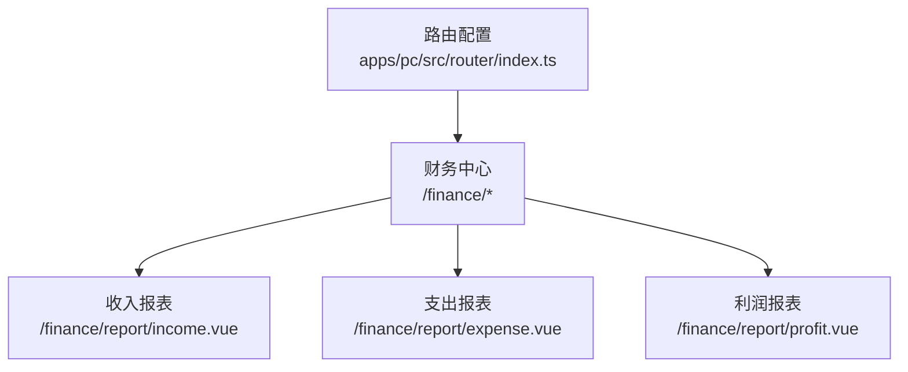
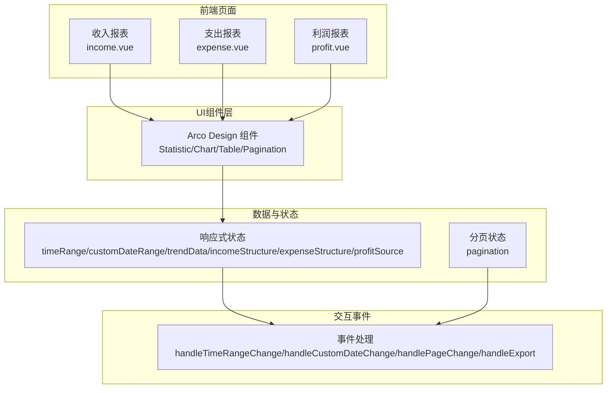
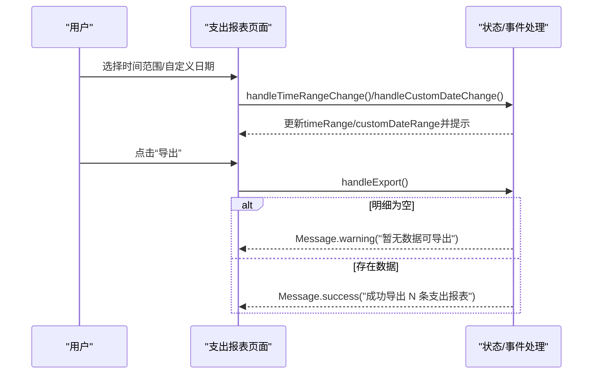
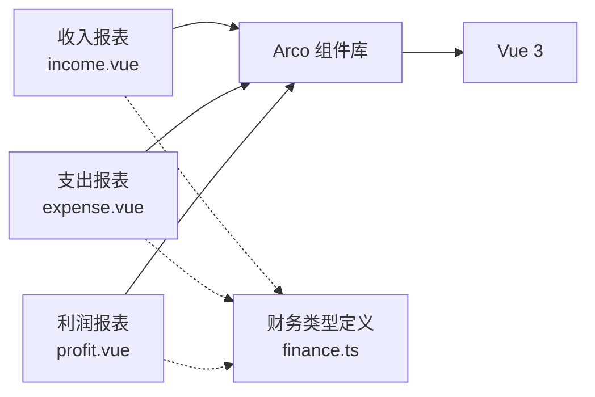

# 财务报表

<cite>
**本文引用的文件**
- [apps/pc/src/views/finance/report/income.vue](file://apps/pc/src/views/finance/report/income.vue)
- [apps/pc/src/views/finance/report/expense.vue](file://apps/pc/src/views/finance/report/expense.vue)
- [apps/pc/src/views/finance/report/profit.vue](file://apps/pc/src/views/finance/report/profit.vue)
- [apps/pc/src/router/index.ts](file://apps/pc/src/router/index.ts)
- [packages/types/src/finance.ts](file://packages/types/src/finance.ts)
- [apps/pc/src/views/finance/invoice/output.vue](file://apps/pc/src/views/finance/invoice/output.vue)
- [apps/pc/src/views/warehouse/finance/statement/index.vue](file://apps/pc/src/views/warehouse/finance/statement/index.vue)
- [apps/pc/src/views/supplier/finance/reconciliation.vue](file://apps/pc/src/views/supplier/finance/reconciliation.vue)
- [apps/pc/src/views/finance/service-bill/index.vue](file://apps/pc/src/views/finance/service-bill/index.vue)
- [apps/pc/src/views/finance/report/expense.vue](file://apps/pc/src/views/finance/report/expense.vue)
- [apps/pc/src/views/finance/report/income.vue](file://apps/pc/src/views/finance/report/income.vue)
- [apps/pc/src/views/finance/report/profit.vue](file://apps/pc/src/views/finance/report/profit.vue)
</cite>

## 目录
1. [简介](#简介)
2. [项目结构](#项目结构)
3. [核心组件](#核心组件)
4. [架构总览](#架构总览)
5. [详细组件分析](#详细组件分析)
6. [依赖分析](#依赖分析)
7. [性能考虑](#性能考虑)
8. [故障排查指南](#故障排查指南)
9. [结论](#结论)
10. [附录](#附录)

## 简介
本文件聚焦于工程材料管理采供一体化平台中的财务报表功能，覆盖收入报表、支出报表、利润报表三大核心报表。内容包括：
- 报表数据来源与计算逻辑
- 报表维度设置与时间范围
- 报表指标定义与展示格式
- 报表导出能力
- 报表异常处理与优化建议
- 报表自定义配置、多维度分析与预警机制（概念性说明）
- 结合实际代码路径展示数据聚合与可视化实现

## 项目结构
财务报表位于 PC 端“财务中心”模块下的“财务报表”子模块，页面通过路由进行组织与访问。

**图表来源**
- [apps/pc/src/router/index.ts:287-332](file://apps/pc/src/router/index.ts#L287-L332)

**章节来源**
- [apps/pc/src/router/index.ts:287-332](file://apps/pc/src/router/index.ts#L287-L332)

## 核心组件
- 收入报表页：提供时间范围选择、统计卡片、趋势图、构成饼图与收入明细表格，并支持导出。
- 支出报表页：提供时间范围选择、统计卡片、趋势图、构成饼图与支出明细表格，并支持导出。
- 利润报表页：提供时间范围选择、统计卡片、收支对比趋势图、利润来源分析、关键指标与利润明细表格，并支持导出。

上述三个页面均采用 Arco Design 组件库进行布局与展示，使用 Vue 3 Composition API 管理状态与交互。

**章节来源**
- [apps/pc/src/views/finance/report/income.vue:1-379](file://apps/pc/src/views/finance/report/income.vue#L1-L379)
- [apps/pc/src/views/finance/report/expense.vue:1-378](file://apps/pc/src/views/finance/report/expense.vue#L1-L378)
- [apps/pc/src/views/finance/report/profit.vue:1-529](file://apps/pc/src/views/finance/report/profit.vue#L1-L529)

## 架构总览
从页面到数据流的总体关系如下：

**图表来源**
- [apps/pc/src/views/finance/report/income.vue:126-208](file://apps/pc/src/views/finance/report/income.vue#L126-L208)
- [apps/pc/src/views/finance/report/expense.vue:126-211](file://apps/pc/src/views/finance/report/expense.vue#L126-L211)
- [apps/pc/src/views/finance/report/profit.vue:196-260](file://apps/pc/src/views/finance/report/profit.vue#L196-L260)

## 详细组件分析

### 收入报表组件分析
- 时间范围与筛选
  - 提供“今日/本周/本月/本年”快捷切换与自定义日期范围选择器。
  - 事件处理函数用于提示切换结果与触发后续刷新逻辑（当前示例为本地模拟）。
- 统计卡片
  - 展示“总收入”、“服务费收入”、“交易笔数”、“平均客单价”，并带有涨跌趋势指示。
- 趋势图
  - 使用纯 DOM 方式绘制柱状图，基于最大值归一化高度，实现动态高度与数值标注。
- 收入构成饼图
  - 使用 CSS 渐变圆环作为视觉饼图，右侧配以图例与百分比。
- 明细表格
  - 展示“日期/收入来源/商户名称/关联订单/交易金额/平台分账/分账比例”等字段。
  - 支持分页与导出。
- 导出与异常处理
  - 当明细为空时提示“暂无数据可导出”。

**图表来源**
- [apps/pc/src/views/finance/report/income.vue:189-207](file://apps/pc/src/views/finance/report/income.vue#L189-L207)

**章节来源**
- [apps/pc/src/views/finance/report/income.vue:1-379](file://apps/pc/src/views/finance/report/income.vue#L1-L379)

### 支出报表组件分析
- 时间范围与筛选
  - 同收入报表，提供快捷时间与自定义日期范围。
- 统计卡片
  - 展示“总支出”、“结算支出”、“退款支出”、“其他支出”，并带有涨跌趋势指示。
- 趋势图
  - 使用纯 DOM 方式绘制柱状图，基于最大值归一化高度。
- 支出构成饼图
  - 使用 CSS 渐变圆环作为视觉饼图，右侧配以图例与百分比。
- 明细表格
  - 展示“日期/支出类型/收款方/关联单据/支出金额/支出说明/状态”等字段。
  - 支持分页与导出。
- 导出与异常处理
  - 当明细为空时提示“暂无数据可导出”。

**图表来源**
- [apps/pc/src/views/finance/report/expense.vue:192-210](file://apps/pc/src/views/finance/report/expense.vue#L192-L210)

**章节来源**
- [apps/pc/src/views/finance/report/expense.vue:1-378](file://apps/pc/src/views/finance/report/expense.vue#L1-L378)

### 利润报表组件分析
- 时间范围与筛选
  - 同上，提供快捷时间与自定义日期范围。
- 统计卡片
  - 展示“净利润”、“总收入”、“总支出”、“利润率”，并带有涨跌趋势指示。
- 收支对比趋势图
  - 使用双柱+线条组合方式展示收入、支出与利润，支持悬停提示数值。
- 利润来源分析
  - 展示各来源的利润、占比与趋势变化。
- 关键指标
  - 展示“毛利率”、“净利率”、“资金周转率”、“应收账款周转天数”等指标与进度条。
- 明细表格
  - 展示“日期/收入/支出/利润/利润率/主要来源/环比”等字段。
  - 支持分页与导出。
- 导出与异常处理
  - 当明细为空时提示“暂无数据可导出”。

**图表来源**
- [apps/pc/src/views/finance/report/profit.vue:241-259](file://apps/pc/src/views/finance/report/profit.vue#L241-L259)

**章节来源**
- [apps/pc/src/views/finance/report/profit.vue:1-529](file://apps/pc/src/views/finance/report/profit.vue#L1-L529)

### 报表维度与时间范围
- 维度设置
  - 快捷时间：今日、本周、本月、本年
  - 自定义日期范围：支持起止日期选择
- 时间范围变更
  - 通过事件回调更新内部状态并提示用户当前选择

**章节来源**
- [apps/pc/src/views/finance/report/income.vue:6-12](file://apps/pc/src/views/finance/report/income.vue#L6-L12)
- [apps/pc/src/views/finance/report/expense.vue:6-12](file://apps/pc/src/views/finance/report/expense.vue#L6-L12)
- [apps/pc/src/views/finance/report/profit.vue:6-12](file://apps/pc/src/views/finance/report/profit.vue#L6-L12)

### 报表指标定义与展示格式
- 收入报表
  - 指标：总收入、服务费收入、交易笔数、平均客单价
  - 展示：卡片数字+趋势箭头；趋势图柱状；构成饼图；明细表格列
- 支出报表
  - 指标：总支出、结算支出、退款支出、其他支出
  - 展示：卡片数字+趋势箭头；趋势图柱状；构成饼图；明细表格列
- 利润报表
  - 指标：净利润、总收入、总支出、利润率、毛利率、净利率、资金周转率、应收账款周转天数
  - 展示：卡片数字+趋势箭头；收支对比柱状+利润线；来源分析条形；关键指标进度条；明细表格列

**章节来源**
- [apps/pc/src/views/finance/report/income.vue:20-44](file://apps/pc/src/views/finance/report/income.vue#L20-L44)
- [apps/pc/src/views/finance/report/expense.vue:20-46](file://apps/pc/src/views/finance/report/expense.vue#L20-L46)
- [apps/pc/src/views/finance/report/profit.vue:20-44](file://apps/pc/src/views/finance/report/profit.vue#L20-L44)

### 报表数据来源与计算逻辑
- 页面当前实现为前端静态示例数据与本地计算（如最大值归一化、百分比计算），便于演示与开发验证。
- 实际生产环境应对接后端接口获取真实数据，计算逻辑包括：
  - 时间范围过滤
  - 指标聚合（求和、计数、平均）
  - 占比与趋势计算
  - 多维度切片（来源、商户、项目等）

（本节为概念性说明，不直接分析具体文件）

### 报表导出功能
- 所有报表页面均提供“导出”按钮，当前实现为本地提示，实际应调用后端导出接口并返回文件流。
- 导出前校验：若当前列表为空，提示“暂无数据可导出”。

**章节来源**
- [apps/pc/src/views/finance/report/income.vue:13-16](file://apps/pc/src/views/finance/report/income.vue#L13-L16)
- [apps/pc/src/views/finance/report/expense.vue:13-16](file://apps/pc/src/views/finance/report/expense.vue#L13-L16)
- [apps/pc/src/views/finance/report/profit.vue:13-16](file://apps/pc/src/views/finance/report/profit.vue#L13-L16)
- [apps/pc/src/views/finance/report/income.vue:201-207](file://apps/pc/src/views/finance/report/income.vue#L201-L207)
- [apps/pc/src/views/finance/report/expense.vue:204-210](file://apps/pc/src/views/finance/report/expense.vue#L204-L210)
- [apps/pc/src/views/finance/report/profit.vue:253-259](file://apps/pc/src/views/finance/report/profit.vue#L253-L259)

### 报表异常处理
- 空数据导出：当列表为空时，统一提示“暂无数据可导出”，避免无效请求。
- 其他常见异常（建议）：
  - 网络错误：统一提示并允许重试
  - 数据格式异常：提示并引导检查参数
  - 权限不足：跳转登录或提示授权

**章节来源**
- [apps/pc/src/views/finance/report/income.vue:201-207](file://apps/pc/src/views/finance/report/income.vue#L201-L207)
- [apps/pc/src/views/finance/report/expense.vue:204-210](file://apps/pc/src/views/finance/report/expense.vue#L204-L210)
- [apps/pc/src/views/finance/report/profit.vue:253-259](file://apps/pc/src/views/finance/report/profit.vue#L253-L259)

### 报表自定义配置、多维度分析与预警机制（概念性）
- 自定义配置
  - 时间范围、维度字段、指标集合、图表类型等可配置
- 多维度分析
  - 支持按来源、商户、项目、仓库等维度切片与钻取
- 预警机制
  - 对关键指标设置阈值，超阈值时高亮提示并支持订阅通知

（本节为概念性说明，不直接分析具体文件）

## 依赖分析
- 页面依赖
  - Arco Design 组件：Statistic、Card、Row/Col、Divider、Table、Pagination、Progress、Tag、RadioGroup、RangePicker、Button、Space
  - Vue 3：ref/computed/Message
- 数据模型
  - 财务相关类型定义（账户、交易、托管、分账规则等）位于类型包中，可用于扩展报表数据模型

**图表来源**
- [apps/pc/src/views/finance/report/income.vue:127-128](file://apps/pc/src/views/finance/report/income.vue#L127-L128)
- [apps/pc/src/views/finance/report/expense.vue:127-128](file://apps/pc/src/views/finance/report/expense.vue#L127-L128)
- [apps/pc/src/views/finance/report/profit.vue:197-198](file://apps/pc/src/views/finance/report/profit.vue#L197-L198)
- [packages/types/src/finance.ts:1-95](file://packages/types/src/finance.ts#L1-L95)

**章节来源**
- [packages/types/src/finance.ts:1-95](file://packages/types/src/finance.ts#L1-L95)

## 性能考虑
- 图表渲染
  - 使用纯 DOM 绘制柱状图与饼图，适合小规模数据；大规模数据建议采用 Canvas 或 SVG 图表库
- 计算复杂度
  - 最大值归一化与百分比计算为 O(n)，在大数据量时需注意批量更新与防抖
- 分页与懒加载
  - 明细表格使用分页，建议配合虚拟滚动提升长列表性能
- 导出性能
  - 导出前进行数据清洗与格式化，避免重复计算；支持后台异步导出并提供下载链接

（本节为通用建议，不直接分析具体文件）

## 故障排查指南
- 导出失败
  - 检查列表是否为空；确认网络状态；查看浏览器控制台错误
- 图表显示异常
  - 检查数据源是否为空或格式异常；确认容器尺寸与样式
- 时间范围无效
  - 确认起止日期顺序正确；检查事件回调是否被正确触发

**章节来源**
- [apps/pc/src/views/finance/report/income.vue:201-207](file://apps/pc/src/views/finance/report/income.vue#L201-L207)
- [apps/pc/src/views/finance/report/expense.vue:204-210](file://apps/pc/src/views/finance/report/expense.vue#L204-L210)
- [apps/pc/src/views/finance/report/profit.vue:253-259](file://apps/pc/src/views/finance/report/profit.vue#L253-L259)

## 结论
财务报表模块以清晰的页面结构与直观的可视化组件实现了收入、支出与利润三大报表的核心功能。当前实现侧重演示与开发验证，建议在生产环境中接入后端接口、完善异常处理与性能优化，并扩展多维度分析与预警机制，以满足更复杂的业务需求。

## 附录
- 相关页面与功能
  - 发票管理（销项/进项）、对账单、银行对账、服务费账单等财务相关页面可作为报表数据补充与交叉验证
- 类型参考
  - 财务类型定义（账户、交易、托管、分账规则等）可作为报表数据模型扩展的基础

**章节来源**
- [apps/pc/src/views/finance/invoice/output.vue:480-508](file://apps/pc/src/views/finance/invoice/output.vue#L480-L508)
- [apps/pc/src/views/warehouse/finance/statement/index.vue:99-149](file://apps/pc/src/views/warehouse/finance/statement/index.vue#L99-L149)
- [apps/pc/src/views/supplier/finance/reconciliation.vue:1-36](file://apps/pc/src/views/supplier/finance/reconciliation.vue#L1-L36)
- [apps/pc/src/views/finance/service-bill/index.vue:170-178](file://apps/pc/src/views/finance/service-bill/index.vue#L170-L178)