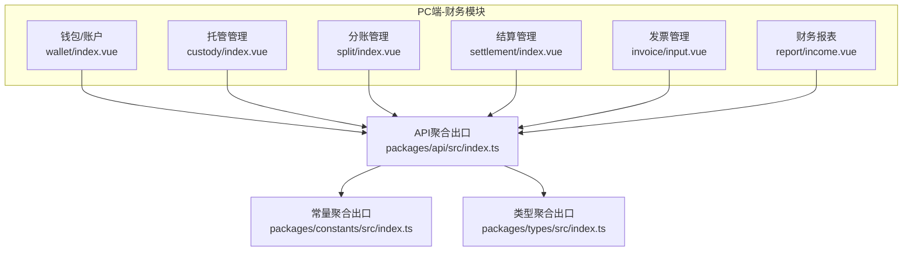
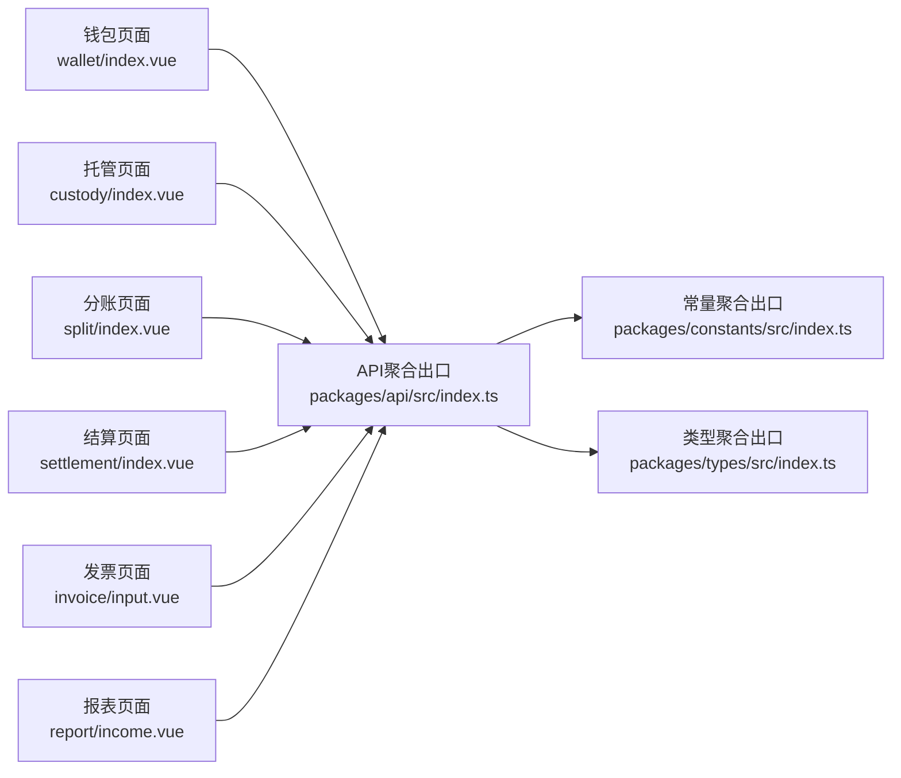
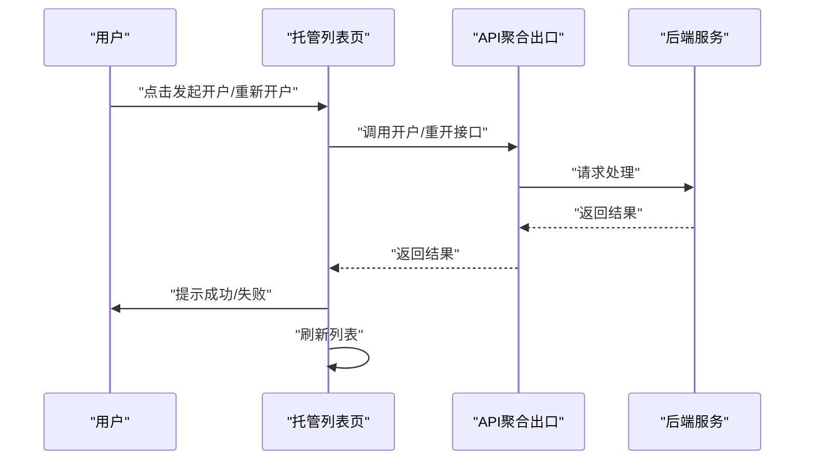
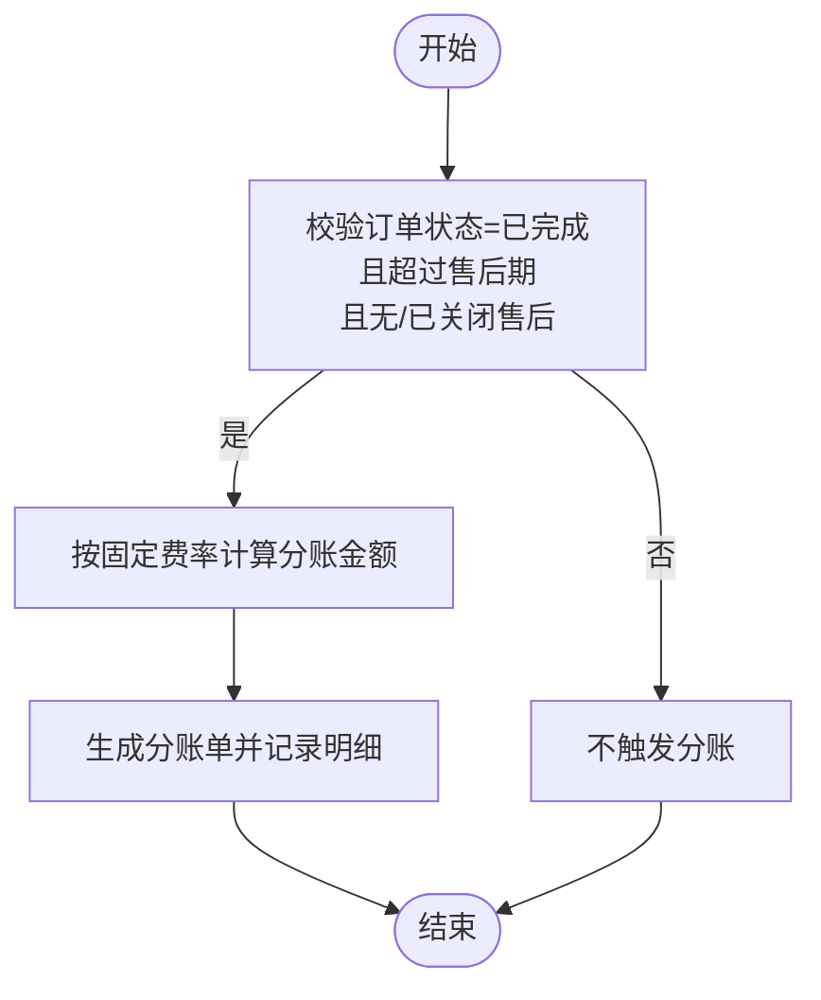
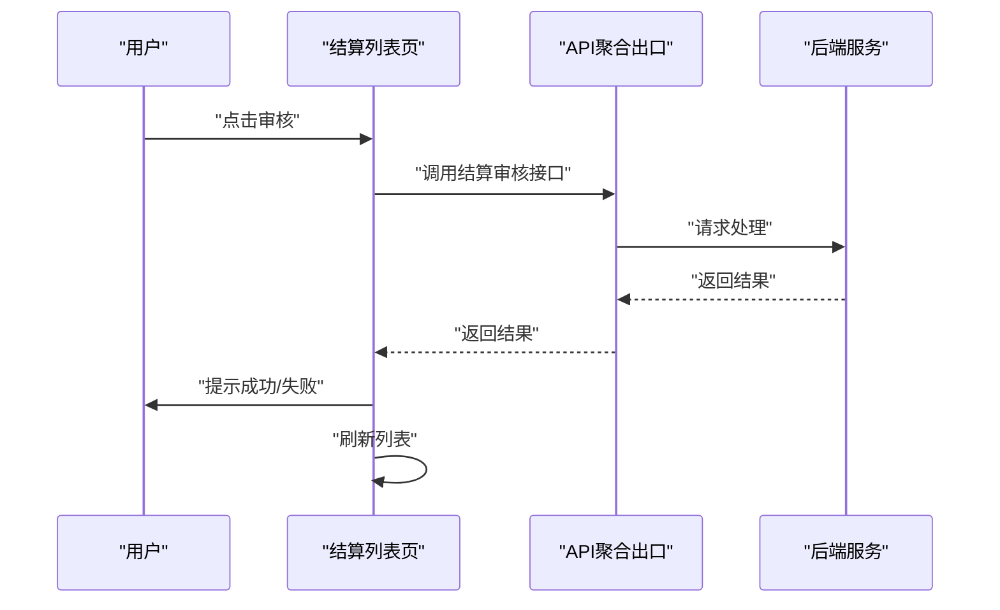
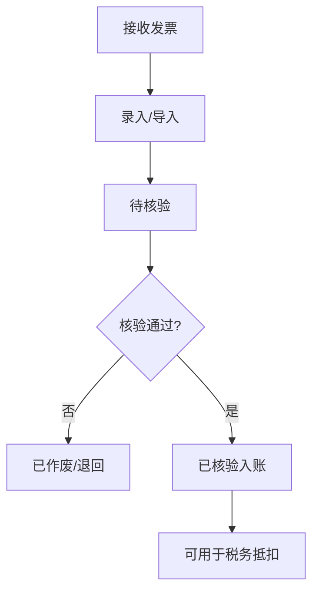
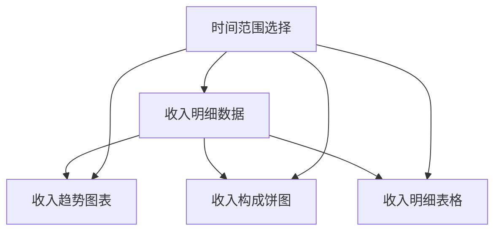
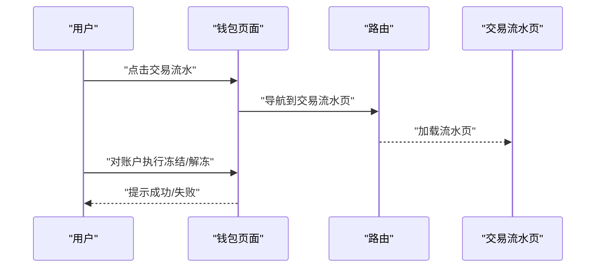
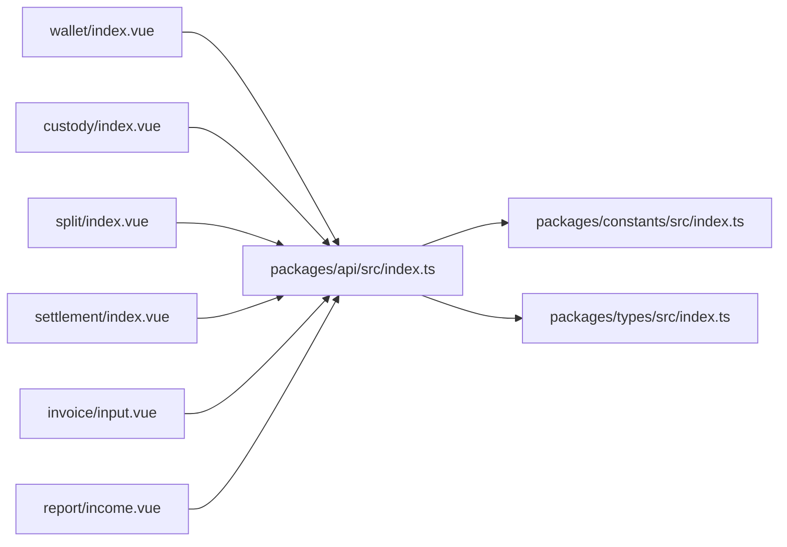

# 财务管理中心

<cite>
**本文引用的文件**   
- [apps/pc/src/views/finance/custody/index.vue](file://apps/pc/src/views/finance/custody/index.vue)
- [apps/pc/src/views/finance/settlement/index.vue](file://apps/pc/src/views/finance/settlement/index.vue)
- [apps/pc/src/views/finance/invoice/input.vue](file://apps/pc/src/views/finance/invoice/input.vue)
- [apps/pc/src/views/finance/report/income.vue](file://apps/pc/src/views/finance/report/income.vue)
- [apps/pc/src/views/finance/split/index.vue](file://apps/pc/src/views/finance/split/index.vue)
- [apps/pc/src/views/finance/wallet/index.vue](file://apps/pc/src/views/finance/wallet/index.vue)
- [packages/api/src/index.ts](file://packages/api/src/index.ts)
- [packages/constants/src/index.ts](file://packages/constants/src/index.ts)
- [packages/types/src/index.ts](file://packages/types/src/index.ts)
</cite>

## 目录
1. [简介](#简介)
2. [项目结构](#项目结构)
3. [核心组件](#核心组件)
4. [架构总览](#架构总览)
5. [详细组件分析](#详细组件分析)
6. [依赖分析](#依赖分析)
7. [性能考虑](#性能考虑)
8. [故障排查指南](#故障排查指南)
9. [结论](#结论)
10. [附录](#附录)

## 简介
本文件面向“财务管理中心”模块，系统化梳理并输出以下核心能力的业务流程、操作步骤、数据模型、权限控制与异常处理，并提供财务流程示例与合规性指导：
- 资金托管管理：托管账户管理、资金流水查询、冻结解冻、资金转移
- 分账管理：分账规则配置、计算、执行、记录
- 结算管理：结算申请、审核、执行、记录
- 发票管理：进项发票、销项发票、开具、查询
- 财务报表：收支报表、利润报表、费用报表

本文件以前端页面与常量/类型/接口聚合出口为依据，结合仓库现有实现，给出可落地的实践建议与最佳实践。

## 项目结构
财务相关页面集中在 PC 端“财务”视图下，采用按功能域划分的组织方式：
- 财务首页与钱包：账户总览、账户列表、交易流水入口
- 托管管理：账户列表、详情、开户、余额同步
- 分账管理：分账列表、详情、导出
- 结算管理：结算列表、统计、查询、审核、导出
- 发票管理：进项发票列表、统计、查询、核验、导出
- 报表：收入报表（含趋势、构成、明细）

**图表来源**
- [apps/pc/src/views/finance/wallet/index.vue:1-389](file://apps/pc/src/views/finance/wallet/index.vue#L1-L389)
- [apps/pc/src/views/finance/custody/index.vue:1-222](file://apps/pc/src/views/finance/custody/index.vue#L1-L222)
- [apps/pc/src/views/finance/split/index.vue:1-406](file://apps/pc/src/views/finance/split/index.vue#L1-L406)
- [apps/pc/src/views/finance/settlement/index.vue:1-263](file://apps/pc/src/views/finance/settlement/index.vue#L1-L263)
- [apps/pc/src/views/finance/invoice/input.vue:1-294](file://apps/pc/src/views/finance/invoice/input.vue#L1-L294)
- [apps/pc/src/views/finance/report/income.vue:1-379](file://apps/pc/src/views/finance/report/income.vue#L1-L379)
- [packages/api/src/index.ts:1-11](file://packages/api/src/index.ts#L1-L11)
- [packages/constants/src/index.ts:1-7](file://packages/constants/src/index.ts#L1-L7)
- [packages/types/src/index.ts:1-10](file://packages/types/src/index.ts#L1-L10)

**章节来源**
- [apps/pc/src/views/finance/wallet/index.vue:1-389](file://apps/pc/src/views/finance/wallet/index.vue#L1-L389)
- [apps/pc/src/views/finance/custody/index.vue:1-222](file://apps/pc/src/views/finance/custody/index.vue#L1-L222)
- [apps/pc/src/views/finance/split/index.vue:1-406](file://apps/pc/src/views/finance/split/index.vue#L1-L406)
- [apps/pc/src/views/finance/settlement/index.vue:1-263](file://apps/pc/src/views/finance/settlement/index.vue#L1-L263)
- [apps/pc/src/views/finance/invoice/input.vue:1-294](file://apps/pc/src/views/finance/invoice/input.vue#L1-L294)
- [apps/pc/src/views/finance/report/income.vue:1-379](file://apps/pc/src/views/finance/report/income.vue#L1-L379)
- [packages/api/src/index.ts:1-11](file://packages/api/src/index.ts#L1-L11)
- [packages/constants/src/index.ts:1-7](file://packages/constants/src/index.ts#L1-L7)
- [packages/types/src/index.ts:1-10](file://packages/types/src/index.ts#L1-L10)

## 核心组件
- 钱包/账户：账户总览、账户列表、账户状态（正常/冻结）、交易流水入口、关联托管账户
- 托管管理：托管账户列表、状态筛选、开户申请/重开、余额同步
- 分账管理：分账单列表、详情、导出；支持按商户、时间范围筛选
- 结算管理：结算单列表、统计、查询、审核、导出
- 发票管理：进项发票列表、统计、查询、核验、导出
- 财务报表：收入趋势、收入构成、收入明细

**章节来源**
- [apps/pc/src/views/finance/wallet/index.vue:1-389](file://apps/pc/src/views/finance/wallet/index.vue#L1-L389)
- [apps/pc/src/views/finance/custody/index.vue:1-222](file://apps/pc/src/views/finance/custody/index.vue#L1-L222)
- [apps/pc/src/views/finance/split/index.vue:1-406](file://apps/pc/src/views/finance/split/index.vue#L1-L406)
- [apps/pc/src/views/finance/settlement/index.vue:1-263](file://apps/pc/src/views/finance/settlement/index.vue#L1-L263)
- [apps/pc/src/views/finance/invoice/input.vue:1-294](file://apps/pc/src/views/finance/invoice/input.vue#L1-L294)
- [apps/pc/src/views/finance/report/income.vue:1-379](file://apps/pc/src/views/finance/report/income.vue#L1-L379)

## 架构总览
前端采用“页面组件 + 聚合出口”的组织方式：
- 页面组件直接依赖 API 聚合出口，统一调用后端接口
- 常量与类型通过各自聚合出口对外暴露，供页面与工具函数使用
- 页面内完成数据加载、筛选、分页、导出等交互逻辑

**图表来源**
- [packages/api/src/index.ts:1-11](file://packages/api/src/index.ts#L1-L11)
- [packages/constants/src/index.ts:1-7](file://packages/constants/src/index.ts#L1-L7)
- [packages/types/src/index.ts:1-10](file://packages/types/src/index.ts#L1-L10)
- [apps/pc/src/views/finance/wallet/index.vue:1-389](file://apps/pc/src/views/finance/wallet/index.vue#L1-L389)
- [apps/pc/src/views/finance/custody/index.vue:1-222](file://apps/pc/src/views/finance/custody/index.vue#L1-L222)
- [apps/pc/src/views/finance/split/index.vue:1-406](file://apps/pc/src/views/finance/split/index.vue#L1-L406)
- [apps/pc/src/views/finance/settlement/index.vue:1-263](file://apps/pc/src/views/finance/settlement/index.vue#L1-L263)
- [apps/pc/src/views/finance/invoice/input.vue:1-294](file://apps/pc/src/views/finance/invoice/input.vue#L1-L294)
- [apps/pc/src/views/finance/report/income.vue:1-379](file://apps/pc/src/views/finance/report/income.vue#L1-L379)

## 详细组件分析

### 资金托管管理
- 业务流程
  - 开户申请/重开：根据账户状态发起申请或重开
  - 余额同步：支持单个账户同步，批量同步预留提示
  - 账户状态：支持按开户状态、绑卡状态、账户状态筛选
  - 详情查看：进入账户详情页，查看资金流水与操作记录
- 操作步骤
  - 在列表页选择目标账户，点击“发起开户/重新开户”
  - 点击“同步余额”，等待成功提示并刷新列表
  - 点击“查看明细”进入详情页
- 数据模型
  - 账户关键字段：账户ID、商户名称、开户状态、绑卡状态、账户状态、可用余额、冻结余额、总余额、最后同步时间
- 权限控制
  - 开户/重开仅在特定状态下允许；余额同步需具备相应权限
- 异常处理
  - 接口失败统一提示错误信息；成功后刷新数据

**图表来源**
- [apps/pc/src/views/finance/custody/index.vue:181-194](file://apps/pc/src/views/finance/custody/index.vue#L181-L194)
- [packages/api/src/index.ts:1-11](file://packages/api/src/index.ts#L1-L11)

**章节来源**
- [apps/pc/src/views/finance/custody/index.vue:1-222](file://apps/pc/src/views/finance/custody/index.vue#L1-L222)

### 分账管理
- 业务流程
  - 触发条件：订单完成后、超过售后期、无售后或售后已关闭
  - 计算规则：按固定费率（工程仓/供应商/平台自营）计算分账金额
  - 执行与记录：生成分账单，记录分账明细与资金流向
- 操作步骤
  - 在列表页按分账单号、商户、时间范围筛选
  - 查看分账详情，核对商品分账明细与分账资金流向
  - 导出分账记录
- 数据模型
  - 分账记录关键字段：分账单号、关联应收编号、关联订单号、交易金额、分账金额、分账比例、商户名称、商户类型、分账时间
  - 明细包含商品维度的分账明细与收款方维度的资金流向
- 权限控制
  - 不同角色对导出、调整费率、手动触发分账等操作有不同权限
- 异常处理
  - 查询为空时提示“暂无数据可导出”

**图表来源**
- [apps/pc/src/views/finance/split/index.vue:205-218](file://apps/pc/src/views/finance/split/index.vue#L205-L218)

**章节来源**
- [apps/pc/src/views/finance/split/index.vue:1-406](file://apps/pc/src/views/finance/split/index.vue#L1-L406)

### 结算管理
- 业务流程
  - 申请：商户提交结算申请，填写结算银行与卡号
  - 审核：财务审核结算单，支持通过/驳回
  - 执行：审核通过后进入处理中/已到账状态
- 操作步骤
  - 在列表页按结算单号、商户、状态、申请时间筛选
  - 查看详情，进行审核操作
  - 导出结算记录
- 数据模型
  - 结算记录关键字段：结算单号、商户名称、商户类型、结算金额、结算银行、申请时间、结算状态、到账时间
- 权限控制
  - 仅具备审核权限的角色可进行审核
- 异常处理
  - 查询为空时提示“暂无数据可导出”

**图表来源**
- [apps/pc/src/views/finance/settlement/index.vue:226-228](file://apps/pc/src/views/finance/settlement/index.vue#L226-L228)
- [packages/api/src/index.ts:1-11](file://packages/api/src/index.ts#L1-L11)

**章节来源**
- [apps/pc/src/views/finance/settlement/index.vue:1-263](file://apps/pc/src/views/finance/settlement/index.vue#L1-L263)

### 发票管理（进项）
- 业务流程
  - 录入/接收：平台从工程仓与供应商处接收发票
  - 核验：财务核验发票真伪与合规性
  - 入账：核验通过后计入成本，用于税务抵扣
- 操作步骤
  - 在列表页按发票号、开票方、发票类型、核验状态筛选
  - 查看发票详情，进行核验操作
  - 导出发票记录
- 数据模型
  - 发票记录关键字段：发票号码、发票类型、开票方、金额（不含税）、税额、价税合计、开票日期、核验状态
- 权限控制
  - 仅具备核验权限的角色可执行核验
- 异常处理
  - 查询为空时提示“暂无数据可导出”

**图表来源**
- [apps/pc/src/views/finance/invoice/input.vue:120-126](file://apps/pc/src/views/finance/invoice/input.vue#L120-L126)

**章节来源**
- [apps/pc/src/views/finance/invoice/input.vue:1-294](file://apps/pc/src/views/finance/invoice/input.vue#L1-L294)

### 财务报表（收支）
- 业务流程
  - 收入统计：按时间维度统计收入、服务费、交易笔数、平均客单价
  - 收入趋势：可视化展示月度/周度收入趋势
  - 收入构成：按来源（工程仓/供应商/服务费）展示占比
  - 收入明细：展示每笔交易的来源、商户、订单号、交易金额、平台分账、分账比例
- 操作步骤
  - 选择时间范围（今日/本周/本月/本年/自定义）
  - 导出报表
- 数据模型
  - 收入明细关键字段：日期、收入来源、商户名称、关联订单、交易金额、平台分账、分账比例
- 权限控制
  - 报表查看通常开放给更多角色，导出可能受限
- 异常处理
  - 导出为空时提示“暂无数据可导出”

**图表来源**
- [apps/pc/src/views/finance/report/income.vue:1-379](file://apps/pc/src/views/finance/report/income.vue#L1-L379)

**章节来源**
- [apps/pc/src/views/finance/report/income.vue:1-379](file://apps/pc/src/views/finance/report/income.vue#L1-L379)

### 钱包/账户（资金流水入口）
- 业务流程
  - 账户总览：展示商户账户总余额、工程仓账户数、供应商账户数、活跃商户数
  - 账户列表：支持按关键字、状态筛选；支持交易流水入口、冻结/解冻
  - 关联托管：展示是否已开通托管账户
- 操作步骤
  - 在列表页点击“交易流水”进入流水页
  - 对正常账户执行“冻结”，对冻结账户执行“解冻”
- 数据模型
  - 账户关键字段：账户编号、账户名称、账户类型、账户余额、累计收入、累计支出、开户时间、状态、关联托管账户
- 权限控制
  - 冻结/解冻需具备相应权限
- 异常处理
  - 成功/失败统一提示消息

**图表来源**
- [apps/pc/src/views/finance/wallet/index.vue:318-345](file://apps/pc/src/views/finance/wallet/index.vue#L318-L345)

**章节来源**
- [apps/pc/src/views/finance/wallet/index.vue:1-389](file://apps/pc/src/views/finance/wallet/index.vue#L1-L389)

## 依赖分析
- 页面组件依赖关系
  - 各页面组件均通过 API 聚合出口调用接口
  - 常量与类型通过各自聚合出口被页面引用
- 耦合与内聚
  - 页面内聚于自身业务，耦合通过聚合出口降低
- 外部依赖
  - UI 组件库、路由、消息提示等

**图表来源**
- [packages/api/src/index.ts:1-11](file://packages/api/src/index.ts#L1-L11)
- [packages/constants/src/index.ts:1-7](file://packages/constants/src/index.ts#L1-L7)
- [packages/types/src/index.ts:1-10](file://packages/types/src/index.ts#L1-L10)
- [apps/pc/src/views/finance/wallet/index.vue:1-389](file://apps/pc/src/views/finance/wallet/index.vue#L1-L389)
- [apps/pc/src/views/finance/custody/index.vue:1-222](file://apps/pc/src/views/finance/custody/index.vue#L1-L222)
- [apps/pc/src/views/finance/split/index.vue:1-406](file://apps/pc/src/views/finance/split/index.vue#L1-L406)
- [apps/pc/src/views/finance/settlement/index.vue:1-263](file://apps/pc/src/views/finance/settlement/index.vue#L1-L263)
- [apps/pc/src/views/finance/invoice/input.vue:1-294](file://apps/pc/src/views/finance/invoice/input.vue#L1-L294)
- [apps/pc/src/views/finance/report/income.vue:1-379](file://apps/pc/src/views/finance/report/income.vue#L1-L379)

**章节来源**
- [packages/api/src/index.ts:1-11](file://packages/api/src/index.ts#L1-L11)
- [packages/constants/src/index.ts:1-7](file://packages/constants/src/index.ts#L1-L7)
- [packages/types/src/index.ts:1-10](file://packages/types/src/index.ts#L1-L10)

## 性能考虑
- 列表分页与筛选：前端分页减少一次性渲染压力；合理设置 pageSize
- 图表渲染：趋势/构成类图表按需渲染，避免频繁重绘
- 导出优化：空数据时提前拦截，减少无效请求
- 状态管理：对高频交互（如冻结/解冻）采用本地状态预更新，失败回滚

## 故障排查指南
- 接口失败
  - 统一提示错误消息；检查网络与后端服务状态
- 数据为空
  - 导出前判断列表长度；筛选条件过于严格时建议放宽
- 权限不足
  - 审核/冻结/解冻/导出等敏感操作需确认角色权限
- 余额同步
  - 单个账户同步失败时，检查账户状态与绑卡状态；批量同步功能提示开发中

**章节来源**
- [apps/pc/src/views/finance/custody/index.vue:196-208](file://apps/pc/src/views/finance/custody/index.vue#L196-L208)
- [apps/pc/src/views/finance/split/index.vue:350-356](file://apps/pc/src/views/finance/split/index.vue#L350-L356)
- [apps/pc/src/views/finance/settlement/index.vue:230-236](file://apps/pc/src/views/finance/settlement/index.vue#L230-L236)
- [apps/pc/src/views/finance/invoice/input.vue:250-256](file://apps/pc/src/views/finance/invoice/input.vue#L250-L256)
- [apps/pc/src/views/finance/report/income.vue:201-207](file://apps/pc/src/views/finance/report/income.vue#L201-L207)

## 结论
本文件基于现有前端页面与聚合出口，系统化梳理了财务管理中心的核心功能与交互流程。建议后续补充：
- 后端接口契约与鉴权策略
- 数据模型与数据库表结构
- 分账规则配置界面与执行引擎
- 结算审核流程与风控策略
- 发票开具与销项发票管理
- 报表的多维分析与钻取能力

## 附录
- 财务流程示例
  - 分账流程：订单完成 → 售后期结束 → 无售后 → 生成分账单 → 记录明细
  - 结算流程：商户申请 → 财务审核 → 处理中 → 到账
  - 发票流程：接收 → 待核验 → 核验通过 → 入账抵扣
- 合规性指导
  - 严格区分工程仓与供应商两类主体的分账比例与结算周期
  - 发票核验必须留痕，确保可追溯
  - 账户冻结/解冻需双人复核与审批记录