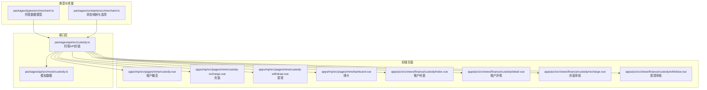
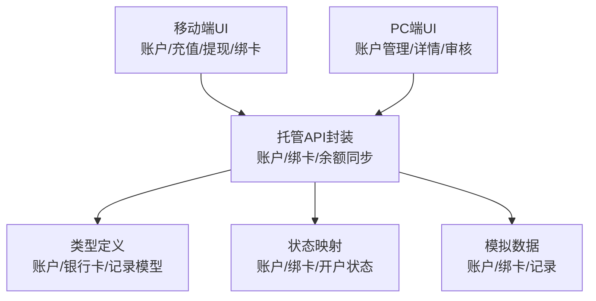
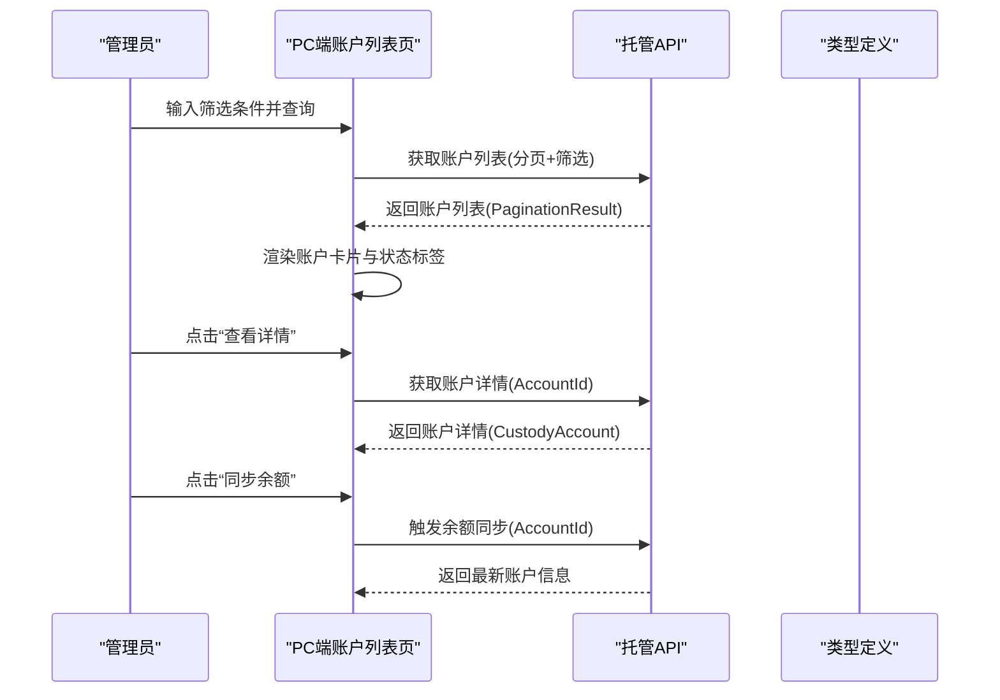
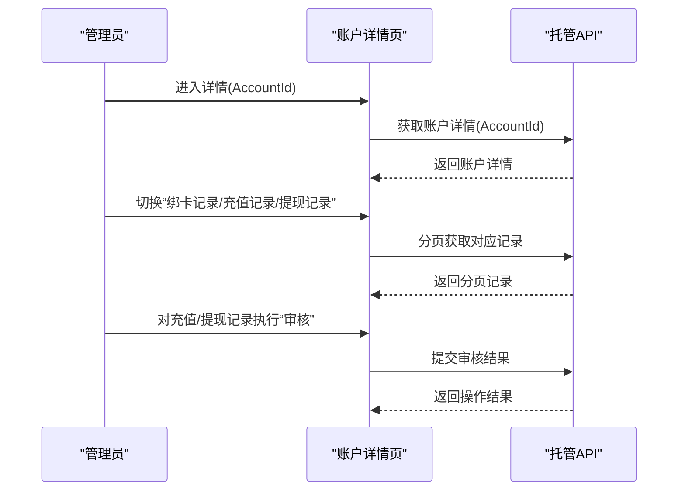
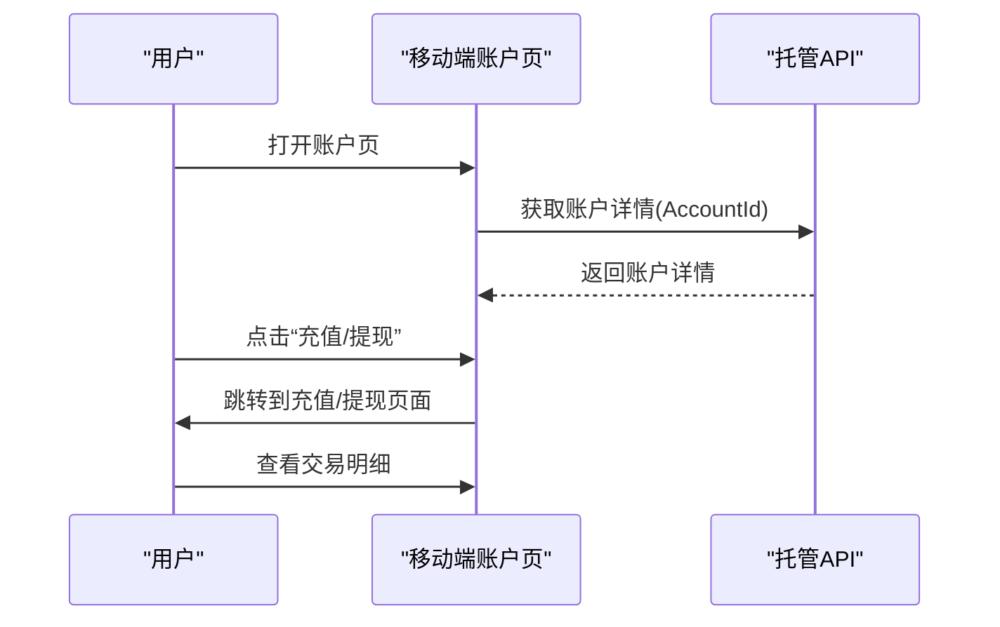
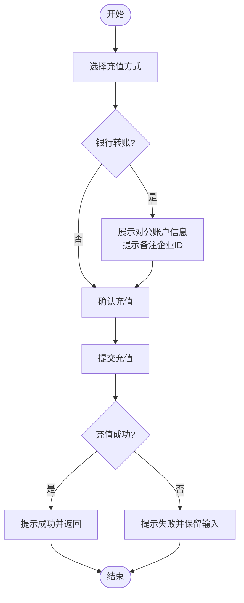
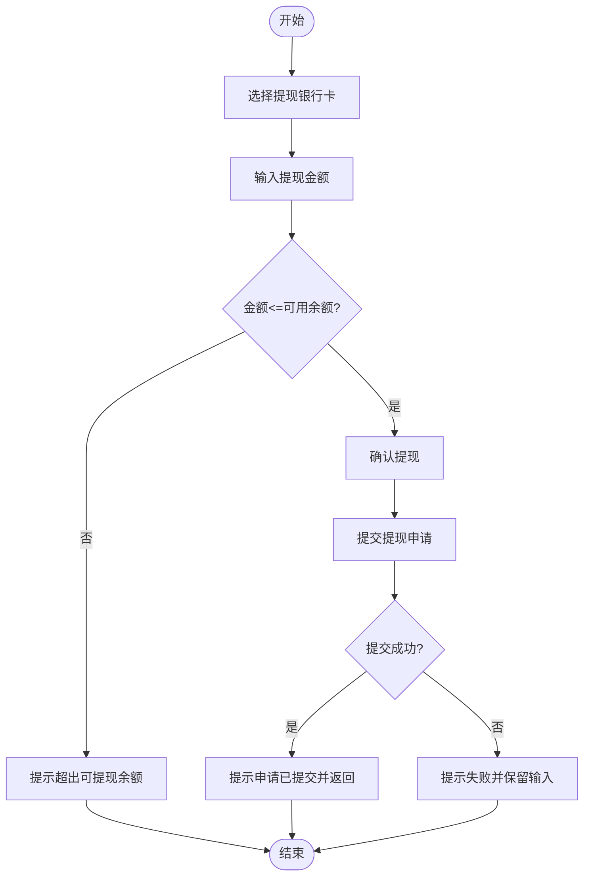
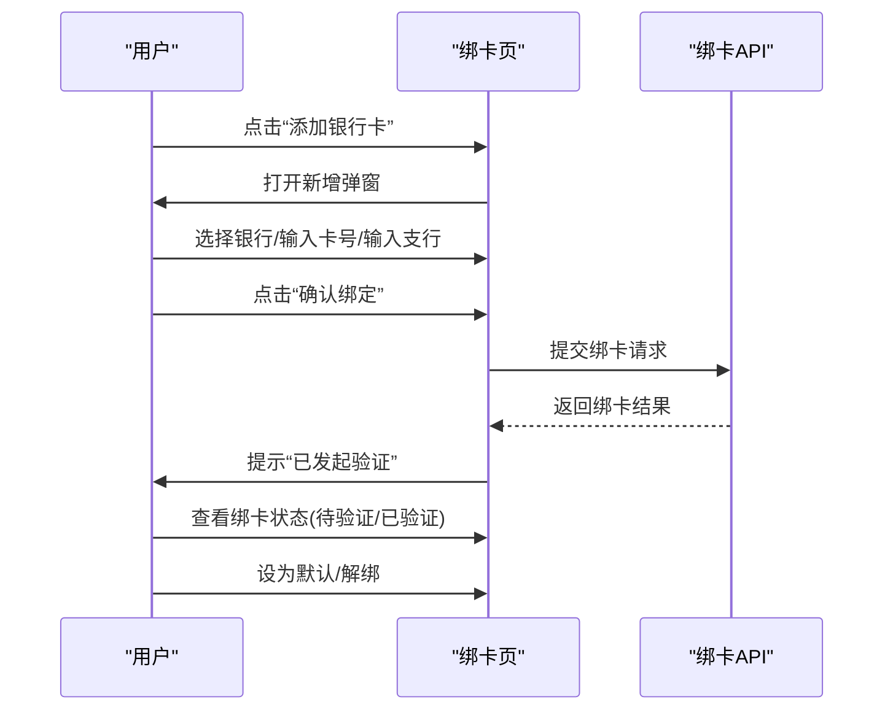
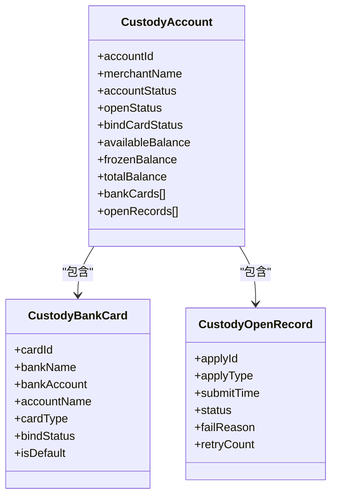
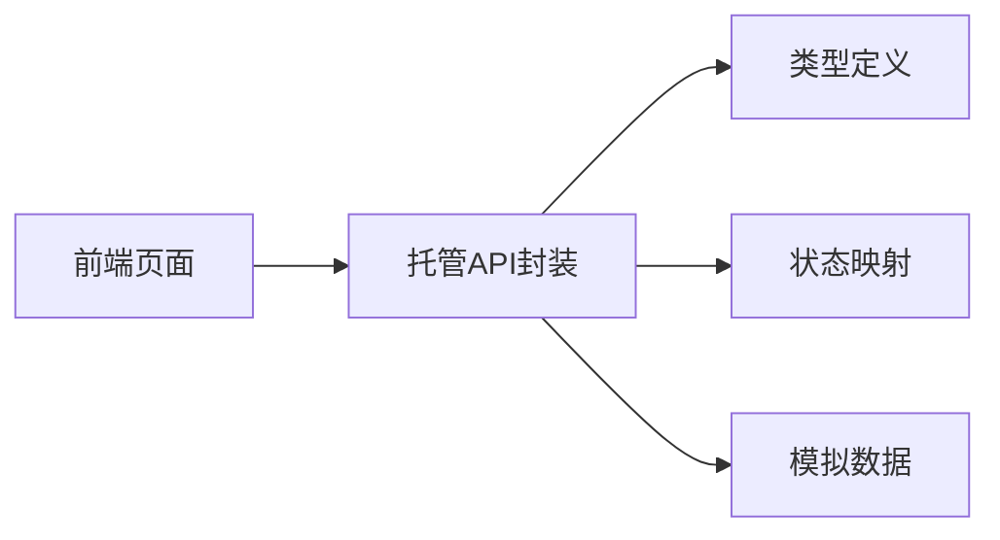

# 资金托管管理

<cite>
**本文档引用的文件**
- [packages/api/src/custody.ts](file://packages/api/src/custody.ts)
- [packages/types/src/merchant.ts](file://packages/types/src/merchant.ts)
- [packages/constants/src/merchant.ts](file://packages/constants/src/merchant.ts)
- [packages/api/src/mock/custody.ts](file://packages/api/src/mock/custody.ts)
- [apps/mp/src/pages/mine/custody.vue](file://apps/mp/src/pages/mine/custody.vue)
- [apps/mp/src/pages/mine/custody-recharge.vue](file://apps/mp/src/pages/mine/custody-recharge.vue)
- [apps/mp/src/pages/mine/custody-withdraw.vue](file://apps/mp/src/pages/mine/custody-withdraw.vue)
- [apps/mp/src/pages/mine/bankcard.vue](file://apps/mp/src/pages/mine/bankcard.vue)
- [apps/pc/src/views/finance/custody/index.vue](file://apps/pc/src/views/finance/custody/index.vue)
- [apps/pc/src/views/finance/custody/detail.vue](file://apps/pc/src/views/finance/custody/detail.vue)
- [apps/pc/src/views/finance/custody/recharge.vue](file://apps/pc/src/views/finance/custody/recharge.vue)
- [apps/pc/src/views/finance/custody/withdraw.vue](file://apps/pc/src/views/finance/custody/withdraw.vue)
</cite>

## 目录
1. [简介](#简介)
2. [项目结构](#项目结构)
3. [核心组件](#核心组件)
4. [架构总览](#架构总览)
5. [详细组件分析](#详细组件分析)
6. [依赖关系分析](#依赖关系分析)
7. [性能考虑](#性能考虑)
8. [故障排查指南](#故障排查指南)
9. [结论](#结论)
10. [附录](#附录)

## 简介
本文件围绕资金托管管理功能进行全面技术文档化，覆盖托管账户管理、账户详情查询、充值提现操作、银行卡绑定、资质审核等核心能力，并结合前端页面与API接口，给出业务流程、状态管理、风控策略与异常处理建议。文档同时提供托管协议模板、合规检查清单与风险防控措施，帮助开发者与运营人员理解并实施安全、合规的资金托管体系。

## 项目结构
资金托管管理功能由三层构成：
- 类型与常量层：定义托管账户、银行卡、开户记录等数据模型与状态映射。
- 接口层：封装托管相关API，支持列表查询、详情获取、余额同步、绑卡操作等。
- 前端页面层：移动端与PC端分别提供账户概览、充值、提现、绑卡、详情与审核界面。

图表来源
- [packages/types/src/merchant.ts:194-290](file://packages/types/src/merchant.ts#L194-L290)
- [packages/constants/src/merchant.ts:110-198](file://packages/constants/src/merchant.ts#L110-L198)
- [packages/api/src/custody.ts:1-98](file://packages/api/src/custody.ts#L1-L98)
- [packages/api/src/mock/custody.ts:1-172](file://packages/api/src/mock/custody.ts#L1-L172)
- [apps/pc/src/views/finance/custody/index.vue:1-222](file://apps/pc/src/views/finance/custody/index.vue#L1-L222)
- [apps/pc/src/views/finance/custody/detail.vue:1-511](file://apps/pc/src/views/finance/custody/detail.vue#L1-L511)
- [apps/pc/src/views/finance/custody/recharge.vue:1-325](file://apps/pc/src/views/finance/custody/recharge.vue#L1-L325)
- [apps/pc/src/views/finance/custody/withdraw.vue:1-332](file://apps/pc/src/views/finance/custody/withdraw.vue#L1-L332)
- [apps/mp/src/pages/mine/custody.vue:1-265](file://apps/mp/src/pages/mine/custody.vue#L1-L265)
- [apps/mp/src/pages/mine/custody-recharge.vue:1-444](file://apps/mp/src/pages/mine/custody-recharge.vue#L1-L444)
- [apps/mp/src/pages/mine/custody-withdraw.vue:1-375](file://apps/mp/src/pages/mine/custody-withdraw.vue#L1-L375)
- [apps/mp/src/pages/mine/bankcard.vue:1-525](file://apps/mp/src/pages/mine/bankcard.vue#L1-L525)

章节来源
- [packages/api/src/custody.ts:1-98](file://packages/api/src/custody.ts#L1-L98)
- [packages/types/src/merchant.ts:194-290](file://packages/types/src/merchant.ts#L194-L290)
- [packages/constants/src/merchant.ts:110-198](file://packages/constants/src/merchant.ts#L110-L198)
- [packages/api/src/mock/custody.ts:1-172](file://packages/api/src/mock/custody.ts#L1-L172)

## 核心组件
- 托管账户模型：包含账户状态、开户状态、绑卡状态、余额、绑卡列表、开户记录等字段，用于统一描述账户生命周期与状态。
- 银行卡模型：包含银行名称、账号、账户名、卡类型、绑卡状态、默认标记等，支撑绑卡与提现流程。
- 开户记录模型：记录首次或重新开户的申请、审核状态与失败原因，便于追踪与审计。
- API封装：提供账户列表/详情、余额同步、绑卡、设置默认、解绑等接口；在开发模式下使用模拟数据。
- 前端页面：移动端提供账户概览、充值、提现、绑卡入口；PC端提供账户管理、详情、充值/提现审核界面。

章节来源
- [packages/types/src/merchant.ts:194-290](file://packages/types/src/merchant.ts#L194-L290)
- [packages/api/src/custody.ts:1-98](file://packages/api/src/custody.ts#L1-L98)
- [apps/mp/src/pages/mine/custody.vue:1-265](file://apps/mp/src/pages/mine/custody.vue#L1-L265)
- [apps/mp/src/pages/mine/custody-recharge.vue:1-444](file://apps/mp/src/pages/mine/custody-recharge.vue#L1-L444)
- [apps/mp/src/pages/mine/custody-withdraw.vue:1-375](file://apps/mp/src/pages/mine/custody-withdraw.vue#L1-L375)
- [apps/mp/src/pages/mine/bankcard.vue:1-525](file://apps/mp/src/pages/mine/bankcard.vue#L1-L525)
- [apps/pc/src/views/finance/custody/index.vue:1-222](file://apps/pc/src/views/finance/custody/index.vue#L1-L222)
- [apps/pc/src/views/finance/custody/detail.vue:1-511](file://apps/pc/src/views/finance/custody/detail.vue#L1-L511)
- [apps/pc/src/views/finance/custody/recharge.vue:1-325](file://apps/pc/src/views/finance/custody/recharge.vue#L1-L325)
- [apps/pc/src/views/finance/custody/withdraw.vue:1-332](file://apps/pc/src/views/finance/custody/withdraw.vue#L1-L332)

## 架构总览
资金托管管理采用“类型定义—接口封装—前端页面”的分层架构，前后端通过API交互，状态通过常量映射实现统一展示。PC端提供后台管理能力，移动端提供用户自助服务。

图表来源
- [packages/api/src/custody.ts:1-98](file://packages/api/src/custody.ts#L1-L98)
- [packages/types/src/merchant.ts:194-290](file://packages/types/src/merchant.ts#L194-L290)
- [packages/constants/src/merchant.ts:110-198](file://packages/constants/src/merchant.ts#L110-L198)
- [packages/api/src/mock/custody.ts:1-172](file://packages/api/src/mock/custody.ts#L1-L172)

## 详细组件分析

### 组件A：托管账户管理（PC端）
- 功能要点
  - 支持按关键词、开户状态、绑卡状态、账户状态筛选与分页查询。
  - 提供“同步余额”“发起/重新开户”“查看详情”等操作。
  - 使用状态映射渲染标签颜色与文案，提升可读性。
- 关键流程
  - 查询账户列表 → 展示账户卡片与余额 → 点击“查看详情”进入详情页 → 可执行余额同步。
- 异常处理
  - 加载失败提示错误消息；同步失败提示错误消息。

图表来源
- [apps/pc/src/views/finance/custody/index.vue:148-208](file://apps/pc/src/views/finance/custody/index.vue#L148-L208)
- [packages/api/src/custody.ts:21-44](file://packages/api/src/custody.ts#L21-L44)
- [packages/types/src/merchant.ts:194-212](file://packages/types/src/merchant.ts#L194-L212)

章节来源
- [apps/pc/src/views/finance/custody/index.vue:1-222](file://apps/pc/src/views/finance/custody/index.vue#L1-L222)
- [packages/api/src/custody.ts:21-44](file://packages/api/src/custody.ts#L21-L44)
- [packages/constants/src/merchant.ts:110-150](file://packages/constants/src/merchant.ts#L110-L150)

### 组件B：账户详情与交易记录（PC端）
- 功能要点
  - 展示账户余额、冻结金额、可用余额与账户信息。
  - 提供交易记录、绑卡记录、开户记录、充值记录、提现记录等多标签页。
  - 支持按状态/类型筛选与分页。
- 关键流程
  - 从账户列表跳转至详情 → 加载账户详情 → 分页加载各记录标签页 → 审核充值/提现（如需要）。

图表来源
- [apps/pc/src/views/finance/custody/detail.vue:322-347](file://apps/pc/src/views/finance/custody/detail.vue#L322-L347)
- [packages/api/src/custody.ts:28-44](file://packages/api/src/custody.ts#L28-L44)

章节来源
- [apps/pc/src/views/finance/custody/detail.vue:1-511](file://apps/pc/src/views/finance/custody/detail.vue#L1-L511)
- [packages/api/src/custody.ts:28-44](file://packages/api/src/custody.ts#L28-L44)

### 组件C：移动端账户概览与交易明细
- 功能要点
  - 展示托管账户余额、冻结金额、可用余额。
  - 提供“充值/提现”入口，支持按收入/支出/全部筛选交易明细。
- 关键流程
  - 进入账户页 → 展示余额与统计 → 点击“充值/提现”跳转对应页面 → 查看交易明细。

图表来源
- [apps/mp/src/pages/mine/custody.vue:62-90](file://apps/mp/src/pages/mine/custody.vue#L62-L90)
- [packages/api/src/custody.ts:28-44](file://packages/api/src/custody.ts#L28-L44)

章节来源
- [apps/mp/src/pages/mine/custody.vue:1-265](file://apps/mp/src/pages/mine/custody.vue#L1-L265)

### 组件D：充值流程（移动端与PC端）
- 移动端充值
  - 输入充值金额、选择充值方式（银行转账/支付宝/微信），银行转账场景展示对公账户信息与提示。
  - 提交后弹窗确认，银行转账提示1-3个工作日到账。
- PC端充值审核
  - 支持按商户类型、名称、方式、状态、时间范围筛选充值记录。
  - “待审核”状态可进行“通过/驳回”操作，填写驳回原因与备注。

图表来源
- [apps/mp/src/pages/mine/custody-recharge.vue:141-173](file://apps/mp/src/pages/mine/custody-recharge.vue#L141-L173)

章节来源
- [apps/mp/src/pages/mine/custody-recharge.vue:1-444](file://apps/mp/src/pages/mine/custody-recharge.vue#L1-L444)
- [apps/pc/src/views/finance/custody/recharge.vue:1-325](file://apps/pc/src/views/finance/custody/recharge.vue#L1-L325)

### 组件E：提现流程（移动端与PC端）
- 移动端提现
  - 显示可提现余额与冻结金额，选择已验证的银行卡，支持“全部提现”，校验金额不超过可用余额。
  - 提交后弹窗确认，提示1-3个工作日到账。
- PC端提现审核
  - 支持按商户类型、名称、银行、状态、时间范围筛选提现记录。
  - “待审核”状态可进行“通过/驳回”操作，填写驳回原因与备注。

图表来源
- [apps/mp/src/pages/mine/custody-withdraw.vue:102-138](file://apps/mp/src/pages/mine/custody-withdraw.vue#L102-L138)

章节来源
- [apps/mp/src/pages/mine/custody-withdraw.vue:1-375](file://apps/mp/src/pages/mine/custody-withdraw.vue#L1-L375)
- [apps/pc/src/views/finance/custody/withdraw.vue:1-332](file://apps/pc/src/views/finance/custody/withdraw.vue#L1-L332)

### 组件F：银行卡绑定与管理（移动端）
- 功能要点
  - 支持最多绑定5张银行卡，展示状态（待验证/已验证）、默认标记与操作按钮。
  - 新增绑卡弹窗：选择银行、输入卡号、开户支行，提交后提示小额验证。
  - 支持“设为默认”“验证”“解绑”等操作。
- 关键流程
  - 添加银行卡 → 选择银行 → 输入卡号与支行 → 提交 → 发起小额验证 → 更新状态。

图表来源
- [apps/mp/src/pages/mine/bankcard.vue:147-217](file://apps/mp/src/pages/mine/bankcard.vue#L147-L217)
- [packages/api/src/custody.ts:83-97](file://packages/api/src/custody.ts#L83-L97)

章节来源
- [apps/mp/src/pages/mine/bankcard.vue:1-525](file://apps/mp/src/pages/mine/bankcard.vue#L1-L525)
- [packages/api/src/custody.ts:83-97](file://packages/api/src/custody.ts#L83-L97)

### 组件G：数据模型与状态映射
- 数据模型
  - 托管账户：账户ID、商户名称、账户状态、开户状态、绑卡状态、余额、绑卡列表、开户记录。
  - 银行卡：银行名称、账号、账户名、卡类型、绑卡状态、默认标记、绑定时间。
  - 开户记录：申请ID、申请类型、提交时间、审核状态、失败原因、重试次数。
- 状态映射
  - 账户状态：开户中/正常/冻结/注销。
  - 开户状态：未开户/开户中/已开户/开户失败。
  - 绑卡状态：未绑卡/已绑卡/绑卡中/绑卡失败。
  - 卡类型：对公/对私。
  - 开户审核状态：待审核/审核中/通过/拒绝。

图表来源
- [packages/types/src/merchant.ts:194-290](file://packages/types/src/merchant.ts#L194-L290)

章节来源
- [packages/types/src/merchant.ts:194-290](file://packages/types/src/merchant.ts#L194-L290)
- [packages/constants/src/merchant.ts:110-198](file://packages/constants/src/merchant.ts#L110-L198)

## 依赖关系分析
- 组件耦合
  - 前端页面依赖API封装与类型定义；状态映射用于UI渲染。
  - PC端管理页与移动端页面共享同一套API与类型定义，确保数据一致性。
- 外部依赖
  - 模拟数据用于开发阶段，生产环境应替换为真实后端接口。
- 潜在问题
  - 若状态枚举与UI映射不一致，可能导致显示异常。
  - 绑卡流程缺少后端回调同步，前端仅展示本地状态，需完善状态同步机制。

图表来源
- [packages/api/src/custody.ts:1-98](file://packages/api/src/custody.ts#L1-L98)
- [packages/types/src/merchant.ts:194-290](file://packages/types/src/merchant.ts#L194-L290)
- [packages/constants/src/merchant.ts:110-198](file://packages/constants/src/merchant.ts#L110-L198)
- [packages/api/src/mock/custody.ts:1-172](file://packages/api/src/mock/custody.ts#L1-L172)

章节来源
- [packages/api/src/custody.ts:1-98](file://packages/api/src/custody.ts#L1-L98)
- [packages/api/src/mock/custody.ts:1-172](file://packages/api/src/mock/custody.ts#L1-L172)

## 性能考虑
- 列表分页：账户列表、交易记录、绑卡记录均采用分页加载，避免一次性传输大量数据。
- 状态缓存：UI标签使用状态映射，减少重复计算与字符串拼接。
- 模拟数据：开发阶段使用模拟数据，上线前切换真实接口，避免网络延迟影响体验。
- 余额同步：提供“同步余额”按钮，避免频繁轮询导致性能损耗。

## 故障排查指南
- 常见问题
  - 充值/提现金额校验失败：检查输入是否为空、是否大于0、是否超过可用余额。
  - 银行卡绑定失败：检查必填项（银行、卡号、支行）是否填写完整。
  - 余额同步失败：检查网络状态与后端服务可用性。
- 建议
  - 在前端增加输入格式化与实时校验，减少无效请求。
  - 对关键操作（绑卡、充值、提现、审核）增加二次确认与错误提示。
  - 记录操作日志，便于定位问题与审计。

章节来源
- [apps/mp/src/pages/mine/custody-recharge.vue:141-173](file://apps/mp/src/pages/mine/custody-recharge.vue#L141-L173)
- [apps/mp/src/pages/mine/custody-withdraw.vue:102-138](file://apps/mp/src/pages/mine/custody-withdraw.vue#L102-L138)
- [apps/mp/src/pages/mine/bankcard.vue:193-217](file://apps/mp/src/pages/mine/bankcard.vue#L193-L217)

## 结论
资金托管管理功能通过清晰的数据模型、完善的API封装与直观的前端页面，实现了从账户管理到充值提现的全链路闭环。结合状态映射与模拟数据，既能满足开发调试需求，也为后续接入真实后端提供了稳定基础。建议在上线前完善状态同步、风控策略与合规检查机制，确保业务安全与稳定运行。

## 附录

### 业务规范与流程
- 托管账户开立流程
  - 商户提交“首次/重新开户”申请 → 审核中 → 通过/拒绝 → 成功后生成托管账户。
- 实名认证要求
  - 银行卡持卡人姓名需与企业认证信息一致；绑卡后进行小额验证以确保真实性。
- 银行合作机制
  - 支持多家银行，绑卡时选择银行并填写正确信息；对公账户用于充值与提现。
- 资金安全保障
  - 冻结金额用于风控与争议处理；余额同步保障账务一致性；交易记录可追溯。

章节来源
- [packages/types/src/merchant.ts:230-247](file://packages/types/src/merchant.ts#L230-L247)
- [packages/types/src/merchant.ts:261-279](file://packages/types/src/merchant.ts#L261-L279)
- [apps/mp/src/pages/mine/bankcard.vue:39-55](file://apps/mp/src/pages/mine/bankcard.vue#L39-L55)

### 账户状态管理
- 账户状态：开户中/正常/冻结/注销
- 开户状态：未开户/开户中/已开户/开户失败
- 绑卡状态：未绑卡/已绑卡/绑卡中/绑卡失败
- 卡类型：对公/对私
- 开户审核状态：待审核/审核中/通过/拒绝

章节来源
- [packages/constants/src/merchant.ts:110-198](file://packages/constants/src/merchant.ts#L110-L198)

### 交易限额与风控策略
- 提现限额：单笔最高50万元（示例），每日次数不限，手续费免费。
- 冻结金额：用于风控与争议处理，不影响账户总余额。
- 风控建议：对高风险商户提高绑卡验证强度，限制大额提现频次，建立黑名单与灰名单机制。

章节来源
- [apps/mp/src/pages/mine/custody-withdraw.vue:50-71](file://apps/mp/src/pages/mine/custody-withdraw.vue#L50-L71)

### 异常处理机制
- 前端异常：统一使用消息提示与错误弹窗，保证用户体验。
- 后端异常：通过HTTP状态码与错误信息反馈，前端根据错误类型引导用户重试或修正。
- 日志与审计：记录关键操作（绑卡、充值、提现、审核）的时间、用户与结果，便于审计与问题定位。

章节来源
- [apps/pc/src/views/finance/custody/recharge.vue:286-293](file://apps/pc/src/views/finance/custody/recharge.vue#L286-L293)
- [apps/pc/src/views/finance/custody/withdraw.vue:288-295](file://apps/pc/src/views/finance/custody/withdraw.vue#L288-L295)

### 托管协议模板（示例条款）
- 账户开立与维护
  - 平台为商户开立托管账户，账户资金归商户所有，平台仅提供托管服务。
- 充值与提现
  - 充值方式包括银行转账与在线支付；提现需绑定已验证银行卡，单笔上限50万元。
- 风险控制
  - 平台有权对可疑交易进行冻结与调查；商户需配合提供资料与说明。
- 合规与法律
  - 商户须保证提供的信息与凭证真实合法；违反者平台有权终止服务并追责。
- 争议解决
  - 双方协商不成的，提交平台所在地有管辖权的人民法院诉讼解决。

### 合规检查清单
- 商户信息
  - 营业执照、法人身份证、对公账户信息齐全且在有效期内。
- 银行卡绑定
  - 持卡人姓名与企业名称一致；已完成小额验证；设置默认银行卡。
- 充值/提现行为
  - 金额与用途合理；无频繁拆分与异常交易。
- 风控与审计
  - 建立风控策略并定期评估；保存操作日志与凭证。

### 风险防控措施
- 强身份验证：实名认证与绑卡验证双保险。
- 限额与监控：设定单笔/单日限额，异常交易自动拦截与人工复核。
- 定期对账：余额同步与交易对账，确保账实相符。
- 应急预案：建立账户冻结、资金追回与客服响应机制。