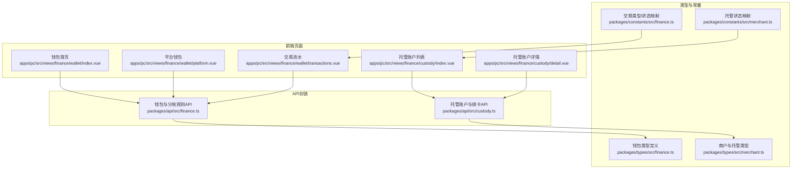
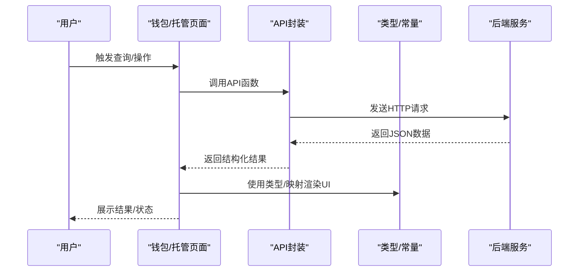
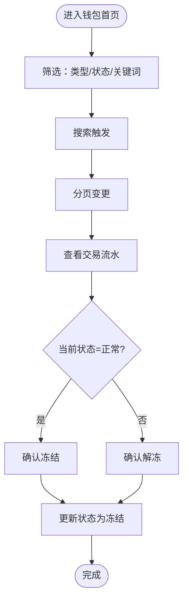
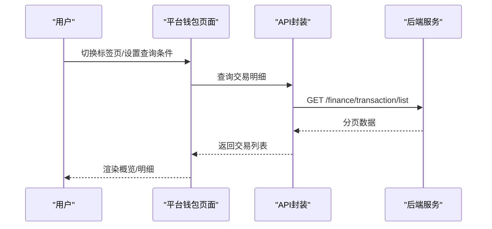
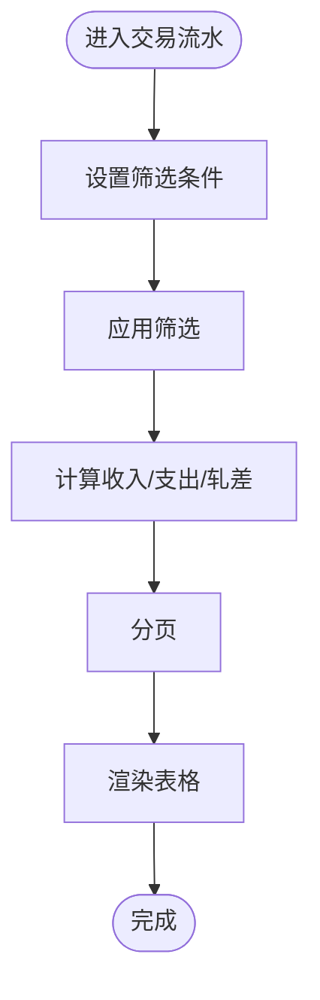
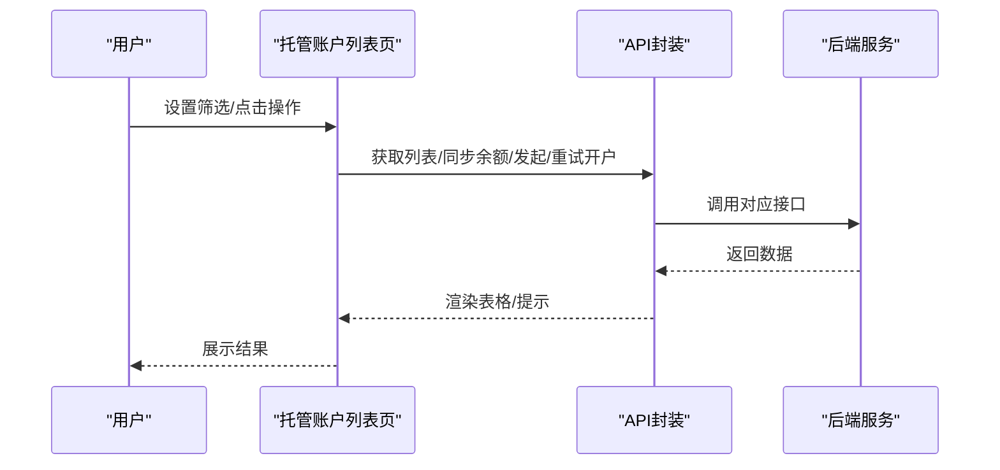
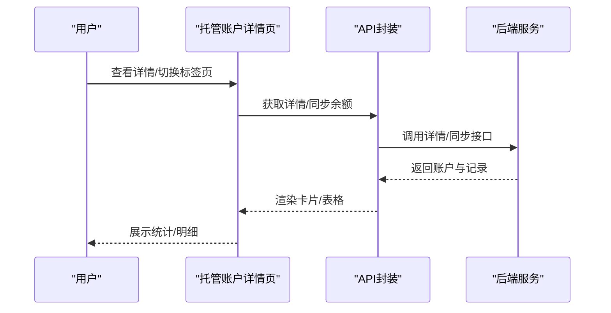
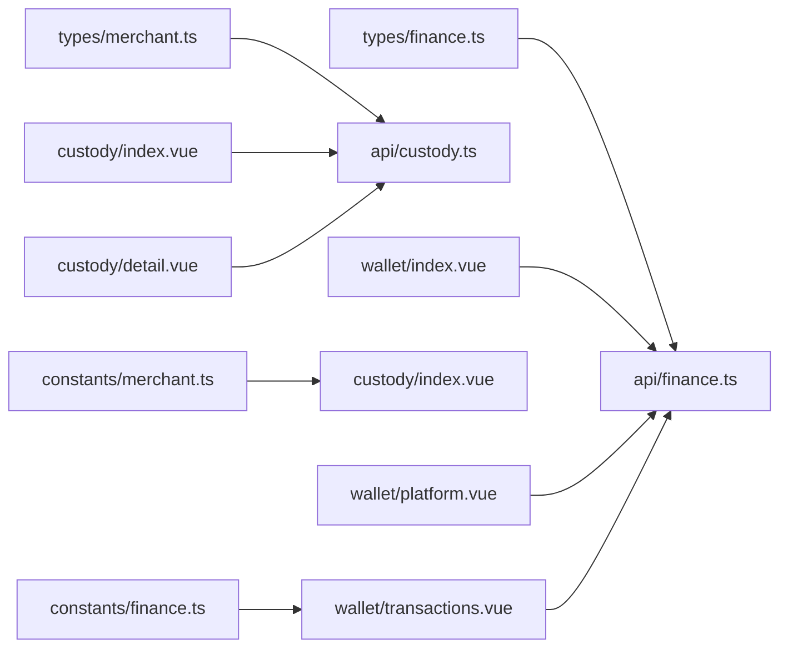

# 资金钱包管理

<cite>
**本文引用的文件**
- [apps/pc/src/views/finance/wallet/index.vue](file://apps/pc/src/views/finance/wallet/index.vue)
- [apps/pc/src/views/finance/wallet/platform.vue](file://apps/pc/src/views/finance/wallet/platform.vue)
- [apps/pc/src/views/finance/wallet/transactions.vue](file://apps/pc/src/views/finance/wallet/transactions.vue)
- [apps/pc/src/views/finance/custody/index.vue](file://apps/pc/src/views/finance/custody/index.vue)
- [apps/pc/src/views/finance/custody/detail.vue](file://apps/pc/src/views/finance/custody/detail.vue)
- [packages/api/src/finance.ts](file://packages/api/src/finance.ts)
- [packages/api/src/custody.ts](file://packages/api/src/custody.ts)
- [packages/types/src/finance.ts](file://packages/types/src/finance.ts)
- [packages/types/src/merchant.ts](file://packages/types/src/merchant.ts)
- [packages/constants/src/finance.ts](file://packages/constants/src/finance.ts)
- [packages/constants/src/merchant.ts](file://packages/constants/src/merchant.ts)
</cite>

## 目录
1. [简介](#简介)
2. [项目结构](#项目结构)
3. [核心组件](#核心组件)
4. [架构总览](#架构总览)
5. [详细组件分析](#详细组件分析)
6. [依赖关系分析](#依赖关系分析)
7. [性能考虑](#性能考虑)
8. [故障排查指南](#故障排查指南)
9. [结论](#结论)
10. [附录](#附录)

## 简介
本文件围绕“资金钱包管理”主题，系统化梳理平台钱包、商户钱包、资金流水查询等核心功能，覆盖余额管理、资金变动记录、交易明细查询、状态监控、钱包开通条件、资金冻结解冻、跨钱包转账、手续费计算、对账流程、异常处理与风控策略，并结合前端页面与API接口，给出可落地的操作流程与可视化图示。

## 项目结构
钱包管理相关能力主要分布在以下位置：
- 前端页面：PC端“财务-钱包”与“财务-托管账户”两大视图
- 类型与常量：统一的数据模型与枚举映射
- API封装：面向钱包与托管账户的HTTP接口

图表来源
- [apps/pc/src/views/finance/wallet/index.vue:1-389](file://apps/pc/src/views/finance/wallet/index.vue#L1-L389)
- [apps/pc/src/views/finance/wallet/platform.vue:1-244](file://apps/pc/src/views/finance/wallet/platform.vue#L1-L244)
- [apps/pc/src/views/finance/wallet/transactions.vue:1-434](file://apps/pc/src/views/finance/wallet/transactions.vue#L1-L434)
- [apps/pc/src/views/finance/custody/index.vue:1-222](file://apps/pc/src/views/finance/custody/index.vue#L1-L222)
- [apps/pc/src/views/finance/custody/detail.vue:1-511](file://apps/pc/src/views/finance/custody/detail.vue#L1-L511)
- [packages/api/src/finance.ts:1-55](file://packages/api/src/finance.ts#L1-L55)
- [packages/api/src/custody.ts:83-97](file://packages/api/src/custody.ts#L83-L97)
- [packages/types/src/finance.ts:1-95](file://packages/types/src/finance.ts#L1-L95)
- [packages/types/src/merchant.ts:1-291](file://packages/types/src/merchant.ts#L1-L291)
- [packages/constants/src/finance.ts:1-25](file://packages/constants/src/finance.ts#L1-L25)
- [packages/constants/src/merchant.ts:1-199](file://packages/constants/src/merchant.ts#L1-L199)

章节来源
- [apps/pc/src/views/finance/wallet/index.vue:1-389](file://apps/pc/src/views/finance/wallet/index.vue#L1-L389)
- [apps/pc/src/views/finance/wallet/platform.vue:1-244](file://apps/pc/src/views/finance/wallet/platform.vue#L1-L244)
- [apps/pc/src/views/finance/wallet/transactions.vue:1-434](file://apps/pc/src/views/finance/wallet/transactions.vue#L1-L434)
- [apps/pc/src/views/finance/custody/index.vue:1-222](file://apps/pc/src/views/finance/custody/index.vue#L1-L222)
- [apps/pc/src/views/finance/custody/detail.vue:1-511](file://apps/pc/src/views/finance/custody/detail.vue#L1-L511)
- [packages/api/src/finance.ts:1-55](file://packages/api/src/finance.ts#L1-L55)
- [packages/api/src/custody.ts:83-97](file://packages/api/src/custody.ts#L83-L97)
- [packages/types/src/finance.ts:1-95](file://packages/types/src/finance.ts#L1-L95)
- [packages/types/src/merchant.ts:1-291](file://packages/types/src/merchant.ts#L1-L291)
- [packages/constants/src/finance.ts:1-25](file://packages/constants/src/finance.ts#L1-L25)
- [packages/constants/src/merchant.ts:1-199](file://packages/constants/src/merchant.ts#L1-L199)

## 核心组件
- 钱包首页（商户账户总览与筛选）
  - 功能：账户类型筛选、状态筛选、关键词搜索、交易流水跳转、冻结/解冻操作
  - 关键交互：分页、搜索、标签颜色映射、按钮状态切换
- 平台钱包
  - 功能：平台账户概览、收支明细查询、平台提现入口
  - 关键交互：收支类型过滤、业务类型过滤、日期范围过滤、分页
- 交易流水
  - 功能：按账户、账户类型、收支类型、业务类型、日期范围过滤；统计收入/支出/轧差
  - 关键交互：多维筛选、分页、金额正负展示、关联单据展示
- 托管账户列表
  - 功能：托管账户总览、状态筛选、可用/冻结/总余额展示、同步余额、发起/重试开户
  - 关键交互：状态标签映射、格式化金额、批量/单项同步
- 托管账户详情
  - 功能：账户余额/冻结/可用统计、交易记录、绑卡记录、开户记录、充值/提现记录
  - 关键交互：多标签页切换、分页、状态文本/颜色映射、余额同步

章节来源
- [apps/pc/src/views/finance/wallet/index.vue:32-138](file://apps/pc/src/views/finance/wallet/index.vue#L32-L138)
- [apps/pc/src/views/finance/wallet/platform.vue:34-157](file://apps/pc/src/views/finance/wallet/platform.vue#L34-L157)
- [apps/pc/src/views/finance/wallet/transactions.vue:6-127](file://apps/pc/src/views/finance/wallet/transactions.vue#L6-L127)
- [apps/pc/src/views/finance/custody/index.vue:3-104](file://apps/pc/src/views/finance/custody/index.vue#L3-L104)
- [apps/pc/src/views/finance/custody/detail.vue:18-242](file://apps/pc/src/views/finance/custody/detail.vue#L18-L242)

## 架构总览
钱包管理由“前端页面 + API封装 + 类型/常量”三层组成，数据流从页面发起请求，经API封装层调用后端接口，返回结构化数据并渲染到UI。

图表来源
- [packages/api/src/finance.ts:1-55](file://packages/api/src/finance.ts#L1-L55)
- [packages/api/src/custody.ts:83-97](file://packages/api/src/custody.ts#L83-L97)
- [packages/types/src/finance.ts:1-95](file://packages/types/src/finance.ts#L1-L95)
- [packages/types/src/merchant.ts:1-291](file://packages/types/src/merchant.ts#L1-L291)
- [packages/constants/src/finance.ts:1-25](file://packages/constants/src/finance.ts#L1-L25)
- [packages/constants/src/merchant.ts:1-199](file://packages/constants/src/merchant.ts#L1-L199)

## 详细组件分析

### 组件A：钱包首页（商户账户）
- 数据模型：账户列表（账户编号、名称、类型、余额、累计收入/支出、状态、托管账户关联等）
- 业务流程：筛选账户类型与状态、关键词搜索、分页、跳转交易流水、冻结/解冻
- 关键点：状态标签颜色、账户类型标签颜色、托管账户是否开通标识

图表来源
- [apps/pc/src/views/finance/wallet/index.vue:32-138](file://apps/pc/src/views/finance/wallet/index.vue#L32-L138)

章节来源
- [apps/pc/src/views/finance/wallet/index.vue:32-138](file://apps/pc/src/views/finance/wallet/index.vue#L32-L138)

### 组件B：平台钱包
- 数据模型：平台账户概览（总余额、今日分账收入、今日提现、待提现金额）、交易明细列表
- 业务流程：切换概览/明细、按收支类型/业务类型/日期范围查询、分页查看

图表来源
- [apps/pc/src/views/finance/wallet/platform.vue:102-156](file://apps/pc/src/views/finance/wallet/platform.vue#L102-L156)
- [packages/api/src/finance.ts:20-22](file://packages/api/src/finance.ts#L20-L22)

章节来源
- [apps/pc/src/views/finance/wallet/platform.vue:102-156](file://apps/pc/src/views/finance/wallet/platform.vue#L102-L156)
- [packages/api/src/finance.ts:20-22](file://packages/api/src/finance.ts#L20-L22)

### 组件C：交易流水
- 数据模型：交易流水（流水号、时间、账户名称/类型、收支类型、业务类型、金额、余额、关联单据、备注）
- 业务流程：多维筛选（账户、账户类型、收支类型、业务类型、日期范围）、统计收入/支出/轧差、分页

图表来源
- [apps/pc/src/views/finance/wallet/transactions.vue:6-127](file://apps/pc/src/views/finance/wallet/transactions.vue#L6-L127)
- [apps/pc/src/views/finance/wallet/transactions.vue:313-347](file://apps/pc/src/views/finance/wallet/transactions.vue#L313-L347)

章节来源
- [apps/pc/src/views/finance/wallet/transactions.vue:6-127](file://apps/pc/src/views/finance/wallet/transactions.vue#L6-L127)
- [apps/pc/src/views/finance/wallet/transactions.vue:313-347](file://apps/pc/src/views/finance/wallet/transactions.vue#L313-L347)

### 组件D：托管账户列表
- 数据模型：托管账户（账户ID、商户名称、开户状态、绑卡状态、账户状态、可用/冻结/总余额、最后同步时间）
- 业务流程：关键词/状态筛选、分页、查看明细、发起/重试开户、同步余额

图表来源
- [apps/pc/src/views/finance/custody/index.vue:3-104](file://apps/pc/src/views/finance/custody/index.vue#L3-L104)
- [apps/pc/src/views/finance/custody/index.vue:148-208](file://apps/pc/src/views/finance/custody/index.vue#L148-L208)
- [packages/api/src/custody.ts:83-97](file://packages/api/src/custody.ts#L83-L97)

章节来源
- [apps/pc/src/views/finance/custody/index.vue:3-104](file://apps/pc/src/views/finance/custody/index.vue#L3-L104)
- [apps/pc/src/views/finance/custody/index.vue:148-208](file://apps/pc/src/views/finance/custody/index.vue#L148-L208)
- [packages/api/src/custody.ts:83-97](file://packages/api/src/custody.ts#L83-L97)

### 组件E：托管账户详情
- 数据模型：账户信息、交易记录、绑卡记录、开户记录、充值/提现记录
- 业务流程：余额同步、多标签页切换、分页查看、状态文本/颜色映射

图表来源
- [apps/pc/src/views/finance/custody/detail.vue:18-242](file://apps/pc/src/views/finance/custody/detail.vue#L18-L242)
- [apps/pc/src/views/finance/custody/detail.vue:322-347](file://apps/pc/src/views/finance/custody/detail.vue#L322-L347)

章节来源
- [apps/pc/src/views/finance/custody/detail.vue:18-242](file://apps/pc/src/views/finance/custody/detail.vue#L18-L242)
- [apps/pc/src/views/finance/custody/detail.vue:322-347](file://apps/pc/src/views/finance/custody/detail.vue#L322-L347)

## 依赖关系分析
- 类型与常量
  - 钱包类型：Account、Transaction、OrderSplitRule、FundCustody 及其枚举
  - 商户与托管类型：CustodyAccount、CustodyBankCard、CustodyOpenRecord 及其状态枚举
  - 映射：交易类型/状态、托管状态、卡类型/绑卡状态等
- API封装
  - 钱包API：账户列表/详情、充值/提现、交易流水、分账规则、托管账户列表、托管释放/退款
  - 托管API：绑卡、重绑、设默认、解绑等
- 页面与API
  - 钱包首页/平台钱包/交易流水：依赖钱包API
  - 托管列表/详情：依赖托管API与商户类型

图表来源
- [packages/types/src/finance.ts:1-95](file://packages/types/src/finance.ts#L1-L95)
- [packages/types/src/merchant.ts:1-291](file://packages/types/src/merchant.ts#L1-L291)
- [packages/constants/src/finance.ts:1-25](file://packages/constants/src/finance.ts#L1-L25)
- [packages/constants/src/merchant.ts:1-199](file://packages/constants/src/merchant.ts#L1-L199)
- [packages/api/src/finance.ts:1-55](file://packages/api/src/finance.ts#L1-L55)
- [packages/api/src/custody.ts:83-97](file://packages/api/src/custody.ts#L83-L97)
- [apps/pc/src/views/finance/wallet/index.vue:1-389](file://apps/pc/src/views/finance/wallet/index.vue#L1-L389)
- [apps/pc/src/views/finance/wallet/platform.vue:1-244](file://apps/pc/src/views/finance/wallet/platform.vue#L1-L244)
- [apps/pc/src/views/finance/wallet/transactions.vue:1-434](file://apps/pc/src/views/finance/wallet/transactions.vue#L1-L434)
- [apps/pc/src/views/finance/custody/index.vue:1-222](file://apps/pc/src/views/finance/custody/index.vue#L1-L222)
- [apps/pc/src/views/finance/custody/detail.vue:1-511](file://apps/pc/src/views/finance/custody/detail.vue#L1-L511)

章节来源
- [packages/types/src/finance.ts:1-95](file://packages/types/src/finance.ts#L1-L95)
- [packages/types/src/merchant.ts:1-291](file://packages/types/src/merchant.ts#L1-L291)
- [packages/constants/src/finance.ts:1-25](file://packages/constants/src/finance.ts#L1-L25)
- [packages/constants/src/merchant.ts:1-199](file://packages/constants/src/merchant.ts#L1-L199)
- [packages/api/src/finance.ts:1-55](file://packages/api/src/finance.ts#L1-L55)
- [packages/api/src/custody.ts:83-97](file://packages/api/src/custody.ts#L83-L97)
- [apps/pc/src/views/finance/wallet/index.vue:1-389](file://apps/pc/src/views/finance/wallet/index.vue#L1-L389)
- [apps/pc/src/views/finance/wallet/platform.vue:1-244](file://apps/pc/src/views/finance/wallet/platform.vue#L1-L244)
- [apps/pc/src/views/finance/wallet/transactions.vue:1-434](file://apps/pc/src/views/finance/wallet/transactions.vue#L1-L434)
- [apps/pc/src/views/finance/custody/index.vue:1-222](file://apps/pc/src/views/finance/custody/index.vue#L1-L222)
- [apps/pc/src/views/finance/custody/detail.vue:1-511](file://apps/pc/src/views/finance/custody/detail.vue#L1-L511)

## 性能考虑
- 前端分页与本地筛选
  - 钱包首页/交易流水在前端进行筛选与分页，减少不必要的网络请求；建议在数据量较大时采用服务端分页与筛选以提升性能。
- 金额格式化
  - 使用千分位与两位小数格式化，避免大数字渲染性能问题；建议在计算统计值时使用整数或高精度库以避免浮点误差。
- 批量操作
  - 托管账户列表支持“批量同步余额”，当前为占位实现，建议后续接入批量接口以降低请求次数。
- 缓存与重试
  - 对高频查询（如交易流水）可引入轻量缓存与去抖策略，避免重复请求。

## 故障排查指南
- 常见错误与提示
  - 获取数据失败：检查接口返回消息，确认网络连通性与鉴权状态。
  - 操作失败：如“开户申请/重试开户/同步余额”失败，查看错误消息并重试。
- 异常处理
  - 页面加载失败：显示错误提示并允许重试；保持分页状态不变。
  - 提交失败：保留表单输入，提示用户修正后重试。
- 风险控制
  - 冻结/解冻：弹窗二次确认，防止误操作。
  - 余额同步：仅在必要时触发，避免频繁轮询导致压力。
  - 托管账户状态：严格依据状态映射渲染UI，避免显示不一致。

章节来源
- [apps/pc/src/views/finance/custody/index.vue:148-208](file://apps/pc/src/views/finance/custody/index.vue#L148-L208)
- [apps/pc/src/views/finance/custody/detail.vue:322-347](file://apps/pc/src/views/finance/custody/detail.vue#L322-L347)
- [apps/pc/src/views/finance/wallet/index.vue:325-345](file://apps/pc/src/views/finance/wallet/index.vue#L325-L345)

## 结论
本方案通过清晰的页面职责划分与完善的API封装，实现了平台钱包、商户钱包与托管账户的统一管理。配合类型与常量映射，确保了前后端一致性与可维护性。建议在后续迭代中强化服务端分页与筛选、优化大列表渲染性能，并完善风控与对账机制，以满足更高并发与合规要求。

## 附录

### A. 钱包与交易类型/状态映射
- 交易类型：充值、提现、支付、收款、退款、冻结、解冻、佣金
- 交易状态：处理中、成功、失败
- 客户端映射：用于UI展示与筛选

章节来源
- [packages/types/src/finance.ts:36-51](file://packages/types/src/finance.ts#L36-L51)
- [packages/constants/src/finance.ts:3-18](file://packages/constants/src/finance.ts#L3-L18)

### B. 托管账户状态映射
- 账户状态：开户中、正常、冻结、注销
- 开户状态：未开户、开户中、已开户、开户失败
- 绑卡状态：未绑卡、已绑卡、绑卡中、绑卡失败
- 卡类型：对公账户、对私账户
- 绑定状态：绑定中、已绑定、绑定失败、已解绑

章节来源
- [packages/types/src/merchant.ts:173-279](file://packages/types/src/merchant.ts#L173-L279)
- [packages/constants/src/merchant.ts:110-199](file://packages/constants/src/merchant.ts#L110-L199)

### C. 钱包API调用路径参考
- 获取账户列表：GET /finance/account/list
- 获取账户详情：GET /finance/account/{id}
- 充值：POST /finance/account/recharge
- 提现：POST /finance/account/withdraw
- 获取交易流水：GET /finance/transaction/list
- 分账规则：GET/POST /finance/split-rule[/...]
- 托管账户：GET /finance/fund-custody/list
- 托管释放/退款：POST /finance/fund-custody/{id}/release|/refund
- 托管绑卡：POST /custody/bank-card[/...]

章节来源
- [packages/api/src/finance.ts:4-54](file://packages/api/src/finance.ts#L4-L54)
- [packages/api/src/custody.ts:83-97](file://packages/api/src/custody.ts#L83-L97)