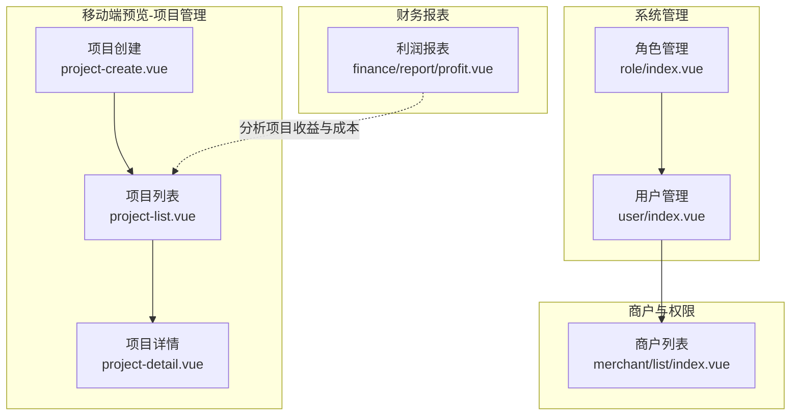
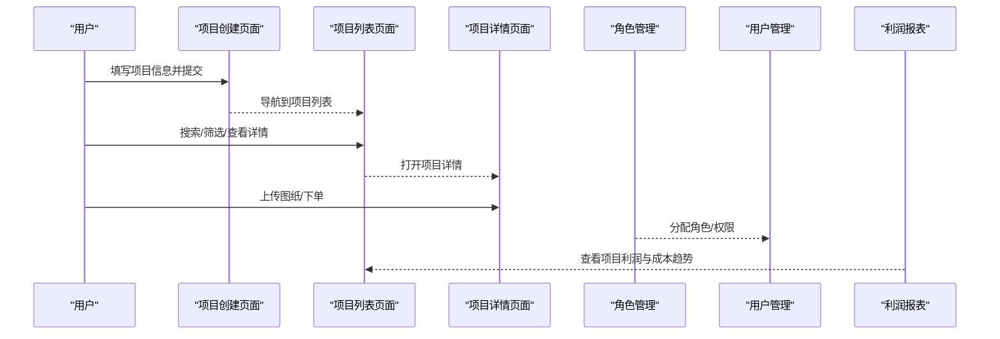
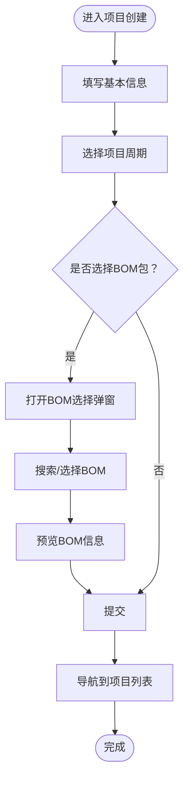
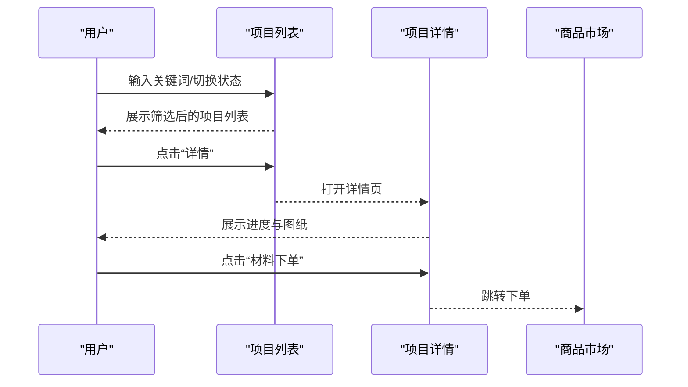
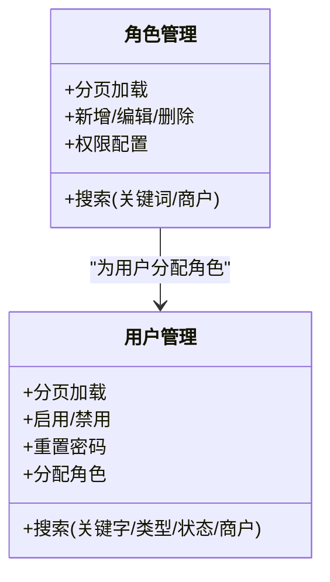
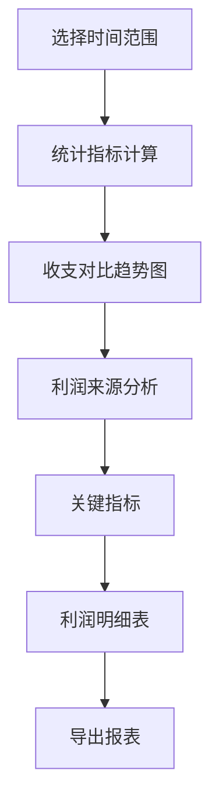
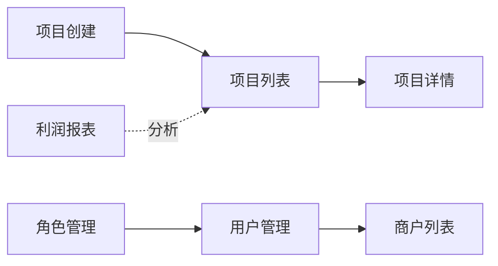

# 项目创建与管理

<cite>
**本文引用的文件**
- [apps/pc/src/views/mp-preview/pages/construction/project-create.vue](file://apps/pc/src/views/mp-preview/pages/construction/project-create.vue)
- [apps/pc/src/views/mp-preview/pages/construction/project-detail.vue](file://apps/pc/src/views/mp-preview/pages/construction/project-detail.vue)
- [apps/pc/src/views/mp-preview/pages/construction/project-list.vue](file://apps/pc/src/views/mp-preview/pages/construction/project-list.vue)
- [apps/pc/src/views/system/role/index.vue](file://apps/pc/src/views/system/role/index.vue)
- [apps/pc/src/views/system/user/index.vue](file://apps/pc/src/views/system/user/index.vue)
- [apps/pc/src/views/finance/report/profit.vue](file://apps/pc/src/views/finance/report/profit.vue)
- [apps/pc/src/views/merchant/list/index.vue](file://apps/pc/src/views/merchant/list/index.vue)
</cite>

## 目录
1. [简介](#简介)
2. [项目结构](#项目结构)
3. [核心组件](#核心组件)
4. [架构总览](#架构总览)
5. [详细组件分析](#详细组件分析)
6. [依赖分析](#依赖分析)
7. [性能考虑](#性能考虑)
8. [故障排查指南](#故障排查指南)
9. [结论](#结论)
10. [附录](#附录)

## 简介
本文件围绕“项目创建与管理”主题，基于现有代码实现，系统化梳理项目基本信息管理、项目成员与角色权限管理、预算与成本控制、进度跟踪与协作流程，并提供最佳实践与常见问题解决方案。文档以移动端预览页面中的项目管理功能为主线，结合系统管理与财务报表模块，帮助读者快速理解并落地项目生命周期管理。

## 项目结构
项目管理功能主要分布在移动端预览页面的“施工”模块，以及系统管理与财务报表模块中：
- 项目创建与列表：移动端预览页的“项目创建”、“项目列表”、“项目详情”
- 成员与角色：系统管理的“角色管理”、“用户管理”
- 预算与成本：财务报表的“利润报表”（用于项目利润与成本趋势分析）
- 商户与权限：商户列表页（商户类型、状态、权限入口）

**图表来源**
- [apps/pc/src/views/mp-preview/pages/construction/project-create.vue:1-498](file://apps/pc/src/views/mp-preview/pages/construction/project-create.vue#L1-L498)
- [apps/pc/src/views/mp-preview/pages/construction/project-list.vue:1-500](file://apps/pc/src/views/mp-preview/pages/construction/project-list.vue#L1-L500)
- [apps/pc/src/views/mp-preview/pages/construction/project-detail.vue:1-417](file://apps/pc/src/views/mp-preview/pages/construction/project-detail.vue#L1-L417)
- [apps/pc/src/views/system/role/index.vue:1-215](file://apps/pc/src/views/system/role/index.vue#L1-L215)
- [apps/pc/src/views/system/user/index.vue:1-243](file://apps/pc/src/views/system/user/index.vue#L1-L243)
- [apps/pc/src/views/finance/report/profit.vue:1-529](file://apps/pc/src/views/finance/report/profit.vue#L1-L529)
- [apps/pc/src/views/merchant/list/index.vue:1-731](file://apps/pc/src/views/merchant/list/index.vue#L1-L731)

**章节来源**
- [apps/pc/src/views/mp-preview/pages/construction/project-create.vue:1-498](file://apps/pc/src/views/mp-preview/pages/construction/project-create.vue#L1-L498)
- [apps/pc/src/views/mp-preview/pages/construction/project-list.vue:1-500](file://apps/pc/src/views/mp-preview/pages/construction/project-list.vue#L1-L500)
- [apps/pc/src/views/mp-preview/pages/construction/project-detail.vue:1-417](file://apps/pc/src/views/mp-preview/pages/construction/project-detail.vue#L1-L417)
- [apps/pc/src/views/system/role/index.vue:1-215](file://apps/pc/src/views/system/role/index.vue#L1-L215)
- [apps/pc/src/views/system/user/index.vue:1-243](file://apps/pc/src/views/system/user/index.vue#L1-L243)
- [apps/pc/src/views/finance/report/profit.vue:1-529](file://apps/pc/src/views/finance/report/profit.vue#L1-L529)
- [apps/pc/src/views/merchant/list/index.vue:1-731](file://apps/pc/src/views/merchant/list/index.vue#L1-L731)

## 核心组件
- 项目创建（project-create.vue）
  - 支持录入门店名称、品牌、省市区、详细地址、开工/竣工日期、BOM包选择与预览
  - 提交后导航至项目列表
- 项目列表（project-list.vue）
  - 支持搜索、状态筛选（进行中/已完成）、批量操作（下单、详情）
  - 展示预算、已下单、已收货、进度百分比与关键日期
- 项目详情（project-detail.vue）
  - 展示项目基本信息、状态、项目经理/电话、进度环形图
  - 支持图纸上传（原始框架图、复尺图），含增删操作
- 角色管理（role/index.vue）
  - 角色列表、搜索、分页、新增/编辑/删除、权限配置
- 用户管理（user/index.vue）
  - 用户列表、搜索、状态切换、重置密码、分配角色
- 利润报表（finance/report/profit.vue）
  - 时间范围选择、收支对比趋势、利润来源分析、关键指标与明细
- 商户列表（merchant/list/index.vue）
  - 商户类型、入驻状态、启用状态、合同/账号入口、进入系统

**章节来源**
- [apps/pc/src/views/mp-preview/pages/construction/project-create.vue:1-498](file://apps/pc/src/views/mp-preview/pages/construction/project-create.vue#L1-L498)
- [apps/pc/src/views/mp-preview/pages/construction/project-list.vue:1-500](file://apps/pc/src/views/mp-preview/pages/construction/project-list.vue#L1-L500)
- [apps/pc/src/views/mp-preview/pages/construction/project-detail.vue:1-417](file://apps/pc/src/views/mp-preview/pages/construction/project-detail.vue#L1-L417)
- [apps/pc/src/views/system/role/index.vue:1-215](file://apps/pc/src/views/system/role/index.vue#L1-L215)
- [apps/pc/src/views/system/user/index.vue:1-243](file://apps/pc/src/views/system/user/index.vue#L1-L243)
- [apps/pc/src/views/finance/report/profit.vue:1-529](file://apps/pc/src/views/finance/report/profit.vue#L1-L529)
- [apps/pc/src/views/merchant/list/index.vue:1-731](file://apps/pc/src/views/merchant/list/index.vue#L1-L731)

## 架构总览
项目管理功能由“移动端预览页面 + 系统管理 + 财务报表 + 商户体系”构成，形成“前端页面-业务数据-权限控制-财务分析”的闭环。

**图表来源**
- [apps/pc/src/views/mp-preview/pages/construction/project-create.vue:189-192](file://apps/pc/src/views/mp-preview/pages/construction/project-create.vue#L189-L192)
- [apps/pc/src/views/mp-preview/pages/construction/project-list.vue:222-232](file://apps/pc/src/views/mp-preview/pages/construction/project-list.vue#L222-L232)
- [apps/pc/src/views/mp-preview/pages/construction/project-detail.vue:101-151](file://apps/pc/src/views/mp-preview/pages/construction/project-detail.vue#L101-L151)
- [apps/pc/src/views/system/role/index.vue:184-209](file://apps/pc/src/views/system/role/index.vue#L184-L209)
- [apps/pc/src/views/system/user/index.vue:193-237](file://apps/pc/src/views/system/user/index.vue#L193-L237)
- [apps/pc/src/views/finance/report/profit.vue:200-259](file://apps/pc/src/views/finance/report/profit.vue#L200-L259)

## 详细组件分析

### 项目创建流程（project-create.vue）
- 表单字段与交互
  - 基本信息：门店名称、品牌、省市区、详细地址
  - 项目周期：开工/竣工日期（日期选择器）
  - BOM包：弹窗选择、搜索、预览（材料项数与总价）
  - 提交：触发事件并导航到项目列表
- 数据结构要点
  - 表单数据对象包含基础信息、日期、BOM信息
  - BOM列表与过滤搜索
- 流程图

**图表来源**
- [apps/pc/src/views/mp-preview/pages/construction/project-create.vue:131-192](file://apps/pc/src/views/mp-preview/pages/construction/project-create.vue#L131-L192)

**章节来源**
- [apps/pc/src/views/mp-preview/pages/construction/project-create.vue:1-498](file://apps/pc/src/views/mp-preview/pages/construction/project-create.vue#L1-L498)

### 项目列表与详情（project-list.vue、project-detail.vue）
- 项目列表
  - 搜索：按门店名称/品牌
  - 状态筛选：全部/进行中/已完成
  - 列表项：品牌、地址、BOM包、预算、已下单、已收货、进度、日期
  - 操作：下单、详情
- 项目详情
  - 基本信息卡片：状态标签、项目经理/电话、工期
  - 施工进度：环形进度图（SVG）
  - 图纸上传：原始框架图、复尺图，支持添加/删除
  - 行动按钮：跳转商品市场下单

**图表来源**
- [apps/pc/src/views/mp-preview/pages/construction/project-list.vue:117-233](file://apps/pc/src/views/mp-preview/pages/construction/project-list.vue#L117-L233)
- [apps/pc/src/views/mp-preview/pages/construction/project-detail.vue:109-151](file://apps/pc/src/views/mp-preview/pages/construction/project-detail.vue#L109-L151)

**章节来源**
- [apps/pc/src/views/mp-preview/pages/construction/project-list.vue:1-500](file://apps/pc/src/views/mp-preview/pages/construction/project-list.vue#L1-L500)
- [apps/pc/src/views/mp-preview/pages/construction/project-detail.vue:1-417](file://apps/pc/src/views/mp-preview/pages/construction/project-detail.vue#L1-L417)

### 成员与角色权限（role/index.vue、user/index.vue）
- 角色管理
  - 角色列表：角色ID、名称、所属商户、类型、创建时间
  - 操作：新增、编辑、权限配置、删除（系统角色不可删）
  - 搜索：关键词、所属商户
- 用户管理
  - 用户列表：用户名、姓名、手机号、用户类型、所属商户、默认管理员、状态、最后登录
  - 操作：编辑、重置密码、分配角色、删除（默认管理员不可删）
  - 状态切换：启用/禁用
- 权限控制矩阵（参考商户列表页PRD说明）
  - 超级管理员：可进入商户系统
  - 平台管理员：可删除商户、管理账号
  - 运营人员：日常运营，可查看/编辑
  - 只读用户：仅查看

**图表来源**
- [apps/pc/src/views/system/role/index.vue:81-214](file://apps/pc/src/views/system/role/index.vue#L81-L214)
- [apps/pc/src/views/system/user/index.vue:114-242](file://apps/pc/src/views/system/user/index.vue#L114-L242)

**章节来源**
- [apps/pc/src/views/system/role/index.vue:1-215](file://apps/pc/src/views/system/role/index.vue#L1-L215)
- [apps/pc/src/views/system/user/index.vue:1-243](file://apps/pc/src/views/system/user/index.vue#L1-L243)
- [apps/pc/src/views/merchant/list/index.vue:547-602](file://apps/pc/src/views/merchant/list/index.vue#L547-L602)

### 预算与成本控制（finance/report/profit.vue）
- 时间维度：今日/本周/本月/本年/自定义区间
- 统计指标：净利润、总收入、总支出、利润率
- 趋势分析：收支对比柱状图、利润来源占比、关键指标（毛利率、净利率、资金周转率、应收账款周转天数）
- 明细：按日期展示收入/支出/利润/利润率/主要来源/环比变化
- 导出：导出当前报表数据

**图表来源**
- [apps/pc/src/views/finance/report/profit.vue:196-260](file://apps/pc/src/views/finance/report/profit.vue#L196-L260)

**章节来源**
- [apps/pc/src/views/finance/report/profit.vue:1-529](file://apps/pc/src/views/finance/report/profit.vue#L1-L529)

### 商户与权限入口（merchant/list/index.vue）
- 商户类型：工程公司、供应商、施工方
- 入驻状态：待审核、已通过、已驳回（不可逆）
- 启用状态：启用/禁用（受入驻状态约束）
- 操作：查看、编辑、合同、账号、进入系统、删除
- 权限矩阵：不同角色对功能点的可见性与可操作性

**章节来源**
- [apps/pc/src/views/merchant/list/index.vue:1-731](file://apps/pc/src/views/merchant/list/index.vue#L1-L731)

## 依赖分析
- 组件耦合
  - 项目创建/列表/详情页面内聚于“施工”模块，职责清晰
  - 系统管理模块与商户模块相互配合，支撑项目成员与权限管理
  - 财务报表模块为项目成本与收益提供数据支撑
- 外部依赖
  - API封装：系统管理与商户列表页使用统一API调用（如获取列表、删除、更新状态等）
  - UI库：Arco Design（表格、卡片、按钮、标签、进度条等）
- 潜在风险
  - 项目详情中的“材料下单”按钮直接跳转市场，需确保路由与鉴权一致
  - 商户进入系统为本地存储模拟，生产环境需替换为安全的免密登录方案

**图表来源**
- [apps/pc/src/views/mp-preview/pages/construction/project-create.vue:189-192](file://apps/pc/src/views/mp-preview/pages/construction/project-create.vue#L189-L192)
- [apps/pc/src/views/mp-preview/pages/construction/project-list.vue:222-232](file://apps/pc/src/views/mp-preview/pages/construction/project-list.vue#L222-L232)
- [apps/pc/src/views/mp-preview/pages/construction/project-detail.vue:101-105](file://apps/pc/src/views/mp-preview/pages/construction/project-detail.vue#L101-L105)
- [apps/pc/src/views/system/role/index.vue:184-209](file://apps/pc/src/views/system/role/index.vue#L184-L209)
- [apps/pc/src/views/system/user/index.vue:193-237](file://apps/pc/src/views/system/user/index.vue#L193-L237)
- [apps/pc/src/views/finance/report/profit.vue:253-259](file://apps/pc/src/views/finance/report/profit.vue#L253-L259)

**章节来源**
- [apps/pc/src/views/system/role/index.vue:84-214](file://apps/pc/src/views/system/role/index.vue#L84-L214)
- [apps/pc/src/views/system/user/index.vue:122-242](file://apps/pc/src/views/system/user/index.vue#L122-L242)
- [apps/pc/src/views/merchant/list/index.vue:686-705](file://apps/pc/src/views/merchant/list/index.vue#L686-L705)

## 性能考虑
- 列表分页与搜索
  - 使用分页参数控制数据量，避免一次性加载过多项目
  - 搜索建议增加防抖，减少频繁请求
- 图片上传
  - 限制上传数量与尺寸，避免内存占用过高
  - 上传前进行格式与大小校验
- 图表渲染
  - 趋势图与进度图采用轻量级SVG或Canvas，避免复杂DOM节点
- 状态切换
  - 启用/禁用开关与状态变更需在失败时回滚，保证界面一致性

## 故障排查指南
- 项目创建提交无效
  - 检查必填字段是否完整（门店名称、品牌、省市区、详细地址、开工日期）
  - 确认提交事件绑定与导航逻辑
  - 参考路径：[apps/pc/src/views/mp-preview/pages/construction/project-create.vue:189-192](file://apps/pc/src/views/mp-preview/pages/construction/project-create.vue#L189-L192)
- 项目列表无数据或筛选异常
  - 检查搜索关键词与状态筛选逻辑
  - 确认分页参数与数据源
  - 参考路径：[apps/pc/src/views/mp-preview/pages/construction/project-list.vue:197-212](file://apps/pc/src/views/mp-preview/pages/construction/project-list.vue#L197-L212)
- 详情页进度不更新
  - 检查进度数据来源与SVG描边偏移计算
  - 参考路径：[apps/pc/src/views/mp-preview/pages/construction/project-detail.vue:47-55](file://apps/pc/src/views/mp-preview/pages/construction/project-detail.vue#L47-L55)
- 用户状态切换失败
  - 确认状态变更接口与错误回滚逻辑
  - 参考路径：[apps/pc/src/views/system/user/index.vue:215-223](file://apps/pc/src/views/system/user/index.vue#L215-L223)
- 角色/用户删除失败
  - 检查删除接口与错误提示
  - 参考路径：[apps/pc/src/views/system/role/index.vue:196-204](file://apps/pc/src/views/system/role/index.vue#L196-L204)、[apps/pc/src/views/system/user/index.vue:205-213](file://apps/pc/src/views/system/user/index.vue#L205-L213)
- 利润报表导出无数据
  - 检查导出数据源与提示逻辑
  - 参考路径：[apps/pc/src/views/finance/report/profit.vue:253-259](file://apps/pc/src/views/finance/report/profit.vue#L253-L259)

**章节来源**
- [apps/pc/src/views/mp-preview/pages/construction/project-create.vue:189-192](file://apps/pc/src/views/mp-preview/pages/construction/project-create.vue#L189-L192)
- [apps/pc/src/views/mp-preview/pages/construction/project-list.vue:197-212](file://apps/pc/src/views/mp-preview/pages/construction/project-list.vue#L197-L212)
- [apps/pc/src/views/mp-preview/pages/construction/project-detail.vue:47-55](file://apps/pc/src/views/mp-preview/pages/construction/project-detail.vue#L47-L55)
- [apps/pc/src/views/system/user/index.vue:215-223](file://apps/pc/src/views/system/user/index.vue#L215-L223)
- [apps/pc/src/views/system/role/index.vue:196-204](file://apps/pc/src/views/system/role/index.vue#L196-L204)
- [apps/pc/src/views/finance/report/profit.vue:253-259](file://apps/pc/src/views/finance/report/profit.vue#L253-L259)

## 结论
本项目管理功能以移动端预览页面为核心，结合系统管理与财务报表，实现了从“项目创建—列表管理—详情跟踪—成员权限—成本分析”的完整闭环。建议在后续迭代中：
- 将项目预算与执行监控接入真实数据源，完善预算调整与预警机制
- 在项目详情中增加里程碑与计划对比视图
- 强化权限矩阵与审计日志，确保项目数据安全
- 优化图片上传与预览体验，提升协作效率

## 附录
- 项目管理最佳实践
  - 项目创建：标准化字段与必填校验，BOM包作为基线模板
  - 成员协作：通过角色与用户管理明确职责，分配最小权限
  - 预算控制：定期对比预算与实际执行，利用利润报表进行趋势分析
  - 进度监控：以里程碑为节点，结合SVG进度图直观展示
- 常见问题
  - 忘记必填字段导致提交失败：在前端增加实时校验与提示
  - 权限不足无法删除角色/用户：检查权限矩阵与按钮渲染逻辑
  - 图片上传失败：限制格式与大小，增加失败重试与提示