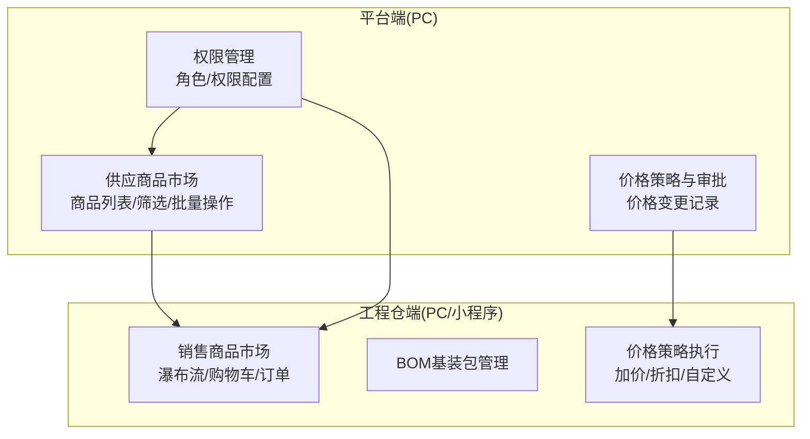
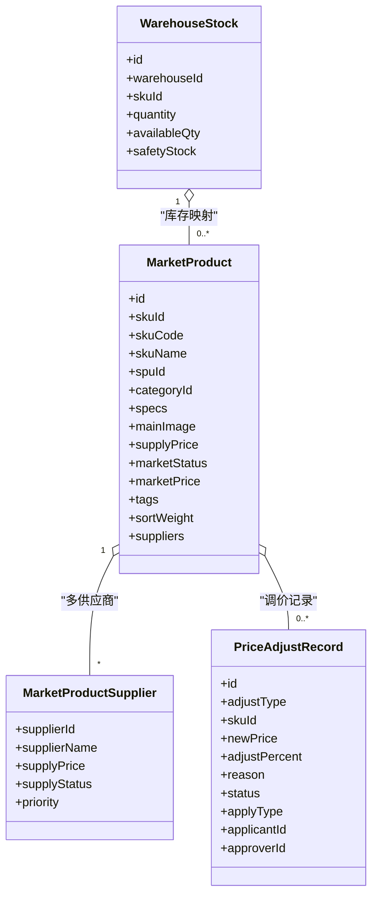
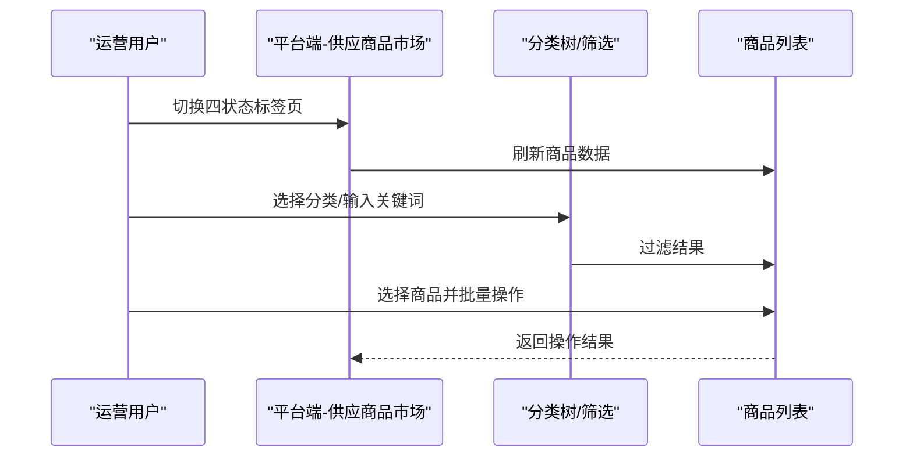
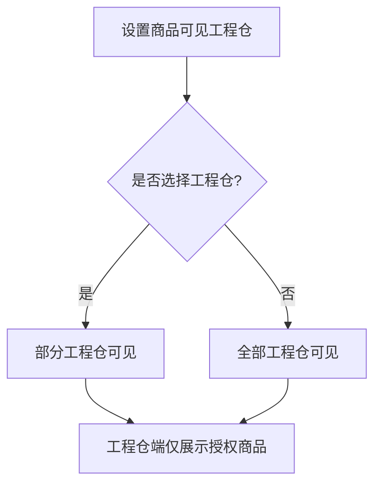
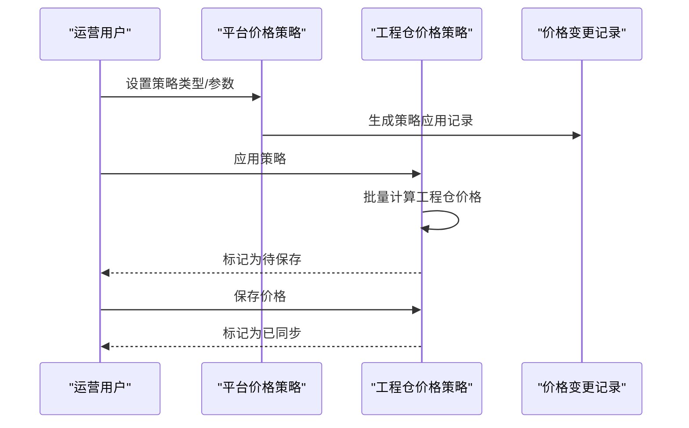
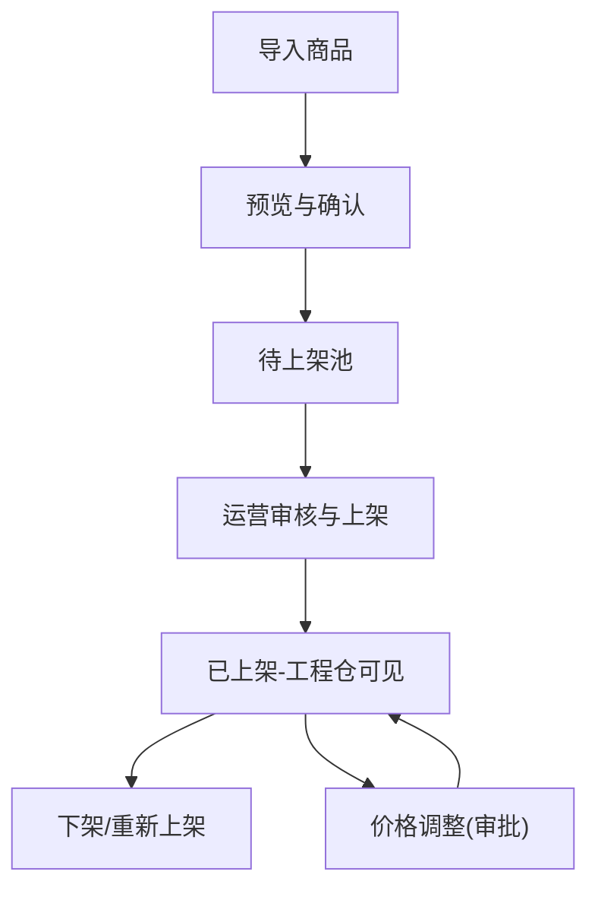
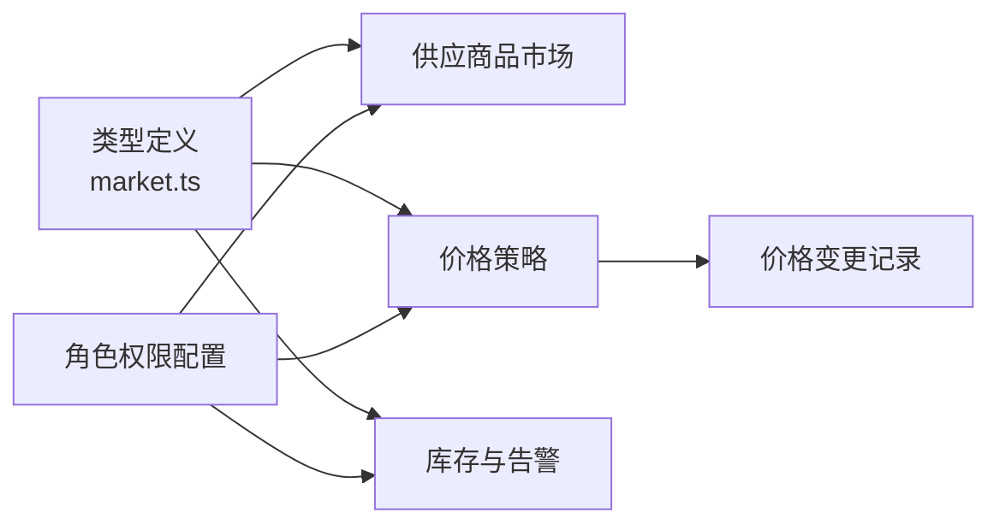

# 项目商品市场

<cite>
**本文引用的文件**
- [PRD-商品市场模块v1.0.md](file://PRD-商品市场模块v1.0.md)
- [apps/pc/src/views/market/list/index.vue](file://apps/pc/src/views/market/list/index.vue)
- [apps/pc/src/views/market/price/index.vue](file://apps/pc/src/views/market/price/index.vue)
- [apps/pc/src/views/construction/market/index.vue](file://apps/pc/src/views/construction/market/index.vue)
- [apps/pc/src/views/warehouse/market/index.vue](file://apps/pc/src/views/warehouse/market/index.vue)
- [apps/pc/src/views/construction/price/index.vue](file://apps/pc/src/views/construction/price/index.vue)
- [packages/types/src/market.ts](file://packages/types/src/market.ts)
- [apps/pc/src/views/system/role/index.vue](file://apps/pc/src/views/system/role/index.vue)
- [apps/pc/src/views/system/role/components/PermissionDrawer.vue](file://apps/pc/src/views/system/role/components/PermissionDrawer.vue)
- [apps/pc/src/views/system/user/index.vue](file://apps/pc/src/views/system/user/index.vue)
- [docs/PRD/02-业务流程设计.md](file://docs/PRD/02-业务流程设计.md)
</cite>

## 目录
1. [简介](#简介)
2. [项目结构](#项目结构)
3. [核心组件](#核心组件)
4. [架构总览](#架构总览)
5. [详细组件分析](#详细组件分析)
6. [依赖分析](#依赖分析)
7. [性能考虑](#性能考虑)
8. [故障排查指南](#故障排查指南)
9. [结论](#结论)
10. [附录](#附录)

## 简介
本文件面向“项目商品市场”功能，系统化阐述平台端“供应商品市场”与工程仓端“销售商品市场”的差异、商品展示与筛选、权限控制体系、价格策略配置与执行、以及商品管理操作（上架/下架/调价/权限设置/导入）等核心能力。并结合PRD与前端实现，给出运营策略与管理方法建议。

## 项目结构
- 平台端（PC）供应商品市场：商品生命周期管理、批量运营、权限配置、价格审批与记录。
- 工程仓端（PC/小程序）销售商品市场：商品瀑布流展示、购物车、订单、BOM套餐。
- 价格策略：默认价、加价策略、折扣策略、自定义价格；支持按工程仓维度执行。
- 权限体系：RBAC角色权限，支持按角色配置功能权限与数据权限。

图表来源
- [apps/pc/src/views/market/list/index.vue:1-238](file://apps/pc/src/views/market/list/index.vue#L1-L238)
- [apps/pc/src/views/market/price/index.vue:1-548](file://apps/pc/src/views/market/price/index.vue#L1-L548)
- [apps/pc/src/views/construction/market/index.vue:1-786](file://apps/pc/src/views/construction/market/index.vue#L1-L786)
- [apps/pc/src/views/warehouse/market/index.vue:1-440](file://apps/pc/src/views/warehouse/market/index.vue#L1-L440)
- [apps/pc/src/views/construction/price/index.vue:1-344](file://apps/pc/src/views/construction/price/index.vue#L1-L344)

章节来源
- [apps/pc/src/views/market/list/index.vue:1-238](file://apps/pc/src/views/market/list/index.vue#L1-L238)
- [apps/pc/src/views/construction/market/index.vue:1-786](file://apps/pc/src/views/construction/market/index.vue#L1-L786)
- [apps/pc/src/views/warehouse/market/index.vue:1-440](file://apps/pc/src/views/warehouse/market/index.vue#L1-L440)

## 核心组件
- 供应商品市场（平台端）：商品四状态（全部/待上架/已上架/已下架）视图、分类树筛选、供应商/供货状态筛选、批量上架/下架/调价、权限设置、导入商品、排序权重、标签管理。
- 销售商品市场（工程仓端）：分类树、搜索、排序、瀑布流卡片、加入购物车、工程仓价格与库存。
- 价格策略：默认价、加价（固定金额/百分比）、折扣、自定义价格；支持批量应用与逐项保存。
- 权限控制：角色-权限树配置，支持按工程仓维度设置商品可见范围。

章节来源
- [apps/pc/src/views/market/list/index.vue:1-800](file://apps/pc/src/views/market/list/index.vue#L1-L800)
- [apps/pc/src/views/construction/market/index.vue:1-786](file://apps/pc/src/views/construction/market/index.vue#L1-L786)
- [apps/pc/src/views/warehouse/market/index.vue:1-440](file://apps/pc/src/views/warehouse/market/index.vue#L1-L440)
- [apps/pc/src/views/construction/price/index.vue:1-344](file://apps/pc/src/views/construction/price/index.vue#L1-L344)
- [packages/types/src/market.ts:1-212](file://packages/types/src/market.ts#L1-L212)

## 架构总览
- 数据模型：商品（SKU/SPU）、供应商、分类、价格调整记录、库存告警、工程仓价格等。
- 业务边界：
  - 平台端：商品生命周期、价格审批、权限治理、价格策略与记录。
  - 工程仓端：商品展示、价格策略执行、购物车与订单、BOM套餐。
- 权限边界：平台端可设置商品可见范围（工程仓维度），工程仓端仅可见授权商品。

图表来源
- [packages/types/src/market.ts:18-75](file://packages/types/src/market.ts#L18-L75)
- [packages/types/src/market.ts:48-57](file://packages/types/src/market.ts#L48-L57)
- [packages/types/src/market.ts:77-120](file://packages/types/src/market.ts#L77-L120)
- [packages/types/src/market.ts:140-162](file://packages/types/src/market.ts#L140-L162)

## 详细组件分析

### 1) 商品展示与筛选（平台端/工程仓端）
- 平台端供应商品市场
  - 四状态标签页：全部/待上架/已上架/已下架，自动统计数量并刷新数据。
  - 分类树筛选：左侧分类树，点击联动筛选；支持搜索分类。
  - 搜索与筛选：关键词、分类、供应商、供货状态。
  - 商品卡片字段：主图、SKU名称/编码、规格标签、所属SPU、历史采购量、供应商（多供应商悬浮展示最低价）、供货状态、进入方式、上架状态、可见工程仓、排序权重。
  - 批量操作：批量上架、批量下架、批量调价、批量设置权限。
- 工程仓端销售商品市场
  - 顶部搜索框、购物车入口、排序方式（综合/销量/价格）。
  - 瀑布流卡片：主图、名称、规格、品牌、供应商数量与最低价、价格与单位、加入购物车按钮。
  - 分类树与计数：按分类统计商品数量，支持重置筛选。

图表来源
- [apps/pc/src/views/market/list/index.vue:1-238](file://apps/pc/src/views/market/list/index.vue#L1-L238)
- [apps/pc/src/views/warehouse/market/index.vue:1-440](file://apps/pc/src/views/warehouse/market/index.vue#L1-L440)

章节来源
- [apps/pc/src/views/market/list/index.vue:1-238](file://apps/pc/src/views/market/list/index.vue#L1-L238)
- [apps/pc/src/views/warehouse/market/index.vue:1-440](file://apps/pc/src/views/warehouse/market/index.vue#L1-L440)

### 2) 商品权限控制（项目成员购买权限、商品访问限制）
- 平台端：商品级“可见工程仓”设置，支持多工程仓选择与全选/清空；支持“全部可见”与“部分可见”两种模式。
- 工程仓端：仅展示授权可见的商品；工程仓主体/仓库维度筛选。
- 权限体系：RBAC角色权限，支持按角色配置功能权限与数据权限；角色-权限树配置，支持系统预设角色与自定义角色。

图表来源
- [apps/pc/src/views/market/list/index.vue:486-527](file://apps/pc/src/views/market/list/index.vue#L486-L527)
- [apps/pc/src/views/construction/market/index.vue:195-201](file://apps/pc/src/views/construction/market/index.vue#L195-L201)

章节来源
- [apps/pc/src/views/market/list/index.vue:486-527](file://apps/pc/src/views/market/list/index.vue#L486-L527)
- [apps/pc/src/views/construction/market/index.vue:195-201](file://apps/pc/src/views/construction/market/index.vue#L195-L201)
- [apps/pc/src/views/system/role/index.vue:1-215](file://apps/pc/src/views/system/role/index.vue#L1-L215)
- [apps/pc/src/views/system/role/components/PermissionDrawer.vue:1-179](file://apps/pc/src/views/system/role/components/PermissionDrawer.vue#L1-L179)
- [docs/PRD/02-业务流程设计.md:1229-1266](file://docs/PRD/02-业务流程设计.md#L1229-L1266)

### 3) 价格策略配置（项目专属价格、批量折扣、会员价）
- 平台端价格策略
  - 默认价：使用市场价。
  - 加价策略：固定金额或百分比加价。
  - 折扣策略：按百分比折扣。
  - 自定义价格：逐项编辑工程仓价格。
  - 批量应用：根据策略类型批量计算并标记为“待保存”，需确认后生效。
- 工程仓端价格策略
  - 价格策略设置：策略类型切换（默认/加价/折扣/自定义）。
  - 应用策略：批量计算工程仓价格并标记为“待保存”。
  - 保存价格：将“待保存”状态更新为“已同步”。

图表来源
- [apps/pc/src/views/market/price/index.vue:1-548](file://apps/pc/src/views/market/price/index.vue#L1-L548)
- [apps/pc/src/views/construction/price/index.vue:1-344](file://apps/pc/src/views/construction/price/index.vue#L1-L344)

章节来源
- [apps/pc/src/views/market/price/index.vue:1-548](file://apps/pc/src/views/market/price/index.vue#L1-L548)
- [apps/pc/src/views/construction/price/index.vue:1-344](file://apps/pc/src/views/construction/price/index.vue#L1-L344)

### 4) 商品管理操作（商品添加、价格编辑、库存管理）
- 商品添加（导入）
  - 从“供货商品”导入至“待上架”，支持预览与确认导入。
- 商品上架/下架
  - 平台端：支持单个/批量上架/下架，支持设置标签与排序权重。
  - 工程仓端：支持批量上架/下架。
- 价格编辑
  - 平台端：支持单个/批量调价，支持固定价格或百分比调整，并记录调价原因与审批状态。
  - 工程仓端：支持自定义价格与保存。
- 库存管理
  - 工程仓端：销售库存字段展示，支持按工程仓主体/仓库维度筛选。

图表来源
- [apps/pc/src/views/market/list/index.vue:240-337](file://apps/pc/src/views/market/list/index.vue#L240-L337)
- [apps/pc/src/views/construction/market/index.vue:621-683](file://apps/pc/src/views/construction/market/index.vue#L621-L683)

章节来源
- [apps/pc/src/views/market/list/index.vue:240-470](file://apps/pc/src/views/market/list/index.vue#L240-L470)
- [apps/pc/src/views/construction/market/index.vue:621-683](file://apps/pc/src/views/construction/market/index.vue#L621-L683)

### 5) 项目商品市场与普通商品市场的区别
- 业务边界
  - 平台端：统一商品覆盖、价格监控、权限治理、价格策略与审批。
  - 工程仓端：商品展示、购物车、订单、BOM套餐、价格策略执行。
- 可见范围
  - 平台端：可设置商品对工程仓的可见范围；工程仓端仅可见授权商品。
- 价格策略
  - 平台端：默认价、加价/折扣策略、自定义价格；支持批量应用与审批。
  - 工程仓端：按策略类型执行价格，支持保存与同步。

章节来源
- [PRD-商品市场模块v1.0.md:89-166](file://PRD-商品市场模块v1.0.md#L89-L166)
- [apps/pc/src/views/market/list/index.vue:486-527](file://apps/pc/src/views/market/list/index.vue#L486-L527)
- [apps/pc/src/views/construction/price/index.vue:1-344](file://apps/pc/src/views/construction/price/index.vue#L1-L344)

## 依赖分析
- 类型与数据模型：通过统一类型定义（MarketProduct、PriceAdjustRecord、WarehouseStock 等）保证前后端一致性。
- 权限依赖：角色权限树配置，支持功能权限与数据权限分离；工程仓端仅可见授权商品。
- 价格策略依赖：策略类型与参数在平台端配置，工程仓端执行并保存。

图表来源
- [packages/types/src/market.ts:1-212](file://packages/types/src/market.ts#L1-L212)
- [apps/pc/src/views/system/role/index.vue:1-215](file://apps/pc/src/views/system/role/index.vue#L1-L215)
- [apps/pc/src/views/market/price/index.vue:1-548](file://apps/pc/src/views/market/price/index.vue#L1-L548)

章节来源
- [packages/types/src/market.ts:1-212](file://packages/types/src/market.ts#L1-L212)
- [apps/pc/src/views/system/role/index.vue:1-215](file://apps/pc/src/views/system/role/index.vue#L1-L215)

## 性能考虑
- 商品列表加载：要求首屏加载 < 1s，500条数据表格渲染无卡顿。
- 购物车计算：变更时实时计算，要求 < 100ms。
- 并发支持：页面并发支持 500人同时在线。
- 搜索与筛选：分类树渲染 < 500ms；关键词搜索即时响应。

章节来源
- [PRD-商品市场模块v1.0.md:250-270](file://PRD-商品市场模块v1.0.md#L250-L270)

## 故障排查指南
- 加购时库存不足：提示“当前供应商库存仅剩下X件”。
- 商品已下架：购物车置灰，结算时自动排除。
- 供应商停货：自动切换到下一个最低价供应商。
- 价格异常波动：通过价格变更记录与策略应用进行审计与回溯。

章节来源
- [PRD-商品市场模块v1.0.md:271-278](file://PRD-商品市场模块v1.0.md#L271-L278)
- [apps/pc/src/views/market/price/index.vue:1-548](file://apps/pc/src/views/market/price/index.vue#L1-L548)

## 结论
项目商品市场以“平台治理+工程仓执行”为核心，通过严格的权限控制与价格策略，实现商品的标准化、可视化与可控化运营。平台端负责商品生命周期与价格治理，工程仓端负责价格策略执行与销售闭环。建议运营团队遵循PRD目标，强化价格审批与权限治理，持续优化商品展示与筛选体验，提升采购效率与成本控制能力。

## 附录
- 运营策略建议
  - 选品与上架：建立“自动进入/手动导入”的双通道，确保商品质量与合规。
  - 价格治理：设定价格预警阈值（如单次涨价>5%、30天累计>10%），联动采购计划。
  - 区域化运营：按工程仓维度设置商品可见范围，实现差异化供给。
  - BOM套餐：结合BOM包提升下单效率，减少漏买错买。
- 管理方法
  - 定期巡检：每日检查待上架商品、价格异常波动与供应商停货预警。
  - 权限治理：定期复核角色权限与商品可见范围，避免越权与信息泄露。
  - 数据驱动：基于价格变更记录与转化漏斗优化运营策略。

章节来源
- [PRD-商品市场模块v1.0.md:281-304](file://PRD-商品市场模块v1.0.md#L281-L304)
- [apps/pc/src/views/market/list/index.vue:601-770](file://apps/pc/src/views/market/list/index.vue#L601-L770)
- [apps/pc/src/views/market/price/index.vue:194-258](file://apps/pc/src/views/market/price/index.vue#L194-L258)