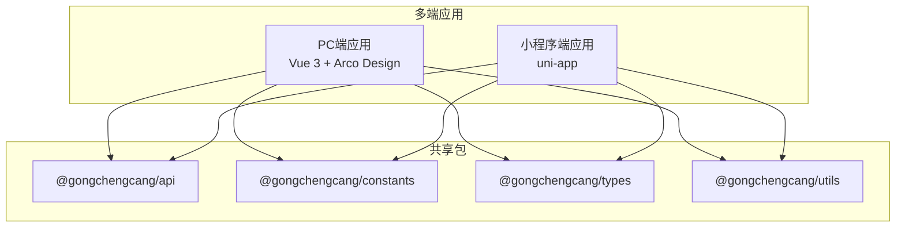
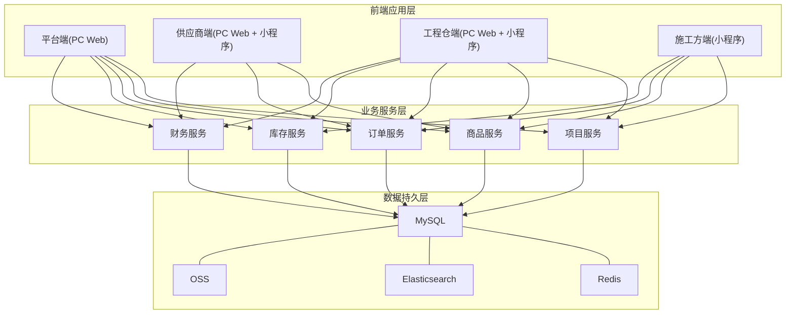
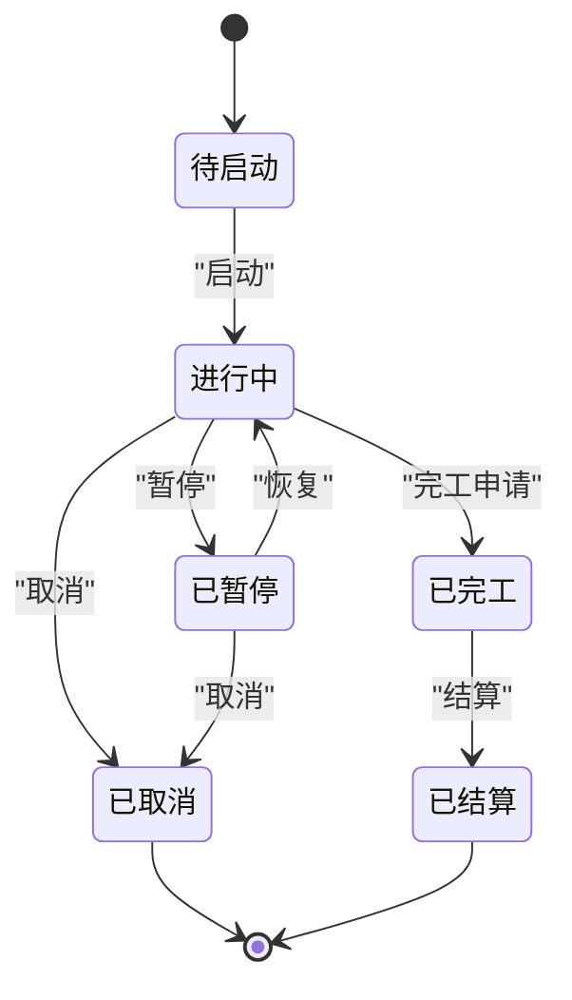
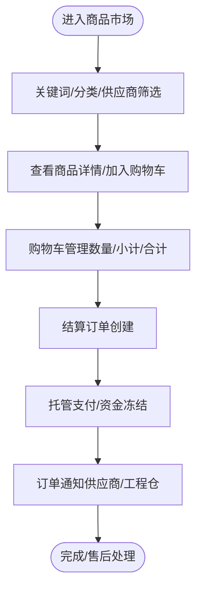
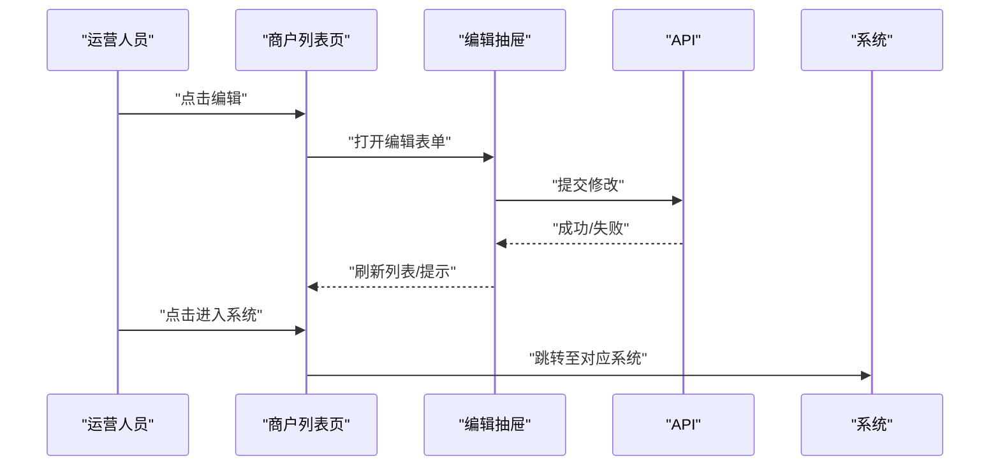
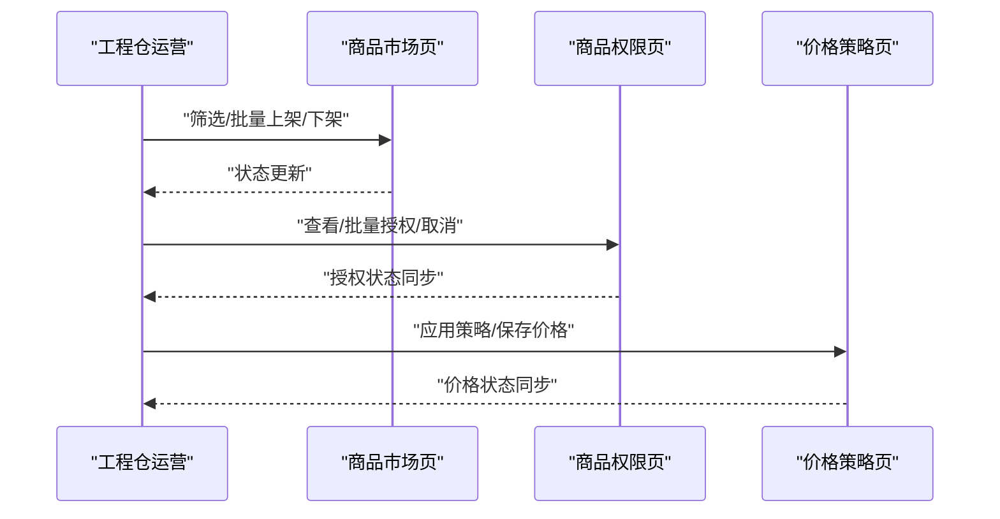
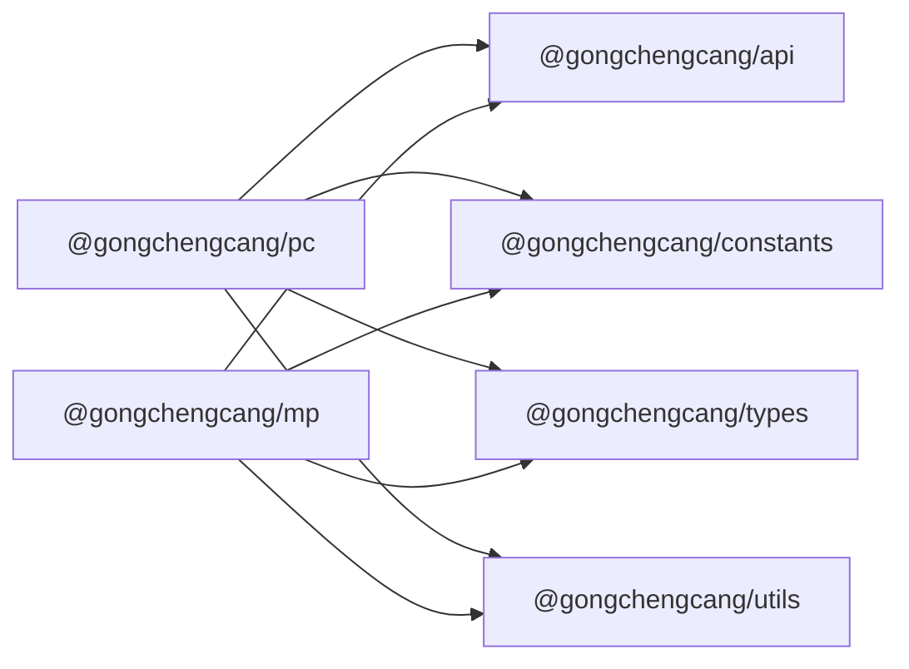

# 项目管理系统

<cite>
**本文引用的文件**
- [package.json](file://package.json)
- [apps/pc/package.json](file://apps/pc/package.json)
- [apps/mp/package.json](file://apps/mp/package.json)
- [docs/PRD/01-系统概览与架构.md](file://docs/PRD/01-系统概览与架构.md)
- [docs/PRD/02-业务流程设计.md](file://docs/PRD/02-业务流程设计.md)
- [docs/PRD/03-数据模型与表结构.md](file://docs/PRD/03-数据模型与表结构.md)
- [PRD-商品市场模块v1.0.md](file://PRD-商品市场模块v1.0.md)
- [apps/pc/src/views/construction/list/index.vue](file://apps/pc/src/views/construction/list/index.vue)
- [apps/pc/src/views/construction/market/index.vue](file://apps/pc/src/views/construction/market/index.vue)
- [apps/pc/src/views/construction/permission/index.vue](file://apps/pc/src/views/construction/permission/index.vue)
- [apps/pc/src/views/construction/price/index.vue](file://apps/pc/src/views/construction/price/index.vue)
- [apps/pc/src/views/merchant/list/index.vue](file://apps/pc/src/views/merchant/list/index.vue)
</cite>

## 目录
1. [简介](#简介)
2. [项目结构](#项目结构)
3. [核心组件](#核心组件)
4. [架构总览](#架构总览)
5. [详细组件分析](#详细组件分析)
6. [依赖分析](#依赖分析)
7. [性能考虑](#性能考虑)
8. [故障排查指南](#故障排查指南)
9. [结论](#结论)
10. [附录](#附录)

## 简介
本项目为“工程材料管理采供一体化平台”的前端实现，围绕“项目管理”“商品市场”“商户管理”等核心业务展开，覆盖平台端、供应商端、工程仓端与施工方端的多端协同。本文档聚焦于项目管理系统的功能设计、业务流程、数据模型、权限控制与异常处理，并提供最佳实践与进度控制方法。

## 项目结构
项目采用多包（monorepo）结构，包含平台前端（PC端）、小程序端以及共享的API、常量、类型与工具包。PC端基于Vue 3 + Arco Design，小程序端基于uni-app，通过统一的API与类型定义实现跨端协作。

图表来源
- [apps/pc/package.json:14-24](file://apps/pc/package.json#L14-L24)
- [apps/mp/package.json:12-24](file://apps/mp/package.json#L12-L24)
- [package.json:6-12](file://package.json#L6-L12)

章节来源
- [package.json:1-23](file://package.json#L1-23)
- [apps/pc/package.json:1-36](file://apps/pc/package.json#L1-36)
- [apps/mp/package.json:1-39](file://apps/mp/package.json#L1-39)

## 核心组件
- 项目管理（工程仓端/平台端）
  - 项目列表与筛选、项目详情、成员管理、预算管理、进度跟踪
- 商品市场（平台端/工程仓端）
  - 供应商品市场、销售商品市场、BOM基装包、价格策略、商品权限
- 商户管理（平台端）
  - 商户列表、合同管理、账号管理、状态控制

章节来源
- [docs/PRD/01-系统概览与架构.md:137-209](file://docs/PRD/01-系统概览与架构.md#L137-L209)
- [docs/PRD/02-业务流程设计.md:625-703](file://docs/PRD/02-业务流程设计.md#L625-L703)
- [PRD-商品市场模块v1.0.md:85-280](file://PRD-商品市场模块v1.0.md#L85-L280)

## 架构总览
系统采用“四端协同 + 业务服务层 + 数据持久层”的分层架构。PC端承载平台运营与工程仓管理，小程序端承载供应商与施工方日常操作；业务服务层负责项目、商品、订单、库存、财务等模块的业务编排；数据持久层支撑MySQL、Redis、ES、OSS等。

图表来源
- [docs/PRD/01-系统概览与架构.md:62-94](file://docs/PRD/01-系统概览与架构.md#L62-L94)
- [docs/PRD/01-系统概览与架构.md:96-117](file://docs/PRD/01-系统概览与架构.md#L96-L117)

## 详细组件分析

### 项目创建与管理
- 业务流程
  - 工程仓创建项目 → 分配施工方 → 施工方确认 → 项目启动
  - 项目状态机：待启动 → 进行中 → 已完工 → 已结算；支持暂停/取消/归档
  - 进度管理：施工方更新进度（完成百分比、照片、说明），工程仓审核并同步
- 操作步骤
  - 工程仓端：项目列表页 → 新增/编辑 → 分配施工方 → 启动项目
  - 平台端：项目概览 → 状态监控 → 异常处理（暂停/取消）
  - 施工方端：项目列表 → 查看详情 → 更新进度 → 上传照片
- 数据模型
  - 项目表（project）、项目成员表（project_member）、项目预算表（project_budget）、项目进度表（project_progress）
- 权限控制
  - 工程仓：项目创建、成员管理、预算维护、进度审核
  - 施工方：进度更新、查看详情
  - 平台：全局监控、异常处置
- 异常处理
  - 超时未确认 → 自动取消
  - 项目暂停/取消 → 状态回退与通知
  - 进度审核不通过 → 退回修改

图表来源
- [docs/PRD/02-业务流程设计.md:658-676](file://docs/PRD/02-业务流程设计.md#L658-L676)

章节来源
- [docs/PRD/02-业务流程设计.md:625-703](file://docs/PRD/02-业务流程设计.md#L625-L703)
- [docs/PRD/03-数据模型与表结构.md:241-296](file://docs/PRD/03-数据模型与表结构.md#L241-L296)

### 项目详情管理
- 详情查看
  - 项目基本信息、成员列表、预算明细、进度记录
- 成员详情
  - 成员角色、加入/离开时间、权限范围
- 预算详情
  - 预算类型、预算金额、实际消耗、差异分析
- 进度详情
  - 进度百分比、更新时间、照片证据、更新人
- 权限控制
  - 工程仓可编辑预算与进度；平台可审计；施工方仅可更新进度
- 异常处理
  - 进度滞后预警、预算超支提醒、成员权限失效处理

章节来源
- [docs/PRD/03-数据模型与表结构.md:241-296](file://docs/PRD/03-数据模型与表结构.md#L241-L296)

### 项目市场（商品市场、权限控制、价格策略）
- 供应商品市场（平台端）
  - 商品状态看板（全部/待上架/已上架/已下架）、分类导航树、筛选条件（关键词/分类/供应商/供货状态）
  - 批量运营（导入/批量上架/批量下架/批量调价/批量设置权限）
  - 商品表格字段（商品信息/分类/SPU/库存/供应商/供货状态/可见范围/操作）
- 销售商品市场（工程仓端）
  - 商品瀑布流展示（搜索/购物车/排序）、商品卡片规范（主图/营销标签/价格/加购按钮）
- 购物车
  - 批量删除、数量调整、实时计算、供应商分组
- BOM基装包管理
  - 列表页（筛选/字段/上架开关/操作）、创建向导（基本信息/SKU明细配置/标签）、权限配置（工程仓可见/同步上架）
- 权限控制（工程仓端）
  - 商品授权状态（已授权/未授权）、批量授权/取消、授权时间记录
- 价格策略（工程仓端）
  - 策略类型：默认价格、加价策略、折扣策略、自定义价格；应用策略后需保存确认

图表来源
- [PRD-商品市场模块v1.0.md:89-192](file://PRD-商品市场模块v1.0.md#L89-L192)
- [PRD-商品市场模块v1.0.md:194-227](file://PRD-商品市场模块v1.0.md#L194-L227)
- [PRD-商品市场模块v1.0.md:230-247](file://PRD-商品市场模块v1.0.md#L230-L247)

章节来源
- [PRD-商品市场模块v1.0.md:85-280](file://PRD-商品市场模块v1.0.md#L85-L280)

### 商户管理（平台端）
- 商户列表
  - 搜索/筛选（关键字/类型/入驻状态/启用状态）、行操作（查看/编辑/合同/账号/进入系统/删除）
  - 启用状态控制（Switch组件，入驻状态=已通过时可启用）
- 状态管理
  - 入驻状态机：待审核 → 审核通过（终态）/审核驳回（终态）
  - 启用状态：启用/禁用，禁用时隐藏“进入系统”
- 权限控制
  - 超级管理员：可删除商户、可进入系统
  - 平台管理员：可删除商户、可管理账号
  - 运营人员：可查看编辑
  - 只读用户：仅查看

图表来源
- [apps/pc/src/views/merchant/list/index.vue:606-730](file://apps/pc/src/views/merchant/list/index.vue#L606-L730)

章节来源
- [apps/pc/src/views/merchant/list/index.vue:1-731](file://apps/pc/src/views/merchant/list/index.vue#L1-L731)

### 工程仓端项目管理界面（PC）
- 项目列表
  - 工程仓名称/状态/可购商品/操作（编辑/商品权限/价格策略/删除）
  - 搜索与分页，权限控制（仅平台运营可见删除）
- 商品权限
  - 工程仓名称/已授权商品数、搜索/筛选（分类/授权状态）、批量授权/取消
- 价格策略
  - 策略类型（默认/加价/折扣/自定义）、应用策略、保存价格
- 商品市场
  - 工程仓主体/仓库/商品名称/状态筛选、分类树、批量上架/下架、调价

图表来源
- [apps/pc/src/views/construction/market/index.vue:621-698](file://apps/pc/src/views/construction/market/index.vue#L621-L698)
- [apps/pc/src/views/construction/permission/index.vue:173-262](file://apps/pc/src/views/construction/permission/index.vue#L173-L262)
- [apps/pc/src/views/construction/price/index.vue:210-289](file://apps/pc/src/views/construction/price/index.vue#L210-L289)

章节来源
- [apps/pc/src/views/construction/list/index.vue:1-237](file://apps/pc/src/views/construction/list/index.vue#L1-L237)
- [apps/pc/src/views/construction/market/index.vue:1-786](file://apps/pc/src/views/construction/market/index.vue#L1-L786)
- [apps/pc/src/views/construction/permission/index.vue:1-302](file://apps/pc/src/views/construction/permission/index.vue#L1-L302)
- [apps/pc/src/views/construction/price/index.vue:1-345](file://apps/pc/src/views/construction/price/index.vue#L1-L345)

## 依赖分析
- 前端依赖
  - PC端：@arco-design/web-vue、dayjs、pinia、vue、vue-router
  - 小程序端：@dcloudio/uni-app、@dcloudio/uni-mp-weixin、dayjs、pinia、vue
- 共享包
  - @gongchengcang/api、@gongchengcang/constants、@gongchengcang/types、@gongchengcang/utils
- 业务耦合
  - PC端与小程序端均依赖共享API与类型，降低重复开发与维护成本
  - 业务模块（项目、商品、订单、库存、财务）通过服务层解耦，便于扩展与演进

图表来源
- [apps/pc/package.json:14-24](file://apps/pc/package.json#L14-L24)
- [apps/mp/package.json:12-24](file://apps/mp/package.json#L12-L24)

章节来源
- [apps/pc/package.json:1-36](file://apps/pc/package.json#L1-36)
- [apps/mp/package.json:1-39](file://apps/mp/package.json#L1-39)

## 性能考虑
- 页面加载与接口响应
  - 首屏加载时间 < 2s，接口响应时间 < 500ms（95%）
- 并发与兼容
  - 支持1000+并发用户，浏览器与移动端兼容性满足主流版本
- 商品市场性能
  - 商品列表加载 < 1s，分类树渲染 < 500ms，购物车计算更新 < 100ms，支持500人同时在线

章节来源
- [docs/PRD/01-系统概览与架构.md:554-581](file://docs/PRD/01-系统概览与架构.md#L554-L581)
- [PRD-商品市场模块v1.0.md:250-279](file://PRD-商品市场模块v1.0.md#L250-L279)

## 故障排查指南
- 项目进度异常
  - 检查进度状态机流转是否符合预期；若审核不通过，退回修改并重新提交
- 商品权限问题
  - 确认工程仓主体与仓库绑定正确；批量授权/取消后需刷新页面
- 价格策略未生效
  - 应用策略后需点击“保存价格”，否则状态仍为“待保存”
- 商户状态异常
  - 入驻驳回将自动禁用账号；启用状态仅在入驻通过后可操作

章节来源
- [docs/PRD/02-业务流程设计.md:658-676](file://docs/PRD/02-业务流程设计.md#L658-L676)
- [apps/pc/src/views/construction/permission/index.vue:224-262](file://apps/pc/src/views/construction/permission/index.vue#L224-L262)
- [apps/pc/src/views/construction/price/index.vue:261-289](file://apps/pc/src/views/construction/price/index.vue#L261-L289)
- [apps/pc/src/views/merchant/list/index.vue:286-292](file://apps/pc/src/views/merchant/list/index.vue#L286-L292)

## 结论
本项目以“工程材料管理采供一体化”为核心，构建了覆盖四端的协同体系。通过清晰的业务流程、严谨的数据模型与完善的权限控制，实现了从项目创建到进度跟踪、从商品市场到价格策略的全链路闭环。建议在后续迭代中持续优化性能指标、强化异常监控与自动化运维，保障系统稳定与用户体验。

## 附录
- 术语定义
  - 平台端：平台运营方的管理后台（PC Web）
  - 供应商：建材供应商，商品的卖方
  - 工程仓：建筑工程采购方，商品的买方
  - 施工方：施工现场管理方，工程仓的下级单位
  - SPU：标准产品单位，商品信息聚合的最小单位
  - SKU：库存量单位，库存进出计量的基本单元
  - BOM：物料清单，基装包组合
  - 托管账户：资金托管账户，用于交易资金监管
  - 分账：交易资金按规则分配给各方
  - 领料：施工方从现场库存领取材料
  - 现场库存：施工现场的库存材料

章节来源
- [docs/PRD/01-系统概览与架构.md:599-614](file://docs/PRD/01-系统概览与架构.md#L599-L614)