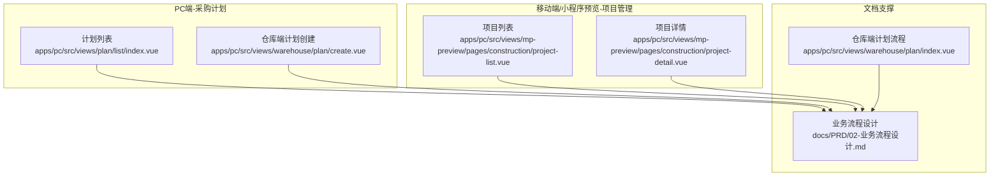
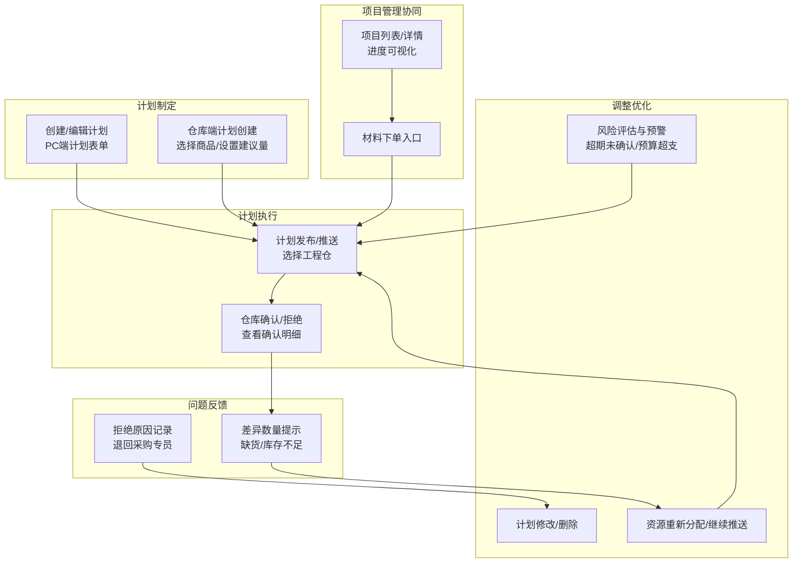
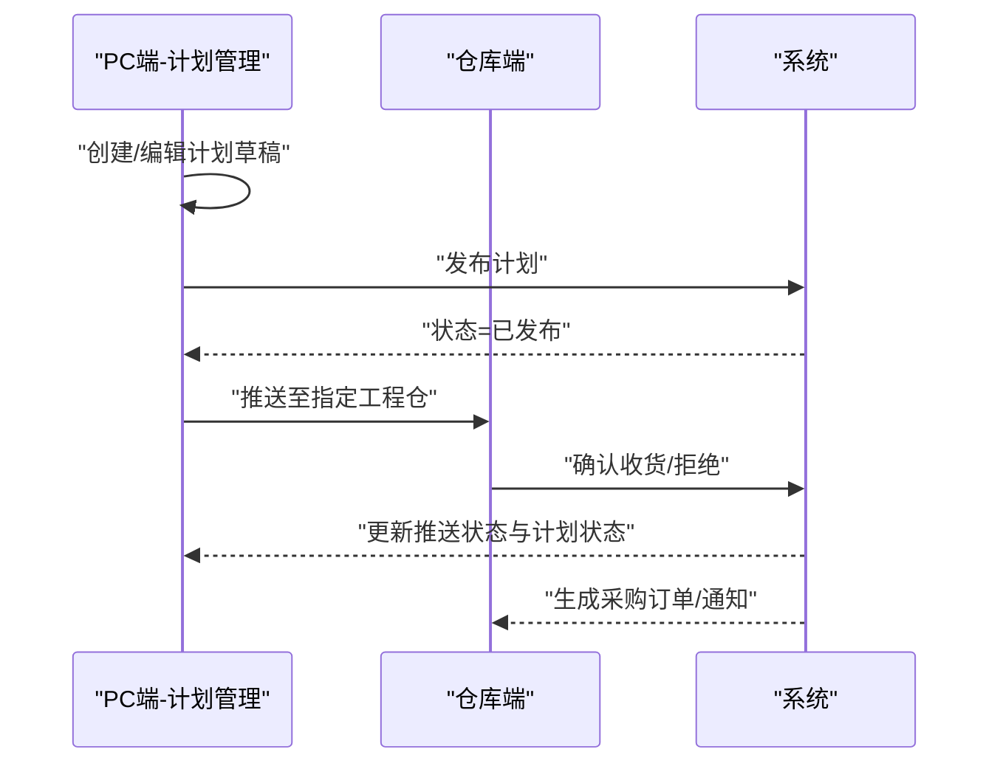
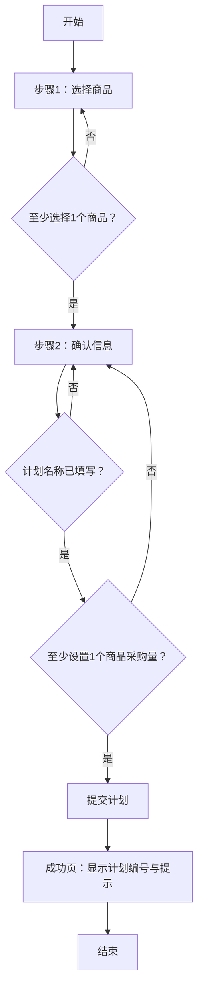
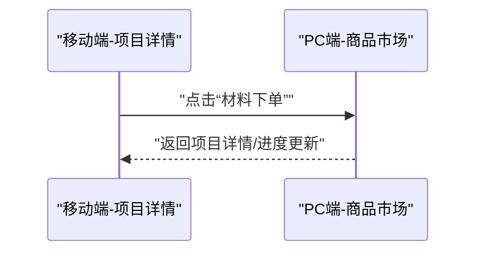
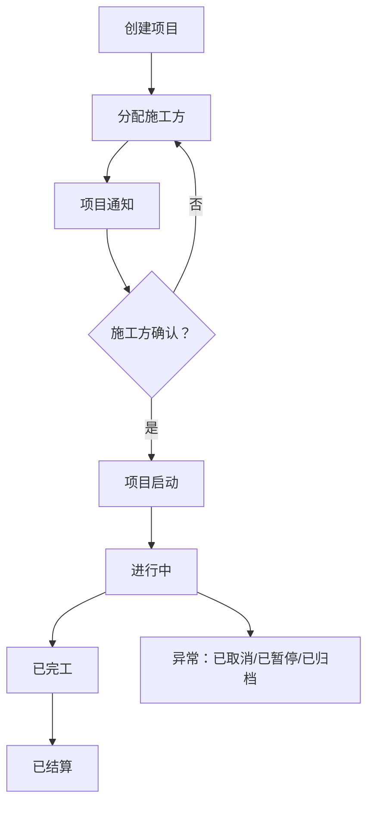
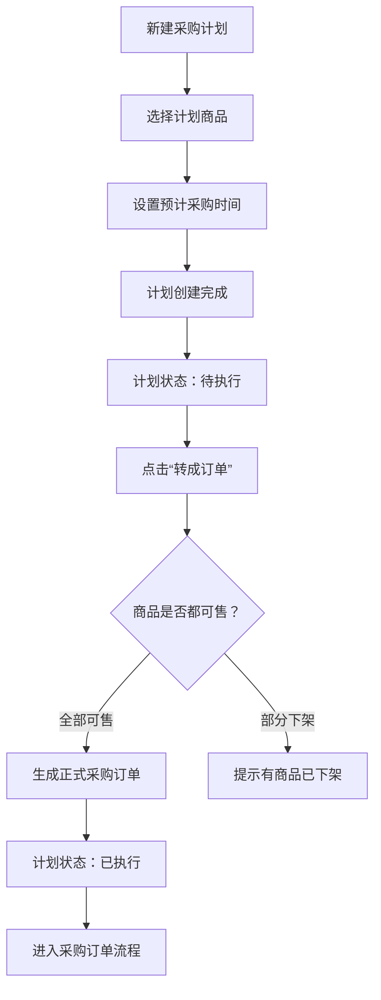
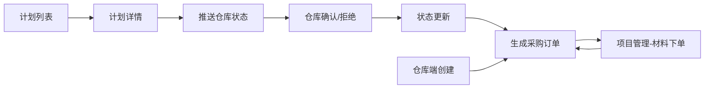

# 项目计划管理

<cite>
**本文引用的文件**   
- [apps/pc/src/views/plan/list/index.vue](file://apps/pc/src/views/plan/list/index.vue)
- [apps/pc/src/views/warehouse/plan/create.vue](file://apps/pc/src/views/warehouse/plan/create.vue)
- [apps/pc/src/views/mp-preview/pages/construction/project-list.vue](file://apps/pc/src/views/mp-preview/pages/construction/project-list.vue)
- [apps/pc/src/views/mp-preview/pages/construction/project-detail.vue](file://apps/pc/src/views/mp-preview/pages/construction/project-detail.vue)
- [docs/PRD/02-业务流程设计.md](file://docs/PRD/02-业务流程设计.md)
- [apps/pc/src/views/warehouse/plan/index.vue](file://apps/pc/src/views/warehouse/plan/index.vue)
</cite>

## 目录
1. [简介](#简介)
2. [项目结构](#项目结构)
3. [核心组件](#核心组件)
4. [架构总览](#架构总览)
5. [详细组件分析](#详细组件分析)
6. [依赖分析](#依赖分析)
7. [性能考量](#性能考量)
8. [故障排查指南](#故障排查指南)
9. [结论](#结论)
10. [附录](#附录)

## 简介
本文件围绕“项目计划管理”主题，系统化梳理工程仓侧的采购计划与项目管理能力，覆盖计划制定（计划任务创建、任务分配、时间安排）、计划执行跟踪（任务进度监控、完成状态更新、问题反馈）、计划调整优化（计划修改、资源重新分配、风险评估）等核心环节，并补充项目计划生命周期管理、甘特图展示、关键路径分析、资源冲突解决等实践建议。同时给出最佳实践与效率提升方法，帮助团队实现从“计划—执行—反馈—优化”的闭环。

## 项目结构
本项目采用多端（PC/移动端/小程序）与多角色（采购、仓库、施工方、平台）协作的前端应用结构。与“项目计划管理”直接相关的页面与模块包括：
- 采购计划管理（PC端）：计划列表、计划详情、发布/推送、确认/拒绝、明细查看
- 仓库端计划创建（仓库视角）：商品选择、计划信息、提交与成功提示
- 项目管理（移动端/小程序预览）：项目列表、项目详情、进度可视化
- PRD文档：项目管理流程、状态流转、异常处理与非功能性要求

**图表来源**
- [apps/pc/src/views/plan/list/index.vue:1-120](file://apps/pc/src/views/plan/list/index.vue#L1-L120)
- [apps/pc/src/views/warehouse/plan/create.vue:1-120](file://apps/pc/src/views/warehouse/plan/create.vue#L1-L120)
- [apps/pc/src/views/mp-preview/pages/construction/project-list.vue:1-120](file://apps/pc/src/views/mp-preview/pages/construction/project-list.vue#L1-L120)
- [apps/pc/src/views/mp-preview/pages/construction/project-detail.vue:1-120](file://apps/pc/src/views/mp-preview/pages/construction/project-detail.vue#L1-L120)
- [docs/PRD/02-业务流程设计.md:625-702](file://docs/PRD/02-业务流程设计.md#L625-L702)
- [apps/pc/src/views/warehouse/plan/index.vue:309-338](file://apps/pc/src/views/warehouse/plan/index.vue#L309-L338)

**章节来源**
- [apps/pc/src/views/plan/list/index.vue:1-120](file://apps/pc/src/views/plan/list/index.vue#L1-L120)
- [apps/pc/src/views/warehouse/plan/create.vue:1-120](file://apps/pc/src/views/warehouse/plan/create.vue#L1-L120)
- [apps/pc/src/views/mp-preview/pages/construction/project-list.vue:1-120](file://apps/pc/src/views/mp-preview/pages/construction/project-list.vue#L1-L120)
- [apps/pc/src/views/mp-preview/pages/construction/project-detail.vue:1-120](file://apps/pc/src/views/mp-preview/pages/construction/project-detail.vue#L1-L120)
- [docs/PRD/02-业务流程设计.md:625-702](file://docs/PRD/02-业务流程设计.md#L625-L702)
- [apps/pc/src/views/warehouse/plan/index.vue:309-338](file://apps/pc/src/views/warehouse/plan/index.vue#L309-L338)

## 核心组件
- 采购计划管理（PC端）
  - 计划列表：支持按编号/名称/状态筛选；展示SKU数量、预计金额、推送仓库、状态、创建时间；提供查看、编辑、发布、继续推送、删除、取消计划等操作。
  - 计划详情：展示计划基础信息、推送仓库状态、确认汇总、采购商品清单。
  - 发布/推送：选择工程仓，推送至仓库；支持继续推送。
  - 仓库协同：仓库确认/拒绝；查看确认明细；差异数量提示。
- 仓库端计划创建（仓库视角）
  - 商品选择：按关键字/库存状态筛选，支持全选低库存商品；勾选商品并设置建议采购量。
  - 计划信息：设置计划名称、截止时间、说明。
  - 提交与成功：提交后进入成功页，自动推送给相关供应商。
- 项目管理（移动端/小程序预览）
  - 项目列表：按状态筛选（全部/进行中/已完成），展示项目进度条、预算/下单/收货金额、开工日期、操作按钮。
  - 项目详情：展示项目基本信息、状态标签、进度环形图、图纸上传区域、下单入口。

**章节来源**
- [apps/pc/src/views/plan/list/index.vue:1-120](file://apps/pc/src/views/plan/list/index.vue#L1-L120)
- [apps/pc/src/views/plan/list/index.vue:1200-1600](file://apps/pc/src/views/plan/list/index.vue#L1200-L1600)
- [apps/pc/src/views/warehouse/plan/create.vue:1-120](file://apps/pc/src/views/warehouse/plan/create.vue#L1-L120)
- [apps/pc/src/views/warehouse/plan/create.vue:356-371](file://apps/pc/src/views/warehouse/plan/create.vue#L356-L371)
- [apps/pc/src/views/mp-preview/pages/construction/project-list.vue:1-120](file://apps/pc/src/views/mp-preview/pages/construction/project-list.vue#L1-L120)
- [apps/pc/src/views/mp-preview/pages/construction/project-detail.vue:1-120](file://apps/pc/src/views/mp-preview/pages/construction/project-detail.vue#L1-L120)

## 架构总览
项目计划管理由“计划制定—计划执行—问题反馈—计划调整优化”构成闭环，贯穿采购端与仓库端，同时与项目管理形成协同。

**图表来源**
- [apps/pc/src/views/plan/list/index.vue:1384-1559](file://apps/pc/src/views/plan/list/index.vue#L1384-L1559)
- [apps/pc/src/views/warehouse/plan/create.vue:356-371](file://apps/pc/src/views/warehouse/plan/create.vue#L356-L371)
- [apps/pc/src/views/mp-preview/pages/construction/project-list.vue:1-120](file://apps/pc/src/views/mp-preview/pages/construction/project-list.vue#L1-L120)
- [apps/pc/src/views/mp-preview/pages/construction/project-detail.vue:100-106](file://apps/pc/src/views/mp-preview/pages/construction/project-detail.vue#L100-L106)

## 详细组件分析

### 1) 采购计划管理（PC端）
- 功能要点
  - 列表与筛选：支持计划编号/名称/状态筛选；展示SKU数量、预计金额、推送仓库、状态、创建时间；固定右侧操作列。
  - 详情与推送：详情页展示计划基础信息、推送仓库状态、确认汇总、采购商品清单；支持继续推送。
  - 仓库协同：仓库确认/拒绝；查看确认明细；差异数量提示；状态自动更新。
  - 操作流程：创建/编辑草稿 → 发布 → 推送仓库 → 仓库确认/拒绝 → 生成采购订单/计划完成。
- 关键状态与流转
  - 草稿 → 已发布 → 待确认 → 已确认 → 已完成
  - 草稿/已发布 → 已取消
  - 异常：超期未确认自动提醒；计划作废同步作废采购单；预算超支预警。
- 数据与交互
  - 推送仓库列表支持悬浮查看各子仓库确认状态；支持全选/部分选择；已推送仓库禁选。
  - 确认明细展示计划量与实际确认量对比，差异量以红色标注。

**图表来源**
- [apps/pc/src/views/plan/list/index.vue:1417-1461](file://apps/pc/src/views/plan/list/index.vue#L1417-L1461)
- [apps/pc/src/views/plan/list/index.vue:1482-1510](file://apps/pc/src/views/plan/list/index.vue#L1482-L1510)
- [apps/pc/src/views/plan/list/index.vue:1533-1545](file://apps/pc/src/views/plan/list/index.vue#L1533-L1545)

**章节来源**
- [apps/pc/src/views/plan/list/index.vue:1-120](file://apps/pc/src/views/plan/list/index.vue#L1-L120)
- [apps/pc/src/views/plan/list/index.vue:1200-1600](file://apps/pc/src/views/plan/list/index.vue#L1200-L1600)
- [apps/pc/src/views/plan/list/index.vue:1384-1559](file://apps/pc/src/views/plan/list/index.vue#L1384-L1559)

### 2) 仓库端计划创建（仓库视角）
- 功能要点
  - 商品选择：按关键字/库存状态筛选，支持全选低库存商品；勾选商品并设置建议采购量。
  - 计划信息：设置计划名称、截止时间、说明。
  - 提交与成功：提交后进入成功页，自动推送给相关供应商。
- 流程与校验
  - 步骤1：选择商品（至少选择1个商品）
  - 步骤2：确认信息（计划名称必填；至少设置1个商品的采购数量）
  - 步骤3：提交成功，显示计划编号与提示

**图表来源**
- [apps/pc/src/views/warehouse/plan/create.vue:322-371](file://apps/pc/src/views/warehouse/plan/create.vue#L322-L371)

**章节来源**
- [apps/pc/src/views/warehouse/plan/create.vue:1-120](file://apps/pc/src/views/warehouse/plan/create.vue#L1-L120)
- [apps/pc/src/views/warehouse/plan/create.vue:322-371](file://apps/pc/src/views/warehouse/plan/create.vue#L322-L371)

### 3) 项目管理（移动端/小程序预览）
- 功能要点
  - 项目列表：按状态筛选（全部/进行中/已完成），展示项目进度条、预算/下单/收货金额、开工日期、操作按钮。
  - 项目详情：展示项目基本信息、状态标签、进度环形图、图纸上传区域、下单入口。
- 与计划管理的协同
  - 项目详情页提供“材料下单”入口，引导用户进入商品市场下单，与采购计划形成闭环。

**图表来源**
- [apps/pc/src/views/mp-preview/pages/construction/project-detail.vue:100-106](file://apps/pc/src/views/mp-preview/pages/construction/project-detail.vue#L100-L106)

**章节来源**
- [apps/pc/src/views/mp-preview/pages/construction/project-list.vue:1-120](file://apps/pc/src/views/mp-preview/pages/construction/project-list.vue#L1-L120)
- [apps/pc/src/views/mp-preview/pages/construction/project-detail.vue:1-120](file://apps/pc/src/views/mp-preview/pages/construction/project-detail.vue#L1-L120)

### 4) 项目管理流程与状态流转（PRD支撑）
- 项目创建流程：工程仓 → 平台系统 → 施工方，涉及创建项目、分配施工方、项目通知、确认项目、项目启动。
- 项目状态流转：待启动 → 进行中 → 已完工 → 已结算；支持已取消、已暂停、已归档等异常状态。
- 项目进度管理：施工方更新进度（完成百分比、施工照片、进度说明）→ 工程仓审核进度 → 平台系统同步 → 施工方进度更新通知。

**图表来源**
- [docs/PRD/02-业务流程设计.md:625-676](file://docs/PRD/02-业务流程设计.md#L625-L676)

**章节来源**
- [docs/PRD/02-业务流程设计.md:625-676](file://docs/PRD/02-业务流程设计.md#L625-L676)

### 5) 仓库端计划执行流程（PRD支撑）
- 新建采购计划 → 选择计划商品 → 设置预计采购时间 → 计划创建完成 → 计划状态：待执行 → 点击“转成订单” → 商品是否都可售？→ 全部可售则生成正式采购订单 → 计划状态：已执行 → 进入采购订单流程。

**图表来源**
- [scripts/产品功能清单/工程仓端_产品功能清单.md:139-153](file://scripts/产品功能清单/工程仓端_产品功能清单.md#L139-L153)

**章节来源**
- [scripts/产品功能清单/工程仓端_产品功能清单.md:139-153](file://scripts/产品功能清单/工程仓端_产品功能清单.md#L139-L153)

## 依赖分析
- 组件耦合与职责
  - 计划列表与详情：高度依赖推送仓库状态与确认明细的数据结构；状态计算依赖推送列表的聚合。
  - 仓库端创建：依赖商品列表与供应商绑定信息；提交阶段依赖校验与成功页。
  - 项目管理：与计划管理通过“材料下单”形成弱耦合，数据不直接共享，但业务闭环打通。
- 外部依赖与集成点
  - 系统消息与通知：超期未确认自动提醒、计划作废通知、供应商通知。
  - 数据一致性：计划作废需同步作废相关采购单；仓库拒绝需退回采购专员重新分配。

**图表来源**
- [apps/pc/src/views/plan/list/index.vue:1482-1510](file://apps/pc/src/views/plan/list/index.vue#L1482-L1510)
- [apps/pc/src/views/plan/list/index.vue:1533-1545](file://apps/pc/src/views/plan/list/index.vue#L1533-L1545)
- [apps/pc/src/views/warehouse/plan/create.vue:356-371](file://apps/pc/src/views/warehouse/plan/create.vue#L356-L371)
- [apps/pc/src/views/mp-preview/pages/construction/project-detail.vue:100-106](file://apps/pc/src/views/mp-preview/pages/construction/project-detail.vue#L100-L106)

**章节来源**
- [apps/pc/src/views/plan/list/index.vue:1482-1510](file://apps/pc/src/views/plan/list/index.vue#L1482-L1510)
- [apps/pc/src/views/plan/list/index.vue:1533-1545](file://apps/pc/src/views/plan/list/index.vue#L1533-L1545)
- [apps/pc/src/views/warehouse/plan/create.vue:356-371](file://apps/pc/src/views/warehouse/plan/create.vue#L356-L371)
- [apps/pc/src/views/mp-preview/pages/construction/project-detail.vue:100-106](file://apps/pc/src/views/mp-preview/pages/construction/project-detail.vue#L100-L106)

## 性能考量
- 列表性能：列表加载时间 < 1 秒；支持 1000+ SKU 大计划流畅编辑；10000 条计划数据下筛选响应 < 500ms。
- 数据渲染：使用虚拟滚动/分页减少DOM压力；Popover悬浮层按需渲染。
- 交互优化：发布/取消等敏感操作二次确认，避免误操作带来的重渲染成本。
- 安全与埋点：价格字段权限控制；计划创建/发布/确认/取消埋点，便于后续性能与使用分析。

[本节为通用指导，不直接分析具体文件]

## 故障排查指南
- 仓库拒收
  - 现象：仓库拒绝后计划状态未更新，或未生成采购单。
  - 处理：检查拒绝原因是否填写；确认状态更新函数是否被调用；核对推送列表状态聚合逻辑。
- 超期未确认
  - 现象：超过48小时未确认，无提醒。
  - 处理：检查定时任务或轮询机制；确保企业微信提醒通道可用。
- 预算超支
  - 现象：预计金额超预算未预警。
  - 处理：检查预算阈值配置与预警触发逻辑；确保预算字段权限控制生效。
- 计划作废
  - 现象：取消计划后相关采购单未作废。
  - 处理：检查取消接口是否调用作废流程；确保事务一致性。

**章节来源**
- [apps/pc/src/views/plan/list/index.vue:1547-1551](file://apps/pc/src/views/plan/list/index.vue#L1547-L1551)
- [apps/pc/src/views/plan/list/index.vue:1518-1531](file://apps/pc/src/views/plan/list/index.vue#L1518-L1531)
- [docs/PRD/02-业务流程设计.md:858-862](file://docs/PRD/02-业务流程设计.md#L858-L862)

## 结论
项目计划管理通过“计划制定—执行—反馈—调整优化”的闭环，结合仓库端计划创建与PC端计划协同，实现了从需求汇总到执行落地的全链路可追溯。配合项目管理的进度可视化与下单入口，进一步强化了计划与项目的协同效应。建议在现有基础上完善甘特图与关键路径分析、资源冲突检测与自动化解方案，持续优化计划执行效率与风险控制能力。

[本节为总结性内容，不直接分析具体文件]

## 附录
- 项目计划生命周期管理建议
  - 生命周期阶段：需求收集 → 计划制定 → 审批发布 → 推送执行 → 状态跟踪 → 异常处理 → 完成归档。
  - 关键路径分析：识别关键物料与关键仓库，优先保障关键路径资源到位，缩短整体交付周期。
  - 甘特图展示：以里程碑为节点，结合计划开始/结束时间与仓库确认时间，形成可视化甘特图。
  - 资源冲突解决：当多个计划在同一仓库/同一供应商冲突时，引入优先级排序与协商机制，必要时拆分/合并计划。
- 最佳实践与效率提升
  - 标准化模板：统一计划模板与审批流，减少沟通成本。
  - 自动化推送：基于安全库存与销售预测自动生成计划建议，降低人工录入负担。
  - 实时对账：计划与订单/入库/结算数据实时对账，提升透明度与准确性。
  - 风险预警：建立超期/超预算/缺货等预警机制，前置干预。

[本节为概念性内容，不直接分析具体文件]